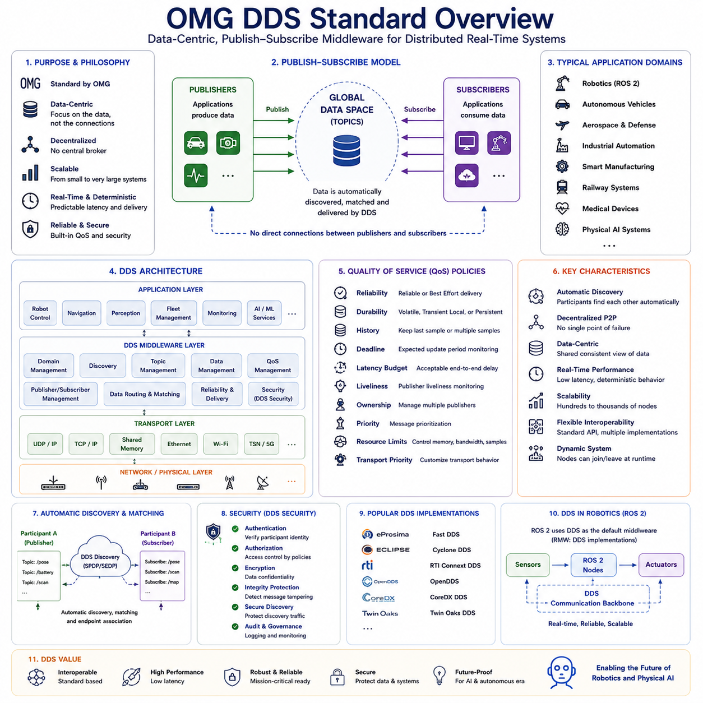
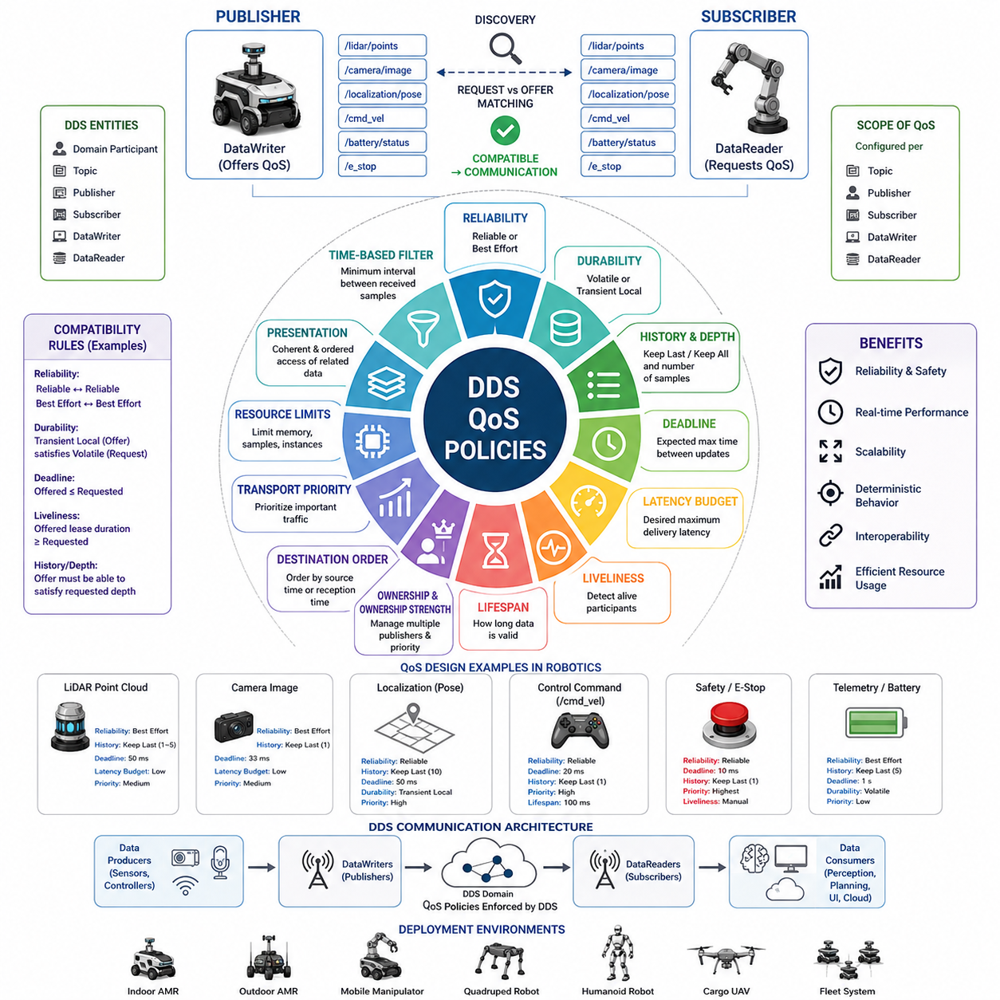
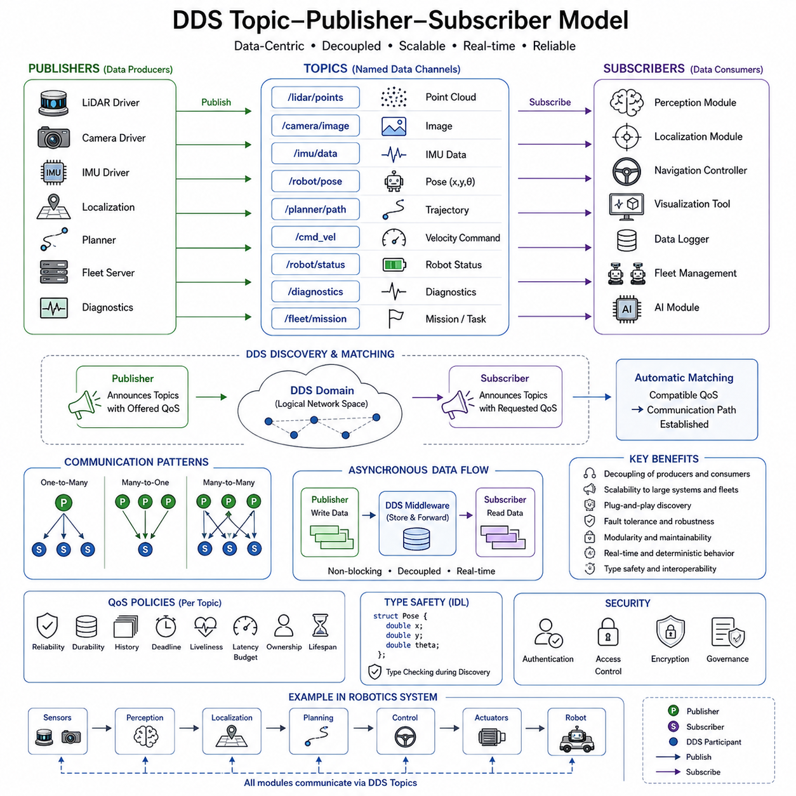
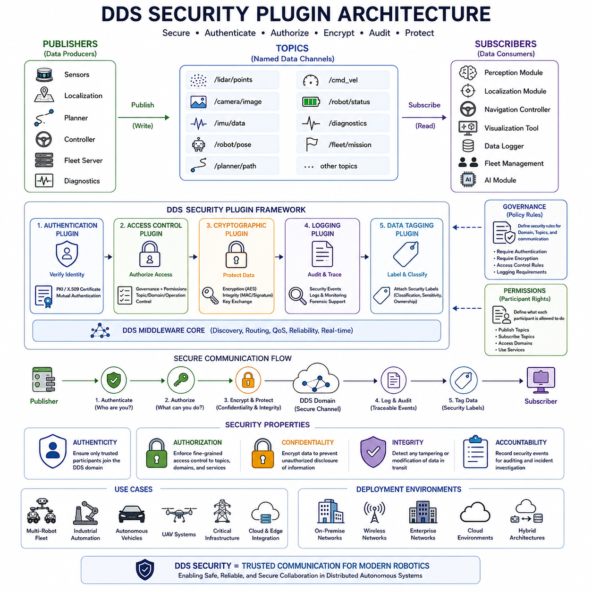
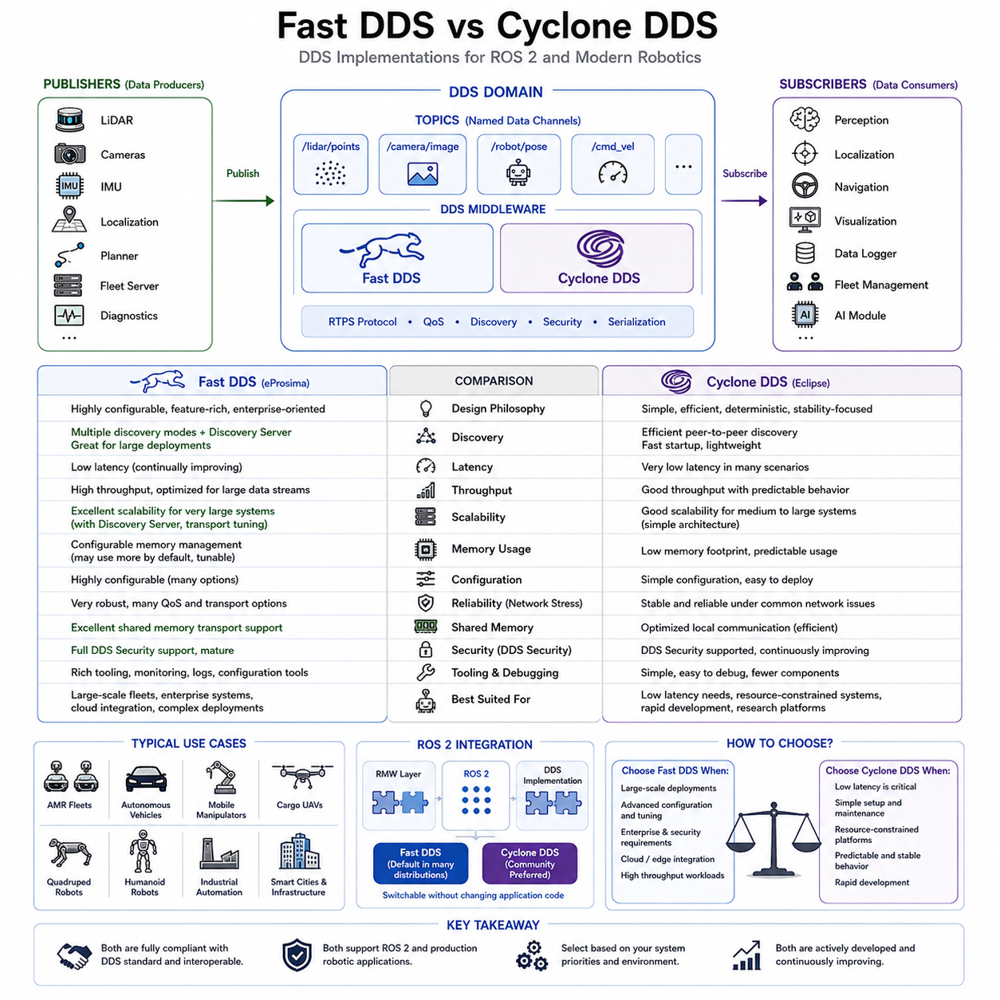

**Volume 09 Robotics Communication**


# Chapter 1. DDS

##  

## 1.1 OMG DDS Standard Overview

{width="7.268055555555556in" height="7.268055555555556in"}

The Object Management Group (OMG) Data Distribution Service (DDS) Standard represents one of the most important communication technologies for modern distributed real-time systems. DDS was developed to address the growing need for scalable, reliable, deterministic, and data-centric communication in complex cyber-physical systems. Unlike traditional client-server communication models, DDS was designed from the beginning to support decentralized architectures where large numbers of distributed computing nodes exchange information in real time without relying on centralized brokers or message servers. As a result, DDS has become a foundational communication technology in robotics, autonomous vehicles, aerospace systems, defense platforms, industrial automation, smart manufacturing, railway control systems, medical devices, and emerging Physical AI infrastructures. Within modern robotics, DDS serves as the underlying communication backbone of ROS2 (Robot Operating System 2), making it one of the most widely deployed middleware technologies in advanced robotic systems.

The development of DDS emerged from the limitations of earlier communication architectures. Traditional communication systems often relied on tightly coupled client-server models where one device explicitly requested information from another device. While this approach was suitable for many business applications, it introduced significant challenges in real-time distributed systems. Large-scale autonomous systems frequently contain hundreds or thousands of communication participants generating continuous streams of sensor data, control commands, status messages, diagnostic information, telemetry data, and artificial intelligence outputs. Maintaining direct communication links between all participants quickly becomes impractical as system complexity increases. DDS was created to solve this problem by introducing a data-centric publish-subscribe communication paradigm.

The fundamental philosophy of DDS is that data should be the primary focus of communication rather than individual network connections. In DDS architectures, applications do not communicate directly with each other. Instead, they communicate through shared information spaces known as Global Data Spaces. Publishers generate data and make it available to the network, while subscribers express interest in specific categories of information. DDS automatically manages discovery, matching, transport, reliability, and delivery. This abstraction dramatically simplifies application development while improving scalability.

At the core of DDS is the publish-subscribe communication model. A Publisher creates data associated with a specific Topic. A Subscriber expresses interest in that Topic and automatically receives relevant information whenever it becomes available. Neither the publisher nor the subscriber needs explicit knowledge of the other. This decoupling significantly reduces system dependencies and enables flexible system architectures. New devices can join the network dynamically without requiring modifications to existing applications.

Topics represent one of the most important concepts within DDS. A Topic defines a specific category of information that can be exchanged throughout the system. Examples in robotics include robot position, battery status, motor commands, camera images, LiDAR point clouds, navigation goals, obstacle information, diagnostic reports, and AI inference results. Each Topic has an associated data type that specifies the structure of information being exchanged. The DDS middleware ensures that publishers and subscribers using compatible Topic definitions can communicate seamlessly.

The DDS architecture is organized into several layers. The application layer contains user software such as robot control systems, autonomous navigation modules, perception algorithms, fleet management services, and monitoring tools. Beneath the application layer resides the DDS middleware layer responsible for communication management. Below DDS are transport services utilizing Ethernet, Wi-Fi, TCP/IP, UDP/IP, shared memory, real-time networks, or specialized communication infrastructures. This layered architecture allows DDS applications to remain independent of underlying communication technologies.

One of the defining characteristics of DDS is its data-centric nature. Unlike message-centric systems that focus primarily on transmitting messages between endpoints, DDS focuses on maintaining a consistent and shared view of data across the entire distributed system. The middleware understands the structure, ownership, lifecycle, and quality requirements of data objects. This awareness enables advanced communication optimizations that are difficult to achieve in traditional messaging systems.

Automatic discovery is another key feature of DDS. In conventional distributed systems, administrators often need to manually configure communication endpoints, addresses, and routing information. DDS eliminates much of this complexity through automatic participant discovery. When a new device joins the network, it announces its presence and discovers other participants automatically. Publishers and subscribers identify compatible communication partners without requiring manual configuration. This capability significantly simplifies deployment and maintenance in large-scale systems.

Real-time performance is one of the primary reasons DDS has achieved widespread adoption in robotics and autonomous systems. Many robotic applications require deterministic communication behavior with predictable latency and timing characteristics. Motion control systems, obstacle avoidance algorithms, sensor fusion pipelines, autonomous navigation systems, and safety controllers all depend on timely information delivery. DDS provides extensive mechanisms for controlling latency, bandwidth utilization, delivery reliability, message prioritization, and resource allocation to satisfy real-time requirements.

Quality of Service (QoS) policies are among the most powerful features of DDS. QoS policies allow developers to define communication behavior according to application requirements. Different data streams often have different priorities and performance expectations. For example, emergency stop commands require extremely low latency and high reliability, while diagnostic information may tolerate delays or occasional message loss. DDS QoS policies allow each communication channel to be configured independently.

Reliability QoS determines whether data delivery should be guaranteed or best-effort. Reliable communication ensures that messages are retransmitted if delivery failures occur. Best-effort communication prioritizes speed and efficiency while accepting occasional packet loss. Robotics systems frequently employ both approaches simultaneously depending on operational requirements.

Durability QoS controls data persistence. Certain information should only be delivered to currently active subscribers, while other information may need to remain available for future subscribers joining the network. DDS allows developers to define how long information remains accessible after publication. This capability is particularly useful for configuration data, operational status information, and initialization parameters.

History QoS specifies how much previously published information should be retained. Applications may require only the most recent data sample or multiple historical samples. Sensor systems often use short histories to minimize memory consumption, while diagnostic and analytics applications may retain larger histories for analysis purposes.

Deadline QoS defines expected update frequencies. Subscribers can detect communication failures when publishers fail to provide information within predefined time intervals. This capability supports fault detection, health monitoring, and safety supervision functions within autonomous systems.

Latency Budget QoS allows applications to communicate acceptable delivery delays. The middleware can use this information to optimize network resource allocation while satisfying application timing requirements. Similar mechanisms exist for bandwidth management, message ordering, resource limits, and transport prioritization.

DDS employs a peer-to-peer architecture that eliminates the need for centralized message brokers. Many messaging systems rely on broker servers that receive and redistribute all communication traffic. While this approach simplifies certain aspects of system management, it can introduce bottlenecks, single points of failure, and scalability limitations. DDS participants communicate directly whenever possible, improving performance and increasing fault tolerance.

Scalability is one of DDS\'s most important advantages. Small systems may contain only a few communication participants, while large autonomous ecosystems may involve thousands of devices distributed across multiple networks. DDS was designed to support this entire spectrum. Automatic discovery, decentralized communication, efficient multicast utilization, and advanced QoS mechanisms enable DDS to scale effectively without fundamental architectural changes.

Security has become increasingly important as robotic systems connect to cloud platforms, enterprise networks, industrial infrastructure, and public communication channels. DDS Security extends the core DDS specification with comprehensive cybersecurity capabilities. Security features include authentication, authorization, encryption, access control, message integrity verification, secure discovery, and audit logging. These mechanisms help protect distributed systems against unauthorized access and malicious attacks.

DDS Security employs certificate-based authentication to verify participant identities. Access control policies determine which participants may publish or subscribe to specific Topics. Encryption protects sensitive information during transmission. Integrity verification ensures that messages cannot be modified without detection. Together, these features create a robust security framework suitable for safety-critical and mission-critical environments.

ROS2 represents one of the most visible implementations of DDS technology. Unlike ROS1, which relied on custom communication mechanisms, ROS2 adopted DDS as its middleware foundation. This decision provided ROS2 with enterprise-grade communication capabilities including automatic discovery, QoS management, real-time performance, security support, and scalability. As a result, DDS has become deeply integrated into modern robotics development.

Multiple DDS implementations exist within the industry. Examples include Fast DDS, Cyclone DDS, RTI Connext DDS, OpenDDS, CoreDX DDS, and Twin Oaks DDS. While all implementations conform to OMG DDS standards, they may differ in performance characteristics, supported features, licensing models, resource utilization, and optimization strategies. This interoperability allows organizations to select implementations that best satisfy their requirements while maintaining compatibility with standardized DDS interfaces.

DDS plays a critical role in autonomous robotics systems. Sensor data from cameras, LiDARs, radars, IMUs, GNSS receivers, motor controllers, and environmental sensors must be distributed efficiently throughout the robotic architecture. Perception systems generate object detections, semantic maps, and obstacle information. Planning systems generate trajectories and navigation goals. Control systems issue actuator commands. Fleet management systems coordinate multiple robots simultaneously. DDS provides the communication infrastructure connecting these functional modules.

Industrial automation environments similarly benefit from DDS technology. Modern factories increasingly employ distributed intelligence, collaborative robots, digital twins, predictive maintenance systems, edge computing platforms, and Industrial Internet of Things architectures. DDS enables real-time information exchange across these heterogeneous systems while supporting deterministic performance requirements.

Aerospace and defense applications were among the earliest adopters of DDS. Mission-critical systems require extremely reliable communication under challenging operational conditions. DDS supports radar systems, command-and-control platforms, unmanned systems, aircraft avionics, naval combat systems, satellite operations, and distributed sensor networks. The standard\'s emphasis on real-time performance and reliability aligns closely with the requirements of these domains.

The emergence of Physical AI further increases the importance of DDS. Future intelligent systems will combine robotics, artificial intelligence, cloud computing, edge computing, autonomous decision-making, and distributed sensing into highly interconnected ecosystems. These systems require communication infrastructures capable of transporting perception data, AI inference results, language model outputs, action plans, control commands, world models, and multimodal sensor information. DDS provides a strong foundation for supporting these complex communication requirements.

Future developments are expected to expand DDS capabilities even further. Integration with Time Sensitive Networking (TSN), 5G communication systems, edge computing architectures, cloud-native infrastructures, AI-native middleware frameworks, and next-generation autonomous systems will continue enhancing DDS relevance. Advanced resource management, adaptive QoS optimization, intelligent routing, and AI-assisted communication management may become increasingly important areas of innovation.

Ultimately, the OMG DDS Standard represents far more than a communication protocol. It is a comprehensive data distribution framework specifically designed for large-scale distributed real-time systems. By combining publish-subscribe communication, data-centric architecture, automatic discovery, QoS management, decentralized operation, cybersecurity support, and scalability, DDS provides the communication foundation required by modern robotics, autonomous systems, industrial automation platforms, and future Physical AI ecosystems. For ROS2-based robotics and next-generation intelligent machines, DDS has become one of the most important enabling technologies supporting reliable, scalable, and real-time system integration.

# 01_01_OMG_DDS_Standard_Overview (OMG DDS 표준 개요)

OMG(Object Management Group)의 DDS(Data Distribution Service) 표준은 현대 분산 실시간 시스템(Distributed Real-Time System)을 위한 가장 중요한 통신 기술 중 하나이다. DDS는 복잡한 사이버-물리 시스템(Cyber-Physical System)에서 확장 가능하고(Scalable), 신뢰성이 높으며(Reliable), 결정론적(Deterministic)이고 데이터 중심적인(Data-Centric) 통신을 제공하기 위해 개발되었다. 전통적인 클라이언트-서버(Client-Server) 통신 모델과 달리 DDS는 중앙 서버나 메시지 브로커(Message Broker)에 의존하지 않고 수많은 분산 컴퓨팅 노드(Distributed Computing Node)가 실시간으로 데이터를 교환할 수 있도록 설계되었다. 이러한 특성 덕분에 DDS는 로봇공학(Robotics), 자율주행 시스템(Autonomous System), 항공우주(Aerospace), 국방 시스템(Defense Platform), 산업 자동화(Industrial Automation), 스마트 제조(Smart Manufacturing), 철도 제어 시스템(Railway Control System), 의료기기(Medical Device), 그리고 미래의 피지컬 AI(Physical AI) 인프라에서 핵심 통신 기술로 자리 잡았다. 특히 DDS는 ROS2(Robot Operating System 2)의 기본 미들웨어(Middleware)로 채택되면서 현대 로봇 시스템에서 가장 널리 사용되는 통신 프레임워크 중 하나가 되었다.

DDS는 기존 통신 아키텍처의 한계를 극복하기 위해 등장하였다. 과거의 통신 시스템은 일반적으로 클라이언트와 서버가 직접 연결되는 구조를 사용하였다. 이러한 방식은 비즈니스 애플리케이션에서는 효과적이었지만, 실시간 분산 시스템에서는 여러 가지 문제를 야기하였다. 대규모 자율 시스템은 수백 또는 수천 개의 노드가 센서 데이터, 제어 명령, 상태 정보, 진단 데이터, 텔레메트리(Telemetry), 인공지능 추론 결과 등을 지속적으로 생성한다. 모든 장치가 서로 직접 연결되어야 한다면 시스템 복잡도는 기하급수적으로 증가하게 된다. DDS는 이러한 문제를 해결하기 위해 데이터 중심의 발행-구독(Publish-Subscribe) 모델을 도입하였다.

DDS의 핵심 철학은 "장치 간 연결(Connection)이 아니라 데이터(Data)가 통신의 중심이 되어야 한다"는 것이다. DDS 환경에서는 애플리케이션이 서로 직접 통신하지 않는다. 대신 글로벌 데이터 공간(Global Data Space)이라는 개념을 통해 정보를 공유한다. 발행자(Publisher)는 데이터를 생성하고, 구독자(Subscriber)는 특정 데이터에 관심을 등록한다. DDS 미들웨어는 자동으로 검색(Discovery), 매칭(Matching), 전송(Transport), 신뢰성(Reliability), 데이터 전달(Delivery)을 수행한다. 이러한 추상화는 시스템 설계를 단순화하면서도 높은 확장성을 제공한다.

DDS의 가장 기본적인 통신 모델은 발행-구독 모델이다. 발행자는 특정 토픽(Topic)에 대한 데이터를 생성한다. 구독자는 해당 토픽에 대한 관심을 등록하고, 데이터가 생성될 때마다 자동으로 수신한다. 발행자와 구독자는 서로의 존재를 알 필요가 없다. 이러한 느슨한 결합(Loose Coupling)은 시스템 유연성을 크게 향상시키며, 새로운 장치가 추가되더라도 기존 시스템을 수정할 필요가 없다.

토픽은 DDS에서 가장 중요한 개념 중 하나이다. 토픽은 시스템 전체에서 공유되는 특정 정보의 범주(Category)를 정의한다. 로봇 시스템에서는 로봇 위치(Robot Position), 배터리 상태(Battery Status), 모터 명령(Motor Command), 카메라 영상(Camera Image), LiDAR 포인트 클라우드(Point Cloud), 내비게이션 목표(Navigation Goal), 장애물 정보(Obstacle Information), 진단 정보(Diagnostic Report), AI 추론 결과(AI Inference Result) 등이 각각 토픽이 될 수 있다. 각 토픽은 데이터 타입(Data Type)을 가지며, DDS는 해당 데이터 구조를 이해하고 관리한다.

DDS는 여러 계층으로 구성된다. 가장 상위에는 사용자 애플리케이션(Application Layer)이 위치한다. 이 계층에는 로봇 제어기, 자율주행 알고리즘, 인지 시스템, 플릿 관리 시스템(Fleet Management System), 모니터링 소프트웨어 등이 포함된다. 그 아래에는 DDS 미들웨어 계층이 위치하며, 실제 데이터 교환을 담당한다. 최하위에는 Ethernet, Wi-Fi, TCP/IP, UDP/IP, 공유 메모리(Shared Memory), 실시간 네트워크(Real-Time Network)와 같은 전송 계층(Transport Layer)이 존재한다. 이러한 계층 구조는 애플리케이션이 네트워크 기술에 종속되지 않도록 해준다.

DDS의 가장 큰 특징 중 하나는 데이터 중심(Data-Centric) 설계이다. 기존 메시지 중심(Message-Centric) 시스템은 메시지 자체의 전달에 집중하지만, DDS는 데이터 객체(Data Object)의 구조, 생명주기(Lifecycle), 소유권(Ownership), 품질(Quality)을 이해한다. 이를 통해 DDS는 데이터 관리와 통신 최적화를 보다 효율적으로 수행할 수 있다.

자동 검색(Automatic Discovery)은 DDS를 강력하게 만드는 또 다른 기능이다. 기존 분산 시스템에서는 네트워크 주소, 포트 번호, 통신 상대를 수동으로 설정해야 했다. DDS는 이러한 과정을 자동화한다. 새로운 노드가 네트워크에 연결되면 자신의 존재를 알리고, 다른 참여자(Participant)를 자동으로 탐색한다. 발행자와 구독자는 자동으로 서로를 발견하고 연결된다. 이 기능은 대규모 시스템 구축 및 유지보수를 크게 단순화한다.

실시간 성능(Real-Time Performance)은 DDS가 로봇 및 자율 시스템에서 널리 사용되는 가장 큰 이유 중 하나이다. 로봇 모션 제어(Motion Control), 장애물 회피(Obstacle Avoidance), 센서 융합(Sensor Fusion), 자율주행(Autonomous Navigation), 안전 제어(Safety Control)는 모두 예측 가능한 지연시간(Predictable Latency)과 결정론적 통신을 필요로 한다. DDS는 이러한 요구를 만족하기 위해 다양한 QoS(Quality of Service) 정책을 제공한다.

QoS는 DDS의 가장 강력한 기능 중 하나이다. QoS를 통해 각 데이터 스트림(Data Stream)에 대해 통신 특성을 개별적으로 정의할 수 있다. 예를 들어 비상 정지(E-Stop) 명령은 매우 낮은 지연시간과 높은 신뢰성을 요구하지만, 진단 데이터는 일부 패킷 손실을 허용할 수 있다. DDS는 이러한 서로 다른 요구사항을 독립적으로 설정할 수 있도록 지원한다.

Reliability QoS는 데이터 전달 보장 여부를 정의한다. Reliable 모드는 메시지가 반드시 전달되도록 재전송을 수행한다. Best Effort 모드는 속도를 우선시하며 일부 패킷 손실을 허용한다. 로봇 시스템은 두 가지 방식을 상황에 따라 적절히 조합하여 사용한다.

Durability QoS는 데이터 지속성을 정의한다. 어떤 데이터는 현재 연결된 구독자에게만 전달되면 되지만, 어떤 데이터는 나중에 접속한 구독자도 받을 수 있어야 한다. DDS는 이러한 요구사항을 설정할 수 있도록 지원한다.

History QoS는 얼마나 많은 과거 데이터를 저장할 것인지 결정한다. 센서 데이터는 최신 정보만 필요할 수 있지만, 진단 및 분석 시스템은 과거 데이터를 저장해야 할 수 있다.

Deadline QoS는 데이터 갱신 주기를 정의한다. 발행자가 일정 시간 내에 데이터를 전송하지 않으면 DDS는 이를 통신 장애로 간주할 수 있다. 이는 고장 감지(Fault Detection) 및 시스템 모니터링에 활용된다.

Latency Budget QoS는 허용 가능한 지연시간을 정의한다. DDS는 이를 기반으로 네트워크 자원을 효율적으로 배분할 수 있다. 이 외에도 대역폭 관리(Bandwidth Management), 메시지 우선순위(Message Priority), 자원 제한(Resource Limit) 등 다양한 QoS 정책이 제공된다.

DDS는 중앙 브로커(Broker)를 사용하지 않는 P2P(Peer-to-Peer) 구조를 채택한다. MQTT와 같은 메시징 시스템은 중앙 브로커를 통해 모든 메시지를 전달한다. 반면 DDS는 가능한 경우 참여자 간 직접 통신을 수행한다. 이를 통해 병목(Bottleneck)을 줄이고 단일 장애점(Single Point of Failure)을 제거할 수 있다.

확장성(Scalability)은 DDS의 또 다른 강점이다. DDS는 소규모 로봇 시스템부터 수천 대의 장치가 연결된 대규모 자율 시스템까지 동일한 아키텍처를 사용할 수 있도록 설계되었다. 자동 검색, 분산 구조, 멀티캐스트(Multicast), QoS 정책은 DDS가 높은 확장성을 유지하도록 돕는다.

보안(Security)은 현대 DDS 환경에서 매우 중요한 요소이다. DDS Security 표준은 인증(Authentication), 권한 관리(Authorization), 암호화(Encryption), 접근 제어(Access Control), 무결성 검증(Integrity Verification), 보안 검색(Secure Discovery), 감사 로그(Audit Log) 기능을 제공한다.

DDS Security는 인증서를 이용하여 참여자의 신원을 확인한다. 접근 제어 정책은 어떤 참여자가 특정 토픽을 발행하거나 구독할 수 있는지 정의한다. 암호화는 데이터 기밀성(Confidentiality)을 보장하며, 무결성 검증은 데이터 변조를 방지한다.

ROS2는 DDS의 가장 대표적인 응용 사례이다. ROS1은 자체 통신 메커니즘을 사용했지만, ROS2는 DDS를 기본 미들웨어로 채택하였다. 이를 통해 자동 검색, QoS, 실시간 성능, 보안, 확장성이라는 장점을 얻었다. 오늘날 ROS2 기반 로봇 시스템은 DDS에 크게 의존하고 있다.

산업계에는 다양한 DDS 구현체가 존재한다. 대표적으로 Fast DDS, Cyclone DDS, RTI Connext DDS, OpenDDS, CoreDX DDS, Twin Oaks DDS 등이 있다. 이들은 모두 OMG DDS 표준을 준수하지만 성능, 기능, 라이선스 정책, 최적화 방식에서 차이를 가진다.

DDS는 자율주행 로봇 시스템에서 핵심적인 역할을 수행한다. 카메라, LiDAR, Radar, IMU, GNSS, 모터 제어기에서 생성되는 데이터를 효율적으로 분배해야 하기 때문이다. 인지 시스템은 객체 인식 결과를 생성하고, 계획 시스템은 경로를 계산하며, 제어 시스템은 모터 명령을 생성한다. DDS는 이러한 모든 기능 모듈을 연결하는 통신 기반을 제공한다.

산업 자동화에서도 DDS는 매우 중요하다. 스마트 팩토리(Smart Factory), 디지털 트윈(Digital Twin), 예지 정비(Predictive Maintenance), 산업용 IoT(Industrial IoT), 협동로봇(Cobot) 환경에서는 실시간 데이터 교환이 필수적이다. DDS는 이러한 요구사항을 충족하는 강력한 통신 프레임워크를 제공한다.

항공우주 및 국방 산업은 DDS의 초기 주요 적용 분야 중 하나였다. 레이더 시스템(Radar System), 무인기(UAV), 지휘통제 시스템(Command and Control System), 위성 운영(Satellite Operation), 함정 전투 시스템(Naval Combat System) 등은 높은 신뢰성과 실시간성을 요구한다. DDS는 이러한 요구사항을 충족하는 표준으로 널리 사용되고 있다.

피지컬 AI의 등장으로 DDS의 중요성은 더욱 커지고 있다. 미래의 지능형 시스템은 로봇, AI, 클라우드, 엣지 컴퓨팅, 자율 의사결정, 분산 센서 네트워크를 결합한 거대한 생태계를 형성할 것이다. DDS는 AI 추론 결과, 월드 모델(World Model), 행동 계획(Action Plan), 멀티모달 센서 데이터(Multimodal Sensor Data)를 효율적으로 교환하는 기반 기술이 될 것이다.

향후 DDS는 TSN(Time Sensitive Networking), 5G, 엣지 컴퓨팅, 클라우드 네이티브(Cloud-Native) 환경, AI 네이티브 미들웨어(AI-Native Middleware)와 더욱 긴밀하게 통합될 것으로 예상된다. 또한 적응형 QoS(Adaptive QoS), AI 기반 통신 최적화(AI-Assisted Communication Optimization), 지능형 라우팅(Intelligent Routing)과 같은 기술도 발전할 것으로 전망된다.

결론적으로 OMG DDS 표준은 단순한 통신 프로토콜이 아니라 분산 실시간 시스템을 위한 종합적인 데이터 분배 프레임워크(Data Distribution Framework)이다. DDS는 Publish-Subscribe 모델, 데이터 중심 설계, 자동 검색, QoS 관리, 분산 구조, 보안 기능, 확장성을 결합하여 현대 로봇공학, 자율 시스템, 산업 자동화, 그리고 미래의 피지컬 AI 생태계를 위한 핵심 통신 기반을 제공한다. ROS2 기반 로봇과 차세대 지능형 기계(Intelligent Machine)에서 DDS는 가장 중요한 핵심 기술 중 하나로 자리 잡고 있으며, 앞으로도 그 중요성은 계속 증가할 것으로 예상된다.

##  

## 1.2 QoS Policy Design

{width="7.268055555555556in" height="7.268055555555556in"}

Quality of Service (QoS) Policy Design is one of the most important concepts in the Data Distribution Service (DDS) ecosystem and serves as the foundation for achieving deterministic, reliable, scalable, and real-time communication in modern robotics systems. While traditional communication frameworks often treat network behavior as a fixed characteristic of the underlying infrastructure, DDS introduces a policy-driven communication architecture in which application developers can explicitly define how data should be delivered, stored, prioritized, filtered, and synchronized. This capability enables DDS to support a wide range of robotic applications, from low-bandwidth telemetry systems to mission-critical autonomous platforms operating in dynamic and unpredictable environments. QoS policies transform communication from a best-effort mechanism into a configurable engineering discipline, allowing system architects to design communication behavior that aligns with operational requirements and safety objectives. The topic is positioned within DDS communication architecture as a key element of 01_02_QoS_Policy_Design under the DDS section of Robotics Communication.

In robotics systems, communication requirements vary significantly between different types of data. A battery status message may tolerate occasional packet loss, while an emergency stop command requires guaranteed delivery within strict timing constraints. High-resolution camera streams generate large volumes of data and prioritize throughput, whereas localization and navigation messages require consistency and low latency. DDS addresses these diverse requirements through a comprehensive collection of QoS policies that can be individually configured for each Topic, Publisher, Subscriber, DataWriter, and DataReader. Rather than relying on a one-size-fits-all communication model, DDS allows every communication channel to be optimized according to its specific purpose.

The DDS QoS framework is based on the principle that communication behavior should be explicitly defined rather than implicitly assumed. Every participant in the DDS domain can advertise its communication requirements through QoS profiles. During the discovery process, DDS automatically evaluates whether communication endpoints are compatible. This mechanism is commonly known as Request versus Offered matching. A Subscriber requests a certain level of service, while a Publisher offers a certain level of service. Communication is established only when compatibility rules are satisfied. This approach prevents communication failures caused by mismatched assumptions and ensures predictable system behavior.

Reliability is one of the most frequently used QoS policies in DDS. The Reliability QoS determines whether messages must be delivered reliably or whether occasional packet loss is acceptable. Best Effort reliability prioritizes speed and low overhead by allowing data loss under network congestion. This mode is suitable for high-frequency sensor streams such as LiDAR point clouds, depth cameras, and telemetry messages where the latest data is more valuable than historical data. Reliable reliability guarantees delivery through acknowledgment and retransmission mechanisms. This mode is appropriate for command messages, mission instructions, safety notifications, and critical state updates where missing information could compromise system functionality. The choice between Best Effort and Reliable communication directly affects bandwidth utilization, latency, and system robustness.

Durability is another fundamental QoS policy that defines how historical data is managed. In a Volatile durability configuration, data exists only while active subscribers are connected. New subscribers receive only future messages. This behavior is suitable for real-time streaming applications where historical information has limited value. Transient Local durability enables publishers to retain recent data and provide it to late-joining subscribers. This capability is particularly valuable in robotic systems where components may restart during operation. For example, when a visualization tool reconnects to a running robot, it can immediately obtain the latest map, localization state, or system configuration without waiting for a new publication cycle.

History QoS determines how many data samples are stored by the middleware. The Keep Last policy retains a specified number of recent samples, while the Keep All policy stores every sample until resource limits are reached. Keep Last is commonly used in robotics because it provides predictable memory consumption. For example, a localization topic may retain the most recent ten messages, allowing subscribers to recover from temporary communication interruptions. Keep All is more appropriate for applications requiring complete event histories, such as diagnostics, auditing, or data recording systems.

Depth QoS works in conjunction with History QoS to specify the number of samples retained. When Keep Last is selected, Depth defines the buffer size. A depth of one ensures that subscribers always receive the latest information. Larger depths provide resilience against temporary processing delays and network jitter. However, increasing depth also increases memory consumption and potentially introduces latency. System architects must balance these factors according to application requirements.

Deadline QoS specifies the expected maximum interval between data updates. Publishers declare how frequently data should be transmitted, while subscribers monitor compliance with this expectation. If a deadline is missed, DDS generates a notification indicating a potential communication or application failure. Deadline monitoring is particularly useful in safety-critical robotic systems where timely updates are essential. For example, a navigation controller may expect localization updates every 50 milliseconds. Missing this deadline could indicate sensor failure, communication disruption, or software malfunction, triggering fault-handling procedures.

Latency Budget QoS allows applications to communicate acceptable delivery latency requirements to the DDS middleware. This policy helps optimize resource allocation and transmission scheduling. Low-latency applications such as motion control and collision avoidance require minimal communication delay, while monitoring and logging systems may tolerate larger delays. Although DDS implementations are not obligated to guarantee latency budgets, the policy provides valuable information that middleware can use to optimize communication behavior.

Liveliness QoS enables participants to verify that communication partners remain operational. In distributed robotic systems, detecting node failures rapidly is essential for maintaining safe operation. DDS supports Automatic, Manual by Participant, and Manual by Topic liveliness modes. Automatic liveliness relies on DDS-generated heartbeats, while manual modes allow applications to explicitly assert their operational status. If a liveliness lease expires, DDS informs subscribers that the publisher is no longer active. This capability supports fault detection, redundancy management, and failover mechanisms in autonomous systems.

Lifespan QoS determines how long a data sample remains valid after publication. Once the specified lifespan expires, DDS automatically discards the sample. This policy prevents outdated information from influencing decision-making processes. In robotics, sensor measurements often become obsolete within milliseconds. For example, obstacle detection data generated several seconds ago may no longer represent the current environment. Lifespan enforcement ensures that consumers operate on fresh and relevant information.

Ownership QoS controls how DDS handles multiple publishers writing to the same topic. Shared ownership allows data from multiple publishers to coexist, while Exclusive ownership designates a single publisher as authoritative based on ownership strength. This mechanism is valuable in redundant control systems where primary and backup controllers operate simultaneously. If the primary controller fails, DDS can automatically transition authority to the backup controller without requiring extensive application-level logic.

Ownership Strength complements Exclusive Ownership by defining priority levels among competing publishers. Higher-strength publishers take precedence over lower-strength publishers. This feature enables seamless failover architectures in autonomous vehicles, industrial robots, and mission-critical control systems. By embedding ownership management into the middleware layer, DDS simplifies redundancy implementation and improves system reliability.

Destination Order QoS specifies how subscribers should interpret message ordering. Messages may be ordered according to source timestamps or reception timestamps. Source-based ordering is particularly important in distributed robotic systems where network delays vary between communication paths. Consistent temporal ordering supports sensor fusion, event correlation, and synchronized decision-making processes.

Transport Priority QoS provides a mechanism for assigning relative importance to different data streams. High-priority traffic such as emergency stop commands, safety alerts, and motion control instructions can receive preferential treatment compared to lower-priority traffic such as logging or diagnostics. Although implementation support varies among DDS vendors and operating systems, transport prioritization remains an important design consideration for real-time robotic networks.

Resource Limits QoS defines memory allocation boundaries for DDS entities. These limits constrain the number of samples, instances, and cached data maintained by the middleware. Proper resource configuration prevents memory exhaustion and ensures predictable behavior under heavy communication loads. Resource planning is especially important in embedded robotics platforms where computational resources are constrained.

Presentation QoS governs how related data samples are grouped and presented to subscribers. Coherent access and ordered access options help maintain consistency across multiple topics. For example, a robot may publish position, velocity, and acceleration information as a coherent set. Presentation QoS ensures that subscribers receive these values in a synchronized and logically consistent manner.

Time-Based Filter QoS allows subscribers to specify the minimum interval between received samples. This capability reduces unnecessary processing and network utilization by filtering excessive update rates. A monitoring dashboard may only require updates every second, even if the source publishes data at 100 Hz. Time-Based Filter policies enable efficient resource utilization without modifying publisher behavior.

Partition QoS provides logical segmentation of communication domains. Multiple robot fleets operating within the same DDS domain can be isolated through partition assignments. Maintenance systems, simulation environments, testing platforms, and production robots may coexist while maintaining communication separation. Partitioning enhances scalability, security, and organizational flexibility.

QoS interoperability represents a major challenge in large-scale robotic deployments. Different DDS vendors may interpret certain policies differently or support varying feature sets. Engineers must carefully validate QoS configurations during integration testing. ROS 2 further abstracts DDS through the RMW layer, but underlying QoS compatibility remains critical for reliable operation. Understanding the interaction between ROS 2 QoS profiles and DDS QoS policies is essential for designing robust robotic applications.

In autonomous mobile robots, QoS policy design directly influences navigation reliability, perception accuracy, fleet coordination, and safety performance. LiDAR data often uses Best Effort reliability with shallow history depth to minimize latency. Localization information may use Reliable delivery and moderate history depth to ensure consistency. Safety-related commands typically employ Reliable reliability, strict deadlines, transient durability, and high transport priority. Fleet management systems frequently combine DDS QoS with cloud communication technologies such as MQTT, REST APIs, and gRPC to balance local autonomy with centralized coordination.

Future robotic systems driven by Physical AI, foundation models, multimodal perception, and distributed intelligence will place even greater demands on communication infrastructure. QoS policies will evolve beyond traditional message transport to support AI inference synchronization, action-token streaming, distributed world models, collaborative reasoning, and real-time coordination among heterogeneous robotic agents. As robotic ecosystems become increasingly complex, QoS policy engineering will remain a foundational discipline that bridges application requirements, middleware capabilities, network behavior, and system-level reliability. Effective QoS design is not merely a communication configuration task but a core architectural practice that determines the scalability, determinism, safety, and operational success of next-generation autonomous robotic platforms. Based on the Hills Robotics communication architecture, DDS and QoS policy engineering form a central component of the Robotics Communication domain and provide the communication foundation for Indoor AMR, Outdoor AMR, Mobile Manipulators, Physical AI systems, Cargo UAVs, Quadruped Robots, and Humanoid Robots operating within distributed autonomous environments.

# 01_02_QoS_Policy_Design

QoS(Quality of Service) 정책 설계는 DDS(Data Distribution Service) 생태계에서 가장 중요한 개념 중 하나이며, 현대 로봇 시스템에서 결정론적(Deterministic), 신뢰성 높은, 확장 가능한 실시간 통신을 구현하기 위한 핵심 기반 기술이다. 기존의 통신 프레임워크가 네트워크의 동작 특성을 하부 인프라에 의존하는 경우가 많다면, DDS는 정책 기반 통신 아키텍처를 제공하여 개발자가 데이터 전달 방식, 저장 방식, 우선순위, 필터링 방법, 동기화 방법 등을 직접 정의할 수 있도록 한다. 이러한 특성 덕분에 DDS는 단순한 텔레메트리 시스템부터 안전성이 요구되는 자율주행 로봇, 산업용 모바일 로봇, 군집 로봇, 물리 AI 시스템에 이르기까지 매우 다양한 환경에서 활용될 수 있다.

로봇 시스템에서 모든 데이터가 동일한 중요도를 갖는 것은 아니다. 배터리 상태 정보는 일부 패킷 손실이 발생하더라도 큰 문제가 없을 수 있지만, 비상 정지(E-Stop) 명령은 반드시 정해진 시간 안에 전달되어야 한다. 고해상도 카메라 스트림은 높은 대역폭이 중요하며, 위치 추정 데이터는 낮은 지연 시간과 높은 일관성이 중요하다. DDS는 이러한 서로 다른 요구사항을 충족하기 위해 Topic, Publisher, Subscriber, DataWriter, DataReader 단위로 개별 QoS 정책을 설정할 수 있도록 설계되었다.

DDS QoS의 핵심 철학은 통신 특성을 명시적으로 정의한다는 점이다. 각 DDS 참여자는 자신이 원하는 서비스 수준을 QoS Profile로 선언하며, DDS Discovery 과정에서 Publisher와 Subscriber 간의 QoS 호환성을 자동으로 검사한다. 이를 Request-Offer 모델이라고 부른다. Subscriber는 특정 수준의 서비스를 요구(Request)하고 Publisher는 특정 수준의 서비스를 제공(Offer)한다. 양측이 호환될 경우에만 통신이 성립된다. 이러한 방식은 시스템 통합 시 발생할 수 있는 통신 오류를 사전에 방지하고 예측 가능한 동작을 가능하게 한다.

가장 많이 사용되는 QoS 정책 중 하나는 Reliability 정책이다. Reliability는 데이터 전달 과정에서 패킷 손실을 허용할 것인지, 아니면 반드시 전달을 보장할 것인지를 결정한다. Best Effort 모드는 빠른 전송과 낮은 오버헤드를 목표로 하며 네트워크 혼잡 상황에서 일부 데이터 손실을 허용한다. LiDAR 포인트 클라우드, 카메라 영상, 상태 모니터링 데이터처럼 최신 데이터가 중요하고 일부 데이터 손실이 허용되는 경우에 적합하다. 반면 Reliable 모드는 ACK와 재전송 메커니즘을 통해 데이터 전달을 보장한다. 명령 메시지, 안전 관련 신호, 작업 지시, 상태 동기화 정보와 같이 데이터 손실이 허용되지 않는 경우에 사용된다.

Durability 정책은 과거 데이터의 유지 방식을 정의한다. Volatile 모드에서는 Subscriber가 연결된 이후의 데이터만 수신할 수 있다. DDS는 과거 데이터를 저장하지 않는다. 반면 Transient Local 모드에서는 Publisher가 최근 데이터를 저장하고 있으며, 새로운 Subscriber가 연결되더라도 마지막 상태 정보를 즉시 전달할 수 있다. 예를 들어 로봇이 이미 지도를 생성한 상태에서 새로운 시각화 프로그램이 연결되면, 기존 지도 정보를 즉시 수신할 수 있다.

History 정책은 DDS가 몇 개의 데이터 샘플을 저장할 것인지를 결정한다. Keep Last 모드는 최근 N개의 데이터만 유지하며, Keep All 모드는 가능한 모든 데이터를 저장한다. 대부분의 로봇 시스템에서는 메모리 사용량을 예측하기 쉬운 Keep Last 방식이 사용된다. 예를 들어 위치 추정 데이터의 최근 10개 샘플만 유지하여 일시적인 통신 지연 상황에서도 데이터 복구가 가능하도록 설계할 수 있다.

Depth 정책은 Keep Last와 함께 사용되며 유지할 샘플 수를 정의한다. Depth가 1이면 항상 최신 데이터만 유지된다. Depth가 커질수록 Subscriber는 더 많은 과거 데이터를 받을 수 있지만 메모리 사용량과 잠재적 지연 시간도 증가한다. 따라서 데이터 특성과 실시간 요구사항을 고려하여 적절한 값을 설정해야 한다.

Deadline 정책은 데이터가 일정 시간 내에 반드시 갱신되어야 함을 정의한다. Publisher는 데이터 갱신 주기를 선언하고 Subscriber는 이를 모니터링한다. 만약 Deadline이 초과되면 DDS는 이벤트를 발생시켜 잠재적인 통신 장애나 소프트웨어 오류를 감지할 수 있도록 한다. 예를 들어 위치 추정 노드가 50ms마다 데이터를 제공해야 하는데 이 조건을 만족하지 못하면 시스템은 센서 장애 또는 네트워크 문제를 감지할 수 있다.

Latency Budget 정책은 데이터가 어느 정도의 지연 시간을 허용하는지를 DDS Middleware에 전달한다. 실시간 제어 시스템은 매우 낮은 지연 시간을 요구하지만, 로그 수집 시스템은 수백 밀리초 수준의 지연도 허용할 수 있다. DDS 구현체는 이 정보를 활용하여 내부 스케줄링과 자원 관리를 최적화할 수 있다.

Liveliness 정책은 통신 상대가 살아있는지를 확인하는 기능을 제공한다. 분산 로봇 시스템에서는 노드 장애를 빠르게 감지하는 것이 매우 중요하다. DDS는 Automatic, Manual by Participant, Manual by Topic 방식의 Liveliness 검사를 지원한다. 일정 시간 동안 Liveliness가 갱신되지 않으면 Subscriber는 Publisher가 더 이상 동작하지 않는 것으로 판단할 수 있다. 이는 장애 감지, 이중화 시스템, Failover 설계의 핵심 요소가 된다.

Lifespan 정책은 데이터의 유효 기간을 정의한다. 지정된 시간이 지나면 DDS는 해당 데이터를 자동으로 폐기한다. 예를 들어 몇 초 전의 장애물 정보는 현재 환경을 정확히 반영하지 못할 수 있으므로 자동으로 제거되어야 한다. 이를 통해 오래된 데이터가 의사결정 과정에 영향을 미치는 것을 방지할 수 있다.

Ownership 정책은 여러 Publisher가 동일한 Topic에 데이터를 송신할 때 데이터 소유권을 결정한다. Shared Ownership은 모든 Publisher의 데이터를 허용하며, Exclusive Ownership은 가장 높은 우선순위를 가진 Publisher만 유효한 데이터 소스로 인정한다. 이 기능은 이중화 제어 시스템에서 매우 유용하다.

Ownership Strength는 Exclusive Ownership 환경에서 Publisher의 우선순위를 정의한다. 주 제어기가 장애를 일으키면 DDS는 자동으로 백업 제어기로 소유권을 이전할 수 있다. 이러한 기능은 자율주행 차량, 산업용 로봇, UAV와 같은 고신뢰성 시스템에서 매우 중요하다.

Destination Order 정책은 데이터 정렬 기준을 정의한다. 메시지를 송신 시각 기준으로 정렬할 것인지, 수신 시각 기준으로 정렬할 것인지를 선택할 수 있다. 분산 센서 환경에서는 네트워크 지연이 서로 다를 수 있기 때문에 Source Timestamp 기반 정렬이 센서 융합 정확도를 높이는 데 도움이 된다.

Transport Priority 정책은 특정 데이터 스트림에 우선순위를 부여하는 기능이다. 비상 정지 명령, 충돌 회피 메시지, 제어 명령은 일반 로그 데이터보다 높은 우선순위를 가질 수 있다. 실제 구현 수준은 DDS 벤더와 운영체제에 따라 다르지만, 실시간 시스템 설계에서 중요한 고려 요소이다.

Resource Limits 정책은 DDS가 사용할 수 있는 메모리와 버퍼 크기를 제한한다. 이를 통해 과도한 데이터 발생 시 메모리 부족 현상을 방지하고 시스템의 예측 가능성을 향상시킬 수 있다. 특히 MCU 기반 제어기나 Jetson 기반 임베디드 플랫폼에서는 매우 중요한 설정이다.

Presentation 정책은 여러 데이터 샘플을 논리적으로 하나의 그룹으로 묶어 전달하는 기능을 제공한다. 예를 들어 위치, 속도, 가속도 정보를 하나의 일관된 데이터 세트로 전달할 수 있으며, Subscriber는 이를 동기화된 상태로 수신할 수 있다.

Time-Based Filter 정책은 Subscriber가 수신하고자 하는 최소 데이터 주기를 지정한다. Publisher가 100Hz로 데이터를 송신하더라도 모니터링 화면은 1Hz만 필요할 수 있다. 이 경우 DDS가 중간 데이터를 자동으로 필터링하여 네트워크와 CPU 자원을 절약할 수 있다.

Partition 정책은 논리적 네트워크 분리를 제공한다. 동일한 DDS Domain 내에서도 여러 로봇 그룹, 시뮬레이션 환경, 테스트 환경, 실제 운영 환경을 서로 분리하여 운영할 수 있다. 이는 대규모 Fleet 시스템에서 매우 유용하다.

실제 시스템에서는 QoS 상호 운용성도 중요한 이슈이다. Fast DDS, Cyclone DDS, Connext DDS 등 DDS 구현체마다 일부 정책 지원 수준이 다를 수 있다. 따라서 시스템 통합 단계에서 QoS 호환성 검증이 반드시 수행되어야 한다. ROS 2 역시 DDS 위에서 동작하기 때문에 ROS 2 QoS 설정을 이해하려면 DDS QoS 정책에 대한 이해가 필수적이다.

자율주행 AMR에서는 QoS 정책 설계가 시스템 성능을 직접 결정한다. LiDAR 데이터는 일반적으로 Best Effort와 작은 History Depth를 사용하여 지연 시간을 최소화한다. Localization 데이터는 Reliable 통신과 적절한 History를 사용하여 안정성을 확보한다. Safety Topic은 Reliable, Deadline, High Priority 설정을 활용하여 높은 신뢰성을 제공한다. Fleet Management 시스템은 DDS와 MQTT, REST API, gRPC 등을 함께 사용하여 실시간 제어와 클라우드 통합을 동시에 달성한다.

향후 Physical AI, Foundation Model, VLA(Vision-Language-Action), Embodied AI 기반 로봇이 확대되면서 QoS의 중요성은 더욱 커질 것이다. 미래의 DDS QoS는 단순한 메시지 전송을 넘어 AI 추론 결과 동기화, Action Token 전달, 분산 월드 모델 공유, 다중 로봇 협업 추론과 같은 새로운 요구사항을 지원하게 될 것이다.

결국 QoS 정책 설계는 단순한 통신 설정 작업이 아니라 로봇 시스템 전체의 안정성, 실시간성, 확장성, 안전성을 결정하는 핵심 아키텍처 기술이다. 실내 AMR, 실외 자율주행 플랫폼, 모바일 매니퓰레이터, Cargo UAV, 사족보행 로봇, 휴머노이드 로봇 등 모든 차세대 자율 시스템에서 DDS QoS 엔지니어링은 통신 아키텍처의 중심 역할을 수행하게 되며, 분산 지능형 로봇 시스템의 성공 여부를 좌우하는 핵심 요소가 될 것이다.

##  

## 1.3 Topic Publisher Subscriber

{width="7.268055555555556in" height="7.268055555555556in"}

The Topic--Publisher--Subscriber model is the foundational communication paradigm of the Data Distribution Service (DDS) standard and serves as the core mechanism enabling scalable, decoupled, real-time data exchange in modern robotics, autonomous systems, distributed control platforms, and Physical AI architectures. Unlike traditional client-server communication models, where communication endpoints must know each other\'s identities and locations, DDS adopts a data-centric publish-subscribe architecture that separates data producers from data consumers. This decoupling significantly improves modularity, scalability, fault tolerance, maintainability, and system flexibility, making DDS particularly suitable for large-scale robotic systems such as Autonomous Mobile Robots (AMRs), Outdoor Autonomous Vehicles, Mobile Manipulators, Quadruped Robots, Humanoid Robots, Cargo UAVs, and future AI-native robotic ecosystems.

At the heart of DDS communication is the concept of a Topic. A Topic represents a logical communication channel through which information is exchanged. Rather than defining who is communicating, a Topic defines what information is being communicated. Topics provide a semantic description of data within the system and act as the common interface between publishers and subscribers. Every Topic is associated with a specific data type, which defines the structure, fields, and meaning of the information being transmitted. This data-centric approach allows communication participants to interact through shared data definitions without requiring direct knowledge of each other.

In a robotic system, Topics often correspond to meaningful information flows. A LiDAR sensor may publish point cloud data on a Topic named "/lidar/points." A localization module may publish robot pose information on "/robot/pose." A navigation planner may publish trajectory commands on "/planner/path," while a motor controller subscribes to velocity commands from "/cmd_vel." Because Topics represent logical data channels rather than physical communication paths, the underlying system remains flexible and highly extensible.

The Publisher is the DDS entity responsible for producing and transmitting information into a Topic. A Publisher creates one or more DataWriters, each associated with a particular Topic. The DataWriter is responsible for actually writing data samples into the DDS middleware. Publishers define the characteristics of outgoing communication, including update frequency, Quality of Service settings, durability requirements, reliability guarantees, and timing constraints. The Publisher essentially acts as the source of information within the DDS ecosystem.

In robotics applications, Publishers are typically associated with sensors, control systems, perception algorithms, localization modules, planning systems, diagnostics software, or fleet management services. A LiDAR driver continuously publishes point cloud data. An IMU driver publishes inertial measurements. A GNSS module publishes global position information. A battery management system publishes battery state data. A fleet server may publish mission assignments and traffic coordination instructions. Every data-producing component becomes a Publisher in the DDS architecture.

The Subscriber is the DDS entity responsible for consuming information from a Topic. Subscribers create DataReaders that receive and process data associated with Topics of interest. Unlike traditional communication systems where data is explicitly sent to known recipients, DDS Subscribers simply express interest in specific Topics. DDS automatically establishes communication paths between compatible Publishers and Subscribers. This dynamic discovery process removes the need for manual network configuration and greatly simplifies distributed system deployment.

Subscribers can exist in many forms. A navigation controller may subscribe to localization data and obstacle information. A monitoring dashboard may subscribe to system diagnostics and battery status. A perception module may subscribe to camera images and LiDAR point clouds. A fleet management system may subscribe to robot status updates from dozens or hundreds of robots simultaneously. Because DDS supports one-to-many and many-to-many communication patterns, the same Topic can serve numerous Subscribers without requiring additional complexity from Publishers.

One of the most important aspects of the Topic--Publisher--Subscriber model is decoupling. Publishers do not know who their Subscribers are. Subscribers do not know where Publishers are located. Neither side requires knowledge of network addresses, process identifiers, hardware configurations, or deployment details. Communication occurs solely through Topics and data definitions. This loose coupling dramatically improves maintainability and scalability because individual components can be added, removed, upgraded, or replaced without impacting the rest of the system.

For example, consider an AMR operating within a warehouse environment. A LiDAR sensor publishes obstacle information. Initially, only the obstacle avoidance system subscribes to this data. Later, engineers add a visualization tool, a recording system, and an AI perception module. All three can subscribe to the same Topic without requiring any modifications to the LiDAR Publisher. This flexibility significantly reduces integration effort and supports continuous system evolution.

DDS communication is inherently asynchronous. Publishers write data whenever information becomes available, while Subscribers receive data independently according to their processing requirements. Publishers are not blocked by slow Subscribers, and Subscribers do not need to synchronize directly with Publishers. This asynchronous behavior is essential for real-time robotic systems where deterministic execution and predictable timing are critical requirements.

The Topic concept also introduces strong type safety into distributed communication systems. Every Topic is associated with a data type definition, typically specified using Interface Definition Language (IDL). DDS uses this type information during the discovery process to ensure compatibility between Publishers and Subscribers. If two participants attempt to communicate using incompatible data structures, DDS prevents the connection from being established. This mechanism helps eliminate many common integration errors and improves overall system reliability.

DDS discovery is another critical component of the Topic--Publisher--Subscriber architecture. When a DDS participant joins the network, it automatically announces its presence and discovers other participants. Publishers advertise the Topics they provide along with their Quality of Service characteristics. Subscribers advertise the Topics they require and their QoS expectations. DDS middleware automatically matches compatible entities and establishes communication channels without requiring centralized configuration servers or manual endpoint management.

This discovery mechanism enables plug-and-play operation in robotic systems. New sensors can be connected and immediately become available to existing applications. Diagnostic tools can join running systems and begin receiving data without interrupting operations. Simulation environments can seamlessly integrate with physical robots through shared DDS domains. Such flexibility is particularly valuable in research environments, industrial automation systems, and large-scale robotic fleets.

The Topic--Publisher--Subscriber model also supports multiple communication patterns simultaneously. A single Publisher may transmit data to dozens of Subscribers. Multiple Publishers may write data to the same Topic. Numerous Subscribers may consume information from multiple Topics simultaneously. DDS supports highly dynamic communication topologies where nodes can appear, disappear, restart, or migrate during system operation without disrupting overall functionality.

In fleet robotics applications, this scalability becomes particularly important. Hundreds of robots may publish status information, localization data, diagnostics, mission progress, and environmental observations. Fleet management software subscribes to these Topics while simultaneously publishing commands and task assignments. The DDS architecture allows such large-scale communication networks to operate efficiently while maintaining deterministic behavior and low latency.

Topic design itself is an important engineering discipline. Effective Topic structures improve system clarity, maintainability, and performance. Topics should be organized according to semantic meaning rather than hardware implementation details. Common practices include hierarchical naming schemes such as "/robot/pose," "/robot/velocity," "/sensor/lidar/front," "/sensor/camera/left," "/navigation/path," and "/diagnostics/system." Consistent naming conventions improve interoperability and simplify system integration.

QoS policies play a crucial role in Topic--Publisher--Subscriber communication. Every Publisher offers specific QoS settings while Subscribers request particular service levels. DDS automatically verifies compatibility before establishing communication. Reliability, Durability, History, Deadline, Liveliness, Latency Budget, Ownership, and Lifespan policies collectively determine communication behavior. Through QoS engineering, DDS can support applications ranging from low-latency motion control to high-throughput perception pipelines and long-term data logging systems.

The Topic--Publisher--Subscriber architecture is particularly beneficial in ROS 2, which uses DDS as its underlying middleware. ROS 2 Nodes communicate primarily through Topics. Publishers and Subscribers form the primary communication mechanism between software components. Perception nodes publish sensor data, localization nodes publish robot poses, planning nodes publish trajectories, and control nodes subscribe to command streams. DDS provides the transport layer that enables this communication while maintaining real-time performance and scalability.

Security considerations are also integrated into the DDS communication model. DDS Security extensions provide authentication, authorization, encryption, and governance mechanisms that protect Topic-based communication. Publishers and Subscribers can be authenticated before communication is allowed. Topic-level access control policies restrict who may publish or subscribe to specific data streams. Encryption protects data from interception while governance policies enforce security rules throughout the communication infrastructure.

Modern Physical AI systems increasingly rely on the Topic--Publisher--Subscriber paradigm to manage complex data flows between perception, cognition, planning, reasoning, and actuation modules. Large multimodal AI models generate information that must be distributed efficiently across robotic subsystems. Sensor fusion engines consume information from multiple Publishers simultaneously. Planning systems integrate outputs from localization, perception, semantic understanding, and fleet coordination modules. DDS Topics provide a structured communication framework capable of supporting these increasingly sophisticated information flows.

In multi-robot environments, Topic-based communication enables collaborative intelligence. Robots can share maps, localization information, detected objects, task assignments, environmental observations, and operational status. Distributed teams of robots become information-sharing networks where each participant contributes to a common understanding of the environment. DDS facilitates this collaboration through efficient multicast communication, automatic discovery, and scalable data distribution mechanisms.

The emergence of AI-native robotics further increases the importance of the Topic--Publisher--Subscriber architecture. Future robotic systems will exchange not only sensor measurements and control commands but also semantic world models, reasoning results, foundation model outputs, action tokens, task plans, and collaborative intelligence artifacts. DDS Topics provide an abstraction layer capable of supporting these evolving communication requirements while maintaining compatibility with existing robotic software architectures.

In large-scale industrial deployments, Topic--Publisher--Subscriber communication improves maintainability and lifecycle management. New software modules can be introduced without redesigning existing communication pathways. Legacy systems can coexist with newer components through shared Topics. Simulation systems can operate alongside physical hardware using identical communication interfaces. Development teams can work independently on different subsystems while maintaining interoperability through agreed Topic definitions and data contracts.

Ultimately, the Topic--Publisher--Subscriber model represents far more than a simple communication mechanism. It is a fundamental architectural principle that enables modularity, scalability, flexibility, reliability, and long-term maintainability in distributed robotic systems. By separating data producers from data consumers and focusing communication around well-defined Topics, DDS creates a robust foundation for modern robotics, autonomous vehicles, fleet systems, industrial automation platforms, Physical AI architectures, and next-generation intelligent machines. As robotic ecosystems continue to grow in complexity and scale, the Topic--Publisher--Subscriber paradigm will remain one of the most important communication abstractions supporting the future of autonomous and intelligent systems.

# 01_03_Topic_Publisher_Subscriber

Topic--Publisher--Subscriber 모델은 DDS(Data Distribution Service) 표준의 핵심 통신 패러다임으로서, 현대 로봇 시스템, 자율주행 플랫폼, 분산 제어 시스템, 그리고 Physical AI 아키텍처에서 확장 가능하고 느슨하게 결합된 실시간 데이터 교환을 가능하게 하는 기본 구조이다. 전통적인 클라이언트-서버 방식에서는 통신하는 양쪽이 서로의 위치와 주소를 알고 있어야 하지만, DDS는 데이터 중심(Data-Centric)의 Publish-Subscribe 구조를 사용하여 데이터 생산자와 데이터 소비자를 분리한다. 이러한 구조는 모듈성, 확장성, 장애 허용성, 유지보수성, 그리고 시스템 유연성을 크게 향상시키며, AMR, 실외 자율주행 차량, 모바일 매니퓰레이터, 사족보행 로봇, 휴머노이드, Cargo UAV와 같은 대규모 로봇 시스템에 매우 적합하다.

DDS 통신의 중심에는 Topic이라는 개념이 존재한다. Topic은 데이터가 전달되는 논리적인 통신 채널을 의미한다. Topic은 누가 통신하는지를 정의하는 것이 아니라 어떤 정보를 전달하는지를 정의한다. 따라서 Topic은 시스템 내 데이터의 의미를 표현하는 공통 인터페이스 역할을 수행한다. 모든 Topic은 특정 데이터 타입과 연결되며, 데이터 타입은 전송되는 정보의 구조와 의미를 정의한다. 이러한 데이터 중심 구조 덕분에 Publisher와 Subscriber는 서로를 알 필요 없이 동일한 데이터 정의만 공유하면 통신할 수 있다.

로봇 시스템에서는 Topic이 일반적으로 의미 있는 정보 흐름을 표현한다. LiDAR 센서는 "/lidar/points"라는 Topic으로 포인트 클라우드를 전송할 수 있으며, Localization 시스템은 "/robot/pose" Topic으로 로봇 위치를 전달할 수 있다. Navigation Planner는 "/planner/path"를 통해 경로를 제공하고, Motor Controller는 "/cmd_vel" Topic을 통해 속도 명령을 수신할 수 있다. Topic은 물리적인 통신 경로가 아닌 논리적인 데이터 채널이기 때문에 시스템은 매우 유연하고 확장 가능한 구조를 갖게 된다.

Publisher는 Topic에 데이터를 생성하고 전송하는 DDS 엔티티이다. Publisher는 하나 이상의 DataWriter를 생성하며, 각 DataWriter는 특정 Topic에 연결된다. 실제 데이터는 DataWriter를 통해 DDS Middleware로 전달된다. Publisher는 데이터 생성 주기, QoS 정책, 신뢰성 수준, 내구성 정책, 타이밍 조건 등을 정의한다. 다시 말해 Publisher는 DDS 생태계에서 정보의 공급자 역할을 수행한다.

실제 로봇 시스템에서 Publisher는 센서 드라이버, 제어기, 인식 알고리즘, 위치추정 모듈, 경로계획기, 진단 시스템, Fleet Management 서버 등에 해당한다. LiDAR 드라이버는 지속적으로 포인트 클라우드를 발행하고, IMU 드라이버는 관성 데이터를 발행한다. GNSS 모듈은 위치 정보를 제공하며, 배터리 관리 시스템은 배터리 상태를 전송한다. Fleet 서버는 작업 지시와 교통 제어 명령을 발행할 수 있다. 데이터를 생성하는 모든 구성 요소는 DDS 관점에서 Publisher가 된다.

Subscriber는 Topic으로부터 데이터를 수신하는 DDS 엔티티이다. Subscriber는 DataReader를 생성하여 특정 Topic에 대한 데이터를 읽는다. 전통적인 통신 시스템처럼 특정 송신자를 직접 지정하는 것이 아니라, 원하는 Topic에 대한 관심만 표현하면 된다. DDS는 자동으로 적절한 Publisher를 찾아 연결을 생성한다. 이 과정은 완전히 동적으로 이루어지며 사용자가 네트워크 설정을 직접 수행할 필요가 없다.

Subscriber 역시 다양한 형태로 존재한다. Navigation Controller는 위치 정보와 장애물 정보를 구독할 수 있다. 모니터링 화면은 진단 정보와 배터리 상태를 수신할 수 있다. 인식 알고리즘은 카메라 영상과 LiDAR 데이터를 동시에 구독할 수 있으며, Fleet Management 시스템은 수십 대 또는 수백 대의 로봇 상태 정보를 동시에 수신할 수 있다. DDS는 One-to-Many, Many-to-One, Many-to-Many 통신을 자연스럽게 지원하기 때문에 동일한 Topic을 여러 Subscriber가 동시에 사용할 수 있다.

Topic--Publisher--Subscriber 모델의 가장 큰 특징은 느슨한 결합(Loose Coupling)이다. Publisher는 누가 데이터를 읽는지 알 필요가 없다. Subscriber는 누가 데이터를 보내는지 알 필요가 없다. 양측 모두 IP 주소, 프로세스 위치, 하드웨어 구성, 배포 환경 등에 대한 정보를 알지 못해도 된다. 오직 Topic과 데이터 정의만 공유하면 된다. 이러한 구조는 유지보수성을 크게 향상시키며 대규모 시스템 확장을 용이하게 한다.

예를 들어 창고형 AMR에서 LiDAR 센서가 장애물 데이터를 발행하고 있다고 가정해보자. 처음에는 충돌 회피 알고리즘만 이 데이터를 사용한다. 이후 시각화 도구, 데이터 기록 시스템, AI 기반 객체 인식 시스템을 추가하더라도 LiDAR Publisher는 전혀 수정할 필요가 없다. 새로운 Subscriber들이 동일한 Topic을 구독하기만 하면 된다. 이러한 특성은 통합 비용을 크게 줄이고 시스템 진화를 쉽게 만든다.

DDS 통신은 기본적으로 비동기(Asynchronous) 방식으로 동작한다. Publisher는 데이터가 준비되면 즉시 전송하고, Subscriber는 자신의 처리 속도에 맞추어 데이터를 수신한다. 느린 Subscriber가 있다고 해서 Publisher가 멈추지 않는다. 이러한 비동기 구조는 실시간 로봇 시스템에서 매우 중요하다. 센서 처리, 제어, 인공지능 추론 등이 서로 독립적으로 실행될 수 있기 때문이다.

Topic 구조는 강력한 타입 안정성(Type Safety)도 제공한다. 모든 Topic은 IDL(Interface Definition Language)을 기반으로 데이터 구조를 정의한다. DDS는 Discovery 단계에서 Publisher와 Subscriber의 데이터 타입을 비교하여 호환성을 검증한다. 데이터 구조가 다르면 통신 자체를 허용하지 않는다. 이를 통해 분산 시스템에서 발생할 수 있는 데이터 손상과 통합 오류를 예방할 수 있다.

DDS Discovery는 Topic--Publisher--Subscriber 구조를 가능하게 하는 핵심 기능이다. DDS Participant가 네트워크에 참여하면 자신의 존재를 자동으로 알리고 다른 Participant를 탐색한다. Publisher는 자신이 제공하는 Topic과 QoS 정보를 광고하고, Subscriber는 자신이 필요로 하는 Topic과 QoS 요구사항을 광고한다. DDS Middleware는 이를 자동으로 매칭하여 통신 경로를 생성한다. 중앙 서버나 수동 설정이 필요하지 않기 때문에 진정한 Plug-and-Play 통신이 가능하다.

이러한 Discovery 메커니즘은 로봇 시스템의 유연성을 크게 향상시킨다. 새로운 센서를 연결하면 즉시 기존 시스템이 이를 사용할 수 있다. 진단 도구는 실행 중인 시스템에 접속하여 데이터를 수신할 수 있으며, 시뮬레이션 환경과 실제 로봇도 동일한 DDS Domain 내에서 쉽게 통합될 수 있다.

Topic--Publisher--Subscriber 구조는 다양한 통신 패턴을 지원한다. 하나의 Publisher가 수십 개 Subscriber에게 데이터를 전송할 수 있고, 여러 Publisher가 동일 Topic에 데이터를 기록할 수도 있다. 또한 여러 Subscriber가 동시에 여러 Topic을 수신할 수 있다. 노드가 실행 중에 생성되거나 종료되더라도 시스템 전체가 중단되지 않는다.

Fleet Robotics 환경에서는 이러한 확장성이 특히 중요하다. 수백 대의 로봇이 상태 정보, 위치 정보, 진단 데이터, 작업 진행 상황, 환경 인식 정보를 발행할 수 있다. Fleet Management 서버는 이 데이터를 모두 수신하면서 동시에 작업 명령과 운영 지시를 발행한다. DDS는 이러한 대규모 데이터 흐름을 효율적으로 처리하면서도 실시간성을 유지할 수 있다.

Topic 설계 자체도 중요한 엔지니어링 영역이다. 좋은 Topic 구조는 시스템의 이해도와 유지보수성을 향상시킨다. 일반적으로 "/robot/pose", "/robot/velocity", "/sensor/lidar/front", "/sensor/camera/left", "/navigation/path", "/diagnostics/system"과 같은 계층적 네이밍 구조가 사용된다. 일관된 Topic 설계는 상호 운용성을 향상시키고 통합 작업을 단순화한다.

QoS 정책은 Topic--Publisher--Subscriber 통신의 동작 방식을 결정한다. Publisher는 특정 QoS를 제공하고 Subscriber는 원하는 QoS를 요청한다. DDS는 두 설정이 호환되는 경우에만 연결을 허용한다. Reliability, Durability, History, Deadline, Liveliness, Latency Budget, Ownership, Lifespan 등의 정책은 통신의 신뢰성, 지연 시간, 저장 방식, 장애 감지 방식을 결정한다.

ROS 2는 DDS를 기반으로 동작하기 때문에 Topic--Publisher--Subscriber 모델을 그대로 활용한다. ROS 2 Node들은 대부분 Topic을 통해 데이터를 교환한다. Perception Node는 센서 데이터를 발행하고, Localization Node는 위치 정보를 제공하며, Planning Node는 경로를 생성하고, Control Node는 명령을 수신한다. DDS는 이 모든 통신을 지원하는 실질적인 Middleware 계층 역할을 수행한다.

보안 역시 DDS Topic 기반 통신에 통합될 수 있다. DDS Security는 인증(Authentication), 권한 관리(Authorization), 암호화(Encryption), Governance 정책을 제공한다. 특정 Publisher나 Subscriber만 Topic에 접근하도록 제한할 수 있으며, 네트워크 상의 데이터는 암호화되어 보호될 수 있다. 이는 공장, 물류센터, 스마트시티, 군사용 로봇과 같은 환경에서 매우 중요하다.

최근 Physical AI 시스템은 Topic--Publisher--Subscriber 구조에 더욱 의존하고 있다. 대규모 AI 모델은 인식, 추론, 계획, 행동 생성 과정에서 막대한 양의 데이터를 교환한다. 센서 융합 엔진은 여러 Publisher의 데이터를 동시에 소비하고, 계획 시스템은 Localization, Perception, Semantic Understanding, Fleet Coordination 시스템으로부터 정보를 수신한다. DDS Topic은 이러한 복잡한 정보 흐름을 체계적으로 관리할 수 있는 구조를 제공한다.

다중 로봇 환경에서는 Topic 기반 통신을 통해 협업 지능(Collaborative Intelligence)이 가능해진다. 로봇들은 지도, 위치 정보, 객체 정보, 작업 상태, 환경 정보를 서로 공유할 수 있다. 결과적으로 각각의 로봇은 독립적인 기계가 아니라 하나의 거대한 정보 네트워크를 구성하는 지능형 노드가 된다.

향후 AI Native Robotics 시대에는 Topic--Publisher--Subscriber 구조의 중요성이 더욱 증가할 것이다. 미래 로봇은 단순한 센서 데이터와 제어 명령뿐 아니라 월드 모델(World Model), 추론 결과, Foundation Model 출력, VLA Action Token, Task Plan 등을 공유하게 된다. DDS Topic은 이러한 차세대 데이터 흐름을 지원할 수 있는 강력한 추상화 계층으로 발전할 것이다.

결론적으로 Topic--Publisher--Subscriber 모델은 단순한 통신 기법이 아니라 현대 로봇 소프트웨어 아키텍처의 핵심 설계 철학이다. 데이터 생산자와 소비자를 분리하고, Topic 중심으로 시스템을 구성함으로써 DDS는 높은 모듈성, 확장성, 유연성, 신뢰성, 유지보수성을 제공한다. AMR, 실외 자율주행 플랫폼, 모바일 매니퓰레이터, Cargo UAV, 사족보행 로봇, 휴머노이드, 그리고 미래의 Physical AI 시스템에 이르기까지 Topic--Publisher--Subscriber 구조는 분산 지능형 로봇 시스템의 가장 중요한 통신 기반으로 계속 활용될 것이며, 차세대 자율 시스템을 가능하게 하는 핵심 아키텍처 원칙으로 자리잡게 될 것이다.

##  

## 1.4 DDS Security Plugin

{width="7.268055555555556in" height="7.268055555555556in"}

DDS Security Plugin is the standardized security framework defined by the Object Management Group (OMG) for securing Data Distribution Service (DDS) communications in distributed systems. As DDS has become the dominant middleware technology for modern robotics, autonomous vehicles, industrial automation, aerospace platforms, defense systems, and Physical AI architectures, the need for robust cybersecurity mechanisms has increased dramatically. Traditional DDS deployments focused primarily on performance, scalability, and deterministic communication. However, as robots and autonomous systems became connected to enterprise networks, cloud infrastructures, public wireless networks, and multi-vendor ecosystems, communication security emerged as a critical engineering requirement. DDS Security was developed to address these challenges by providing authentication, authorization, encryption, access control, and audit capabilities while preserving the real-time characteristics that make DDS suitable for mission-critical applications.

The DDS Security specification extends the standard DDS architecture without modifying the core communication model. Security mechanisms are implemented through pluggable security modules, allowing security functionality to be added without changing application-level software. This design philosophy maintains compatibility with existing DDS applications while enabling organizations to deploy security policies according to operational requirements. Security functionality becomes an integral part of the DDS middleware layer rather than being implemented separately by each application developer. This approach reduces engineering complexity, improves consistency, and enables standardized security management across large distributed systems.

The security architecture is based on several core principles. The first principle is identity verification. Every DDS participant must be able to prove its identity before joining a DDS domain. The second principle is authorization. Even after a participant is authenticated, it should only access information and services that it is explicitly permitted to use. The third principle is confidentiality. Sensitive data must be protected from unauthorized observation. The fourth principle is integrity. Data must be protected from modification during transmission. The fifth principle is accountability. Security events must be traceable to support auditing and forensic analysis. Together, these principles establish a comprehensive cybersecurity framework for distributed robotic systems.

DDS Security defines five major security plugins. These include the Authentication Plugin, Access Control Plugin, Cryptographic Plugin, Logging Plugin, and Data Tagging Plugin. Each plugin performs a specialized security function while interacting with other plugins through standardized interfaces. This modular design enables different vendors to implement their own security solutions while maintaining interoperability across DDS ecosystems.

The Authentication Plugin is responsible for verifying the identity of DDS participants. When a participant attempts to join a DDS domain, it must present credentials proving its identity. DDS Security commonly uses Public Key Infrastructure (PKI) mechanisms based on X.509 certificates. Each participant possesses a digital certificate issued by a trusted Certificate Authority. During the authentication process, participants exchange certificates and perform cryptographic handshakes to establish mutual trust. Only participants with valid credentials are permitted to join the communication environment.

Authentication is particularly important in robotics environments where unauthorized devices could potentially disrupt operations. Consider an autonomous warehouse containing hundreds of AMRs. Without authentication, a malicious device could attempt to impersonate a fleet management server or robot controller. DDS Authentication prevents such attacks by ensuring that only trusted entities can participate in communication. The authentication process occurs automatically during participant discovery and is transparent to application-level software.

Once authentication has been completed, the Access Control Plugin determines what actions a participant may perform. Authentication answers the question of who the participant is, while authorization answers the question of what the participant is allowed to do. DDS Access Control uses governance and permissions documents to define security policies. These policies specify which participants may publish or subscribe to specific Topics, which domains they may access, and what communication operations are permitted.

For example, a robot localization module may be authorized to publish position information but may not be allowed to publish motor control commands. A monitoring dashboard may be authorized to subscribe to diagnostics Topics but not to safety-critical Topics. A fleet management server may have permission to publish mission assignments while ordinary robot nodes may only subscribe to them. This fine-grained access control significantly reduces the attack surface of distributed robotic systems.

Governance documents define security rules at the domain level. They specify which Topics require encryption, which communication paths require authentication, and how security policies should be enforced. Permissions documents define participant-specific privileges. Together, governance and permissions establish the security framework governing DDS communications.

The Cryptographic Plugin provides confidentiality and integrity protection for DDS communications. After authentication and authorization are completed, communication channels can be secured through encryption. DDS Security supports modern cryptographic algorithms including Advanced Encryption Standard (AES) and secure key exchange mechanisms. Encryption ensures that intercepted network traffic cannot be understood by unauthorized observers.

Confidentiality protection is particularly important in industrial and military applications. Autonomous inspection robots operating within critical infrastructure may transmit sensitive operational data. Cargo UAV systems may exchange flight control information. Defense robots may communicate tactical information. Encryption prevents adversaries from gaining access to these communications.

Integrity protection ensures that transmitted data cannot be modified without detection. Cryptographic message authentication codes and digital signatures allow receivers to verify that received information has not been altered during transmission. This capability is essential for safety-critical systems where corrupted data could lead to hazardous behavior. Navigation commands, safety signals, and localization information all require strong integrity guarantees.

DDS Security supports multiple levels of encryption. Entire participant communications may be encrypted. Individual Topics may be encrypted selectively. Certain data fields may receive stronger protection than others. This flexibility allows engineers to balance security requirements against computational overhead. High-performance sensor streams may use different protection strategies than low-bandwidth command channels.

The Logging Plugin provides security auditing capabilities. Security-related events are recorded and stored for later analysis. Authentication attempts, authorization failures, policy violations, certificate expiration events, and cryptographic errors may all be logged. These logs support incident investigation, compliance verification, and cybersecurity monitoring.

Logging is particularly important in regulated industries where traceability requirements exist. Industrial automation systems, aerospace platforms, medical robotics systems, and critical infrastructure robots often require comprehensive security audit trails. Security logs provide evidence of policy enforcement and assist engineers in identifying potential vulnerabilities or operational anomalies.

The Data Tagging Plugin enables security metadata to be associated with DDS data samples. Security labels may indicate classification levels, sensitivity categories, ownership information, or policy requirements. Subscribers can use these labels to enforce additional security decisions. Data tagging becomes increasingly important in multi-organizational environments where information sharing policies vary between participants.

DDS Security is tightly integrated with the DDS discovery process. During participant discovery, security negotiations occur before communication channels are established. Participants exchange credentials, verify trust relationships, negotiate cryptographic parameters, and establish secure communication contexts. Only after successful completion of these procedures does normal DDS communication begin.

One of the most significant advantages of DDS Security is that security policies are enforced at the middleware level. Application developers do not need to implement authentication, encryption, or access control logic within every software component. Instead, security becomes a shared infrastructure capability managed by the DDS framework. This approach reduces implementation errors and promotes consistent security practices throughout the system.

In ROS 2 environments, DDS Security provides the foundation for secure robotic communication. Since ROS 2 relies on DDS middleware, DDS Security mechanisms can be leveraged directly. Secure ROS 2 deployments use DDS Security to authenticate nodes, encrypt communication channels, and control access to Topics, Services, and Actions. This capability is particularly valuable for robots operating in public environments, industrial facilities, smart cities, and cloud-connected infrastructures.

Security becomes increasingly important in fleet robotics systems. Modern fleets may consist of hundreds or thousands of robots communicating through wireless networks. Fleet management platforms exchange operational commands, mission assignments, telemetry data, software updates, and safety information. Without robust security mechanisms, these systems become vulnerable to unauthorized access, spoofing attacks, data theft, denial-of-service attacks, and command injection attacks. DDS Security provides a standardized framework for mitigating these risks.

Autonomous vehicles represent another major application domain. Self-driving platforms depend on distributed communication among perception systems, localization modules, planning engines, control systems, and cloud services. Security failures could have severe safety consequences. DDS Security helps ensure that communication channels remain trustworthy even in hostile network environments.

Industrial automation environments also benefit significantly from DDS Security. Modern factories increasingly connect robots, PLCs, edge computers, AI systems, quality inspection platforms, and cloud services. DDS provides the communication backbone for many of these systems. Security plugins ensure that operational technology networks maintain appropriate protection against cyber threats while supporting real-time performance requirements.

As Physical AI systems evolve, DDS Security will play an increasingly important role. Future AI-native robots will exchange not only sensor data and control commands but also semantic world models, learned behaviors, reasoning outputs, foundation model inferences, collaborative planning information, and distributed intelligence artifacts. These data assets may possess significant economic, operational, or strategic value. Protecting them requires robust authentication, authorization, encryption, and auditing mechanisms.

The integration of cloud computing further expands security requirements. Hybrid architectures combining edge devices, on-premise GPU servers, cloud AI platforms, and fleet management systems create complex trust relationships. DDS Security provides mechanisms for establishing secure communication across these heterogeneous environments while maintaining interoperability and scalability.

Performance considerations remain important when deploying DDS Security. Cryptographic operations introduce computational overhead and may increase communication latency. Engineers must carefully balance security requirements against real-time performance objectives. Hardware security modules, cryptographic accelerators, Trusted Platform Modules (TPM), secure boot technologies, and modern processor security features can help mitigate these impacts. Security architecture should be considered during system design rather than added as an afterthought.

Security testing is an essential component of DDS Security deployment. Authentication failures, certificate management procedures, key rotation mechanisms, authorization policies, encryption performance, vulnerability assessments, penetration testing, and incident response planning must all be validated systematically. Security should be treated as an ongoing lifecycle activity rather than a one-time implementation effort.

Ultimately, DDS Security Plugin technology transforms DDS from a high-performance communication middleware into a comprehensive secure communication platform. By integrating authentication, authorization, encryption, integrity protection, logging, and policy enforcement directly into the middleware layer, DDS Security provides the trust foundation required for modern autonomous systems. As robotic fleets, autonomous vehicles, Physical AI platforms, industrial automation systems, smart infrastructure networks, and collaborative intelligent machines continue to expand in scale and complexity, DDS Security will remain a critical architectural component ensuring that communication remains trustworthy, resilient, and protected against evolving cybersecurity threats. Based on the Hills Robotics communication architecture, DDS Security serves as a foundational technology enabling secure communication across Indoor AMR platforms, Outdoor Autonomous Vehicles, Mobile Manipulators, Fleet Management Systems, Cargo UAV architectures, Quadruped Robots, Humanoid Robots, and future AI-native robotic ecosystems.

# 01_04_DDS_Security_Plugin

DDS Security Plugin은 분산 시스템에서 DDS(Data Distribution Service) 통신을 보호하기 위해 OMG(Object Management Group)가 정의한 표준 보안 프레임워크이다. DDS가 현대 로봇, 자율주행 차량, 산업 자동화 시스템, 항공우주 플랫폼, 국방 시스템, 그리고 Physical AI 아키텍처의 핵심 미들웨어로 자리 잡으면서 강력한 사이버보안 체계의 필요성이 급격히 증가하였다. 초기 DDS 시스템은 성능, 확장성, 결정론적 통신에 중점을 두었지만, 최근에는 로봇과 자율 시스템이 기업 네트워크, 클라우드 환경, 무선 통신망, 다중 제조사 생태계와 연결되면서 보안이 필수적인 요구사항이 되었다. DDS Security는 이러한 문제를 해결하기 위해 인증(Authentication), 권한 관리(Authorization), 암호화(Encryption), 접근 제어(Access Control), 감사(Auditing) 기능을 제공하면서도 DDS의 실시간성과 고성능 특성을 유지하도록 설계되었다.

DDS Security는 DDS의 기본 통신 구조를 변경하지 않고 보안 기능을 추가하는 확장 구조를 채택한다. 보안 기능은 플러그인 형태로 구현되므로 기존 DDS 애플리케이션을 수정하지 않고도 보안 기능을 적용할 수 있다. 이러한 구조는 기존 DDS 시스템과의 호환성을 유지하면서 조직별 요구사항에 맞는 보안 정책을 적용할 수 있게 해준다. 결과적으로 보안 기능은 각 애플리케이션에서 개별적으로 구현되는 것이 아니라 DDS Middleware 계층에 통합되어 전체 시스템에서 일관된 보안 정책을 제공하게 된다.

DDS Security는 몇 가지 핵심 원칙을 기반으로 설계된다. 첫 번째는 신원 확인이다. DDS Domain에 참여하는 모든 노드는 자신의 신원을 증명해야 한다. 두 번째는 권한 관리이다. 인증된 노드라 하더라도 허가된 데이터와 서비스에만 접근할 수 있어야 한다. 세 번째는 기밀성이다. 민감한 데이터는 허가되지 않은 사용자가 볼 수 없어야 한다. 네 번째는 무결성이다. 데이터는 전송 과정에서 변조되지 않아야 한다. 다섯 번째는 추적 가능성이다. 모든 보안 이벤트는 기록되어 감사와 사고 분석이 가능해야 한다. 이러한 원칙은 분산 로봇 시스템을 위한 종합적인 사이버보안 체계를 형성한다.

DDS Security는 크게 Authentication Plugin, Access Control Plugin, Cryptographic Plugin, Logging Plugin, Data Tagging Plugin의 다섯 가지 핵심 플러그인으로 구성된다. 각각의 플러그인은 특정 보안 기능을 담당하며 표준 인터페이스를 통해 서로 협력한다. 이러한 모듈 구조 덕분에 DDS 공급업체들은 서로 다른 구현 방식을 사용하더라도 상호 운용성을 유지할 수 있다.

Authentication Plugin은 DDS Participant의 신원을 검증하는 역할을 수행한다. DDS Domain에 참여하려는 노드는 먼저 자신의 자격 증명을 제시해야 한다. 일반적으로 DDS Security는 X.509 인증서 기반의 PKI(Public Key Infrastructure)를 사용한다. 각 Participant는 신뢰된 인증기관(Certificate Authority)이 발급한 디지털 인증서를 보유한다. 인증 과정에서 DDS Participant들은 인증서를 교환하고 암호화된 핸드셰이크를 수행하여 상호 신뢰를 구축한다. 인증에 성공한 노드만이 DDS 네트워크에 참여할 수 있다.

이 기능은 특히 대규모 로봇 시스템에서 매우 중요하다. 예를 들어 수백 대의 AMR이 운영되는 물류센터에서는 악성 장치가 Fleet Server나 Robot Controller를 가장하여 네트워크에 침입하려 할 수 있다. DDS Authentication은 인증된 장치만 통신에 참여하도록 함으로써 이러한 위협을 차단한다. 인증 과정은 Discovery 단계에서 자동으로 수행되며 애플리케이션 개발자가 직접 처리할 필요가 없다.

인증이 완료되면 Access Control Plugin이 권한을 관리한다. 인증이 "누구인가"를 확인하는 과정이라면 권한 관리는 "무엇을 할 수 있는가"를 결정하는 과정이다. DDS Access Control은 Governance Document와 Permissions Document를 기반으로 정책을 적용한다. 이를 통해 특정 Participant가 어떤 Topic을 Publish할 수 있는지, 어떤 Topic을 Subscribe할 수 있는지, 어떤 Domain에 접근할 수 있는지를 세밀하게 정의할 수 있다.

예를 들어 Localization Node는 위치 정보를 Publish할 수 있지만 Motor Control 명령은 Publish할 수 없도록 설정할 수 있다. Monitoring Dashboard는 Diagnostics Topic을 Subscribe할 수 있지만 Safety 관련 Topic에는 접근하지 못하도록 제한할 수 있다. Fleet Management Server는 Mission Assignment Topic을 Publish할 수 있지만 일반 로봇 노드는 이를 수신만 할 수 있다. 이러한 세밀한 권한 제어는 시스템의 공격 표면을 크게 줄여준다.

Governance Document는 Domain 수준의 보안 정책을 정의한다. 어떤 Topic에 암호화를 적용할지, 어떤 통신에 인증이 필요한지, 보안 정책을 어떻게 적용할지를 정의한다. Permissions Document는 개별 Participant의 권한을 정의한다. 두 문서가 결합되어 DDS 네트워크 전체의 보안 정책을 구성한다.

Cryptographic Plugin은 DDS 통신의 기밀성과 무결성을 보장한다. 인증과 권한 검사가 완료되면 DDS는 암호화된 통신 채널을 생성할 수 있다. DDS Security는 AES(Advanced Encryption Standard)와 같은 현대적인 암호화 알고리즘을 지원하며 안전한 키 교환 메커니즘을 제공한다. 암호화는 네트워크 트래픽이 도청되더라도 내용을 이해할 수 없도록 보호한다.

이 기능은 산업용 로봇, 군사용 로봇, 자율주행 차량, UAV와 같은 시스템에서 특히 중요하다. 예를 들어 발전소 점검 로봇은 민감한 시설 정보를 전송할 수 있으며, Cargo UAV는 비행 제어 정보를 주고받을 수 있다. 이러한 데이터가 외부에 노출되지 않도록 보호하는 것이 암호화의 핵심 목적이다.

무결성 보호 역시 매우 중요하다. DDS Security는 디지털 서명과 메시지 인증 코드를 이용하여 데이터가 전송 중에 변경되지 않았음을 보장한다. 수신자는 데이터가 원본 그대로인지 검증할 수 있으며, 변조가 감지되면 데이터를 거부할 수 있다. 이는 안전 관련 명령이나 제어 데이터가 악의적으로 조작되는 것을 방지한다.

DDS Security는 다양한 수준의 암호화를 지원한다. 전체 Participant 간 통신을 암호화할 수도 있고 특정 Topic만 암호화할 수도 있다. 일부 데이터는 강력한 보호를 적용하고 일부 데이터는 최소한의 보호만 적용하는 것도 가능하다. 이를 통해 보안 수준과 시스템 성능 사이의 균형을 맞출 수 있다.

Logging Plugin은 보안 관련 이벤트를 기록하는 기능을 제공한다. 인증 실패, 권한 위반, 정책 위반, 인증서 만료, 암호화 오류와 같은 이벤트를 저장하여 나중에 분석할 수 있도록 한다. 이러한 로그는 보안 사고 조사, 규제 준수 검증, 시스템 감사에 매우 중요한 역할을 수행한다.

특히 산업 자동화, 항공우주, 의료 로봇, 국가 기반 시설과 같이 규제가 엄격한 분야에서는 보안 로그가 필수적이다. 로그를 통해 시스템이 정상적으로 보안 정책을 준수하고 있는지 확인할 수 있으며, 사고 발생 시 원인을 추적할 수 있다.

Data Tagging Plugin은 데이터에 보안 메타데이터를 추가할 수 있도록 한다. 예를 들어 데이터의 보안 등급, 민감도 수준, 소유 조직, 정책 정보 등을 태그 형태로 부착할 수 있다. Subscriber는 이러한 태그를 기반으로 추가적인 접근 제어 정책을 적용할 수 있다. 이는 여러 기관이 협업하는 환경에서 특히 유용하다.

DDS Security는 Discovery 과정과 긴밀하게 통합되어 있다. DDS Participant가 네트워크에 참여하면 먼저 인증과 보안 협상이 수행된다. 인증서 교환, 신뢰 검증, 암호화 파라미터 협상, 보안 컨텍스트 생성이 완료된 이후에만 실제 DDS 통신이 시작된다. 이를 통해 처음부터 안전한 통신 환경을 구축할 수 있다.

DDS Security의 가장 큰 장점은 보안 정책이 Middleware 수준에서 강제된다는 점이다. 개발자는 개별 애플리케이션마다 인증, 암호화, 권한 관리 기능을 구현할 필요가 없다. DDS가 이를 공통 인프라 서비스로 제공하기 때문에 구현 오류를 줄이고 전체 시스템에 일관된 보안 정책을 적용할 수 있다.

ROS 2 환경에서도 DDS Security는 핵심 보안 기술로 활용된다. ROS 2는 DDS를 기반으로 동작하기 때문에 DDS Security 기능을 그대로 사용할 수 있다. ROS 2 Node는 DDS Security를 통해 상호 인증을 수행하고, Topic 통신을 암호화하며, Topic 접근 권한을 제어할 수 있다. 이는 공공장소, 스마트시티, 공장, 물류센터와 같이 외부 네트워크와 연결된 로봇 시스템에서 매우 중요하다.

Fleet Robotics 환경에서는 보안의 중요성이 더욱 커진다. 수백 또는 수천 대의 로봇이 무선 네트워크를 통해 통신하는 상황에서는 명령 위조, 데이터 탈취, 스푸핑 공격, 서비스 거부 공격 등이 발생할 수 있다. DDS Security는 이러한 위협을 줄이고 Fleet 전체의 신뢰성을 향상시킨다.

자율주행 차량 역시 중요한 적용 분야이다. 자율주행 플랫폼은 Perception, Localization, Planning, Control, Cloud Service 간의 분산 통신에 의존한다. 통신 보안이 실패할 경우 심각한 안전 문제로 이어질 수 있다. DDS Security는 이러한 통신이 신뢰 가능한 상태를 유지하도록 지원한다.

산업 자동화 환경에서도 DDS Security는 중요한 역할을 한다. 현대 스마트팩토리는 로봇, PLC, Edge Computer, AI 서버, 검사 시스템, 클라우드 플랫폼이 모두 연결되어 있다. DDS는 이러한 시스템의 통신 백본 역할을 수행하며, Security Plugin은 사이버 공격으로부터 운영 네트워크를 보호한다.

Physical AI 시스템이 발전함에 따라 DDS Security의 중요성은 더욱 커질 것이다. 미래의 AI 기반 로봇은 단순한 센서 데이터뿐 아니라 Semantic World Model, 추론 결과, 학습된 행동 모델, Foundation Model 출력, 협업 계획 정보 등을 공유하게 된다. 이러한 데이터는 매우 높은 경제적 가치와 전략적 가치를 가질 수 있으며, 강력한 보호가 요구된다.

클라우드와 Edge Computing이 결합된 환경에서도 DDS Security는 핵심 역할을 수행한다. Edge Device, On-Premise GPU Server, Cloud AI Platform, Fleet Management System이 함께 동작하는 하이브리드 구조에서는 복잡한 신뢰 관계를 관리해야 한다. DDS Security는 이러한 환경에서도 안전한 통신을 보장한다.

물론 보안 기능은 일정 수준의 계산 오버헤드를 발생시킨다. 암호화와 인증 과정은 CPU 사용량과 지연 시간을 증가시킬 수 있다. 따라서 시스템 설계 단계에서 보안과 실시간 성능 사이의 균형을 고려해야 한다. TPM(Trusted Platform Module), HSM(Hardware Security Module), Secure Boot, 암호화 가속기와 같은 기술을 활용하면 이러한 영향을 줄일 수 있다.

DDS Security를 적용할 때는 보안 테스트도 반드시 수행해야 한다. 인증 실패 처리, 인증서 갱신 절차, 키 교체 메커니즘, 권한 정책 검증, 침투 테스트, 취약점 분석, 사고 대응 계획 등을 체계적으로 검증해야 한다. 보안은 일회성 기능이 아니라 시스템 전체 생명주기 동안 지속적으로 관리되어야 하는 요소이다.

결론적으로 DDS Security Plugin은 DDS를 단순한 고성능 통신 미들웨어에서 완전한 보안 통신 플랫폼으로 확장시켜 주는 핵심 기술이다. 인증, 권한 관리, 암호화, 무결성 검증, 감사 로그, 정책 기반 접근 제어를 Middleware 수준에서 제공함으로써 DDS Security는 현대 자율 시스템이 필요로 하는 신뢰 기반을 구축한다. 향후 AMR, 실외 자율주행 차량, 모바일 매니퓰레이터, Fleet 시스템, Cargo UAV, 사족보행 로봇, 휴머노이드, 그리고 AI Native Robotics 환경이 더욱 확대될수록 DDS Security는 분산 지능형 시스템의 필수 아키텍처 구성 요소로 자리 잡게 될 것이며, 증가하는 사이버 위협으로부터 안전한 통신을 보장하는 핵심 기술로 활용될 것이다.

##  

## 1.5 FastDDS vs CycloneDDS

{width="7.268055555555556in" height="7.268055555555556in"}

Fast DDS and Cyclone DDS are the two most widely adopted open-source DDS implementations in modern robotics and autonomous systems. As DDS has become the foundational communication middleware for ROS 2 and many distributed real-time systems, selecting an appropriate DDS implementation has become an important architectural decision. Both Fast DDS and Cyclone DDS implement the OMG DDS standard and provide interoperability through standardized DDS protocols. However, they differ significantly in architecture, performance characteristics, scalability behavior, configuration mechanisms, memory management strategies, debugging capabilities, ecosystem maturity, and optimization priorities. Understanding these differences is essential for engineers designing Autonomous Mobile Robots, Outdoor Autonomous Vehicles, Mobile Manipulators, Fleet Management Systems, Physical AI platforms, Cargo UAVs, Quadruped Robots, and Humanoid Robots.

DDS itself defines communication behavior through standards such as RTPS (Real-Time Publish Subscribe), QoS policies, Topic-based communication, discovery protocols, security extensions, and data serialization rules. DDS vendors implement these standards using different internal architectures. Fast DDS is developed and maintained by the company eProsima, while Cyclone DDS is primarily developed under the stewardship of the Eclipse Foundation as part of the Eclipse ecosystem. Both implementations are actively used within ROS 2 and are considered production-grade middleware platforms.

Fast DDS originated from the need to provide a highly scalable DDS implementation capable of supporting large distributed systems. Its architecture was designed with flexibility and configurability as primary goals. Over time, Fast DDS became the default DDS implementation in several ROS 2 distributions because of its broad feature set, active development, DDS Security support, extensive tooling, and strong enterprise adoption. The middleware supports a wide range of operating systems, hardware platforms, and deployment environments, making it suitable for industrial robotics and large-scale autonomous systems.

Cyclone DDS emerged from a different design philosophy. The developers focused heavily on deterministic behavior, simplicity, efficient discovery mechanisms, low latency, and predictable resource consumption. Rather than maximizing configurability, Cyclone DDS emphasizes robustness, stability, and ease of deployment. As a result, Cyclone DDS gained popularity among robotics developers seeking reliable communication performance with minimal configuration complexity.

One of the most significant differences between Fast DDS and Cyclone DDS lies in discovery behavior. DDS participants must discover each other before communication can begin. Discovery traffic becomes increasingly important as the number of participants grows. Fast DDS uses a highly configurable discovery framework supporting Simple Discovery, Discovery Servers, and advanced discovery topologies. Discovery Servers allow large deployments to reduce multicast traffic and improve scalability. This architecture is particularly useful in enterprise environments, large robot fleets, and cloud-connected robotic systems.

Cyclone DDS traditionally emphasizes efficient peer-to-peer discovery mechanisms. Its discovery implementation is often regarded as lightweight and highly efficient for typical robotics deployments. In many ROS 2 applications involving moderate node counts, Cyclone DDS demonstrates fast startup behavior and rapid participant matching. This simplicity contributes to its reputation for stable operation in development and research environments.

Latency performance is frequently discussed when comparing the two middleware systems. Communication latency represents the time required for a message to travel from a Publisher to a Subscriber. Low latency is particularly important for motion control, sensor fusion, collision avoidance, autonomous navigation, and real-time perception systems.

Historically, Cyclone DDS has often demonstrated slightly lower latency in many ROS 2 benchmark environments. Its internal architecture minimizes communication overhead and reduces unnecessary processing paths. This characteristic can be advantageous in systems requiring extremely responsive communication. However, modern Fast DDS releases have significantly improved latency performance through architectural optimizations, reducing the performance gap considerably.

Throughput represents another critical performance metric. Throughput measures how much data can be transmitted over a communication channel within a given period. High-throughput communication is important for camera streams, LiDAR point clouds, perception systems, mapping applications, and AI data pipelines.

Fast DDS has traditionally performed very well in high-throughput scenarios. The middleware includes numerous optimization mechanisms for handling large data streams efficiently. Advanced memory management, configurable transport layers, shared memory communication, and optimized serialization mechanisms contribute to strong throughput performance. In large-scale robotic systems transmitting substantial sensor data volumes, Fast DDS often demonstrates excellent scalability.

Cyclone DDS also performs well under heavy data loads but tends to prioritize predictable behavior over maximum throughput optimization. For many robotics applications, the throughput difference is negligible. However, systems handling multiple high-resolution cameras, dense LiDAR streams, or distributed AI inference workloads may benefit from detailed benchmarking before selecting a middleware platform.

Memory management represents another important area of comparison. Embedded robotic systems frequently operate under constrained computational resources. Efficient memory utilization directly impacts system reliability and scalability.

Cyclone DDS is often praised for its efficient memory footprint and predictable resource consumption. The implementation minimizes unnecessary allocations and strives for deterministic behavior. These characteristics make Cyclone DDS attractive for resource-constrained platforms and embedded deployments.

Fast DDS provides highly configurable memory management mechanisms that allow developers to optimize behavior according to application requirements. While default configurations may sometimes consume more resources than Cyclone DDS, careful tuning can significantly improve performance. Large enterprise deployments often benefit from the flexibility provided by Fast DDS configuration options.

ROS 2 integration is one of the most important practical considerations. ROS 2 abstracts DDS implementations through the RMW (ROS Middleware) layer. This abstraction allows applications to switch between DDS vendors without modifying application code.

Fast DDS has historically served as the default ROS 2 middleware implementation in multiple ROS 2 distributions. As a result, many ROS 2 tutorials, examples, documentation resources, and community discussions have focused on Fast DDS. Engineers often encounter Fast DDS first when learning ROS 2.

Cyclone DDS has gained substantial adoption within the ROS 2 community due to its strong communication reliability, low latency characteristics, and straightforward configuration. Many developers report excellent out-of-the-box performance with Cyclone DDS, particularly for development environments and robotics research platforms.

Reliability under network stress is another critical evaluation criterion. Real-world robotic systems frequently operate in imperfect network environments characterized by packet loss, wireless interference, variable latency, and intermittent connectivity.

Fast DDS provides extensive Quality of Service configuration options that allow engineers to optimize communication behavior under challenging network conditions. Reliable communication modes, retransmission strategies, discovery server architectures, and transport configuration flexibility enable robust operation across diverse deployment environments.

Cyclone DDS is widely regarded as highly stable and resilient under common robotics networking conditions. Its simplified architecture often results in predictable behavior even when network quality fluctuates. Many robotics teams appreciate this stability when deploying field robots, autonomous vehicles, and mobile robotic systems.

Shared memory communication has become increasingly important for modern robotics workloads. Large sensor streams can overwhelm network interfaces when multiple processes reside on the same machine. Shared memory transport allows DDS participants on the same host to exchange data without unnecessary network serialization and transmission.

Fast DDS includes a mature shared memory transport implementation that significantly improves performance for high-bandwidth applications. Camera processing pipelines, perception systems, AI inference frameworks, and mapping engines benefit substantially from this capability.

Cyclone DDS also supports optimized local communication mechanisms, though implementation details differ. Both middleware platforms continue to improve intra-process and inter-process communication efficiency as robotic workloads become increasingly data intensive.

Security support is a major consideration for industrial and enterprise deployments. DDS Security provides authentication, authorization, encryption, governance policies, logging, and secure discovery mechanisms.

Fast DDS offers comprehensive DDS Security support and has historically been a preferred choice for security-sensitive deployments. Its security framework integrates well with enterprise infrastructure and supports sophisticated policy configurations.

Cyclone DDS also supports DDS Security and continues to enhance its security capabilities. For many robotics applications, both platforms provide adequate security functionality. However, organizations with extensive cybersecurity requirements often conduct detailed evaluations based on specific compliance and certification needs.

Scalability becomes increasingly important as robotic systems evolve toward fleet-scale deployments. Modern warehouses may contain hundreds of AMRs. Smart cities may integrate thousands of autonomous devices. Physical AI ecosystems may involve distributed compute clusters, cloud services, edge devices, and collaborative robots.

Fast DDS has invested heavily in scalability features. Discovery Servers, transport customization, memory tuning options, and enterprise-oriented deployment architectures support very large communication infrastructures. These capabilities make Fast DDS attractive for industrial fleet management systems and large autonomous deployments.

Cyclone DDS scales effectively for many robotics environments and continues to improve large-system performance. However, Fast DDS often provides more advanced tooling and configuration mechanisms specifically targeting large enterprise-scale deployments.

Debugging and observability are important operational considerations. Understanding communication behavior becomes increasingly difficult as systems grow more complex.

Fast DDS provides extensive diagnostic tools, monitoring capabilities, logging mechanisms, and configuration inspection utilities. These tools assist engineers in identifying communication bottlenecks, discovery problems, QoS mismatches, and performance issues.

Cyclone DDS generally emphasizes simplicity and predictable operation, reducing the need for extensive troubleshooting in many scenarios. Nevertheless, debugging support continues to improve as adoption expands.

From a Physical AI perspective, both middleware platforms are becoming increasingly important. Future robotic systems will exchange not only sensor data and control commands but also semantic world models, foundation model outputs, reasoning results, action tokens, collaborative plans, and distributed AI state information. Communication infrastructures must support massive data movement while maintaining deterministic timing and high reliability.

For Hills Robotics-style architectures involving Indoor AMRs, Outdoor Autonomous Vehicles, Mobile Manipulators, Fleet Management Systems, Cargo UAVs, Quadruped Robots, and Humanoid Robots, the choice between Fast DDS and Cyclone DDS depends largely on system priorities. If maximum scalability, extensive configuration flexibility, enterprise deployment capabilities, advanced security integration, and large fleet support are primary objectives, Fast DDS is often the preferred choice. If simplicity, low latency, efficient resource utilization, predictable behavior, and rapid deployment are the dominant requirements, Cyclone DDS may offer significant advantages.

In practical ROS 2 development, both middleware platforms are fully capable of supporting production-grade robotic systems. Many organizations perform benchmarking using their own workloads before making a final decision. Sensor characteristics, network architecture, computational resources, fleet size, security requirements, and operational constraints all influence middleware selection. Rather than viewing Fast DDS and Cyclone DDS as competitors with a universally superior solution, it is more accurate to regard them as optimized for different deployment philosophies. Fast DDS emphasizes flexibility, configurability, and enterprise scalability, while Cyclone DDS emphasizes simplicity, efficiency, and deterministic behavior.

As autonomous systems continue to evolve toward large-scale Physical AI ecosystems, both Fast DDS and Cyclone DDS will remain foundational technologies supporting distributed intelligence, real-time communication, collaborative robotics, and next-generation autonomous platforms. Their continued development ensures that DDS remains one of the most powerful and versatile communication standards available for modern robotics and intelligent systems.

# 01_05_FastDDS_vs_CycloneDDS

Fast DDS와 Cyclone DDS는 현대 로보틱스와 자율 시스템 분야에서 가장 널리 사용되는 오픈소스 DDS(Data Distribution Service) 구현체이다. DDS가 ROS 2와 다양한 분산 실시간 시스템의 핵심 통신 미들웨어로 자리 잡으면서, 어떤 DDS 구현체를 선택할 것인가는 중요한 시스템 아키텍처 결정 요소가 되었다. 두 솔루션 모두 OMG DDS 표준을 준수하며 RTPS(Real-Time Publish Subscribe) 프로토콜을 기반으로 상호 운용성을 제공한다. 그러나 내부 아키텍처, 성능 특성, 확장성, 메모리 관리 방식, 설정 구조, 디버깅 기능, 생태계 성숙도 및 최적화 방향에는 상당한 차이가 존재한다. 따라서 AMR, 실외 자율주행 차량, 모바일 매니퓰레이터, Fleet Management 시스템, Physical AI 플랫폼, Cargo UAV, 사족보행 로봇, 휴머노이드 로봇을 설계하는 엔지니어에게 DDS 선택은 매우 중요한 문제이다.

DDS는 기본적으로 RTPS 프로토콜, QoS 정책, Topic 기반 데이터 교환, Discovery 메커니즘, Security 확장 기능, 데이터 직렬화 규칙 등을 정의하는 표준이다. Fast DDS와 Cyclone DDS는 동일한 DDS 표준을 구현하지만 내부 구현 방식은 서로 다르다. Fast DDS는 eProsima에서 개발하고 유지보수하며, Cyclone DDS는 Eclipse Foundation 생태계에서 주도적으로 개발되고 있다. 두 솔루션 모두 ROS 2 환경에서 널리 사용되며 산업 현장에서 충분한 신뢰성을 인정받고 있다.

Fast DDS는 대규모 분산 시스템을 지원하기 위해 개발되었다. 설계 초기부터 높은 확장성과 풍부한 설정 기능을 제공하는 것을 목표로 하였으며, ROS 2의 여러 배포판에서 기본 DDS 구현체로 채택되었다. DDS Security 지원, 다양한 운영체제 지원, 광범위한 툴 체인, 산업 현장 적용 사례 등이 풍부하여 엔터프라이즈급 로봇 시스템에서 자주 사용된다.

반면 Cyclone DDS는 단순성, 예측 가능성, 결정론적 동작, 낮은 지연 시간, 효율적인 자원 사용을 우선 목표로 개발되었다. 설정 복잡도를 최소화하고 안정성을 높이는 방향으로 설계되었기 때문에 연구용 로봇, 실시간 제어 시스템, 개발 환경에서 높은 평가를 받고 있다.

가장 큰 차이점 중 하나는 Discovery 메커니즘이다. DDS에서는 Participant가 통신하기 전에 서로를 발견해야 한다. 시스템 규모가 커질수록 Discovery 트래픽은 전체 성능에 큰 영향을 미친다.

Fast DDS는 Simple Discovery뿐만 아니라 Discovery Server 구조도 제공한다. Discovery Server를 사용하면 수백\~수천 개 노드가 존재하는 대규모 시스템에서도 멀티캐스트 트래픽을 줄이고 Discovery 효율을 크게 향상시킬 수 있다. 이러한 기능은 대규모 AMR Fleet, 스마트팩토리, 클라우드 기반 로봇 플랫폼에 매우 유리하다.

Cyclone DDS는 비교적 단순한 Peer-to-Peer Discovery 구조를 사용한다. 구현이 가볍고 효율적이며 일반적인 ROS 2 시스템에서는 매우 빠른 노드 발견 성능을 보여준다. 개발 환경이나 중소 규모 로봇 시스템에서는 설정 없이도 우수한 성능을 얻을 수 있다는 장점이 있다.

지연 시간(Latency)은 DDS 비교에서 가장 자주 언급되는 항목 중 하나이다. 지연 시간은 Publisher에서 Subscriber까지 메시지가 전달되는 데 걸리는 시간을 의미한다. 이는 자율주행, 충돌 회피, 실시간 제어, 센서 융합 시스템에서 매우 중요하다.

전통적으로 Cyclone DDS는 많은 ROS 2 벤치마크 환경에서 매우 낮은 지연 시간을 보여주었다. 내부 구조가 단순하고 불필요한 처리 경로가 적기 때문이다. 따라서 실시간 제어 성능이 중요한 시스템에서 선호되는 경우가 많다.

하지만 최근 Fast DDS는 지속적인 최적화를 통해 지연 시간을 크게 개선하였다. 최신 버전에서는 Cyclone DDS와의 성능 차이가 상당히 줄어들었으며 일부 환경에서는 비슷한 수준의 응답성을 제공한다.

처리량(Throughput) 역시 중요한 비교 항목이다. 처리량은 일정 시간 동안 전송 가능한 데이터 양을 의미한다. 고해상도 카메라, LiDAR, AI 데이터 파이프라인, 지도 생성 시스템에서는 매우 중요한 요소이다.

Fast DDS는 전통적으로 높은 처리량 성능을 보여준다. 대용량 데이터 전송을 위한 최적화 기능이 풍부하며 Shared Memory Transport, 효율적인 직렬화 구조, 전송 계층 설정 기능 등을 제공한다. 다수의 카메라 스트림이나 고밀도 LiDAR 데이터를 처리하는 환경에서는 매우 우수한 성능을 발휘한다.

Cyclone DDS 역시 높은 처리량을 제공하지만 최대 성능보다는 안정성과 예측 가능성을 우선시한다. 일반적인 로봇 시스템에서는 차이를 체감하기 어렵지만, 초고대역폭 환경에서는 Fast DDS가 더 유리한 경우가 많다.

메모리 관리 방식도 중요한 차이점이다. 임베디드 로봇 시스템에서는 메모리 사용량이 시스템 안정성에 직접적인 영향을 미친다.

Cyclone DDS는 상대적으로 작은 메모리 사용량과 예측 가능한 자원 소비로 유명하다. 불필요한 메모리 할당을 최소화하고 결정론적 동작을 유지하도록 설계되었다. 따라서 Jetson, MCU 기반 제어기, 저전력 임베디드 플랫폼에서 선호되는 경우가 많다.

Fast DDS는 다양한 메모리 관리 옵션을 제공한다. 기본 설정에서는 Cyclone DDS보다 더 많은 자원을 사용할 수 있지만, 적절한 튜닝을 수행하면 매우 높은 효율성을 얻을 수 있다. 특히 대규모 시스템에서는 이러한 유연성이 큰 장점이 된다.

ROS 2와의 통합성은 실질적인 선택 기준 중 하나이다. ROS 2는 RMW(ROS Middleware) 계층을 통해 DDS 구현체를 추상화한다. 따라서 애플리케이션 코드를 수정하지 않고 DDS 구현체를 변경할 수 있다.

Fast DDS는 오랫동안 ROS 2의 기본 DDS로 사용되었기 때문에 많은 예제, 튜토리얼, 문서, 커뮤니티 자료가 Fast DDS를 기준으로 작성되었다. ROS 2를 처음 접하는 개발자들이 가장 먼저 만나게 되는 DDS 구현체인 경우가 많다.

Cyclone DDS는 최근 몇 년 동안 ROS 2 커뮤니티에서 매우 빠르게 성장하였다. 많은 개발자들이 별도 설정 없이도 안정적이고 빠른 성능을 얻을 수 있다고 평가하고 있으며, 특히 개발 환경에서 높은 만족도를 보인다.

네트워크 스트레스 상황에서의 안정성 역시 중요한 비교 요소이다. 실제 로봇 시스템은 무선 네트워크, 패킷 손실, 전파 간섭, 네트워크 지연 등의 문제에 노출된다.

Fast DDS는 QoS 설정과 Discovery Server 구조를 활용하여 다양한 네트워크 환경에 대응할 수 있다. 네트워크 품질이 낮은 환경에서도 적절한 설정을 통해 높은 안정성을 확보할 수 있다.

Cyclone DDS는 상대적으로 단순한 구조 덕분에 네트워크 품질이 변화하더라도 예측 가능한 동작을 보여주는 경우가 많다. 야외 자율주행 로봇이나 현장형 AMR 프로젝트에서 이러한 특성이 장점으로 평가된다.

Shared Memory 통신도 최근 중요한 요소가 되었다. 카메라, LiDAR, AI 추론 데이터는 매우 크기 때문에 동일한 컴퓨터 내부에서 네트워크 스택을 거치지 않고 직접 데이터를 공유하는 것이 유리하다.

Fast DDS는 Shared Memory Transport를 매우 적극적으로 활용한다. 대용량 센서 데이터를 다루는 AI 기반 로봇 시스템에서는 상당한 성능 향상을 제공할 수 있다.

Cyclone DDS 역시 로컬 통신 최적화를 지원하지만 구현 방식은 다르다. 양쪽 모두 지속적으로 성능 개선이 이루어지고 있다.

보안 기능도 중요한 비교 항목이다. DDS Security는 인증, 권한 관리, 암호화, Governance 정책, 로깅 기능 등을 제공한다.

Fast DDS는 DDS Security 지원이 매우 성숙한 편이며, 엔터프라이즈 환경에서 요구되는 다양한 보안 정책을 지원한다. 따라서 보안 요구사항이 높은 산업 환경에서 선호되는 경우가 많다.

Cyclone DDS 역시 DDS Security를 지원하며 지속적으로 기능이 향상되고 있다. 일반적인 로봇 시스템에서는 충분한 보안 기능을 제공하지만, 복잡한 엔터프라이즈 보안 정책을 적용하는 경우에는 Fast DDS가 더 많은 기능을 제공하는 경우가 있다.

확장성(Scalability)은 미래의 Physical AI 시스템에서 더욱 중요해지고 있다. 물류창고에는 수백 대의 AMR이 존재할 수 있으며, 스마트시티에는 수천 개의 자율 장치가 연결될 수 있다. AI 기반 로봇은 클라우드, Edge Server, GPU Cluster, Fleet Management 플랫폼과 동시에 통신해야 한다.

Fast DDS는 Discovery Server, Transport Layer 최적화, Memory Pool 설정, 엔터프라이즈 아키텍처 지원 등을 통해 대규모 확장성을 제공한다. 따라서 대규모 Fleet 시스템에서는 Fast DDS가 유리한 경우가 많다.

Cyclone DDS 역시 상당한 규모까지 안정적으로 동작하지만, 매우 큰 규모의 엔터프라이즈 환경에서는 Fast DDS가 제공하는 고급 기능들이 장점으로 작용할 수 있다.

디버깅과 모니터링 측면에서도 차이가 존재한다. Fast DDS는 다양한 로깅 기능, 상태 모니터링 기능, 설정 분석 도구를 제공하여 대규모 시스템 운영 시 문제 분석이 용이하다.

Cyclone DDS는 구조 자체가 단순하기 때문에 상대적으로 문제 발생 가능성이 적고 디버깅이 쉬운 편이다. 최근에는 관련 도구들도 지속적으로 개선되고 있다.

Physical AI 관점에서 보면 두 DDS 모두 매우 중요한 역할을 수행하게 될 것이다. 미래의 로봇은 단순히 센서 데이터와 제어 명령만 교환하는 것이 아니라 World Model, Foundation Model 출력, 추론 결과, Semantic Map, Action Token, 협업 계획 등을 실시간으로 공유하게 된다. 따라서 DDS 미들웨어는 더 높은 성능과 더 높은 신뢰성을 요구받게 된다.

힐스로보틱스의 실내 AMR, 실외 자율주행 플랫폼, 모바일 매니퓰레이터, Fleet Management 시스템, Cargo UAV, 사족보행 로봇, 휴머노이드 로봇과 같은 아키텍처를 기준으로 보면 선택 기준은 비교적 명확하다.

대규모 Fleet, 클라우드 연동, 복잡한 보안 정책, 엔터프라이즈 환경, 높은 확장성이 중요하다면 Fast DDS가 적합하다.

낮은 지연 시간, 단순한 설정, 예측 가능한 성능, 효율적인 자원 사용이 중요하다면 Cyclone DDS가 매우 좋은 선택이 될 수 있다.

실제 ROS 2 기반 개발에서는 두 DDS 모두 충분히 산업용 시스템을 구축할 수 있는 수준에 도달해 있다. 따라서 어느 하나가 절대적으로 우수하다고 보기보다는 프로젝트의 특성과 목표에 따라 선택하는 것이 바람직하다. Fast DDS는 유연성, 확장성, 엔터프라이즈 기능을 강조하는 철학을 가지고 있으며, Cyclone DDS는 단순성, 효율성, 결정론적 성능을 강조하는 철학을 가지고 있다.

향후 Physical AI와 대규모 분산 로봇 시스템이 확대될수록 Fast DDS와 Cyclone DDS는 모두 핵심 인프라 기술로 자리 잡게 될 것이다. 두 솔루션은 분산 지능, 실시간 통신, 협업 로보틱스, 차세대 자율 시스템을 지원하는 중요한 기반 기술로 계속 발전할 것이며, DDS는 앞으로도 현대 로보틱스에서 가장 강력한 통신 표준 중 하나로 유지될 것이다.
