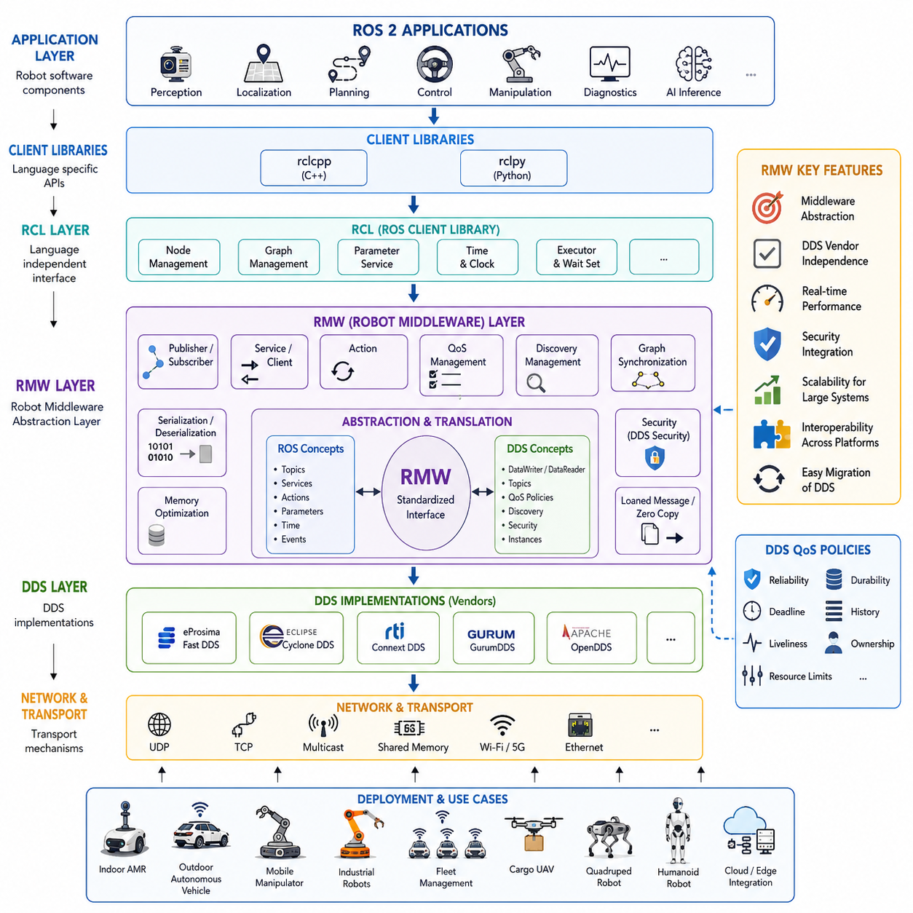
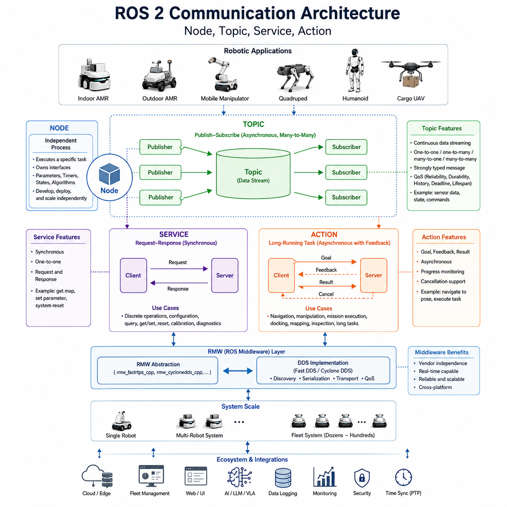
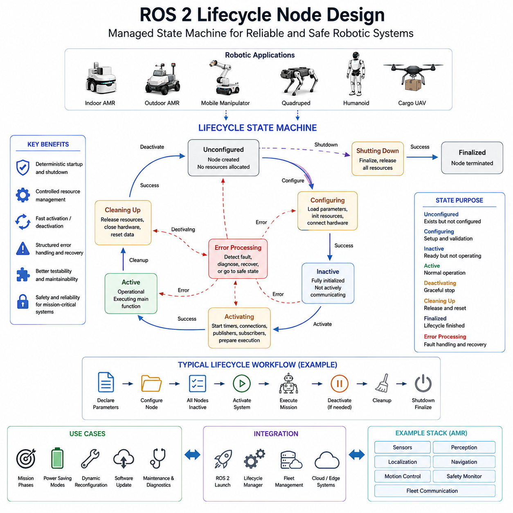
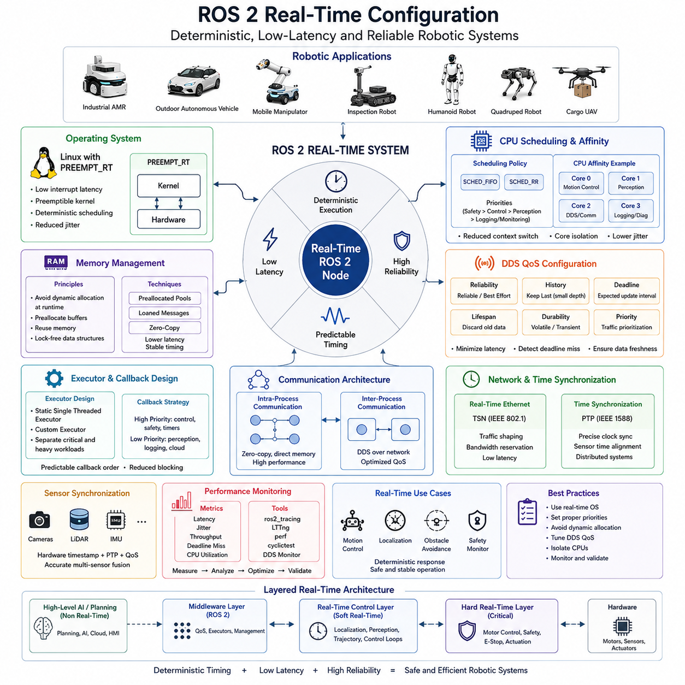
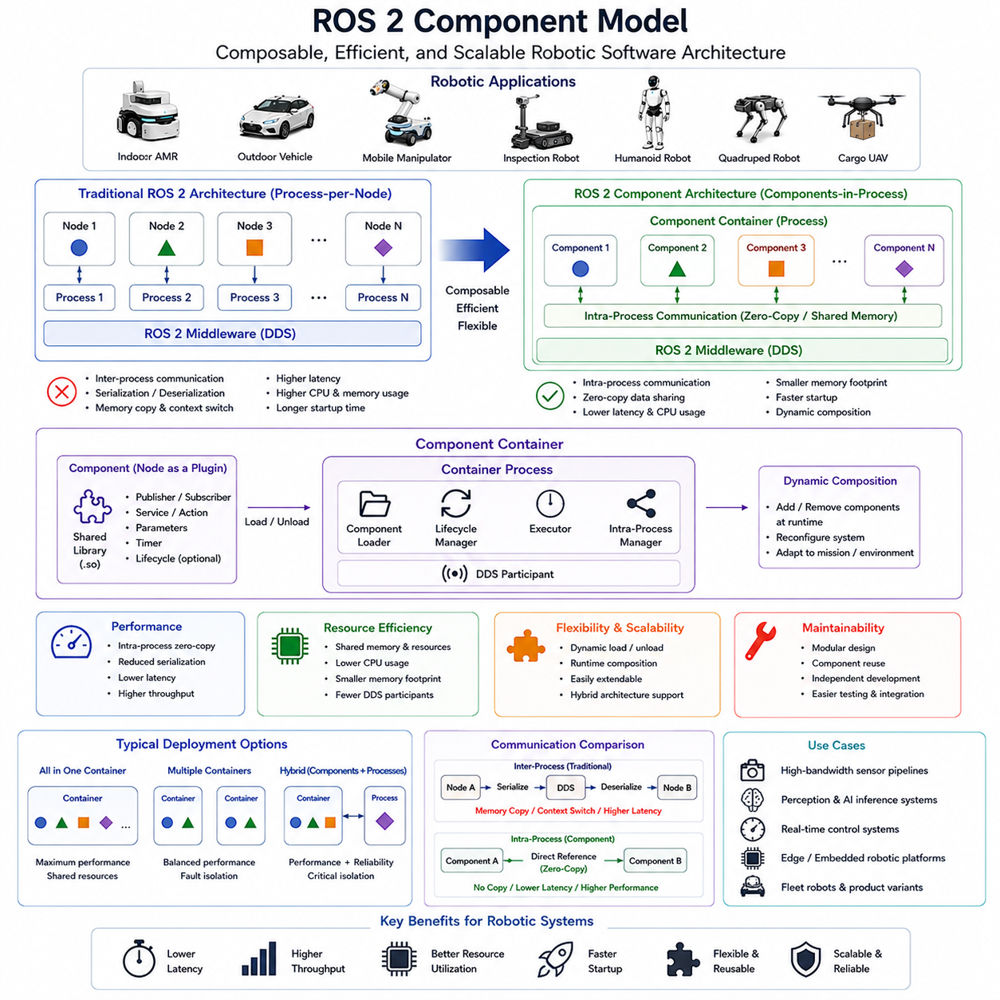

**Volume 09 Robotics Communication**


# Chapter 2. ROS2 Middleware

##  

## 2.1 RMW Layer Architecture

{width="7.268055555555556in" height="7.268055555555556in"}

The Robot Middleware (RMW) Layer Architecture is one of the most important architectural foundations in modern ROS 2 communication systems. As robotic systems become increasingly complex, distributed, and intelligent, the communication framework connecting software components must provide scalability, reliability, interoperability, real-time performance, and hardware independence. The RMW layer was introduced in ROS 2 to address limitations found in previous robotics communication frameworks and to create a standardized abstraction layer between application-level robotics software and underlying communication middleware technologies. This architecture enables robotics developers to build software that remains independent of specific communication implementations while maintaining high-performance data exchange across heterogeneous computing environments. The topic appears within the ROS 2 Middleware section of the Robotics Communication domain and serves as the bridge between DDS technologies and robotic application software.

In traditional robotic software systems, application code often depended directly on communication libraries. This tight coupling created significant maintenance challenges whenever communication technologies evolved or hardware platforms changed. ROS 2 solved this problem by introducing a layered architecture that separates user applications from middleware implementations. At the center of this design is the Robot Middleware Layer, commonly known as RMW. The RMW layer provides a unified interface through which ROS 2 client libraries interact with different DDS vendors and communication backends.

The overall ROS 2 communication stack can be viewed as a hierarchy of abstraction layers. At the top level, robotic applications are implemented using ROS 2 APIs. These applications contain nodes, topics, services, actions, parameters, lifecycle management components, and various robotic algorithms. Beneath the application layer reside client libraries such as rclcpp for C++ and rclpy for Python. These client libraries expose user-friendly programming interfaces while remaining independent of the underlying communication mechanism. Below the client libraries lies the ROS Client Library Layer, commonly referred to as RCL. The RCL provides language-independent functionality and serves as the common interface for all ROS 2 programming languages.

The next layer beneath RCL is the Robot Middleware Layer. This layer abstracts middleware-specific implementations and provides standardized communication interfaces. Rather than interacting directly with DDS APIs, ROS 2 components communicate through RMW functions. These functions manage publishers, subscribers, services, clients, guard conditions, wait sets, graph information, and discovery mechanisms. The RMW layer acts as a translator between ROS concepts and DDS concepts, ensuring that robotics applications remain portable regardless of the communication backend selected.

At the lowest communication level resides the DDS implementation itself. DDS, or Data Distribution Service, is an OMG-standardized middleware technology designed for real-time distributed systems. Different DDS vendors provide various implementations, including Fast DDS, Cyclone DDS, Connext DDS, GurumDDS, and OpenDDS. Each implementation has unique performance characteristics, memory management approaches, discovery mechanisms, and Quality of Service capabilities. The RMW layer hides these differences from application developers, allowing the same robotic software to operate across multiple DDS implementations with minimal modification.

One of the primary objectives of the RMW architecture is middleware abstraction. In large-scale robotic deployments, communication requirements vary significantly. An industrial AMR operating inside a factory may prioritize deterministic real-time behavior, while a cloud-connected fleet management system may prioritize scalability and network resilience. By introducing the RMW abstraction layer, ROS 2 allows organizations to select the DDS implementation most appropriate for their application without rewriting higher-level software components.

The publisher-subscriber model is a central component of RMW architecture. When an application creates a publisher, the request flows through rclcpp or rclpy into the RCL layer. The RCL then invokes corresponding RMW functions. The selected RMW implementation translates ROS message definitions into DDS data structures and creates DDS DataWriters. Similarly, when a subscriber is created, the RMW layer generates DDS DataReaders and manages communication between distributed nodes. This layered translation process allows developers to think in terms of ROS concepts while leveraging sophisticated DDS communication infrastructures underneath.

Service communication follows a similar architecture. ROS 2 services provide synchronous request-response interactions between nodes. The RMW layer maps service requests and responses onto DDS topics and manages message correlation, serialization, transmission, and reception. Clients and service servers remain unaware of the underlying DDS mechanics because the RMW layer encapsulates all middleware-specific complexity.

Action communication represents a more advanced communication pattern supported by ROS 2. Actions combine asynchronous requests, feedback channels, status monitoring, and result delivery into a unified framework. Internally, actions are implemented using multiple DDS topics and service interactions. The RMW layer coordinates these communication channels and ensures that action semantics remain consistent across middleware implementations.

Serialization and deserialization are critical responsibilities of the RMW architecture. Robotic systems exchange numerous data types, including sensor measurements, control commands, maps, trajectories, diagnostics, and AI inference results. Before transmission, application data must be converted into a standardized binary representation. The RMW layer works closely with ROS Interface Definition Language (IDL) generated type support structures to perform efficient serialization. Upon reception, binary data is reconstructed into native ROS message objects. This mechanism allows heterogeneous processors, operating systems, and programming languages to communicate seamlessly.

Discovery management is another essential aspect of the RMW layer. In distributed robotic environments, nodes frequently join and leave the network. Publishers and subscribers must automatically discover one another without manual configuration. DDS provides decentralized discovery mechanisms that enable dynamic network formation. The RMW layer integrates these discovery capabilities into the ROS graph model. As nodes appear or disappear, the RMW layer updates graph information and propagates changes throughout the ROS ecosystem.

Quality of Service management is tightly integrated with the RMW architecture. DDS offers a rich collection of QoS policies that control reliability, durability, deadline constraints, history depth, liveliness monitoring, ownership, and resource limits. ROS 2 exposes these capabilities through user-friendly QoS profiles. When developers configure QoS settings, the RMW layer translates ROS policies into DDS-specific configurations. This translation enables consistent communication behavior while preserving middleware independence.

Reliability management is particularly important in robotic systems. Some communication channels require guaranteed delivery, while others prioritize low latency over reliability. For example, emergency stop commands may require highly reliable communication, whereas high-frequency camera streams may tolerate occasional packet loss. The RMW layer ensures that QoS policies are properly mapped to DDS implementations and that communication behavior aligns with application requirements.

Real-time performance is a major design objective of the RMW architecture. Autonomous vehicles, industrial robots, mobile manipulators, quadrupeds, humanoids, and UAVs often operate under strict timing constraints. Communication latency directly affects perception, planning, and control performance. The RMW layer minimizes overhead between ROS applications and DDS implementations while providing efficient memory allocation, zero-copy communication mechanisms, and deterministic execution paths.

Modern ROS 2 distributions increasingly support loaned messages and shared-memory transport. These features significantly reduce memory copies during communication. The RMW layer serves as the integration point for these optimizations. When supported by the underlying DDS implementation, data can be transferred directly between publishers and subscribers without intermediate copying. This capability is especially valuable for large sensor payloads such as LiDAR point clouds, high-resolution camera images, radar data, and AI feature maps.

Security integration is another important responsibility of the RMW architecture. DDS Security provides authentication, encryption, access control, logging, and governance mechanisms. The RMW layer exposes these capabilities to ROS 2 users while maintaining consistent interfaces across DDS vendors. Secure communication becomes increasingly important as robots connect to cloud platforms, enterprise networks, fleet management systems, and remote operation centers.

In fleet-scale robotic deployments, hundreds or even thousands of robots may operate simultaneously. The RMW layer contributes significantly to scalability by leveraging DDS discovery, partitioning, filtering, multicast communication, and efficient data distribution techniques. Large warehouse AMRs, autonomous inspection fleets, logistics robots, and smart-city robotic infrastructures depend upon scalable middleware architectures to maintain performance under growing network loads.

The RMW architecture also supports interoperability across heterogeneous computing environments. A modern robotic platform may include microcontrollers, safety controllers, Jetson modules, edge computers, GPU servers, cloud infrastructure, and mobile user interfaces. Each component may run different operating systems and hardware architectures. The RMW abstraction layer enables communication across these diverse environments while preserving consistent application programming models.

Vendor independence represents one of the most strategic advantages of the RMW architecture. Organizations can evaluate different DDS implementations according to performance, licensing, support, certification, and deployment requirements. If communication needs evolve over time, a different RMW implementation can be selected without requiring extensive modifications to robotic applications. This flexibility protects software investments and reduces long-term technological risk.

Several RMW implementations are commonly used in ROS 2 ecosystems. RMW FastDDS is widely adopted due to its strong integration with ROS 2 distributions and active development community. RMW CycloneDDS is known for low latency and efficient resource utilization. RMW ConnextDDS offers mature enterprise-grade capabilities and extensive industrial deployment experience. RMW GurumDDS is often selected in specific commercial and embedded environments. Each implementation exposes the same ROS interfaces through the RMW abstraction layer while providing distinct internal behaviors.

From a system architecture perspective, the RMW layer forms the communication backbone of modern robotic software. Perception nodes publish sensor data, localization nodes distribute pose estimates, planning modules exchange trajectories, control systems transmit actuator commands, diagnostics frameworks report health information, and AI inference engines share semantic understanding results. All of these interactions flow through the RMW architecture, making it one of the most critical infrastructure components within ROS 2.

For Hills Robotics platforms, including Indoor AMRs, Outdoor Autonomous Vehicles, Inspection Robots, Mobile Manipulators, Fleet Management Systems, Cargo UAVs, Quadrupeds, and future Humanoid Robots, the RMW layer provides a standardized communication foundation that enables modular software development, scalable distributed computing, middleware portability, and future AI-native communication architectures. As robotic systems continue evolving toward Physical AI and large-scale autonomous ecosystems, the importance of the RMW layer will continue to increase, serving as the essential abstraction framework connecting high-level intelligence with real-time distributed communication infrastructure.

# 02_01 RMW 계층 아키텍처 (RMW Layer Architecture)

RMW(Robot Middleware) 계층 아키텍처는 현대 ROS 2 통신 시스템에서 가장 중요한 기반 구조 중 하나이다. 로봇 시스템이 점점 더 복잡해지고, 분산화되며, 지능화됨에 따라 소프트웨어 구성 요소들을 연결하는 통신 프레임워크는 확장성, 신뢰성, 상호운용성, 실시간성 및 하드웨어 독립성을 동시에 제공해야 한다. ROS 2에서는 이러한 요구사항을 충족하기 위해 RMW 계층을 도입하였으며, 이를 통해 응용 소프트웨어와 실제 통신 미들웨어 사이를 표준화된 방식으로 연결할 수 있게 되었다. RMW는 특정 통신 기술에 종속되지 않는 소프트웨어 개발을 가능하게 하며, 다양한 컴퓨팅 환경에서 고성능 데이터 교환을 지원한다. 본 주제는 Robotics Communication 분야의 ROS 2 Middleware 섹션에 속하며 DDS 기술과 로봇 응용 소프트웨어를 연결하는 핵심 구조를 설명한다.

전통적인 로봇 소프트웨어 시스템에서는 응용 프로그램이 특정 통신 라이브러리에 직접 의존하는 경우가 많았다. 이러한 구조는 통신 기술이 변경되거나 하드웨어 플랫폼이 교체될 때 유지보수 비용을 크게 증가시키는 문제를 가지고 있었다. ROS 2는 이를 해결하기 위해 계층화된 아키텍처를 도입하였다. 이 구조는 응용 프로그램과 실제 통신 미들웨어를 분리하여 상호 독립성을 보장한다. 그 중심에 위치한 것이 바로 Robot Middleware Layer, 즉 RMW 계층이다. RMW는 ROS 2 클라이언트 라이브러리와 다양한 DDS 구현체 사이를 연결하는 표준 인터페이스 역할을 수행한다.

ROS 2 통신 스택은 여러 계층으로 구성된다. 가장 상위에는 로봇 응용 프로그램이 위치하며, 여기에는 노드(Node), 토픽(Topic), 서비스(Service), 액션(Action), 파라미터(Parameter), 라이프사이클 관리 기능, 그리고 다양한 로봇 알고리즘이 포함된다. 그 아래에는 C++용 rclcpp와 Python용 rclpy와 같은 클라이언트 라이브러리가 존재한다. 이 라이브러리들은 개발자가 사용하기 쉬운 API를 제공하면서도 실제 통신 기술로부터 독립성을 유지한다.

클라이언트 라이브러리 아래에는 RCL(ROS Client Library) 계층이 위치한다. RCL은 언어 독립적인 공통 기능을 제공하며 다양한 프로그래밍 언어를 하나의 공통 인터페이스로 연결하는 역할을 수행한다. 그리고 그 아래에 위치하는 계층이 바로 RMW이다. RMW는 실제 DDS 구현체와 ROS 2 사이를 연결하며, Publisher, Subscriber, Service, Client, Guard Condition, Wait Set, Discovery 및 ROS Graph 관리 기능을 제공한다. 이 계층은 ROS 개념과 DDS 개념 사이를 변환하는 번역기 역할을 수행한다.

가장 하위 계층에는 DDS(Data Distribution Service)가 존재한다. DDS는 OMG(Object Management Group)가 표준화한 실시간 분산 시스템용 미들웨어 기술이다. 현재 다양한 DDS 구현체가 존재하며 대표적으로 Fast DDS, Cyclone DDS, Connext DDS, GurumDDS, OpenDDS 등이 사용된다. 각각의 DDS는 성능 특성, 메모리 관리 방식, Discovery 알고리즘, QoS 지원 범위 등이 다르다. RMW 계층은 이러한 차이를 숨김으로써 응용 프로그램이 특정 DDS 구현에 종속되지 않도록 만든다.

RMW 아키텍처의 가장 중요한 목표 중 하나는 미들웨어 추상화(Middleware Abstraction)이다. 예를 들어 공장 내부에서 운영되는 산업용 AMR은 실시간성과 결정론적 동작을 중요하게 생각할 수 있으며, 클라우드 기반의 플릿 관리 시스템은 확장성과 네트워크 안정성을 더욱 중요하게 여길 수 있다. RMW는 이러한 다양한 요구사항에 맞추어 DDS 구현체를 자유롭게 선택할 수 있도록 해준다.

Publisher-Subscriber 모델은 RMW 아키텍처의 핵심 요소이다. 응용 프로그램이 Publisher를 생성하면 해당 요청은 rclcpp 또는 rclpy를 통해 RCL 계층으로 전달된다. 이후 RCL은 RMW 인터페이스를 호출하고, 선택된 DDS 구현체는 이를 DDS DataWriter로 변환한다. Subscriber 역시 DDS DataReader로 변환된다. 이러한 변환 과정 덕분에 개발자는 DDS 내부 구조를 이해하지 않고도 ROS 인터페이스만으로 분산 통신 시스템을 개발할 수 있다.

서비스(Service) 통신 역시 유사한 구조를 따른다. ROS 2 서비스는 요청(Request)과 응답(Response) 기반의 동기식 통신 모델을 제공한다. RMW 계층은 서비스 요청과 응답을 DDS 토픽 구조로 매핑하고 메시지 전송 및 응답 관리를 수행한다. 서비스 클라이언트와 서버는 DDS의 세부 동작을 전혀 알 필요가 없다.

액션(Action)은 보다 복잡한 통신 구조를 제공한다. 액션은 비동기 요청, 진행 상태 피드백, 상태 모니터링, 결과 반환 기능을 하나의 프레임워크로 통합한 구조이다. 내부적으로는 여러 개의 DDS 토픽과 서비스 채널을 사용하여 구현되며, RMW 계층은 이러한 복잡한 통신 흐름을 관리한다.

직렬화(Serialization)와 역직렬화(Deserialization) 또한 RMW의 중요한 역할이다. 로봇 시스템은 센서 데이터, 제어 명령, 지도 정보, 경로 계획 결과, 진단 데이터, AI 추론 결과 등 다양한 정보를 교환한다. 이러한 데이터는 네트워크 전송 전에 표준 바이너리 형식으로 변환되어야 하며, 수신 후에는 다시 원래의 ROS 메시지 구조로 복원되어야 한다. RMW 계층은 ROS IDL 기반 타입 지원 시스템과 협력하여 이러한 변환 작업을 수행한다.

Discovery 관리 역시 중요한 기능이다. 분산 로봇 시스템에서는 새로운 노드가 네트워크에 동적으로 추가되거나 제거될 수 있다. DDS는 자동 Discovery 기능을 제공하며, RMW는 이를 ROS Graph 모델과 연동하여 전체 시스템이 현재 네트워크 상태를 인식할 수 있도록 지원한다.

QoS(Quality of Service) 관리 기능도 RMW 구조에 깊이 통합되어 있다. DDS는 Reliability, Durability, Deadline, History, Liveliness, Ownership, Resource Limit과 같은 다양한 QoS 정책을 제공한다. ROS 2 사용자는 QoS 프로파일만 설정하면 되며, RMW 계층이 이를 DDS 설정으로 자동 변환한다.

신뢰성(Reliability) 관리 또한 중요한 요소이다. 예를 들어 비상 정지(E-Stop) 명령은 반드시 전달되어야 하므로 높은 신뢰성이 요구된다. 반면 고속 카메라 스트림은 일부 패킷 손실을 허용하면서 낮은 지연시간을 우선시할 수 있다. RMW 계층은 이러한 요구사항에 맞게 DDS QoS 정책을 설정하고 통신 특성을 조정한다.

실시간 성능은 RMW 설계의 핵심 목표 중 하나이다. 자율주행 차량, 산업용 로봇, 모바일 매니퓰레이터, 사족보행 로봇, 휴머노이드 로봇, UAV 등은 엄격한 시간 제약 조건 아래에서 동작한다. 통신 지연은 인지(Perception), 계획(Planning), 제어(Control) 성능에 직접적인 영향을 미친다. 따라서 RMW는 최소한의 오버헤드로 DDS와 연결되도록 설계되었다.

최근 ROS 2에서는 Loaned Message와 Shared Memory Transport 기술이 확대 적용되고 있다. 이러한 기술은 데이터 복사를 최소화하여 성능을 크게 향상시킨다. 특히 대용량 LiDAR Point Cloud, 고해상도 카메라 영상, 레이더 데이터, AI Feature Map 등을 처리할 때 매우 효과적이다. RMW 계층은 이러한 최적화 기술을 DDS와 통합하는 역할을 수행한다.

보안(Security) 기능 역시 RMW의 중요한 역할이다. DDS Security 표준은 인증(Authentication), 암호화(Encryption), 접근 제어(Access Control), 감사 로그(Audit Logging) 기능을 제공한다. RMW 계층은 이러한 기능을 ROS 2 환경에 통합하여 클라우드 연결 로봇, 원격 제어 시스템, 플릿 관리 시스템에서도 안전한 통신이 가능하도록 지원한다.

대규모 플릿(Fleet) 환경에서는 수백 대에서 수천 대의 로봇이 동시에 운영될 수 있다. DDS는 Discovery 최적화, 멀티캐스트, 데이터 필터링, 파티셔닝 등의 기능을 제공하며, RMW는 이를 활용하여 대규모 분산 시스템에서도 안정적인 성능을 유지한다.

RMW는 다양한 하드웨어 환경 간 상호운용성도 제공한다. 현대 로봇 시스템은 MCU, Safety Controller, Jetson 모듈, Edge Computer, GPU Server, Cloud Platform, 모바일 애플리케이션 등 다양한 장치로 구성된다. 이러한 이기종 시스템 간에도 동일한 ROS 통신 모델을 사용할 수 있도록 하는 것이 RMW의 중요한 역할이다.

벤더 독립성(Vendor Independence)은 RMW 구조의 가장 큰 전략적 장점 중 하나이다. 기업은 라이선스 정책, 성능 특성, 인증 요구사항, 기술 지원 수준 등을 고려하여 DDS 구현체를 선택할 수 있다. 이후 통신 요구사항이 변경되더라도 응용 프로그램 수정 없이 DDS 구현체만 교체할 수 있다.

현재 ROS 2에서 가장 널리 사용되는 RMW 구현체는 RMW FastDDS이다. Fast DDS는 ROS 2와 긴밀하게 통합되어 있으며 활발한 개발이 이루어지고 있다. CycloneDDS는 낮은 지연시간과 효율적인 자원 사용으로 유명하다. ConnextDDS는 산업용 및 국방 분야에서 널리 사용되는 엔터프라이즈급 DDS 솔루션이다. GurumDDS는 특정 상용 및 임베디드 환경에서 많이 사용된다. 이러한 DDS 구현체들은 서로 다른 내부 구조를 가지고 있지만, RMW 인터페이스를 통해 동일한 ROS 2 API를 제공한다.

시스템 아키텍처 관점에서 RMW는 현대 로봇 소프트웨어의 통신 백본(Backbone) 역할을 수행한다. 센서 데이터는 인지 노드로 전달되고, 위치 추정 결과는 계획 모듈로 전달되며, 경로 계획 결과는 제어 시스템으로 전달된다. 또한 진단 정보, 상태 정보, AI 추론 결과 역시 모두 RMW를 통해 분산 시스템 전체에 전달된다.

힐스로보틱스의 실내 AMR, 실외 자율주행 플랫폼, 산업 검사 로봇, 모바일 매니퓰레이터, 플릿 관리 시스템, Cargo UAV, 사족보행 로봇, 그리고 미래의 휴머노이드 로봇까지 모든 플랫폼에서 RMW 계층은 공통 통신 기반 구조로 활용될 수 있다. 이를 통해 모듈화된 소프트웨어 개발, DDS 벤더 독립성, 분산 컴퓨팅 확장성, 그리고 미래 AI-Native Middleware로의 발전이 가능해진다. 향후 Physical AI 시대에는 RMW가 단순한 통신 계층을 넘어 대규모 지능형 로봇 생태계를 연결하는 핵심 인프라로 자리잡게 될 것이다.

##  

## 2.2 Node Topic Service Action

{width="7.268055555555556in" height="7.268055555555556in"}

The Node, Topic, Service, and Action concepts form the fundamental communication architecture of ROS 2 and represent the building blocks from which modern robotic software systems are constructed. Within the ROS 2 middleware ecosystem, every intelligent behavior, sensor integration function, motion control algorithm, perception pipeline, navigation module, fleet management service, and AI application ultimately relies on these four communication abstractions. Understanding their design philosophy is therefore essential for engineers developing scalable Autonomous Mobile Robots (AMRs), outdoor autonomous vehicles, mobile manipulators, humanoid robots, quadruped robots, and future Physical AI systems. This chapter belongs to the ROS 2 Middleware section of the Robotics Communication domain and specifically addresses how distributed robotic software components exchange information in a reliable, modular, and real-time capable manner.

A ROS 2 system is fundamentally composed of nodes. A node is an independent software process that performs a specific task within the overall robotic application. Rather than building a robot as a single monolithic software application, ROS 2 encourages developers to decompose functionality into multiple cooperating nodes. Each node can be developed, tested, deployed, monitored, and updated independently. This architectural approach significantly improves maintainability, scalability, fault isolation, and software reuse.

For example, an indoor AMR may contain a camera driver node responsible for acquiring image frames, a LiDAR driver node responsible for generating point cloud data, an IMU node responsible for publishing inertial measurements, a localization node performing SLAM calculations, a path planning node generating trajectories, a motion controller node producing wheel commands, and a fleet communication node exchanging information with cloud infrastructure. Each of these software components operates as an independent node while collectively contributing to the behavior of the robot.

The node abstraction provides a logical boundary between functional modules. Internally, a node may contain publishers, subscribers, service servers, service clients, action servers, action clients, timers, parameters, state machines, and custom algorithms. Externally, however, the node exposes only communication interfaces, allowing other nodes to interact without requiring knowledge of internal implementation details. This separation supports modular software engineering principles and enables large-scale robotic systems to evolve without excessive coupling between components.

In ROS 2, communication between nodes primarily occurs through topics. Topics implement a publish-subscribe communication model based on DDS technology. A topic represents a named communication channel through which data is continuously exchanged. Publishers generate messages and transmit them to a topic, while subscribers receive messages from that topic. The publisher and subscriber remain decoupled because neither side requires direct awareness of the other.

The publish-subscribe model is particularly suitable for robotics because most robotic data streams are continuous in nature. Sensors generate data at regular intervals, control algorithms continuously update commands, and monitoring systems constantly exchange status information. Topics therefore provide an efficient mechanism for transporting streaming information throughout the robot.

Consider a camera node producing image frames at thirty frames per second. The camera node publishes messages to an image topic. Simultaneously, multiple subscribers may consume this data. A perception node may perform object detection, a localization node may perform visual odometry, and a recording node may archive images for later analysis. The camera publisher remains unaware of how many subscribers exist or how the data is used. This loose coupling allows new applications to be added without modifying the original camera driver.

Topic communication supports one-to-one, one-to-many, many-to-one, and many-to-many communication patterns. Multiple publishers may write to the same topic, and multiple subscribers may consume messages from that topic. This flexibility allows developers to design complex information-sharing architectures while maintaining modularity.

ROS 2 topics are strongly typed. Every topic is associated with a message definition that specifies the structure of transmitted data. Message definitions contain fields describing sensor measurements, control commands, system states, or custom application-specific information. Strong typing ensures compatibility between communicating nodes and enables automatic serialization and deserialization mechanisms within DDS.

Message serialization is a critical aspect of topic communication. When a publisher generates a message, the information is converted into a standardized binary representation suitable for network transport. DDS middleware handles serialization, transport, and reconstruction of messages transparently. Developers therefore focus primarily on application logic rather than low-level networking details.

Topic communication is generally asynchronous. Publishers transmit messages without waiting for subscribers to process them. Subscribers independently receive and process incoming messages whenever data becomes available. This asynchronous behavior supports high-throughput communication and minimizes latency throughout distributed robotic systems.

Quality of Service policies significantly influence topic behavior. ROS 2 inherits QoS mechanisms from DDS, allowing developers to configure reliability, durability, history depth, deadline constraints, lifespan limits, and resource management parameters. These settings enable communication behavior to be tailored according to application requirements.

For example, a safety-critical obstacle detection topic may require reliable delivery to ensure no sensor measurements are lost. Conversely, a high-frequency camera stream may prioritize low latency over perfect reliability because outdated images provide limited value. QoS configuration therefore becomes an important design consideration when constructing robotic communication architectures.

While topics are ideal for streaming data, some robotic interactions require request-response semantics. For these situations, ROS 2 provides services. A service implements synchronous communication between a client and a server. The client sends a request, the server processes the request, and a response is returned to the client.

Services are commonly used for operations that represent discrete transactions rather than continuous data streams. Examples include requesting map information, resetting localization, calibrating sensors, reading system diagnostics, changing operating modes, loading configuration files, or triggering maintenance procedures.

A service definition consists of a request message and a response message. The request contains parameters describing the desired operation, while the response contains results generated by the server. This dual-message structure enables structured interactions between distributed software components.

Consider a localization system that provides a service for resetting robot position. A client sends coordinates representing the desired starting location. The localization server processes the request, updates internal state variables, and returns a confirmation response indicating success or failure. Once the transaction completes, communication terminates until another request is initiated.

Service communication is fundamentally different from topic communication. Topics are continuous, asynchronous, and many-to-many. Services are discrete, synchronous, and typically one-to-one. Choosing between topics and services requires careful consideration of communication patterns and application requirements.

One limitation of services is that they are not well suited for long-duration operations. If a requested task requires several seconds or minutes to complete, keeping the client blocked while waiting for a response becomes inefficient. To address this challenge, ROS 2 introduces the Action communication model.

Actions provide a framework for executing long-running goals while maintaining feedback and cancellation capabilities. Actions combine characteristics of topics and services into a unified communication mechanism designed specifically for robotic tasks that require monitoring and control throughout execution.

An action consists of three message types: a goal, feedback messages, and a result. The client submits a goal to the action server. The server accepts the goal and begins execution. During execution, feedback messages provide progress information. Once the operation completes, a final result is returned.

Consider an autonomous navigation system. A navigation client may request movement to a destination located fifty meters away. The navigation process may require tens of seconds to complete. During execution, the client benefits from receiving progress updates such as remaining distance, estimated arrival time, or current navigation status. Additionally, the user may wish to cancel the task before completion. Services cannot efficiently support these requirements, but actions provide an ideal solution.

Action communication enables sophisticated robot behaviors such as autonomous navigation, manipulation tasks, inspection missions, docking operations, mapping procedures, warehouse logistics workflows, and collaborative human-robot interactions. Many high-level robotic capabilities depend heavily on action-based architectures.

Within a ROS 2 action system, the action server manages goal execution and state transitions. Typical states include accepted, executing, canceling, succeeded, aborted, and canceled. These standardized states simplify task monitoring and system integration. Action clients can query status information, receive progress feedback, and issue cancellation requests whenever necessary.

The distinction between topics, services, and actions becomes clearer when examining practical robotic scenarios. Sensor data streaming naturally maps to topics because measurements are generated continuously. Configuration operations map to services because they involve discrete requests and responses. Mission execution maps to actions because tasks may require extended durations, progress tracking, and cancellation support.

A modern AMR navigation stack demonstrates all three communication mechanisms operating simultaneously. LiDAR data, camera images, odometry measurements, and localization estimates are transmitted through topics. Configuration commands such as map loading and parameter updates are handled through services. Navigation goals are executed through actions. Together, these mechanisms provide a comprehensive communication framework capable of supporting complex autonomous behavior.

Node communication occurs over DDS middleware through the ROS Middleware abstraction layer. When a node publishes a topic, requests a service, or sends an action goal, ROS 2 delegates communication management to the underlying DDS implementation. Popular DDS implementations include Fast DDS and Cyclone DDS. The RMW layer ensures application code remains independent of specific middleware vendors, improving portability and long-term maintainability.

Scalability is one of the major advantages of the ROS 2 communication architecture. A small robot may operate with only a handful of nodes, while a large autonomous vehicle may contain hundreds of interacting nodes distributed across multiple computing platforms. The same Node-Topic-Service-Action abstractions remain applicable regardless of system size.

In multi-robot environments, these abstractions become even more important. Fleet management systems rely on topic communication for telemetry streaming, service communication for robot configuration, and action communication for mission assignment. As fleets grow from a few robots to hundreds of autonomous platforms, maintaining clean communication boundaries becomes essential for system reliability and maintainability.

Real-time robotic systems impose additional constraints on communication design. High-frequency control loops often require deterministic timing characteristics. ROS 2 supports real-time operation through careful QoS configuration, efficient middleware implementations, memory management strategies, and executor design. Topics carrying motor commands, actuator feedback, and safety signals may require specialized real-time optimization to meet latency requirements.

Safety-critical robotic systems also benefit from the modular nature of nodes. Functional safety architectures frequently separate safety functions from non-safety functions. Independent safety nodes may monitor system health, evaluate hazards, enforce operational constraints, and initiate emergency responses. Isolation between nodes simplifies safety validation and fault containment strategies.

Cloud-connected robots further extend the Node-Topic-Service-Action model beyond the local robot. Telemetry topics may be bridged to cloud infrastructure, remote configuration may be performed through service interfaces, and fleet missions may be assigned through action mechanisms. Edge computing, on-premise GPU servers, and cloud AI platforms can therefore participate in a unified communication ecosystem.

As Physical AI systems continue to evolve, Node-Topic-Service-Action architectures remain foundational communication abstractions. Large language models, vision-language-action models, multimodal perception systems, autonomous reasoning engines, and distributed AI services all require structured communication frameworks for exchanging information. ROS 2 provides this foundation through its flexible, scalable, middleware-independent communication architecture.

Ultimately, Nodes provide computational units, Topics provide continuous data exchange, Services provide synchronous transactions, and Actions provide long-duration task execution. Together they form the communication backbone of ROS 2 and enable the development of modular, scalable, reliable, and intelligent robotic systems ranging from small indoor AMRs to large autonomous vehicles, mobile manipulators, humanoid robots, quadruped robots, and future AI-native physical machines.

# 02_02 Node, Topic, Service, Action

Node, Topic, Service, Action은 ROS 2의 핵심 통신 아키텍처를 구성하는 기본 개념으로, 현대 로봇 소프트웨어 시스템을 구축하는 가장 중요한 구성 요소들이다. ROS 2 미들웨어 환경에서 동작하는 모든 지능형 기능, 센서 통합 기능, 모션 제어 알고리즘, 인지(Perception) 파이프라인, 자율주행 기능, 플릿(Fleet) 관리 시스템, 그리고 AI 응용 프로그램은 궁극적으로 이 네 가지 통신 구조를 기반으로 동작한다. 따라서 실내 AMR, 실외 자율주행 차량, 모바일 매니퓰레이터, 휴머노이드 로봇, 사족보행 로봇, 그리고 미래의 Physical AI 시스템을 개발하는 엔지니어라면 이 개념들을 정확히 이해해야 한다. 본 장은 Robotics Communication 영역의 ROS 2 Middleware 파트에 속하며, 분산 로봇 소프트웨어가 어떻게 정보를 교환하는지를 설명한다.

ROS 2 시스템은 기본적으로 Node들의 집합으로 구성된다. Node는 특정 기능을 수행하는 독립적인 소프트웨어 프로세스이다. 전통적인 방식처럼 하나의 거대한 프로그램 안에 모든 기능을 구현하는 것이 아니라, ROS 2는 기능을 여러 개의 독립적인 Node로 분리하여 설계하도록 권장한다. 각 Node는 독립적으로 개발, 테스트, 배포, 모니터링 및 유지보수가 가능하다. 이러한 구조는 대규모 로봇 시스템에서 유지보수성, 확장성, 장애 격리성, 그리고 재사용성을 크게 향상시킨다.

예를 들어 실내 AMR에서는 카메라 드라이버 Node, LiDAR 드라이버 Node, IMU Node, SLAM 기반 위치추정 Node, 경로계획 Node, 모션제어 Node, 플릿 통신 Node 등이 각각 독립적으로 존재할 수 있다. 이들 Node는 서로 협력하여 전체 로봇의 기능을 수행하지만 내부 구현은 서로 독립적으로 유지된다.

Node는 기능 단위의 논리적 경계를 제공한다. 하나의 Node 내부에는 Publisher, Subscriber, Service Server, Service Client, Action Server, Action Client, Timer, Parameter, State Machine, 그리고 다양한 알고리즘이 포함될 수 있다. 그러나 외부에서는 통신 인터페이스만 노출되기 때문에 다른 Node들은 내부 구현을 알 필요 없이 상호작용할 수 있다. 이러한 구조는 소프트웨어 모듈화를 촉진하고 대규모 시스템의 복잡성을 줄여준다.

Node 간 통신은 주로 Topic을 통해 이루어진다. Topic은 DDS 기반의 Publish-Subscribe 모델을 구현한 통신 채널이다. Publisher는 데이터를 Topic으로 전송하고 Subscriber는 해당 Topic으로부터 데이터를 수신한다. Publisher와 Subscriber는 서로를 직접 알 필요가 없기 때문에 느슨한 결합(Loose Coupling)이 가능하다.

Publish-Subscribe 모델은 로봇 시스템에 매우 적합하다. 대부분의 센서 데이터와 제어 데이터는 지속적으로 생성되기 때문이다. 카메라 영상, LiDAR 포인트클라우드, IMU 데이터, 위치 정보, 속도 정보 등은 모두 연속적으로 생성되므로 Topic을 이용한 스트리밍 방식이 가장 자연스럽다.

예를 들어 카메라 Node가 초당 30장의 이미지를 생성하여 Image Topic에 발행한다고 가정하자. 이 데이터를 객체 인식 Node, Visual Odometry Node, 데이터 기록 Node가 동시에 사용할 수 있다. 카메라 Node는 누가 데이터를 사용하는지 알 필요가 없으며 Subscriber의 수가 증가해도 변경할 필요가 없다. 이는 시스템 확장성을 크게 향상시킨다.

Topic 통신은 One-to-One, One-to-Many, Many-to-One, Many-to-Many 구조를 모두 지원한다. 여러 Publisher가 동일 Topic에 데이터를 보낼 수도 있고, 여러 Subscriber가 동시에 데이터를 받을 수도 있다. 이러한 유연성은 복잡한 로봇 소프트웨어 아키텍처를 구축하는 데 매우 중요한 역할을 한다.

ROS 2의 Topic은 강한 타입(Strongly Typed)을 가진다. 각 Topic은 특정 Message 타입을 사용하며, 메시지 정의에는 데이터 구조가 명확하게 기술된다. 예를 들어 Position, Velocity, Orientation, Image, PointCloud 등의 데이터 구조가 사전에 정의된다. 이러한 강한 타입 구조는 통신 안정성과 개발 생산성을 높여준다.

Publisher가 메시지를 생성하면 DDS 미들웨어는 이를 자동으로 직렬화(Serialization)하여 네트워크를 통해 전송한다. Subscriber는 이를 역직렬화하여 원래 데이터 형태로 복원한다. 개발자는 네트워크 프로토콜이나 패킷 처리와 같은 저수준 작업을 직접 구현할 필요가 없다.

Topic 통신은 비동기(Asynchronous) 방식으로 동작한다. Publisher는 Subscriber가 메시지를 처리할 때까지 기다리지 않는다. 데이터를 전송한 후 즉시 다음 작업을 수행할 수 있다. 이러한 구조는 높은 처리량과 낮은 지연시간을 제공한다.

ROS 2는 DDS의 Quality of Service(QoS) 기능을 활용하여 Topic의 동작 특성을 세밀하게 제어할 수 있다. Reliability, Durability, History Depth, Deadline, Lifespan 등의 설정을 통해 통신 품질을 조절할 수 있다.

예를 들어 안전 관련 센서 데이터는 Reliable 모드를 사용하여 데이터 손실을 방지할 수 있다. 반면 고속 카메라 영상은 최신 데이터가 중요하므로 Best Effort 모드를 사용하여 지연시간을 최소화할 수 있다. 따라서 QoS 설계는 ROS 2 시스템 아키텍처에서 매우 중요한 요소이다.

하지만 모든 통신이 Topic으로 해결되는 것은 아니다. 특정 기능은 요청(Request)과 응답(Response)이 필요한 경우가 있다. 이러한 경우 ROS 2는 Service를 제공한다.

Service는 Client와 Server 간의 동기식(Synchronous) 통신 구조이다. Client가 요청을 보내면 Server가 요청을 처리하고 결과를 반환한다. 이 과정은 하나의 트랜잭션(Transaction)으로 수행된다.

Service는 연속적인 데이터 스트리밍보다 특정 기능 수행에 적합하다. 예를 들어 지도 로딩, 센서 캘리브레이션, 로봇 초기화, 파라미터 변경, 진단 정보 조회, 시스템 모드 변경 등의 작업에 주로 사용된다.

Service는 Request 메시지와 Response 메시지로 구성된다. Request에는 수행할 작업에 대한 정보가 포함되며 Response에는 처리 결과가 포함된다.

예를 들어 위치추정 시스템에 위치 초기화 Service가 있다고 가정하자. Client는 새로운 시작 위치 좌표를 Request로 전송한다. Localization Server는 내부 상태를 변경한 뒤 성공 여부를 Response로 반환한다. 작업이 끝나면 통신도 종료된다.

Service는 Topic과 매우 다른 특성을 가진다. Topic은 비동기적이고 연속적이며 다대다(Many-to-Many) 통신을 지원한다. 반면 Service는 동기적이고 일회성이며 일반적으로 일대일(One-to-One) 통신을 수행한다.

그러나 Service는 장시간 수행되는 작업에는 적합하지 않다. 어떤 작업이 수십 초 또는 수분 동안 실행된다면 Client가 응답을 기다리는 동안 블록(Block) 상태가 되어 비효율적일 수 있다. 이러한 문제를 해결하기 위해 ROS 2는 Action이라는 개념을 제공한다.

Action은 장시간 실행되는 작업(Long Running Task)을 처리하기 위해 설계된 통신 모델이다. Action은 Topic과 Service의 장점을 결합한 구조라고 볼 수 있다.

Action은 Goal, Feedback, Result 세 가지 메시지로 구성된다. Client는 Goal을 전송하고 Server는 이를 실행한다. 실행 중에는 진행 상황을 Feedback으로 전달하며, 완료 후에는 최종 Result를 반환한다.

예를 들어 자율주행 로봇이 50m 떨어진 목적지로 이동한다고 가정해 보자. 이 작업은 수십 초 이상 걸릴 수 있다. 사용자는 현재 위치, 남은 거리, 예상 도착 시간 등의 진행 상태를 알고 싶어 할 수 있으며 필요하면 작업을 중간에 취소하고 싶을 수도 있다. Service는 이러한 요구를 만족시키기 어렵지만 Action은 이를 자연스럽게 지원한다.

Action은 자율주행, 매니퓰레이션, 검사 미션, 자동 도킹, 지도 작성, 창고 물류 작업, 인간-로봇 협업과 같은 고수준 로봇 기능 구현에 널리 사용된다.

Action Server는 Goal의 상태를 관리한다. 일반적으로 Accepted, Executing, Canceling, Succeeded, Aborted, Canceled 등의 상태를 사용한다. 이러한 상태 관리 구조는 복잡한 작업을 안정적으로 수행할 수 있도록 지원한다.

실제 로봇 시스템에서는 Topic, Service, Action이 동시에 사용된다. 예를 들어 AMR Navigation Stack을 살펴보면 LiDAR 데이터, 카메라 영상, Odometry, Localization 정보는 Topic을 통해 전달된다. 지도 로딩이나 설정 변경은 Service를 통해 수행된다. 목적지 이동 명령은 Action을 통해 처리된다.

ROS 2의 이러한 구조는 DDS 기반 RMW(ROS Middleware) 계층 위에서 동작한다. Node가 Topic을 Publish하거나 Service를 호출하거나 Action Goal을 전송하면 ROS 2는 실제 통신 처리를 DDS에 위임한다. Fast DDS와 Cyclone DDS 같은 DDS 구현체는 이러한 통신을 담당하며, RMW 계층은 응용 프로그램이 특정 DDS 공급업체에 종속되지 않도록 해준다.

ROS 2 통신 구조의 가장 큰 장점 중 하나는 뛰어난 확장성이다. 작은 로봇에서는 수십 개의 Node만 사용할 수 있지만, 대규모 자율주행 플랫폼에서는 수백 개 이상의 Node가 동시에 동작할 수 있다. 시스템 규모가 커져도 Node, Topic, Service, Action이라는 동일한 추상화 모델을 유지할 수 있다.

다중 로봇 환경에서는 이러한 개념의 중요성이 더욱 커진다. 플릿 관리 시스템은 Topic을 통해 Telemetry 데이터를 수집하고, Service를 통해 설정을 변경하며, Action을 통해 임무를 배정한다. 수십 대에서 수백 대의 로봇이 동시에 동작하는 환경에서도 동일한 구조를 사용할 수 있다.

실시간 제어가 필요한 시스템에서는 Topic의 QoS 설정과 DDS 최적화가 매우 중요하다. 모터 제어, 액추에이터 피드백, 안전 신호와 같은 데이터는 결정론적(Deterministic) 지연시간을 요구하기 때문이다.

기능 안전(Function Safety) 측면에서도 Node 구조는 큰 장점을 제공한다. 안전 관련 기능을 별도의 Safety Node로 분리하면 위험 분석, 검증, 인증, 장애 격리 작업을 보다 쉽게 수행할 수 있다.

클라우드와 연결된 로봇에서는 Topic 데이터가 클라우드로 전달되고, 원격 설정은 Service를 통해 수행되며, 미션 명령은 Action을 통해 전달될 수 있다. 이처럼 Edge Computing, On-Premise GPU Server, Cloud AI Platform은 ROS 2의 통신 구조 안에서 통합적으로 동작할 수 있다.

미래의 Physical AI 시스템에서도 Node, Topic, Service, Action 구조는 핵심 통신 프레임워크로 계속 사용될 것이다. 대규모 언어 모델(LLM), Vision-Language-Action 모델, 멀티모달 인지 시스템, 자율 추론 엔진, 분산 AI 서비스 역시 결국 이러한 통신 구조를 기반으로 데이터를 교환하게 된다.

결론적으로 Node는 계산 단위를 제공하고, Topic은 연속적인 데이터 스트림을 제공하며, Service는 요청-응답 기반의 기능 호출을 제공하고, Action은 장시간 수행되는 작업의 실행과 상태 관리를 담당한다. 이 네 가지 요소는 ROS 2 통신 아키텍처의 핵심을 이루며, 소형 실내 AMR부터 대형 자율주행 차량, 모바일 매니퓰레이터, 휴머노이드 로봇, 사족보행 로봇, 그리고 미래의 AI Native Physical Machine에 이르기까지 모든 현대 로봇 시스템의 통신 기반을 형성한다.

##  

## 2.3 Lifecycle Node Design

{width="7.268055555555556in" height="7.268055555555556in"}

Lifecycle Nodes represent one of the most important architectural improvements introduced in ROS 2 for building reliable, maintainable, scalable, and safety-oriented robotic systems. While a standard ROS 2 node begins execution immediately after startup and remains active until termination, a Lifecycle Node introduces a managed state machine that controls when and how a node is initialized, activated, deactivated, cleaned up, and shut down. This capability allows robotic software systems to transition through well-defined operational stages and provides deterministic control over resource allocation, communication behavior, fault recovery, and mission execution.

As robotic systems continue to grow in complexity, the need for predictable startup and shutdown procedures becomes increasingly important. Modern Autonomous Mobile Robots (AMRs), outdoor autonomous vehicles, humanoid robots, quadruped robots, mobile manipulators, and Physical AI platforms often contain hundreds of software components distributed across multiple computing devices. If all components immediately begin executing when the system starts, initialization ordering problems, race conditions, communication failures, and unsafe operating states may occur. Lifecycle Nodes solve these challenges by introducing controlled execution states that allow system managers to coordinate software activation in a structured manner.

The concept of managed node lifecycles originates from industrial automation systems, aerospace software architectures, telecommunications infrastructure, and safety-critical embedded systems. In these environments, deterministic control over software state transitions is essential because system behavior must remain predictable under both normal and abnormal operating conditions. ROS 2 adopted this concept to support increasingly sophisticated robotic applications that require enterprise-grade reliability.

A Lifecycle Node operates according to a predefined state machine. Rather than simply existing in a running or stopped state, the node progresses through several operational states that represent different phases of execution. These states include Unconfigured, Inactive, Active, Finalized, and a series of transition states such as Configuring, Activating, Deactivating, Cleaning Up, Shutting Down, and Error Processing. Together these states form a complete lifecycle management framework.

The lifecycle begins when a node is first created. At this stage, the node enters the Unconfigured state. In this condition the node exists within the system but has not yet allocated significant resources or established active communication interfaces. Parameters may be declared, internal variables may exist, and the node can respond to lifecycle management requests, but publishers, subscribers, services, actions, sensors, and hardware interfaces are not yet fully operational.

The Unconfigured state provides an important safety mechanism because it prevents partially initialized software from interacting with the rest of the robotic system. For example, a motor controller node should not begin transmitting velocity commands before its hardware interfaces have been validated and its configuration parameters have been loaded. Keeping the node in the Unconfigured state until initialization is complete prevents accidental operation.

When the system requests initialization, the node transitions into the Configuring state. During this phase, configuration procedures are executed. Parameters are loaded, configuration files are parsed, memory buffers are allocated, hardware devices are connected, network resources are initialized, and internal software structures are prepared for operation. This stage represents the setup phase of the node lifecycle.

Configuration procedures vary depending on the node\'s purpose. A camera node may establish communication with a physical camera device and verify image acquisition capabilities. A LiDAR node may initialize sensor communication channels and validate calibration parameters. A localization node may load map files and allocate computational resources. A fleet communication node may establish secure network connections to cloud infrastructure.

If configuration succeeds, the node transitions into the Inactive state. The Inactive state represents a fully initialized but non-operational condition. All required resources have been allocated and validated, but active processing has not yet begun. Publishers do not transmit operational data, control commands are not generated, and mission execution does not occur.

The Inactive state is particularly valuable in large robotic systems because it allows all components to be prepared before the robot begins operation. System integrators can verify that every node has successfully initialized before activating the system. This reduces startup uncertainty and improves overall system robustness.

Once all required nodes have reached the Inactive state, the system may begin activation. The node enters the Activating transition state, where final preparations are performed. Communication interfaces become operational, timers are enabled, control loops are started, subscriptions begin processing incoming data, and publishers become capable of transmitting messages.

Following successful activation, the node enters the Active state. This is the primary operational state of the Lifecycle Node. In the Active state the node performs its intended function and participates fully in system operation. Sensor nodes publish measurements, perception nodes process incoming data, navigation nodes generate trajectories, motion controllers produce actuator commands, and fleet communication modules exchange information with external systems.

The Active state represents the only lifecycle state in which the node is expected to contribute directly to mission execution. This distinction is important because it separates operational behavior from configuration and maintenance activities. Such separation improves system predictability and simplifies software validation.

A key advantage of Lifecycle Nodes is the ability to temporarily deactivate functionality without completely shutting down the software component. When required, the node can transition from Active to Deactivating. During this phase, publishers stop transmitting operational messages, timers are suspended, processing activities cease, and the node gradually withdraws from active system participation.

Once deactivation completes, the node returns to the Inactive state. Importantly, resources remain allocated and configuration information remains intact. Reactivation can therefore occur much more quickly than a full restart because initialization procedures do not need to be repeated.

This capability is highly beneficial in robotic applications that require dynamic reconfiguration. Consider an autonomous warehouse robot operating in different environments. Certain perception modules may be activated only when entering specialized inspection zones. Similarly, energy-intensive AI models may be deactivated during low-power operating modes. Lifecycle management allows such transitions to occur cleanly and predictably.

If a node must completely release its resources, the Cleanup transition may be executed. During Cleanup, allocated memory is released, hardware connections are closed, communication interfaces are terminated, and internal data structures are reset. After successful cleanup, the node returns to the Unconfigured state.

The Cleanup mechanism is useful when system parameters must be changed significantly. Rather than terminating and recreating the node, the software can clean up its resources and then reconfigure itself using a different set of parameters. This capability supports dynamic system adaptation and simplifies operational maintenance.

Eventually a node may be shut down entirely. During the Shutdown transition, all remaining resources are released and the node prepares for termination. After shutdown completes, the node enters the Finalized state. The Finalized state represents the end of the node lifecycle and indicates that execution has concluded.

Error handling is another major advantage of Lifecycle Nodes. In traditional software architectures, unexpected failures often result in unpredictable behavior or complete application crashes. Lifecycle Nodes introduce structured error management through dedicated error processing transitions.

If an error occurs during configuration, activation, execution, or cleanup, the node may transition into an Error Processing state. Within this state, diagnostic information can be generated, recovery procedures can be executed, fault reports can be transmitted, and corrective actions can be initiated.

For example, if a camera device unexpectedly disconnects during operation, the camera node may detect the fault and enter Error Processing. The node can attempt to reconnect to the hardware, notify supervisory systems, and either recover automatically or transition to a safe state. This structured recovery behavior significantly improves system resilience.

Lifecycle Nodes are particularly important in safety-critical robotic systems. Autonomous vehicles, industrial robots, medical robots, and collaborative robots often require strict operational controls. Safety regulations frequently mandate deterministic startup procedures, controlled activation sequences, and predictable fault responses. Lifecycle management provides a framework for implementing these requirements.

In an Autonomous Mobile Robot, the startup sequence may involve dozens of Lifecycle Nodes. Sensor drivers are configured first, followed by localization modules, perception pipelines, navigation components, motion controllers, safety systems, and fleet communication interfaces. Each subsystem transitions through the lifecycle in a carefully controlled order. Only after all required nodes reach the Active state does the robot begin mission execution.

Similarly, during shutdown, the reverse process may occur. Motion controllers deactivate before perception modules, navigation systems terminate before localization services, and hardware interfaces are closed in a controlled sequence. Such orderly shutdown behavior reduces the risk of unexpected system states and protects both hardware and software resources.

Lifecycle management also improves software testing and validation. Engineers can evaluate individual lifecycle transitions independently, verifying correct behavior during configuration, activation, deactivation, cleanup, and error recovery. This modular testing approach simplifies verification activities and improves software quality.

The lifecycle architecture integrates closely with ROS 2 launch systems. Launch managers can coordinate lifecycle transitions across multiple nodes, enabling system-wide orchestration. Entire subsystems can be activated simultaneously, deactivated for maintenance, or restarted following failures. This centralized management capability becomes increasingly valuable as robotic systems scale in complexity.

Fleet management systems can also leverage Lifecycle Nodes. A remote operator may activate or deactivate specific software modules on selected robots without interrupting overall fleet operations. Software updates, maintenance procedures, and configuration changes can be performed more safely and efficiently through lifecycle-aware architectures.

In cloud-connected robotic ecosystems, Lifecycle Nodes support advanced deployment strategies. Edge computing services, AI inference engines, cloud communication modules, and telemetry pipelines may all participate in managed lifecycle workflows. Resources can be activated only when needed, improving computational efficiency and reducing operational costs.

Physical AI systems further increase the importance of lifecycle management. Future robots will combine perception, reasoning, planning, manipulation, navigation, and language understanding within highly distributed software architectures. Large Language Models, Vision-Language-Action models, world models, and multimodal reasoning systems will require controlled initialization and resource management procedures. Lifecycle Nodes provide a standardized framework for managing these complex AI-driven components.

The adoption of Lifecycle Nodes also supports long-term maintainability. As robotic software systems evolve over many years, modular lifecycle management reduces coupling between components and enables incremental upgrades. Individual nodes can be reconfigured, restarted, or replaced without disrupting the entire system.

For Hills Robotics platforms such as Indoor AMRs, Outdoor AMRs, Inspection Robots, Mobile Manipulators, Fleet Robots, Security Robots, GPR Robots, CAD2SCAN Robots, Quadruped Robots, Humanoid Robots, and future Cargo UAV systems, Lifecycle Nodes provide a foundational architectural mechanism for achieving reliable deployment, deterministic operation, scalable software integration, and functional safety compliance.

Ultimately, Lifecycle Node Design transforms ROS 2 nodes from simple software processes into fully managed system components. By introducing explicit operational states, structured transitions, deterministic resource management, and integrated error recovery mechanisms, Lifecycle Nodes enable the construction of robust, scalable, maintainable, and safety-oriented robotic systems. As robotics continues progressing toward large-scale autonomous and AI-native platforms, lifecycle-aware software architecture will become an essential design principle underpinning the next generation of intelligent machines.

# 02_03 Lifecycle Node Design

Lifecycle Node는 ROS 2에서 도입된 가장 중요한 소프트웨어 아키텍처 개선 사항 중 하나로, 신뢰성 있고 유지보수가 용이하며 확장 가능하고 안전한 로봇 시스템을 구축하기 위한 핵심 기술이다. 일반적인 ROS 2 Node는 실행되자마자 동작을 시작하여 종료될 때까지 계속 실행되지만, Lifecycle Node는 상태(State) 기반의 관리형 상태 머신(Managed State Machine)을 도입하여 Node가 언제 초기화되고, 활성화되며, 비활성화되고, 정리되며, 종료될지를 명확하게 제어할 수 있도록 한다. 이를 통해 로봇 시스템은 예측 가능한 단계별 운영이 가능해지며 자원 관리, 통신 제어, 장애 복구, 임무 수행 등을 체계적으로 운영할 수 있다.

현대의 자율주행 로봇, 실내외 AMR, 모바일 매니퓰레이터, 휴머노이드, 사족보행 로봇, 그리고 Physical AI 시스템은 수백 개의 소프트웨어 모듈과 다수의 컴퓨팅 장치로 구성된다. 이러한 시스템에서 모든 Node가 부팅과 동시에 동작을 시작하면 초기화 순서 문제, 통신 실패, 하드웨어 연결 오류, 예기치 않은 동작 등이 발생할 수 있다. Lifecycle Node는 이러한 문제를 해결하기 위해 소프트웨어를 단계별 상태로 관리하여 안정적인 시스템 운영을 가능하게 한다.

Lifecycle 개념은 원래 산업 자동화 시스템, 항공우주 시스템, 통신 인프라, 그리고 기능 안전(Function Safety)이 요구되는 임베디드 시스템에서 발전하였다. 이러한 분야에서는 소프트웨어 상태를 명확하게 관리하고 예측 가능한 동작을 보장하는 것이 필수적이다. ROS 2는 이러한 산업용 개념을 채택하여 대규모 로봇 시스템에서도 안정성을 확보할 수 있도록 설계하였다.

Lifecycle Node는 단순한 실행 상태만 가지는 것이 아니라 여러 개의 명확한 상태(State)를 가진다. 주요 상태는 Unconfigured, Inactive, Active, Finalized이며, 이들 사이를 이동하기 위한 Configuring, Activating, Deactivating, Cleaning Up, Shutting Down, Error Processing과 같은 전이(Transition) 상태가 존재한다. 이러한 상태들은 전체 소프트웨어 수명 주기를 체계적으로 관리하는 기반이 된다.

Node가 처음 생성되면 Unconfigured 상태로 시작한다. 이 상태에서는 Node가 시스템에 존재하지만 아직 주요 자원을 할당하지 않은 상태이다. 파라미터는 선언될 수 있지만 실제 센서, 액추에이터, 네트워크 연결, Publisher, Subscriber, Service, Action 등의 기능은 활성화되지 않는다.

Unconfigured 상태는 안전성 측면에서 매우 중요하다. 예를 들어 모터 제어 Node가 초기화되기도 전에 속도 명령을 송신하기 시작한다면 위험한 상황이 발생할 수 있다. 따라서 Node는 충분히 준비되기 전까지 외부 시스템과 상호작용하지 않도록 제한된다.

시스템이 초기화를 요청하면 Node는 Configuring 상태로 진입한다. 이 단계에서는 파라미터 로딩, 설정 파일 읽기, 메모리 할당, 하드웨어 연결, 네트워크 초기화, 내부 자료구조 생성 등의 작업이 수행된다.

카메라 Node는 카메라 장치와 연결을 시도하고 영상 획득이 가능한지 확인할 수 있다. LiDAR Node는 센서 연결과 캘리브레이션 정보를 검증할 수 있다. Localization Node는 지도(Map)를 메모리에 로드할 수 있으며 Fleet Communication Node는 클라우드 서버와의 연결을 설정할 수 있다.

설정이 성공적으로 완료되면 Node는 Inactive 상태로 이동한다. 이 상태에서는 모든 자원이 정상적으로 준비되어 있지만 실제 기능 수행은 시작하지 않는다. Publisher는 데이터를 송신하지 않으며, 제어 명령도 생성하지 않는다.

Inactive 상태는 대규모 로봇 시스템에서 매우 유용하다. 전체 시스템의 모든 Node가 준비된 상태인지 확인한 후에만 운영을 시작할 수 있기 때문이다. 이를 통해 부팅 과정의 불확실성을 제거하고 시스템 신뢰성을 향상시킬 수 있다.

모든 구성 요소가 준비되면 Node는 Activating 상태를 거쳐 Active 상태로 이동한다. Activating 단계에서는 타이머가 활성화되고, Subscriber가 데이터를 처리하기 시작하며, Publisher가 메시지를 송신할 준비를 완료한다.

Active 상태는 Lifecycle Node의 실제 운영 상태이다. 이 상태에서 Node는 본래의 역할을 수행한다. 센서 Node는 데이터를 발행하고, 인지(Perception) Node는 데이터를 분석하며, Navigation Node는 경로를 생성하고, Motion Controller Node는 액추에이터 명령을 생성한다.

Active 상태는 Lifecycle 구조에서 가장 중요한 상태이다. 실제 임무 수행은 오직 Active 상태에서만 이루어진다. 따라서 설정 과정과 운영 과정을 명확히 분리할 수 있으며, 시스템 검증 및 안전성 확보가 훨씬 쉬워진다.

Lifecycle Node의 또 다른 장점은 기능을 완전히 종료하지 않고도 일시적으로 중단할 수 있다는 점이다. Active 상태의 Node는 Deactivating 상태를 거쳐 Inactive 상태로 전환될 수 있다.

이 과정에서 Publisher는 데이터 송신을 중단하고, 타이머는 정지되며, 알고리즘 실행도 중지된다. 하지만 설정 정보와 할당된 자원은 그대로 유지된다. 따라서 다시 Active 상태로 전환할 때는 전체 초기화를 반복할 필요가 없으며 매우 빠르게 복귀할 수 있다.

이러한 기능은 동적 재구성이 필요한 시스템에서 특히 유용하다. 예를 들어 특정 검사 구역에서만 사용하는 AI 분석 모듈이나 고전력 GPU 추론 모듈을 필요할 때만 활성화하고 나머지 시간에는 비활성화할 수 있다. 이를 통해 전력 소비를 줄이고 시스템 효율을 높일 수 있다.

Node가 자원을 완전히 해제해야 하는 경우에는 Cleanup 과정을 수행할 수 있다. Cleanup 단계에서는 메모리를 해제하고, 하드웨어 연결을 종료하며, 내부 데이터를 초기 상태로 되돌린다. 이후 Node는 다시 Unconfigured 상태로 돌아간다.

Cleanup 기능은 설정 변경이 필요한 경우에 매우 유용하다. Node를 완전히 종료하고 다시 생성하는 대신, 기존 Node를 정리한 후 새로운 설정으로 다시 초기화할 수 있기 때문이다.

최종적으로 Node가 완전히 종료될 때는 Shutdown 과정이 수행된다. 모든 자원이 해제되고 종료 절차가 완료되면 Node는 Finalized 상태로 진입한다. Finalized 상태는 Lifecycle의 마지막 단계이며 더 이상의 동작은 수행되지 않는다.

Lifecycle Node의 또 다른 중요한 특징은 구조화된 오류 처리(Error Handling) 기능이다. 일반적인 소프트웨어에서는 예외 상황이 발생하면 프로그램이 비정상 종료되거나 예측 불가능한 동작을 할 수 있다. 그러나 Lifecycle Node는 Error Processing 상태를 제공하여 장애를 체계적으로 처리할 수 있도록 한다.

예를 들어 카메라가 동작 중 갑자기 분리되었다고 가정하자. 카메라 Node는 오류를 감지하고 Error Processing 상태로 진입할 수 있다. 이 상태에서 재연결을 시도하거나 진단 정보를 생성하고 상위 시스템에 장애를 보고할 수 있다. 필요에 따라 자동 복구를 수행하거나 안전 상태(Safe State)로 전환할 수도 있다.

이러한 구조는 시스템 복원력(Resilience)을 크게 향상시킨다. 특히 장시간 무인으로 운영되는 AMR이나 실외 자율주행 차량에서는 장애 복구 능력이 매우 중요하다.

Lifecycle Node는 기능 안전이 요구되는 시스템에서도 핵심적인 역할을 수행한다. 자율주행 차량, 산업용 로봇, 의료 로봇, 협동 로봇은 엄격한 시작 절차와 종료 절차를 필요로 한다. Lifecycle 구조는 이러한 요구사항을 만족시키기 위한 표준 프레임워크를 제공한다.

실제 AMR의 부팅 과정을 예로 들면 센서 드라이버, Localization, Perception, Navigation, Motion Controller, Safety Monitor, Fleet Communication 순으로 Lifecycle 상태 전환이 수행될 수 있다. 모든 Node가 Active 상태에 도달한 이후에만 로봇이 이동을 시작하도록 구성할 수 있다.

종료 과정에서도 동일한 원칙이 적용된다. Motion Controller가 먼저 비활성화되고, Navigation이 종료되며, 마지막으로 센서와 하드웨어 인터페이스가 정리되는 방식으로 안전한 종료 절차를 구현할 수 있다.

Lifecycle 구조는 소프트웨어 테스트와 검증 과정에서도 큰 장점을 제공한다. 엔지니어는 Configuring, Activating, Deactivating, Cleaning Up, Error Recovery 등의 각 단계를 독립적으로 검증할 수 있다. 이러한 접근 방식은 품질 향상과 인증 과정에 매우 유리하다.

ROS 2 Launch System 역시 Lifecycle Node와 긴밀하게 통합되어 있다. Launch Manager는 여러 Node의 Lifecycle 상태를 동시에 제어할 수 있으며 전체 시스템을 오케스트레이션할 수 있다. 특정 서브시스템을 동시에 활성화하거나 장애 발생 시 자동으로 재시작하는 것도 가능하다.

Fleet Management 시스템에서도 Lifecycle Node는 매우 유용하다. 운영자는 원격으로 특정 기능을 활성화하거나 비활성화할 수 있으며, 소프트웨어 업데이트와 유지보수를 보다 안전하게 수행할 수 있다.

클라우드 기반 로봇 시스템에서는 Edge Computing 서비스, AI 추론 엔진, Cloud Communication 모듈, Telemetry 시스템 등이 Lifecycle 구조 안에서 관리될 수 있다. 필요한 시점에만 자원을 활성화함으로써 계산 자원을 효율적으로 활용할 수 있다.

미래의 Physical AI 시스템에서는 Lifecycle 관리의 중요성이 더욱 증가할 것으로 예상된다. 대규모 언어 모델(LLM), Vision-Language-Action 모델(VLA), World Model, 멀티모달 추론 엔진 등은 초기화 과정에서 막대한 메모리와 GPU 자원을 필요로 한다. 이러한 AI 구성 요소들을 안정적으로 운영하기 위해서는 Lifecycle 기반의 자원 관리가 필수적이다.

Lifecycle Node는 또한 장기적인 유지보수성을 향상시킨다. 수년 동안 운영되는 로봇 플랫폼에서는 일부 모듈만 교체하거나 재설정해야 하는 경우가 빈번하게 발생한다. Lifecycle 구조는 전체 시스템을 중단하지 않고도 개별 Node를 재구성하거나 재시작할 수 있도록 지원한다.

힐스로보틱스의 Indoor AMR, Outdoor AMR, Inspection Robot, Mobile Manipulator, Fleet Robot, Security Robot, GPR Robot, CAD2SCAN Robot, Quadruped Robot, Humanoid Robot, 그리고 향후 Cargo UAV 플랫폼에서도 Lifecycle Node는 핵심 소프트웨어 아키텍처로 활용될 수 있다. 이를 통해 안정적인 배포, 결정론적 운영, 기능 안전 확보, 장애 복구, 그리고 대규모 소프트웨어 통합이 가능해진다.

결론적으로 Lifecycle Node는 단순한 ROS 2 프로세스를 관리 가능한 시스템 구성 요소로 발전시키는 핵심 기술이다. 명확한 상태 정의, 체계적인 상태 전이, 예측 가능한 자원 관리, 그리고 구조화된 오류 처리 기능을 제공함으로써 대규모 로봇 시스템의 안정성과 확장성을 크게 향상시킨다. 향후 AI Native Robot, Physical AI Platform, Autonomous Fleet System과 같은 차세대 지능형 로봇 시스템에서는 Lifecycle 기반 아키텍처가 사실상의 표준 설계 방식으로 자리 잡게 될 것이다.

##  

## 2.4 ROS2 Real Time Configuration

{width="7.268055555555556in" height="7.268055555555556in"}

Real-time performance is one of the most critical requirements in modern robotic systems. As robots increasingly move from research laboratories into industrial production lines, autonomous transportation systems, logistics centers, smart factories, warehouses, ports, mining sites, hospitals, and public environments, the ability to respond predictably within strict timing constraints becomes essential. ROS 2 was designed from the beginning with real-time capability in mind, addressing many of the limitations that existed in ROS 1 and enabling deployment in systems where deterministic behavior, low latency, and high reliability are required.

Real-time operation refers to the ability of a system to guarantee that specific tasks are completed within predefined timing boundaries. Contrary to common misunderstanding, real-time does not necessarily mean fast execution. Instead, it means predictable execution. A system that consistently responds within a known deadline is considered real-time, even if that deadline is several milliseconds long. Conversely, a system that sometimes responds in one millisecond and sometimes in one hundred milliseconds is not considered real-time because its behavior is unpredictable.

In robotics, predictability is often more important than raw performance. Motion controllers, obstacle avoidance systems, emergency stop mechanisms, servo loops, autonomous driving algorithms, and safety monitoring systems all depend on deterministic timing behavior. If a motor command arrives too late or a sensor update is delayed unexpectedly, robot behavior can become unstable or unsafe.

ROS 1 was originally developed for research environments and did not provide strong support for real-time operation. Communication relied heavily on dynamic memory allocation, unpredictable operating system scheduling, and non-deterministic networking behavior. These characteristics made it difficult to deploy ROS 1 in mission-critical industrial applications.

ROS 2 introduced an entirely new communication architecture based on DDS, enabling much greater control over latency, reliability, resource allocation, and execution timing. Through proper configuration, ROS 2 can be deployed in applications requiring deterministic performance while maintaining flexibility and scalability.

The foundation of ROS 2 real-time capability begins with the operating system. Even the most optimized ROS 2 application cannot achieve deterministic behavior if the underlying operating system introduces unpredictable scheduling delays. For this reason, many industrial robotic systems utilize Linux distributions configured with PREEMPT_RT patches.

PREEMPT_RT transforms the Linux kernel into a real-time operating environment by reducing interrupt latency, improving scheduler determinism, and allowing higher priority tasks to preempt lower priority activities. This significantly reduces timing jitter and improves predictability throughout the system.

In a standard Linux system, many kernel operations are non-preemptible, meaning critical tasks may be forced to wait while lower priority operations complete. PREEMPT_RT minimizes these situations, allowing time-sensitive robotic processes to receive CPU resources when needed.

For highly demanding applications such as autonomous vehicles, mobile manipulators, or industrial motion control systems, real-time Linux often serves as the foundation upon which ROS 2 is deployed.

CPU scheduling is another critical aspect of real-time configuration. ROS 2 nodes execute as operating system processes and therefore compete for processor resources. Without proper scheduling policies, important tasks may experience unpredictable delays.

Real-time systems frequently utilize scheduling policies such as SCHED_FIFO or SCHED_RR. These scheduling modes allow high-priority tasks to execute with minimal interruption. Motion control loops, safety monitoring processes, localization updates, and sensor synchronization mechanisms are commonly assigned elevated scheduling priorities.

Priority assignment must be carefully engineered. Safety-related functions typically receive the highest priority. Motion controllers may operate below safety systems but above perception pipelines. Logging, diagnostics, visualization, and cloud communication services generally operate at lower priorities because they are less time-sensitive.

CPU affinity configuration is also widely used in real-time ROS 2 deployments. CPU affinity binds specific processes or threads to designated processor cores. This reduces cache misses, prevents unnecessary task migration, and improves timing consistency.

For example, a four-core system may dedicate one core to motion control, one core to perception processing, one core to communication middleware, and one core to monitoring and diagnostics. Such separation improves determinism and reduces resource contention.

Memory management plays a major role in achieving real-time behavior. Dynamic memory allocation is one of the most common sources of latency variation because memory requests may require operating system intervention and unpredictable execution time.

To address this issue, real-time ROS 2 applications attempt to minimize dynamic memory allocation during runtime. Memory buffers are often preallocated during startup and reused throughout operation. This approach ensures that execution time remains consistent regardless of system state.

The ROS 2 middleware layer provides several mechanisms for reducing memory-related latency. Publishers and subscribers can utilize preallocated message pools, zero-copy communication techniques, and loaned message mechanisms to reduce memory overhead.

Loaned messages are particularly important for high-bandwidth sensor streams such as cameras and LiDAR systems. Rather than copying large amounts of data between software components, DDS implementations can allow memory buffers to be shared directly between publishers and subscribers. This reduces latency, lowers CPU utilization, and improves determinism.

DDS Quality of Service configuration is one of the most powerful tools available for real-time optimization. ROS 2 inherits extensive QoS capabilities from DDS, allowing communication behavior to be customized according to application requirements.

Reliability settings determine whether message delivery is guaranteed or whether occasional packet loss is acceptable. Reliable communication ensures message delivery but may increase latency due to retransmission mechanisms. Best-effort communication minimizes latency by avoiding retransmission but may tolerate occasional message loss.

For high-frequency sensor streams such as cameras, best-effort communication is often preferred because the newest data is more valuable than retransmitting old information. For safety-critical control commands, reliable communication may be necessary to ensure command delivery.

History policies determine how many messages are retained in communication queues. Keeping excessive history increases memory consumption and may introduce delays. Real-time systems frequently use shallow history depths to minimize buffering effects.

Deadline QoS policies allow developers to define expected message update intervals. If communication deadlines are violated, DDS can generate notifications indicating potential timing problems. This capability supports system monitoring and fault detection.

Lifespan policies define how long messages remain valid. In real-time robotic systems, outdated information can be dangerous. Lifespan constraints ensure that stale data is automatically discarded rather than processed.

Durability policies influence whether historical messages are stored for future subscribers. While durability can be useful in some applications, many real-time systems prioritize minimal latency and therefore use volatile communication modes.

Executor design is another critical component of ROS 2 real-time architecture. The executor is responsible for scheduling callbacks associated with subscriptions, timers, services, and actions.

The default executor is designed for flexibility and ease of use rather than strict determinism. For real-time applications, developers often implement custom executors or utilize static single-threaded executors that provide more predictable scheduling behavior.

Callback execution order can significantly influence latency. Poorly designed callback structures may cause high-priority tasks to be delayed by lengthy processing operations. Real-time architectures therefore separate time-critical callbacks from computationally intensive workloads.

Many robotic systems divide responsibilities across multiple executors. Motion control callbacks may operate within a dedicated high-priority executor, while perception and logging tasks execute in lower-priority environments.

Thread management is equally important. Multi-threaded execution improves parallelism but can introduce synchronization delays, mutex contention, and scheduling unpredictability. Real-time systems carefully balance parallel execution against determinism requirements.

Lock-free programming techniques are frequently employed in real-time ROS 2 systems. Traditional mutexes can introduce priority inversion problems in which high-priority tasks become blocked by lower-priority processes. Lock-free data structures reduce this risk and improve timing predictability.

Inter-process communication architecture also influences real-time performance. ROS 2 supports communication between processes as well as within a single process.

Intra-process communication provides significant performance advantages because data can be exchanged without network serialization and transport overhead. Components running within the same process can share memory directly, reducing latency and improving throughput.

The ROS 2 Component Model is commonly used in real-time systems for this reason. Multiple software modules can execute within a shared process while maintaining logical separation. This architecture reduces communication overhead while preserving modularity.

Network configuration becomes increasingly important as robotic systems scale. Distributed robotic platforms frequently involve multiple computers communicating over Ethernet networks.

Real-time Ethernet technologies such as TSN (Time Sensitive Networking) can improve deterministic communication across distributed systems. TSN provides mechanisms for time synchronization, traffic prioritization, bandwidth reservation, and latency control.

PTP, based on IEEE 1588, is commonly deployed alongside TSN. Precise clock synchronization allows sensor measurements, control commands, and distributed computations to share a common time reference. This capability is particularly important in autonomous vehicles, mobile manipulators, multi-sensor fusion systems, and fleet robotics.

Sensor synchronization represents one of the most demanding real-time challenges. Cameras, LiDARs, IMUs, radars, GNSS receivers, encoders, and other sensors often operate at different frequencies and generate large volumes of data.

Accurate sensor fusion requires not only low latency but also precise temporal alignment. ROS 2 systems therefore frequently combine PTP synchronization, hardware timestamping, DDS QoS tuning, and optimized callback scheduling to achieve reliable sensor integration.

Real-time performance monitoring is essential because deterministic behavior cannot simply be assumed. Engineers must continuously measure latency, jitter, throughput, deadline misses, and CPU utilization throughout development and deployment.

Tools such as ros2_tracing, LTTng, perf, cyclictest, and DDS monitoring utilities provide visibility into system behavior. These tools help identify bottlenecks and verify that timing requirements are consistently satisfied.

Industrial AMRs provide an excellent example of ROS 2 real-time requirements. Motion controllers may operate at frequencies of 100 Hz to 1000 Hz. Localization systems may update at 50 Hz. Safety monitoring systems may require reaction times below 50 milliseconds. Obstacle avoidance algorithms must process sensor information fast enough to prevent collisions.

Outdoor autonomous vehicles impose even stricter requirements. Sensor fusion pipelines process high-bandwidth camera and LiDAR streams while simultaneously maintaining localization, path planning, vehicle control, and safety monitoring. Achieving deterministic behavior under these conditions requires careful real-time configuration across every layer of the system.

Mobile manipulators introduce additional challenges because arm control loops often operate at kilohertz frequencies while navigation systems simultaneously execute autonomous movement tasks. Coordination between these subsystems requires predictable timing and precise synchronization.

Future Physical AI systems will further increase real-time requirements. Vision-Language-Action models, multimodal reasoning engines, world models, and AI-based decision systems must interact seamlessly with low-level control loops. Large-scale AI computation cannot be allowed to disrupt deterministic control behavior.

Consequently, future robotic architectures will likely separate hard real-time control layers from high-level AI reasoning layers. ROS 2 will serve as the integration framework connecting these components while maintaining timing guarantees where required.

For Hills Robotics platforms, including Indoor AMRs, Outdoor AMRs, Fleet Robots, Inspection Robots, Security Robots, Mobile Manipulators, CAD2SCAN systems, GPR inspection vehicles, Quadruped Robots, Humanoid Robots, and future Cargo UAV platforms, ROS 2 real-time configuration represents a foundational design requirement. Reliable navigation, safe operation, accurate perception, deterministic control, and scalable fleet coordination all depend on carefully engineered real-time infrastructure.

Ultimately, ROS 2 Real-Time Configuration is not a single feature but a comprehensive engineering discipline encompassing operating system optimization, CPU scheduling, memory management, DDS QoS tuning, executor design, thread management, communication architecture, network synchronization, and performance validation. When these elements are properly configured and integrated, ROS 2 becomes capable of supporting highly deterministic robotic systems suitable for industrial automation, autonomous transportation, advanced manipulation, and next-generation Physical AI platforms.

# 02_04 ROS 2 Real-Time Configuration

실시간(Real-Time) 성능은 현대 로봇 시스템에서 가장 중요한 요구사항 중 하나이다. 로봇이 연구실을 넘어 산업 생산라인, 물류센터, 스마트팩토리, 병원, 항만, 광산, 자율주행 차량, 공공 서비스 환경으로 확산되면서 정해진 시간 안에 예측 가능하게 동작하는 능력이 필수 요소가 되었다. ROS 2는 ROS 1의 한계를 극복하고 산업용 및 안전 요구사항이 높은 환경에서도 사용할 수 있도록 처음부터 실시간 성능을 고려하여 설계되었다.

실시간 시스템이란 단순히 빠른 시스템을 의미하지 않는다. 실시간 시스템의 핵심은 예측 가능성(Predictability)이다. 특정 작업이 항상 정해진 시간 내에 완료되는 것을 보장할 수 있어야 한다. 응답 시간이 1ms일 때도 있고 100ms일 때도 있는 시스템은 평균적으로 빠를 수는 있지만 실시간 시스템이라고 할 수 없다. 반대로 항상 10ms 이내에 응답하는 시스템은 응답 속도가 더 느리더라도 실시간 시스템으로 분류된다.

로봇에서는 이러한 예측 가능성이 매우 중요하다. 모터 제어기, 장애물 회피 시스템, 비상 정지(E-Stop), 서보 제어 루프, 자율주행 제어기, 기능 안전 모듈은 모두 정해진 시간 안에 동작해야 한다. 센서 데이터가 늦게 도착하거나 제어 명령이 지연되면 로봇의 동작이 불안정해지거나 위험한 상황이 발생할 수 있다.

ROS 1은 연구용 플랫폼으로 시작되었기 때문에 강력한 실시간 기능을 제공하지 못했다. 동적 메모리 할당, 예측하기 어려운 운영체제 스케줄링, 비결정적인 네트워크 처리 등이 포함되어 있어 산업용 실시간 환경에 적용하기 어려웠다.

ROS 2는 DDS 기반의 새로운 통신 아키텍처를 채택하여 지연시간, 신뢰성, 자원 관리, 통신 품질을 세밀하게 제어할 수 있게 되었다. 이를 통해 적절한 설정을 수행하면 산업 현장에서 요구하는 실시간 성능을 달성할 수 있다.

실시간 ROS 2 시스템의 가장 기본은 운영체제이다. 아무리 ROS 2를 잘 최적화하더라도 운영체제가 비결정적인 동작을 수행하면 실시간 성능을 확보할 수 없다. 이러한 이유로 산업용 로봇에서는 PREEMPT_RT 패치가 적용된 Linux를 많이 사용한다.

PREEMPT_RT는 Linux 커널을 실시간 운영체제로 변환하는 기술이다. 인터럽트 지연시간을 줄이고 스케줄러의 결정성을 향상시키며 높은 우선순위 작업이 즉시 CPU를 사용할 수 있도록 지원한다. 이를 통해 시스템 지터(Jitter)를 감소시키고 안정적인 응답 시간을 확보할 수 있다.

일반 Linux 환경에서는 커널 내부의 특정 작업이 수행되는 동안 다른 프로세스가 기다려야 하는 경우가 많다. PREEMPT_RT는 이러한 비선점 구간을 최소화하여 중요 작업이 즉시 실행될 수 있도록 만든다.

실외 자율주행 차량, 모바일 매니퓰레이터, 산업용 AMR, 물류 로봇과 같은 고성능 플랫폼에서는 실시간 Linux가 사실상 기본 운영체제로 사용된다.

CPU 스케줄링 역시 실시간 성능에 큰 영향을 준다. ROS 2 Node는 운영체제의 프로세스 또는 스레드로 실행되기 때문에 CPU 자원을 서로 경쟁하게 된다. 적절한 스케줄링 정책이 없다면 중요한 작업이 덜 중요한 작업에 의해 지연될 수 있다.

실시간 시스템에서는 일반적으로 SCHED_FIFO 또는 SCHED_RR 정책을 사용한다. 이러한 정책은 높은 우선순위를 가진 프로세스가 CPU를 우선적으로 사용할 수 있도록 보장한다.

안전 관련 프로세스는 가장 높은 우선순위를 부여받는 경우가 많다. 모터 제어 루프와 차량 제어 시스템은 그 다음 우선순위를 갖는다. 반면 데이터 기록, 시각화, 웹 인터페이스, 클라우드 통신 등은 상대적으로 낮은 우선순위로 동작한다.

CPU Affinity도 실시간 시스템에서 자주 사용된다. CPU Affinity는 특정 프로세스나 스레드를 특정 CPU 코어에 고정하는 기능이다. 이를 통해 캐시 효율을 향상시키고 프로세스 이동에 따른 지연을 줄일 수 있다.

예를 들어 4코어 시스템에서는 1개 코어를 모터 제어용으로, 1개 코어를 인지(Perception) 처리용으로, 1개 코어를 DDS 통신용으로, 1개 코어를 모니터링 및 진단용으로 사용할 수 있다. 이러한 분리는 시스템 결정성을 크게 향상시킨다.

메모리 관리 역시 실시간 성능의 핵심 요소이다. 동적 메모리 할당은 가장 대표적인 지연시간 원인 중 하나이다. 메모리 할당 요청이 발생할 때 운영체제가 개입하면 응답 시간이 일정하지 않을 수 있다.

따라서 실시간 ROS 2 시스템에서는 가능한 한 실행 중 동적 메모리 할당을 피한다. 대부분의 버퍼와 자료구조는 시스템 시작 시 미리 할당해 두고 재사용한다. 이러한 방식은 실행 시간의 일관성을 유지하는 데 매우 중요하다.

ROS 2 미들웨어는 메모리 지연을 줄이기 위한 여러 기능을 제공한다. Publisher와 Subscriber는 사전 할당된 메시지 버퍼를 사용할 수 있으며, Zero-Copy 통신이나 Loaned Message 기능을 활용할 수도 있다.

특히 Loaned Message는 카메라와 LiDAR와 같은 대용량 데이터 처리에 매우 중요하다. 일반적으로 데이터를 전달할 때마다 메모리 복사가 발생하지만 Loaned Message는 동일한 메모리 버퍼를 공유하여 복사 과정을 제거한다. 이를 통해 지연시간을 줄이고 CPU 사용률을 낮출 수 있다.

DDS의 QoS(Quality of Service) 설정은 ROS 2 실시간 최적화의 핵심 도구이다. QoS는 통신 방식과 품질을 세밀하게 조정할 수 있도록 한다.

Reliability 설정은 데이터가 반드시 전달되어야 하는지 여부를 정의한다. Reliable 모드는 데이터 손실을 방지하지만 재전송 과정 때문에 지연시간이 증가할 수 있다. Best Effort 모드는 지연시간을 최소화하지만 일부 데이터 손실을 허용한다.

고속 카메라 영상은 최신 데이터가 중요하기 때문에 Best Effort가 자주 사용된다. 반면 제어 명령이나 안전 관련 메시지는 Reliable 모드가 선호된다.

History 설정은 메시지 큐에 몇 개의 메시지를 저장할지를 정의한다. 지나치게 많은 데이터를 저장하면 메모리 사용량과 지연시간이 증가할 수 있다. 실시간 시스템에서는 일반적으로 작은 Queue 크기를 사용한다.

Deadline 설정은 메시지가 일정 주기로 도착해야 함을 정의한다. 만약 설정된 시간을 초과하면 DDS가 경고를 발생시킬 수 있다. 이를 통해 통신 이상을 조기에 감지할 수 있다.

Lifespan 설정은 메시지의 유효 시간을 정의한다. 오래된 센서 데이터는 오히려 위험할 수 있으므로 일정 시간이 지나면 자동으로 폐기되도록 설정할 수 있다.

Durability 설정은 과거 메시지를 저장할지 여부를 결정한다. 실시간 제어 시스템에서는 대부분 Volatile 모드를 사용하여 가장 최신 데이터만 처리하도록 구성한다.

Executor 설계도 실시간 성능에 큰 영향을 준다. Executor는 Subscription, Timer, Service, Action의 Callback을 실행하는 역할을 수행한다.

기본 Executor는 사용 편의성을 우선으로 설계되었기 때문에 엄격한 실시간 요구사항에는 적합하지 않을 수 있다. 따라서 산업용 시스템에서는 Static Executor나 Custom Executor를 사용하는 경우가 많다.

Callback 실행 순서가 잘못 설계되면 중요한 제어 작업이 긴 처리 시간을 가진 작업에 의해 지연될 수 있다. 따라서 실시간 시스템은 시간에 민감한 Callback과 무거운 계산 작업을 분리하여 운영한다.

일부 시스템은 여러 개의 Executor를 사용한다. 예를 들어 모터 제어는 고우선순위 Executor에서 실행하고, AI 추론이나 데이터 기록은 별도의 저우선순위 Executor에서 실행할 수 있다.

멀티스레드 구조 역시 주의가 필요하다. 병렬 처리는 성능 향상에 도움이 되지만 Mutex 충돌, 동기화 문제, 우선순위 역전(Priority Inversion) 등을 유발할 수 있다.

실시간 시스템에서는 Lock-Free 프로그래밍 기법이 자주 사용된다. Lock-Free 자료구조는 Mutex 사용을 최소화하여 예측 가능한 실행 시간을 제공한다.

프로세스 간 통신 구조도 중요한 요소이다. ROS 2는 프로세스 간 통신뿐만 아니라 동일 프로세스 내부 통신도 지원한다.

Intra-Process Communication은 네트워크 직렬화 과정을 제거하기 때문에 매우 낮은 지연시간을 제공한다. 동일 프로세스 내에서 데이터를 직접 공유할 수 있어 성능이 크게 향상된다.

ROS 2 Component Model은 이러한 장점을 활용한다. 여러 Node를 하나의 프로세스 안에서 실행하여 모듈성을 유지하면서도 통신 지연을 최소화할 수 있다.

분산 로봇 시스템에서는 네트워크 구조도 실시간 성능에 영향을 준다. 여러 컴퓨터가 Ethernet 네트워크를 통해 연결되는 경우 TSN(Time Sensitive Networking) 기술이 사용될 수 있다.

TSN은 실시간 Ethernet 기술로서 시간 동기화, 트래픽 우선순위 제어, 대역폭 예약, 지연시간 관리 기능을 제공한다. 이를 통해 여러 컴퓨터 간에도 결정론적인 통신을 구현할 수 있다.

PTP(IEEE 1588)는 TSN과 함께 사용되는 경우가 많다. PTP는 모든 컴퓨터와 센서가 동일한 시간을 공유하도록 만들어준다. 이러한 시간 동기화는 자율주행, 멀티센서 융합, 플릿 로봇 시스템에서 매우 중요하다.

센서 동기화는 ROS 2 실시간 시스템에서 가장 어려운 문제 중 하나이다. 카메라, LiDAR, IMU, Radar, GNSS, Encoder는 서로 다른 주기로 동작하며 대량의 데이터를 생성한다.

정확한 센서 융합을 위해서는 낮은 지연시간뿐 아니라 정확한 시간 정렬(Time Alignment)이 필요하다. 따라서 PTP, Hardware Timestamp, DDS QoS, Callback 최적화 등이 함께 사용된다.

실시간 성능은 반드시 측정을 통해 검증해야 한다. 시스템이 실시간이라고 가정해서는 안 된다. 지연시간(Latency), 지터(Jitter), 처리량(Throughput), Deadline Miss, CPU 사용률 등을 지속적으로 모니터링해야 한다.

이를 위해 ros2_tracing, LTTng, perf, cyclictest, DDS 분석 도구 등이 사용된다. 이러한 도구들은 병목 현상을 발견하고 성능 목표를 검증하는 데 도움을 준다.

산업용 AMR은 ROS 2 실시간 성능이 필요한 대표적인 사례이다. 모터 제어는 100Hz에서 1000Hz 수준으로 동작하며, Localization은 약 50Hz 이상으로 갱신된다. 안전 모니터링은 수십 밀리초 이내에 반응해야 하며 장애물 회피 시스템은 충돌 전에 판단을 완료해야 한다.

실외 자율주행 차량은 더욱 높은 수준의 실시간 성능을 요구한다. 다수의 카메라, LiDAR, GNSS, IMU 데이터를 실시간으로 처리하면서 경로 계획, 차량 제어, 안전 모니터링을 동시에 수행해야 한다.

모바일 매니퓰레이터는 여기에 더해 로봇팔 제어까지 수행한다. 로봇팔 서보 루프는 수 kHz 수준으로 동작하는 경우가 많으며 이동 플랫폼과의 정확한 동기화가 요구된다.

미래의 Physical AI 시스템은 실시간 요구사항을 더욱 강화할 것이다. Vision-Language-Action 모델, World Model, 멀티모달 추론 엔진은 막대한 계산량을 요구하지만 동시에 저수준 제어 루프의 결정성을 방해해서는 안 된다.

따라서 미래의 로봇 아키텍처는 고수준 AI 계층과 저수준 실시간 제어 계층을 분리하는 방향으로 발전할 가능성이 높다. ROS 2는 이러한 계층들을 연결하는 통합 플랫폼 역할을 수행하게 될 것이다.

힐스로보틱스의 Indoor AMR, Outdoor AMR, Fleet Robot, Inspection Robot, Security Robot, Mobile Manipulator, CAD2SCAN, GPR 검사 차량, Quadruped Robot, Humanoid Robot, 그리고 향후 Cargo UAV 플랫폼에서도 ROS 2 실시간 구성은 핵심 설계 요소가 된다. 안정적인 자율주행, 안전한 제어, 정확한 인지, 플릿 협업, 대규모 시스템 통합 모두가 실시간 인프라 위에서 이루어지기 때문이다.

결론적으로 ROS 2 Real-Time Configuration은 단순히 하나의 기능이 아니라 운영체제 최적화, CPU 스케줄링, 메모리 관리, DDS QoS 설정, Executor 설계, 스레드 관리, 통신 구조 설계, 네트워크 동기화, 성능 검증을 모두 포함하는 종합적인 엔지니어링 분야이다. 이러한 요소들이 적절히 통합될 때 ROS 2는 산업 자동화, 자율주행, 고성능 매니퓰레이션, 그리고 차세대 Physical AI 플랫폼을 지원할 수 있는 결정론적이고 신뢰성 높은 로봇 운영 환경을 제공할 수 있다.

##  

## 2.5 ROS2 Component Model

{width="7.268055555555556in" height="7.268055555555556in"}

The ROS 2 Component Model is one of the most important architectural mechanisms introduced to improve performance, scalability, maintainability, and deployment flexibility in modern robotic software systems. As robotic platforms continue to evolve from small research prototypes into highly integrated industrial machines, the need for efficient software composition becomes increasingly critical. Autonomous Mobile Robots, outdoor autonomous vehicles, mobile manipulators, humanoid robots, quadruped robots, inspection robots, logistics systems, and future Physical AI platforms may contain hundreds of software modules executing simultaneously. Managing communication overhead, resource utilization, startup time, memory consumption, and execution latency becomes a significant engineering challenge. The ROS 2 Component Model was designed to address these challenges by allowing multiple nodes to be dynamically composed within a shared process while preserving modularity and software abstraction.

In traditional ROS architectures, each node typically executes as an independent operating system process. This design provides strong isolation between software modules and simplifies debugging because each process maintains its own memory space and execution environment. However, process isolation introduces performance penalties. Communication between processes requires message serialization, transport through middleware, memory copying, deserialization, and scheduling overhead. While this approach is acceptable for many applications, it becomes increasingly inefficient when large amounts of data must be exchanged at high frequency.

Modern robotic systems generate enormous data volumes. High-resolution cameras may produce multiple gigabytes of image data every second. Three-dimensional LiDAR sensors continuously generate large point clouds. Radar systems, inertial sensors, localization engines, perception pipelines, mapping modules, planning systems, and AI inference engines all contribute additional communication traffic. Moving such data between separate processes can consume significant CPU resources and introduce unnecessary latency.

The ROS 2 Component Model addresses this issue by allowing multiple nodes to execute within a single process. Rather than communicating through operating system process boundaries, components can exchange information directly through shared memory mechanisms. This significantly reduces communication overhead while maintaining logical separation between functional modules.

A component in ROS 2 is essentially a node implemented as a dynamically loadable software module. Components are packaged as shared libraries rather than standalone executable programs. These libraries can be loaded into a running process known as a component container. Once loaded, each component behaves as a fully functional ROS 2 node, complete with publishers, subscribers, services, actions, parameters, timers, and lifecycle management capabilities.

The key architectural principle behind the Component Model is the separation of logical functionality from deployment strategy. Developers design software modules as independent components without assuming how they will ultimately be deployed. During deployment, system integrators can decide whether components should execute within a shared process, separate processes, or a hybrid architecture. This flexibility greatly simplifies system optimization and adaptation.

A component container serves as the execution environment for multiple components. The container manages component loading, initialization, execution, communication, and unloading. Components loaded into the same container share a common process space, allowing efficient data exchange and reducing middleware overhead.

One of the most significant benefits of component-based deployment is intra-process communication. In traditional inter-process communication, messages must be serialized into binary form, transmitted through DDS middleware, copied between memory buffers, and reconstructed by the receiving process. In contrast, intra-process communication allows components within the same process to exchange data directly through shared memory references.

This capability is particularly valuable for perception systems. Consider a robotic platform equipped with multiple high-resolution cameras. Image data may flow through camera drivers, image preprocessing modules, object detection algorithms, semantic segmentation networks, visual localization systems, and data logging components. If each module operates as a separate process, large image buffers may be copied multiple times throughout the processing pipeline. Such copying consumes CPU resources and increases latency.

By deploying these modules as components within a shared container, image buffers can be passed through the pipeline without repeated copying. This zero-copy or near-zero-copy communication model significantly improves throughput and reduces computational overhead.

Performance improvements become even more substantial when handling LiDAR data. Three-dimensional point clouds may contain hundreds of thousands or even millions of points per frame. Frequent serialization and copying of such data can quickly become a bottleneck. Component-based architectures help eliminate unnecessary data movement and improve overall system efficiency.

The Component Model also supports dynamic loading and unloading of functionality. Components can be added to or removed from a running system without restarting the entire application. This capability enables highly flexible robotic architectures capable of adapting to changing operational requirements.

For example, an autonomous inspection robot may activate specialized perception modules only when entering inspection zones. AI-based defect detection components may be loaded dynamically when required and unloaded when no longer needed. Such behavior reduces resource consumption and improves system scalability.

Component composition also simplifies software reuse. Developers can create generic components that perform well-defined functions and deploy them across multiple robotic platforms. A localization component developed for an indoor AMR may later be reused in an outdoor vehicle, inspection robot, or mobile manipulator with minimal modification.

The ROS 2 Component Model integrates closely with plugin-based software design principles. Components are typically registered through plugin frameworks that allow discovery and loading at runtime. This architecture enables highly modular software ecosystems in which new functionality can be added without modifying existing source code.

Runtime composition is one of the most powerful capabilities of the Component Model. Instead of determining system architecture at compile time, developers can construct software systems dynamically during deployment. Component containers can load specific modules according to mission requirements, hardware configurations, customer options, or operational environments.

This flexibility is particularly valuable for commercial robotics products. Different customers may require different sensor configurations, AI capabilities, communication interfaces, or navigation systems. Rather than maintaining separate software builds for each product variation, manufacturers can deploy a common component library and compose system configurations dynamically.

The Component Model also supports improved startup performance. Traditional robotic systems may launch dozens or hundreds of independent processes during initialization. Each process requires operating system resources, memory allocation, DDS participant creation, and communication discovery procedures. Startup time can therefore become significant.

Component containers reduce this overhead by consolidating multiple nodes within a smaller number of processes. DDS discovery traffic decreases, resource allocation becomes more efficient, and startup latency is reduced. This benefit becomes increasingly important as robotic systems grow in complexity.

Resource management is another area where component-based architectures provide advantages. Every operating system process requires memory for stacks, heaps, runtime libraries, and kernel structures. Large robotic systems with many processes may consume substantial memory resources.

When components share a common process, many resources can be shared as well. Memory consumption decreases, CPU utilization improves, and system scalability increases. This efficiency is especially valuable on embedded computing platforms such as Jetson Orin, Jetson Thor, Edge AI devices, and mobile robotic controllers where resources may be limited.

Real-time robotic systems also benefit from component composition. Intra-process communication reduces latency and improves determinism because messages avoid network transport layers and operating system scheduling delays associated with inter-process communication. High-frequency control loops can therefore achieve more predictable timing behavior.

For example, a motion control architecture may include localization, trajectory generation, obstacle avoidance, vehicle control, and actuator interface components. Executing these modules within a shared container can significantly reduce control-loop latency and improve system responsiveness.

The ROS 2 Component Model integrates naturally with Lifecycle Nodes. Components can implement managed lifecycles, allowing initialization, activation, deactivation, cleanup, and shutdown procedures to be controlled dynamically. Combining component composition with lifecycle management enables sophisticated orchestration strategies for large-scale robotic systems.

Fault management remains an important consideration. While component composition improves efficiency, it also introduces tradeoffs. Components sharing a common process also share failure domains. If one component causes a process crash, all components within the same container may be affected.

System architects must therefore balance performance against fault isolation. Safety-critical functions are often deployed in dedicated processes to maximize reliability, while performance-sensitive perception pipelines may utilize shared containers for efficiency. Hybrid deployment architectures are common in industrial robotics.

A typical autonomous vehicle may employ multiple component containers. One container may host perception components, another may manage localization and mapping functions, a third may handle planning algorithms, and safety-related modules may execute within isolated processes. This structure combines performance optimization with fault containment.

Cloud-connected robotic systems also benefit from the Component Model. Edge computing platforms frequently execute telemetry processing, cloud communication, AI inference, fleet coordination, and diagnostics functions. Component-based deployment allows these services to be composed efficiently while minimizing resource consumption.

Fleet robotics introduces additional opportunities for component reuse. Navigation, localization, communication, monitoring, and diagnostics components can be deployed consistently across entire robot fleets. Software updates can focus on individual components rather than complete system replacements, simplifying maintenance and reducing operational risk.

The emergence of Physical AI further increases the importance of efficient software composition. Future robots will integrate large language models, vision-language-action models, multimodal perception systems, world models, reasoning engines, manipulation planners, and autonomous decision-making frameworks. These systems will require enormous computational resources and highly optimized communication pathways.

Component-based architectures provide a foundation for integrating AI modules into robotic systems while minimizing communication overhead. AI inference pipelines can operate as reusable components connected to perception systems, control systems, and cloud infrastructure through standardized interfaces.

For Hills Robotics platforms, including Indoor AMRs, Outdoor AMRs, Inspection Robots, Security Robots, Fleet Management Systems, Mobile Manipulators, CAD2SCAN Platforms, GPR Inspection Vehicles, Quadruped Robots, Humanoid Robots, and future Cargo UAV systems, the ROS 2 Component Model offers significant advantages. It enables high-performance sensor processing, efficient AI integration, scalable software deployment, reduced resource consumption, and flexible product customization.

In practical deployments, a Hills Robotics autonomous platform might group camera drivers, LiDAR drivers, sensor fusion modules, localization algorithms, and perception pipelines within optimized component containers. Navigation, fleet communication, diagnostics, and AI reasoning modules could be deployed in separate containers according to performance and safety requirements. Such an architecture would provide both efficiency and maintainability.

As robotic systems continue to evolve toward increasingly intelligent and autonomous behavior, software composition will become a central architectural concern. Large-scale distributed systems cannot rely solely on process-based deployment models if they are expected to handle massive sensor streams, complex AI workloads, and real-time control requirements simultaneously.

Ultimately, the ROS 2 Component Model represents a fundamental advancement in robotic software architecture. By separating functional design from deployment strategy, enabling dynamic composition, supporting intra-process communication, reducing latency, minimizing resource consumption, improving startup performance, and facilitating software reuse, the Component Model provides the foundation for scalable, high-performance robotic systems. It is expected to remain a key architectural element not only for current ROS 2 applications but also for the next generation of AI-native and Physical AI robotic platforms.

# 02_05 ROS 2 Component Model

ROS 2 Component Model은 현대 로봇 소프트웨어 시스템의 성능, 확장성, 유지보수성 및 배포 유연성을 향상시키기 위해 도입된 가장 중요한 아키텍처 기술 중 하나이다. 로봇 시스템이 단순한 연구용 프로토타입에서 산업용 플랫폼으로 발전하면서 효율적인 소프트웨어 구성 방식의 중요성은 더욱 커지고 있다. 자율주행 AMR, 실외 자율주행 차량, 모바일 매니퓰레이터, 휴머노이드, 사족보행 로봇, 검사 로봇, 물류 시스템, 그리고 미래의 Physical AI 플랫폼은 수백 개 이상의 소프트웨어 모듈을 동시에 실행해야 한다. 이러한 환경에서는 통신 오버헤드, 메모리 사용량, CPU 부하, 시작 시간, 지연시간 및 유지보수 문제를 해결하는 것이 매우 중요하다. ROS 2 Component Model은 여러 개의 Node를 하나의 프로세스 내부에 동적으로 구성할 수 있도록 함으로써 이러한 문제를 해결한다.

전통적인 ROS 구조에서는 각각의 Node가 독립적인 운영체제 프로세스로 실행된다. 이러한 방식은 소프트웨어 모듈 간 강력한 격리를 제공하며 디버깅도 비교적 쉽다. 각 프로세스는 독립적인 메모리 공간을 사용하므로 하나의 프로세스가 문제가 생겨도 다른 프로세스에 영향을 주지 않는다.

그러나 이러한 프로세스 기반 구조는 성능 측면에서 비용이 발생한다. 프로세스 간 통신을 위해서는 메시지 직렬화, DDS 전송, 메모리 복사, 역직렬화, 운영체제 스케줄링 등의 과정이 필요하다. 작은 데이터에서는 문제가 되지 않지만 고해상도 센서 데이터가 많아질수록 CPU 부하와 지연시간이 급격히 증가하게 된다.

현대 로봇은 매우 많은 양의 데이터를 생성한다. 고해상도 카메라는 초당 수 GB의 영상을 생성할 수 있으며, 3D LiDAR는 수십만 개에서 수백만 개의 포인트를 지속적으로 출력한다. 여기에 Radar, IMU, Localization, Perception, Mapping, Planning, AI Inference 시스템까지 추가되면 시스템 내부 데이터 흐름은 매우 거대해진다.

이러한 데이터를 프로세스 간에 계속 복사하고 전달하는 것은 비효율적이다. ROS 2 Component Model은 여러 Node를 동일한 프로세스 내부에 배치하여 데이터 교환을 훨씬 효율적으로 수행할 수 있도록 한다.

ROS 2에서 Component는 동적으로 로드 가능한 Node를 의미한다. 일반적인 ROS Node는 독립 실행 파일(Executable) 형태로 배포되지만 Component는 공유 라이브러리(Shared Library) 형태로 패키징된다. 이 라이브러리는 Component Container라는 실행 환경에 동적으로 로드될 수 있다.

Component가 로드되면 일반 Node와 동일하게 Publisher, Subscriber, Service, Action, Parameter, Timer 등을 사용할 수 있다. 사용자 입장에서는 일반 Node와 거의 동일하게 보이지만 내부적으로는 하나의 프로세스 안에서 동작한다.

ROS 2 Component Model의 핵심 철학은 기능(Function)과 배포(Deployment)를 분리하는 것이다. 개발자는 Node의 기능만 구현하면 되며, 실제 시스템 통합 단계에서 해당 Node를 독립 프로세스로 실행할지 Component로 실행할지 결정할 수 있다.

Component Container는 여러 Component가 함께 실행되는 프로세스이다. Container는 Component의 로딩, 초기화, 실행, 통신, 제거 등을 관리한다. 같은 Container에 있는 Component들은 동일한 프로세스 공간을 공유한다.

이 구조의 가장 큰 장점은 Intra-Process Communication이다. 기존의 Inter-Process Communication에서는 데이터가 DDS를 통해 직렬화되고 네트워크 계층을 거치며 여러 번 복사된다. 반면 동일 프로세스 내부에서는 데이터를 직접 공유할 수 있다.

예를 들어 카메라 영상 처리 시스템을 생각해 보자. Camera Driver, Image Preprocessing, Object Detection, Semantic Segmentation, Localization, Data Logger가 모두 별도 프로세스로 실행된다면 이미지 데이터는 여러 번 복사된다. 이러한 복사는 CPU 자원을 소비하고 지연시간을 증가시킨다.

반면 이들을 하나의 Component Container에 배치하면 동일한 메모리 버퍼를 공유할 수 있다. 이를 통해 Zero-Copy 또는 Near-Zero-Copy 통신이 가능해진다. CPU 사용률은 감소하고 처리량은 증가하며 전체 지연시간도 줄어든다.

LiDAR 데이터 처리에서도 동일한 효과를 얻을 수 있다. 수십만 개 이상의 포인트를 가진 Point Cloud를 반복적으로 복사하는 것은 매우 비효율적이다. Component 기반 구조는 이러한 데이터 이동을 최소화하여 시스템 성능을 크게 향상시킨다.

Component Model은 동적 로딩(Dynamic Loading)과 언로딩(Unloading)도 지원한다. 즉 시스템을 종료하지 않고도 특정 기능을 추가하거나 제거할 수 있다.

예를 들어 검사 로봇이 특정 검사 구역에 진입했을 때만 AI 기반 결함 검출 모듈을 로드하고, 검사 종료 후에는 해당 모듈을 제거할 수 있다. 이를 통해 메모리와 CPU 자원을 효율적으로 사용할 수 있다.

또한 Component 구조는 소프트웨어 재사용성을 크게 향상시킨다. 하나의 Localization Component를 실내 AMR, 실외 자율주행 차량, 검사 로봇, 모바일 매니퓰레이터 등 다양한 플랫폼에서 재사용할 수 있다.

ROS 2 Component Model은 플러그인(Plugin) 기반 설계와도 자연스럽게 통합된다. Component는 Plugin 형태로 등록되며 실행 중에 검색 및 로딩이 가능하다. 이를 통해 기존 코드를 수정하지 않고도 새로운 기능을 추가할 수 있다.

Runtime Composition은 Component Model의 가장 강력한 기능 중 하나이다. 시스템 아키텍처를 컴파일 시점에 결정하는 것이 아니라 실제 실행 시점에 필요한 Component를 선택하여 조합할 수 있다.

이는 상용 로봇 제품에서 매우 유용하다. 고객마다 센서 구성, AI 기능, 통신 방식, 내비게이션 기능이 다를 수 있기 때문이다. 제조사는 하나의 공통 Component 라이브러리를 유지하면서 고객 요구사항에 따라 필요한 Component만 선택적으로 배치할 수 있다.

Component Model은 시스템 시작 시간(Start-up Time)도 단축시킨다. 전통적인 방식에서는 수십 개에서 수백 개의 프로세스를 실행해야 하며 각 프로세스마다 DDS Discovery, 메모리 할당, 프로세스 생성 등의 비용이 발생한다.

Component Container는 여러 Node를 하나의 프로세스로 통합하기 때문에 DDS Discovery 트래픽이 감소하고 초기화 시간이 단축된다. 대규모 시스템에서는 이러한 효과가 매우 크게 나타난다.

자원 관리(Resource Management) 측면에서도 장점이 있다. 운영체제 프로세스는 각각 독립적인 Stack, Heap, Runtime Library, Kernel Resource를 사용한다. 따라서 프로세스 수가 많아질수록 메모리 사용량이 증가한다.

Component 구조에서는 하나의 프로세스를 공유하기 때문에 많은 자원을 함께 사용할 수 있다. 결과적으로 메모리 사용량이 감소하고 CPU 효율이 향상된다.

이는 Jetson Orin, Jetson Thor, Edge AI Computer, Embedded Controller와 같은 제한된 자원을 가진 플랫폼에서 특히 중요하다.

실시간 시스템에서도 Component Model은 큰 장점을 제공한다. Intra-Process Communication은 DDS 네트워크 계층을 우회하므로 지연시간이 줄어들고 결정성이 향상된다.

예를 들어 Localization, Trajectory Planning, Obstacle Avoidance, Vehicle Control, Actuator Interface를 동일 Container에서 실행하면 제어 루프의 응답 시간이 크게 개선될 수 있다.

ROS 2 Component Model은 Lifecycle Node와도 자연스럽게 통합된다. Component는 Lifecycle을 구현할 수 있으며 초기화, 활성화, 비활성화, 정리, 종료 과정을 동적으로 제어할 수 있다.

하지만 Component 구조에는 트레이드오프도 존재한다. 여러 Component가 하나의 프로세스를 공유한다는 것은 장애 영역(Fault Domain)도 공유한다는 의미이다.

만약 하나의 Component가 치명적인 오류로 프로세스를 종료시킨다면 동일 Container 안의 모든 Component가 영향을 받을 수 있다. 따라서 성능 향상과 장애 격리 사이의 균형을 고려해야 한다.

산업용 로봇에서는 일반적으로 Hybrid Architecture를 사용한다. 성능이 중요한 Perception Pipeline은 Component Container로 구성하고, 안전 관련 모듈은 별도 프로세스로 분리한다.

예를 들어 자율주행 차량에서는 Perception Container, Localization Container, Planning Container를 각각 구성하고 Safety Controller는 독립 프로세스로 운영할 수 있다. 이러한 구조는 성능과 안전성을 동시에 확보할 수 있게 해준다.

클라우드 기반 로봇 시스템에서도 Component Model은 매우 유용하다. Telemetry, Cloud Communication, Fleet Management, AI Inference, Diagnostics 등을 Component 기반으로 구성하면 자원을 효율적으로 활용할 수 있다.

플릿 로봇 환경에서는 Navigation, Localization, Communication, Monitoring, Diagnostics Component를 여러 로봇에서 공통으로 사용할 수 있다. 또한 전체 시스템을 업데이트하는 대신 개별 Component만 교체할 수 있어 유지보수 비용도 감소한다.

Physical AI 시대에는 Component Model의 중요성이 더욱 커질 것으로 예상된다. 미래의 로봇은 LLM, Vision-Language-Action 모델, Multimodal Perception, World Model, Reasoning Engine, Manipulation Planner 등을 동시에 실행해야 한다.

이러한 AI 모듈들은 매우 높은 계산 성능을 요구하기 때문에 효율적인 데이터 흐름과 통신 구조가 필수적이다. Component 기반 아키텍처는 이러한 AI 시스템을 통합하는 데 매우 적합한 구조를 제공한다.

힐스로보틱스의 Indoor AMR, Outdoor AMR, Inspection Robot, Security Robot, Fleet Management System, Mobile Manipulator, CAD2SCAN Platform, GPR Inspection Vehicle, Quadruped Robot, Humanoid Robot, 그리고 미래의 Cargo UAV 플랫폼에서도 ROS 2 Component Model은 핵심 기술이 될 수 있다.

예를 들어 Camera Driver, LiDAR Driver, Sensor Fusion, Localization, Perception Pipeline을 하나의 Component Container에 구성할 수 있으며, Navigation, Fleet Communication, Diagnostics, AI Reasoning은 별도의 Container로 분리할 수 있다. 이러한 구조는 성능과 유지보수성을 동시에 확보할 수 있는 이상적인 아키텍처가 된다.

로봇 시스템이 더욱 복잡해지고 AI 중심 구조로 발전할수록 효율적인 소프트웨어 구성 기술은 필수 요소가 된다. 대용량 센서 데이터, AI 추론, 실시간 제어, 클라우드 통합을 동시에 수행하기 위해서는 기존 프로세스 기반 구조만으로는 한계가 존재한다.

결론적으로 ROS 2 Component Model은 기능 설계와 배포 전략을 분리하고, 동적 구성(Dynamic Composition)을 지원하며, Intra-Process Communication을 통해 지연시간을 줄이고, 메모리 사용량을 최소화하며, 시작 시간을 단축하고, 소프트웨어 재사용성을 향상시키는 핵심 아키텍처 기술이다. 이는 현재의 ROS 2 시스템뿐만 아니라 미래의 AI Native Robot과 Physical AI 플랫폼에서도 핵심 기반 기술로 자리 잡을 것으로 예상된다.
