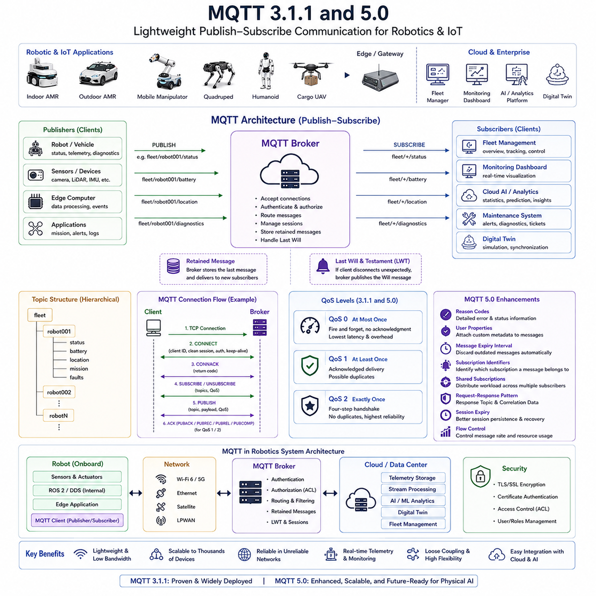
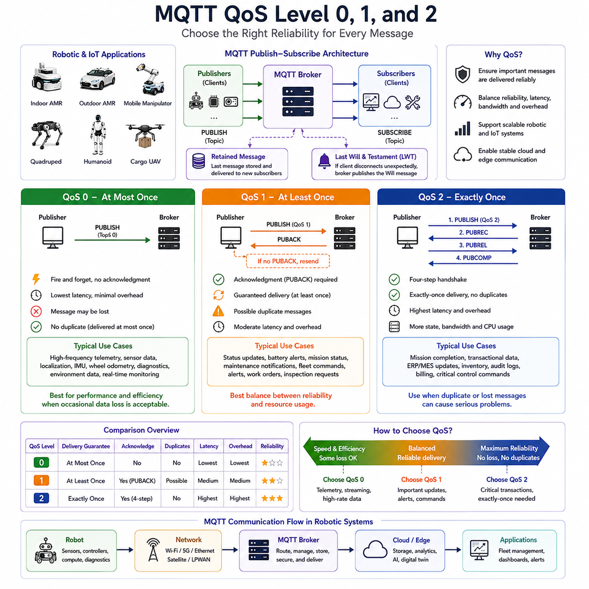
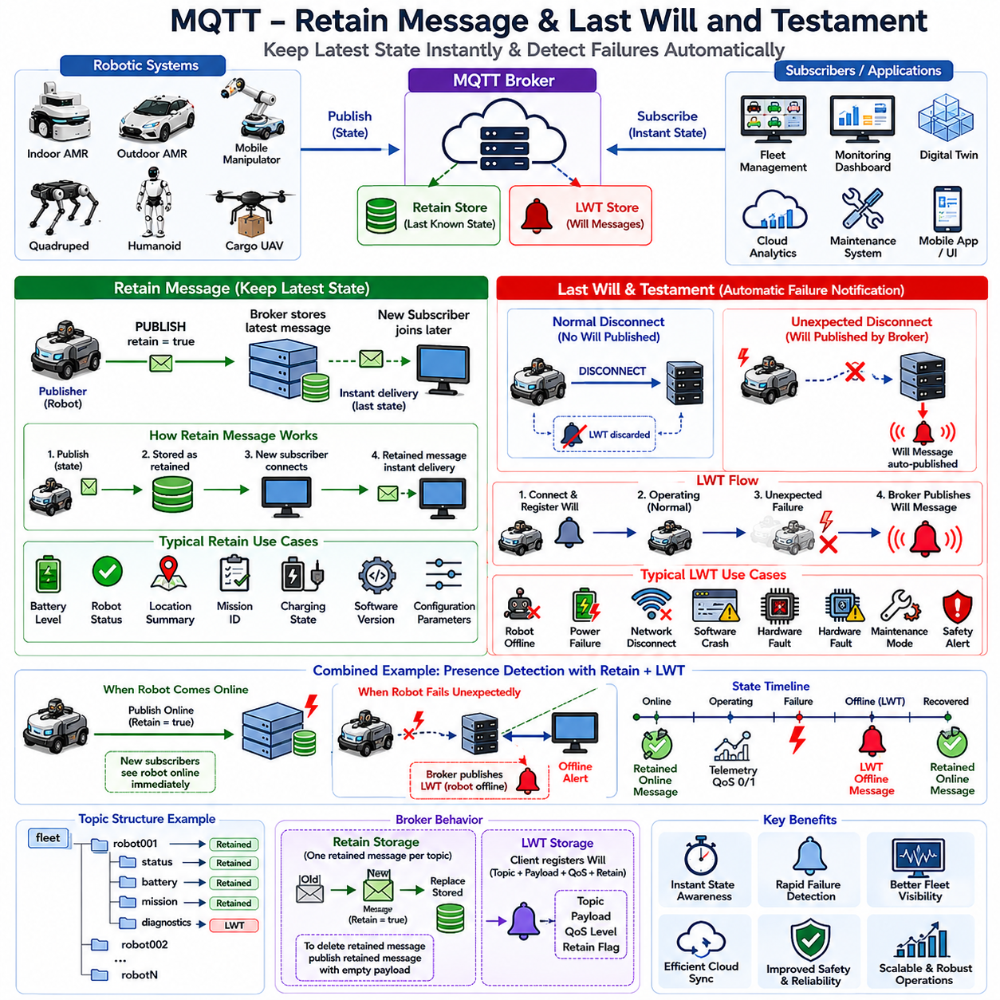
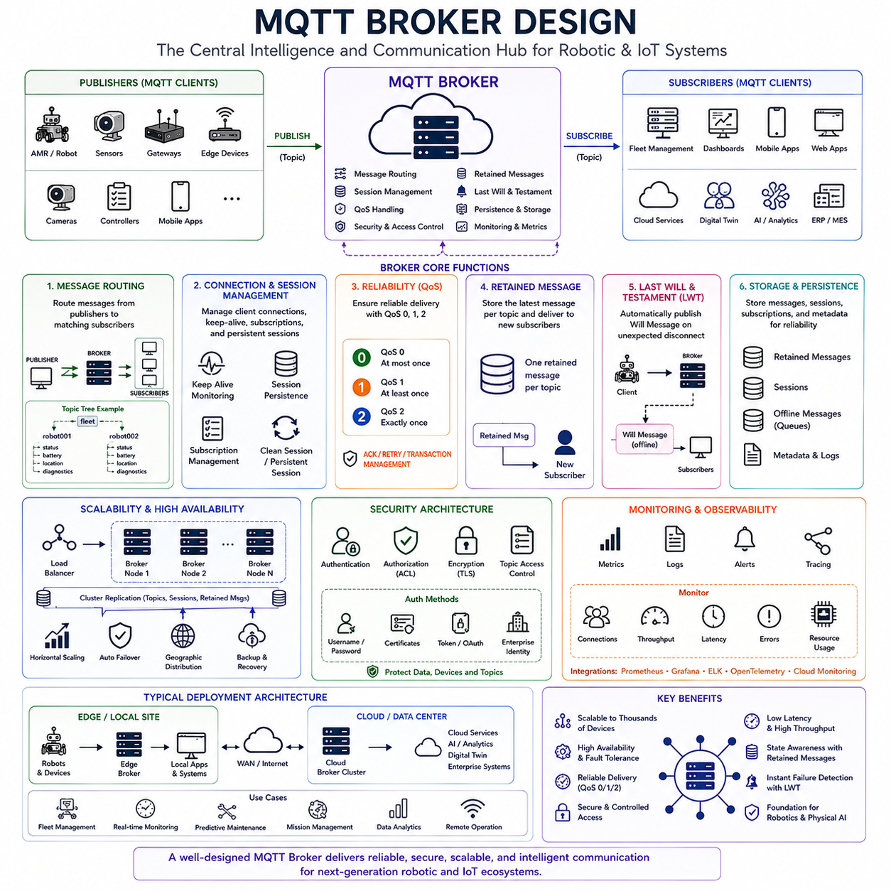
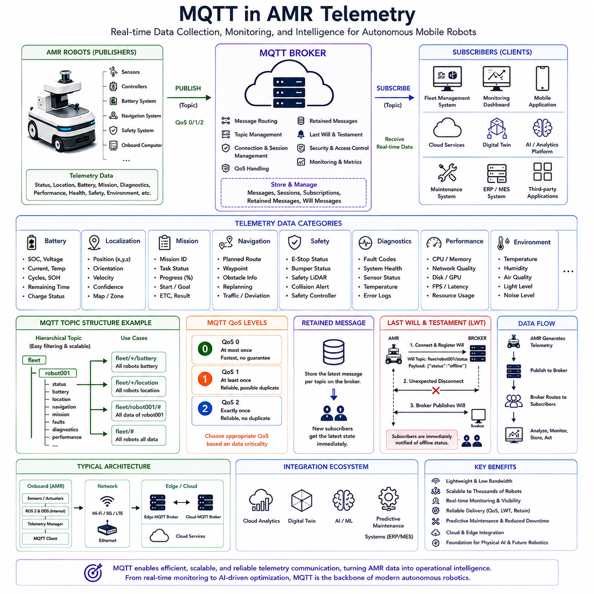

**Volume 09 Robotics Communication**


# Chapter 3. MQTT

##  

## 3.1 MQTT 3.1.1 and 5.0

{width="7.268055555555556in" height="7.268055555555556in"}

MQTT, which stands for Message Queuing Telemetry Transport, is one of the most widely adopted lightweight communication protocols in modern Internet of Things systems, industrial automation platforms, cloud-connected robotics environments, autonomous vehicles, smart factories, and distributed AI infrastructures. Originally developed by IBM and Eurotech in the late 1990s for satellite communication systems and constrained remote telemetry networks, MQTT has evolved into a de facto standard for machine-to-machine communication due to its simplicity, scalability, low bandwidth requirements, and excellent support for unreliable network environments. Within the Hills Robotics communication architecture, MQTT occupies a critical role in fleet management systems, robot telemetry streaming, cloud integration, edge computing communication, digital twin synchronization, predictive maintenance infrastructure, and Physical AI deployment environments. The MQTT section appears within the Robotics Communication domain and specifically addresses how lightweight publish-subscribe communication can be utilized for large-scale robotic systems.

The fundamental philosophy behind MQTT differs significantly from traditional client-server communication models. Conventional protocols such as HTTP operate using direct request-response interactions between clients and servers. In contrast, MQTT utilizes a broker-centered publish-subscribe architecture. Rather than devices communicating directly with one another, all communication passes through a central broker that manages message routing, topic subscriptions, security policies, session management, and message delivery.

This architecture provides several advantages for distributed robotic systems. Robots do not need to know the location, network address, or availability of other devices. Instead, they simply publish information to specific topics and subscribe to topics containing information they require. The broker handles all routing responsibilities, significantly reducing coupling between software components and simplifying large-scale deployments.

In a robotic fleet environment, an individual robot may publish battery information, localization status, mission progress, sensor health metrics, network diagnostics, and fault reports. Simultaneously, fleet management servers, monitoring dashboards, predictive maintenance engines, digital twin platforms, and cloud AI systems may subscribe to these topics. The robot remains unaware of how many systems consume its data, allowing the overall architecture to scale efficiently.

MQTT communication revolves around several core entities. The first is the client. A client represents any device, software process, robot, sensor gateway, edge computer, cloud application, fleet manager, monitoring dashboard, or AI service participating in MQTT communication. Every participant in an MQTT system acts as a client.

The second entity is the broker. The broker functions as the central communication hub. It receives messages from publishers, determines which subscribers are interested in those messages, and distributes the information accordingly. Popular MQTT brokers include Eclipse Mosquitto, EMQX, HiveMQ, VerneMQ, and cloud-based services provided by AWS, Microsoft Azure, and Google Cloud.

The third entity is the topic. Topics represent hierarchical communication channels through which messages are exchanged. Topics are structured as text-based paths that organize information into logical categories. For example, a robotic fleet may utilize topics such as fleet/robot001/status, fleet/robot001/battery, fleet/robot001/location, fleet/robot001/mission, and fleet/robot001/faults. The hierarchical nature of topics simplifies organization and subscription management.

Publishers transmit information to topics without knowing which subscribers exist. Subscribers register interest in topics and automatically receive matching messages. This decoupled communication model significantly improves flexibility and scalability.

MQTT 3.1.1 became the most widely deployed version of the protocol and remains heavily used throughout industrial systems. The MQTT 3.1.1 specification standardized protocol behavior, clarified interoperability requirements, and established a stable foundation that enabled widespread adoption across IoT and robotics industries.

The MQTT 3.1.1 protocol is intentionally lightweight. Packet headers are extremely small, minimizing network bandwidth consumption. The protocol requires minimal computational resources and memory, making it suitable for embedded systems, battery-powered devices, low-bandwidth networks, and resource-constrained robotic platforms.

A typical MQTT connection begins when a client establishes a TCP connection with a broker. Following successful connection establishment, the client transmits a CONNECT packet containing authentication information and session parameters. The broker validates the request and responds with a CONNACK packet indicating acceptance or rejection.

Once connected, the client may publish messages, subscribe to topics, unsubscribe from topics, and maintain connection status through periodic keep-alive mechanisms. The simplicity of this workflow contributes significantly to MQTT\'s popularity.

MQTT 3.1.1 introduced three Quality of Service levels that balance reliability against communication overhead. QoS 0 provides at-most-once delivery, meaning messages are transmitted without acknowledgment. This approach minimizes latency and bandwidth consumption but does not guarantee delivery.

QoS 1 provides at-least-once delivery. Messages are acknowledged by recipients, ensuring delivery but potentially allowing duplicate messages under certain circumstances. This level is commonly used for telemetry and status reporting.

QoS 2 provides exactly-once delivery through a more sophisticated acknowledgment sequence. This mechanism eliminates duplicate delivery but increases protocol complexity and network overhead. QoS 2 is generally reserved for situations requiring maximum reliability.

MQTT 3.1.1 also introduced retained messages. A retained message remains stored by the broker and is automatically delivered to new subscribers upon subscription. This feature allows clients joining the system to immediately obtain the most recent state information without waiting for future updates.

For example, a fleet dashboard connecting to a robotic system can instantly receive the latest robot status, battery level, and mission state through retained messages. Without this mechanism, the dashboard would need to wait for the next telemetry transmission cycle.

Another important feature is the Last Will and Testament mechanism. When a client unexpectedly disconnects due to power failure, network loss, software crash, or hardware malfunction, the broker can automatically publish a predefined message indicating the client\'s disappearance.

This capability is extremely valuable in robotic systems. A robot may register a Last Will message stating that it has become unavailable. If communication is lost unexpectedly, fleet management systems immediately receive notification and can initiate recovery procedures.

Although MQTT 3.1.1 achieved tremendous success, evolving IoT and robotic applications demanded additional capabilities. These requirements ultimately led to the development of MQTT 5.0.

MQTT 5.0 represents a significant enhancement rather than a complete redesign. The core publish-subscribe architecture remains unchanged, preserving compatibility with existing MQTT concepts while introducing substantial improvements in scalability, diagnostics, metadata handling, error reporting, and enterprise integration.

One of the most important additions in MQTT 5.0 is enhanced reason codes. Previous protocol versions often provided limited information when operations failed. MQTT 5.0 introduces detailed reason codes that allow clients to understand exactly why a connection, subscription, publication, or authentication request was rejected.

This improvement simplifies troubleshooting and operational monitoring in large robotic deployments. Fleet operators can rapidly diagnose communication failures, permission issues, broker overload conditions, and network configuration problems.

MQTT 5.0 also introduces user properties. User properties allow arbitrary metadata to be attached to messages, subscriptions, and protocol operations. This feature enables richer communication semantics without modifying payload structures.

For example, a robotic telemetry message may include metadata describing software version, mission identifier, deployment region, customer identifier, AI model version, or operational mode. Such information can significantly improve monitoring and analytics capabilities.

Message expiry intervals represent another important enhancement. In many robotic applications, information becomes obsolete rapidly. A robot position message generated several minutes ago may no longer be relevant. MQTT 5.0 allows publishers to specify message expiration times, ensuring outdated information is automatically discarded.

This capability improves data freshness and prevents stale information from affecting decision-making processes.

Subscription identifiers provide another valuable feature. Clients managing numerous subscriptions can assign identifiers to each subscription and subsequently determine which subscription caused a particular message to be delivered. This simplifies message processing and debugging within complex systems.

Shared subscriptions represent one of the most powerful scalability enhancements introduced in MQTT 5.0. Traditionally, every subscriber receives every message associated with a subscribed topic. Shared subscriptions allow multiple consumers to share message processing workloads.

For example, a large robotic fleet may generate millions of telemetry messages daily. Rather than processing all messages through a single analytics service, multiple backend processors can share the workload. The broker distributes messages among subscribers, improving scalability and fault tolerance.

Request-response communication is another area significantly improved in MQTT 5.0. While MQTT was originally designed primarily for asynchronous publish-subscribe communication, many applications require request-response interactions. MQTT 5.0 introduces response topics and correlation data that facilitate structured request-response workflows.

This capability allows robots to request information from cloud services while still leveraging MQTT infrastructure rather than introducing separate communication protocols.

Session management was also improved substantially. MQTT 5.0 provides greater control over session expiration and state persistence. Clients can maintain subscriptions and communication state across temporary disconnects, reducing reconnection overhead and improving reliability.

Flow control mechanisms introduced in MQTT 5.0 further enhance scalability. Clients and brokers can negotiate limits on message rates, outstanding requests, and resource utilization. These controls help prevent overload conditions and improve overall system stability.

Security remains a critical consideration for both MQTT 3.1.1 and MQTT 5.0. The protocol itself does not mandate encryption but commonly operates over TLS. Secure deployments typically incorporate TLS encryption, certificate-based authentication, access control lists, role-based permissions, and broker-level security policies.

In robotic environments, security becomes particularly important because MQTT often carries operational commands, telemetry information, maintenance data, and AI-related information. Unauthorized access could potentially compromise safety, privacy, or operational continuity.

Within industrial robotics, MQTT frequently complements rather than replaces other communication technologies. ROS 2 commonly manages real-time internal communication using DDS, while MQTT handles cloud connectivity, fleet management, telemetry streaming, remote monitoring, and cross-site communication. This layered architecture combines the strengths of both technologies.

For example, an autonomous mobile robot may use ROS 2 topics internally for sensor processing, localization, navigation, and control. Simultaneously, MQTT transmits battery status, mission updates, health diagnostics, operational statistics, and maintenance information to cloud services. This separation allows each protocol to operate within domains best suited to its characteristics.

Fleet management systems represent one of the most common MQTT use cases. Hundreds or thousands of robots can publish telemetry to centralized brokers while receiving mission assignments, software updates, operational policies, and maintenance instructions. MQTT\'s lightweight nature enables such deployments without excessive network overhead.

Cloud integration platforms also rely heavily on MQTT. AWS IoT Core, Azure IoT Hub, and many industrial IoT platforms provide native MQTT interfaces. Robotic systems can therefore integrate seamlessly with cloud analytics, machine learning pipelines, digital twins, predictive maintenance systems, and enterprise resource planning environments.

Physical AI systems further increase MQTT\'s importance. Future AI-native robots will continuously exchange telemetry, model updates, inference results, operational metrics, fleet coordination information, and cloud-generated intelligence. MQTT\'s scalable publish-subscribe architecture provides a natural foundation for these interactions.

For Hills Robotics platforms, including Indoor AMRs, Outdoor AMRs, Security Robots, Inspection Robots, Fleet Management Systems, Mobile Manipulators, GPR Inspection Vehicles, CAD2SCAN Systems, Quadruped Robots, Humanoid Robots, and future Cargo UAV platforms, MQTT serves as a critical communication mechanism connecting robots, edge infrastructure, cloud services, AI systems, monitoring dashboards, and operational management platforms. MQTT 3.1.1 provides a stable and proven foundation, while MQTT 5.0 introduces advanced capabilities necessary for next-generation autonomous and AI-driven robotic ecosystems.

Ultimately, MQTT 3.1.1 established the lightweight publish-subscribe paradigm that revolutionized IoT and robotic communication. MQTT 5.0 builds upon that foundation by introducing enhanced diagnostics, richer metadata support, improved scalability, advanced session management, shared subscriptions, message expiration, and enterprise-grade communication capabilities. Together these protocol versions form one of the most important communication technologies enabling modern connected robotics and future Physical AI infrastructures.

# 03_01 MQTT 3.1.1과 5.0

MQTT(Message Queuing Telemetry Transport)는 현대 IoT(Internet of Things), 산업 자동화 시스템, 클라우드 기반 로봇 플랫폼, 자율주행 시스템, 스마트 팩토리, 분산 AI 인프라에서 가장 널리 사용되는 경량 통신 프로토콜 중 하나이다. MQTT는 원래 IBM과 Eurotech가 위성 통신 및 저대역폭 원격 모니터링 환경을 위해 개발하였으며, 단순성, 확장성, 낮은 네트워크 사용량, 불안정한 네트워크 환경에 대한 높은 적응력 덕분에 사실상 IoT와 로봇 분야의 표준 프로토콜로 자리 잡았다.

힐스로보틱스의 통신 아키텍처에서도 MQTT는 플릿(Fleet) 관리, 로봇 원격 모니터링, 클라우드 연결, Edge Computing, 디지털 트윈(Digital Twin), 예지보전(Predictive Maintenance), Physical AI 시스템 연결을 위한 핵심 프로토콜로 활용될 수 있다. MQTT는 Robotics Communication 영역의 중요한 구성 요소로서 로봇과 클라우드 간의 경량 메시징 구조를 제공한다.

MQTT의 기본 철학은 전통적인 클라이언트-서버 구조와 상당히 다르다. HTTP와 같은 일반적인 프로토콜은 클라이언트가 서버에 직접 요청(Request)을 보내고 응답(Response)을 받는 구조를 사용한다. 반면 MQTT는 Broker 중심의 Publish-Subscribe 구조를 사용한다.

MQTT 환경에서는 장치들이 서로 직접 통신하지 않는다. 모든 메시지는 중앙 Broker를 통과한다. 각 장치는 필요한 정보를 특정 Topic에 발행(Publish)하고, 필요한 정보를 가진 Topic을 구독(Subscribe)한다. Broker는 이러한 메시지를 적절한 Subscriber에게 전달한다.

이 구조는 대규모 로봇 시스템에서 매우 유리하다. 로봇은 다른 장치의 IP 주소나 위치를 알 필요가 없다. 단순히 Topic에 메시지를 보내기만 하면 되며, Broker가 자동으로 전달을 수행한다. 따라서 시스템 간 결합도가 낮아지고 확장성이 크게 향상된다.

예를 들어 하나의 AMR이 배터리 상태, 위치 정보, 임무 진행 상황, 센서 상태, 진단 정보 등을 Topic에 발행한다고 가정하자. Fleet Manager, Monitoring Dashboard, Digital Twin Server, AI 분석 시스템, 유지보수 플랫폼은 각각 해당 Topic을 구독하여 필요한 정보를 수신할 수 있다. 로봇은 누가 데이터를 사용하는지 전혀 알 필요가 없다.

MQTT의 핵심 구성 요소는 Client, Broker, Topic 세 가지이다.

Client는 MQTT 네트워크에 참여하는 모든 장치를 의미한다. 로봇, 센서 게이트웨이, Edge Computer, Cloud Application, Fleet Server, Dashboard, AI Service 모두 MQTT Client가 될 수 있다.

Broker는 중앙 메시지 허브 역할을 수행한다. Publisher가 보낸 메시지를 수신하고, 해당 Topic을 구독하는 Subscriber들에게 전달한다. 대표적인 Broker로는 Eclipse Mosquitto, EMQX, HiveMQ, VerneMQ 등이 있으며 AWS, Azure, Google Cloud 역시 MQTT 서비스를 제공한다.

Topic은 메시지가 흐르는 논리적 통신 채널이다. Topic은 계층적(Hierarchical) 구조를 가진 문자열로 구성된다.

예를 들면 다음과 같은 Topic 구조를 사용할 수 있다.

fleet/robot001/status

fleet/robot001/battery

fleet/robot001/location

fleet/robot001/mission

fleet/robot001/fault

이러한 계층 구조는 수백 대 이상의 로봇을 관리하는 대규모 시스템에서도 매우 효율적인 데이터 분류를 가능하게 한다.

Publisher는 Topic에 데이터를 송신하며 Subscriber는 Topic을 구독하여 데이터를 수신한다. Publisher와 Subscriber는 서로를 직접 알지 못한다. 이러한 느슨한 결합(Loose Coupling)은 MQTT의 가장 큰 장점 중 하나이다.

MQTT 3.1.1은 MQTT 프로토콜의 가장 널리 사용된 버전으로 산업 현장에서 사실상의 표준이 되었다. MQTT 3.1.1은 프로토콜 동작을 표준화하고 상호운용성을 확보함으로써 IoT와 로봇 산업의 급속한 확산을 가능하게 만들었다.

MQTT 3.1.1의 가장 큰 특징은 매우 가볍다는 점이다. 패킷 헤더 크기가 매우 작아 네트워크 사용량이 적고, CPU 및 메모리 요구사항도 낮다. 따라서 임베디드 시스템, 배터리 기반 장치, 저속 무선망, 로봇 플랫폼 등에 적합하다.

MQTT 연결은 일반적으로 TCP 연결 위에서 동작한다. Client는 Broker에 CONNECT 패킷을 전송하고 Broker는 CONNACK 패킷으로 응답한다. 연결이 수립되면 Publish, Subscribe, Unsubscribe 등의 동작이 가능해진다.

MQTT 3.1.1은 세 가지 QoS(Quality of Service) 수준을 제공한다.

QoS 0은 At Most Once 방식이다. 메시지를 한 번 전송하지만 전달 여부를 확인하지 않는다. 가장 빠르고 네트워크 사용량이 적지만 메시지 손실 가능성이 존재한다.

QoS 1은 At Least Once 방식이다. 수신 확인(Acknowledgement)을 통해 최소 한 번은 전달되도록 보장한다. 단, 중복 메시지가 발생할 수 있다.

QoS 2는 Exactly Once 방식이다. 메시지가 정확히 한 번만 전달되도록 보장한다. 가장 신뢰성이 높지만 프로토콜 오버헤드도 가장 크다.

MQTT 3.1.1은 Retained Message 기능도 제공한다. Broker는 특정 Topic의 마지막 메시지를 저장하고 있다가 새로운 Subscriber가 접속하면 즉시 전달할 수 있다.

예를 들어 Fleet Dashboard가 새로 실행되었을 때 현재 로봇의 배터리 상태와 임무 상태를 즉시 확인할 수 있다. Retained Message가 없다면 다음 상태 업데이트가 올 때까지 기다려야 한다.

또 다른 중요한 기능은 Last Will and Testament(LWT)이다.

로봇이 갑자기 전원이 꺼지거나 네트워크가 끊어지는 경우 Broker는 미리 등록된 Will Message를 자동으로 발행할 수 있다.

예를 들어 로봇이 "robot001 offline" 메시지를 LWT로 등록해 두었다면 통신이 갑자기 끊겼을 때 Fleet Management 시스템은 즉시 해당 로봇이 비정상 종료되었음을 알 수 있다.

MQTT 3.1.1은 매우 성공적이었지만 IoT와 로봇 시스템이 더욱 복잡해지면서 추가적인 기능 요구가 발생하였다. 이를 해결하기 위해 MQTT 5.0이 등장하였다.

MQTT 5.0은 완전히 새로운 프로토콜이 아니라 MQTT 3.1.1을 확장한 버전이다. 기존 Publish-Subscribe 구조는 그대로 유지하면서 진단 기능, 메타데이터 처리, 오류 보고, 확장성, 대규모 시스템 운영 기능이 크게 향상되었다.

MQTT 5.0의 가장 중요한 개선점 중 하나는 Reason Code이다.

MQTT 3.1.1에서는 연결 실패나 인증 실패 시 원인을 정확히 파악하기 어려운 경우가 많았다. MQTT 5.0은 세부적인 오류 코드를 제공하여 운영자가 문제 원인을 쉽게 분석할 수 있도록 지원한다.

이는 대규모 로봇 플릿 운영 시 매우 유용하다. 인증 실패, 권한 문제, Broker 과부하, 네트워크 오류 등을 빠르게 파악할 수 있다.

MQTT 5.0은 User Property 기능도 제공한다.

User Property는 메시지에 추가적인 메타데이터를 부착할 수 있는 기능이다.

예를 들어 로봇 소프트웨어 버전, 고객 정보, AI 모델 버전, 임무 ID, 운영 지역 등의 정보를 메시지와 함께 전달할 수 있다.

Message Expiry Interval도 MQTT 5.0에서 새롭게 추가된 기능이다.

로봇 위치 정보나 센서 데이터는 일정 시간이 지나면 가치가 없어진다. MQTT 5.0은 메시지의 유효 시간을 지정할 수 있어 오래된 정보가 자동으로 폐기된다.

Subscription Identifier 기능은 여러 Subscription을 관리하는 Client에게 매우 유용하다. 어떤 Subscription에 의해 메시지가 전달되었는지 쉽게 식별할 수 있다.

MQTT 5.0의 가장 강력한 기능 중 하나는 Shared Subscription이다.

기존 MQTT에서는 모든 Subscriber가 모든 메시지를 수신한다. 그러나 Shared Subscription을 사용하면 여러 Subscriber가 작업을 분담하여 처리할 수 있다.

예를 들어 하루 수백만 건의 로봇 Telemetry 데이터를 처리해야 하는 경우 여러 Analytics Server가 부하를 나누어 처리할 수 있다. Broker는 메시지를 자동으로 분산시켜 준다.

Request-Response 패턴도 MQTT 5.0에서 크게 향상되었다.

원래 MQTT는 비동기 Publish-Subscribe 구조에 최적화되어 있었지만 MQTT 5.0은 Response Topic과 Correlation Data를 지원하여 요청-응답 방식의 통신도 가능하게 만들었다.

이를 통해 로봇이 클라우드 서비스에 특정 정보를 요청하고 응답을 받는 구조를 MQTT만으로 구현할 수 있다.

Session Management도 개선되었다.

MQTT 5.0은 Session Expiry 기능을 제공하여 일시적인 연결 끊김 상황에서도 Subscription 상태와 세션 정보를 유지할 수 있다.

Flow Control 기능 역시 추가되었다.

Broker와 Client는 메시지 처리량과 자원 사용량을 조정할 수 있으며, 이를 통해 과부하 상황을 방지할 수 있다.

보안(Security)은 MQTT 3.1.1과 MQTT 5.0 모두에서 매우 중요한 요소이다.

MQTT 자체는 암호화를 강제하지 않지만 일반적으로 TLS 위에서 동작한다. 산업용 시스템에서는 TLS 암호화, 인증서 기반 인증, ACL(Access Control List), 역할 기반 권한 관리 등이 함께 사용된다.

로봇 시스템에서는 MQTT를 통해 임무 명령, 상태 정보, 유지보수 데이터, AI 분석 결과 등이 전달될 수 있기 때문에 보안은 필수적이다.

실제 로봇 시스템에서는 MQTT가 DDS나 ROS 2를 대체하는 것이 아니라 보완하는 역할을 수행한다.

예를 들어 ROS 2는 로봇 내부에서 실시간 센서 처리와 제어를 담당한다. 반면 MQTT는 클라우드 연결, Fleet Management, Telemetry Streaming, Remote Monitoring을 담당한다.

실내 AMR은 ROS 2 Topic을 통해 내부 센서 데이터를 처리하면서 동시에 MQTT를 통해 배터리 상태, 위치 정보, 임무 진행 상황, 진단 정보를 클라우드로 전송할 수 있다.

플릿 관리 시스템은 MQTT의 대표적인 응용 사례이다. 수백 대 또는 수천 대의 로봇이 하나의 Broker에 연결되어 상태를 보고하고 임무를 수신할 수 있다.

AWS IoT Core, Azure IoT Hub와 같은 클라우드 플랫폼도 MQTT를 기본적으로 지원한다. 따라서 로봇은 클라우드 AI, 디지털 트윈, 예지보전, ERP 시스템과 쉽게 연동될 수 있다.

Physical AI 시대에는 MQTT의 중요성이 더욱 커질 것으로 예상된다. 미래의 AI 기반 로봇은 Telemetry, AI 모델 업데이트, 추론 결과, 플릿 협업 정보, 클라우드 지능 서비스를 지속적으로 교환해야 한다.

MQTT의 경량 Publish-Subscribe 구조는 이러한 대규모 분산 AI 환경에 매우 적합하다.

힐스로보틱스의 Indoor AMR, Outdoor AMR, Security Robot, Inspection Robot, Fleet Management Platform, Mobile Manipulator, GPR Inspection Vehicle, CAD2SCAN Platform, Quadruped Robot, Humanoid Robot, 그리고 미래의 Cargo UAV 플랫폼에서도 MQTT는 로봇과 클라우드, Edge Server, AI 플랫폼, 운영 대시보드를 연결하는 핵심 통신 기술이 될 수 있다.

결론적으로 MQTT 3.1.1은 경량 Publish-Subscribe 통신 모델을 확립하여 IoT와 로봇 산업의 폭발적인 성장을 이끌었다. MQTT 5.0은 여기에 고급 진단 기능, 메타데이터 지원, 확장성 향상, 세션 관리, Shared Subscription, Message Expiry, 엔터프라이즈급 기능을 추가함으로써 차세대 자율주행 로봇과 Physical AI 플랫폼을 위한 강력한 통신 기반을 제공한다. MQTT는 앞으로도 클라우드 연결형 로봇과 대규모 AI 기반 로봇 생태계의 핵심 통신 프로토콜로 지속적으로 활용될 것이다.

##  

## 3.2 QoS Level 0 1 2

{width="7.268055555555556in" height="7.268055555555556in"}

Quality of Service (QoS) is one of the most important features of the MQTT protocol and serves as the foundation for controlling message delivery reliability in distributed communication systems. In modern robotics, Internet of Things infrastructures, industrial automation environments, cloud-connected autonomous systems, digital twins, and Physical AI platforms, communication reliability directly affects system safety, operational efficiency, and mission success. MQTT addresses these requirements through three distinct Quality of Service levels: QoS 0, QoS 1, and QoS 2. These levels allow system architects to balance communication reliability, network bandwidth consumption, latency, computational overhead, and storage requirements according to application-specific needs.

The concept of Quality of Service exists because not all data exchanged within a robotic system carries the same level of importance. Some information is transient and can tolerate occasional loss, while other information must be delivered reliably under all circumstances. For example, periodic battery updates may tolerate occasional packet loss without affecting overall operation. In contrast, emergency stop commands, critical alarms, safety-related notifications, or mission completion confirmations often require guaranteed delivery. By providing multiple QoS levels, MQTT enables developers to select the most appropriate reliability mechanism for each communication channel.

QoS in MQTT applies independently to individual messages and subscriptions. A publisher may transmit different message types using different QoS settings depending on the importance of the information being exchanged. Similarly, subscribers can negotiate desired QoS levels during topic subscriptions. The MQTT broker manages message delivery according to these policies, ensuring consistent behavior throughout the communication infrastructure.

QoS Level 0 is known as "At Most Once" delivery. This is the simplest and fastest message delivery mode supported by MQTT. In QoS 0 communication, the publisher transmits a message to the broker and immediately considers the transmission complete. No acknowledgment is required, no delivery confirmation is expected, and no retransmission mechanism exists. The message is effectively sent using a "fire-and-forget" strategy.

Because QoS 0 does not require acknowledgment packets, network overhead is minimized. Communication latency remains extremely low, making QoS 0 suitable for applications where performance and bandwidth efficiency are more important than guaranteed delivery. The protocol overhead associated with message tracking, retransmission management, and acknowledgment processing is completely eliminated.

In a robotic fleet environment, certain telemetry streams may be transmitted using QoS 0. Examples include continuously updated robot position estimates, wheel encoder values, camera status information, environmental sensor measurements, and periodic diagnostic statistics. If a single message is lost during transmission, the next update will typically arrive shortly thereafter, making recovery unnecessary.

Consider an Autonomous Mobile Robot publishing localization information ten times per second. If one position update is lost due to temporary network congestion, the next update arrives only one hundred milliseconds later. The system continues functioning normally because the information rapidly becomes obsolete. Retransmitting lost position updates would provide little value while consuming additional network resources.

QoS 0 therefore offers several advantages. Communication latency remains minimal. CPU utilization is reduced because acknowledgment processing is unnecessary. Network bandwidth consumption is minimized because only the original message is transmitted. System scalability improves because brokers can process larger message volumes without maintaining delivery state information.

However, these advantages come at the cost of reliability. Messages may be lost due to network failures, broker overload conditions, client disconnections, wireless interference, routing problems, or hardware faults. The sender receives no indication that a message was lost. Consequently, QoS 0 should only be used when occasional message loss is acceptable.

QoS Level 1 introduces a higher degree of reliability through an "At Least Once" delivery guarantee. Under QoS 1, the publisher transmits a message and expects an acknowledgment from the broker. Specifically, the broker responds with a PUBACK packet confirming successful receipt of the message.

If the publisher does not receive the acknowledgment within an expected time interval, it assumes the message may have been lost and retransmits it. This process continues until acknowledgment is successfully received or the communication session terminates.

The introduction of acknowledgment packets significantly improves reliability because message loss can be detected and corrected through retransmission. However, QoS 1 does not guarantee that a message will be delivered exactly once. Under certain circumstances, duplicate delivery may occur.

Consider a scenario in which the broker receives a message successfully but the acknowledgment packet is lost during transmission back to the publisher. From the publisher\'s perspective, the message appears undelivered because no acknowledgment was received. Consequently, the publisher retransmits the message. The broker then receives a second copy of the same message.

Because MQTT prioritizes guaranteed delivery under QoS 1, duplicate messages are considered acceptable. The protocol guarantees that the message will arrive at least once, even if multiple copies are occasionally delivered.

This behavior makes QoS 1 suitable for many industrial and robotic applications where reliable delivery is more important than strict uniqueness. Mission status updates, maintenance notifications, battery warnings, fault reports, work order assignments, inspection requests, and fleet coordination messages commonly utilize QoS 1 communication.

For example, a robot may report a low battery condition to a fleet management server. Missing this notification could result in mission failure or operational disruption. Receiving the notification twice is generally less problematic than not receiving it at all. Consequently, QoS 1 provides an appropriate balance between reliability and complexity.

QoS 1 introduces moderate communication overhead. Additional acknowledgment packets consume network bandwidth. Message tracking requires memory resources within both clients and brokers. Retransmission logic increases protocol complexity. Nevertheless, the reliability improvements often justify these costs.

In large robotic deployments, QoS 1 frequently represents the default communication mode because it offers strong reliability without excessive protocol overhead. Many MQTT-based fleet management systems rely heavily on QoS 1 for operational messaging.

QoS Level 2 provides the highest reliability available within MQTT and is known as "Exactly Once" delivery. The primary objective of QoS 2 is to ensure that each message reaches its destination precisely one time, eliminating both message loss and duplicate delivery.

Achieving this guarantee requires a more sophisticated communication sequence involving four distinct protocol exchanges. The publisher first transmits the message using a PUBLISH packet. The broker acknowledges receipt using a PUBREC packet. The publisher then sends a PUBREL packet indicating readiness to complete the transaction. Finally, the broker responds with a PUBCOMP packet confirming successful completion.

This four-step handshake creates a transactional communication process that allows both publisher and broker to coordinate message state accurately. Duplicate delivery can therefore be detected and prevented.

QoS 2 effectively combines the reliability of acknowledgment-based communication with mechanisms that eliminate duplicate processing. The result is the strongest delivery guarantee available within MQTT.

This capability becomes important when duplicate messages could create operational problems. Examples include financial transactions, inventory management operations, mission completion records, database updates, billing events, manufacturing execution commands, and safety-critical control actions.

Consider a warehouse robot reporting completion of a delivery mission. If duplicate completion messages are processed, inventory records could become inconsistent, logistics workflows could be disrupted, or downstream automation systems could perform redundant actions. QoS 2 prevents such issues by ensuring that each completion notification is processed exactly once.

Similarly, an autonomous inspection robot may upload defect reports to a maintenance management system. Duplicate reports could trigger unnecessary maintenance activities or create confusion among operators. QoS 2 eliminates this risk through transactional delivery control.

The enhanced reliability of QoS 2 comes at a cost. Communication latency increases because multiple acknowledgment exchanges are required. Network bandwidth consumption rises due to additional protocol packets. Memory requirements grow because message state must be maintained throughout the transaction. CPU utilization increases because more complex protocol logic is executed.

Consequently, QoS 2 should be reserved for situations where exact delivery semantics provide clear operational benefits. Using QoS 2 for high-frequency telemetry streams would unnecessarily increase resource consumption without significantly improving system performance.

Comparing the three QoS levels highlights their distinct tradeoffs. QoS 0 prioritizes speed and efficiency while accepting possible message loss. QoS 1 prioritizes reliable delivery while tolerating occasional duplicates. QoS 2 prioritizes both reliable delivery and uniqueness while accepting higher communication overhead.

The choice of QoS level should always be guided by application requirements rather than a desire for maximum reliability. Selecting the highest QoS level for every message often leads to unnecessary complexity and reduced system scalability.

In robotic systems, communication requirements vary widely across subsystems. High-frequency sensor streams generally favor QoS 0 because data rapidly becomes obsolete. Fleet coordination messages often utilize QoS 1 because reliable delivery is important while duplicate handling remains manageable. Mission accounting records, maintenance transactions, and operational state transitions may require QoS 2 because duplicate processing could produce undesirable consequences.

Within a typical Autonomous Mobile Robot architecture, localization updates, wheel odometry data, IMU measurements, environmental telemetry, and diagnostic statistics may operate using QoS 0. Battery alarms, navigation status updates, maintenance notifications, charging requests, and mission assignments often use QoS 1. Mission completion confirmations, inventory transactions, production reporting events, and audit records may utilize QoS 2.

The MQTT broker plays a central role in implementing QoS behavior. Brokers maintain message state information, manage acknowledgment processing, coordinate retransmissions, and ensure compliance with protocol requirements. As QoS levels increase, broker resource consumption also increases.

Large-scale robotic fleets may generate millions of messages per day. System architects must therefore consider broker scalability when selecting QoS policies. Excessive use of QoS 2 can significantly increase memory usage, CPU load, and storage requirements within broker infrastructure.

MQTT 5.0 further enhances QoS operation through improved diagnostics, reason codes, session management, and flow control mechanisms. Enhanced reason codes provide detailed information regarding acknowledgment failures and communication problems. Session management improvements support reliable message delivery across temporary disconnections. Flow control mechanisms help prevent overload conditions that could otherwise affect QoS performance.

Security considerations also interact closely with QoS configuration. TLS encryption, certificate-based authentication, access control policies, and secure session management protect message integrity throughout transmission. Reliable delivery mechanisms become particularly valuable when operating across public networks, cloud infrastructures, and geographically distributed robotic fleets.

Cloud-connected robotic systems frequently combine multiple QoS levels simultaneously. An indoor AMR may publish telemetry using QoS 0, fleet status updates using QoS 1, and mission completion records using QoS 2. This layered approach optimizes resource utilization while maintaining appropriate reliability for each information category.

Outdoor autonomous vehicles, inspection robots, security robots, mobile manipulators, and future Physical AI systems similarly benefit from differentiated QoS strategies. Sensor-rich platforms generate enormous volumes of transient information that do not require guaranteed delivery, while operational coordination messages often demand stronger reliability guarantees.

For Hills Robotics platforms, including Indoor AMRs, Outdoor AMRs, Inspection Robots, Security Robots, Fleet Management Systems, Mobile Manipulators, CAD2SCAN Platforms, GPR Inspection Vehicles, Quadruped Robots, Humanoid Robots, and future Cargo UAV systems, careful QoS selection is essential for balancing performance, scalability, reliability, and operational efficiency. High-frequency telemetry can utilize QoS 0, fleet coordination may employ QoS 1, and mission-critical transactional events can leverage QoS 2.

Ultimately, MQTT QoS Levels 0, 1, and 2 provide a flexible framework for tailoring communication reliability to application requirements. QoS 0 delivers maximum efficiency through at-most-once delivery. QoS 1 delivers strong reliability through at-least-once delivery. QoS 2 delivers the highest assurance through exactly-once delivery. Together these mechanisms allow MQTT-based robotic systems to achieve an optimal balance between performance, scalability, bandwidth utilization, and operational reliability, making MQTT a foundational communication technology for modern robotics, industrial automation, cloud-connected infrastructure, and future Physical AI ecosystems.

# 03_02 QoS Level 0, 1, 2

QoS(Quality of Service)는 MQTT 프로토콜의 가장 중요한 기능 중 하나로, 분산 통신 시스템에서 메시지 전달의 신뢰성을 제어하는 핵심 메커니즘이다. 현대의 로봇 시스템, IoT 인프라, 산업 자동화 환경, 클라우드 기반 자율주행 플랫폼, 디지털 트윈 시스템, 그리고 Physical AI 환경에서는 통신 신뢰성이 시스템의 안전성, 운영 효율성, 그리고 임무 성공 여부에 직접적인 영향을 미친다. MQTT는 이러한 요구사항을 만족하기 위해 QoS 0, QoS 1, QoS 2라는 세 가지 서비스 품질 수준을 제공한다. 이를 통해 개발자는 네트워크 대역폭, 지연시간, CPU 부하, 메모리 사용량, 그리고 전달 신뢰성 사이에서 적절한 균형을 선택할 수 있다.

QoS가 필요한 이유는 로봇 시스템에서 교환되는 모든 데이터의 중요도가 동일하지 않기 때문이다. 어떤 데이터는 일부 손실이 발생해도 문제가 없지만, 어떤 데이터는 반드시 전달되어야 한다. 예를 들어 배터리 상태나 위치 정보와 같은 주기적인 상태 데이터는 일부 메시지가 손실되어도 다음 데이터가 곧 도착하기 때문에 큰 문제가 없다. 반면 비상 정지(E-Stop) 명령, 치명적인 장애 알람, 임무 완료 보고와 같은 정보는 반드시 전달되어야 한다. MQTT의 QoS는 이러한 다양한 요구사항을 지원하기 위해 설계되었다.

QoS는 메시지 단위로 적용된다. Publisher는 메시지를 전송할 때 QoS 수준을 지정할 수 있으며, Subscriber 역시 구독 시 원하는 QoS 수준을 설정할 수 있다. Broker는 이 설정에 따라 메시지를 전달하고 신뢰성을 보장한다.

QoS Level 0은 "At Most Once" 방식으로 불린다. 이는 MQTT에서 가장 단순하고 빠른 메시지 전달 방식이다. Publisher는 메시지를 Broker로 전송한 후 전달 여부를 확인하지 않는다. Broker 역시 수신 확인 응답을 보내지 않는다. 메시지는 단순히 한 번 전송되고 그 과정이 종료된다.

QoS 0은 흔히 "Fire and Forget" 방식이라고도 불린다. 메시지를 보내고 잊어버리는 구조이다. 따라서 가장 적은 네트워크 자원을 사용하며 가장 낮은 지연시간을 제공한다.

QoS 0은 확인 응답이 필요하지 않기 때문에 네트워크 트래픽이 최소화된다. CPU 부하도 매우 낮으며 Broker 역시 메시지 상태를 추적할 필요가 없다. 따라서 대량의 데이터가 지속적으로 발생하는 환경에 적합하다.

예를 들어 AMR이 초당 10회 위치 정보를 전송한다고 가정하자. 만약 한 번의 위치 데이터가 손실되더라도 100ms 후에 새로운 위치 데이터가 전송된다. 이 경우 이전 데이터는 이미 가치가 없기 때문에 재전송이 필요하지 않다.

이러한 이유로 위치 정보, IMU 데이터, Wheel Encoder 데이터, 환경 센서 값, 온도 데이터, CPU 사용률, 네트워크 상태 정보와 같은 고주기 Telemetry 데이터는 일반적으로 QoS 0을 사용한다.

QoS 0의 가장 큰 장점은 매우 낮은 지연시간과 높은 처리량이다. 또한 Broker가 관리해야 하는 상태 정보가 없기 때문에 수천 대 이상의 로봇이 연결되는 대규모 시스템에서도 효율적으로 동작할 수 있다.

반면 QoS 0은 신뢰성을 보장하지 않는다. 네트워크 장애, Broker 과부하, 무선 간섭, 클라이언트 연결 끊김 등의 상황이 발생하면 메시지가 손실될 수 있다. 또한 Publisher는 메시지가 실제로 전달되었는지 확인할 방법이 없다.

따라서 QoS 0은 일부 메시지 손실이 허용되는 경우에만 사용하는 것이 바람직하다.

QoS Level 1은 "At Least Once" 전달 방식을 제공한다. 이 방식에서는 Publisher가 메시지를 전송한 후 Broker로부터 PUBACK(Packet Acknowledgement)를 수신해야 한다.

Broker가 메시지를 정상적으로 수신하면 PUBACK 패킷을 Publisher에게 전송한다. Publisher는 PUBACK를 수신한 시점에 메시지 전달이 완료되었다고 판단한다.

만약 PUBACK가 일정 시간 안에 도착하지 않으면 Publisher는 메시지가 손실되었다고 가정하고 동일한 메시지를 다시 전송한다.

이러한 구조는 메시지 손실을 방지하는 효과가 있다. 하지만 QoS 1은 "최소 한 번 전달"을 보장할 뿐 "정확히 한 번 전달"을 보장하지는 않는다.

예를 들어 Broker는 메시지를 정상적으로 수신했지만 PUBACK 패킷이 네트워크 장애로 인해 손실되었다고 가정해 보자. Publisher는 PUBACK를 받지 못했기 때문에 메시지를 다시 전송한다. 결과적으로 Broker는 동일한 메시지를 두 번 받게 된다.

즉 QoS 1에서는 중복 메시지(Duplicate Message)가 발생할 수 있다.

그러나 MQTT는 QoS 1에서 메시지 유실을 방지하는 것을 더 중요하게 생각한다. 따라서 중복은 허용하되 전달 실패는 허용하지 않는 방식이다.

이러한 특성 때문에 QoS 1은 산업용 로봇 시스템에서 가장 널리 사용되는 QoS 수준이다.

예를 들어 배터리 부족 경고, 임무 상태 업데이트, 유지보수 요청, 오류 보고, Fleet 명령, 검사 결과 알림 등의 데이터는 반드시 전달되어야 하지만 중복으로 수신되어도 큰 문제가 되지 않는다.

배터리 부족 경고를 두 번 받는 것은 크게 문제가 되지 않지만, 경고를 전혀 받지 못하는 것은 심각한 문제를 일으킬 수 있다. 이러한 경우 QoS 1이 적합하다.

QoS 1은 QoS 0보다 약간 더 많은 네트워크 대역폭과 메모리를 사용한다. ACK 패킷을 주고받아야 하며 Broker와 Client가 메시지 상태를 관리해야 하기 때문이다.

그럼에도 불구하고 신뢰성과 효율성의 균형이 우수하기 때문에 실제 산업용 IoT와 로봇 시스템에서는 가장 많이 사용되는 QoS 레벨이라고 할 수 있다.

QoS Level 2는 MQTT에서 제공하는 가장 높은 수준의 신뢰성이다. QoS 2는 "Exactly Once" 전달을 보장한다.

즉 메시지가 반드시 전달되며 동시에 중복도 발생하지 않는다.

이를 위해 QoS 2는 보다 복잡한 4단계 핸드셰이크(Handshake)를 사용한다.

먼저 Publisher가 PUBLISH 패킷을 전송한다. Broker는 PUBREC(Packet Received)을 반환한다. Publisher는 PUBREL(Packet Release)을 전송한다. 마지막으로 Broker는 PUBCOMP(Packet Complete)를 반환한다.

이 네 단계의 절차를 통해 Publisher와 Broker는 메시지 상태를 정확하게 추적할 수 있으며 중복 전송 여부를 관리할 수 있다.

결과적으로 QoS 2는 메시지가 정확히 한 번만 처리되도록 보장한다.

이러한 특성은 중복 메시지가 심각한 문제를 일으킬 수 있는 경우에 매우 중요하다.

예를 들어 창고 로봇이 물품 배송 완료를 보고한다고 가정하자. 동일한 완료 메시지가 두 번 처리되면 재고 관리 시스템에 오류가 발생할 수 있다.

또 다른 예로 검사 로봇이 결함 보고서를 업로드하는 경우를 생각해 볼 수 있다. 동일한 결함 보고가 두 번 처리되면 불필요한 유지보수 작업이 생성될 수 있다.

금융 거래, 생산 실적 보고, ERP 업데이트, MES 연동, 유지보수 작업 생성, 임무 완료 기록과 같은 데이터는 QoS 2가 적합한 대표적인 사례이다.

QoS 2는 가장 강력한 신뢰성을 제공하지만 그만큼 비용도 크다.

4단계 핸드셰이크로 인해 지연시간이 증가한다. 추가 패킷 전송 때문에 네트워크 사용량도 증가한다. Broker와 Client는 더 많은 상태 정보를 저장해야 하므로 메모리 사용량도 증가한다. CPU 부하 역시 높아진다.

따라서 QoS 2는 반드시 필요한 경우에만 사용하는 것이 바람직하다.

고주기 센서 데이터에 QoS 2를 사용하는 것은 일반적으로 비효율적이다. 위치 정보나 카메라 상태 정보가 정확히 한 번만 전달될 필요는 없기 때문이다.

세 가지 QoS를 비교해 보면 각기 다른 특성을 가진다.

QoS 0은 속도와 효율성을 최우선으로 하며 메시지 손실을 허용한다.

QoS 1은 신뢰성을 우선하며 중복을 허용한다.

QoS 2는 신뢰성과 중복 방지를 모두 제공하지만 가장 높은 오버헤드를 가진다.

따라서 항상 가장 높은 QoS를 사용하는 것이 최선은 아니다. 데이터의 중요도에 따라 적절한 QoS를 선택하는 것이 중요하다.

일반적인 AMR 시스템에서는 Localization 데이터, IMU 데이터, Wheel Odometry, Telemetry 데이터는 QoS 0을 사용한다.

배터리 경고, Fleet 명령, 충전 요청, 유지보수 알림, 장애 보고는 QoS 1을 사용한다.

임무 완료 보고, ERP 연동 데이터, 생산 실적 기록, 재고 관리 데이터, 감사(Audit) 기록은 QoS 2를 사용하는 것이 일반적이다.

MQTT Broker는 QoS 구현의 핵심 역할을 담당한다. Broker는 메시지 상태를 저장하고 ACK를 처리하며 재전송을 관리한다. QoS 수준이 높아질수록 Broker가 관리해야 하는 정보도 증가한다.

수천 대의 로봇이 연결된 Fleet 환경에서는 하루 수백만 건의 메시지가 발생할 수 있다. 따라서 모든 데이터를 QoS 2로 처리하는 것은 비효율적이며 시스템 확장성을 저하시킬 수 있다.

MQTT 5.0은 QoS 기능을 더욱 강화하였다. 향상된 Reason Code를 통해 ACK 실패 원인을 정확히 분석할 수 있으며 Session Management 개선을 통해 일시적인 네트워크 끊김 이후에도 안정적으로 메시지 전달을 유지할 수 있다. 또한 Flow Control 기능을 통해 Broker 과부하를 방지할 수 있다.

보안 역시 QoS와 밀접하게 관련된다. TLS 암호화, 인증서 기반 인증, ACL(Access Control List), 사용자 권한 관리 등을 함께 적용하면 메시지의 신뢰성과 무결성을 더욱 강화할 수 있다.

실제 로봇 시스템에서는 여러 QoS를 동시에 사용하는 경우가 대부분이다. 실내 AMR은 위치 정보와 Telemetry는 QoS 0으로 전송하고, Fleet 상태 보고는 QoS 1로 처리하며, 임무 완료 기록은 QoS 2로 전송할 수 있다.

실외 자율주행 차량, 검사 로봇, 보안 로봇, 모바일 매니퓰레이터, 그리고 미래의 Physical AI 플랫폼 역시 동일한 접근 방식을 사용하게 된다. 대용량 센서 데이터는 QoS 0을 사용하고 운영 정보는 QoS 1을 사용하며, 거래성(Transaction) 데이터는 QoS 2를 사용하는 방식이다.

힐스로보틱스의 Indoor AMR, Outdoor AMR, Inspection Robot, Security Robot, Fleet Management System, Mobile Manipulator, CAD2SCAN Platform, GPR Inspection Vehicle, Quadruped Robot, Humanoid Robot, 그리고 미래의 Cargo UAV 플랫폼에서도 QoS 선택은 통신 아키텍처 설계의 핵심 요소가 된다. 고주기 Telemetry는 QoS 0, Fleet 운영 데이터는 QoS 1, 임무 완료 및 ERP 연계 데이터는 QoS 2를 사용하는 방식이 일반적인 설계 방향이 될 수 있다.

결론적으로 MQTT의 QoS 0, QoS 1, QoS 2는 통신 신뢰성을 상황에 맞게 조절할 수 있는 매우 강력한 메커니즘이다. QoS 0은 최대 성능을 제공하는 At Most Once 방식이며, QoS 1은 신뢰성을 보장하는 At Least Once 방식이다. QoS 2는 가장 높은 수준의 안정성을 제공하는 Exactly Once 방식이다. 이 세 가지 QoS 수준은 성능, 확장성, 네트워크 사용량, 신뢰성 사이에서 최적의 균형을 제공하며, 현대 로봇 시스템과 미래 Physical AI 플랫폼의 핵심 통신 기술로 활용되고 있다.

##  

## 3.3 Retain and Last Will Testament

{width="7.268055555555556in" height="7.268055555555556in"}

Retain Messages and Last Will and Testament (LWT) are two of the most powerful and practical features provided by the MQTT protocol. While MQTT is fundamentally known for its lightweight publish-subscribe communication model, the protocol\'s true value in industrial automation, robotics, fleet management, cloud connectivity, and Physical AI systems becomes evident through these advanced operational mechanisms. Retain Messages ensure that newly connected subscribers immediately receive the most recent state information, while Last Will and Testament provides automatic failure notification when devices unexpectedly disconnect from the network. Together, these features significantly enhance reliability, observability, fault detection, system awareness, and operational continuity in distributed robotic systems.

Modern robotic systems operate within highly dynamic environments where devices continuously join and leave communication networks. Autonomous Mobile Robots, outdoor autonomous vehicles, mobile manipulators, inspection robots, security robots, warehouse automation systems, and future Physical AI platforms frequently communicate with cloud services, edge computing nodes, fleet management servers, monitoring dashboards, and digital twin infrastructures. In such environments, maintaining awareness of current system state becomes critically important.

Traditional publish-subscribe communication models only deliver messages to subscribers that are actively connected at the moment messages are published. If a subscriber joins the system after a message has already been transmitted, the information is typically lost. While this behavior may be acceptable for transient telemetry streams, it becomes problematic when newly connected systems require immediate access to the current operational state of devices.

Retain Messages were introduced to solve this challenge. A retained message is a normal MQTT message that includes a retain flag. When a publisher transmits a message with the retain flag enabled, the MQTT broker stores the message as the most recent value associated with that topic. Whenever a new subscriber subscribes to the topic, the broker immediately delivers the retained message without waiting for the publisher to transmit another update.

The retained message effectively acts as a snapshot of the latest known state. Instead of waiting for future updates, subscribers instantly receive the most current information available within the broker.

Consider a robotic fleet management system containing hundreds of autonomous robots operating across multiple facilities. Each robot periodically publishes battery status information to a topic such as fleet/robot001/battery. If these messages are transmitted as retained messages, a monitoring dashboard that connects later can immediately obtain the current battery level without waiting for the next telemetry update cycle.

Without retained messages, the dashboard might display incomplete information until the next battery update occurs. Depending on update frequency, this delay could range from several seconds to several minutes. Retained messages eliminate this uncertainty by providing immediate state visibility.

The usefulness of retained messages becomes even more apparent when examining system startup procedures. In large robotic deployments, multiple software services often start at different times. Cloud services may reboot, dashboards may reconnect, digital twin applications may restart, and maintenance tools may join the system after robots have already been operating for hours.

Retained messages ensure that newly connected services immediately acquire essential system state information. Robot availability, battery levels, operating modes, mission assignments, localization status, fault conditions, charging status, and software versions can all be communicated through retained topics.

Retained messages are particularly effective for state-oriented information. Data that represents the current condition of a system is often well suited for retention because subscribers typically need the latest value rather than a complete historical sequence.

Examples include operational status indicators, current location summaries, active mission identifiers, charging station assignments, fleet configuration parameters, network connectivity status, maintenance schedules, software deployment versions, and AI model identifiers.

However, not all data should be retained. High-frequency sensor streams such as camera images, LiDAR point clouds, IMU measurements, wheel encoder values, and raw telemetry generally do not benefit from retention. Such information rapidly becomes obsolete and storing the latest sample may provide little practical value.

Understanding how brokers manage retained messages is important. Each topic can maintain only a single retained message. Whenever a new retained message is published to a topic, it replaces the previous retained message. The broker therefore always stores the latest known value rather than maintaining a history of all values.

Deleting retained messages is also possible. A publisher can transmit a retained message containing an empty payload. Upon receiving this message, the broker removes the retained message associated with the topic. Future subscribers will therefore receive no retained information for that topic.

This capability allows dynamic management of retained state information. When a robot is permanently removed from service, its retained topics can be cleared to prevent outdated information from appearing in future system views.

Retained messages contribute significantly to digital twin architectures. Digital twins rely on accurate representations of current system state. When digital twin applications reconnect after maintenance or software upgrades, retained messages allow rapid reconstruction of robot status without requiring extensive synchronization procedures.

While retained messages address state persistence, Last Will and Testament addresses fault detection and unexpected disconnections.

In distributed robotic systems, network failures, power outages, software crashes, hardware malfunctions, and wireless communication disruptions are unavoidable realities. Detecting these failures rapidly is essential for maintaining operational awareness and ensuring safe system behavior.

Without explicit failure detection mechanisms, disconnected devices may simply disappear from the network without explanation. Other systems may continue assuming that disconnected devices remain operational. Such uncertainty can create significant operational risks.

Last Will and Testament provides an elegant solution to this problem. When an MQTT client initially connects to a broker, it may register a special message known as a Will Message. This message remains stored within the broker but is not immediately published.

As long as the client disconnects normally using the MQTT DISCONNECT procedure, the Will Message is discarded and never transmitted. However, if the client unexpectedly disappears due to power failure, software crash, network interruption, hardware malfunction, operating system failure, or communication timeout, the broker automatically publishes the Will Message on behalf of the disconnected client.

This mechanism effectively serves as an automatic failure notification system.

Consider an autonomous mobile robot operating within a warehouse. During connection establishment, the robot registers a Will Message indicating "robot001 offline" on a topic such as fleet/robot001/status. If the robot experiences a sudden power loss and communication ceases unexpectedly, the broker automatically publishes the offline notification.

Fleet management systems, monitoring dashboards, maintenance platforms, digital twin services, and supervisory control systems immediately receive notification that the robot has become unavailable. Operators can respond appropriately without waiting for manual diagnosis.

The distinction between normal disconnection and abnormal disconnection is central to LWT functionality. If the robot intentionally shuts down and sends a DISCONNECT message, the broker understands that the departure was expected and suppresses the Will Message. Only unexpected failures trigger automatic publication.

This behavior significantly reduces false alarms while ensuring rapid fault detection.

The operational value of LWT increases dramatically as robotic systems scale. In a fleet containing hundreds or thousands of robots, manually monitoring connectivity becomes impractical. Automatic failure reporting enables centralized monitoring systems to maintain accurate awareness of fleet health.

LWT also supports hierarchical monitoring architectures. Individual robots may publish offline notifications. Edge gateways may publish connectivity alerts. Regional fleet managers may publish service availability information. Cloud infrastructure components may register failure notifications as well.

The result is a comprehensive operational awareness framework spanning the entire robotic ecosystem.

One common deployment pattern involves combining retained messages and LWT within the same topic structure. A robot may publish "online" status messages as retained messages while simultaneously registering an LWT message that publishes "offline" upon unexpected disconnection.

This arrangement creates a highly effective presence detection mechanism. When the robot connects successfully, it publishes a retained status message indicating availability. New subscribers immediately see the robot as online. If the robot subsequently disconnects unexpectedly, the broker automatically publishes the offline notification.

Consequently, all system participants maintain an accurate view of robot availability without requiring specialized heartbeat protocols.

MQTT brokers treat Will Messages similarly to ordinary published messages. The Will Message can utilize QoS 0, QoS 1, or QoS 2 reliability levels. It can also be published as a retained message if desired.

This flexibility allows system architects to tailor failure notification behavior according to application requirements. Safety-critical environments may utilize higher QoS levels to ensure reliable fault reporting, while large-scale telemetry environments may prioritize efficiency.

In industrial automation systems, LWT frequently serves as a foundation for supervisory monitoring. Production systems, robotic workcells, conveyor controllers, inspection stations, autonomous vehicles, and edge computing nodes all register Will Messages that enable rapid detection of abnormal conditions.

For autonomous robots operating outdoors, LWT becomes even more valuable because physical access to devices may be limited. Network operations centers can immediately detect communication failures and initiate recovery procedures.

Inspection robots operating in hazardous environments similarly benefit from automatic fault reporting. Operators gain visibility into system health without requiring direct interaction with deployed equipment.

Cloud-connected robotic systems frequently use retained messages and LWT together to synchronize operational state across distributed infrastructure. Cloud services can immediately reconstruct system state through retained messages while simultaneously receiving fault notifications through LWT mechanisms.

The introduction of MQTT 5.0 further enhanced these capabilities. MQTT 5.0 provides improved session management, richer metadata support, enhanced diagnostics, message expiry intervals, and more sophisticated operational control mechanisms. These enhancements improve both retained message management and Will Message processing.

Message expiry intervals, for example, can prevent stale retained information from persisting indefinitely. Session management improvements help maintain state consistency during temporary network disruptions. Enhanced diagnostics simplify troubleshooting when connectivity issues occur.

Security considerations are equally important. Retained messages and LWT often contain operationally sensitive information. Battery levels, robot availability, fault conditions, maintenance status, deployment locations, software versions, and mission assignments may all represent valuable operational data.

Secure MQTT deployments therefore utilize TLS encryption, certificate-based authentication, role-based authorization, access control lists, and broker security policies to protect retained state information and failure notifications from unauthorized access.

Within ROS 2-based robotic systems, MQTT retained messages and LWT frequently complement DDS communication. DDS handles real-time internal communication while MQTT provides fleet-level state awareness and cloud integration. This hybrid architecture combines deterministic local communication with scalable distributed monitoring.

For Hills Robotics platforms, including Indoor AMRs, Outdoor AMRs, Security Robots, Inspection Robots, Fleet Management Systems, Mobile Manipulators, CAD2SCAN Platforms, GPR Inspection Vehicles, Quadruped Robots, Humanoid Robots, and future Cargo UAV systems, Retain Messages and Last Will and Testament provide essential operational capabilities. Retained messages ensure immediate visibility of robot status, battery condition, mission state, charging availability, and software configuration. Last Will and Testament enables automatic detection of failures, communication loss, power interruptions, and unexpected system shutdowns.

Ultimately, Retain Messages and Last Will and Testament transform MQTT from a simple messaging protocol into a powerful operational management platform. Retained messages preserve current system state for future subscribers, while LWT ensures rapid awareness of unexpected failures. Together they provide the foundation for reliable fleet monitoring, digital twin synchronization, cloud integration, predictive maintenance, autonomous operations management, and future Physical AI communication infrastructures. As robotic systems continue expanding in scale and complexity, these MQTT capabilities will remain fundamental building blocks for resilient and intelligent distributed communication architectures.

# 03_03 Retain Message와 Last Will Testament

Retain Message와 Last Will Testament(LWT)는 MQTT 프로토콜이 제공하는 가장 강력하고 실용적인 기능 중 두 가지이다. MQTT는 일반적으로 경량 Publish-Subscribe 통신 프로토콜로 알려져 있지만, 실제 산업 자동화, 로봇 시스템, 플릿 관리, 클라우드 연결, 디지털 트윈, 그리고 Physical AI 플랫폼에서 MQTT의 진정한 가치는 이러한 고급 운영 기능을 통해 나타난다. Retain Message는 새롭게 연결된 Subscriber가 즉시 최신 상태 정보를 받을 수 있도록 지원하며, Last Will Testament는 장치가 예기치 않게 네트워크에서 사라졌을 때 자동으로 장애 알림을 생성한다. 이 두 기능은 분산 로봇 시스템의 신뢰성, 가시성(Visibility), 장애 감지 능력, 운영 연속성, 그리고 시스템 인지 능력을 크게 향상시킨다.

현대 로봇 시스템은 매우 동적인 환경에서 운영된다. AMR, 실외 자율주행 차량, 모바일 매니퓰레이터, 검사 로봇, 보안 로봇, 창고 자동화 시스템, 그리고 미래의 Physical AI 플랫폼은 클라우드 서비스, Edge Computer, Fleet Management Server, Monitoring Dashboard, Digital Twin 플랫폼과 지속적으로 연결되고 분리된다. 이러한 환경에서는 현재 시스템 상태를 정확하게 파악하는 것이 매우 중요하다.

일반적인 Publish-Subscribe 구조에서는 Subscriber가 메시지가 발행되는 순간 연결되어 있어야만 해당 메시지를 수신할 수 있다. Subscriber가 나중에 접속하면 과거에 발행된 정보는 받을 수 없다. 실시간 Telemetry 데이터에서는 이러한 동작이 문제가 되지 않을 수 있지만, 현재 상태를 즉시 알아야 하는 시스템에서는 상당한 제약이 된다.

Retain Message는 이러한 문제를 해결하기 위해 만들어졌다. Retain Message는 일반 MQTT 메시지와 동일하지만 Retain Flag가 설정되어 있다는 점이 다르다. Publisher가 Retain Flag를 활성화하여 메시지를 전송하면 Broker는 해당 Topic의 최신 메시지를 저장한다. 이후 새로운 Subscriber가 해당 Topic을 구독하면 Broker는 즉시 저장된 메시지를 전달한다.

즉 Retain Message는 Topic의 최신 상태 스냅샷 역할을 수행한다. Subscriber는 다음 업데이트를 기다릴 필요 없이 현재 상태를 즉시 확인할 수 있다.

예를 들어 수백 대의 AMR을 운영하는 Fleet Management 시스템을 생각해 보자. 각 로봇은 배터리 상태를 fleet/robot001/battery와 같은 Topic에 발행한다. 만약 이 메시지가 Retain Message로 저장되어 있다면 새롭게 접속한 Dashboard는 즉시 현재 배터리 상태를 확인할 수 있다.

Retain Message가 없다면 Dashboard는 다음 배터리 업데이트가 발생할 때까지 기다려야 한다. 업데이트 주기가 길다면 수 초 또는 수 분 동안 상태를 확인하지 못할 수도 있다. Retain Message는 이러한 문제를 제거한다.

Retain Message의 효과는 시스템 시작 과정에서 더욱 명확하게 나타난다. 대규모 로봇 시스템에서는 모든 서비스가 동시에 시작되지 않는다. Cloud Service가 재부팅될 수도 있고, Dashboard가 재접속할 수도 있으며, Digital Twin 시스템이 유지보수 후 다시 시작될 수도 있다.

이러한 상황에서 Retain Message는 새롭게 연결된 서비스가 즉시 현재 상태를 파악할 수 있도록 해준다. 로봇의 가용성, 배터리 상태, 운영 모드, 현재 임무, 위치 추정 상태, 장애 정보, 충전 상태, 소프트웨어 버전 등의 정보를 즉시 획득할 수 있다.

Retain Message는 상태(State)를 표현하는 정보에 매우 적합하다. Subscriber는 일반적으로 과거의 모든 상태 변화 기록보다는 현재 상태를 알고 싶어 하기 때문이다.

예를 들어 운영 상태, 현재 위치, 진행 중인 임무 ID, 충전소 할당 정보, 플릿 설정 정보, 네트워크 연결 상태, 유지보수 스케줄, 소프트웨어 버전, AI 모델 버전 등은 Retain Message로 관리하기에 적합하다.

반면 모든 데이터가 Retain Message에 적합한 것은 아니다. 카메라 영상, LiDAR Point Cloud, IMU 데이터, Wheel Encoder 데이터, 고주기 Telemetry와 같은 정보는 매우 빠르게 가치가 사라진다. 이러한 데이터를 Retain Message로 저장하는 것은 일반적으로 의미가 없다.

Broker는 Topic당 하나의 Retain Message만 저장한다. 새로운 Retain Message가 발행되면 기존 Retain Message는 자동으로 교체된다. 따라서 Broker는 항상 최신 상태만 보관하게 된다.

Retain Message는 삭제도 가능하다. Publisher가 빈 Payload를 가진 Retain Message를 전송하면 Broker는 해당 Topic에 저장된 Retain Message를 삭제한다.

이는 로봇이 영구적으로 제거되거나 서비스가 종료될 때 오래된 상태 정보가 남아 있는 것을 방지하는 데 유용하다.

Retain Message는 Digital Twin 시스템에서도 매우 중요한 역할을 한다. Digital Twin은 실제 시스템의 현재 상태를 정확하게 반영해야 한다. 재시작 후에도 Retain Message를 통해 현재 상태를 빠르게 복원할 수 있기 때문이다.

Retain Message가 현재 상태를 유지하는 기능이라면 Last Will Testament는 장애 감지(Failure Detection)를 담당한다.

분산 로봇 시스템에서는 네트워크 장애, 전원 차단, 소프트웨어 충돌, 하드웨어 고장, 무선 통신 장애가 언제든지 발생할 수 있다. 이러한 장애를 빠르게 감지하는 것은 안전한 운영을 위해 매우 중요하다.

명확한 장애 감지 메커니즘이 없다면 장치는 단순히 네트워크에서 사라질 뿐이다. 다른 시스템은 해당 장치가 아직 정상적으로 동작하고 있다고 오해할 수 있으며, 이는 운영상의 위험을 초래할 수 있다.

Last Will Testament는 이러한 문제를 매우 우아하게 해결한다.

MQTT Client가 Broker에 연결할 때 Will Message를 등록할 수 있다. 이 메시지는 Broker 내부에 저장되지만 즉시 발행되지는 않는다.

정상적인 경우 Client는 MQTT DISCONNECT 패킷을 전송한 후 연결을 종료한다. 이 경우 Broker는 Will Message를 삭제하고 아무런 메시지도 발행하지 않는다.

그러나 전원 장애, 네트워크 단절, 소프트웨어 충돌, 운영체제 오류, 통신 타임아웃 등으로 인해 Client가 비정상적으로 사라지면 Broker는 자동으로 Will Message를 발행한다.

즉 LWT는 자동 장애 알림 시스템이라고 볼 수 있다.

예를 들어 창고에서 운행 중인 AMR이 연결 시점에 fleet/robot001/status Topic에 "robot001 offline"이라는 Will Message를 등록했다고 가정하자.

만약 로봇이 갑자기 전원을 잃고 통신이 끊어진다면 Broker는 자동으로 해당 메시지를 발행한다.

Fleet Management System, Dashboard, Digital Twin, Maintenance Platform, Monitoring System은 즉시 해당 로봇이 오프라인 상태가 되었음을 인지할 수 있다.

LWT의 핵심은 정상 종료와 비정상 종료를 구분한다는 점이다.

정상적으로 종료되면 DISCONNECT 패킷이 전송되므로 Will Message는 발행되지 않는다.

반면 예기치 않은 장애가 발생하면 Broker가 Will Message를 발행한다.

이 구조는 불필요한 오탐(False Alarm)을 줄이면서 실제 장애를 신속하게 감지할 수 있도록 해준다.

LWT의 가치는 시스템 규모가 커질수록 더욱 증가한다. 수백 대 또는 수천 대의 로봇을 운영하는 환경에서는 모든 연결 상태를 수동으로 확인하는 것이 사실상 불가능하다.

LWT는 중앙 모니터링 시스템이 전체 플릿 상태를 자동으로 관리할 수 있도록 해준다.

또한 LWT는 계층형 모니터링 구조를 구성할 수도 있다. 개별 로봇은 자신의 상태를 보고하고, Edge Gateway는 네트워크 상태를 보고하며, Fleet Server는 서비스 가용성을 보고할 수 있다.

이를 통해 전체 로봇 생태계에 대한 종합적인 운영 가시성을 확보할 수 있다.

실제 시스템에서는 Retain Message와 LWT를 함께 사용하는 경우가 많다.

예를 들어 로봇이 연결될 때 "online" 상태를 Retain Message로 발행하고, 동시에 LWT로 "offline" 메시지를 등록할 수 있다.

새로운 Subscriber는 즉시 Retain Message를 받아 로봇이 온라인 상태임을 확인할 수 있다.

이후 로봇이 예기치 않게 연결이 끊어지면 Broker가 자동으로 Offline 메시지를 발행한다.

결과적으로 모든 시스템은 별도의 Heartbeat 프로토콜 없이도 로봇의 연결 상태를 정확하게 파악할 수 있다.

Broker는 Will Message를 일반 MQTT 메시지와 동일하게 처리한다. 따라서 QoS 0, QoS 1, QoS 2를 사용할 수 있으며 필요하다면 Retain Message로도 발행할 수 있다.

이를 통해 안전성이 중요한 환경에서는 높은 QoS를 사용하여 장애 알림의 신뢰성을 보장할 수 있다.

산업 자동화 시스템에서는 LWT가 Supervisory Monitoring의 핵심 기능으로 사용된다. 생산 설비, 컨베이어 시스템, 검사 장비, 자율주행 차량, Edge Computer 등이 모두 LWT를 활용하여 장애 상태를 보고할 수 있다.

실외 자율주행 차량이나 원격 검사 로봇과 같이 접근이 어려운 환경에서는 LWT의 가치가 더욱 커진다. 운영자는 현장에 가지 않고도 시스템 상태를 즉시 확인할 수 있다.

클라우드 기반 로봇 시스템에서도 Retain Message와 LWT는 함께 사용된다. Retain Message는 현재 상태를 유지하고, LWT는 장애를 보고한다. 이 조합은 매우 강력한 상태 동기화 메커니즘을 제공한다.

MQTT 5.0에서는 이러한 기능들이 더욱 강화되었다. Session Management, Message Expiry, 향상된 진단 기능, 추가 메타데이터 지원 등이 제공되어 Retain Message와 LWT를 보다 효율적으로 관리할 수 있다.

예를 들어 Message Expiry 기능을 사용하면 오래된 Retain Message가 무한정 남아 있는 것을 방지할 수 있다.

보안 역시 매우 중요하다. Retain Message와 LWT에는 배터리 상태, 장애 정보, 운영 위치, 임무 상태, 소프트웨어 버전과 같은 민감한 운영 정보가 포함될 수 있다.

따라서 TLS 암호화, 인증서 기반 인증, ACL, 역할 기반 권한 관리 등을 통해 이러한 정보가 보호되어야 한다.

ROS 2 기반 로봇 시스템에서는 MQTT의 Retain Message와 LWT가 DDS 기반 실시간 통신을 보완하는 역할을 수행한다. DDS는 로봇 내부 통신을 담당하고 MQTT는 플릿 수준의 상태 관리와 클라우드 연동을 담당한다.

힐스로보틱스의 Indoor AMR, Outdoor AMR, Security Robot, Inspection Robot, Fleet Management System, Mobile Manipulator, CAD2SCAN Platform, GPR Inspection Vehicle, Quadruped Robot, Humanoid Robot, 그리고 미래의 Cargo UAV 플랫폼에서도 Retain Message와 LWT는 매우 중요한 운영 기능이 된다. Retain Message는 배터리 상태, 임무 상태, 충전 상태, 소프트웨어 버전 등의 최신 정보를 즉시 제공하며, LWT는 전원 장애, 네트워크 단절, 시스템 오류를 자동으로 감지하고 보고할 수 있다.

결론적으로 Retain Message와 Last Will Testament는 MQTT를 단순한 메시징 프로토콜에서 강력한 운영 관리 플랫폼으로 발전시키는 핵심 기능이다. Retain Message는 현재 상태를 보존하고 새로운 Subscriber에게 즉시 제공하며, LWT는 예상치 못한 장애를 자동으로 감지하여 시스템 전체에 알린다. 이 두 기능은 플릿 관리, 디지털 트윈, 클라우드 통합, 예지보전, 자율운영 시스템, 그리고 미래의 Physical AI 인프라를 구성하는 핵심 기반 기술로 계속 활용될 것이다.

##  

## 3.4 MQTT Broker Design

{width="7.268055555555556in" height="7.268055555555556in"}

MQTT Broker Design is one of the most important architectural subjects in modern distributed communication systems because the broker serves as the central intelligence and message-routing hub of the entire MQTT ecosystem. While MQTT clients such as robots, sensors, gateways, cloud services, mobile applications, digital twins, fleet management systems, and AI platforms generate and consume data, the broker is responsible for managing all message exchanges, connection states, subscriptions, security policies, session persistence, reliability mechanisms, and overall communication orchestration. In large-scale robotic deployments, the quality of broker architecture often determines the scalability, reliability, responsiveness, maintainability, and long-term operational success of the entire system.

The MQTT protocol follows a broker-centric publish-subscribe architecture. Unlike peer-to-peer communication systems where devices communicate directly with each other, MQTT clients never exchange messages directly. Instead, every message passes through the broker. Publishers send messages to the broker, and subscribers receive messages from the broker. This architectural separation significantly simplifies communication patterns and allows distributed systems to scale efficiently.

The broker functions as an intermediary that decouples message producers from message consumers. Publishers do not need to know who is receiving their messages, and subscribers do not need to know where messages originate. This loose coupling dramatically improves flexibility and enables highly dynamic system architectures.

In a robotic fleet environment, hundreds or even thousands of robots may simultaneously publish telemetry information, battery status, localization data, diagnostic information, mission progress updates, sensor health reports, AI inference results, and maintenance alerts. At the same time, fleet management servers, monitoring dashboards, predictive maintenance engines, cloud analytics systems, digital twins, and enterprise software platforms subscribe to various subsets of this information. The broker acts as the communication coordinator that manages all these interactions.

The fundamental responsibility of an MQTT broker is message routing. Every incoming message contains a topic name that identifies its destination category. The broker maintains subscription tables that map topic patterns to interested subscribers. When a message arrives, the broker determines which subscribers match the topic and forwards the message accordingly.

Topic routing efficiency becomes increasingly important as system scale grows. Small MQTT deployments may involve only a few hundred topics, but large industrial robotics environments can contain hundreds of thousands or even millions of active topics. Efficient topic indexing and subscription matching algorithms therefore become critical design considerations.

Modern MQTT brokers typically utilize optimized topic trees, hierarchical indexing structures, trie-based matching algorithms, and memory-efficient lookup tables to ensure high-performance routing. These techniques allow brokers to process millions of messages per second while maintaining low latency.

Connection management represents another major responsibility of the broker. Every MQTT client establishes a connection with the broker and maintains session information throughout its operational lifetime. The broker tracks client identities, authentication credentials, connection status, keep-alive timers, subscription lists, session state, QoS information, and retained message associations.

In large robotic fleets, connection management can become a significant engineering challenge. A broker supporting ten thousand robots must maintain thousands of simultaneous network connections while continuously monitoring connectivity health. Efficient connection management algorithms are therefore essential for scalability.

Session persistence is closely related to connection management. MQTT allows clients to maintain communication state across temporary disconnections. If a robot temporarily loses network connectivity, its subscriptions, queued messages, and session information can be preserved within the broker until reconnection occurs.

Persistent sessions are particularly valuable in robotic environments where wireless communication may be intermittent. Outdoor autonomous vehicles, warehouse robots, inspection robots, and mobile service robots frequently move through areas with varying network quality. Session persistence ensures that communication continuity is maintained despite temporary disruptions.

Message storage represents another important aspect of broker design. The broker may need to store retained messages, persistent session data, offline messages, QoS tracking information, and operational metadata. Storage architecture therefore directly affects system reliability and performance.

Retained messages require the broker to maintain the most recent message associated with each retained topic. When new subscribers join the system, retained messages are immediately delivered to provide current state awareness. Efficient retained message management is especially important in fleet management systems where thousands of robots continuously publish status information.

QoS implementation is one of the most technically demanding responsibilities of the MQTT broker. QoS 0 messages require minimal state management because no acknowledgments are necessary. QoS 1 messages require acknowledgment tracking and retransmission management. QoS 2 messages require transactional state tracking across multiple protocol exchanges.

As QoS levels increase, broker complexity also increases. The broker must maintain message identifiers, delivery state information, acknowledgment queues, retransmission timers, and transaction histories. Careful broker design is therefore necessary to ensure scalability when supporting high volumes of QoS 1 and QoS 2 traffic.

The broker also plays a central role in implementing Last Will and Testament functionality. During connection establishment, clients may register Will Messages that should be published if unexpected disconnection occurs. The broker monitors client connectivity and automatically publishes these messages when failures are detected.

This capability transforms the broker into a distributed fault detection system. Fleet management platforms can immediately detect robot failures, gateway outages, cloud service interruptions, and infrastructure problems without requiring additional monitoring protocols.

Security architecture is one of the most critical components of MQTT broker design. Because the broker acts as the central communication hub, it becomes a primary target for cyberattacks. Unauthorized access could potentially expose sensitive operational information, disrupt fleet operations, compromise safety systems, or enable malicious command injection.

Authentication mechanisms verify client identities before allowing access to broker services. Common authentication methods include username-password authentication, certificate-based authentication, token-based authentication, OAuth integration, enterprise identity management systems, and hardware security modules.

Authorization mechanisms determine which topics each client may publish or subscribe to. Fine-grained access control policies help prevent unauthorized information access and reduce the impact of compromised devices.

For example, a robot may be permitted to publish telemetry information only within its designated topic hierarchy. Fleet operators may have read access to operational topics but not administrative configuration channels. Maintenance personnel may access diagnostic topics while remaining restricted from mission control topics.

Encryption is another essential security feature. MQTT commonly operates over TLS, ensuring confidentiality, integrity, and authenticity of communications. Modern broker deployments frequently enforce TLS encryption for all external connections.

Scalability is one of the defining characteristics of successful MQTT broker architectures. Small deployments may operate effectively with a single broker instance. However, enterprise robotic ecosystems often require significantly greater capacity.

Horizontal scaling techniques distribute workloads across multiple broker instances. Broker clustering allows several servers to operate collectively as a unified communication platform. Messages, subscriptions, session data, retained messages, and client connections may be distributed across the cluster.

Clustering improves fault tolerance as well as scalability. If one broker instance fails, other cluster members continue operating. This redundancy is particularly important in mission-critical robotic systems where communication downtime can directly affect operational safety.

Load balancing is commonly integrated into clustered broker deployments. Incoming client connections are distributed across multiple broker nodes, preventing resource bottlenecks and improving overall system performance.

High availability design extends beyond clustering. Enterprise-grade MQTT infrastructures often incorporate redundant network interfaces, redundant storage systems, geographically distributed broker clusters, automated failover mechanisms, backup services, and disaster recovery procedures.

These capabilities are especially valuable for large-scale industrial robotics deployments operating continuously across multiple facilities.

Performance optimization represents another important area of broker design. MQTT brokers must balance memory consumption, CPU utilization, network bandwidth usage, disk I/O activity, and message latency.

Memory management becomes increasingly important as client counts grow. Session data, subscriptions, retained messages, QoS tracking information, and offline message queues all consume memory resources. Efficient data structures and storage strategies help maximize broker capacity.

CPU utilization is heavily influenced by topic matching algorithms, security processing, message serialization, encryption operations, and routing activities. Optimized implementations minimize processing overhead while maintaining reliability.

Network performance also plays a major role. High-frequency telemetry streams generated by robotic fleets can produce enormous message volumes. Brokers must process these streams efficiently without introducing excessive latency.

Monitoring and observability are essential components of modern broker architecture. Operators require visibility into connection counts, message throughput, subscription activity, memory utilization, CPU usage, network traffic, storage consumption, error rates, authentication failures, and latency metrics.

Most enterprise MQTT brokers expose monitoring interfaces compatible with Prometheus, Grafana, OpenTelemetry, Elastic Stack, and cloud-native observability platforms. These tools provide real-time insight into broker health and operational performance.

Cloud integration has become increasingly important in MQTT broker design. Modern robotic systems frequently connect to cloud platforms for analytics, machine learning, digital twins, fleet coordination, predictive maintenance, and enterprise integration.

Cloud-native MQTT architectures often utilize containerization technologies such as Docker and Kubernetes. These platforms simplify deployment, scaling, monitoring, maintenance, and software upgrades while supporting highly elastic resource allocation.

Edge computing environments introduce additional design considerations. Edge brokers may operate locally within factories, warehouses, hospitals, airports, ports, mines, or manufacturing facilities. These brokers provide low-latency communication even when cloud connectivity is limited or unavailable.

A hierarchical broker architecture is frequently used in large robotic deployments. Local edge brokers handle facility-level communication while synchronizing selected information with centralized cloud brokers. This architecture reduces network dependency while preserving enterprise-wide visibility.

Digital twin systems rely heavily on MQTT broker infrastructure. Real-time state synchronization, operational monitoring, AI-driven analytics, maintenance prediction, simulation updates, and fleet visualization all depend on reliable message distribution. The broker effectively becomes the nervous system connecting physical robots to their digital representations.

Physical AI platforms further increase the importance of sophisticated broker design. Future AI-native robots will continuously exchange telemetry, AI model updates, inference outputs, planning information, multimodal perception data, fleet coordination messages, and cloud-generated intelligence. MQTT brokers must support these increasingly demanding workloads while maintaining low latency and high reliability.

Within ROS 2 ecosystems, MQTT brokers often complement DDS-based communication. DDS provides deterministic real-time communication inside robotic platforms, while MQTT brokers handle cloud integration, fleet management, enterprise connectivity, remote monitoring, and cross-site coordination. This layered architecture combines the strengths of both communication paradigms.

For Hills Robotics platforms, including Indoor AMRs, Outdoor AMRs, Inspection Robots, Security Robots, Mobile Manipulators, Fleet Management Systems, CAD2SCAN Platforms, GPR Inspection Vehicles, Quadruped Robots, Humanoid Robots, and future Cargo UAV systems, MQTT Broker Design forms the foundation of fleet-level communication infrastructure. The broker connects robots with cloud services, AI platforms, maintenance systems, monitoring dashboards, digital twins, ERP systems, manufacturing execution systems, and enterprise analytics environments.

A typical Hills Robotics deployment may utilize edge MQTT brokers within individual facilities to manage low-latency robot communication while synchronizing selected information with centralized cloud brokers. Fleet status, battery health, mission progress, AI analytics, maintenance alerts, software updates, and operational metrics can all flow through this hierarchical communication architecture.

Ultimately, MQTT Broker Design extends far beyond simple message forwarding. The broker serves as a communication coordinator, session manager, security gateway, reliability engine, fault detection platform, scalability foundation, monitoring hub, and integration layer for distributed robotic ecosystems. As robotic fleets continue expanding and Physical AI systems become increasingly connected, MQTT brokers will remain one of the most important infrastructure components enabling reliable, scalable, secure, and intelligent communication across modern autonomous systems.

# 03_04 MQTT Broker Design

MQTT Broker 설계는 현대 분산 통신 시스템에서 가장 중요한 아키텍처 주제 중 하나이다. Broker는 MQTT 생태계 전체의 중앙 메시지 허브이자 통신 제어 중심 역할을 수행하기 때문이다. 로봇, 센서, 게이트웨이, 클라우드 서비스, 모바일 애플리케이션, 디지털 트윈, 플릿 관리 시스템, AI 플랫폼과 같은 MQTT Client들은 데이터를 생성하고 소비하지만, 실제 메시지 교환, 연결 상태 관리, 구독 관리, 보안 정책, 세션 유지, 신뢰성 보장, 통신 흐름 제어는 모두 Broker가 담당한다. 대규모 로봇 시스템에서는 Broker 아키텍처의 품질이 전체 시스템의 확장성, 신뢰성, 응답성, 유지보수성, 장기 운영 안정성을 결정하는 핵심 요소가 된다.

MQTT는 Broker 중심의 Publish-Subscribe 구조를 사용한다. Peer-to-Peer 통신 방식과 달리 MQTT Client들은 서로 직접 통신하지 않는다. 모든 메시지는 Broker를 통해 전달된다. Publisher는 Broker에 메시지를 전송하고 Subscriber는 Broker로부터 메시지를 수신한다. 이러한 구조는 시스템 간 결합도를 크게 낮추고 대규모 확장을 가능하게 한다.

Broker의 가장 기본적인 역할은 메시지 라우팅(Message Routing)이다. MQTT 메시지는 Topic을 기반으로 전달된다. Broker는 어떤 Subscriber가 어떤 Topic을 구독하고 있는지 관리하며, 메시지가 도착하면 적절한 Subscriber에게 전달한다.

소규모 시스템에서는 수백 개 수준의 Topic만 존재할 수 있지만, 대규모 산업용 로봇 시스템에서는 수십만 개에서 수백만 개 이상의 Topic이 존재할 수 있다. 따라서 Broker는 Topic 검색과 구독 매칭을 매우 효율적으로 수행해야 한다.

현대 MQTT Broker는 Trie Tree, Topic Tree, Hierarchical Index, Memory Optimized Lookup Table과 같은 고성능 자료구조를 사용하여 Topic 검색을 최적화한다. 이를 통해 초당 수백만 건 이상의 메시지를 처리하면서도 낮은 지연시간을 유지할 수 있다.

Broker의 또 다른 중요한 역할은 Connection Management이다. 모든 MQTT Client는 Broker에 연결되며, Broker는 연결 상태를 지속적으로 관리한다.

Broker는 Client ID, 인증 정보, 연결 상태, Keep Alive 타이머, Subscription 정보, Session 상태, QoS 상태 등을 유지한다.

예를 들어 10,000대 규모의 AMR 플릿을 운영한다면 Broker는 10,000개의 동시 연결을 관리해야 한다. 따라서 효율적인 Connection Management 알고리즘은 확장성 확보에 매우 중요하다.

Session Persistence 역시 Broker 설계의 핵심 요소이다. MQTT는 Client가 일시적으로 네트워크 연결을 잃더라도 Subscription 정보와 세션 상태를 유지할 수 있도록 지원한다.

실외 자율주행 차량, 창고 로봇, 검사 로봇과 같이 이동 중인 장치는 일시적으로 무선 통신이 불안정해질 수 있다. Session Persistence는 이러한 환경에서도 통신 연속성을 보장한다.

Broker는 다양한 종류의 데이터를 저장해야 한다. 대표적으로 Retained Message, Persistent Session, Offline Message Queue, QoS 상태 정보, Client Metadata 등이 있다.

Retained Message 기능을 사용할 경우 Broker는 각 Topic의 최신 상태를 저장한다. 새로운 Subscriber가 연결되면 Broker는 즉시 해당 상태를 전달할 수 있다.

플릿 관리 시스템에서는 수천 대의 로봇이 상태 정보를 지속적으로 발행하기 때문에 Retained Message 저장 구조의 효율성이 매우 중요하다.

QoS 구현은 MQTT Broker 설계에서 가장 복잡한 기능 중 하나이다.

QoS 0은 별도의 상태 관리가 필요하지 않다.

QoS 1은 ACK(PUBACK)를 관리해야 하며 재전송 기능도 필요하다.

QoS 2는 PUBREC, PUBREL, PUBCOMP까지 포함하는 트랜잭션 상태를 관리해야 한다.

QoS 수준이 높아질수록 Broker는 더 많은 상태 정보를 저장해야 하며 메모리 사용량과 CPU 부하도 증가한다.

따라서 Broker 설계 시 QoS 1과 QoS 2 트래픽을 얼마나 처리할 것인지에 대한 고려가 매우 중요하다.

Broker는 Last Will and Testament(LWT) 기능도 담당한다.

Client가 연결될 때 Will Message를 등록하면 Broker는 해당 정보를 저장한다. 이후 Client가 정상적으로 DISCONNECT 하지 않고 갑자기 사라지면 Broker는 자동으로 Will Message를 발행한다.

이를 통해 Broker는 단순한 메시지 전달 장치를 넘어 분산 장애 감지 시스템 역할까지 수행하게 된다.

플릿 관리 시스템은 Broker를 통해 로봇 장애, 게이트웨이 장애, 클라우드 연결 장애 등을 즉시 감지할 수 있다.

보안(Security)은 MQTT Broker 설계에서 가장 중요한 요소 중 하나이다.

Broker는 모든 통신의 중심이기 때문에 공격자의 주요 목표가 된다. 만약 Broker가 침해되면 플릿 전체의 상태 정보가 노출될 수 있으며 악의적인 명령이 전달될 수도 있다.

따라서 강력한 인증(Authentication) 메커니즘이 필요하다.

일반적으로 Username/Password 인증, Certificate 기반 인증, Token 인증, OAuth, Enterprise Identity System, Hardware Security Module(HSM) 등이 사용된다.

Authorization은 인증 이후 어떤 Topic에 접근할 수 있는지를 제어한다.

예를 들어 로봇은 자신의 상태 Topic에만 Publish할 수 있어야 하며, Fleet Manager는 상태 Topic을 읽을 수 있어야 하지만 관리용 Topic만 수정할 수 있도록 제한할 수 있다.

이러한 세밀한 접근 제어는 시스템 보안성을 크게 향상시킨다.

암호화 역시 필수 요소이다.

MQTT는 일반적으로 TLS 위에서 동작하며 데이터의 기밀성, 무결성, 인증을 보장한다.

현대 산업용 MQTT Broker는 대부분 TLS를 기본적으로 지원하며 외부 연결 시 TLS 사용을 강제하는 경우가 많다.

확장성(Scalability)은 성공적인 MQTT Broker 설계의 핵심 목표 중 하나이다.

소규모 환경에서는 단일 Broker로 충분할 수 있지만, 대규모 로봇 시스템에서는 수만 대 이상의 장치가 동시에 연결될 수 있다.

이 경우 Broker Clustering이 사용된다.

Broker Cluster는 여러 Broker 서버가 하나의 논리적 Broker처럼 동작하는 구조이다.

메시지, Subscription, Session 정보, Retained Message가 Cluster 전체에 분산되어 저장된다.

Clustering은 확장성뿐 아니라 장애 대응 능력도 향상시킨다.

하나의 Broker 서버가 장애를 일으켜도 다른 Broker가 서비스를 계속 제공할 수 있기 때문이다.

Load Balancer는 신규 연결을 여러 Broker 노드에 분산시켜 병목 현상을 방지한다.

고가용성(High Availability) 역시 중요한 설계 요소이다.

산업용 MQTT 환경에서는 이중 네트워크, 이중 저장장치, 다중 Broker Cluster, 자동 Failover, Backup System, Disaster Recovery 체계가 함께 구축되는 경우가 많다.

이러한 구조는 24시간 운영되는 산업 현장에서 매우 중요하다.

성능 최적화 역시 Broker 설계의 중요한 부분이다.

Broker는 메모리 사용량, CPU 사용량, 네트워크 대역폭, 디스크 I/O, 메시지 지연시간을 균형 있게 관리해야 한다.

메모리 관리 측면에서는 Session 정보, Subscription, Retained Message, QoS 상태 정보 등이 주요 자원 소비 요소이다.

CPU 사용량은 Topic Matching, 암호화 처리, 메시지 라우팅, 인증 처리 등에 의해 결정된다.

특히 수천 대 이상의 로봇이 초당 Telemetry 데이터를 전송하는 경우 Broker의 처리 성능이 매우 중요해진다.

Monitoring과 Observability도 현대 Broker 아키텍처의 필수 요소이다.

운영자는 현재 연결 수, 메시지 처리량, Subscription 수, 메모리 사용량, CPU 사용량, 네트워크 트래픽, 저장소 사용량, 오류율, 인증 실패 횟수 등을 실시간으로 모니터링할 수 있어야 한다.

대부분의 엔터프라이즈 MQTT Broker는 Prometheus, Grafana, OpenTelemetry, Elastic Stack과 연동되어 이러한 정보를 제공한다.

클라우드 통합은 최근 MQTT Broker 설계에서 더욱 중요해지고 있다.

현대 로봇 시스템은 AI 분석, 디지털 트윈, 예지보전, Fleet Coordination, ERP 통합 등을 위해 클라우드와 지속적으로 연결된다.

이를 위해 Docker, Kubernetes 기반의 Cloud-Native MQTT Broker 아키텍처가 널리 사용된다.

Edge Computing 환경에서는 Edge Broker 개념도 중요하다.

공장, 병원, 물류센터, 공항, 항만, 광산 내부에는 Edge MQTT Broker를 배치하여 저지연 통신을 제공하고, 필요한 정보만 중앙 Cloud Broker로 전달하는 구조가 사용된다.

이를 계층형 Broker Architecture라고 부른다.

Edge Broker는 현장 통신을 담당하고 Cloud Broker는 기업 전체의 통합 관리를 담당한다.

이 구조는 네트워크 의존성을 줄이면서도 전체 시스템의 가시성을 유지할 수 있다.

디지털 트윈 시스템 역시 MQTT Broker에 크게 의존한다.

실시간 상태 동기화, 운영 모니터링, AI 분석, 유지보수 예측, 시뮬레이션 업데이트, 플릿 시각화 모두 Broker를 통해 수행된다.

Broker는 실제 로봇과 디지털 세계를 연결하는 신경망 역할을 수행한다고 볼 수 있다.

Physical AI 시대에는 Broker의 중요성이 더욱 증가할 것이다.

미래의 AI 기반 로봇은 Telemetry, AI 모델 업데이트, 추론 결과, 계획 정보, 멀티모달 센서 데이터, 플릿 협업 정보 등을 지속적으로 교환해야 한다.

MQTT Broker는 이러한 방대한 데이터 흐름을 안정적으로 처리할 수 있어야 한다.

ROS 2 환경에서는 MQTT Broker가 DDS를 보완하는 역할을 수행한다.

DDS는 로봇 내부의 실시간 통신을 담당하고, MQTT Broker는 클라우드 연결, 플릿 관리, 원격 모니터링, 다중 사이트 통합을 담당한다.

이러한 계층형 통신 구조는 각 기술의 장점을 최대한 활용할 수 있게 해준다.

힐스로보틱스의 Indoor AMR, Outdoor AMR, Inspection Robot, Security Robot, Mobile Manipulator, Fleet Management System, CAD2SCAN Platform, GPR Inspection Vehicle, Quadruped Robot, Humanoid Robot, 그리고 향후 Cargo UAV 플랫폼에서는 MQTT Broker가 플릿 수준의 통신 인프라 중심 역할을 수행하게 된다.

일반적인 힐스로보틱스 아키텍처에서는 각 공장이나 물류센터에 Edge MQTT Broker를 배치하고, 이를 중앙 Cloud Broker와 연결하는 계층형 구조를 사용할 수 있다.

배터리 상태, 임무 진행 상황, AI 분석 결과, 유지보수 알람, 소프트웨어 업데이트, 운영 통계 등이 이 Broker 계층 구조를 통해 전달된다.

결론적으로 MQTT Broker는 단순한 메시지 전달 서버가 아니다. Broker는 통신 제어기, 세션 관리자, 보안 게이트웨이, 신뢰성 엔진, 장애 감지 시스템, 확장성 기반 플랫폼, 모니터링 허브, 그리고 분산 로봇 생태계의 통합 플랫폼 역할을 수행한다. 로봇 플릿과 Physical AI 시스템이 더욱 대규모화되고 지능화될수록 MQTT Broker는 현대 자율주행 및 로봇 인프라의 핵심 기반 기술로서 더욱 중요한 위치를 차지하게 될 것이다.

##  

## 3.5 MQTT in AMR Telemetry

{width="7.268055555555556in" height="7.268055555555556in"}

MQTT has become one of the most important communication technologies in modern Autonomous Mobile Robot (AMR) systems because it provides a lightweight, scalable, and reliable mechanism for transmitting telemetry information between robots, fleet management platforms, cloud services, digital twin systems, maintenance infrastructure, and enterprise software environments. As AMR deployments continue to expand from individual robots to large fleets operating across warehouses, factories, hospitals, airports, ports, distribution centers, and smart cities, telemetry communication becomes a critical component of overall system architecture. MQTT offers an efficient solution for collecting, distributing, analyzing, and managing operational data generated by autonomous robots in real time.

Telemetry refers to the automatic measurement, collection, transmission, and analysis of operational data generated by a system. In the context of AMRs, telemetry includes all information that describes the current state, performance, health, location, mission progress, environmental conditions, and operational status of the robot. Telemetry serves as the primary source of situational awareness for operators, maintenance personnel, fleet managers, AI systems, digital twins, and enterprise management platforms.

An AMR continuously generates large amounts of telemetry data during operation. Battery status, charging conditions, motor temperatures, wheel encoder values, localization information, navigation status, obstacle detection events, network quality measurements, CPU utilization, memory consumption, sensor health, fault codes, mission progress indicators, and safety system status all represent telemetry information that may be transmitted through MQTT.

The use of MQTT in AMR telemetry is driven by several important requirements. First, telemetry communication must be lightweight because robots often operate over wireless networks with limited bandwidth. Second, telemetry systems must be scalable because a fleet may contain hundreds or thousands of robots simultaneously publishing information. Third, communication must be reliable enough to support operational monitoring and maintenance activities. Fourth, telemetry architectures must integrate seamlessly with cloud platforms, edge computing infrastructure, AI analytics systems, and enterprise software.

Traditional request-response communication models such as HTTP are not ideally suited for telemetry transmission because telemetry data is continuously generated and distributed to multiple consumers simultaneously. MQTT\'s publish-subscribe architecture provides a much more efficient mechanism for this type of communication.

In an MQTT-based AMR architecture, the robot acts as a publisher. The robot continuously publishes telemetry messages to various topics managed by an MQTT broker. Multiple subscribers may simultaneously consume these messages. Fleet management systems, cloud analytics platforms, maintenance systems, monitoring dashboards, digital twins, AI services, and enterprise resource planning systems can all receive telemetry data without requiring direct communication with the robot.

This architecture significantly reduces communication complexity. The robot does not need to know which systems consume its telemetry information. It simply publishes data to predefined topics. The broker handles message distribution automatically.

A typical AMR telemetry hierarchy begins with robot identification. Each robot is assigned a unique identifier that forms the basis of its MQTT topic structure. For example, an AMR identified as robot001 may publish telemetry using topic hierarchies such as:

fleet/robot001/status

fleet/robot001/battery

fleet/robot001/location

fleet/robot001/navigation

fleet/robot001/mission

fleet/robot001/faults

fleet/robot001/diagnostics

fleet/robot001/performance

This hierarchical structure allows subscribers to consume information at different levels of granularity. A fleet dashboard may subscribe to fleet/+/battery to monitor battery levels across all robots. A maintenance system may subscribe to fleet/+/diagnostics. A digital twin platform may subscribe to fleet/# to obtain comprehensive operational data.

Battery telemetry is among the most important information transmitted by AMRs. Battery state directly affects mission planning, charging operations, fleet availability, maintenance scheduling, and operational efficiency.

Battery telemetry typically includes state of charge, voltage, current, temperature, charge cycles, estimated remaining runtime, charging status, battery health indicators, and energy consumption rates. MQTT enables this information to be continuously streamed to fleet management systems where charging schedules can be optimized automatically.

Localization telemetry represents another major category of AMR data. Modern AMRs continuously estimate their position within operational environments using SLAM algorithms, LiDAR systems, cameras, IMUs, wheel encoders, GNSS receivers, and sensor fusion techniques.

Localization telemetry commonly includes position coordinates, orientation angles, localization confidence metrics, map identifiers, navigation zones, floor levels, velocity estimates, acceleration measurements, and route progress information.

Fleet managers utilize this information to monitor robot locations in real time. Digital twins use localization telemetry to synchronize virtual representations with physical robots. AI systems analyze localization patterns to optimize traffic flow and operational efficiency.

Mission telemetry provides visibility into task execution. AMRs typically receive assignments such as material transport, inventory movement, inspection activities, cleaning operations, delivery services, or collaborative manufacturing support.

Mission telemetry may include mission identifiers, task priorities, estimated completion times, current mission phase, pickup locations, destination coordinates, operational status, task completion percentages, and mission outcome indicators.

Real-time mission visibility enables operators to monitor productivity, identify delays, optimize workflows, and improve resource utilization across large robotic fleets.

Navigation telemetry provides detailed information about autonomous movement behavior. Navigation subsystems continuously generate data related to path planning, obstacle avoidance, route selection, traffic management, localization quality, and motion execution.

Typical navigation telemetry includes planned routes, active waypoints, obstacle encounters, route deviations, navigation confidence levels, path replanning events, traffic congestion indicators, and travel efficiency metrics.

This information helps engineers evaluate navigation performance and identify opportunities for optimization.

Safety telemetry is particularly important in industrial AMR environments. Autonomous robots operate around people, equipment, vehicles, and critical infrastructure. Continuous monitoring of safety-related systems is therefore essential.

Safety telemetry may include emergency stop status, bumper activation events, safety LiDAR states, collision warnings, obstacle detection events, reduced speed zones, safety controller diagnostics, safety relay conditions, and compliance monitoring indicators.

Fleet management systems can use safety telemetry to identify hazardous conditions and initiate corrective actions when necessary.

Mechanical health telemetry supports predictive maintenance strategies. Modern AMRs contain motors, gearboxes, bearings, wheels, brakes, suspension systems, actuators, cooling systems, and power electronics that experience wear over time.

Mechanical telemetry may include motor temperatures, vibration measurements, current consumption, wheel slip indicators, gearbox efficiency metrics, bearing condition estimates, brake wear indicators, and actuator performance statistics.

By continuously monitoring these parameters, maintenance systems can identify emerging failures before catastrophic breakdowns occur.

Computing telemetry has become increasingly important as AMRs evolve into sophisticated AI-enabled platforms. Modern robots frequently include edge computers, GPUs, AI accelerators, embedded controllers, and distributed software systems.

Computing telemetry may include CPU utilization, memory consumption, GPU load, storage capacity, network bandwidth usage, container status, software version information, ROS node health, DDS performance metrics, and AI inference statistics.

This information allows operators to maintain software reliability and optimize computational resource allocation.

Network telemetry is particularly important for connected robotic systems. AMRs often depend on Wi-Fi, private 5G, LTE, Ethernet, mesh networking, or industrial wireless communication technologies.

Network telemetry commonly includes signal strength, packet loss rates, latency measurements, bandwidth utilization, roaming events, connection quality indicators, broker connectivity status, and communication reliability metrics.

Network health directly affects operational reliability and therefore requires continuous monitoring.

MQTT Quality of Service levels play an important role in AMR telemetry design. Different categories of telemetry require different levels of reliability.

High-frequency telemetry streams such as localization updates, IMU measurements, and environmental sensor data often utilize QoS 0. These messages are transmitted with minimal overhead because occasional message loss is acceptable.

Operational notifications such as battery warnings, maintenance alerts, fault reports, and mission status updates commonly utilize QoS 1. Reliable delivery is important, but duplicate messages can generally be tolerated.

Critical operational records such as mission completion confirmations, maintenance transactions, or audit-related information may utilize QoS 2 to guarantee exact delivery.

Retained messages are also widely used in AMR telemetry systems. Battery status, robot availability, software versions, mission state, and operational modes can be published as retained messages. New subscribers immediately receive the most recent information upon connection.

Last Will and Testament functionality further enhances telemetry reliability. Each robot can register an offline notification that is automatically published if communication is unexpectedly lost. Fleet managers immediately become aware of connectivity problems without requiring additional monitoring infrastructure.

Cloud integration represents one of the primary motivations for using MQTT in AMR systems. Major cloud platforms such as AWS IoT Core, Microsoft Azure IoT Hub, Google Cloud IoT services, and enterprise IoT platforms provide native MQTT support.

Telemetry data can therefore flow directly from robots into cloud analytics environments where machine learning algorithms, predictive maintenance engines, digital twins, business intelligence systems, and AI applications process operational information.

Edge computing architectures frequently incorporate MQTT brokers deployed within operational facilities. Local edge brokers provide low-latency telemetry processing while synchronizing selected information with cloud infrastructure. This hybrid architecture balances responsiveness, scalability, and bandwidth efficiency.

Digital twin systems depend heavily on MQTT telemetry. The virtual representation of an AMR must continuously receive updates regarding position, mission status, battery condition, sensor state, operational health, and environmental context. MQTT provides an efficient mechanism for maintaining synchronization between physical and virtual systems.

Physical AI systems will further increase telemetry requirements. Future AMRs will integrate large language models, vision-language-action systems, multimodal perception engines, world models, autonomous reasoning frameworks, and advanced decision-making architectures.

These systems will generate new categories of telemetry including AI confidence scores, reasoning outcomes, model performance metrics, semantic environment understanding, policy execution status, and collaborative intelligence indicators. MQTT\'s scalable architecture provides an effective foundation for transmitting and managing these data streams.

For Hills Robotics platforms, including Indoor AMRs, Outdoor AMRs, Security Robots, Inspection Robots, Mobile Manipulators, CAD2SCAN Systems, GPR Inspection Vehicles, Quadruped Robots, Humanoid Robots, and future Cargo UAV platforms, MQTT telemetry serves as a critical communication layer connecting robots to fleet management infrastructure, cloud services, digital twins, AI analytics platforms, maintenance systems, and enterprise operations centers.

A typical Hills Robotics deployment may utilize ROS 2 and DDS for internal real-time communication while MQTT handles telemetry distribution to external systems. This layered architecture combines deterministic robot control with scalable fleet-level monitoring and cloud integration.

Ultimately, MQTT in AMR telemetry provides the communication foundation necessary for large-scale autonomous robot operations. By enabling lightweight publish-subscribe communication, efficient data distribution, scalable fleet monitoring, predictive maintenance, cloud connectivity, digital twin synchronization, and AI-driven analytics, MQTT transforms telemetry from simple status reporting into a strategic operational intelligence platform. As robotic fleets continue to expand and Physical AI systems become increasingly sophisticated, MQTT-based telemetry architectures will remain a fundamental component of modern autonomous robotic ecosystems.

# 03_05 AMR Telemetry에서의 MQTT 활용

MQTT는 현대 자율주행 이동로봇(AMR, Autonomous Mobile Robot) 시스템에서 가장 중요한 통신 기술 중 하나로 자리 잡고 있다. MQTT는 로봇, 플릿 관리 시스템, 클라우드 서비스, 디지털 트윈, 유지보수 플랫폼, AI 분석 시스템 간의 Telemetry 데이터를 가볍고 효율적이며 확장성 있게 전달할 수 있는 구조를 제공한다. AMR이 단순한 개별 장비에서 수백 대, 수천 대 규모의 플릿(Fleet)으로 확대되면서 Telemetry 통신은 전체 시스템 운영의 핵심 요소가 되었다. MQTT는 이러한 대규모 로봇 운영 환경에서 데이터를 수집하고 분배하며 분석하는 데 최적화된 통신 방식이다.

Telemetry란 시스템의 상태, 성능, 위치, 건강 상태, 임무 진행 상황, 환경 정보 등을 자동으로 측정하고 전송하는 기술을 의미한다. AMR에서는 Telemetry가 로봇의 현재 상태를 외부 시스템에 전달하는 주요 수단이 된다.

AMR은 운행 중 지속적으로 방대한 양의 데이터를 생성한다. 배터리 상태, 충전 상태, 모터 온도, 휠 엔코더 값, 위치 정보, 내비게이션 상태, 장애물 감지 정보, 네트워크 품질, CPU 사용률, 메모리 사용량, 센서 상태, 장애 코드, 임무 진행률, 안전 시스템 상태 등이 모두 Telemetry 데이터에 해당한다.

MQTT가 AMR Telemetry에 적합한 이유는 여러 가지가 있다. 첫째, MQTT는 매우 가벼운 프로토콜이므로 Wi-Fi, LTE, 5G, 사설망과 같은 제한된 네트워크 환경에서도 효율적으로 동작한다. 둘째, 수백 대 이상의 로봇이 동시에 데이터를 전송해도 확장성이 우수하다. 셋째, QoS 기능을 통해 필요한 수준의 신뢰성을 제공할 수 있다. 넷째, 클라우드, 디지털 트윈, AI 플랫폼과 자연스럽게 통합할 수 있다.

HTTP와 같은 전통적인 Request-Response 방식은 Telemetry 전송에 적합하지 않다. Telemetry 데이터는 지속적으로 생성되며 여러 시스템이 동시에 소비하기 때문이다. MQTT의 Publish-Subscribe 구조는 이러한 요구사항을 매우 효율적으로 지원한다.

MQTT 기반 AMR 구조에서 로봇은 Publisher 역할을 수행한다. 로봇은 다양한 Telemetry 데이터를 MQTT Broker에 게시(Publish)한다. Fleet Manager, Dashboard, Cloud Analytics, AI Engine, Digital Twin, ERP 시스템 등은 Subscriber로 동작하며 필요한 Topic을 구독한다.

이 구조의 가장 큰 장점은 로봇이 데이터를 누가 사용하는지 알 필요가 없다는 점이다. 로봇은 단순히 Topic에 데이터를 발행하기만 하면 되며, Broker가 필요한 Subscriber에게 자동으로 전달한다.

일반적으로 AMR Telemetry는 로봇 고유 ID를 기준으로 구성된다. 예를 들어 robot001이라는 AMR이 있다면 다음과 같은 Topic 구조를 사용할 수 있다.

fleet/robot001/status

fleet/robot001/battery

fleet/robot001/location

fleet/robot001/navigation

fleet/robot001/mission

fleet/robot001/faults

fleet/robot001/diagnostics

fleet/robot001/performance

이러한 구조는 Subscriber가 원하는 범위의 데이터를 쉽게 수집할 수 있도록 해준다. Fleet Dashboard는 fleet/+/battery를 구독하여 모든 로봇의 배터리 상태를 모니터링할 수 있다. Digital Twin은 fleet/#를 구독하여 전체 데이터를 수집할 수 있다.

배터리 Telemetry는 가장 중요한 데이터 중 하나이다. 배터리 상태는 임무 계획, 충전 스케줄, 유지보수 계획, 플릿 가용성에 직접적인 영향을 미친다.

배터리 Telemetry에는 State of Charge(SOC), 전압, 전류, 온도, 충전 횟수, 예상 잔여 운행 시간, 충전 상태, 배터리 건강도(SOH), 에너지 소비율 등이 포함될 수 있다.

Fleet Management System은 이 데이터를 활용하여 자동 충전 계획을 수립하고 배터리 교체 시기를 예측할 수 있다.

위치(Localization) Telemetry 역시 매우 중요하다.

현대 AMR은 LiDAR, Camera, IMU, Wheel Encoder, GNSS, SLAM 알고리즘을 이용하여 자신의 위치를 지속적으로 추정한다.

위치 Telemetry에는 X, Y, Z 좌표, 방향각(Heading), Localization Confidence, Map ID, 현재 Zone, 이동 속도, 가속도 등이 포함될 수 있다.

Fleet Manager는 이를 통해 로봇 위치를 실시간으로 확인할 수 있으며 Digital Twin은 가상 환경과 실제 환경을 동기화할 수 있다.

Mission Telemetry는 로봇이 수행 중인 작업의 상태를 나타낸다.

AMR은 물류 운반, 재고 이동, 검사 작업, 청소 작업, 배송 작업 등 다양한 임무를 수행한다.

Mission Telemetry에는 Mission ID, 우선순위, 예상 완료 시간, 현재 단계, 출발지, 목적지, 완료율, 임무 상태 등이 포함된다.

운영자는 이를 통해 생산성을 모니터링하고 병목 현상을 분석할 수 있다.

Navigation Telemetry는 자율주행 성능을 평가하는 데 사용된다.

경로 계획 결과, 현재 Waypoint, 장애물 회피 상태, 재경로 계획(Replanning), 경로 이탈 여부, 이동 효율성 등의 정보를 제공한다.

이 정보는 자율주행 알고리즘의 성능 개선에 활용될 수 있다.

Safety Telemetry는 산업 현장에서 매우 중요하다.

AMR은 사람, 차량, 설비와 함께 동작하기 때문에 안전 시스템 상태를 지속적으로 모니터링해야 한다.

Safety Telemetry에는 E-Stop 상태, Bumper 상태, Safety LiDAR 상태, 충돌 경고, 위험 구역 진입 여부, Safety Controller 상태 등이 포함될 수 있다.

Fleet Manager는 이러한 데이터를 활용하여 위험 상황을 즉시 감지할 수 있다.

Mechanical Health Telemetry는 예지보전(Predictive Maintenance)의 핵심 데이터이다.

AMR 내부에는 모터, 감속기, 베어링, 휠, 브레이크, 액추에이터 등이 존재하며 시간이 지남에 따라 마모가 발생한다.

Telemetry에는 모터 온도, 진동 값, 전류 소비량, Wheel Slip, 감속기 효율, 베어링 상태, 브레이크 마모 상태 등이 포함될 수 있다.

AI 기반 유지보수 시스템은 이러한 데이터를 분석하여 고장을 사전에 예측할 수 있다.

최근에는 Computing Telemetry의 중요성도 증가하고 있다.

현대 AMR은 Edge Computer, GPU, AI Accelerator, Embedded Controller 등을 포함하는 복잡한 컴퓨팅 플랫폼으로 발전하고 있다.

CPU 사용률, 메모리 사용량, GPU 부하, 디스크 사용량, 네트워크 사용량, 컨테이너 상태, ROS Node 상태, DDS 성능 정보 등이 모두 Telemetry로 수집될 수 있다.

이 정보는 시스템 안정성 확보와 성능 최적화에 매우 유용하다.

Network Telemetry 역시 중요하다.

AMR은 Wi-Fi, Private 5G, LTE, Ethernet, Mesh Network 등을 통해 통신한다.

Telemetry에는 RSSI, Packet Loss, Latency, Throughput, Roaming Event, Broker 연결 상태 등이 포함될 수 있다.

네트워크 품질은 자율주행과 Fleet Operation의 안정성에 직접적인 영향을 준다.

MQTT QoS는 Telemetry 설계에서 중요한 역할을 한다.

위치 정보, IMU 데이터, 환경 센서 데이터와 같은 고주기 데이터는 일반적으로 QoS 0을 사용한다. 일부 데이터 손실이 발생하더라도 다음 데이터가 곧 도착하기 때문이다.

배터리 경고, 유지보수 알람, 장애 보고, 임무 상태 업데이트와 같은 운영 정보는 QoS 1을 사용하는 경우가 많다.

임무 완료 보고, ERP 연동 데이터, 감사 로그(Audit Log)와 같은 중요한 데이터는 QoS 2를 사용할 수 있다.

Retained Message 기능도 Telemetry 시스템에서 널리 사용된다.

배터리 상태, 로봇 온라인 상태, 소프트웨어 버전, 현재 임무 상태 등을 Retain Message로 저장하면 새롭게 연결된 Subscriber가 즉시 최신 상태를 확인할 수 있다.

Last Will and Testament(LWT)는 Telemetry 신뢰성을 더욱 향상시킨다.

각 로봇은 연결 시 Offline 메시지를 Will Message로 등록할 수 있다. 로봇이 예기치 않게 네트워크에서 사라지면 Broker는 자동으로 Offline 메시지를 발행한다.

Fleet Manager는 즉시 해당 로봇의 연결 장애를 감지할 수 있다.

클라우드 연동은 MQTT를 사용하는 가장 큰 이유 중 하나이다.

AWS IoT Core, Microsoft Azure IoT Hub, Google Cloud IoT와 같은 플랫폼은 MQTT를 기본적으로 지원한다.

따라서 Telemetry 데이터는 클라우드 AI, 디지털 트윈, 예지보전, BI(Business Intelligence), 데이터 분석 시스템으로 쉽게 전달될 수 있다.

Edge Computing 환경에서는 공장 내부에 Edge MQTT Broker를 배치하는 경우가 많다.

Edge Broker는 실시간 Telemetry 처리를 수행하며, 중요한 데이터만 Cloud Broker로 전달한다.

이러한 구조는 네트워크 사용량을 줄이고 지연시간을 최소화한다.

Digital Twin 역시 MQTT Telemetry에 크게 의존한다.

가상 로봇은 실제 로봇의 위치, 상태, 임무, 배터리 정보, 센서 정보 등을 지속적으로 받아야 한다.

MQTT는 물리적 로봇과 가상 로봇 간 상태 동기화를 수행하는 핵심 통신 수단이 된다.

Physical AI 시대에는 Telemetry 데이터의 종류와 양이 더욱 증가할 것으로 예상된다.

미래의 AMR은 LLM, Vision-Language-Action 모델, World Model, Multimodal AI를 탑재하게 된다.

이 경우 AI Confidence Score, 추론 결과, 행동 계획 상태, Semantic Map 정보, 정책 실행 결과 등 새로운 형태의 Telemetry가 생성될 것이다.

MQTT는 이러한 대규모 AI Telemetry를 전달하는 핵심 인프라 역할을 수행할 수 있다.

힐스로보틱스의 Indoor AMR, Outdoor AMR, Inspection Robot, Security Robot, Mobile Manipulator, CAD2SCAN Platform, GPR Inspection Vehicle, Quadruped Robot, Humanoid Robot, 그리고 향후 Cargo UAV 플랫폼에서도 MQTT Telemetry는 핵심 통신 계층으로 사용될 수 있다.

일반적인 구조에서는 ROS 2와 DDS가 로봇 내부의 실시간 제어 및 센서 통신을 담당하고, MQTT는 Fleet Management, Cloud Integration, Digital Twin, Predictive Maintenance, AI Analytics를 담당한다.

결론적으로 MQTT 기반 AMR Telemetry는 단순한 상태 보고 기능을 넘어 플릿 운영, 예지보전, 디지털 트윈, AI 분석, 클라우드 통합을 가능하게 하는 핵심 운영 인텔리전스 플랫폼이다. MQTT는 경량성, 확장성, 신뢰성, 유연성을 제공하며, 미래의 대규모 자율주행 로봇 및 Physical AI 생태계를 연결하는 핵심 통신 기술로 지속적으로 활용될 것이다.
