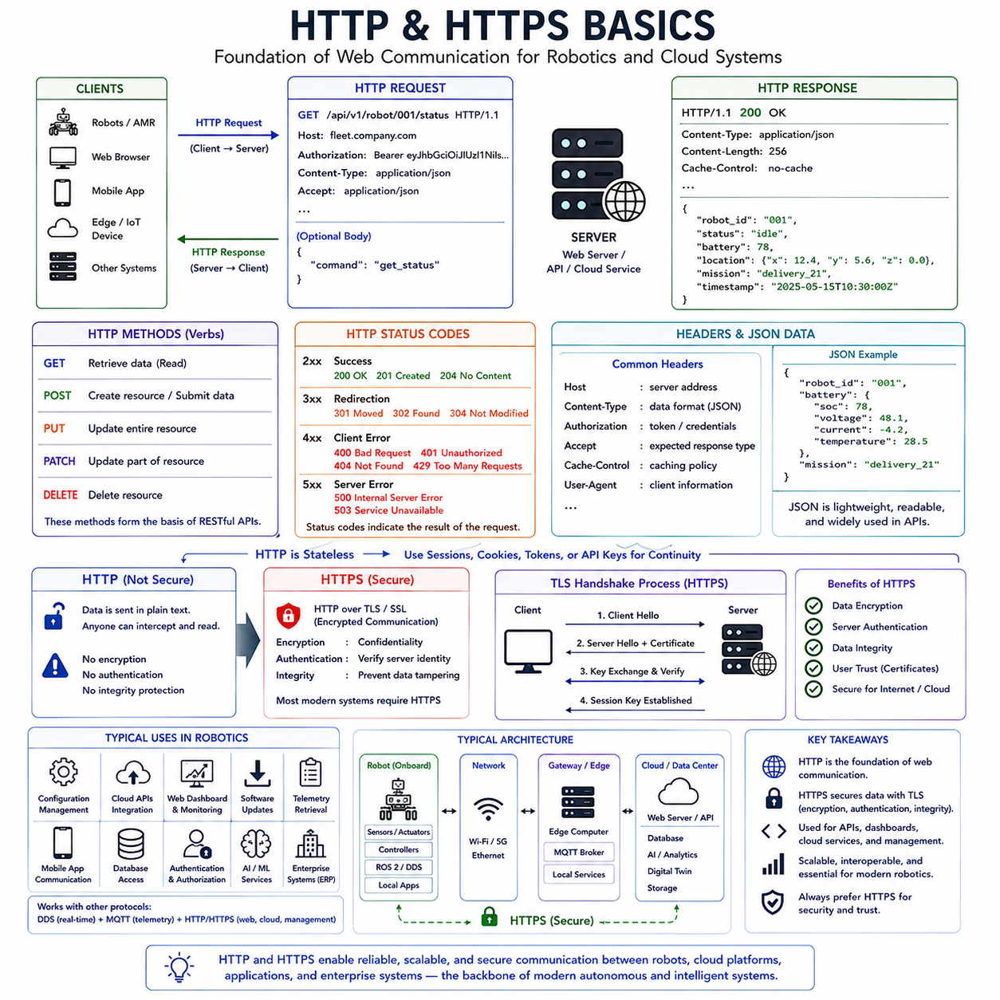
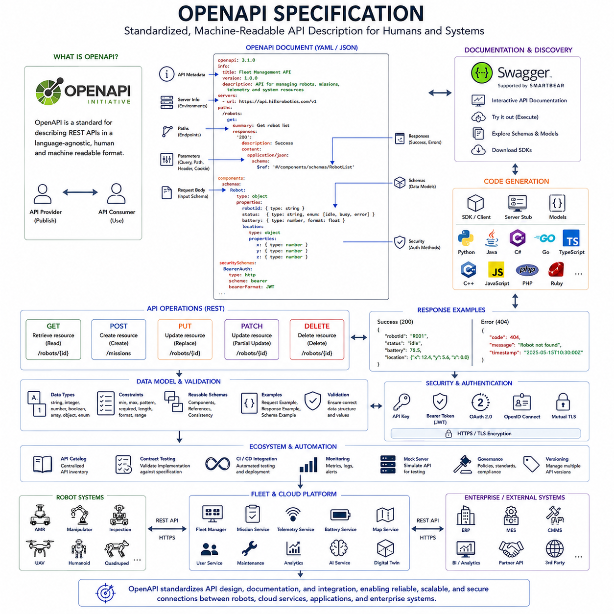
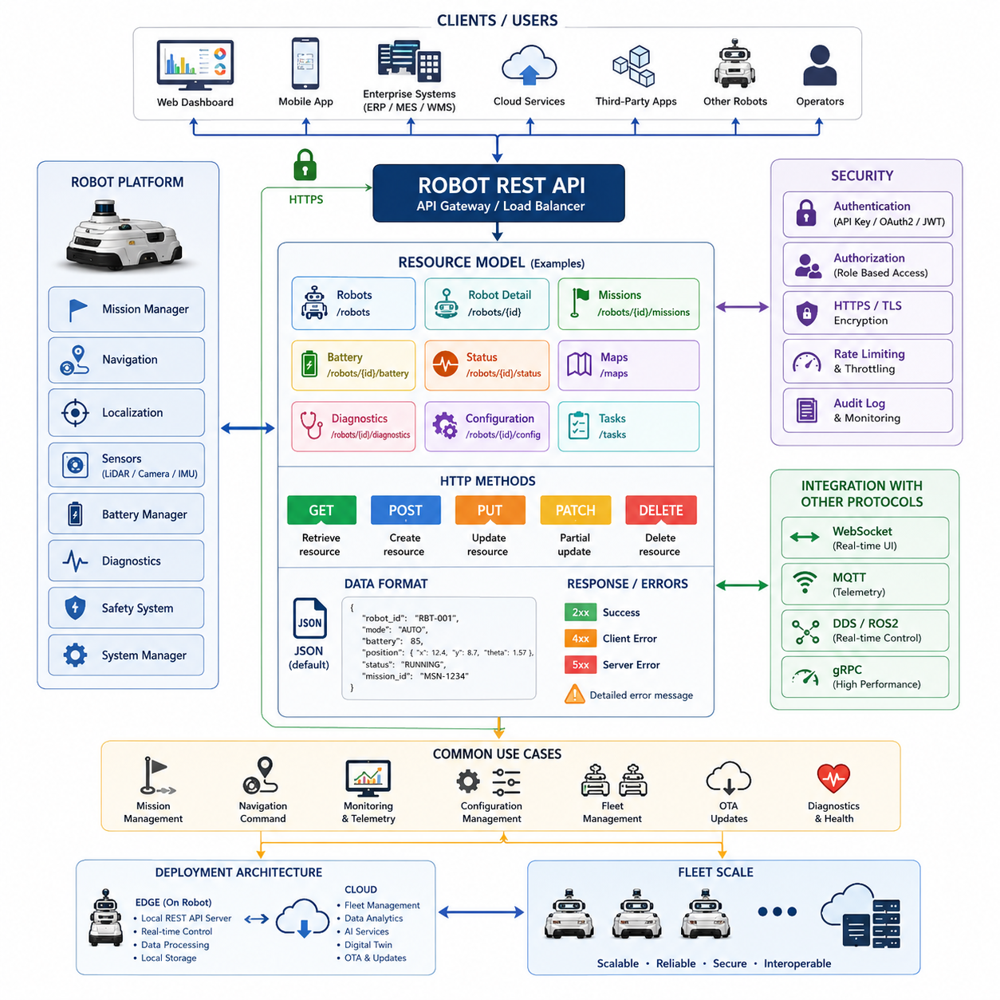
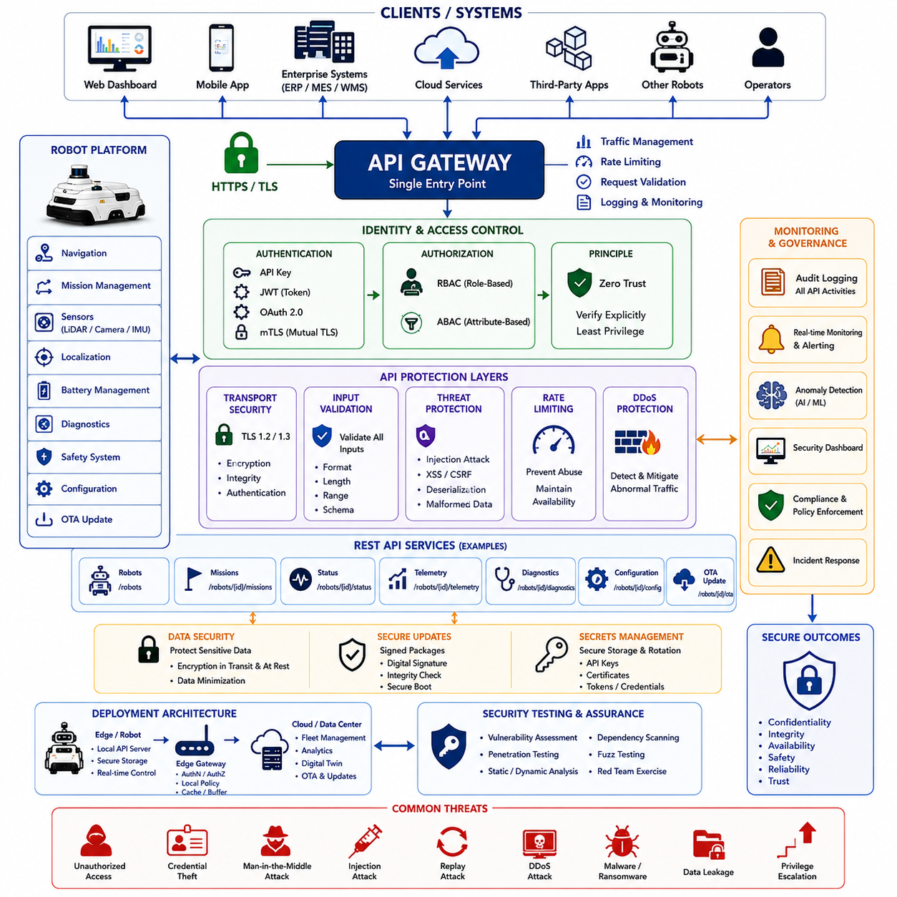
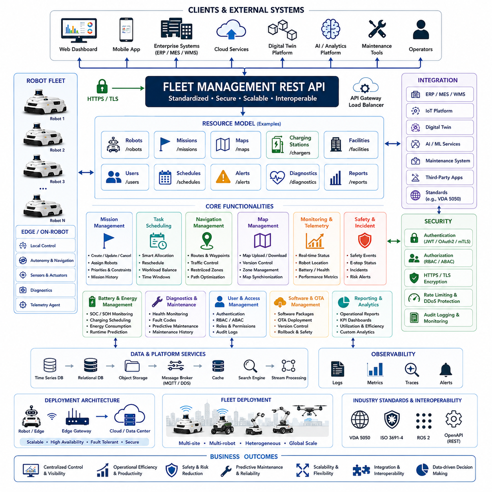

**Volume 09 Robotics Communication**

# Chapter 4. REST API

## 4.1 HTTP HTTPS Basics

{width="7.268055555555556in" height="7.268055555555556in"}

HTTP (HyperText Transfer Protocol) and HTTPS (HyperText Transfer Protocol Secure) are among the most fundamental communication technologies used throughout modern computer networks, cloud infrastructures, industrial automation systems, robotics platforms, web applications, Internet of Things ecosystems, enterprise software systems, and AI-enabled services. Nearly every connected digital system relies on HTTP or HTTPS in some form, making these protocols essential knowledge for robotics engineers, software developers, system architects, cloud engineers, and Physical AI platform designers.

Within modern robotics, HTTP and HTTPS serve as the primary communication mechanisms between robots, fleet management platforms, cloud services, web dashboards, enterprise systems, digital twins, AI services, maintenance platforms, mobile applications, and external APIs. Although real-time robot control often utilizes specialized communication protocols such as DDS, CAN, EtherCAT, or MQTT, HTTP and HTTPS remain the dominant technologies for configuration management, system administration, cloud integration, software updates, telemetry retrieval, REST APIs, web interfaces, and enterprise connectivity.

The origins of HTTP can be traced to the early development of the World Wide Web. Created by Tim Berners-Lee in the late 1980s and early 1990s, HTTP was designed as a simple protocol for transferring hypertext documents between web browsers and web servers. Over time, HTTP evolved far beyond web page delivery and became a universal communication protocol used across virtually every domain of modern computing.

At its core, HTTP follows a client-server communication model. A client initiates a request and a server generates a response. The client may be a web browser, robot controller, mobile application, cloud service, edge computer, monitoring dashboard, AI platform, or enterprise software system. The server may be a web application, cloud API, fleet manager, robot management platform, database gateway, digital twin server, or industrial software platform.

The communication process begins when a client sends an HTTP request to a server. The request contains several components, including a request method, a target resource location, headers, and optionally a request body. The server processes the request and returns an HTTP response containing status information, headers, and optionally response data.

This simple request-response model has proven remarkably effective because it separates clients from servers and provides a standardized mechanism for information exchange across heterogeneous systems.

One of the most important concepts within HTTP is the Uniform Resource Locator, commonly known as a URL. A URL identifies the location of a resource that can be accessed through HTTP communication. For example, a fleet management server may expose telemetry information through URLs such as:

[https://fleet.company.com/robots](https://fleet.company.com/robots)

[https://fleet.company.com/robot/001/status](https://fleet.company.com/robot/001/status)

[https://fleet.company.com/api/v1/telemetry](https://fleet.company.com/api/v1/telemetry)

[https://fleet.company.com/api/v1/mission](https://fleet.company.com/api/v1/mission)

These URLs provide structured access to information and services available within a distributed system.

HTTP communication relies heavily on request methods, sometimes referred to as verbs. These methods indicate the operation that the client wishes to perform on a resource.

The GET method is used to retrieve information. When a fleet dashboard requests robot status information, it typically sends a GET request to the server. GET operations are intended to be read-only and should not modify server-side data.

The POST method is used to create new resources or submit information for processing. A robot may use POST requests to upload diagnostic information, submit mission completion reports, or transmit maintenance records.

The PUT method is commonly used to update existing resources. A fleet management system may use PUT requests to modify robot configurations, update mission parameters, or change operational settings.

The DELETE method removes resources from the system. Administrative interfaces may use DELETE operations to remove obsolete records, retired robots, or completed maintenance logs.

PATCH provides partial updates and is frequently used when only specific fields require modification without replacing an entire resource.

These methods form the foundation of RESTful communication architectures, which dominate modern web services and cloud APIs.

Every HTTP response includes a status code indicating the outcome of the request. Status codes provide a standardized mechanism for communicating success, failure, authorization issues, missing resources, and server-side errors.

Responses beginning with 200 generally indicate successful operations. The widely recognized "200 OK" status confirms that a request completed successfully.

Status codes beginning with 300 represent redirection scenarios where clients must take additional action to obtain the desired resource.

Status codes beginning with 400 indicate client-side errors. For example, "400 Bad Request" suggests malformed requests, while "404 Not Found" indicates that the requested resource does not exist.

Status codes beginning with 500 represent server-side errors. "500 Internal Server Error" indicates that a problem occurred while processing the request on the server.

Understanding status codes is essential for debugging, monitoring, and maintaining distributed robotic systems.

HTTP headers play a crucial role in communication. Headers contain metadata describing requests and responses. They may specify content types, authentication credentials, caching directives, compression settings, client information, and communication preferences.

For example, a robot uploading telemetry data may include a Content-Type header specifying that the payload is formatted as JSON. Authentication headers may contain access tokens authorizing communication with cloud services.

JSON (JavaScript Object Notation) has become the dominant data format used with HTTP communication. JSON provides a lightweight, human-readable, and machine-readable representation of structured data.

A robot status response may contain information such as battery percentage, current location, mission state, and operational status encoded as JSON. Because JSON is widely supported across programming languages and platforms, it has become the standard data exchange format for REST APIs.

One of HTTP\'s defining characteristics is that it is stateless. Each request is treated independently, and servers are not required to remember information from previous interactions.

This stateless design greatly simplifies scalability because requests can be processed by any available server instance without requiring persistent client context. However, many applications require continuity across interactions. To address this need, mechanisms such as sessions, cookies, authentication tokens, and API keys have been developed.

As internet usage expanded, security concerns became increasingly important. Standard HTTP transmits information in plain text. Anyone capable of intercepting network traffic may potentially observe transmitted data.

This limitation led to the development of HTTPS, which combines HTTP with Transport Layer Security (TLS). HTTPS provides encryption, authentication, and integrity protection for communications.

HTTPS protects data by encrypting all information exchanged between clients and servers. Even if network traffic is intercepted, the contents remain unreadable without appropriate cryptographic keys.

Authentication represents another critical benefit of HTTPS. Digital certificates allow clients to verify the identity of servers before transmitting sensitive information. This process helps prevent impersonation attacks and ensures that communication occurs with legitimate systems.

Integrity protection ensures that transmitted information cannot be modified undetectably while traveling across the network. If data is altered during transmission, cryptographic verification mechanisms detect the tampering.

TLS operates through a process known as the TLS handshake. During connection establishment, the client and server negotiate cryptographic algorithms, exchange certificates, verify identities, and establish shared encryption keys. Once the handshake completes successfully, encrypted communication begins.

Although TLS introduces some computational overhead, modern hardware acceleration and optimized implementations make the performance impact relatively small compared to the security benefits provided.

HTTPS has become mandatory for virtually all modern internet-facing systems. Cloud platforms, enterprise applications, fleet management systems, industrial IoT deployments, AI services, and robotic infrastructures generally require HTTPS for all external communication.

REST APIs represent one of the most common applications of HTTP and HTTPS within robotics. REST, which stands for Representational State Transfer, defines architectural principles for building web services that communicate through HTTP.

Fleet management platforms frequently expose REST APIs that allow robots, mobile applications, and external systems to interact with operational services. Examples include retrieving robot status, assigning missions, updating configurations, downloading maps, accessing maintenance records, and querying analytics information.

Robotic systems increasingly rely on cloud connectivity. HTTP and HTTPS provide the primary communication mechanisms for integrating robots with cloud infrastructure. Cloud-based AI services, telemetry storage systems, digital twin platforms, software update servers, monitoring dashboards, and enterprise applications commonly expose HTTPS APIs.

A typical AMR deployment may utilize DDS internally for real-time communication between sensors, controllers, localization systems, and navigation software. MQTT may handle telemetry streaming and fleet monitoring. HTTP and HTTPS then provide access to management interfaces, cloud APIs, software deployment systems, reporting services, and enterprise integration platforms.

Web-based dashboards represent another major use case. Modern fleet management systems often provide browser-accessible interfaces that display robot locations, battery status, mission progress, diagnostics, maintenance information, and operational analytics. These interfaces rely heavily on HTTP and HTTPS communication.

Software updates are also frequently delivered through HTTPS. Robots may periodically connect to update servers, download firmware packages, retrieve software patches, verify digital signatures, and install approved releases. HTTPS ensures that update packages are authentic and have not been tampered with during transmission.

Authentication mechanisms commonly used with HTTP and HTTPS include API keys, bearer tokens, JSON Web Tokens (JWT), OAuth systems, client certificates, and enterprise identity platforms. These mechanisms ensure that only authorized users and systems can access protected resources.

Performance optimization remains important when using HTTP within robotics. Techniques such as compression, caching, connection reuse, content delivery networks, and efficient API design help reduce latency and bandwidth consumption.

Modern versions of the protocol continue to evolve. HTTP/1.1 introduced persistent connections and numerous performance improvements. HTTP/2 added multiplexing capabilities, header compression, and enhanced efficiency. HTTP/3 further improves performance by utilizing QUIC transport technology and reducing connection establishment latency.

These advancements are particularly valuable for cloud-connected robotic systems where efficient communication directly influences responsiveness and operational scalability.

In industrial robotics, HTTP and HTTPS often coexist with other communication protocols rather than replacing them. Real-time control traffic may utilize EtherCAT, CAN, DDS, or proprietary fieldbus technologies. MQTT may manage telemetry distribution. HTTP and HTTPS provide application-layer connectivity, configuration management, cloud integration, and enterprise interoperability.

For Hills Robotics platforms, including Indoor AMRs, Outdoor AMRs, Inspection Robots, Security Robots, Mobile Manipulators, Fleet Management Systems, CAD2SCAN Platforms, GPR Inspection Vehicles, Quadruped Robots, Humanoid Robots, and future Cargo UAV systems, HTTP and HTTPS form essential components of the overall communication architecture. Fleet dashboards, cloud APIs, AI services, digital twins, maintenance systems, ERP integrations, software deployment platforms, and operational analytics environments all rely heavily on secure HTTPS communication.

As robotic systems continue evolving toward cloud-native architectures and Physical AI ecosystems, HTTP and HTTPS will remain foundational technologies connecting robots with cloud intelligence, enterprise infrastructure, digital twins, AI services, and operational management platforms. Their simplicity, interoperability, scalability, and security make them indispensable communication mechanisms within modern autonomous and intelligent robotic environments.

[https://fleet.company.com/robots](https://fleet.company.com/robots)

[https://fleet.company.com/robot/001/status](https://fleet.company.com/robot/001/status)

[https://fleet.company.com/api/v1/telemetry](https://fleet.company.com/api/v1/telemetry)

[https://fleet.company.com/api/v1/mission](https://fleet.company.com/api/v1/mission)

## 4.2 OpenAPI Specification

{width="7.268055555555556in" height="7.268055555555556in"}

The OpenAPI Specification (OAS) is one of the most important standards in modern software architecture, cloud computing, web services, robotics platforms, industrial automation systems, Internet of Things infrastructures, and AI-enabled applications. OpenAPI provides a standardized, machine-readable, and human-readable method for describing REST APIs, enabling developers, system architects, robots, cloud services, enterprise platforms, and software tools to understand, generate, validate, test, and integrate APIs consistently. As robotic systems become increasingly connected to cloud services, fleet management platforms, digital twins, AI services, enterprise systems, and external partners, the importance of standardized API descriptions continues to grow. OpenAPI serves as a universal language that allows different systems to communicate effectively while reducing ambiguity and integration complexity.

Before OpenAPI became widely adopted, API documentation was often created manually using text documents, PDF manuals, spreadsheets, wiki pages, or custom web pages. While these methods provided human-readable information, they frequently suffered from inconsistencies, outdated descriptions, incomplete documentation, and synchronization problems between implementation and documentation. Developers often encountered situations where documented API behavior differed from actual system behavior, leading to integration difficulties and increased maintenance costs.

OpenAPI was developed to solve these problems by creating a formal specification capable of describing APIs in a structured format. Originally known as the Swagger Specification, the standard evolved into the OpenAPI Specification under the governance of the OpenAPI Initiative. Today, OpenAPI is supported by a broad ecosystem of software vendors, cloud providers, development frameworks, and enterprise platforms.

At its core, OpenAPI provides a complete description of an API. Rather than requiring developers to infer behavior from source code or informal documentation, OpenAPI explicitly defines available endpoints, request methods, parameters, request bodies, response formats, authentication mechanisms, error conditions, and data models.

An OpenAPI document acts as a contract between API providers and API consumers. The provider guarantees that the API behaves according to the specification, while consumers can develop integrations confidently based on the documented contract. This contract-first approach significantly improves interoperability and reduces communication errors between teams.

OpenAPI documents are typically written using YAML or JSON. YAML is often preferred because of its readability and concise syntax. Regardless of format, the information represented remains the same.

An OpenAPI specification generally begins with metadata describing the API. This includes the API title, version number, description, contact information, licensing details, and other high-level information that helps developers understand the purpose and ownership of the service.

The specification then defines servers that provide access to the API. Multiple server environments may be described, including development environments, testing environments, staging environments, and production environments. This flexibility allows consumers to understand how to access different deployment targets.

The heart of an OpenAPI document consists of path definitions. Paths describe available API endpoints and the operations that can be performed on them. Each path may support one or more HTTP methods such as GET, POST, PUT, PATCH, or DELETE.

For example, a fleet management API might expose endpoints for retrieving robot status, creating missions, updating configurations, accessing telemetry data, downloading maps, managing users, retrieving diagnostics, and monitoring system health. Each endpoint is described precisely within the OpenAPI document.

Every operation may define parameters that influence request behavior. Parameters may appear in URL paths, query strings, request headers, cookies, or request bodies. OpenAPI allows these parameters to be documented with detailed descriptions, data types, validation constraints, default values, allowed ranges, and examples.

This capability is particularly valuable in robotic systems where APIs often require numerous operational parameters. Mission creation APIs may require destination coordinates, priority levels, robot identifiers, safety settings, and operational constraints. OpenAPI provides a structured mechanism for documenting all such requirements.

Request bodies represent another important component of OpenAPI specifications. Many API operations require structured data as input. OpenAPI allows detailed descriptions of request payloads, including required fields, optional fields, nested objects, arrays, validation rules, and data formats.

For example, an AMR mission request might include robot identifiers, pickup locations, destination coordinates, mission priorities, expected completion times, and safety requirements. OpenAPI enables all of these fields to be documented formally.

Response definitions are equally important. Every API operation may generate one or more possible responses. OpenAPI allows developers to document successful responses, error responses, authorization failures, validation errors, resource conflicts, and system exceptions.

HTTP status codes are typically associated with response definitions. A successful operation may return a 200 status code with a structured JSON payload. A missing resource may return a 404 error. Authorization failures may generate 401 or 403 responses. Internal processing problems may result in 500-series errors.

OpenAPI enables all these possibilities to be documented consistently, improving both developer understanding and automated testing capabilities.

One of the most powerful aspects of OpenAPI is schema definition. Schemas describe the structure of data exchanged through APIs. Rather than repeating field definitions throughout the specification, reusable schemas can be defined centrally and referenced throughout the document.

For example, a robot status schema may define fields such as robot ID, battery percentage, current location, operational status, mission state, software version, and health indicators. Multiple API endpoints can then reference the same schema, ensuring consistency across the entire API.

Schema definitions support a wide range of data types including strings, integers, floating-point values, booleans, arrays, objects, enumerations, and complex nested structures. Validation rules can specify minimum values, maximum values, string lengths, regular expression patterns, required fields, and other constraints.

These validation capabilities improve API reliability by ensuring that data conforms to expected formats before processing occurs.

Authentication and security are major concerns in modern API architectures. OpenAPI provides extensive support for documenting authentication mechanisms. Common approaches include API keys, bearer tokens, OAuth 2.0, OpenID Connect, JWT authentication, mutual TLS authentication, and enterprise identity systems.

By formally describing authentication requirements, OpenAPI enables client developers to understand security expectations and implement integrations correctly.

The OpenAPI ecosystem includes numerous tools that leverage specification documents. One of the most widely recognized tools is Swagger UI. Swagger UI automatically generates interactive documentation directly from OpenAPI specifications. Developers can browse endpoints, inspect schemas, explore parameters, and execute test requests through a web interface.

This capability significantly improves developer productivity because documentation remains synchronized with the underlying API specification.

Code generation represents another transformative capability. OpenAPI specifications can be used to generate client libraries, server stubs, SDKs, validation code, documentation portals, test frameworks, and monitoring configurations automatically.

For example, a fleet management API described through OpenAPI can generate client libraries for Python, C++, Java, JavaScript, TypeScript, Go, C#, Rust, and many other programming languages. Developers can begin using the API immediately without manually implementing communication logic.

This automation dramatically reduces development effort and minimizes integration errors.

Testing and quality assurance also benefit from OpenAPI adoption. Automated testing frameworks can validate API behavior against specification requirements. Contract testing ensures that implementations conform to documented expectations. Regression testing becomes easier because expected behaviors are formally defined.

Continuous Integration and Continuous Deployment pipelines frequently incorporate OpenAPI validation as part of automated quality control processes.

Microservice architectures rely heavily on OpenAPI specifications. Modern cloud platforms often consist of dozens or hundreds of interconnected services. Maintaining consistent documentation and interface definitions becomes increasingly difficult as system complexity grows.

OpenAPI provides a common language for describing service interfaces across the entire architecture. Service discovery, integration, monitoring, testing, and governance all benefit from standardized API definitions.

Robotic systems increasingly adopt microservice-based architectures. Fleet management services, mission planning engines, telemetry processing systems, digital twin platforms, AI inference services, maintenance management systems, user management platforms, and analytics engines frequently communicate through REST APIs documented using OpenAPI.

Cloud-native robotics environments particularly benefit from OpenAPI. Major cloud providers support OpenAPI integration across API gateways, serverless functions, container orchestration platforms, monitoring systems, and developer portals.

As robotic fleets scale globally, standardized API contracts become essential for maintaining interoperability among geographically distributed systems.

Digital twin platforms also rely heavily on OpenAPI-defined interfaces. Digital twins continuously exchange information with physical robots, simulation environments, analytics platforms, maintenance systems, and operational dashboards. OpenAPI ensures consistent communication interfaces across these components.

Artificial Intelligence systems further increase the importance of standardized APIs. AI services often expose inference endpoints, model management interfaces, training operations, dataset management functions, and monitoring capabilities through REST APIs. OpenAPI provides a structured mechanism for describing these services and integrating them into broader robotic ecosystems.

In modern Physical AI environments, robots increasingly interact with large language models, vision-language-action systems, cloud reasoning engines, multimodal perception platforms, and distributed intelligence services. OpenAPI facilitates these interactions by providing clear, machine-readable service descriptions.

For Hills Robotics platforms, including Indoor AMRs, Outdoor AMRs, Inspection Robots, Security Robots, Fleet Management Systems, Mobile Manipulators, CAD2SCAN Platforms, GPR Inspection Vehicles, Quadruped Robots, Humanoid Robots, and future Cargo UAV systems, OpenAPI can serve as the standard interface description mechanism across all cloud-connected services.

A Hills Robotics fleet platform may expose APIs for robot registration, mission assignment, telemetry retrieval, battery monitoring, maintenance scheduling, digital twin synchronization, AI analytics access, software deployment, map management, and operational reporting. Documenting these interfaces through OpenAPI ensures that customers, partners, integrators, and internal development teams share a common understanding of system behavior.

As organizations grow and systems become more complex, OpenAPI provides substantial governance benefits. API catalogs, version management, change control processes, compliance reviews, security audits, and integration standards all become easier to manage when APIs are formally specified.

Versioning is particularly important in long-lived robotic systems. OpenAPI enables clear documentation of API evolution while preserving compatibility across software generations. Multiple API versions can coexist, allowing gradual migration without disrupting operational systems.

The future importance of OpenAPI is likely to increase as AI-native systems, cloud robotics platforms, digital twins, and Physical AI ecosystems continue expanding. Machine-readable service descriptions will become increasingly valuable as autonomous systems begin discovering, understanding, and interacting with APIs automatically.

Ultimately, the OpenAPI Specification represents far more than a documentation format. It is a comprehensive framework for API design, communication, integration, validation, automation, governance, and interoperability. By providing a formal contract between service providers and consumers, OpenAPI enables scalable, maintainable, secure, and reliable software ecosystems. In robotics, cloud computing, AI platforms, and future Physical AI environments, OpenAPI serves as a foundational technology that simplifies integration while accelerating innovation across increasingly complex distributed systems.

# 04_02 OpenAPI Specification

\`/robots\`

\`/robots/{robotId}\`

\`/missions\`

\`/telemetry\`

\`/battery\`

\`/diagnostics\`

Robot ID

Battery Percentage

Current Location

Mission Status

Software Version

Health Status

Operational Mode

API Key

Bearer Token

OAuth 2.0

OpenID Connect

JWT(JSON Web Token)

Mutual TLS

Client Certificate

Python

C++

Java

JavaScript

TypeScript

Go

C#

Rust

Fleet Management Service

Mission Planning Service

Telemetry Service

Digital Twin Service

AI Inference Service

Maintenance Service

User Management Service

Analytics Service

## 4.3 Robot REST Interface Design

{width="7.268055555555556in" height="7.268055555555556in"}

Robot REST Interface Design is a critical discipline within modern robotics communication architecture because it provides a standardized mechanism for software systems, cloud platforms, fleet managers, enterprise applications, mobile devices, and human-machine interfaces to interact with robotic systems through widely adopted web technologies. In contemporary robotic environments, robots are no longer isolated machines operating independently. They function as intelligent cyber-physical systems connected to local networks, cloud infrastructures, enterprise resource planning systems, manufacturing execution systems, warehouse management systems, digital twins, and AI-driven decision engines. REST-based interfaces have therefore become one of the most important integration mechanisms for robotic platforms because they enable interoperability across heterogeneous software ecosystems while minimizing implementation complexity.

A REST interface, commonly referred to as a RESTful API, is based on the architectural principles of Representational State Transfer. Rather than exposing proprietary communication protocols, robotic functions are represented as web resources that can be accessed using standard HTTP methods. This approach allows robotic capabilities to be integrated with virtually any software environment capable of making HTTP requests. Whether the client is a web browser, mobile application, cloud service, industrial control system, or another robot, the communication model remains consistent and understandable.

The adoption of REST interfaces within robotics has accelerated due to the widespread use of cloud-native architectures, microservices, containerized deployments, and edge computing platforms. Modern autonomous mobile robots, outdoor autonomous vehicles, warehouse robots, inspection robots, mobile manipulators, quadruped robots, humanoid systems, and physical AI platforms frequently expose REST endpoints for configuration, diagnostics, mission management, monitoring, and integration with external systems. REST interfaces serve as a bridge between robotic real-time subsystems and enterprise-level applications that operate using transactional and request-response communication paradigms.

A well-designed robot REST interface begins with a clear understanding of resource-oriented architecture. Instead of designing APIs around functions, REST encourages developers to model robotic entities as resources. A robot itself becomes a resource. Missions become resources. Navigation goals become resources. Sensors, batteries, maps, diagnostics, software versions, task queues, and fleet configurations all become identifiable resources accessible through uniform URLs. This design philosophy simplifies API consistency and improves long-term maintainability.

For example, a fleet management platform may expose a robot resource through a URI such as "/robots". Individual robots can be represented as "/robots/{robot_id}". Mission queues can be represented as "/robots/{robot_id}/missions". Battery information can be represented as "/robots/{robot_id}/battery". Through this structure, clients can easily discover and manipulate system resources without understanding the internal implementation details of the robotic software stack.

HTTP methods play a central role in robot REST interface design. The GET method is typically used for retrieving robot information. Examples include obtaining battery status, localization results, system health, active missions, map information, sensor status, and diagnostic records. The POST method is commonly used for creating new resources such as navigation tasks, inspection missions, docking requests, or software deployment jobs. PUT operations are used for updating existing resources while PATCH operations are often used for partial updates of robot parameters. DELETE methods can remove scheduled tasks, obsolete configurations, or inactive resources.

One of the key design objectives in robotic REST APIs is maintaining stateless communication. Each request contains all information necessary for processing. The server does not rely on previous requests to determine the context of the current operation. This stateless nature improves scalability because multiple API servers can process requests independently. In large-scale fleet deployments involving hundreds or thousands of robots, stateless architectures significantly simplify load balancing and cloud scalability.

Resource naming conventions greatly influence API usability. Consistent naming practices reduce ambiguity and simplify integration. Resource names should generally use plural nouns and hierarchical structures. Verb-oriented URIs should be minimized because HTTP methods already define the operation semantics. Instead of defining endpoints such as "/startMission", a more RESTful design would expose "/missions" and create a new mission using a POST request. This separation between resource representation and operation semantics improves API consistency and aligns with industry standards.

Data representation is another essential consideration in robot REST interface design. JSON has become the dominant data exchange format due to its simplicity, readability, and native support across programming languages. Robot status messages, localization information, telemetry data, mission definitions, and diagnostic reports are typically serialized into JSON structures. Well-designed schemas ensure predictable client behavior and simplify API evolution.

A robot status response may contain information such as robot identifier, operational mode, battery percentage, localization coordinates, velocity, safety status, network connectivity, software version, and active mission information. Such responses should be structured consistently across the entire robotic ecosystem. Consistency allows monitoring dashboards, cloud services, mobile applications, and third-party integrations to process information reliably.

Error handling represents a major aspect of robust REST interface design. Robotic systems operate in dynamic environments where communication failures, hardware malfunctions, sensor degradation, localization loss, network interruptions, and mission conflicts are common occurrences. REST APIs must therefore provide meaningful error responses using standard HTTP status codes. A successful request should return codes within the 200 range. Client-side errors should use codes within the 400 range. Server-side failures should use codes within the 500 range.

Beyond simple status codes, detailed error messages should provide actionable information. If a navigation task fails because localization confidence is below threshold, the response should indicate the precise reason. If a docking operation cannot proceed because a charging station is occupied, the API should communicate that condition explicitly. Detailed diagnostics improve troubleshooting efficiency and reduce operational downtime.

Robot mission management is one of the most common use cases for REST interfaces. Fleet management systems frequently create, monitor, modify, and terminate missions through REST APIs. Mission resources typically include mission identifiers, assigned robots, target locations, execution priorities, task dependencies, expected completion times, and status information. Through standardized interfaces, enterprise software can automatically schedule robotic activities without requiring direct access to low-level robotic controllers.

Navigation services also benefit from REST-based architectures. A navigation API may allow clients to submit destination coordinates, predefined waypoints, or semantic locations such as storage areas, inspection points, loading docks, or charging stations. The API abstracts the underlying localization, mapping, path planning, and obstacle avoidance algorithms. External systems interact with simple high-level commands while the robot autonomously manages the execution details.

Monitoring and telemetry systems represent another important application domain. Operational dashboards often retrieve robot information through periodic REST queries. These dashboards visualize battery levels, localization accuracy, CPU utilization, network connectivity, mission progress, safety events, and hardware health indicators. Because REST interfaces are platform-independent, monitoring solutions can be developed using standard web technologies without requiring specialized robotics middleware knowledge.

REST interfaces are particularly effective for integration with enterprise systems. Warehouse Management Systems, Manufacturing Execution Systems, Enterprise Resource Planning platforms, Facility Management Systems, and Industrial IoT platforms frequently communicate through web services. By exposing robotic functionality through REST APIs, robots become first-class participants within broader digital transformation initiatives. This interoperability is essential for Industry 4.0, Smart Factory, Smart Logistics, and Physical AI deployments.

Security considerations are fundamental in robot REST interface design. Robotic systems often control expensive assets, manipulate physical objects, and operate in environments containing human workers. Unauthorized access could therefore create significant operational and safety risks. Authentication mechanisms such as API keys, OAuth 2.0, JSON Web Tokens, and mutual TLS authentication are commonly employed to verify client identities. Authorization frameworks further restrict access according to user roles and permissions.

Encryption is equally important. HTTPS should be mandatory for all production deployments. Transport Layer Security protects credentials, mission commands, telemetry streams, and configuration data from interception or tampering. Secure certificate management practices are necessary to maintain trust throughout the robotic ecosystem.

Rate limiting is another valuable security mechanism. Excessive API requests can overload robotic services and potentially affect mission-critical operations. By enforcing request quotas, the system protects itself from accidental misuse and malicious denial-of-service attacks. Large fleet deployments often incorporate API gateways that provide centralized authentication, authorization, logging, monitoring, and traffic management functions.

Versioning is essential for long-term maintainability. Robotic platforms evolve continuously as new sensors, algorithms, AI models, and operational capabilities are introduced. API versioning ensures backward compatibility while allowing innovation. Common approaches include URI-based versioning such as "/api/v1/robots" and header-based versioning strategies. Clear deprecation policies help external integrators adapt to evolving system capabilities without service disruptions.

Robot REST interfaces frequently coexist with other communication technologies. REST is highly effective for configuration, orchestration, and transactional operations but may not be optimal for high-frequency real-time data exchange. Consequently, many robotic systems combine REST APIs with WebSocket connections, MQTT messaging, DDS middleware, ROS2 communication, and gRPC services. REST handles management and control functions while other protocols address streaming, telemetry, and real-time requirements. This hybrid architecture enables each communication technology to operate within its optimal performance domain.

In cloud-connected robotic environments, REST APIs often serve as the foundation of edge-to-cloud integration. Edge robots expose local APIs while cloud platforms aggregate information across entire fleets. Software updates, mission assignments, health monitoring, predictive maintenance analytics, AI model deployment, and digital twin synchronization frequently rely on REST-based communication channels. This architecture supports scalability from individual robots to global fleet deployments involving thousands of autonomous systems.

The emergence of Physical AI further increases the importance of REST interfaces. Future robotic systems will continuously interact with large language models, vision-language-action systems, fleet intelligence services, simulation environments, and cloud-based reasoning engines. Standardized REST interfaces provide a universal integration layer that enables heterogeneous AI components to exchange information efficiently. Whether the system consists of autonomous mobile robots, humanoid robots, industrial manipulators, quadruped platforms, or cargo UAVs, REST APIs provide a consistent mechanism for exposing capabilities and coordinating behavior across distributed intelligent systems.

Ultimately, Robot REST Interface Design is not merely an implementation detail but a foundational architectural discipline. It determines how robots communicate with software ecosystems, enterprise applications, cloud infrastructures, and human operators. A well-designed REST architecture improves interoperability, scalability, security, maintainability, and operational efficiency. As robotics continues to converge with cloud computing, artificial intelligence, industrial automation, and physical AI systems, REST-based interfaces will remain one of the most important technologies enabling seamless integration between intelligent machines and the digital world.

# 04_03 Robot REST Interface Design

## 4.4 REST API Security

{width="7.268055555555556in" height="7.268055555555556in"}

REST API Security is one of the most critical disciplines in modern robotics communication architecture because APIs have become the primary gateway through which robots interact with fleet management systems, cloud platforms, enterprise applications, mobile devices, digital twins, artificial intelligence services, and human operators. As robots evolve from isolated electromechanical systems into connected cyber-physical platforms, the attack surface of robotic systems expands significantly. Every exposed API endpoint represents a potential entry point into the robotic ecosystem. Therefore, REST API security is not merely an information technology concern but a fundamental safety, reliability, operational continuity, and risk management requirement.

In traditional industrial automation environments, robots often operated within isolated networks protected by physical segmentation. Modern autonomous mobile robots, outdoor autonomous vehicles, mobile manipulators, warehouse automation systems, service robots, quadruped robots, humanoid robots, and Physical AI systems increasingly operate in highly connected environments where communication occurs across enterprise networks, cloud infrastructures, edge computing platforms, and public internet connections. This connectivity provides tremendous operational benefits but simultaneously introduces cybersecurity risks that must be systematically addressed.

A robot REST API serves as the control and information exchange layer between robotic subsystems and external entities. Through REST interfaces, clients may retrieve robot status, submit navigation commands, schedule missions, modify configurations, access telemetry, initiate software updates, and perform diagnostics. Because these capabilities directly influence robot behavior, unauthorized access can potentially result in operational disruption, financial loss, privacy violations, safety incidents, or even physical harm. Consequently, security must be integrated into the API architecture from the earliest stages of system design rather than added as an afterthought.

The foundation of REST API security begins with the principle of Zero Trust Architecture. In traditional security models, systems inside a network perimeter were often trusted by default. Modern robotic systems cannot rely on such assumptions because devices, users, services, and applications frequently operate across multiple networks and cloud environments. Zero Trust assumes that no user, device, service, or communication channel is inherently trustworthy. Every request must be authenticated, authorized, validated, and monitored regardless of its origin.

Authentication represents the first line of defense in robot REST API security. Authentication determines the identity of the entity attempting to access robotic resources. Without strong authentication mechanisms, attackers may impersonate legitimate users and gain unauthorized access to critical functions. Several authentication approaches are commonly employed in robotic systems depending on operational requirements and deployment architectures.

API keys provide one of the simplest authentication mechanisms. A client presents a unique secret key when making requests to the API. The server validates the key before processing the request. API keys are easy to implement and suitable for machine-to-machine communication in controlled environments. However, they provide limited security if improperly managed because stolen keys can often be reused indefinitely.

Token-based authentication has become the dominant approach for modern REST APIs. JSON Web Tokens, commonly referred to as JWTs, enable secure identity verification through digitally signed tokens. After successful authentication, the client receives a token that contains identity information and authorization claims. Subsequent requests include the token in the HTTP Authorization header. The server validates the token signature and expiration time before granting access. JWT-based authentication reduces server-side session management complexity while supporting highly scalable distributed architectures.

OAuth 2.0 is widely adopted for enterprise and cloud-integrated robotic systems. OAuth separates authentication from authorization and enables secure delegated access. A fleet management application may obtain limited access rights to robotic resources without exposing user credentials directly. This model is particularly valuable in large organizations where multiple software systems require controlled access to robotic platforms.

Mutual Transport Layer Security, often referred to as Mutual TLS or mTLS, provides one of the strongest authentication mechanisms available. In standard TLS deployments, the client verifies the server identity through certificates. In mutual TLS environments, both client and server authenticate each other using digital certificates. This bidirectional verification significantly reduces the risk of impersonation attacks and is increasingly used in industrial robotics, autonomous vehicle platforms, and critical infrastructure applications.

While authentication determines identity, authorization determines permissions. Authorization mechanisms ensure that authenticated entities can only perform actions appropriate to their assigned roles. A warehouse operator may be permitted to monitor robot status but not modify safety parameters. A maintenance engineer may access diagnostics but not alter fleet-wide mission schedules. A system administrator may possess broader privileges including software deployment and configuration management.

Role-Based Access Control, commonly known as RBAC, is widely used within robotic ecosystems. Users are assigned roles such as Operator, Supervisor, Maintenance Engineer, Administrator, or Auditor. Each role is associated with specific permissions governing access to API resources. RBAC simplifies security administration while ensuring consistent policy enforcement across large robotic fleets.

Attribute-Based Access Control, or ABAC, provides a more flexible authorization model. Instead of relying solely on predefined roles, access decisions consider attributes associated with users, devices, locations, operational contexts, and environmental conditions. For example, a maintenance operation may only be permitted during scheduled service windows or from approved facility locations. ABAC enables highly granular policy enforcement suitable for complex industrial environments.

Transport security is another fundamental component of REST API protection. Data transmitted across networks is vulnerable to interception, modification, replay, and eavesdropping attacks if not properly encrypted. All production-grade robot REST APIs should operate exclusively over HTTPS using modern Transport Layer Security protocols. TLS provides confidentiality, integrity, and authenticity for data exchanged between clients and servers.

Encryption protects sensitive information such as authentication credentials, mission commands, operational telemetry, diagnostic reports, software update packages, and configuration parameters. Without encryption, attackers monitoring network traffic could potentially observe robot commands, manipulate navigation instructions, or capture confidential operational information.

Certificate management plays a critical role in maintaining transport security. Certificates establish trust relationships between communicating entities. Secure certificate issuance, rotation, revocation, and lifecycle management are necessary to prevent compromised credentials from undermining system security. Automated certificate management solutions are increasingly used in large-scale robotic deployments to reduce operational complexity.

Input validation represents one of the most important defensive measures in REST API design. Every incoming request should be considered potentially untrusted. Attackers frequently exploit poorly validated inputs to trigger unexpected behaviors, access unauthorized data, or compromise backend systems. Input validation ensures that all request parameters conform to expected formats, value ranges, lengths, and data types.

For example, navigation requests should validate coordinate values before processing. Configuration updates should verify parameter boundaries. Mission definitions should enforce schema compliance. Diagnostic queries should reject malformed inputs. Proper validation significantly reduces the likelihood of injection attacks, buffer overflows, logic errors, and service disruptions.

Injection attacks remain among the most common vulnerabilities affecting web-based systems. SQL injection, command injection, script injection, and deserialization attacks can occur when untrusted inputs are incorporated into backend operations without adequate sanitization. Robotic APIs must implement strict input filtering, parameterized queries, and secure coding practices to prevent such attacks from compromising system integrity.

Rate limiting provides another essential security mechanism. Excessive API requests can overwhelm servers, degrade performance, and potentially disrupt mission-critical robotic operations. Rate limiting restricts the number of requests that clients may perform within a specified time interval. Requests exceeding predefined thresholds are rejected or delayed until acceptable usage levels are restored.

In robotic environments, rate limiting not only protects against malicious denial-of-service attacks but also prevents accidental resource exhaustion caused by misconfigured applications. Fleet management systems, mobile applications, cloud analytics platforms, and third-party integrations may generate substantial traffic volumes. Rate limiting ensures fair resource utilization while maintaining service availability.

API gateways frequently serve as centralized security enforcement points within robotic architectures. An API gateway sits between clients and backend services, performing authentication, authorization, traffic management, request validation, logging, and monitoring. By consolidating security functions into a centralized component, organizations can maintain consistent security policies across multiple robotic services.

Modern robotic platforms often incorporate microservice architectures where navigation services, mission management systems, diagnostics modules, telemetry pipelines, and software deployment services operate independently. API gateways simplify access management by providing a unified entry point into the ecosystem while shielding internal services from direct exposure.

Logging and auditability are essential elements of security governance. Every significant API interaction should generate audit records containing information about the requester, operation performed, timestamp, resource accessed, and execution outcome. Audit logs support incident investigation, regulatory compliance, operational troubleshooting, and forensic analysis.

In robotic environments, audit records may prove invaluable following safety incidents, unauthorized access attempts, operational anomalies, or cybersecurity events. Comprehensive logging enables security teams to reconstruct attack timelines, identify affected resources, and implement corrective actions efficiently.

Monitoring and anomaly detection further enhance API security. Traditional security mechanisms focus on preventing unauthorized access, but monitoring systems identify suspicious behaviors that may indicate ongoing attacks. Examples include repeated authentication failures, unusual request volumes, abnormal geographic access patterns, privilege escalation attempts, or unexpected command sequences.

Machine learning techniques are increasingly applied to robotic cybersecurity monitoring. Behavioral models can establish baseline patterns for normal operations and automatically identify deviations that warrant investigation. Such capabilities are particularly valuable in large fleet deployments involving hundreds or thousands of autonomous systems.

Software update security is especially important in robotic environments. Modern robots frequently receive firmware updates, AI model upgrades, security patches, and feature enhancements through REST-based management interfaces. Update mechanisms must ensure authenticity, integrity, and traceability throughout the deployment process.

Digitally signed update packages prevent attackers from distributing malicious software. Secure boot mechanisms verify software integrity during startup. Cryptographic checksums confirm package authenticity prior to installation. Together, these measures establish a trusted software supply chain that protects robotic platforms from compromise.

Secrets management constitutes another critical aspect of REST API security. Credentials, API keys, certificates, encryption keys, and authentication tokens should never be hardcoded into source code repositories or configuration files. Dedicated secrets management platforms provide secure storage, access control, rotation policies, and auditing capabilities.

Cloud-connected robotic systems face additional security challenges because communication extends beyond local operational environments. Cloud APIs must enforce strong authentication, encrypted communications, secure multi-tenancy, and comprehensive access controls. Edge-to-cloud communication channels should be designed under the assumption that public networks are inherently hostile environments.

Fleet-scale deployments introduce further complexity. A single robotic fleet may include hundreds or thousands of autonomous systems distributed across multiple facilities, regions, or countries. Security architectures must therefore support scalable identity management, certificate provisioning, policy distribution, incident response, and compliance verification. Automation becomes essential because manual security administration is impractical at large scales.

Physical AI systems further elevate the importance of API security. Future robots will continuously exchange information with large language models, vision-language-action systems, digital twins, cloud-based reasoning engines, and collaborative robotic ecosystems. These AI-driven interactions increase communication complexity and create new attack vectors. Secure API architectures will therefore become a foundational requirement for trustworthy Physical AI deployments.

Security testing is indispensable throughout the development lifecycle. Vulnerability assessments, penetration testing, static code analysis, dynamic application testing, dependency scanning, fuzz testing, and red-team exercises help identify weaknesses before deployment. Security validation should be integrated into continuous integration and continuous deployment pipelines to ensure that vulnerabilities are detected and remediated rapidly.

Ultimately, REST API Security is far more than a technical implementation detail. It is a comprehensive engineering discipline that protects robotic systems, operational infrastructure, human operators, enterprise assets, and AI-driven decision environments from cyber threats. Effective security architectures combine authentication, authorization, encryption, validation, monitoring, auditing, update protection, and governance mechanisms into a cohesive defense strategy. As robotics continues its evolution toward highly connected autonomous systems and Physical AI platforms, robust REST API security will remain a fundamental requirement for achieving safe, reliable, scalable, and trustworthy robotic operations.

# 04_04 REST API Security

## 4.5 Fleet Management REST API

{width="7.268055555555556in" height="7.268055555555556in"}

Fleet Management REST API is one of the most important communication layers in modern robotics ecosystems because it enables centralized coordination, monitoring, control, optimization, and lifecycle management of multiple robotic systems through standardized web-based interfaces. As robotic deployments scale from individual autonomous machines to fleets consisting of dozens, hundreds, or even thousands of robots, the need for a structured and interoperable management architecture becomes increasingly critical. REST APIs provide a universally understood mechanism that allows fleet management platforms, enterprise applications, cloud services, digital twins, artificial intelligence systems, maintenance tools, and human operators to communicate with robotic fleets in a consistent and scalable manner.

The concept of fleet management originated in transportation and logistics industries where multiple vehicles required centralized supervision and dispatching. As autonomous mobile robots, warehouse robots, outdoor autonomous vehicles, security robots, inspection robots, agricultural robots, mobile manipulators, humanoid systems, and Physical AI platforms became more sophisticated, the same principles were adopted within robotics. A fleet management system acts as the operational brain responsible for coordinating robotic resources, allocating tasks, managing traffic, monitoring health, ensuring safety, and optimizing productivity across an entire robotic ecosystem.

REST APIs serve as the external interface layer of fleet management systems. They expose fleet functionality as standardized resources that can be accessed through HTTP-based communication. This approach allows organizations to integrate robotic fleets with Warehouse Management Systems, Manufacturing Execution Systems, Enterprise Resource Planning platforms, Facility Management Systems, Digital Twin platforms, Industrial IoT systems, and cloud-based analytics environments without requiring knowledge of low-level robotic communication protocols.

A Fleet Management REST API typically follows resource-oriented architectural principles. Every major fleet entity is represented as a resource with a unique identifier and associated attributes. Robots, missions, maps, charging stations, users, facilities, schedules, alerts, diagnostics records, software packages, and operational reports are all represented as manageable resources. This resource-based design creates a predictable and scalable API structure that remains maintainable as fleet complexity grows.

The robot resource is generally considered the fundamental building block of a fleet API. Each robot possesses a unique identifier and associated operational metadata. Typical information includes robot name, model, serial number, software version, battery state, operational status, localization coordinates, assigned mission, network connectivity, safety state, sensor health, and maintenance records. Through REST interfaces, external systems can retrieve robot information, modify configurations, assign tasks, and monitor operational conditions.

Mission management is one of the most heavily utilized capabilities within fleet APIs. Missions represent executable tasks assigned to robots. A mission may involve navigation to a location, transportation of materials, inspection of infrastructure, collection of sensor data, interaction with equipment, inventory scanning, security patrol operations, or collaborative multi-robot activities. REST APIs allow external systems to create, update, prioritize, suspend, resume, or terminate missions using standardized requests.

Mission resources often contain detailed information regarding task definitions, assigned robots, operational priorities, execution constraints, expected completion times, dependencies, status indicators, and execution history. This structured representation enables seamless integration between robotic operations and enterprise workflows. For example, a warehouse management system can automatically generate transport missions whenever inventory movement is required, while a manufacturing execution system can dispatch robots to support production activities based on real-time factory conditions.

Task scheduling is closely related to mission management. Fleet managers must continuously allocate robotic resources to maximize productivity while minimizing operational conflicts. REST APIs provide mechanisms for creating schedules, assigning robots, reserving resources, modifying priorities, and dynamically responding to changing operational conditions. Scheduling systems often consider battery levels, robot locations, workload balancing, maintenance requirements, traffic congestion, and operational deadlines when making allocation decisions.

Navigation management is another critical component of fleet operations. Individual robots may possess local autonomy, but fleet-level navigation requires centralized coordination to prevent congestion and optimize traffic flow. REST APIs provide interfaces for accessing maps, defining routes, managing waypoints, establishing restricted zones, creating virtual traffic controls, and monitoring navigation performance. Fleet operators can use these interfaces to maintain efficient movement across large facilities while minimizing collisions and operational bottlenecks.

Map management plays a particularly important role in multi-robot environments. Modern robotic fleets frequently operate using shared localization maps that must remain synchronized across all units. REST APIs allow administrators to upload maps, retrieve versions, distribute updates, manage geographic zones, and coordinate map transitions. Large facilities may contain multiple operational maps corresponding to different buildings, floors, production areas, warehouses, ports, airports, mining sites, or agricultural regions. Fleet APIs provide centralized control over these geographic assets.

Charging infrastructure management becomes increasingly important as fleet size increases. Individual robots may autonomously locate charging stations, but fleet-level optimization requires coordinated charging schedules. REST APIs expose charging station resources, occupancy status, charging queues, energy consumption metrics, battery health information, and charging reservations. Intelligent fleet managers use this information to prevent charging bottlenecks while maximizing fleet availability.

Battery management data is frequently exposed through fleet APIs because energy availability directly impacts operational efficiency. REST interfaces allow monitoring of battery state-of-charge, state-of-health, charging history, discharge patterns, thermal conditions, and predicted remaining runtime. Predictive analytics systems can leverage this information to optimize mission assignments and maintenance planning.

Fleet monitoring represents one of the most visible applications of REST APIs. Operational dashboards continuously retrieve robot information through standardized API requests. Fleet managers monitor robot locations, mission progress, battery levels, safety events, network connectivity, system performance, diagnostics status, and environmental conditions. REST APIs provide the data foundation upon which modern robotic command-and-control centers are built.

Real-time visibility is essential for large-scale robotic operations. While high-frequency telemetry often utilizes technologies such as WebSocket, MQTT, DDS, or gRPC, REST APIs remain the primary mechanism for retrieving operational snapshots, historical records, reports, and management data. This separation allows each communication technology to operate within its optimal performance domain.

Safety management is a fundamental responsibility of fleet management systems. Robotic fleets often operate in environments containing human workers, industrial equipment, vehicles, infrastructure assets, and sensitive materials. Fleet REST APIs expose safety-related information including emergency stop status, obstacle alerts, collision warnings, safety zone violations, localization failures, communication interruptions, and operational restrictions. Administrators can monitor safety performance and respond rapidly to emerging risks.

Incident management capabilities are frequently integrated into fleet APIs. When abnormal conditions occur, events are recorded as incidents that may require investigation, corrective action, or maintenance intervention. REST interfaces allow incident creation, classification, tracking, resolution, and reporting. Historical incident data supports root-cause analysis and continuous operational improvement.

Diagnostics and maintenance management represent another major application area. Modern robots generate extensive health data from sensors, actuators, batteries, computing systems, communication modules, and safety subsystems. REST APIs expose diagnostic information that can be analyzed by maintenance platforms and predictive maintenance algorithms. Fault codes, performance metrics, operational logs, thermal data, hardware utilization statistics, and maintenance schedules are typically accessible through standardized interfaces.

Predictive maintenance has become increasingly important as robotic deployments scale. Rather than waiting for failures to occur, organizations seek to identify degradation patterns before operational disruptions arise. Fleet APIs provide access to the historical and real-time data required to support predictive analytics models and maintenance planning systems.

User and access management are essential components of fleet operation. Multiple stakeholders interact with robotic fleets including operators, supervisors, maintenance engineers, administrators, safety personnel, IT teams, and external service providers. REST APIs support user authentication, role management, permission assignment, access auditing, and security policy enforcement. Role-Based Access Control and Attribute-Based Access Control mechanisms are commonly implemented to ensure that users only access functions appropriate to their responsibilities.

Security considerations are particularly important within Fleet Management REST APIs because fleet platforms frequently control large numbers of physical systems. Unauthorized access could potentially affect entire robotic operations. Consequently, strong authentication, encrypted communication, authorization controls, audit logging, intrusion detection, rate limiting, certificate management, and secure software update mechanisms are considered mandatory components of modern fleet architectures.

Cloud integration has significantly expanded the scope of fleet management. Historically, fleet systems operated entirely within local facilities. Today, cloud-connected architectures allow centralized monitoring across multiple sites, regions, or countries. REST APIs provide the primary communication mechanism between local fleet managers, edge computing platforms, cloud services, enterprise systems, and analytics environments.

Cloud-based fleet management enables global visibility into operational performance. Organizations can monitor robot utilization, mission completion rates, energy consumption, maintenance requirements, fleet efficiency, and operational trends across geographically distributed deployments. REST APIs standardize access to this information while supporting scalable cloud-native architectures.

Digital Twin integration is becoming increasingly common within advanced fleet management systems. Digital twins maintain virtual representations of robots, facilities, missions, infrastructure, and operational states. REST APIs facilitate synchronization between physical systems and their digital counterparts. Real-time status updates, mission execution data, environmental information, and maintenance records can be continuously exchanged between the physical and virtual worlds.

Artificial Intelligence is also becoming deeply integrated into fleet management architectures. AI systems analyze operational data to optimize routing, improve task allocation, predict failures, reduce energy consumption, and enhance overall productivity. REST APIs provide structured access to the data required by machine learning models while enabling AI-generated recommendations to be translated into operational actions.

Multi-site fleet deployments introduce additional architectural complexity. Organizations may operate robotic fleets across multiple warehouses, factories, ports, airports, hospitals, campuses, mining facilities, or agricultural regions. Fleet Management REST APIs must support hierarchical organizational structures, regional deployments, site-specific configurations, localized policies, and cross-site reporting capabilities.

Standardization efforts are increasingly influencing fleet management architecture. Industry initiatives such as VDA 5050 aim to establish standardized communication interfaces between fleet management systems and autonomous mobile robots. REST APIs frequently serve as the implementation foundation for these interoperability frameworks. Standardization reduces vendor lock-in and simplifies integration within heterogeneous robotic environments.

Scalability represents one of the defining requirements of modern fleet management. Small deployments may involve only a handful of robots, while future Physical AI ecosystems may include thousands of autonomous agents operating collaboratively. REST API architectures must therefore support horizontal scaling, load balancing, distributed databases, microservices, fault tolerance, and cloud-native deployment strategies.

Observability is another key requirement. Fleet operators require visibility into system behavior, performance, security events, and operational trends. REST APIs provide access to metrics, logs, traces, reports, and analytics dashboards that support operational decision-making and continuous optimization.

As robotics continues its evolution toward increasingly intelligent, connected, and autonomous systems, Fleet Management REST APIs will become even more important. Future robotic ecosystems will include autonomous mobile robots, outdoor autonomous vehicles, collaborative manipulators, humanoid robots, quadruped systems, aerial cargo platforms, and Physical AI agents operating together within unified operational environments. REST APIs will provide the common communication framework through which these diverse systems are coordinated, monitored, managed, and optimized.

Ultimately, Fleet Management REST API architecture serves as the central nervous system of large-scale robotic operations. It connects robots with enterprise applications, cloud services, digital twins, artificial intelligence platforms, maintenance systems, and human operators. Through standardized interfaces, robust security, scalable architectures, and resource-oriented design principles, fleet APIs enable organizations to transform collections of individual robots into coordinated intelligent fleets capable of delivering safe, reliable, efficient, and autonomous operations at industrial scale.

# 04_05 Fleet Management REST API
