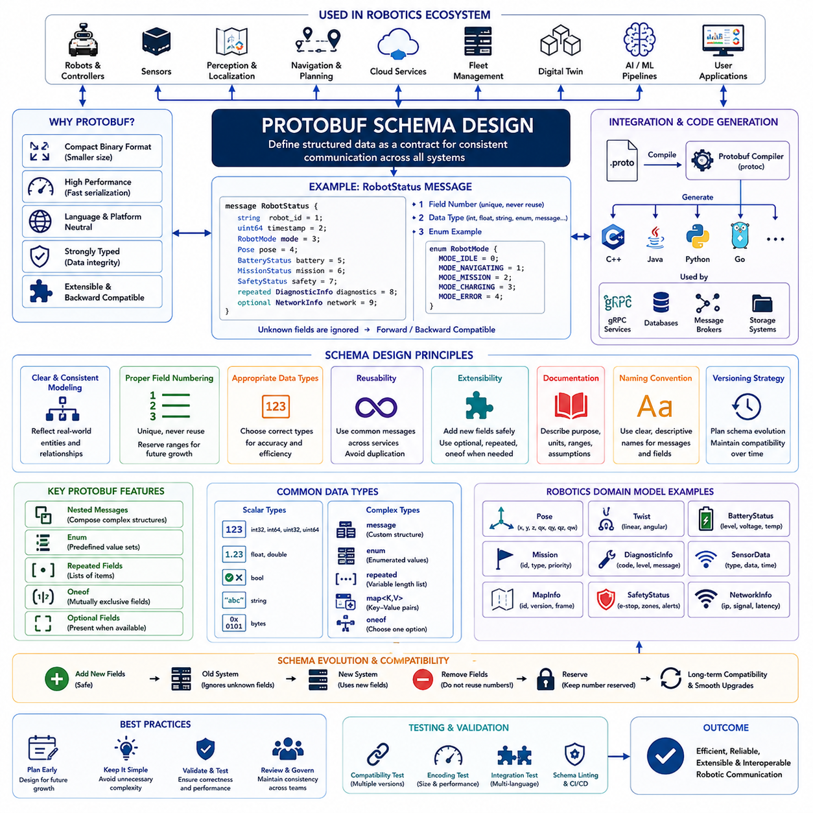
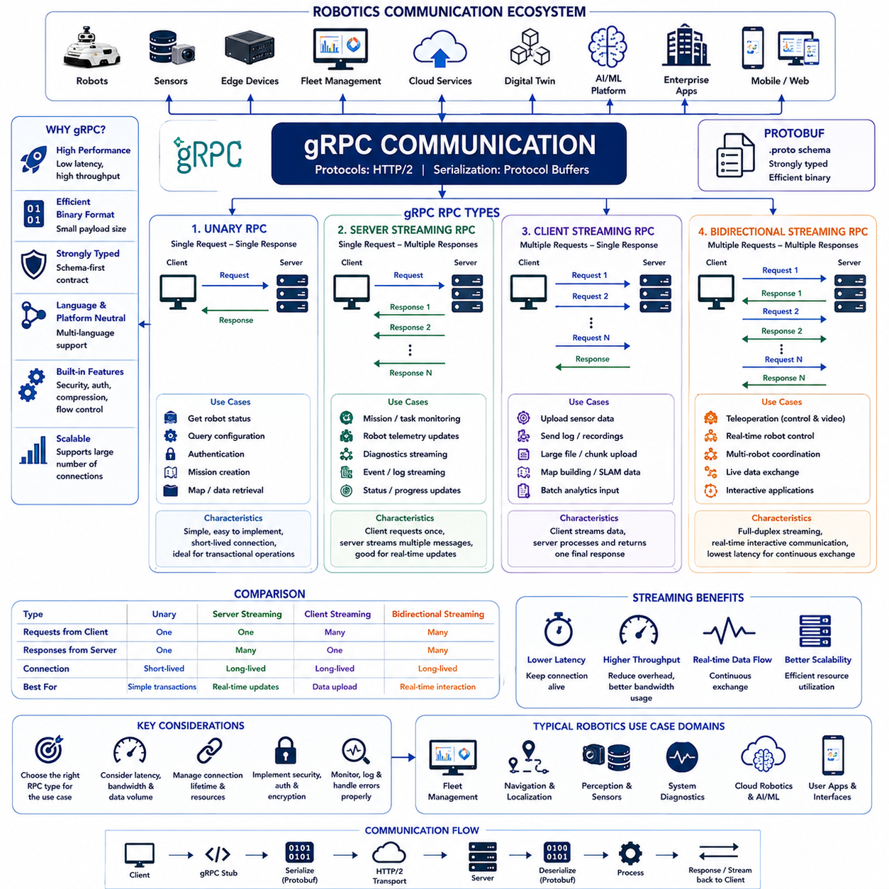
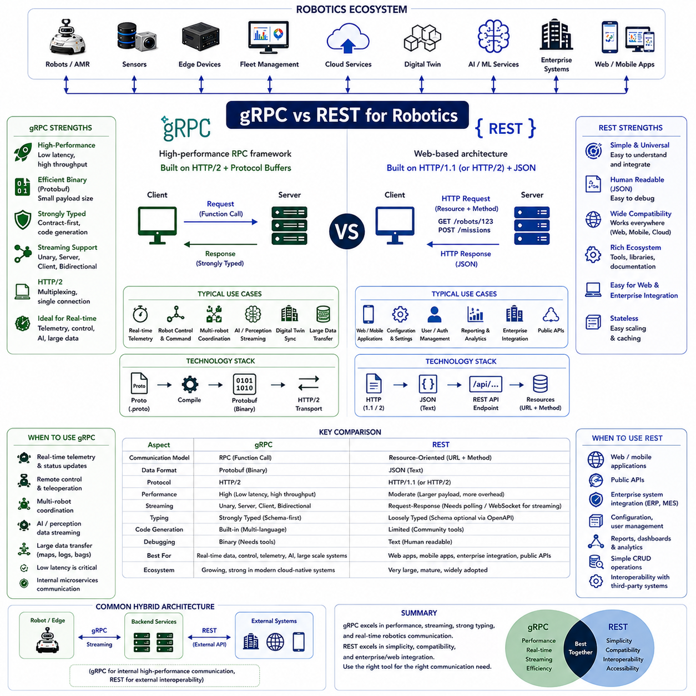
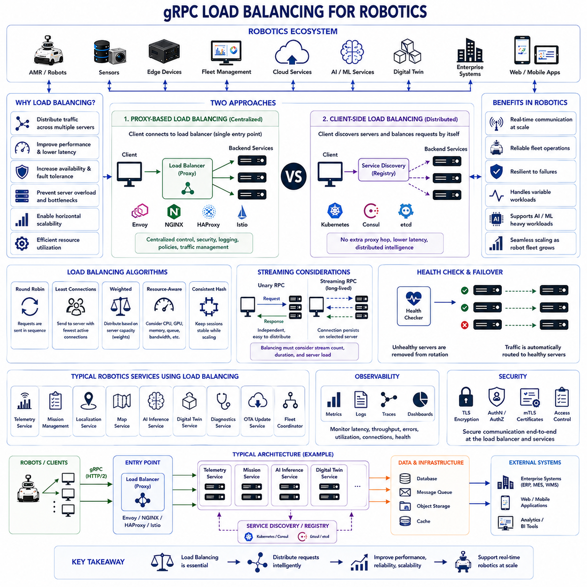
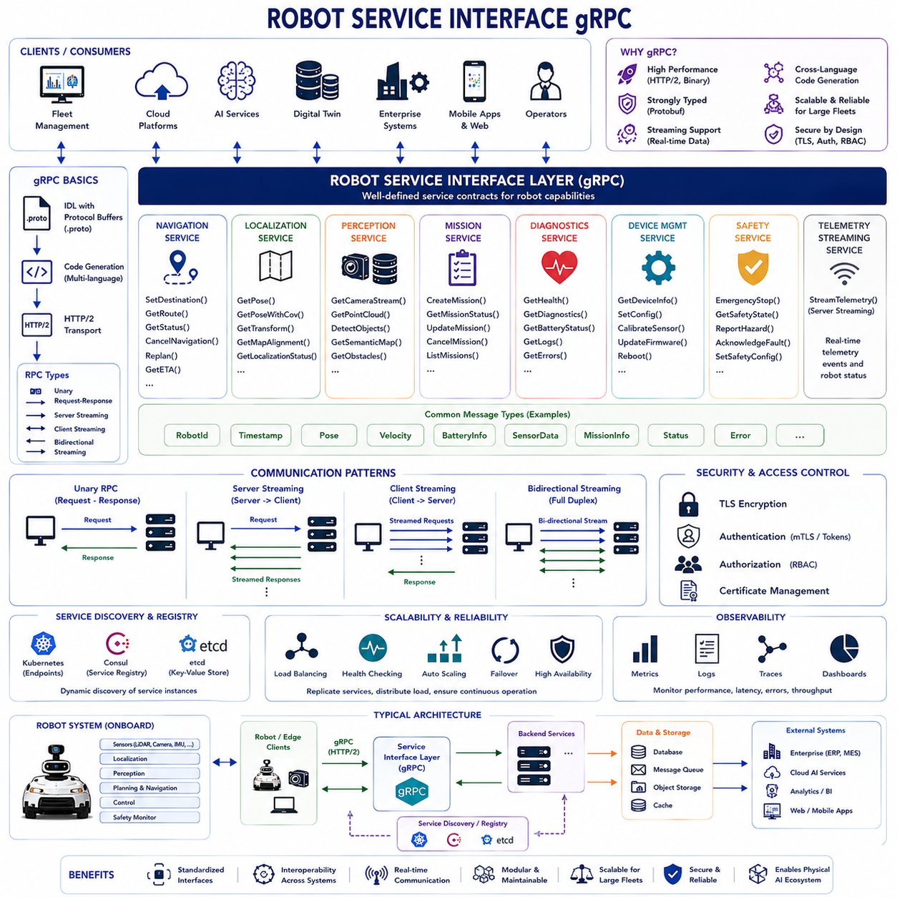

**Volume 09 Robotics Communication**


# Chapter 5. gRPC

##  

## 5.1 Protobuf Schema Design

{width="7.268055555555556in" height="7.268055555555556in"}

Protocol Buffers, commonly known as Protobuf, represent one of the most important technologies in modern distributed software systems, particularly in robotics, autonomous vehicles, industrial automation, cloud computing, edge computing, and Physical AI platforms. Originally developed by Google, Protobuf provides a language-neutral, platform-neutral, and extensible mechanism for serializing structured data. Within robotic communication architectures, Protobuf serves as the foundational data definition layer for gRPC services, cloud communication systems, fleet management platforms, digital twins, AI pipelines, telemetry infrastructures, and multi-robot coordination systems. The quality of a Protobuf schema directly influences interoperability, maintainability, scalability, performance, and long-term system evolution.

At its core, a Protobuf schema defines the structure of data exchanged between software components. Instead of relying on verbose text-based formats such as XML or JSON, Protobuf represents information using compact binary encoding. This binary representation significantly reduces network bandwidth consumption, lowers serialization overhead, decreases memory utilization, and improves communication efficiency. These characteristics make Protobuf particularly attractive for robotics systems where real-time performance, resource constraints, and reliable communication are critical design requirements.

In robotic architectures, communication occurs continuously between sensors, controllers, perception systems, localization modules, navigation engines, fleet managers, cloud services, and user interfaces. Each subsystem must exchange information using well-defined data structures. A Protobuf schema provides a formal contract that defines how data should be represented and interpreted across all participating systems. Without a carefully designed schema, communication becomes inconsistent, integration complexity increases, and long-term maintenance becomes increasingly difficult.

The primary objective of Protobuf schema design is establishing a stable and extensible data model that accurately represents system information while remaining adaptable to future requirements. Robotic systems evolve continuously. New sensors are added, algorithms improve, AI models change, safety requirements emerge, and operational capabilities expand. Consequently, schema design must prioritize forward compatibility and backward compatibility from the very beginning.

A Protobuf schema begins with message definitions. A message represents a structured data object composed of fields. Each field has a unique numeric identifier, data type, and optional attributes. Unlike JSON, where field names are transmitted directly within messages, Protobuf encodes data using field numbers. This design dramatically reduces message size and improves serialization efficiency.

Field numbering represents one of the most important aspects of schema design. Once assigned, field numbers become part of the communication contract and should never be reused. Changing field numbers can break compatibility between older and newer software versions. Therefore, field numbering strategies must be planned carefully to support future expansion while preserving compatibility across system upgrades.

Robotic systems often operate for many years in production environments. Field numbering decisions made during initial development may affect maintainability throughout the entire system lifecycle. Experienced architects typically reserve numbering ranges for future extensions, subsystem-specific attributes, vendor customizations, or experimental features. Such planning reduces the likelihood of disruptive schema modifications later.

Data type selection is another critical consideration. Protobuf supports numerous primitive types including integers, floating-point values, booleans, strings, bytes, and enumerations. Choosing the correct data type improves performance, reduces message size, and prevents interpretation errors.

For example, robot identifiers may be represented as strings because they often contain alphanumeric values. Battery percentages may use floating-point values. Safety states may be represented as enumerations. Sensor timestamps may utilize 64-bit integers to support high-resolution timing requirements. Selecting appropriate data types ensures that information is represented accurately while minimizing communication overhead.

Enumerations play a particularly important role in robotic communication systems. Many operational states belong to predefined categories rather than arbitrary values. Robot modes, mission states, fault classifications, charging conditions, localization quality levels, safety statuses, and network conditions can often be represented effectively using enumerations. Enumerations improve readability, simplify validation, and reduce ambiguity during interpretation.

Message composition is another fundamental aspect of schema design. Large robotic systems rarely rely on flat message structures. Instead, messages are typically composed of nested objects that reflect logical relationships between system entities. A robot status message may contain localization information, battery information, diagnostic information, mission information, safety information, and communication information as separate sub-messages. Such modular organization improves maintainability and encourages reuse across multiple services.

Reusability represents an important architectural goal. Common structures should be defined once and reused throughout the ecosystem. Position information, timestamps, coordinate systems, robot identifiers, health indicators, diagnostic records, and mission descriptors frequently appear across multiple services. By defining reusable message types, developers reduce duplication and improve consistency across the entire communication architecture.

Naming conventions significantly influence schema readability and maintainability. Consistent naming standards help developers understand message semantics and reduce integration errors. Message names typically use descriptive nouns, while field names use clear and concise terminology. Ambiguous abbreviations should be avoided whenever possible because robotic systems often involve multidisciplinary teams spanning software engineering, mechanical engineering, electrical engineering, operations, safety, and artificial intelligence domains.

Documentation is an essential component of schema design. Every message, field, enumeration, and service definition should include descriptive comments explaining purpose, units, assumptions, valid ranges, and operational significance. Documentation reduces onboarding time for new developers and prevents misinterpretation during long-term maintenance. In large-scale robotic programs involving multiple organizations, well-documented schemas become especially valuable.

Versioning strategies are fundamental to successful Protobuf deployments. Robotic systems rarely remain static. New features must be introduced without disrupting existing deployments. Protobuf provides strong compatibility mechanisms when schemas evolve correctly. New fields can generally be added safely because older implementations simply ignore unknown fields. This characteristic enables gradual deployment of new capabilities across heterogeneous fleets.

Removing fields requires greater caution. Deleted field numbers should never be reassigned because older systems may still recognize those identifiers. Instead, obsolete fields are typically reserved permanently to prevent accidental reuse. This practice preserves compatibility and avoids subtle communication failures.

Optional fields provide flexibility during schema evolution. Not every message requires all information to be present at all times. Optional fields allow systems to exchange partial data while maintaining compatibility across software versions. This capability is particularly valuable during staged deployments where different components may operate using different software releases.

Repeated fields support collections of related objects. Many robotic applications involve lists of sensors, waypoints, tasks, robots, diagnostics entries, or detected obstacles. Repeated fields allow variable-length collections to be represented efficiently while preserving structured data organization.

Oneof constructs provide controlled flexibility within schemas. Certain situations require multiple alternative representations where only one option should be present at a time. For example, a navigation goal may be represented as coordinates, a named location, or a semantic destination. Oneof definitions enforce mutual exclusivity while maintaining clear semantic intent.

Time representation deserves special attention in robotic systems. Accurate timestamps are essential for sensor fusion, localization, synchronization, diagnostics, mission tracking, and distributed coordination. Protobuf schemas should establish consistent timestamp conventions across the entire ecosystem. High-resolution time representations improve correlation accuracy and facilitate debugging of complex distributed interactions.

Coordinate system representation is equally important. Robotics applications frequently utilize multiple coordinate frames including world coordinates, map coordinates, robot coordinates, sensor coordinates, geographic coordinates, and local reference frames. Schemas should clearly identify coordinate systems and transformations to prevent ambiguity. Misinterpretation of coordinate frames remains one of the most common causes of integration failures in robotic systems.

Sensor data modeling presents unique challenges due to the diversity of sensing technologies. Cameras, LiDARs, radars, IMUs, GNSS receivers, ultrasonic sensors, force sensors, and environmental sensors generate vastly different data structures. Effective schema design balances generalization with specialization. Common metadata structures may be shared while sensor-specific payloads remain specialized to preserve efficiency and clarity.

Fleet management systems depend heavily upon well-designed schemas. Robot status reporting, mission assignment, diagnostics collection, software deployment, maintenance scheduling, charging coordination, traffic management, and operational analytics all require standardized data representations. Consistent schemas enable interoperability across diverse robot models, vendors, and deployment environments.

Cloud communication architectures rely extensively on Protobuf because bandwidth efficiency becomes increasingly important at scale. Thousands of robots transmitting telemetry continuously can generate substantial network traffic. Compact binary encoding reduces operational costs while improving responsiveness. Protobuf therefore serves as a foundational technology for cloud-native robotics platforms.

Artificial intelligence systems introduce additional schema requirements. Machine learning pipelines frequently exchange large volumes of metadata, inference results, confidence scores, embeddings, semantic labels, object detections, and action recommendations. Protobuf schemas provide efficient structures for representing AI-generated information while maintaining compatibility across evolving model architectures.

Digital twin systems also benefit from rigorous schema design. Virtual representations of robots, facilities, missions, and operational states require synchronized data exchange between physical and virtual environments. Consistent schemas ensure that digital twins accurately reflect real-world conditions while supporting simulation, prediction, optimization, and operator training activities.

Security considerations should not be overlooked during schema design. Sensitive information such as credentials, access tokens, cryptographic material, personally identifiable information, or confidential operational data should be carefully classified and protected. Schemas should support secure communication practices without unnecessarily exposing sensitive information.

Performance optimization remains an important objective throughout schema development. Message structures should be designed to minimize bandwidth consumption while preserving necessary functionality. Excessively large messages increase latency and resource utilization. Excessively fragmented messages may increase processing overhead. Effective schema design seeks an appropriate balance between efficiency, clarity, extensibility, and maintainability.

Testing and validation are essential before schemas enter production environments. Compatibility testing verifies interactions between multiple schema versions. Performance testing evaluates serialization efficiency, memory consumption, and communication latency. Integration testing confirms interoperability across diverse programming languages, operating systems, middleware platforms, and deployment environments.

Within modern gRPC-based robotic architectures, the Protobuf schema serves as the authoritative source of truth for communication contracts. Client libraries, server implementations, documentation artifacts, test frameworks, monitoring tools, and development environments are often generated directly from schema definitions. Consequently, schema quality influences virtually every aspect of system development and operation.

As robotics evolves toward increasingly connected ecosystems involving autonomous mobile robots, outdoor autonomous vehicles, humanoid robots, quadruped systems, industrial manipulators, cloud robotics, digital twins, and Physical AI platforms, Protobuf schema design becomes increasingly strategic. Well-designed schemas enable interoperability, scalability, maintainability, and innovation. Poorly designed schemas create technical debt, integration difficulties, compatibility problems, and operational inefficiencies.

Ultimately, Protobuf Schema Design is far more than a data modeling exercise. It is a foundational architectural discipline that defines how information flows throughout robotic ecosystems. A robust schema establishes a common language shared by sensors, controllers, AI systems, fleet managers, cloud services, enterprise platforms, and human operators. Through careful planning, disciplined version management, strong documentation, and long-term compatibility strategies, Protobuf schemas provide the stable communication foundation upon which modern robotics and Physical AI systems are built.

# 05_01 Protobuf Schema Design

Protocol Buffers(Protobuf)는 현대 분산 소프트웨어 시스템에서 가장 중요한 데이터 직렬화 기술 중 하나이며, 특히 로보틱스, 자율주행 차량, 산업 자동화, 클라우드 컴퓨팅, 엣지 컴퓨팅, Physical AI 플랫폼에서 핵심적인 역할을 수행한다. Protobuf는 Google 에 의해 개발되었으며, 프로그래밍 언어와 플랫폼에 독립적인 구조화 데이터 표현 방식을 제공한다. 로봇 통신 아키텍처에서는 gRPC 서비스, 클라우드 통신, 플릿 관리 플랫폼, 디지털 트윈, 인공지능 파이프라인, 텔레메트리 시스템, 다중 로봇 협업 시스템의 기반 데이터 정의 계층으로 사용된다. 따라서 Protobuf 스키마의 품질은 시스템의 상호운용성, 유지보수성, 확장성, 성능, 그리고 장기적인 발전 가능성에 직접적인 영향을 미친다.

Protobuf 스키마의 본질은 시스템 간에 교환되는 데이터 구조를 정의하는 것이다. XML이나 JSON과 같은 텍스트 기반 포맷과 달리 Protobuf는 이진(Binary) 형식으로 데이터를 인코딩한다. 이 방식은 네트워크 대역폭 사용량을 크게 줄이고, 직렬화 및 역직렬화 속도를 향상시키며, 메모리 사용량을 감소시킨다. 이러한 특성은 실시간 성능과 통신 효율성이 중요한 로봇 시스템에서 매우 큰 장점을 제공한다.

로봇 시스템에서는 센서, 제어기, 인지 모듈, 위치 추정 시스템, 경로 계획기, 플릿 관리 서버, 클라우드 플랫폼, 사용자 인터페이스 등이 끊임없이 데이터를 교환한다. 이러한 모든 구성 요소는 동일한 데이터 구조를 이해해야 하며, Protobuf 스키마는 이를 위한 공식적인 계약(Contract) 역할을 수행한다. 스키마가 명확하지 않거나 일관성이 부족하면 시스템 통합이 어려워지고 유지보수 비용이 급격히 증가하게 된다.

Protobuf 스키마 설계의 가장 중요한 목표는 현재 요구사항을 충족하면서도 미래 확장을 지원할 수 있는 안정적이고 확장 가능한 데이터 모델을 구축하는 것이다. 로봇 시스템은 지속적으로 진화한다. 새로운 센서가 추가되고, 알고리즘이 개선되며, AI 모델이 교체되고, 새로운 안전 요구사항이 등장한다. 따라서 스키마 설계는 처음부터 전방 호환성(Forward Compatibility)과 후방 호환성(Backward Compatibility)을 고려해야 한다.

Protobuf 스키마는 Message 정의에서 시작된다. Message는 여러 필드(Field)로 구성된 구조화된 데이터 객체이다. 각 필드는 고유한 번호와 데이터 타입을 가진다. JSON은 필드 이름 자체를 전송하지만 Protobuf는 필드 번호를 사용한다. 이 방식은 데이터 크기를 크게 줄이고 통신 효율을 향상시킨다.

필드 번호(Field Number)는 Protobuf 설계에서 가장 중요한 요소 중 하나이다. 한번 정의된 번호는 시스템 전체의 계약이 되므로 재사용해서는 안 된다. 필드 번호를 변경하면 이전 버전과의 호환성이 깨질 수 있다. 따라서 초기 설계 단계에서 충분한 확장 공간을 고려하여 번호 체계를 정의해야 한다.

로봇 시스템은 수년 또는 수십 년 동안 운영되는 경우가 많다. 따라서 초기에 결정된 필드 번호는 전체 시스템 수명 주기에 영향을 미칠 수 있다. 경험이 많은 아키텍트들은 미래 확장을 위해 번호 구간을 미리 예약하거나 특정 기능 영역별로 번호를 분리하여 관리한다.

데이터 타입 선택 역시 매우 중요하다. Protobuf는 정수형, 부동소수점형, 문자열, 바이트 배열, 불린형, 열거형(Enum) 등 다양한 기본 타입을 제공한다. 적절한 데이터 타입을 선택하면 성능 향상과 데이터 크기 감소 효과를 얻을 수 있다.

예를 들어 로봇 ID는 문자열로 표현할 수 있으며, 배터리 잔량은 실수형으로 표현할 수 있다. 안전 상태는 Enum을 사용할 수 있으며, 센서 타임스탬프는 64비트 정수형으로 정의하는 것이 일반적이다. 올바른 타입 선택은 데이터 정확성과 성능을 동시에 확보하는 데 중요하다.

열거형(Enum)은 로봇 통신 시스템에서 매우 자주 사용된다. 로봇 상태, 미션 상태, 오류 코드, 충전 상태, 위치 추정 품질, 안전 상태 등은 미리 정의된 값의 집합으로 표현할 수 있다. Enum을 사용하면 데이터 의미가 명확해지고 오류 발생 가능성이 감소한다.

메시지 구성(Message Composition)은 스키마 설계의 핵심 개념이다. 실제 로봇 시스템은 단순한 평면 구조보다는 계층 구조를 가진다. 예를 들어 RobotStatus 메시지는 위치 정보, 배터리 정보, 진단 정보, 미션 정보, 안전 정보 등을 각각 하위 메시지(Sub-message)로 구성할 수 있다. 이러한 구조는 유지보수성과 재사용성을 크게 향상시킨다.

재사용성(Reusability)은 좋은 스키마 설계의 중요한 목표이다. 위치 정보, 시간 정보, 좌표계, 로봇 식별자, 건강 상태 정보, 진단 데이터 등은 여러 서비스에서 반복적으로 사용된다. 이를 공통 메시지로 정의하면 코드 중복을 줄이고 시스템 전체의 일관성을 확보할 수 있다.

명명 규칙(Naming Convention)은 스키마 가독성과 유지보수성에 직접적인 영향을 준다. 메시지 이름은 의미가 명확한 명사를 사용해야 하며, 필드 이름도 직관적이어야 한다. 모호한 약어나 줄임말은 피하는 것이 좋다. 로봇 시스템은 소프트웨어 엔지니어뿐 아니라 기계, 전기, 안전, 운영, AI 전문가들이 함께 사용하기 때문이다.

문서화(Documentation)는 스키마 설계에서 반드시 고려해야 할 요소이다. 각 메시지와 필드에는 목적, 단위, 범위, 의미를 설명하는 주석이 포함되어야 한다. 잘 작성된 문서는 신규 개발자의 학습 시간을 줄이고 장기적인 유지보수성을 향상시킨다.

버전 관리(Versioning)는 Protobuf 설계의 핵심 전략 중 하나이다. 로봇 시스템은 지속적으로 기능이 추가되고 변경된다. 새로운 필드를 추가할 때 기존 시스템이 정상 동작할 수 있어야 한다. Protobuf는 이러한 요구를 충족하도록 설계되었다.

새로운 필드는 일반적으로 안전하게 추가할 수 있다. 이전 버전의 소프트웨어는 알 수 없는 필드를 무시하기 때문이다. 이를 통해 다양한 버전의 소프트웨어가 동일한 환경에서 공존할 수 있다.

반면 필드를 삭제할 때는 더욱 신중해야 한다. 삭제된 필드 번호는 다시 사용해서는 안 된다. 과거 시스템이 여전히 해당 번호를 인식할 수 있기 때문이다. 따라서 삭제된 번호는 영구적으로 예약(Reserved) 상태로 유지하는 것이 일반적인 관행이다.

Optional 필드는 유연성을 제공한다. 모든 데이터가 항상 존재해야 하는 것은 아니다. 일부 정보는 특정 상황에서만 필요할 수 있다. Optional 필드를 사용하면 다양한 버전의 시스템이 서로 호환성을 유지하면서 데이터를 교환할 수 있다.

Repeated 필드는 가변 길이 데이터 집합을 표현하는 데 사용된다. 웨이포인트 목록, 장애물 목록, 센서 목록, 진단 기록, 작업 목록 등은 Repeated 구조로 표현된다. 이를 통해 효율적으로 대량 데이터를 처리할 수 있다.

Oneof 구조는 상호 배타적인 데이터 표현을 지원한다. 예를 들어 목적지가 좌표일 수도 있고, 특정 위치 이름일 수도 있으며, 의미 기반 목적지(Semantic Destination)일 수도 있다. Oneof는 이러한 여러 표현 방식 중 하나만 선택되도록 보장한다.

시간(Time) 표현은 로봇 시스템에서 매우 중요하다. 센서 융합, 위치 추정, 미션 추적, 분산 시스템 동기화 등 대부분의 기능이 정확한 시간 정보에 의존한다. 따라서 스키마 전체에서 일관된 타임스탬프 표현 방식을 사용하는 것이 중요하다.

좌표계(Coordinate System) 역시 중요하다. 로봇은 월드 좌표계, 지도 좌표계, 로봇 기준 좌표계, 센서 좌표계, GPS 좌표계 등 다양한 좌표계를 사용한다. 스키마는 좌표계의 의미를 명확하게 정의해야 한다. 좌표계 해석 오류는 실제 로봇 통합 프로젝트에서 매우 빈번하게 발생하는 문제 중 하나이다.

센서 데이터 모델링은 복잡한 설계 영역이다. 카메라, LiDAR, Radar, IMU, GNSS, 초음파 센서, 힘 센서 등은 모두 서로 다른 데이터 구조를 가진다. 따라서 공통 메타데이터는 재사용하면서 센서 특화 데이터는 별도로 정의하는 균형 잡힌 설계가 필요하다.

플릿 관리 시스템은 Protobuf에 크게 의존한다. 로봇 상태 보고, 미션 할당, 진단 수집, OTA 업데이트, 유지보수 계획, 충전 스케줄링, 교통 제어, 운영 분석 등 모든 기능이 표준화된 데이터 구조를 필요로 한다. 일관된 스키마는 다양한 제조사의 로봇과 시스템 간 상호운용성을 향상시킨다.

클라우드 기반 로봇 플랫폼에서도 Protobuf는 중요한 역할을 수행한다. 수천 대의 로봇이 지속적으로 데이터를 전송하는 환경에서는 네트워크 비용과 대역폭이 중요한 요소가 된다. Protobuf의 압축된 이진 표현은 운영 비용을 줄이고 응답성을 향상시킨다.

AI 시스템 역시 Protobuf를 적극 활용한다. 머신러닝 모델은 객체 인식 결과, 신뢰도 점수, 임베딩 벡터, 의미 정보, 행동 추천 등을 지속적으로 교환한다. Protobuf는 이러한 대규모 데이터를 효율적으로 표현할 수 있다.

디지털 트윈 시스템도 스키마 품질에 크게 의존한다. 실제 로봇과 가상 로봇 사이의 상태 동기화, 시뮬레이션 결과 공유, 예측 분석, 운영 최적화는 모두 정확한 데이터 모델링을 필요로 한다.

보안(Security) 역시 고려해야 한다. 인증 정보, 접근 토큰, 암호화 키, 개인 정보, 운영 정보 등 민감한 데이터는 스키마 설계 단계에서부터 적절히 분류되고 보호되어야 한다.

성능 최적화(Performance Optimization)는 스키마 설계 전반에 걸쳐 고려되어야 한다. 지나치게 큰 메시지는 대역폭과 메모리를 낭비하며, 지나치게 세분화된 메시지는 처리 오버헤드를 증가시킨다. 따라서 효율성과 가독성, 확장성 사이에서 적절한 균형을 찾아야 한다.

테스트와 검증(Test & Validation)은 실제 운영 전에 반드시 수행되어야 한다. 다양한 버전 간 호환성 테스트, 성능 테스트, 통합 테스트를 통해 스키마가 예상대로 동작하는지 확인해야 한다.

gRPC 기반 로봇 시스템에서는 Protobuf 스키마가 사실상 모든 통신의 기준 문서(Source of Truth) 역할을 수행한다. 클라이언트 코드, 서버 코드, 문서, 테스트 코드, 모니터링 도구까지 모두 스키마를 기반으로 자동 생성될 수 있다. 따라서 스키마 품질은 전체 시스템 품질에 직접적인 영향을 미친다.

미래의 AMR, 실외 자율주행 차량, 휴머노이드, 사족보행 로봇, 모바일 매니퓰레이터, 클라우드 로보틱스, 디지털 트윈, Physical AI 시스템에서는 더욱 복잡하고 방대한 데이터 교환이 이루어질 것이다. 이러한 환경에서 우수한 Protobuf 스키마는 상호운용성, 확장성, 유지보수성, 그리고 기술 혁신의 기반이 된다.

결론적으로 Protobuf Schema Design은 단순한 데이터 구조 정의 작업이 아니다. 이는 로봇 시스템 전체의 정보 흐름을 설계하는 핵심 아키텍처 분야이다. 잘 설계된 스키마는 센서, 제어기, AI 시스템, 플릿 관리 서버, 클라우드 서비스, 기업 시스템, 운영자 간의 공통 언어(Common Language)를 제공한다. 체계적인 설계, 명확한 문서화, 엄격한 버전 관리, 장기적인 호환성 전략을 통해 Protobuf 스키마는 현대 로보틱스 및 Physical AI 플랫폼의 핵심 통신 기반 기술로 자리잡게 된다.

##  

## 5.2 Unary and Streaming RPC

{width="7.268055555555556in" height="7.268055555555556in"}

Remote Procedure Call, commonly referred to as RPC, is a communication paradigm that enables one software component to invoke functions located on another system as if those functions were running locally. Within modern distributed robotics architectures, RPC mechanisms provide a structured and efficient method for communication between robots, edge computers, cloud services, fleet management systems, digital twins, artificial intelligence platforms, and enterprise applications. As robotic systems become increasingly distributed and interconnected, RPC-based communication has emerged as a fundamental architectural building block. In particular, gRPC has become one of the most widely adopted RPC frameworks due to its high performance, strong typing, efficient binary serialization through Protocol Buffers, and support for multiple communication patterns.

Among the most important concepts within gRPC communication are Unary RPC and Streaming RPC. These communication models define how information flows between clients and servers and determine how applications exchange requests, responses, telemetry, commands, events, and real-time operational data. Understanding the differences between unary communication and streaming communication is essential for designing scalable, responsive, and efficient robotic systems.

At a conceptual level, Unary RPC represents the simplest communication pattern. A client sends a single request to a server, and the server returns a single response. This interaction resembles a traditional function call where an input parameter is provided and a result is returned. The communication session terminates once the response has been delivered. Unary RPC is therefore often compared to a request-response transaction.

In robotic systems, many operations naturally fit the unary communication model. A fleet manager may request the current battery status of a robot. A mobile application may query the robot\'s software version. A diagnostic service may retrieve system health information. A cloud platform may request the latest mission result. In each of these scenarios, a single request generates a single response, making Unary RPC an efficient and intuitive choice.

The simplicity of Unary RPC offers several advantages. It is easy to understand, straightforward to implement, and highly compatible with existing service-oriented architectures. Error handling is generally simpler because each interaction is self-contained. Monitoring and logging systems can easily track individual transactions. Resource consumption is predictable because connections typically exist only for the duration of the request.

Unary communication is particularly suitable for configuration management, authentication services, parameter retrieval, software deployment requests, diagnostics queries, mission creation, map retrieval, fleet administration, and other transactional operations. In these cases, the communication volume is relatively small, and the response is expected within a short and well-defined timeframe.

Despite its simplicity, Unary RPC has limitations when applied to continuous or high-frequency communication scenarios. Modern robotic systems generate vast amounts of real-time information. Sensors continuously produce measurements. Localization systems update positions multiple times per second. Navigation systems calculate trajectories dynamically. Fleet management platforms monitor hundreds of robots simultaneously. Attempting to transfer such data using repeated unary requests can introduce excessive overhead and reduce overall system efficiency.

To address these challenges, gRPC introduces Streaming RPC communication patterns. Streaming RPC allows one or both communication participants to exchange multiple messages through a single long-lived connection. Rather than repeatedly creating and terminating independent requests, streaming communication maintains an active channel through which information can flow continuously.

Streaming communication significantly reduces connection establishment overhead, improves bandwidth utilization, lowers latency, and enables efficient handling of real-time data streams. These characteristics make Streaming RPC particularly valuable within robotics environments where continuous information exchange is common.

The first streaming model is Server Streaming RPC. In this communication pattern, the client sends a single request, but the server responds with a stream of messages over time. The server may continue transmitting information until all requested data has been delivered or until the communication session terminates.

A common robotics example involves mission monitoring. A fleet manager may request updates regarding a specific mission. Rather than repeatedly polling the robot using multiple unary requests, the client establishes a server-streaming connection. As mission progress evolves, the server continuously transmits updates including status changes, navigation progress, battery conditions, safety events, and completion notifications. This approach provides near real-time visibility while minimizing communication overhead.

Server streaming is also useful for diagnostics monitoring, software deployment tracking, maintenance reporting, sensor history retrieval, event log delivery, and operational analytics. Whenever a client requires multiple pieces of information over time in response to a single request, server streaming provides an efficient solution.

The second streaming model is Client Streaming RPC. In this communication pattern, the client transmits a sequence of messages to the server while the server eventually returns a single consolidated response. The client determines when transmission is complete, after which the server processes the accumulated information and generates a final result.

Client streaming is particularly useful when large amounts of data must be uploaded efficiently. For example, a robot may transmit a sequence of sensor recordings to a cloud analytics platform. Rather than sending thousands of individual requests, the robot streams data continuously through a single connection. Once transmission concludes, the cloud service analyzes the collected information and returns a summary, classification result, or processing outcome.

Mapping applications frequently utilize client streaming. A robot exploring an environment may continuously upload LiDAR scans, camera images, localization information, and environmental observations. The mapping service receives the stream, integrates the data, constructs a map, and eventually returns the completed mapping result. This architecture reduces communication overhead while improving scalability.

The third and most powerful communication model is Bidirectional Streaming RPC. In this pattern, both client and server simultaneously exchange streams of messages through a shared communication channel. Messages may flow independently in either direction, allowing real-time interactive communication between distributed systems.

Bidirectional streaming closely resembles a continuous conversation. Both participants can transmit information whenever necessary without waiting for corresponding requests or responses. This communication style is particularly valuable in robotics because many operational scenarios require ongoing interaction between multiple intelligent systems.

A robot receiving navigation commands from a fleet manager provides a practical example. The fleet manager continuously transmits updated goals, route adjustments, traffic instructions, and operational directives. Simultaneously, the robot streams localization updates, battery information, obstacle detections, mission status changes, and diagnostic events. Both sides exchange information in real time through a persistent bidirectional connection.

Teleoperation systems also benefit significantly from bidirectional streaming. Human operators send control commands while simultaneously receiving video feeds, sensor information, robot status updates, and safety notifications. The interactive nature of teleoperation demands low-latency communication that bidirectional streaming can provide efficiently.

Collaborative multi-robot systems represent another important application domain. Multiple robots working together often require continuous coordination. Robots may exchange localization information, shared map updates, obstacle reports, task assignments, resource reservations, and synchronization signals. Bidirectional streaming enables this ongoing collaboration while minimizing communication latency.

The choice between Unary RPC and Streaming RPC depends largely on communication requirements. Transactional operations with limited data volumes generally favor Unary RPC due to simplicity and predictability. Continuous monitoring, telemetry, event distribution, sensor streaming, and interactive coordination typically benefit from streaming architectures.

Latency considerations strongly influence communication design decisions. Unary communication incurs overhead for each request because connections must be established, requests transmitted, responses generated, and sessions terminated. Streaming communication amortizes this overhead across many messages by maintaining persistent communication channels. As a result, streaming architectures often achieve lower effective latency for continuous information exchange.

Bandwidth utilization is another important factor. Frequent unary requests may contain substantial protocol overhead relative to useful payload data. Streaming connections reduce repetitive protocol exchanges and improve bandwidth efficiency. This advantage becomes increasingly significant as communication frequency increases.

Scalability considerations are equally important in large robotic deployments. Fleet management systems monitoring hundreds or thousands of robots must carefully manage communication resources. Streaming architectures often reduce server workload by eliminating excessive connection establishment and request processing activities. However, persistent connections require careful resource management to avoid excessive memory consumption.

Reliability represents another key design consideration. Robotics systems frequently operate in environments where network conditions are imperfect. Wireless communication links may experience interference, congestion, signal degradation, or temporary interruptions. gRPC streaming mechanisms provide reconnection capabilities, error propagation mechanisms, and flow control features that help maintain communication reliability under challenging conditions.

Flow control becomes particularly important within streaming architectures. A server generating data faster than a client can consume it may overwhelm communication buffers and degrade system performance. Similarly, high-bandwidth sensor streams may exceed available network capacity. gRPC incorporates flow control mechanisms that regulate message transmission rates and prevent resource exhaustion.

Security considerations apply equally to unary and streaming communication models. Authentication, authorization, encryption, certificate management, and access control mechanisms remain essential regardless of communication pattern. Streaming connections often require additional attention because long-lived sessions may persist for extended periods. Proper session management and periodic credential validation help maintain secure communication channels.

Observability and diagnostics also play important roles in RPC architecture design. Monitoring systems should track connection status, message throughput, latency distributions, error rates, stream durations, bandwidth utilization, and resource consumption. Such visibility helps engineers optimize communication performance and diagnose operational issues.

In cloud robotics environments, unary and streaming communication frequently coexist within the same architecture. Configuration requests, mission assignments, authentication operations, and administrative functions often utilize Unary RPC. Telemetry transmission, sensor streaming, fleet monitoring, AI inference pipelines, and digital twin synchronization frequently employ Streaming RPC. This hybrid approach allows each communication model to be applied where it provides the greatest benefit.

Artificial Intelligence systems increasingly rely upon streaming architectures as well. Modern Physical AI platforms continuously exchange perception results, semantic information, reasoning outputs, action recommendations, world models, and planning updates. Streaming communication enables efficient integration between AI components operating across edge devices, robotic platforms, and cloud infrastructure.

Digital twin architectures similarly benefit from streaming communication. Maintaining synchronization between physical robots and virtual representations requires continuous exchange of operational data. Streaming RPC provides an efficient mechanism for transmitting updates while preserving real-time consistency between physical and digital environments.

As robotic systems continue evolving toward greater autonomy, larger deployment scales, and deeper integration with cloud services and Physical AI platforms, the importance of efficient communication architectures will continue to grow. Unary RPC and Streaming RPC represent complementary communication models that address different operational requirements. Neither approach is universally superior. Instead, successful system architectures carefully match communication patterns to application needs.

Ultimately, Unary and Streaming RPC form the foundation of modern gRPC-based communication systems. Unary RPC provides a simple and efficient solution for transactional interactions, while Streaming RPC enables continuous, low-latency, high-efficiency communication for real-time operations. Together, these communication models support the diverse requirements of autonomous mobile robots, industrial automation systems, fleet management platforms, digital twins, cloud robotics infrastructures, and future Physical AI ecosystems. Through careful architectural design, engineers can leverage these capabilities to build scalable, reliable, secure, and high-performance robotic communication systems capable of supporting the next generation of intelligent machines.

# 05_02 Unary and Streaming RPC

RPC(Remote Procedure Call)는 하나의 소프트웨어가 다른 시스템에 존재하는 함수를 마치 로컬 함수처럼 호출할 수 있도록 하는 통신 방식이다. 현대의 로봇 시스템에서는 로봇, 엣지 컴퓨터, 클라우드 서비스, 플릿 관리 시스템, 디지털 트윈, 인공지능 플랫폼, 기업용 소프트웨어 간의 통신을 위해 RPC 기술이 널리 사용된다. 로봇 시스템이 점점 더 분산형 구조로 발전함에 따라 RPC는 핵심적인 통신 기술로 자리 잡고 있으며, 특히 gRPC는 높은 성능과 강력한 타입 시스템, 그리고 Protobuf 기반의 효율적인 직렬화 기능 덕분에 가장 널리 사용되는 RPC 프레임워크 중 하나가 되었다.

gRPC의 핵심 개념 중 하나는 Unary RPC와 Streaming RPC이다. 이 두 가지 방식은 클라이언트와 서버 사이의 데이터 흐름 방식을 정의하며, 로봇 시스템이 명령, 상태 정보, 텔레메트리, 이벤트, 센서 데이터 등을 어떻게 교환할 것인지를 결정한다. 따라서 두 통신 모델의 차이를 이해하는 것은 확장 가능하고 효율적인 로봇 통신 아키텍처를 설계하는 데 매우 중요하다.

Unary RPC는 가장 단순한 통신 모델이다. 클라이언트가 하나의 요청(Request)을 서버에 보내고 서버는 하나의 응답(Response)을 반환한다. 이 과정은 일반적인 함수 호출과 매우 유사하다. 입력값을 전달하면 결과값을 받는 구조이며 응답이 완료되면 통신 세션도 종료된다. 따라서 Unary RPC는 요청-응답(Request-Response) 방식이라고도 할 수 있다.

로봇 시스템에서는 많은 기능들이 Unary RPC와 잘 맞는다. 플릿 관리 서버가 로봇의 배터리 상태를 조회하는 경우, 모바일 애플리케이션이 소프트웨어 버전을 요청하는 경우, 진단 시스템이 상태 정보를 조회하는 경우, 클라우드 서버가 특정 미션의 결과를 요청하는 경우 등이 대표적인 예이다. 이러한 상황에서는 하나의 요청에 하나의 응답만 필요하므로 Unary RPC가 가장 적합하다.

Unary RPC의 가장 큰 장점은 단순성이다. 구현이 쉽고 이해하기 쉬우며 기존의 서비스 지향 아키텍처와도 잘 통합된다. 각 요청이 독립적으로 처리되기 때문에 오류 처리와 로깅도 간단하다. 또한 자원 사용량을 예측하기 쉽고 서버 관리가 용이하다.

설정 관리, 사용자 인증, 파라미터 조회, OTA 업데이트 요청, 진단 정보 조회, 미션 생성, 지도 다운로드, 플릿 관리 기능 등은 대부분 Unary RPC를 사용하는 것이 효율적이다. 이러한 작업들은 비교적 작은 데이터량을 처리하며 빠른 응답을 요구하기 때문이다.

그러나 Unary RPC는 실시간 데이터 처리에는 한계가 있다. 현대의 로봇은 엄청난 양의 데이터를 지속적으로 생성한다. 센서는 초당 수십에서 수천 번 데이터를 생성하고, 위치 추정 시스템은 지속적으로 좌표를 갱신하며, 경로 계획 시스템은 동적으로 경로를 계산한다. 수백 대의 로봇을 관리하는 플릿 시스템에서는 이러한 데이터가 끊임없이 발생한다. 이러한 데이터를 모두 Unary RPC로 처리하면 반복적인 연결 생성과 종료가 발생하여 성능이 저하된다.

이 문제를 해결하기 위해 gRPC는 Streaming RPC라는 개념을 제공한다. Streaming RPC는 하나의 연결(Connection)을 유지한 상태에서 여러 개의 메시지를 지속적으로 주고받을 수 있는 방식이다. 연결을 반복적으로 생성하고 종료하지 않기 때문에 네트워크 효율성이 향상되고 지연시간도 감소한다.

Streaming RPC는 실시간 데이터 교환에 매우 적합하다. 센서 데이터 스트리밍, 텔레메트리 전송, 플릿 모니터링, 실시간 AI 추론 결과 전달 등과 같은 분야에서 널리 사용된다.

Streaming RPC는 크게 세 가지 방식으로 구분된다.

첫 번째는 Server Streaming RPC이다. 이 방식에서는 클라이언트가 하나의 요청을 보내고 서버는 여러 개의 응답을 순차적으로 전송한다. 즉, 요청은 한 번이지만 응답은 지속적으로 전달된다.

예를 들어 플릿 관리 시스템이 특정 로봇의 미션 진행 상황을 모니터링한다고 가정해 보자. Unary RPC를 사용한다면 상태를 확인하기 위해 지속적으로 요청을 보내야 한다. 그러나 Server Streaming RPC를 사용하면 한 번의 요청만으로 미션 완료 시까지 진행 상황을 지속적으로 받을 수 있다. 서버는 이동 상태, 배터리 상태, 장애물 감지 정보, 안전 이벤트, 완료 상태 등을 계속 전송할 수 있다.

이 방식은 미션 추적, 진단 모니터링, OTA 업데이트 진행 상황, 이벤트 로그 전송, 운영 분석 데이터 제공 등에 매우 유용하다.

두 번째는 Client Streaming RPC이다. 이 방식에서는 클라이언트가 여러 개의 메시지를 서버로 전송하고 서버는 최종적으로 하나의 응답을 반환한다.

예를 들어 로봇이 센서 데이터를 클라우드 서버로 업로드한다고 가정해 보자. 수천 개의 센서 데이터를 각각 Unary RPC로 전송하는 것은 비효율적이다. 대신 하나의 스트림을 통해 데이터를 연속적으로 전송할 수 있다. 데이터 전송이 모두 완료되면 서버는 이를 분석한 후 결과를 하나의 응답으로 반환한다.

지도 생성(Mapping) 작업도 대표적인 사례이다. 로봇은 LiDAR 데이터, 카메라 이미지, 위치 정보 등을 지속적으로 서버에 전송하고, 서버는 이를 기반으로 지도를 생성한 후 최종 결과를 반환할 수 있다.

세 번째는 Bidirectional Streaming RPC이다. 이는 가장 강력한 통신 방식으로, 클라이언트와 서버가 동시에 여러 개의 메시지를 송수신할 수 있다.

이 방식은 마치 두 사람이 실시간으로 대화하는 것과 유사하다. 클라이언트와 서버 모두 상대방의 응답을 기다릴 필요 없이 언제든지 데이터를 전송할 수 있다.

로봇과 플릿 관리 서버 간의 실시간 제어가 대표적인 예이다. 플릿 서버는 경로 변경 명령, 우선순위 변경, 교통 제어 명령 등을 지속적으로 보낼 수 있으며, 동시에 로봇은 위치 정보, 배터리 상태, 장애물 정보, 진단 데이터 등을 지속적으로 전송할 수 있다.

원격 조종(Teleoperation) 시스템에서도 Bidirectional Streaming RPC가 필수적이다. 운영자는 제어 명령을 로봇에 전달하고, 로봇은 비디오 스트림, 센서 데이터, 상태 정보, 안전 경고를 실시간으로 전송한다. 양방향 스트리밍은 이러한 상호작용을 효율적으로 지원한다.

다중 로봇 협업(Multi-Robot Collaboration) 역시 중요한 활용 분야이다. 여러 대의 로봇이 함께 작업할 경우 위치 정보, 장애물 정보, 지도 업데이트, 작업 분배, 자원 예약 정보 등을 지속적으로 교환해야 한다. Bidirectional Streaming RPC는 이러한 협업 통신에 매우 적합하다.

어떤 RPC 방식을 선택할지는 응용 환경에 따라 달라진다. 단순 조회나 설정 변경처럼 독립적인 작업은 Unary RPC가 적합하다. 반면 실시간 모니터링, 텔레메트리 전송, 센서 데이터 스트리밍, AI 결과 공유, 플릿 상태 관리 등은 Streaming RPC가 훨씬 효율적이다.

지연시간(Latency) 측면에서도 차이가 존재한다. Unary RPC는 매 요청마다 연결 설정과 종료가 반복되므로 오버헤드가 발생한다. 반면 Streaming RPC는 연결을 유지하기 때문에 동일한 데이터량을 처리할 때 더 낮은 지연시간을 제공할 수 있다.

대역폭(Bandwidth) 효율성 역시 Streaming RPC가 우수하다. Unary 방식에서는 요청과 응답마다 프로토콜 헤더가 반복적으로 전송된다. Streaming 방식은 이러한 반복을 줄여 네트워크 자원을 효율적으로 활용할 수 있다.

확장성(Scalability) 측면에서는 두 방식 모두 장단점이 존재한다. Unary RPC는 서버 관리가 단순하지만 요청 수가 많아질 경우 부담이 증가할 수 있다. Streaming RPC는 연결 수를 줄일 수 있지만 장시간 연결 유지에 따른 메모리 관리가 필요하다.

신뢰성(Reliability)도 중요한 요소이다. 로봇은 Wi-Fi, 5G, 산업용 무선망 등 다양한 네트워크 환경에서 운영된다. gRPC는 연결 복구, 오류 전달, 흐름 제어(Flow Control) 기능을 제공하여 불안정한 네트워크에서도 안정적인 통신을 지원한다.

흐름 제어는 특히 Streaming RPC에서 중요하다. 서버가 너무 많은 데이터를 전송하면 클라이언트가 처리하지 못할 수 있다. 반대로 센서 데이터가 네트워크 용량을 초과할 수도 있다. gRPC는 이러한 문제를 방지하기 위해 전송 속도를 자동으로 조절한다.

보안(Security)은 Unary RPC와 Streaming RPC 모두에서 동일하게 중요하다. 인증(Authentication), 권한 관리(Authorization), TLS 암호화, 인증서 관리 등이 필수적으로 적용되어야 한다. 특히 Streaming RPC는 연결이 장시간 유지되므로 세션 관리와 인증 갱신에 더욱 주의해야 한다.

모니터링과 관측성(Observability)도 중요한 요소이다. 시스템은 RPC 호출 수, 지연시간, 오류율, 메시지 처리량, 스트림 지속 시간, 네트워크 사용량 등을 지속적으로 모니터링해야 한다. 이를 통해 성능 최적화와 문제 해결이 가능해진다.

실제 클라우드 로보틱스 시스템에서는 Unary RPC와 Streaming RPC가 함께 사용되는 경우가 많다. 인증, 설정 변경, 미션 생성, 관리 기능은 Unary RPC를 사용하고, 텔레메트리, 실시간 모니터링, 센서 데이터 전송, 디지털 트윈 동기화는 Streaming RPC를 사용하는 방식이다.

인공지능 기반 Physical AI 플랫폼에서도 Streaming RPC의 중요성이 커지고 있다. AI 모델은 인식 결과, 의미 정보, 계획 정보, 행동 추천 등을 지속적으로 교환해야 한다. Streaming RPC는 이러한 실시간 AI 파이프라인을 효율적으로 지원한다.

디지털 트윈 시스템 역시 Streaming RPC를 활용하여 실제 로봇과 가상 모델 간의 상태를 지속적으로 동기화한다. 이를 통해 물리 세계와 가상 세계의 일관성을 유지할 수 있다.

결론적으로 Unary RPC와 Streaming RPC는 현대 gRPC 기반 통신 아키텍처의 핵심 구성 요소이다. Unary RPC는 단순하고 효율적인 요청-응답 통신을 제공하며, Streaming RPC는 실시간 데이터 교환과 대규모 분산 시스템에 적합한 지속적 통신을 제공한다. 두 방식은 경쟁 관계가 아니라 상호 보완 관계에 있으며, 로봇 시스템의 요구사항에 따라 적절히 조합하여 사용하는 것이 중요하다.

미래의 AMR, 실외 자율주행 차량, 모바일 매니퓰레이터, 휴머노이드, 디지털 트윈, 클라우드 로보틱스, Physical AI 플랫폼에서는 이러한 RPC 통신 기술이 더욱 중요해질 것이다. 효율적인 Unary RPC와 Streaming RPC 설계는 차세대 지능형 로봇 시스템의 성능, 확장성, 안정성, 보안성을 결정하는 핵심 요소가 될 것이다.

##  

## 5.3 gRPC vs REST for Robotics

{width="7.268055555555556in" height="7.268055555555556in"}

The evolution of modern robotics has transformed robots from isolated electromechanical machines into highly connected cyber-physical systems that continuously exchange information with cloud platforms, fleet management systems, digital twins, enterprise applications, artificial intelligence services, edge computing infrastructure, and other robots. As robotic systems become increasingly distributed and intelligent, communication architecture emerges as one of the most important design decisions influencing scalability, performance, maintainability, security, and long-term operational success. Among the most widely adopted communication technologies in modern software systems are REST and gRPC. Both technologies provide mechanisms for distributed communication, yet they differ significantly in design philosophy, performance characteristics, communication models, implementation complexity, and suitability for specific robotics use cases.

Understanding the strengths and limitations of REST and gRPC is essential for robotics architects because neither technology universally replaces the other. Instead, each addresses different communication requirements and often coexists within the same robotic ecosystem. Successful robotics platforms frequently employ both technologies strategically, leveraging the advantages of each where they provide the greatest value.

REST, which stands for Representational State Transfer, has been the dominant web service architecture for more than two decades. REST emerged alongside the growth of the World Wide Web and was designed around HTTP-based communication principles. REST treats system functionality as resources that can be accessed through standardized HTTP methods such as GET, POST, PUT, PATCH, and DELETE. Resources are identified through URLs, and data is typically exchanged using JSON.

The popularity of REST stems largely from its simplicity and universal accessibility. Nearly every programming language, operating system, cloud platform, web framework, mobile platform, and enterprise application supports HTTP and JSON. As a result, REST APIs are easy to implement, easy to consume, and easy to integrate with existing software ecosystems. For many years, REST has served as the primary integration mechanism connecting robotic systems with enterprise software, cloud services, monitoring platforms, and user interfaces.

gRPC, in contrast, was developed by Google as a high-performance Remote Procedure Call framework optimized for modern distributed systems. Unlike REST, which focuses on resources and HTTP semantics, gRPC is centered around service definitions and function invocation. Communication contracts are defined using Protocol Buffers, commonly known as Protobuf, which provide strongly typed message definitions and efficient binary serialization.

At the architectural level, REST and gRPC represent fundamentally different communication philosophies. REST models communication as interactions with resources. A robot becomes a resource. A mission becomes a resource. A map becomes a resource. Operations manipulate these resources through standardized HTTP methods. gRPC models communication as remote function calls. Instead of interacting with resources, clients invoke services and methods. A client might call GetRobotStatus(), CreateMission(), UploadMap(), or StartNavigation() as if these functions existed locally.

This distinction significantly influences developer experience. REST APIs are generally intuitive for web developers because resources and URLs align naturally with web concepts. gRPC APIs often feel more natural to software engineers designing distributed applications because service definitions closely resemble traditional programming interfaces.

Performance is one of the most significant differentiators between the two technologies. REST commonly uses JSON for data exchange. JSON is human-readable and easy to debug, but it introduces serialization overhead and larger message sizes. Every field name must be transmitted explicitly, increasing bandwidth consumption. Parsing JSON also requires additional processing resources.

gRPC utilizes Protocol Buffers, which encode data into compact binary representations. Field names are replaced by numeric identifiers, significantly reducing message size. Serialization and deserialization operations are faster and more efficient than equivalent JSON processing. Consequently, gRPC often achieves substantially lower latency and higher throughput than REST.

In robotic systems, performance differences become particularly important when communication occurs frequently. A robot generating localization updates at high frequency, streaming sensor data, exchanging navigation information, or coordinating with multiple robots benefits significantly from the efficiency of binary communication. The reduced bandwidth consumption and lower computational overhead of gRPC can directly improve overall system responsiveness.

Communication protocols also differ considerably. Traditional REST APIs typically operate over HTTP/1.1, although modern implementations increasingly support HTTP/2. gRPC is built directly on HTTP/2 and leverages its advanced features. HTTP/2 supports multiplexing, allowing multiple requests and responses to share a single connection simultaneously. This capability reduces connection management overhead and improves communication efficiency.

Connection management is particularly relevant within robotic environments where devices may operate over constrained wireless networks. Maintaining efficient communication channels reduces latency and improves scalability. gRPC's utilization of HTTP/2 often provides advantages in these scenarios, especially when communication frequency is high.

Another important distinction involves communication models. REST primarily supports request-response interactions. A client sends a request and receives a response. While techniques such as polling, long polling, and WebSockets can extend REST-based systems, the underlying communication model remains fundamentally transactional.

gRPC supports multiple communication paradigms natively. Unary RPC enables traditional request-response interactions similar to REST. Server Streaming allows servers to continuously transmit information following a single request. Client Streaming enables clients to upload multiple messages before receiving a response. Bidirectional Streaming supports simultaneous message exchange in both directions.

These streaming capabilities are highly valuable in robotics. Robots continuously generate telemetry, diagnostics, localization updates, sensor measurements, perception results, and mission status information. Streaming architectures eliminate the inefficiencies associated with repeated polling and enable real-time communication with minimal overhead.

For example, a fleet management platform monitoring hundreds of robots may use bidirectional streaming to receive continuous status updates while simultaneously transmitting mission assignments and operational commands. Achieving equivalent functionality through REST often requires more complex architectural patterns involving polling mechanisms, message brokers, or supplementary communication technologies.

Strong typing represents another significant advantage of gRPC. Protocol Buffers define explicit schemas describing message structures, field types, enumerations, and service interfaces. These schemas serve as authoritative communication contracts shared by all participants.

REST APIs often rely on informal documentation or OpenAPI specifications to describe message formats. While OpenAPI has greatly improved API standardization, REST messages remain fundamentally less strict than Protobuf-based communication. Strong typing reduces integration errors, improves tooling support, enables automatic code generation, and simplifies maintenance.

Automatic code generation is one of gRPC's most powerful features. Developers define services and messages once using Protobuf schemas. Client libraries and server stubs can then be generated automatically for numerous programming languages. This automation reduces development effort and ensures consistency across distributed systems.

In robotics environments where components may be implemented in C++, Python, Rust, Go, Java, and other languages, automatic code generation significantly simplifies integration. Sensor modules, navigation systems, cloud services, fleet managers, and AI platforms can all share identical communication definitions while using different implementation languages.

Debugging and observability present a different tradeoff. REST messages are generally easier for humans to inspect because JSON is text-based and human-readable. Engineers can view requests directly in browsers, network analyzers, logging systems, or terminal tools without specialized decoding mechanisms.

gRPC messages use binary encoding, making them less accessible during manual inspection. Specialized tools are often required to decode and analyze communication traffic. While modern observability platforms increasingly support gRPC, REST remains more approachable for ad hoc debugging and troubleshooting.

Security considerations are important for both technologies. REST and gRPC both support Transport Layer Security, authentication mechanisms, authorization frameworks, certificate-based security, and encrypted communication channels. Neither technology possesses an inherent security advantage. Security quality depends primarily on implementation practices rather than communication protocol selection.

Scalability considerations vary depending on deployment architecture. REST has demonstrated scalability across the largest web platforms in existence. Its stateless design simplifies load balancing and horizontal scaling. Enterprise IT departments possess extensive operational experience managing REST-based systems.

gRPC also scales effectively but introduces different operational considerations. Persistent connections, streaming communication, and HTTP/2 connection management require infrastructure capable of handling large numbers of concurrent streams efficiently. Modern cloud-native environments generally support these requirements well, making gRPC increasingly attractive for large-scale robotic deployments.

Cloud integration historically favored REST because virtually every cloud service exposes REST APIs. Storage services, databases, identity providers, analytics platforms, monitoring systems, and enterprise integrations commonly utilize REST interfaces. Consequently, robotic platforms often expose REST APIs externally even when internal communication relies upon gRPC.

This architectural pattern is increasingly common. Internal microservices communicate through gRPC to maximize performance and efficiency. External consumers interact through REST APIs because REST offers broader compatibility with web applications, enterprise systems, and third-party integrations. API gateways frequently translate between REST and gRPC, allowing organizations to leverage the strengths of both technologies simultaneously.

Fleet management platforms provide a useful illustration. Robots may communicate with fleet services through gRPC streaming channels to exchange real-time telemetry, localization updates, mission status information, and diagnostics data. Meanwhile, enterprise systems interact with the fleet platform through REST APIs for mission scheduling, reporting, analytics, and administrative operations.

Artificial intelligence and Physical AI systems further highlight the advantages of gRPC. Modern AI pipelines exchange large volumes of structured information including embeddings, perception outputs, semantic maps, reasoning results, action recommendations, and world model updates. Binary serialization and streaming communication significantly improve efficiency in these high-volume environments.

Digital twin systems similarly benefit from gRPC. Maintaining synchronization between physical robots and virtual representations requires continuous bidirectional information exchange. Streaming architectures support this requirement more naturally than traditional request-response models.

Edge computing environments also frequently favor gRPC due to limited bandwidth and computational resources. Efficient serialization reduces network utilization while minimizing processing overhead. These benefits become increasingly important in mobile robotic platforms operating over wireless communication links.

Despite these advantages, REST remains indispensable within robotics ecosystems. User interfaces, web dashboards, mobile applications, enterprise integrations, cloud administration tools, configuration systems, and reporting platforms often benefit more from REST's simplicity, accessibility, and widespread compatibility than from gRPC's performance optimizations.

As robotics continues evolving toward increasingly interconnected Physical AI ecosystems, communication architectures will likely become more hybrid rather than more homogeneous. REST and gRPC will coexist, each serving distinct roles within broader system architectures. REST will continue providing interoperability, accessibility, and enterprise integration capabilities. gRPC will continue delivering high-performance communication, streaming capabilities, strong typing, and efficient distributed coordination.

Ultimately, the question is not whether gRPC is superior to REST or whether REST is superior to gRPC. The more relevant question is which technology best addresses a particular communication requirement. REST excels in resource-oriented integration, web compatibility, and enterprise interoperability. gRPC excels in performance, streaming communication, type safety, and distributed systems efficiency. Successful robotics architectures recognize these complementary strengths and apply each technology where it provides maximum value. By combining REST and gRPC strategically, robotics engineers can build communication infrastructures that are scalable, maintainable, secure, interoperable, and capable of supporting the next generation of autonomous robots, intelligent fleets, cloud robotics platforms, digital twins, and Physical AI systems.

# 05_03 Robotics를 위한 gRPC와 REST 비교 (gRPC vs REST for Robotics)

현대 로봇 시스템은 더 이상 독립적으로 동작하는 기계 장치가 아니다. 오늘날의 로봇은 클라우드 플랫폼, 플릿 관리 시스템, 디지털 트윈, 기업용 소프트웨어, 인공지능 서비스, 엣지 컴퓨팅 시스템, 그리고 다른 로봇들과 지속적으로 정보를 교환하는 사이버-물리 시스템(Cyber-Physical System)으로 발전하고 있다. 이러한 환경에서 통신 아키텍처는 시스템의 확장성, 성능, 유지보수성, 보안성, 그리고 장기적인 운영 효율성을 결정하는 핵심 요소가 된다.

현재 가장 널리 사용되는 분산 통신 기술은 REST와 gRPC이다. 두 기술 모두 시스템 간 통신을 지원하지만 설계 철학, 성능 특성, 통신 방식, 구현 복잡도, 그리고 로봇 분야에서의 활용성 측면에서 상당한 차이를 가진다. 따라서 로봇 시스템 아키텍트는 REST와 gRPC의 장단점을 정확히 이해하고 적절하게 선택할 수 있어야 한다.

중요한 점은 REST와 gRPC가 서로를 완전히 대체하는 관계가 아니라는 것이다. 실제로 대부분의 대규모 로봇 시스템에서는 두 기술이 함께 사용된다. 각각이 잘하는 영역이 다르기 때문이다.

REST(Representational State Transfer)는 20년 이상 웹 서비스의 표준으로 사용되어 온 아키텍처 스타일이다. REST는 HTTP 프로토콜을 기반으로 하며 리소스(Resource) 중심의 설계를 채택한다. 로봇, 미션, 지도, 사용자, 배터리 정보 등을 리소스로 정의하고 GET, POST, PUT, PATCH, DELETE와 같은 HTTP 메서드를 통해 접근한다. 데이터는 일반적으로 JSON 형식으로 교환된다.

REST가 널리 사용되는 이유는 단순성 때문이다. 거의 모든 프로그래밍 언어와 운영체제, 클라우드 서비스, 웹 프레임워크가 HTTP와 JSON을 지원한다. 따라서 개발이 쉽고 다양한 시스템과 연동하기도 쉽다. 이러한 이유로 로봇과 기업 시스템, 클라우드, 웹 애플리케이션을 연결하는 기본 인터페이스로 REST가 널리 활용되고 있다.

반면 gRPC는 Google 이 개발한 고성능 RPC(Remote Procedure Call) 프레임워크이다. REST가 리소스 중심이라면 gRPC는 서비스(Service)와 함수(Function) 호출 중심이다. gRPC는 Protocol Buffers(Protobuf)를 사용하여 데이터 구조를 정의하며, 효율적인 바이너리(Binary) 직렬화를 제공한다.

아키텍처 관점에서 보면 REST와 gRPC는 근본적으로 다른 철학을 가진다.

REST는 시스템을 리소스의 집합으로 본다. 예를 들어 Robot, Mission, Map이 각각 하나의 리소스가 된다. 클라이언트는 URL을 통해 리소스에 접근하고 HTTP 메서드를 사용하여 조작한다.

반면 gRPC는 시스템을 서비스의 집합으로 본다. 클라이언트는 GetRobotStatus(), CreateMission(), UploadMap(), StartNavigation()과 같은 함수를 직접 호출하는 형태로 통신한다. 이는 일반적인 프로그래밍 함수 호출과 매우 유사하다.

개발자 관점에서도 차이가 존재한다. 웹 개발자들은 REST의 리소스 중심 모델을 이해하기 쉽다. 반면 분산 시스템 개발자들은 gRPC의 함수 호출 기반 모델을 더 자연스럽게 느끼는 경우가 많다.

성능은 두 기술을 비교할 때 가장 중요한 요소 중 하나이다.

REST는 일반적으로 JSON을 사용한다. JSON은 사람이 읽기 쉽고 디버깅이 편리하지만 데이터 크기가 크고 처리 속도가 상대적으로 느리다. 모든 필드 이름이 텍스트 형태로 포함되므로 네트워크 대역폭을 더 많이 사용한다.

gRPC는 Protobuf를 사용한다. Protobuf는 필드 이름 대신 숫자 ID를 사용하며 데이터를 바이너리 형태로 직렬화한다. 따라서 메시지 크기가 훨씬 작고 직렬화 및 역직렬화 속도도 빠르다.

로봇 시스템에서는 이러한 차이가 매우 중요하다. 위치 정보, 센서 데이터, 자율주행 상태, 텔레메트리 데이터가 초당 수십\~수천 번 전송되는 경우 REST는 상당한 오버헤드를 발생시킬 수 있다. gRPC는 이러한 고빈도 통신에 훨씬 적합하다.

통신 프로토콜 측면에서도 차이가 있다.

REST는 전통적으로 HTTP/1.1을 사용해 왔다. 최근에는 HTTP/2를 지원하는 경우도 많지만 설계 자체는 HTTP/1.1 기반이다.

gRPC는 처음부터 HTTP/2를 기반으로 설계되었다. HTTP/2는 멀티플렉싱(Multiplexing)을 지원한다. 하나의 연결을 통해 여러 요청과 응답을 동시에 처리할 수 있다. 이 기능은 연결 생성과 해제에 따른 오버헤드를 줄이고 통신 효율을 높여준다.

특히 Wi-Fi, 5G, 산업용 무선망을 사용하는 로봇 환경에서는 이러한 차이가 운영 성능에 직접적인 영향을 준다.

통신 모델 역시 중요한 차이점이다.

REST는 기본적으로 요청-응답(Request-Response) 모델을 사용한다. 클라이언트가 요청을 보내면 서버가 응답을 반환한다.

반면 gRPC는 다양한 통신 방식을 기본적으로 지원한다.

Unary RPC는 REST와 유사한 요청-응답 모델이다.

Server Streaming은 클라이언트의 한 번 요청에 대해 서버가 여러 개의 메시지를 지속적으로 전송한다.

Client Streaming은 클라이언트가 여러 개의 메시지를 전송한 후 서버가 하나의 응답을 반환한다.

Bidirectional Streaming은 양방향 스트리밍으로 클라이언트와 서버가 동시에 데이터를 주고받는다.

이러한 스트리밍 기능은 로봇 시스템에서 매우 강력한 장점을 제공한다.

예를 들어 플릿 관리 서버가 수백 대의 로봇 상태를 실시간으로 모니터링해야 한다고 가정해보자.

REST를 사용한다면 지속적인 Polling이 필요하다. 서버는 반복적으로 요청을 보내고 응답을 받아야 한다.

반면 gRPC Streaming을 사용하면 하나의 연결만 유지한 채 지속적으로 상태 정보를 받을 수 있다. 네트워크 부하가 감소하고 실시간성이 향상된다.

강한 타입 시스템(Strong Typing)도 gRPC의 중요한 장점이다.

Protobuf는 메시지 구조를 명확하게 정의한다. 데이터 타입, 필드 번호, 열거형(Enum), 서비스 인터페이스가 모두 스키마로 정의된다.

REST는 일반적으로 OpenAPI와 같은 문서화 도구를 사용하지만 실제 데이터는 JSON 형태로 전달되므로 상대적으로 느슨한 구조를 가진다.

강한 타입 시스템은 통합 오류를 줄이고 코드 생성 자동화를 가능하게 한다.

자동 코드 생성(Auto Code Generation)은 gRPC의 매우 강력한 기능이다.

개발자는 Protobuf 파일 하나만 정의하면 된다.

이후 C++, Python, Java, Go, Rust 등 다양한 언어용 클라이언트 라이브러리와 서버 코드가 자동 생성된다.

로봇 시스템은 다양한 언어로 구성되는 경우가 많다. 센서 드라이버는 C++, AI 모듈은 Python, 클라우드 서비스는 Go, 웹 서버는 Java로 구현될 수 있다.

gRPC는 이러한 이기종 시스템 간 통합을 크게 단순화한다.

반면 디버깅과 가시성 측면에서는 REST가 유리하다.

JSON은 사람이 읽을 수 있기 때문에 브라우저, 터미널, 로그 시스템에서 쉽게 확인할 수 있다.

gRPC는 바이너리 데이터이므로 전용 디코더나 분석 도구가 필요하다.

따라서 운영 및 유지보수 측면에서는 REST가 더 직관적인 경우가 많다.

보안 측면에서는 두 기술 모두 TLS 암호화, 인증(Authentication), 권한 관리(Authorization), 인증서 기반 보안 등을 지원한다.

따라서 보안성 자체는 프로토콜보다는 구현 방식에 의해 결정된다.

확장성 측면에서도 차이가 존재한다.

REST는 인터넷 역사상 가장 큰 규모의 서비스들에서 사용되어 왔다. Stateless 구조 덕분에 로드 밸런싱과 수평 확장이 쉽다.

gRPC 역시 높은 확장성을 제공하지만 HTTP/2 연결 관리와 스트리밍 세션 관리가 필요하다. 그러나 현대의 클라우드 네이티브 환경에서는 이러한 문제를 효과적으로 해결할 수 있다.

클라우드 통합 측면에서는 REST가 여전히 강력한 위치를 차지하고 있다.

대부분의 클라우드 서비스는 REST API를 제공한다.

데이터베이스, 스토리지, 인증 서비스, 분석 플랫폼, 모니터링 도구 등이 모두 REST 인터페이스를 기본으로 제공한다.

따라서 많은 로봇 플랫폼은 내부 통신은 gRPC를 사용하고 외부 인터페이스는 REST를 사용하는 구조를 채택한다.

예를 들어 플릿 관리 시스템 내부에서는 로봇과 서버가 gRPC를 통해 실시간 데이터를 교환한다.

그러나 ERP, MES, WMS, 모바일 앱, 웹 대시보드와 같은 외부 시스템은 REST API를 사용하여 연결된다.

이러한 하이브리드 구조는 현재 가장 일반적인 로봇 아키텍처 중 하나이다.

AI와 Physical AI 분야에서는 gRPC의 장점이 더욱 두드러진다.

현대 AI 시스템은 임베딩 벡터, 객체 인식 결과, 의미 지도(Semantic Map), 추론 결과, 행동 계획 정보 등을 지속적으로 교환한다.

이러한 데이터는 크기가 크고 빈번하게 발생하기 때문에 바이너리 직렬화와 스트리밍 기능을 제공하는 gRPC가 훨씬 적합하다.

디지털 트윈 역시 마찬가지이다.

실제 로봇과 가상 모델 사이의 상태를 실시간으로 동기화하려면 지속적인 양방향 통신이 필요하다.

gRPC Streaming은 이러한 요구사항을 자연스럽게 지원한다.

엣지 컴퓨팅 환경에서도 gRPC는 강력한 장점을 가진다.

모바일 로봇은 종종 제한된 네트워크 환경에서 동작한다. 이때 Protobuf의 작은 메시지 크기와 높은 직렬화 성능은 매우 큰 이점을 제공한다.

그러나 그렇다고 해서 REST의 중요성이 사라지는 것은 아니다.

웹 대시보드, 모바일 앱, 기업 시스템 연동, 보고서 생성, 운영 관리, 사용자 인터페이스 등에서는 REST가 여전히 가장 효율적이고 실용적인 선택인 경우가 많다.

결론적으로 미래의 로봇 시스템은 REST와 gRPC 중 하나만 사용하는 방향으로 발전하지 않을 것이다. 오히려 두 기술을 적절히 조합하는 하이브리드 구조가 더욱 일반화될 것이다.

REST는 상호운용성, 접근성, 기업 시스템 통합에 강점을 가진다.

gRPC는 성능, 스트리밍, 타입 안정성, 실시간 분산 통신에 강점을 가진다.

따라서 "REST가 더 좋은가, gRPC가 더 좋은가?"라는 질문보다는 "어떤 통신 요구사항에 어떤 기술이 더 적합한가?"라는 질문이 더 중요하다.

실내 AMR, 실외 자율주행 차량, 모바일 매니퓰레이터, 휴머노이드, 플릿 관리 플랫폼, 디지털 트윈, 클라우드 로보틱스, Physical AI 시스템을 설계할 때 가장 성공적인 아키텍처는 REST와 gRPC를 경쟁 관계가 아닌 상호 보완 관계로 활용하는 구조가 될 것이다. 이를 통해 높은 성능, 우수한 확장성, 강력한 보안성, 뛰어난 유지보수성, 그리고 미래 지향적인 로봇 통신 인프라를 구축할 수 있다.

##  

## 5.4 gRPC Load Balancing

{width="7.268055555555556in" height="7.268055555555556in"}

As robotic systems continue to evolve from standalone machines into large-scale distributed platforms, communication infrastructure becomes increasingly important. Modern autonomous mobile robots, outdoor autonomous vehicles, warehouse automation systems, industrial inspection robots, collaborative manipulators, humanoid robots, cloud robotics platforms, and Physical AI ecosystems all depend on reliable communication between numerous distributed software services. As the number of robots, users, services, and computational workloads increases, communication servers can quickly become bottlenecks if requests are directed toward a single endpoint. To address this challenge, gRPC Load Balancing has emerged as a critical architectural mechanism for achieving scalability, reliability, fault tolerance, and operational efficiency in modern robotics systems.

Load balancing refers to the process of distributing communication requests across multiple service instances rather than directing all traffic to a single server. Within gRPC-based architectures, load balancing ensures that workloads are shared efficiently among available resources. This distribution improves response times, prevents resource exhaustion, increases system availability, and supports horizontal scalability. In robotics environments where hundreds or thousands of robots may communicate simultaneously with centralized services, load balancing becomes an essential component of system architecture.

The need for load balancing becomes apparent when considering the operational characteristics of modern robotic fleets. A single autonomous mobile robot continuously exchanges telemetry data, localization information, mission updates, diagnostics reports, sensor metadata, software update requests, and AI inference requests. When hundreds of robots operate concurrently, communication traffic grows exponentially. Without load balancing, a single server may become overwhelmed, resulting in increased latency, communication failures, degraded responsiveness, and reduced operational reliability.

Traditional load balancing approaches have long been used in web applications and enterprise systems. However, gRPC introduces unique opportunities and challenges due to its reliance on HTTP/2, persistent connections, binary communication protocols, and streaming capabilities. Unlike traditional HTTP request-response communication where each request can be independently routed, gRPC frequently maintains long-lived connections that may persist for extended periods. These persistent communication channels require specialized load balancing strategies.

At a high level, gRPC load balancing can be divided into two major categories: proxy-based load balancing and client-side load balancing. Both approaches distribute workloads across multiple service instances, but they differ in how routing decisions are made and where balancing intelligence resides.

Proxy-based load balancing follows a centralized architecture. Clients connect to a load balancing proxy, and the proxy determines which backend service instance should process each request. The client remains unaware of the actual service topology. From the client perspective, there appears to be only a single service endpoint.

This approach is widely used because it simplifies client implementations. Load balancing policies, health monitoring, security controls, logging, traffic shaping, and routing rules can all be managed centrally. Common proxy technologies include Envoy Proxy, NGINX, HAProxy, and service mesh infrastructures such as Istio.

Within robotics environments, proxy-based load balancing is often used in cloud-hosted fleet management systems. Thousands of robots may connect to a common entry point while the proxy transparently distributes requests among multiple backend services responsible for mission management, telemetry processing, diagnostics, digital twin synchronization, and AI inference.

Client-side load balancing adopts a different approach. Rather than relying on an intermediary proxy, the client obtains information about available service instances and makes routing decisions independently. The client directly selects backend servers according to predefined balancing algorithms.

gRPC natively supports client-side load balancing through service discovery mechanisms. Clients periodically receive updated lists of available servers and dynamically adjust their routing behavior. This architecture eliminates an additional network hop, potentially reducing latency and improving efficiency.

Client-side balancing is particularly attractive in robotic systems where low-latency communication is critical. Real-time navigation services, localization systems, perception pipelines, and robot-to-cloud communication can benefit from reduced communication overhead and faster routing decisions.

Service discovery plays a fundamental role in client-side load balancing. Before a client can distribute requests, it must know which service instances are currently available. Service discovery systems maintain dynamic records describing active service endpoints and their health status.

Modern cloud-native environments commonly use service discovery platforms such as Kubernetes, Consul, and etcd. These systems continuously track service registrations, instance availability, health information, and network locations.

In robotic deployments, service discovery becomes increasingly important as infrastructure grows. Fleet management services may scale dynamically according to workload demands. AI inference servers may be added or removed based on computational requirements. Edge computing nodes may appear or disappear due to maintenance operations or network conditions. Service discovery ensures that communication remains resilient despite these changes.

Several load balancing algorithms are commonly used within gRPC systems. The simplest algorithm is round-robin balancing. Requests are distributed sequentially across available servers. If four service instances exist, requests are routed to each server in turn. Round-robin balancing is easy to implement and generally provides acceptable workload distribution under uniform conditions.

However, robotic workloads are rarely uniform. Some requests may require significantly more processing resources than others. For example, a simple telemetry update consumes minimal resources, while a large-scale AI inference request may require substantial GPU computation. In such environments, more sophisticated balancing strategies become beneficial.

Least-connections balancing directs traffic toward the server currently handling the fewest active connections. This approach attempts to equalize workload distribution by considering current server utilization rather than simply counting requests. In environments involving persistent streaming connections, least-connections algorithms often outperform simple round-robin approaches.

Weighted load balancing introduces additional flexibility. Different servers may possess different computational capabilities. For example, one AI inference server may contain multiple high-performance GPUs while another contains fewer resources. Weighted balancing allows more capable servers to receive proportionally greater workloads. This strategy improves resource utilization while maximizing overall system throughput.

Resource-aware balancing extends this concept further by incorporating real-time performance metrics. Routing decisions may consider CPU utilization, memory consumption, GPU availability, network bandwidth, queue depth, or application-specific indicators. Resource-aware algorithms dynamically adapt to changing operational conditions and often achieve superior performance in highly variable environments.

Streaming communication introduces unique balancing challenges. Unary RPC requests are relatively straightforward because each request represents an independent transaction. Streaming RPC connections, however, may persist for minutes or even hours. Once a streaming connection is established, all communication typically remains bound to the selected server instance.

This characteristic can create imbalance if long-lived streams accumulate unevenly across servers. Advanced balancing strategies therefore consider stream duration, expected workload, and connection persistence when distributing traffic. Some architectures employ separate balancing policies for unary and streaming services to optimize performance.

Health checking is another essential component of gRPC load balancing. Effective load balancing requires accurate knowledge of server availability and operational status. Routing requests toward failed or degraded servers undermines reliability and reduces system performance.

Health monitoring systems continuously evaluate service health through active probes, heartbeat messages, performance metrics, and application-level diagnostics. Unhealthy instances are automatically removed from routing pools until normal operation is restored. This process ensures that communication remains resilient despite hardware failures, software crashes, network interruptions, or maintenance activities.

Fault tolerance represents one of the primary benefits of load balancing. Robotics systems often operate within mission-critical environments where service interruptions can have significant consequences. Warehouse robots may disrupt logistics operations. Inspection robots may delay infrastructure assessments. Autonomous vehicles may encounter operational risks.

Load balancing contributes to fault tolerance by eliminating single points of failure. If one service instance becomes unavailable, traffic can be redirected automatically toward healthy instances. This redundancy improves system resilience and supports continuous operation even during component failures.

Horizontal scalability is another major advantage. Traditional vertical scaling increases computational resources within a single server. Horizontal scaling adds additional service instances to distribute workloads more effectively. Modern cloud-native architectures strongly favor horizontal scaling because it offers greater flexibility, improved fault tolerance, and more efficient resource utilization.

gRPC load balancing enables horizontal scaling by distributing requests across expanding service pools. As robotic fleets grow, additional service instances can be deployed without requiring modifications to client applications. This capability is particularly important for organizations planning long-term growth and large-scale deployments.

Cloud robotics architectures rely heavily on load balancing. AI inference services, digital twin platforms, telemetry processing pipelines, mission planners, map servers, and fleet coordinators all experience fluctuating workloads. Load balancing ensures that computational resources are utilized efficiently while maintaining consistent service quality.

Artificial intelligence workloads present particularly demanding balancing requirements. Modern robotics systems frequently utilize deep learning models for perception, navigation, object recognition, semantic understanding, anomaly detection, and decision support. AI inference requests often consume significant GPU resources and exhibit variable processing times.

Load balancing systems must therefore account for GPU utilization, model loading times, inference queue lengths, and resource availability. Specialized balancing strategies may route requests based on model residency, hardware capabilities, or geographic proximity to computational resources.

Edge computing introduces additional considerations. Robotic systems increasingly distribute computation between onboard processors, local edge servers, and cloud infrastructure. Load balancing decisions may involve geographic location, network latency, available bandwidth, and computational capacity.

For example, a robot may prefer nearby edge servers for latency-sensitive operations while utilizing cloud resources for computationally intensive batch processing tasks. Intelligent balancing policies can optimize workload placement across these heterogeneous environments.

Service meshes have become increasingly important within large-scale gRPC deployments. Service meshes provide infrastructure-level capabilities for traffic management, load balancing, security, observability, policy enforcement, and resilience. Technologies such as Istio and Linkerd integrate deeply with gRPC ecosystems and simplify operational management.

Observability is critical for evaluating load balancing effectiveness. Engineers must monitor request distribution, latency metrics, error rates, throughput, resource utilization, connection counts, and service health indicators. Comprehensive observability enables identification of bottlenecks, configuration issues, performance regressions, and capacity limitations.

Security considerations must also be integrated into load balancing architectures. Communication channels should employ TLS encryption, certificate validation, authentication mechanisms, and authorization controls. Load balancers often terminate encrypted connections and therefore become critical security components requiring careful protection and monitoring.

As robotics evolves toward increasingly connected Physical AI ecosystems, the scale and complexity of communication infrastructure will continue growing. Future deployments may involve thousands of autonomous robots, distributed AI services, digital twins, collaborative robotic agents, and cloud-native orchestration platforms operating simultaneously. Under such conditions, load balancing becomes far more than a performance optimization technique. It becomes a foundational architectural capability supporting scalability, resilience, efficiency, and operational continuity.

Ultimately, gRPC Load Balancing serves as a critical enabling technology for modern distributed robotics systems. By intelligently distributing communication workloads across multiple service instances, load balancing improves responsiveness, enhances reliability, supports horizontal scalability, and enables efficient utilization of computational resources. Whether implemented through proxy-based architectures, client-side routing, service meshes, or cloud-native infrastructure, load balancing provides the communication foundation necessary to support the next generation of autonomous robots, intelligent fleets, digital twin platforms, cloud robotics ecosystems, and Physical AI systems.

# 05_04 gRPC Load Balancing

로봇 시스템이 단일 장비 중심의 구조에서 대규모 분산 플랫폼으로 발전함에 따라 통신 인프라의 중요성은 더욱 커지고 있다. 현대의 AMR(Autonomous Mobile Robot), 실외 자율주행 차량, 창고 자동화 시스템, 산업용 검사 로봇, 협동 로봇, 휴머노이드, 클라우드 로보틱스 플랫폼, 그리고 Physical AI 생태계는 수많은 분산 서비스 간의 안정적인 통신에 의존한다. 로봇 수가 증가하고 사용자 수와 서비스 수가 늘어나며 인공지능 연산량이 확대될수록 특정 서버에 모든 요청이 집중되는 현상이 발생할 수 있다. 이러한 문제를 해결하기 위해 등장한 핵심 기술이 gRPC Load Balancing이다.

로드 밸런싱(Load Balancing)은 다수의 서버나 서비스 인스턴스에 작업을 분산시키는 기술이다. 모든 요청을 하나의 서버가 처리하는 대신 여러 서버가 작업을 나누어 수행함으로써 응답 시간을 개선하고 시스템 안정성을 높일 수 있다. 로봇 시스템에서는 수백 대에서 수천 대의 로봇이 동시에 중앙 서버와 통신하는 경우가 많기 때문에 로드 밸런싱은 필수적인 아키텍처 요소가 된다.

현대의 로봇은 지속적으로 텔레메트리 데이터를 전송하고, 위치 정보를 공유하며, 미션 상태를 업데이트하고, 진단 데이터를 업로드하고, AI 추론 요청을 수행한다. 수백 대의 로봇이 동시에 운영될 경우 네트워크 트래픽과 서버 부하는 급격하게 증가한다. 이러한 상황에서 로드 밸런싱이 없다면 특정 서버가 과부하 상태가 되어 응답 지연, 통신 오류, 성능 저하, 서비스 중단이 발생할 수 있다.

전통적인 웹 시스템에서도 로드 밸런싱은 널리 사용되어 왔다. 그러나 gRPC는 HTTP/2 기반의 지속적인 연결(Persistent Connection)과 스트리밍(Streaming) 기능을 제공하기 때문에 기존 HTTP 방식과는 다른 접근이 필요하다. REST 기반 시스템에서는 요청마다 독립적으로 라우팅할 수 있지만, gRPC에서는 장시간 유지되는 연결이 많기 때문에 보다 정교한 부하 분산 전략이 요구된다.

gRPC 로드 밸런싱은 크게 Proxy-Based Load Balancing과 Client-Side Load Balancing으로 구분된다.

Proxy-Based Load Balancing은 가장 전통적인 방식이다. 클라이언트는 로드 밸런서에 연결하고, 로드 밸런서는 실제 서버 중 하나를 선택하여 요청을 전달한다. 클라이언트는 실제 서버의 존재를 알 필요가 없다. 모든 트래픽은 중앙 로드 밸런서를 통과한다.

이 방식의 장점은 관리가 쉽다는 것이다. 로드 밸런싱 정책, 보안 설정, 모니터링, 로깅, 트래픽 제어 등을 중앙에서 통합 관리할 수 있다. 대표적인 솔루션으로는 Envoy Proxy, NGINX, HAProxy 등이 있으며, 최근에는 Istio 와 같은 서비스 메시(Service Mesh) 환경에서도 많이 사용된다.

실제 로봇 플릿 시스템에서는 수천 대의 로봇이 하나의 엔드포인트로 접속하고, 로드 밸런서가 이를 여러 개의 미션 서버, 텔레메트리 서버, AI 서버, 디지털 트윈 서버로 분산시키는 구조가 일반적이다.

Client-Side Load Balancing은 다른 접근 방식을 사용한다. 클라이언트가 직접 여러 서버의 정보를 알고 있으며, 요청을 어느 서버로 보낼지 스스로 결정한다.

gRPC는 기본적으로 Client-Side Load Balancing을 지원한다. 클라이언트는 서비스 디스커버리(Service Discovery)를 통해 현재 사용 가능한 서버 목록을 가져오고, 이를 기반으로 가장 적절한 서버를 선택한다.

이 방식은 중간 프록시가 필요 없기 때문에 네트워크 홉(Hop)이 하나 줄어들며 지연시간이 감소한다. 특히 자율주행, 실시간 제어, 위치 추정과 같이 응답 시간이 중요한 로봇 시스템에서는 큰 장점을 가진다.

Client-Side Load Balancing이 동작하기 위해서는 서비스 디스커버리 시스템이 필요하다.

서비스 디스커버리는 현재 사용 가능한 서버를 실시간으로 관리하는 시스템이다. 서버가 새로 생성되거나 제거되면 이를 즉시 반영한다.

대표적인 서비스 디스커버리 플랫폼으로는 Kubernetes, Consul, etcd 등이 있다.

대규모 로봇 시스템에서는 서버 수가 지속적으로 변할 수 있다. AI 추론 서버가 추가되거나 제거될 수 있고, 유지보수를 위해 특정 서버가 중지될 수도 있다. 서비스 디스커버리는 이러한 변화에도 불구하고 통신이 지속될 수 있도록 지원한다.

로드 밸런싱 알고리즘은 다양한 방식으로 구현된다.

가장 단순한 방식은 Round Robin이다.

Round Robin은 요청을 순서대로 서버에 분배한다. 서버가 4대라면 첫 번째 요청은 서버1, 두 번째는 서버2, 세 번째는 서버3, 네 번째는 서버4로 전달된다.

구현이 간단하고 균등한 부하 분산이 가능하지만 실제 환경에서는 한계가 있다.

로봇 시스템의 작업은 모두 동일한 부하를 가지지 않는다. 단순 상태 조회는 매우 가벼운 작업이지만 AI 추론 요청은 GPU를 대량으로 사용할 수 있다.

이러한 환경에서는 Least Connections 방식이 더 적합할 수 있다.

Least Connections는 현재 연결 수가 가장 적은 서버를 선택한다. 스트리밍 연결이 많은 gRPC 환경에서는 Round Robin보다 효율적인 경우가 많다.

Weighted Load Balancing은 서버 성능 차이를 고려한다.

예를 들어 어떤 서버는 RTX A6000 GPU를 4개 가지고 있고 다른 서버는 1개만 가지고 있다면 동일한 부하를 배분하는 것은 비효율적이다.

Weighted Load Balancing은 성능이 높은 서버에 더 많은 요청을 전달하여 전체 시스템 효율을 높인다.

더 발전된 방식은 Resource-Aware Load Balancing이다.

CPU 사용률, 메모리 사용량, GPU 사용률, 네트워크 대역폭, 대기열 길이 등을 실시간으로 분석하여 가장 여유 있는 서버를 선택한다.

AI 서버가 많은 로봇 환경에서는 이러한 방식이 매우 효과적이다.

Streaming RPC는 로드 밸런싱을 더욱 복잡하게 만든다.

Unary RPC는 요청이 독립적이므로 쉽게 분산할 수 있다.

반면 Streaming RPC는 연결이 수 분 또는 수 시간 동안 유지될 수 있다.

한번 특정 서버와 연결이 형성되면 해당 스트림은 계속 같은 서버를 사용하게 된다.

이로 인해 일부 서버에 장시간 연결이 몰릴 수 있다.

따라서 gRPC 환경에서는 스트림 수, 예상 지속 시간, 서버 부하 등을 고려한 고급 로드 밸런싱 전략이 필요하다.

Health Check는 로드 밸런싱의 핵심 요소이다.

서버가 정상인지 확인하지 않고 요청을 분산한다면 장애가 발생한 서버로도 트래픽이 전달될 수 있다.

건강 상태 확인 시스템은 주기적으로 서버를 검사하여 정상 여부를 판단한다.

서버가 비정상 상태로 판단되면 자동으로 로드 밸런싱 대상에서 제외된다.

이러한 기능은 서버 장애, 네트워크 문제, 애플리케이션 오류가 발생했을 때 매우 중요하다.

Fault Tolerance 역시 로드 밸런싱의 중요한 목적이다.

물류창고의 AMR, 공장의 검사 로봇, 자율주행 차량이 사용하는 서버가 갑자기 중단된다면 운영 전체가 영향을 받을 수 있다.

로드 밸런싱은 단일 장애점(Single Point of Failure)을 제거하고 서비스 연속성을 확보한다.

특정 서버가 중단되더라도 다른 서버가 즉시 요청을 처리할 수 있기 때문이다.

Horizontal Scalability는 현대 클라우드 시스템의 핵심 개념이다.

기존의 Vertical Scaling은 서버 성능을 높이는 방식이다.

반면 Horizontal Scaling은 서버 수를 늘리는 방식이다.

gRPC 로드 밸런싱은 새로운 서버가 추가되더라도 클라이언트 수정 없이 자동으로 부하를 분산할 수 있다.

이 기능은 향후 수백 대에서 수천 대 규모의 로봇 플릿 운영에 매우 중요하다.

클라우드 로보틱스 환경에서는 로드 밸런싱이 필수 기술이다.

AI 추론 서버, 디지털 트윈 서버, 지도 서버, 미션 서버, 텔레메트리 서버는 모두 부하가 지속적으로 변한다.

로드 밸런싱은 이러한 서버들을 효율적으로 활용하여 일정한 서비스 품질을 유지하도록 한다.

특히 AI 서버는 로드 밸런싱의 중요성이 더욱 크다.

객체 인식, SLAM, 경로 계획, 이상 탐지, 예지보전 등의 AI 모델은 GPU 자원을 많이 사용한다.

따라서 GPU 사용률, 모델 로딩 상태, 대기열 길이 등을 고려한 AI 전용 로드 밸런싱이 필요하다.

엣지 컴퓨팅 환경에서는 추가적인 고려가 필요하다.

로봇은 온보드 컴퓨터, 엣지 서버, 클라우드 서버를 동시에 사용할 수 있다.

로드 밸런서는 네트워크 지연시간, 대역폭, 서버 위치, 연산 성능 등을 고려하여 가장 적절한 서버를 선택해야 한다.

예를 들어 자율주행 관련 작업은 가까운 엣지 서버를 사용하고, 대규모 데이터 분석은 클라우드 서버를 사용하는 방식이 가능하다.

최근에는 서비스 메시(Service Mesh)가 대규모 gRPC 시스템에서 중요한 역할을 수행하고 있다.

Istio 와 Linkerd 같은 플랫폼은 로드 밸런싱, 보안, 모니터링, 장애 복구 기능을 인프라 차원에서 제공한다.

이를 통해 애플리케이션 개발자는 통신 인프라를 직접 구현하지 않고도 고급 기능을 활용할 수 있다.

관측성(Observability)은 로드 밸런싱 품질을 평가하는 데 매우 중요하다.

요청 분포, 응답 시간, 오류율, 처리량, CPU 사용률, GPU 사용률, 네트워크 사용량 등을 지속적으로 모니터링해야 한다.

이를 통해 병목 현상을 발견하고 시스템을 최적화할 수 있다.

보안 역시 반드시 고려되어야 한다.

로드 밸런서는 모든 트래픽이 통과하는 핵심 지점이기 때문에 TLS 암호화, 인증서 검증, 사용자 인증, 접근 제어 등의 기능이 적용되어야 한다.

미래의 Physical AI 환경에서는 수천 대의 로봇과 수많은 AI 서비스, 디지털 트윈, 클라우드 플랫폼이 동시에 운영될 것이다.

이러한 환경에서 gRPC Load Balancing은 단순한 성능 향상 기술이 아니라 전체 시스템의 확장성, 안정성, 가용성을 보장하는 핵심 인프라 기술이 된다.

결론적으로 gRPC Load Balancing은 현대 분산 로봇 시스템의 필수 요소이다. 로봇, 플릿 서버, AI 서버, 디지털 트윈, 클라우드 플랫폼 간의 통신 부하를 효율적으로 분산함으로써 응답성을 향상시키고 장애를 줄이며 시스템 확장을 가능하게 한다. Proxy-Based Load Balancing, Client-Side Load Balancing, Service Mesh, Service Discovery 기술을 적절히 조합하면 미래의 AMR, 실외 자율주행 플랫폼, 휴머노이드, 다중 로봇 협업 시스템, 클라우드 로보틱스, Physical AI 생태계를 안정적으로 운영할 수 있는 강력한 통신 인프라를 구축할 수 있다.

##  

## 5.5 Robot Service Interface gRPC

{width="7.268055555555556in" height="7.268055555555556in"}

Robot Service Interface gRPC represents one of the most important architectural foundations in modern robotics software systems. As robots evolve from isolated electromechanical devices into highly connected intelligent platforms, the need for efficient, scalable, strongly typed, and low-latency communication becomes increasingly critical. Modern autonomous mobile robots, outdoor autonomous vehicles, industrial robots, mobile manipulators, warehouse automation systems, service robots, quadruped robots, humanoid platforms, cloud robotics infrastructures, and Physical AI ecosystems all rely upon communication interfaces that allow software components to exchange information reliably and efficiently. gRPC has emerged as one of the most widely adopted technologies for implementing these interfaces because it combines high performance, strong interface definitions, efficient binary serialization, and support for modern distributed computing architectures.

A Robot Service Interface can be understood as the formal contract that defines how external systems interact with robotic capabilities. Rather than exposing internal implementation details, robots provide well-defined service interfaces through which clients can request information, issue commands, monitor status, retrieve diagnostics, manage missions, and coordinate operational activities. gRPC provides the framework through which these service interfaces are specified, implemented, secured, and maintained.

The concept of a service interface is fundamental to distributed software engineering. In traditional monolithic applications, software modules communicate through direct function calls within the same process. In distributed robotics systems, however, functionality is often spread across multiple processors, edge computers, cloud servers, AI accelerators, fleet management platforms, and robotic controllers. Direct function invocation is no longer possible. Service interfaces bridge this gap by allowing remote components to invoke operations as if they were local functions.

gRPC is particularly well suited for this purpose because it utilizes Remote Procedure Call semantics. Developers define services using Protocol Buffers schemas, specifying available operations, input parameters, output messages, and communication patterns. The resulting interface becomes a machine-readable contract that can be implemented consistently across multiple programming languages and deployment environments.

Within robotics architectures, service interfaces serve as the communication boundary between major subsystems. Navigation modules expose navigation services. Localization systems expose localization services. Perception systems expose perception services. Mission management systems expose mission services. Diagnostics frameworks expose health monitoring services. Fleet management platforms expose coordination services. Artificial intelligence modules expose inference services. Each subsystem becomes accessible through standardized gRPC interfaces that simplify integration and improve maintainability.

One of the primary advantages of Robot Service Interface design is abstraction. External clients interact with capabilities rather than implementations. A fleet manager may request robot navigation without understanding path planning algorithms. A maintenance platform may retrieve diagnostics without knowing internal sensor architectures. A cloud AI service may submit inference requests without requiring access to hardware-specific implementations. This abstraction promotes modularity and allows internal technologies to evolve independently.

Service definition begins with Protocol Buffer schemas. A schema specifies services, methods, messages, and data structures. Service definitions describe available operations while message definitions specify the data exchanged between clients and servers. Because Protocol Buffers provide language-neutral definitions, identical interfaces can be generated automatically for C++, Python, Java, Go, Rust, C#, and numerous other programming languages.

This capability is particularly valuable within robotics environments where heterogeneous software ecosystems are common. A robot controller may be implemented in C++, AI components may utilize Python, fleet management platforms may use Go, and enterprise integrations may rely on Java. Shared service definitions eliminate ambiguity and ensure consistent communication across all participants.

Robot service interfaces typically organize functionality into logical domains. Navigation services are often separated from diagnostics services. Localization services are separated from mission services. Perception services are separated from device management services. Such separation follows microservice design principles and improves scalability, maintainability, and operational flexibility.

Navigation services represent one of the most frequently implemented gRPC interfaces within robotics systems. A navigation interface may expose methods for setting destinations, retrieving route information, monitoring navigation status, canceling navigation tasks, requesting replanning operations, and obtaining estimated arrival times. External systems interact through these service definitions while internal navigation algorithms remain hidden behind the interface boundary.

Localization services provide another important example. Localization systems continuously estimate robot position using sensors such as LiDAR, cameras, GNSS receivers, IMUs, wheel encoders, and radar systems. gRPC interfaces allow clients to retrieve localization information, monitor confidence values, query coordinate transformations, request map alignment operations, and access localization diagnostics.

Perception services frequently utilize gRPC because perception pipelines often involve distributed processing architectures. Camera images, LiDAR point clouds, radar detections, semantic classifications, object recognition results, obstacle information, and scene understanding outputs can be exchanged efficiently through strongly typed service interfaces. AI inference systems may consume perception data and return semantic interpretations using standardized message definitions.

Mission management services play a central role within fleet-oriented robotics systems. Mission services expose operations for creating tasks, assigning priorities, monitoring execution progress, canceling activities, retrieving historical records, and coordinating multi-step workflows. Warehouse management systems, manufacturing execution systems, enterprise applications, and fleet coordinators interact with robots primarily through mission-oriented service interfaces.

Robot diagnostics services are essential for maintaining operational reliability. Modern robotic platforms continuously generate health information regarding sensors, actuators, batteries, communication systems, processors, storage devices, safety systems, and environmental conditions. Diagnostics interfaces expose this information through standardized services that support monitoring, predictive maintenance, troubleshooting, and incident response.

Safety services represent another important category of robot service interfaces. Safety-related functionality often requires strict communication guarantees and clear operational semantics. Emergency stop controls, safety state monitoring, hazard reporting, fault acknowledgment, and safety configuration management can all be implemented through dedicated gRPC services. Strong typing and explicit service definitions help reduce ambiguity within safety-critical communication pathways.

Device management interfaces provide access to hardware resources and operational configurations. Camera settings, sensor calibration parameters, network configurations, software versions, firmware updates, power management settings, and communication parameters may all be managed through dedicated service interfaces. These interfaces simplify remote administration and support lifecycle management across large robotic deployments.

Streaming communication significantly enhances the capabilities of Robot Service Interfaces. Traditional request-response interactions remain useful for configuration management and transactional operations. However, robotics systems frequently require continuous information exchange. gRPC supports server streaming, client streaming, and bidirectional streaming, enabling real-time communication patterns that align naturally with robotic workloads.

Telemetry services frequently utilize streaming interfaces. Robots continuously generate operational information including position updates, battery levels, velocity measurements, diagnostic events, environmental conditions, and mission progress indicators. Streaming telemetry interfaces provide efficient real-time visibility without requiring repeated polling operations.

Sensor streaming services are particularly important in advanced robotics systems. Cameras, LiDARs, radars, IMUs, microphones, force sensors, and environmental monitoring devices often generate data continuously. Streaming interfaces allow sensor information to flow efficiently between robotic components, edge processors, AI accelerators, cloud services, and digital twin platforms.

Bidirectional streaming enables interactive communication between robots and external systems. Teleoperation platforms provide a representative example. Operators transmit control commands while simultaneously receiving video streams, telemetry updates, safety notifications, and environmental information. Bidirectional gRPC services support these requirements through persistent communication channels.

Multi-robot coordination systems also benefit from streaming interfaces. Collaborative robots frequently exchange localization information, task assignments, obstacle reports, traffic coordination data, resource reservations, and synchronization messages. Streaming services provide low-latency communication pathways that support distributed decision-making and cooperative behaviors.

Security considerations are fundamental to Robot Service Interface design. Modern robots often operate within critical infrastructure environments, industrial facilities, logistics centers, hospitals, airports, warehouses, ports, and public spaces. Unauthorized access to robotic capabilities could result in operational disruptions, safety incidents, financial losses, or cybersecurity breaches.

gRPC interfaces typically employ Transport Layer Security to encrypt communications and protect data integrity. Authentication mechanisms verify client identities, while authorization frameworks enforce access controls governing permissible operations. Certificate management systems establish trust relationships between communicating entities. These security controls ensure that only authorized systems can interact with robotic services.

Role-based access control is commonly integrated into service architectures. Operators, administrators, maintenance engineers, AI services, cloud platforms, and enterprise systems may each require different levels of access. Service interfaces enforce these distinctions by restricting operations according to authenticated roles and permissions.

Scalability is another major advantage of gRPC-based service architectures. As robotic deployments grow, service instances can be replicated and distributed across multiple servers. Load balancing mechanisms distribute requests efficiently across available resources. Service discovery systems dynamically identify active service instances. Together, these capabilities support large-scale deployments involving hundreds or thousands of robots.

Cloud robotics environments rely heavily upon service-oriented communication. Robots exchange information with cloud-hosted fleet managers, digital twin platforms, AI inference services, analytics systems, maintenance platforms, and enterprise applications. gRPC interfaces provide efficient communication channels that support high throughput and low latency across distributed infrastructures.

Artificial intelligence integration further increases the importance of service interfaces. Modern robotics systems frequently utilize AI for perception, localization, planning, anomaly detection, predictive maintenance, semantic reasoning, and decision support. AI capabilities are often exposed through dedicated inference services. Robots submit requests and receive predictions, classifications, recommendations, or planning outputs through standardized interfaces.

Digital twin architectures similarly depend upon service-based communication. Virtual representations of robots require continuous synchronization with physical systems. Service interfaces provide structured access to operational states, environmental conditions, mission activities, diagnostics information, and performance metrics. This information supports simulation, optimization, training, and predictive analysis.

Observability is an important consideration within Robot Service Interface architectures. Monitoring systems track service availability, request volumes, latency distributions, error rates, throughput metrics, resource utilization, and communication patterns. Comprehensive observability improves troubleshooting capabilities and supports continuous performance optimization.

Version management is critical because robotic systems evolve continuously. New capabilities must be introduced without disrupting existing deployments. Protocol Buffers support schema evolution through backward-compatible extension mechanisms. Service interfaces can therefore grow incrementally while preserving interoperability between older and newer software versions.

As robotics continues progressing toward increasingly intelligent and interconnected Physical AI ecosystems, Robot Service Interface design becomes even more important. Future environments will include autonomous mobile robots, outdoor autonomous vehicles, industrial manipulators, collaborative robots, humanoids, quadrupeds, aerial robots, cloud AI systems, digital twins, and distributed reasoning engines operating simultaneously. These diverse systems require standardized communication contracts that support interoperability, scalability, security, and long-term maintainability.

Ultimately, Robot Service Interface gRPC represents far more than a communication technology. It is a foundational architectural discipline that defines how robotic capabilities are exposed, accessed, managed, secured, and integrated across distributed software ecosystems. Through strongly typed interfaces, efficient binary communication, streaming support, service abstraction, automatic code generation, and cloud-native scalability, gRPC provides the communication foundation upon which modern robotics platforms and future Physical AI systems can be built. A well-designed Robot Service Interface enables modular development, simplifies integration, improves operational reliability, and supports the continued evolution of intelligent robotic ecosystems.

# 05_05 Robot Service Interface gRPC

Robot Service Interface gRPC는 현대 로봇 소프트웨어 시스템의 가장 중요한 아키텍처 기반 기술 중 하나이다. 로봇이 단순한 기계 장치에서 지능형 네트워크 플랫폼으로 발전함에 따라 효율적이고 확장 가능하며 강력한 타입 안정성을 제공하는 저지연 통신 기술의 중요성이 더욱 커지고 있다. 오늘날의 AMR(Autonomous Mobile Robot), 실외 자율주행 차량, 산업용 로봇, 모바일 매니퓰레이터, 창고 자동화 시스템, 서비스 로봇, 사족보행 로봇, 휴머노이드, 클라우드 로보틱스 플랫폼, 그리고 Physical AI 생태계는 수많은 소프트웨어 구성요소 간의 안정적인 정보 교환에 의존하고 있다. gRPC는 높은 성능, 명확한 인터페이스 정의, 효율적인 바이너리 통신, 그리고 현대 분산 시스템과의 뛰어난 호환성 덕분에 이러한 로봇 서비스 인터페이스 구현에 가장 널리 사용되는 기술 중 하나로 자리 잡고 있다.

Robot Service Interface는 외부 시스템이 로봇의 기능과 상호작용할 수 있도록 정의된 공식적인 계약(Contract)이라고 볼 수 있다. 로봇은 내부 구현을 직접 노출하지 않고 서비스 인터페이스를 통해 상태 조회, 명령 실행, 미션 관리, 진단 정보 확인, 위치 정보 획득, 인공지능 추론 요청 등의 기능을 제공한다. gRPC는 이러한 서비스 인터페이스를 정의하고 구현하며 유지보수할 수 있도록 지원하는 핵심 프레임워크 역할을 수행한다.

서비스 인터페이스의 개념은 분산 소프트웨어 시스템의 기본 원리 중 하나이다. 전통적인 단일 프로세스 기반 소프트웨어에서는 함수 호출을 통해 모듈 간 통신이 이루어진다. 그러나 현대의 로봇 시스템은 온보드 컴퓨터, 엣지 서버, 클라우드 플랫폼, AI 가속기, 플릿 관리 서버, 디지털 트윈 플랫폼 등 다양한 컴퓨팅 자원에 기능이 분산되어 있다. 이러한 환경에서는 직접적인 함수 호출이 불가능하기 때문에 서비스 인터페이스를 통해 원격 기능 호출이 이루어진다.

gRPC는 Remote Procedure Call 방식을 사용하기 때문에 이러한 구조에 매우 적합하다. 개발자는 Protocol Buffers(Protobuf)를 이용하여 서비스와 메시지를 정의하고, 이를 기반으로 자동 생성된 인터페이스를 통해 원격 서비스를 마치 로컬 함수처럼 호출할 수 있다.

로봇 시스템에서 서비스 인터페이스는 각 주요 기능 블록의 경계 역할을 수행한다. 내비게이션 모듈은 Navigation Service를 제공하고, 위치 추정 모듈은 Localization Service를 제공하며, 인지 모듈은 Perception Service를 제공한다. 또한 미션 관리 시스템은 Mission Service를 제공하고, 진단 시스템은 Diagnostics Service를 제공한다. AI 추론 시스템은 Inference Service를 제공하며, 플릿 관리 서버는 Fleet Coordination Service를 제공한다. 이러한 구조를 통해 전체 시스템은 느슨하게 결합된(Loosely Coupled) 형태를 유지할 수 있다.

Robot Service Interface 설계의 가장 큰 장점은 추상화(Abstraction)이다. 외부 사용자는 내부 구현을 알 필요 없이 기능만 사용할 수 있다. 예를 들어 플릿 관리 시스템은 경로 계획 알고리즘을 이해하지 못해도 로봇에게 목적지를 지정할 수 있다. 유지보수 시스템은 센서 내부 동작을 알지 못해도 진단 정보를 조회할 수 있다. AI 서버는 하드웨어 제어 방식을 알지 못해도 추론 결과를 제공할 수 있다.

서비스 인터페이스는 일반적으로 Protobuf 스키마 정의로부터 시작된다. 스키마에는 서비스(Service), 메서드(Method), 요청 메시지(Request Message), 응답 메시지(Response Message)가 정의된다. 이러한 정의는 언어 독립적(Language Neutral)이기 때문에 C++, Python, Java, Go, Rust, C# 등 다양한 언어에서 동일한 인터페이스를 자동 생성할 수 있다.

이 기능은 로봇 환경에서 매우 중요하다. 예를 들어 모터 제어기는 C++로 작성될 수 있고, AI 모듈은 Python을 사용할 수 있으며, 클라우드 서비스는 Go 또는 Java로 개발될 수 있다. gRPC는 서로 다른 언어와 플랫폼 사이에서도 동일한 서비스 계약을 유지하도록 보장한다.

일반적으로 Robot Service Interface는 기능별로 구분된다. Navigation Service, Localization Service, Perception Service, Mission Service, Diagnostics Service, Device Management Service, Safety Service 등이 대표적인 예이다. 이러한 구조는 마이크로서비스 아키텍처 원칙을 따르며 확장성과 유지보수성을 향상시킨다.

Navigation Service는 가장 많이 사용되는 서비스 중 하나이다. 목적지 설정, 경로 조회, 이동 상태 확인, 경로 재계산 요청, 이동 취소, 예상 도착 시간 조회 등의 기능을 제공한다. 외부 시스템은 Navigation Service만 호출하면 되며 실제 경로 계획 알고리즘은 내부에 숨겨진다.

Localization Service는 로봇의 현재 위치를 제공한다. LiDAR, 카메라, GNSS, IMU, 엔코더 등의 데이터를 기반으로 계산된 위치 정보와 위치 신뢰도, 좌표 변환 정보, 지도 정합 상태 등을 제공한다.

Perception Service는 카메라, LiDAR, Radar, 초음파 센서 등의 데이터를 처리하여 객체 인식, 장애물 탐지, 의미 기반 환경 인식 결과를 제공한다. 최근에는 AI 기반 인지 기능이 증가하면서 Perception Service의 중요성이 더욱 커지고 있다.

Mission Service는 플릿 기반 로봇 시스템의 핵심 인터페이스이다. 새로운 작업 생성, 우선순위 지정, 진행 상황 모니터링, 작업 취소, 이력 조회 등을 지원한다. ERP, MES, WMS, 플릿 관리 시스템은 대부분 Mission Service를 통해 로봇과 상호작용한다.

Diagnostics Service는 로봇 상태를 진단하기 위한 인터페이스이다. 센서 상태, 액추에이터 상태, CPU 사용률, 메모리 사용량, 배터리 상태, 통신 품질, 오류 코드 등을 조회할 수 있다. 이러한 정보는 유지보수와 예지보전(Predictive Maintenance)에 매우 중요하다.

Safety Service는 안전 관련 기능을 제공한다. 비상 정지(Emergency Stop), 안전 상태 모니터링, 위험 이벤트 보고, 안전 설정 관리 등이 포함된다. 안전 시스템은 높은 신뢰성과 명확한 인터페이스가 요구되기 때문에 gRPC 기반 서비스 정의가 매우 유용하다.

Device Management Service는 하드웨어 관리 기능을 제공한다. 카메라 설정, 센서 보정, 네트워크 설정, 소프트웨어 버전 관리, 펌웨어 업데이트, 전력 관리 등이 여기에 포함된다.

gRPC의 강력한 특징 중 하나는 Streaming 지원이다. 단순한 요청-응답 방식만 지원하는 것이 아니라 지속적인 데이터 교환도 가능하다.

Telemetry Service는 대표적인 예이다. 로봇은 위치, 배터리 상태, 속도, 미션 상태, 온도, 진단 이벤트 등을 지속적으로 생성한다. Streaming RPC를 이용하면 이러한 정보를 실시간으로 전송할 수 있다.

Sensor Streaming Service는 더욱 중요한 활용 사례이다. 카메라 영상, LiDAR 포인트 클라우드, IMU 데이터, Radar 데이터 등을 지속적으로 스트리밍할 수 있다. 이는 AI 추론 시스템, 디지털 트윈 플랫폼, 원격 모니터링 시스템과의 연동에 필수적이다.

Bidirectional Streaming은 양방향 실시간 통신을 가능하게 한다. 원격 조종(Teleoperation) 시스템에서는 운영자가 제어 명령을 전송하는 동시에 로봇은 비디오 영상, 상태 정보, 경고 이벤트를 지속적으로 전송한다. 이러한 상호작용은 Bidirectional Streaming을 통해 효율적으로 구현된다.

다중 로봇 협업 환경에서도 Streaming은 매우 중요하다. 여러 로봇은 위치 정보, 작업 상태, 장애물 정보, 지도 업데이트, 자원 예약 정보 등을 지속적으로 교환해야 한다. Streaming 기반 서비스는 이러한 협업을 저지연 환경에서 지원할 수 있다.

보안(Security)은 Robot Service Interface 설계에서 매우 중요한 요소이다. 현대 로봇은 공장, 물류센터, 병원, 공항, 항만, 공공시설과 같은 중요 환경에서 운영된다. 무단 접근은 운영 중단, 안전사고, 정보 유출 등의 문제를 초래할 수 있다.

gRPC는 TLS 기반 암호화를 지원하며 인증(Authentication), 권한 관리(Authorization), 인증서 기반 보안 등을 적용할 수 있다. 이를 통해 승인된 사용자와 시스템만 로봇 서비스에 접근할 수 있다.

역할 기반 접근 제어(Role-Based Access Control)도 자주 사용된다. 운영자, 관리자, 유지보수 엔지니어, AI 서비스, 클라우드 플랫폼 등은 서로 다른 권한을 가진다. 서비스 인터페이스는 이러한 권한 정책을 적용하여 안전한 운영을 지원한다.

확장성(Scalability) 역시 중요한 장점이다. 로봇 수가 증가하면 서비스 인스턴스를 복제하여 여러 서버에 배치할 수 있다. 로드 밸런싱과 서비스 디스커버리를 통해 요청이 자동으로 분산되며 대규모 플릿 운영을 지원할 수 있다.

클라우드 로보틱스 환경에서는 Robot Service Interface가 핵심 역할을 수행한다. 로봇은 플릿 관리 서버, AI 서버, 디지털 트윈 플랫폼, 분석 시스템, 유지보수 플랫폼과 지속적으로 데이터를 교환한다. gRPC는 이러한 통신을 효율적으로 지원한다.

AI 통합 역시 중요한 활용 분야이다. 객체 인식, 이상 탐지, 경로 계획, 예지보전, 의미 기반 추론 등의 기능은 AI 서비스로 제공될 수 있다. 로봇은 gRPC 인터페이스를 통해 AI 추론을 요청하고 결과를 수신한다.

디지털 트윈 시스템도 Robot Service Interface에 크게 의존한다. 가상 로봇은 실제 로봇과 지속적으로 동기화되어야 한다. 상태 정보, 환경 정보, 미션 데이터, 진단 데이터 등이 서비스 인터페이스를 통해 교환된다.

관측성(Observability)은 서비스 운영에서 매우 중요하다. 시스템은 서비스 응답 시간, 오류율, 처리량, 사용량 등을 지속적으로 모니터링해야 한다. 이를 통해 병목 현상을 발견하고 성능을 최적화할 수 있다.

버전 관리(Version Management) 역시 필수적이다. 로봇 시스템은 지속적으로 발전하기 때문에 새로운 기능이 추가된다. Protobuf는 하위 호환성과 상위 호환성을 지원하므로 기존 시스템을 중단하지 않고도 인터페이스를 확장할 수 있다.

미래의 Physical AI 환경에서는 AMR, 실외 자율주행 차량, 산업용 로봇, 협동 로봇, 휴머노이드, 사족보행 로봇, UAV, 디지털 트윈, AI 서비스가 하나의 거대한 생태계를 형성하게 될 것이다. 이러한 환경에서는 표준화된 Robot Service Interface가 상호운용성, 확장성, 보안성, 유지보수성을 보장하는 핵심 요소가 된다.

결론적으로 Robot Service Interface gRPC는 단순한 통신 기술이 아니다. 이는 로봇 기능을 외부에 안전하고 효율적으로 제공하기 위한 핵심 아키텍처 원칙이다. 강력한 타입 시스템, 효율적인 바이너리 통신, 스트리밍 지원, 자동 코드 생성, 서비스 추상화, 클라우드 네이티브 확장성을 제공함으로써 현대 로보틱스와 미래의 Physical AI 플랫폼을 위한 통신 기반을 구축한다. 잘 설계된 Robot Service Interface는 모듈화된 개발을 가능하게 하고 시스템 통합을 단순화하며 장기적인 확장성과 신뢰성을 보장하는 핵심 기반 기술이 된다.
