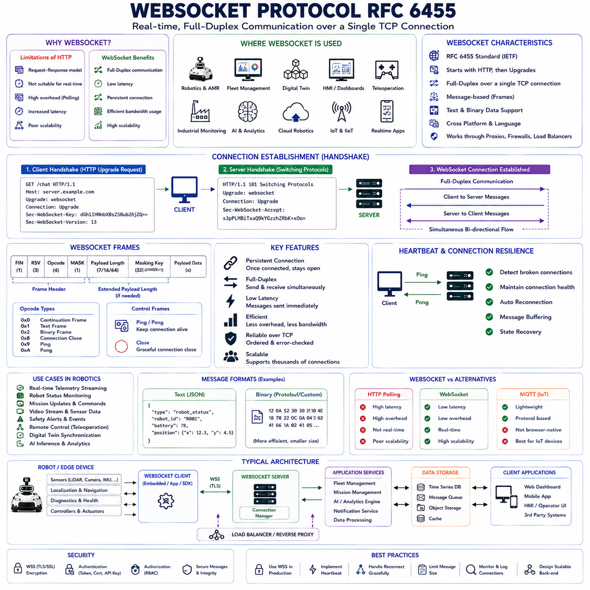
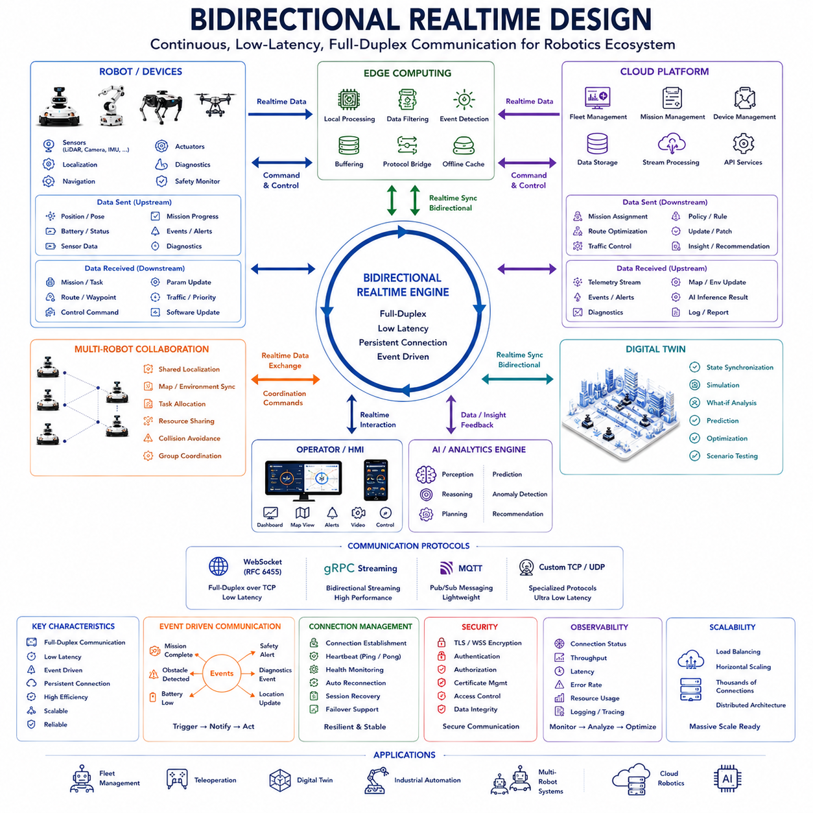
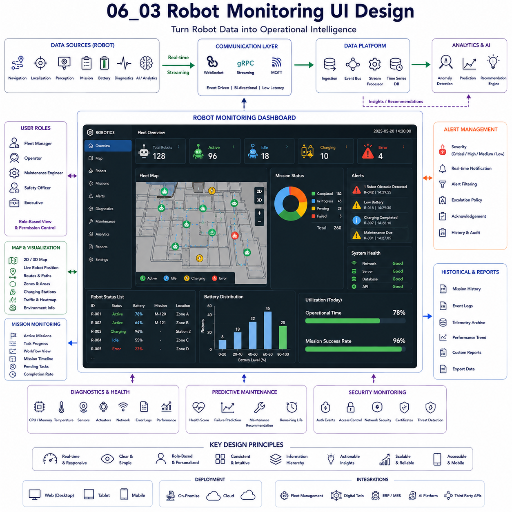
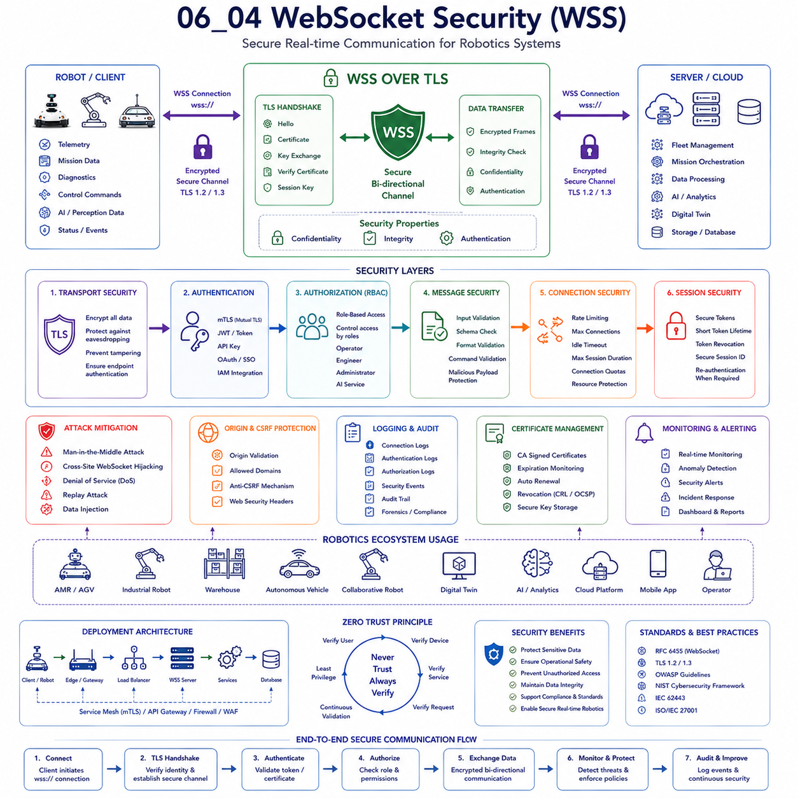
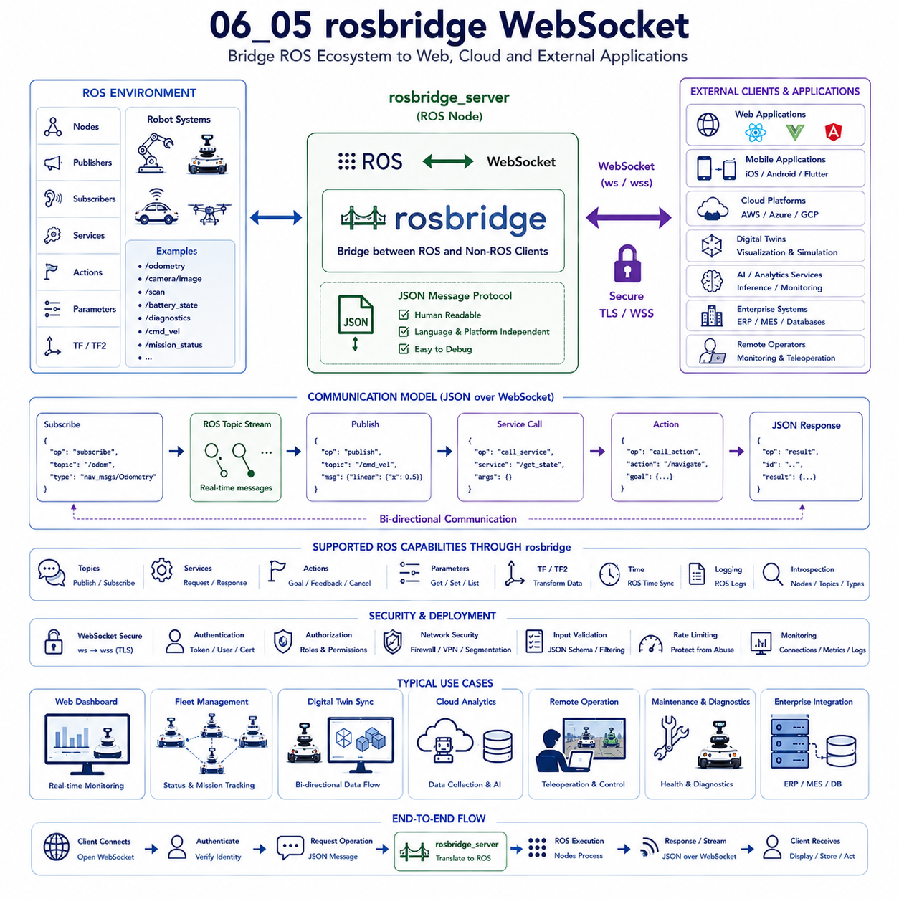

**Volume 09 Robotics Communication**

# Chapter 6. WebSocket

## 6.1 WebSocket Protocol RFC6455

{width="7.268055555555556in" height="7.268055555555556in"}

The WebSocket Protocol, formally standardized in RFC 6455 by the Internet Engineering Task Force, represents one of the most important communication technologies for modern real-time distributed systems. While traditional web communication was originally designed around a request-response model, the increasing demand for low-latency, bidirectional communication led to the development of WebSocket as a standardized protocol capable of supporting persistent, full-duplex communication over a single TCP connection. In robotics, autonomous systems, industrial automation, cloud robotics, fleet management platforms, digital twins, human-machine interfaces, and Physical AI ecosystems, WebSocket has become a critical technology for delivering real-time information between distributed components.

Historically, web applications relied primarily on HTTP communication. HTTP was designed as a stateless protocol where clients initiate requests and servers provide responses. Although this model works well for retrieving web pages and performing transactional operations, it is inefficient for applications requiring continuous real-time updates. Robotics systems frequently generate rapidly changing information including robot positions, sensor measurements, mission updates, safety events, telemetry streams, diagnostics information, video analytics results, and AI-generated insights. Continuously polling servers using traditional HTTP introduces significant overhead, increases latency, consumes network bandwidth, and reduces system scalability.

Prior to WebSocket, several techniques were developed to approximate real-time communication over HTTP. These approaches included short polling, long polling, server-sent events, hidden frame techniques, and proprietary communication methods. While functional, these solutions often suffered from inefficiency, increased server load, complex implementations, and inconsistent behavior across platforms. The need for a standardized bidirectional communication protocol ultimately resulted in the development of WebSocket.

RFC 6455 defines a protocol that begins as a conventional HTTP connection but upgrades itself into a persistent WebSocket connection through a standardized handshake process. Once the connection is established, both client and server can send messages independently at any time without requiring additional request-response cycles. This capability fundamentally changes the communication model from transactional interaction to continuous conversation.

The WebSocket handshake process is one of the protocol\'s defining features. A client initially sends an HTTP request containing specific upgrade headers indicating the desire to establish a WebSocket session. The server validates the request and responds with a corresponding acceptance message. Upon successful completion of the handshake, the underlying TCP connection transitions from HTTP communication into WebSocket communication. From this point onward, communication occurs through WebSocket frames rather than traditional HTTP messages.

This upgrade mechanism provides important compatibility advantages. Because the initial connection begins as standard HTTP traffic, WebSocket can traverse existing web infrastructure including proxies, firewalls, gateways, load balancers, and enterprise network environments. This compatibility significantly contributed to the widespread adoption of WebSocket across industries.

A defining characteristic of WebSocket is full-duplex communication. In half-duplex communication systems, data can travel in both directions but not simultaneously. In contrast, full-duplex communication allows both participants to transmit information independently and concurrently. This capability is particularly valuable in robotics environments where robots and management systems frequently exchange information continuously.

Consider a fleet management platform supervising hundreds of autonomous mobile robots. The robots continuously transmit localization data, battery status, mission progress, obstacle detections, safety alerts, and diagnostic information. Simultaneously, the fleet management platform sends mission assignments, route modifications, operational commands, software updates, and coordination instructions. WebSocket enables both communication streams to coexist efficiently over a single persistent connection.

WebSocket communication is frame-based rather than request-based. Information is encapsulated within frames that travel across the connection. Several frame types are defined within RFC 6455. Data frames carry application information. Control frames support connection management functions including ping, pong, and connection closure operations. This frame-oriented architecture provides flexibility while maintaining protocol efficiency.

Message framing plays an important role in WebSocket operation. Unlike raw TCP streams where message boundaries are not explicitly preserved, WebSocket introduces structured framing that allows applications to identify individual messages clearly. This feature simplifies implementation and improves interoperability between independent systems.

RFC 6455 supports both text and binary communication. Text frames commonly utilize UTF-8 encoded strings and are frequently used when interoperability and human readability are important. Binary frames support efficient transmission of structured data, images, sensor measurements, compressed information, and custom protocols. In robotics applications, binary communication is often preferred due to performance considerations and reduced bandwidth consumption.

Latency reduction is one of the primary reasons WebSocket is widely adopted within robotics systems. Traditional HTTP polling requires repeated connection management overhead and introduces delays between updates. WebSocket maintains a persistent connection, allowing messages to be exchanged immediately whenever events occur. This low-latency behavior is particularly valuable for monitoring systems, teleoperation interfaces, digital twins, and real-time analytics platforms.

Teleoperation systems provide an excellent example of WebSocket\'s benefits. Remote operators must receive live robot status information while simultaneously transmitting control commands. Delays introduced by polling architectures can negatively impact operator performance and safety. Persistent WebSocket connections enable responsive interaction by minimizing communication latency.

Digital twin platforms similarly benefit from WebSocket communication. Digital twins continuously synchronize virtual representations with physical robotic systems. Position updates, environmental changes, mission status transitions, diagnostics information, and operational metrics must be reflected in near real-time. WebSocket provides an efficient communication mechanism supporting this continuous synchronization process.

Human-machine interfaces frequently rely upon WebSocket as well. Modern robotic dashboards display live telemetry, interactive maps, video analytics results, mission progress indicators, battery levels, safety notifications, and fleet status information. WebSocket enables these interfaces to receive updates immediately without repeatedly querying backend services.

Industrial monitoring systems often utilize WebSocket to provide real-time operational visibility. Manufacturing robots, inspection systems, warehouse automation platforms, and logistics operations generate large volumes of status information. Operators require immediate awareness of abnormal conditions, safety incidents, equipment failures, and operational disruptions. WebSocket facilitates rapid event distribution throughout monitoring infrastructures.

Scalability considerations become increasingly important as robotic deployments grow. A small robotic system may involve only a few connected devices, while large-scale deployments may involve thousands of robots communicating simultaneously. WebSocket significantly reduces overhead compared to repeated HTTP polling because connections remain established over extended periods. This reduction in connection management overhead improves resource utilization and supports larger deployments.

Despite its advantages, WebSocket introduces architectural considerations that differ from traditional HTTP systems. Persistent connections consume server resources continuously. Connection lifecycle management becomes important. Systems must monitor active sessions, detect stale connections, recover from network interruptions, and manage resource allocation effectively.

Heartbeat mechanisms play a crucial role in maintaining WebSocket reliability. Network failures, wireless disruptions, device restarts, and infrastructure issues can silently terminate communication pathways. RFC 6455 defines Ping and Pong control frames that allow participants to verify connection health. Regular heartbeat exchanges help detect failures promptly and support automatic reconnection strategies.

Connection resilience is especially important in robotics environments where wireless communication conditions may fluctuate. Autonomous robots frequently operate across large facilities, warehouses, industrial sites, ports, airports, campuses, mines, and outdoor environments. Temporary communication disruptions are often unavoidable. Robust WebSocket implementations incorporate reconnection logic, message buffering, session recovery, and state synchronization mechanisms to maintain operational continuity.

Security considerations are fundamental to WebSocket deployments. Because WebSocket connections often remain active for extended periods, unauthorized access could expose sensitive operational information or permit malicious command injection. Authentication and authorization mechanisms must therefore be integrated into connection establishment and message processing workflows.

WebSocket Secure, commonly represented as WSS, provides encrypted communication using Transport Layer Security. WSS protects data confidentiality, ensures message integrity, and reduces the risk of interception attacks. Most production-grade robotics systems employ WSS rather than unencrypted WebSocket connections.

Authentication may be performed during connection establishment through tokens, certificates, API keys, OAuth mechanisms, or custom identity frameworks. Once authenticated, clients receive authorization permissions governing accessible resources and permissible actions. These controls help protect robotic infrastructure from unauthorized manipulation.

Message design is another important aspect of WebSocket-based systems. Applications must define structured message formats capable of supporting future evolution and interoperability. JSON remains popular because of its readability and broad compatibility. However, high-performance robotics applications frequently employ Protocol Buffers, MessagePack, CBOR, or custom binary encodings to reduce bandwidth consumption and improve efficiency.

WebSocket does not define application-level message semantics. The protocol provides a communication channel while leaving application designers responsible for defining message structures, command formats, event schemas, status representations, and operational workflows. This flexibility allows WebSocket to support a wide variety of use cases across different robotics domains.

Load balancing introduces unique challenges for WebSocket architectures. Traditional HTTP load balancing distributes individual requests independently. WebSocket connections persist for extended durations, meaning all communication associated with a connection remains tied to the selected backend server. Infrastructure must therefore support connection-aware load balancing strategies and session persistence mechanisms.

Cloud-native robotics platforms increasingly integrate WebSocket alongside other communication technologies. REST APIs often handle configuration management, administrative operations, and transactional requests. WebSocket supports real-time monitoring and event distribution. gRPC provides efficient service-to-service communication. MQTT facilitates IoT messaging. Together, these technologies form complementary communication layers within modern robotic ecosystems.

Artificial Intelligence systems also benefit from WebSocket integration. AI inference engines may generate continuous streams of perception results, anomaly detections, semantic interpretations, predictive maintenance insights, and operational recommendations. WebSocket allows these outputs to be delivered immediately to visualization systems, operators, digital twins, and fleet management platforms.

In Physical AI environments, where intelligent agents continuously interact with physical systems and digital infrastructure, real-time communication becomes increasingly important. Robots must exchange information with cloud reasoning engines, simulation environments, digital twins, operational dashboards, and collaborative agents. WebSocket provides a practical mechanism for supporting these interactions while maintaining responsiveness and scalability.

Compared to HTTP polling, WebSocket offers lower latency, reduced bandwidth consumption, improved scalability, and more natural support for bidirectional communication. Compared to MQTT, WebSocket often provides simpler integration with browser-based applications and web technologies. Compared to gRPC streaming, WebSocket offers broader compatibility with front-end environments while maintaining strong real-time capabilities. Consequently, WebSocket occupies a unique position within modern communication architectures.

As robotics systems continue evolving toward larger fleets, greater autonomy, deeper cloud integration, and increasingly sophisticated Physical AI capabilities, the importance of real-time communication infrastructure will continue to grow. WebSocket RFC 6455 remains one of the foundational technologies enabling this transformation by providing a standardized, efficient, and interoperable mechanism for persistent bidirectional communication.

Ultimately, WebSocket Protocol RFC 6455 is far more than a web communication standard. It is a fundamental enabling technology for modern robotics, cloud-native automation, digital twins, fleet management platforms, industrial monitoring systems, teleoperation environments, and Physical AI ecosystems. Through persistent full-duplex communication, low-latency message exchange, platform interoperability, and scalable real-time connectivity, WebSocket provides the communication foundation necessary to support the next generation of intelligent robotic systems.

# 06_01 WebSocket Protocol RFC6455

## 6.2 Bidirectional Realtime Design

{width="7.268055555555556in" height="7.268055555555556in"}

Bidirectional Realtime Design represents one of the most important architectural concepts in modern distributed robotics systems. As robots evolve from isolated machines into intelligent cyber-physical platforms, communication requirements have shifted dramatically. Traditional communication models based on request-response interactions are no longer sufficient for applications that require continuous synchronization, low-latency decision making, collaborative autonomy, cloud integration, digital twins, and Physical AI. Modern robotic systems increasingly depend upon communication architectures capable of supporting simultaneous information exchange between multiple participants in real time. Bidirectional Realtime Design provides the framework through which these interactions can be implemented efficiently, reliably, and at scale.

At its core, bidirectional realtime communication refers to the ability of two or more systems to exchange information continuously and simultaneously without requiring one side to wait for the other. Unlike conventional request-response architectures, where communication is initiated by a client and completed by a server response, bidirectional communication allows both participants to act as information producers and consumers at the same time. This communication paradigm closely resembles a conversation rather than a transaction. Information flows dynamically in both directions as conditions change, events occur, and decisions are made.

The importance of bidirectional communication becomes apparent when examining modern robotic operations. A mobile robot navigating through a warehouse continuously reports its position, velocity, battery status, obstacle detections, and mission progress. At the same time, the fleet management system transmits new assignments, route modifications, traffic control instructions, operational priorities, and software updates. Neither side can afford to wait for periodic polling cycles because operational decisions depend on immediate awareness of changing conditions. Bidirectional realtime communication enables this continuous exchange while minimizing latency and maximizing responsiveness.

Historically, many distributed systems relied on polling architectures. A client periodically requested information from a server, and the server responded with the latest available data. While relatively simple to implement, polling introduces unavoidable inefficiencies. Requests are transmitted regardless of whether new information exists. Important updates may be delayed until the next polling interval. Network resources are consumed unnecessarily. Server workloads increase due to repetitive request processing. As robotic systems become more dynamic and information-rich, polling architectures increasingly struggle to meet operational requirements.

Bidirectional realtime communication addresses these limitations by maintaining persistent communication channels through which updates can be transmitted immediately whenever relevant events occur. Instead of repeatedly asking whether something has changed, systems proactively share information as soon as it becomes available. This event-driven communication model reduces latency, improves efficiency, and supports more intelligent decision making.

Several communication technologies support bidirectional realtime architectures. WebSocket, standardized through RFC 6455, provides full-duplex communication over persistent TCP connections. gRPC Bidirectional Streaming enables simultaneous message exchange within service-oriented architectures. MQTT supports publish-subscribe communication patterns that facilitate near real-time information distribution. Custom TCP-based protocols may also be employed in specialized environments. Although implementation details differ, all of these technologies share the common objective of enabling continuous bidirectional information flow.

In robotics environments, bidirectional communication often forms the backbone of operational coordination. Fleet management systems represent a common example. Robots continuously transmit telemetry information including location updates, battery conditions, health metrics, environmental observations, and task progress indicators. Fleet coordinators analyze this information and respond with mission assignments, navigation directives, scheduling updates, traffic management instructions, and optimization recommendations. Both communication streams operate simultaneously, creating a continuously synchronized operational environment.

Digital twin architectures similarly depend upon bidirectional realtime communication. A digital twin maintains a virtual representation of a physical robot or robotic fleet. To remain accurate, the digital twin must continuously receive operational updates from physical systems. Simultaneously, simulations, predictions, optimization results, and planning recommendations generated within the digital twin environment may be transmitted back to physical robots. Bidirectional communication enables this continuous synchronization between physical and virtual domains.

Artificial Intelligence systems increasingly rely on realtime bidirectional communication as well. Modern AI frameworks often operate as distributed ecosystems involving perception engines, reasoning systems, planning modules, cloud-based foundation models, edge inference engines, and robotic controllers. Information continuously flows between these components. Perception systems generate environmental understanding. Planning systems evaluate alternatives. AI models produce recommendations. Robots execute actions and provide feedback. Bidirectional communication supports this iterative decision-making cycle.

Teleoperation provides one of the clearest examples of bidirectional realtime interaction. Human operators send motion commands, speed adjustments, camera control instructions, and operational directives to robotic platforms. Simultaneously, robots stream video feeds, telemetry data, diagnostics information, environmental observations, and safety alerts back to operators. Effective teleoperation depends upon low-latency communication in both directions. Delays or interruptions can degrade operator performance and potentially compromise safety.

Multi-robot collaboration further highlights the importance of bidirectional design. Cooperative robotic systems frequently exchange localization information, obstacle detections, shared map updates, task assignments, resource availability data, and synchronization messages. Each robot both consumes and produces information continuously. Effective collaboration depends upon maintaining shared situational awareness across all participating agents. Bidirectional communication enables this collective intelligence.

A fundamental design consideration within bidirectional architectures is connection persistence. Persistent communication channels eliminate the overhead associated with repeatedly establishing and terminating connections. Once a connection has been established, information can flow continuously with minimal latency. Persistent channels also support efficient resource utilization and improved scalability.

Connection management therefore becomes a critical architectural responsibility. Systems must establish connections reliably, monitor connection health, detect failures, recover from interruptions, and manage reconnection procedures. Wireless communication environments introduce additional complexity because signal quality, bandwidth availability, and network topology may change dynamically. Robust connection management strategies help maintain operational continuity despite these challenges.

Heartbeat mechanisms play a central role in maintaining connection reliability. Participants periodically exchange health verification messages confirming that communication pathways remain functional. If heartbeat responses are not received within expected timeframes, connection failures can be detected rapidly. Automated recovery procedures may then initiate reconnection attempts or failover operations.

Latency optimization is another important aspect of bidirectional realtime design. Robotics applications often operate under strict timing constraints. Obstacle avoidance systems, autonomous navigation controllers, teleoperation interfaces, collaborative robots, and industrial automation systems all depend upon timely information exchange. Communication architectures must therefore minimize transmission delays, serialization overhead, routing inefficiencies, and processing bottlenecks.

Message design significantly influences communication performance. Messages should contain sufficient information to support operational requirements while avoiding unnecessary complexity. Compact message structures reduce bandwidth consumption and improve processing efficiency. Strongly typed schemas, such as those provided by Protocol Buffers, improve interoperability and reduce parsing overhead. Efficient message design becomes increasingly important as communication frequency increases.

Event-driven architectures are closely associated with bidirectional realtime communication. Rather than periodically requesting updates, participants subscribe to relevant events and receive notifications whenever state changes occur. Event-driven communication reduces unnecessary traffic and improves responsiveness. In robotic systems, events may include mission completion, obstacle detection, battery warnings, safety incidents, localization updates, maintenance alerts, or AI inference results.

Scalability presents unique challenges within bidirectional communication environments. Small deployments involving a handful of robots are relatively straightforward to manage. Large-scale systems may involve thousands of robots, operators, services, and digital twin instances communicating simultaneously. Communication infrastructure must therefore support high connection counts, efficient message routing, load balancing, and distributed processing architectures.

Load balancing strategies must account for persistent connections. Traditional request-based balancing techniques are often insufficient because communication sessions may remain active for extended periods. Connection-aware balancing algorithms distribute workloads while preserving communication continuity. Service meshes and cloud-native networking platforms increasingly provide specialized support for these requirements.

Security considerations are fundamental to bidirectional communication architectures. Persistent communication channels create opportunities for unauthorized access, information disclosure, command injection, and denial-of-service attacks. Security mechanisms must therefore protect communication throughout the entire connection lifecycle.

Encryption ensures confidentiality and integrity of transmitted information. Authentication mechanisms verify participant identities. Authorization frameworks control access to resources and operations. Certificate management systems establish trust relationships between communicating entities. Continuous monitoring helps detect anomalous behavior and potential security incidents.

Observability is essential for maintaining operational reliability. Communication systems should provide visibility into connection status, message throughput, latency distributions, error rates, resource utilization, and service health metrics. Comprehensive monitoring supports troubleshooting, performance optimization, capacity planning, and incident response.

Cloud robotics environments increasingly utilize bidirectional communication to integrate robots with cloud-hosted services. Fleet management platforms, AI inference systems, analytics engines, digital twins, maintenance services, and enterprise applications exchange information continuously with robotic devices. Bidirectional architectures enable these distributed systems to function as cohesive operational ecosystems.

Edge computing further expands the importance of realtime communication. Computational workloads are increasingly distributed across onboard processors, local edge servers, and cloud infrastructure. Information must flow efficiently among these layers to support autonomous decision making. Bidirectional communication facilitates workload distribution, resource coordination, and adaptive processing strategies.

The emergence of Physical AI introduces even greater communication demands. Physical AI systems continuously integrate perception, reasoning, planning, simulation, and action within dynamic environments. These processes require ongoing information exchange among sensors, AI models, digital twins, cloud platforms, robotic actuators, and human operators. Bidirectional realtime architectures provide the communication foundation necessary to support these interactions.

Future robotic ecosystems will likely become increasingly interconnected. Autonomous mobile robots, outdoor vehicles, industrial manipulators, humanoids, quadrupeds, drones, AI services, cloud platforms, digital twins, and enterprise systems will collaborate within unified operational environments. Information will flow continuously among these participants, enabling adaptive behavior, collective intelligence, and coordinated decision making. Bidirectional realtime communication will serve as the foundation supporting this integration.

Ultimately, Bidirectional Realtime Design is not merely a communication technique but a fundamental architectural philosophy for modern distributed robotics. By enabling continuous, simultaneous, low-latency information exchange between interconnected systems, bidirectional architectures improve responsiveness, enhance situational awareness, support collaborative autonomy, and enable intelligent decision making. Whether implemented through WebSocket, gRPC Streaming, MQTT, service meshes, or future communication technologies, Bidirectional Realtime Design forms the communication backbone of next-generation robotics, cloud robotics, digital twin infrastructures, and Physical AI ecosystems. As robotic systems continue evolving toward greater autonomy and connectivity, mastery of bidirectional real-time communication principles will remain essential for building scalable, resilient, and intelligent robotic platforms.

# 06_02 Bidirectional Realtime Design

## 6.3 Robot Monitoring UI Design

{width="7.268055555555556in" height="7.268055555555556in"}

Robot Monitoring UI Design is a fundamental discipline within modern robotics software architecture. As robotic systems evolve from standalone machines into large-scale connected ecosystems, operators require effective methods for observing, understanding, and controlling robotic operations. A monitoring user interface serves as the primary interaction layer between humans and robotic systems, transforming complex streams of technical data into actionable operational intelligence. In autonomous mobile robots, warehouse automation systems, industrial robots, outdoor autonomous vehicles, collaborative robots, digital twins, cloud robotics platforms, and Physical AI ecosystems, monitoring interfaces have become essential components that support situational awareness, decision making, safety management, fleet coordination, maintenance operations, and business optimization.

A Robot Monitoring UI is far more than a collection of charts and status indicators. It represents the visual manifestation of the entire robotic architecture. Every subsystem within a robot generates information that may eventually appear within the monitoring interface. Navigation systems provide location data. Localization systems provide pose estimates. Perception systems provide obstacle information. Mission systems provide task status. Battery management systems provide energy metrics. Diagnostic modules provide health information. Artificial intelligence systems provide predictions and recommendations. The monitoring UI acts as the integration point where these diverse data sources are unified into a coherent operational picture.

The primary objective of a monitoring interface is situational awareness. Operators must understand the current state of robotic operations quickly and accurately. This understanding includes the location of robots, their assigned tasks, current operational status, environmental conditions, system health, safety states, and overall fleet performance. Effective UI design minimizes cognitive load while maximizing information accessibility. Users should not need to search extensively for critical information. Instead, important operational insights should be immediately visible and intuitively organized.

Situational awareness becomes increasingly important as robotic deployments scale. Monitoring a single robot may be relatively straightforward. Monitoring hundreds or thousands of robots operating simultaneously across multiple facilities introduces significantly greater complexity. The user interface must therefore support multiple levels of abstraction. Operators require both high-level fleet visibility and detailed robot-specific information. Successful monitoring platforms provide seamless transitions between these perspectives.

A common architectural approach involves hierarchical information organization. At the highest level, the interface presents fleet-wide operational summaries. Key performance indicators, robot availability, mission completion rates, battery distributions, safety alerts, and utilization statistics provide a comprehensive overview of system status. Users can then drill down into specific facilities, zones, robot groups, or individual robots to access increasingly detailed information.

Dashboard design plays a central role within monitoring systems. Dashboards provide consolidated views of operational information tailored to specific user roles. Fleet managers focus on utilization, productivity, mission throughput, and resource allocation. Maintenance engineers prioritize diagnostics, fault conditions, sensor health, and component status. Safety officers monitor alarms, emergency events, hazard detections, and compliance indicators. Executives often require business-level metrics related to efficiency, return on investment, and operational performance.

Role-based interface design significantly improves usability. Different stakeholders require different information. Presenting every available metric to every user often creates unnecessary complexity. Effective monitoring systems adapt displayed information according to user responsibilities, permissions, and operational objectives. This personalization improves productivity while reducing cognitive overload.

Real-time data visualization is one of the defining characteristics of robot monitoring interfaces. Robotic systems continuously generate telemetry information including positions, velocities, battery levels, sensor measurements, network status, environmental observations, mission progress indicators, and AI outputs. Monitoring interfaces must display this information dynamically while maintaining clarity and responsiveness.

WebSocket and bidirectional realtime communication technologies are commonly employed to support continuous interface updates. Rather than relying on periodic polling, monitoring platforms receive information immediately as events occur. This event-driven architecture reduces latency, improves responsiveness, and provides operators with accurate real-time visibility.

Map-based visualization represents one of the most important components within robotic monitoring systems. Most mobile robots operate within spatial environments where location awareness is essential. Interactive maps allow users to observe robot positions, navigation routes, operational zones, charging stations, restricted areas, traffic patterns, and environmental conditions. Modern interfaces often support both two-dimensional and three-dimensional visualization modes.

Two-dimensional maps provide efficient operational overviews and are commonly used for warehouse management, factory automation, logistics facilities, and indoor navigation systems. Three-dimensional environments offer enhanced spatial understanding and are frequently integrated with digital twin platforms. These visualizations enable operators to explore facilities, investigate incidents, analyze robot behavior, and evaluate environmental conditions from multiple perspectives.

Robot status visualization is another critical design element. Operators must rapidly identify the operational state of each robot. Common status categories include idle, navigating, executing missions, charging, paused, maintenance mode, fault condition, emergency stop, disconnected, and software update states. Visual consistency is essential. Standardized colors, icons, and symbols help users interpret information quickly and reduce the likelihood of operational errors.

Battery monitoring is particularly important in autonomous systems. Energy availability directly influences operational continuity and mission success. Monitoring interfaces typically display battery percentages, estimated runtime, charging status, charging schedules, energy consumption trends, and fleet-wide battery distributions. Predictive analytics may further estimate future charging requirements and recommend operational adjustments.

Mission monitoring capabilities provide visibility into task execution processes. Operators require information regarding active missions, completed tasks, pending assignments, execution durations, resource utilization, and mission outcomes. Visual workflows, progress indicators, timelines, and task hierarchies help users understand operational progress and identify potential bottlenecks.

Diagnostic monitoring plays a central role in maintaining robotic reliability. Modern robots contain numerous sensors, actuators, processors, communication devices, safety systems, and software components. Monitoring interfaces aggregate diagnostic information from these sources and present health assessments in understandable formats. Diagnostic dashboards often include system temperatures, CPU utilization, memory consumption, storage capacity, sensor status, communication quality, error logs, and performance metrics.

Predictive maintenance capabilities increasingly enhance monitoring systems. Rather than merely reporting current conditions, advanced interfaces utilize machine learning algorithms to identify emerging issues before failures occur. Vibration patterns, motor performance trends, battery degradation indicators, communication anomalies, and sensor drift characteristics may all contribute to predictive maintenance models. Monitoring interfaces present these insights through maintenance recommendations, health scores, and risk assessments.

Alert management represents another essential aspect of monitoring UI design. Robotic systems generate numerous events ranging from routine notifications to critical safety incidents. Effective interfaces categorize alerts according to severity, urgency, and operational impact. Critical alarms require immediate visibility, while informational notifications may be presented less prominently. Alert prioritization helps operators focus attention on the most important events.

Human factors engineering significantly influences monitoring interface effectiveness. Operators frequently manage complex environments under time pressure. Interface design must therefore support rapid comprehension and efficient decision making. Information hierarchy, visual consistency, typography, color usage, interaction patterns, and screen layouts all influence usability. Excessive visual clutter can reduce effectiveness, while overly simplistic interfaces may conceal important information.

Color selection deserves careful consideration. Colors should convey meaning consistently throughout the interface. Green commonly indicates normal operation. Yellow suggests warnings or attention requirements. Red signifies critical conditions requiring intervention. Blue often represents informational states. Accessibility considerations are equally important. Interfaces should remain usable for individuals with color vision deficiencies and other accessibility requirements.

Data density presents a recurring design challenge. Robotic systems generate vast quantities of information. Displaying every available metric simultaneously overwhelms users and reduces effectiveness. Successful interfaces balance information richness with visual simplicity. Progressive disclosure techniques reveal additional details as needed while preserving clarity at higher levels of abstraction.

Historical analysis capabilities extend the value of monitoring systems beyond real-time observation. Operators frequently investigate incidents, analyze trends, evaluate performance, and identify optimization opportunities. Historical dashboards provide access to mission histories, telemetry archives, event logs, diagnostic records, maintenance activities, and operational statistics. Time-series visualization tools support detailed analysis of system behavior over extended periods.

Artificial intelligence increasingly influences monitoring interface design. AI-powered analytics can identify patterns, detect anomalies, generate recommendations, predict failures, optimize resource allocation, and assist operational decision making. Rather than merely displaying raw information, intelligent monitoring systems transform data into actionable insights. Recommendation engines may suggest maintenance actions, operational adjustments, fleet rebalancing strategies, or safety interventions.

Digital twin integration further enhances monitoring capabilities. Digital twins provide virtual representations of robotic systems and operational environments. Monitoring interfaces can leverage these virtual models to visualize system behavior, evaluate hypothetical scenarios, simulate future operations, and assess the impact of proposed changes. The combination of real-time monitoring and digital twin technology creates powerful decision-support capabilities.

Multi-site monitoring introduces additional architectural considerations. Large organizations often operate robotic fleets across multiple facilities, warehouses, factories, campuses, or geographic regions. Monitoring platforms must support centralized visibility while preserving site-specific operational context. Geographic dashboards, hierarchical navigation structures, and aggregated performance views facilitate effective multi-site management.

Security monitoring has become increasingly important as robotics systems become more connected. Monitoring interfaces frequently display cybersecurity information including authentication events, access control violations, network anomalies, communication integrity status, certificate validity, and intrusion detection alerts. Security visibility helps organizations protect robotic infrastructure from cyber threats.

Mobile accessibility represents another important trend. Operators increasingly require access to monitoring capabilities from smartphones, tablets, and portable devices. Responsive design principles ensure consistent usability across different screen sizes and interaction methods. Mobile interfaces often prioritize critical alerts, status summaries, and rapid intervention capabilities.

Scalability is a fundamental design requirement. A monitoring system that functions effectively for ten robots may become unusable when managing thousands. Interface architectures must support increasing data volumes, expanding user populations, growing facility counts, and evolving operational requirements. Cloud-native technologies, microservices architectures, distributed databases, and event-driven infrastructures often provide the foundation necessary for scalable monitoring platforms.

Performance optimization remains critical throughout interface design. Real-time monitoring environments demand responsive user experiences even under heavy workloads. Efficient data processing, intelligent caching, optimized rendering, asynchronous communication, and scalable backend architectures contribute to maintaining interface responsiveness.

As robotics continues evolving toward increasingly autonomous and interconnected ecosystems, monitoring interfaces will become even more important. Future Physical AI environments may involve autonomous mobile robots, humanoids, collaborative manipulators, drones, digital twins, AI reasoning systems, cloud platforms, and human operators interacting continuously. Monitoring interfaces will serve as the operational command centers through which these complex ecosystems are observed, managed, optimized, and controlled.

Ultimately, Robot Monitoring UI Design is not simply a matter of visualization. It is the discipline of transforming complex robotic operations into understandable, actionable human experiences. Through effective information architecture, realtime visualization, intelligent analytics, digital twin integration, predictive maintenance capabilities, and human-centered design principles, monitoring interfaces enable operators to manage increasingly sophisticated robotic systems with confidence and efficiency. As robotic deployments continue expanding across industries, well-designed monitoring interfaces will remain essential for ensuring safety, reliability, productivity, and operational excellence.

# 06_03 Robot Monitoring UI Design

## 6.4 WebSocket Security WSS

{width="7.268055555555556in" height="7.268055555555556in"}

WebSocket Security WSS represents one of the most critical components of modern real-time communication architectures. As robotics systems become increasingly connected to cloud platforms, edge computing infrastructures, digital twins, artificial intelligence services, fleet management systems, and enterprise applications, protecting communication channels becomes essential. Modern autonomous mobile robots, industrial automation platforms, warehouse management systems, outdoor autonomous vehicles, collaborative robots, humanoid robots, cloud robotics environments, and Physical AI ecosystems continuously exchange sensitive operational data across distributed networks. Without robust security mechanisms, these communication channels become vulnerable to interception, manipulation, unauthorized access, and cyberattacks. WebSocket Secure, commonly known as WSS, provides the security foundation necessary to protect bidirectional real-time communication in these environments.

The original WebSocket protocol defined in RFC 6455 provides efficient bidirectional communication over persistent TCP connections. However, the standard WebSocket protocol identified by the "ws://" scheme does not inherently encrypt transmitted information. Data exchanged between clients and servers can potentially be intercepted, inspected, modified, or replayed by malicious actors if communication occurs across untrusted networks. To address these vulnerabilities, WebSocket Secure extends the WebSocket protocol by incorporating Transport Layer Security (TLS), resulting in the secure "wss://" communication scheme.

At a conceptual level, WSS serves a role similar to HTTPS in traditional web communication. Just as HTTPS encrypts HTTP traffic, WSS encrypts WebSocket traffic. All messages transmitted through the WebSocket channel become protected against eavesdropping, tampering, and many forms of network-based attacks. This protection is particularly important for robotics systems because operational commands, telemetry data, mission information, diagnostics records, authentication credentials, and AI-generated decisions often represent highly sensitive information.

The importance of WebSocket security becomes apparent when considering the operational environments in which modern robots function. Industrial robots operate inside manufacturing facilities where production data may be confidential. Autonomous mobile robots navigate warehouses containing valuable inventory information. Outdoor autonomous vehicles may exchange location data and mission instructions across public wireless networks. Healthcare robots process sensitive patient information. Security vulnerabilities within these environments can lead not only to data breaches but also to operational disruptions, safety incidents, and financial losses.

Transport Layer Security forms the foundation of WSS security. TLS provides three primary security guarantees: confidentiality, integrity, and authentication. Confidentiality ensures that transmitted information remains unreadable to unauthorized observers. Integrity ensures that messages cannot be modified without detection. Authentication verifies the identity of communication participants. Together, these protections create a trusted communication channel capable of supporting mission-critical robotic operations.

The WSS connection process begins with a TLS handshake. Before WebSocket communication can occur, the client and server negotiate security parameters, exchange cryptographic information, verify certificates, and establish encryption keys. Once the handshake completes successfully, all subsequent WebSocket frames are encrypted automatically. Applications continue to exchange messages using standard WebSocket APIs, while TLS transparently protects the underlying communication channel.

Certificate-based authentication plays a central role within WSS architectures. Servers present digital certificates that verify their identity. These certificates are issued by trusted Certificate Authorities and contain cryptographic signatures that clients can validate. By verifying server certificates, clients gain confidence that they are communicating with legitimate systems rather than malicious impostors. This protection significantly reduces the risk of man-in-the-middle attacks.

Man-in-the-middle attacks represent one of the most serious threats against unprotected communication channels. In such attacks, an adversary intercepts communication between two legitimate parties and potentially observes, modifies, or injects messages. Within robotics environments, successful interception could allow attackers to manipulate robot behavior, alter telemetry data, inject malicious commands, or disrupt operational workflows. TLS encryption and certificate validation help prevent these attacks by ensuring communication occurs only between trusted endpoints.

Mutual TLS extends this security model further by requiring both client and server authentication. In traditional TLS deployments, only the server presents a certificate. Mutual TLS requires clients to provide certificates as well. Both parties therefore verify each other\'s identities before communication proceeds. This approach is increasingly common within industrial robotics systems, cloud robotics platforms, and enterprise automation environments where strong identity verification is essential.

Authentication mechanisms extend beyond certificate validation. Most WebSocket applications incorporate additional authentication layers to control access to services and resources. Authentication may occur during the connection establishment process or immediately after the WebSocket session becomes active. Common approaches include token-based authentication, API keys, OAuth integrations, JSON Web Tokens, single sign-on systems, and enterprise identity management platforms.

JSON Web Tokens are particularly popular within cloud-native robotics architectures. Clients authenticate through identity providers and receive signed tokens containing identity information and authorization claims. These tokens accompany WebSocket connection requests and allow servers to validate user identities without maintaining extensive session state. This approach improves scalability while supporting distributed deployments.

Authorization controls determine which actions authenticated users may perform. Authentication establishes identity, while authorization governs permissions. Different participants within robotic ecosystems require different levels of access. Operators may monitor robot status and initiate missions. Maintenance engineers may access diagnostics information and maintenance functions. Administrators may manage system configurations. AI services may consume telemetry streams while lacking permission to modify operational settings. Authorization frameworks enforce these distinctions and reduce the risk of unauthorized actions.

Role-based access control represents a common authorization strategy. Permissions are assigned to roles rather than individual users. Users inherit permissions according to assigned roles. This approach simplifies administration and supports consistent policy enforcement across large deployments. Robotics organizations frequently define roles for operators, supervisors, engineers, administrators, integrators, developers, and external service providers.

Message validation constitutes another important security consideration. Encryption protects information during transmission, but applications must also verify that received messages conform to expected formats and operational constraints. Malformed or malicious messages can exploit software vulnerabilities, consume excessive resources, or trigger unintended behavior. Input validation mechanisms help mitigate these risks by ensuring only well-formed messages enter processing pipelines.

Rate limiting provides protection against denial-of-service attacks and resource exhaustion. Because WebSocket connections remain persistent, malicious clients may attempt to overwhelm servers through excessive message generation or connection creation. Rate limiting mechanisms restrict request frequencies, message volumes, and connection counts. These controls help preserve service availability and protect critical infrastructure from abuse.

Connection management policies further enhance security. Idle connection timeouts prevent abandoned sessions from consuming resources indefinitely. Maximum session durations limit exposure associated with long-lived connections. Connection quotas restrict simultaneous sessions originating from individual users, devices, or network locations. These measures improve resource utilization while reducing attack surfaces.

Origin validation is particularly important for browser-based WebSocket applications. Browsers include origin information indicating the website from which connection requests originate. Servers can validate origins and reject unauthorized connection attempts. This protection helps mitigate cross-site WebSocket hijacking attacks where malicious websites attempt to exploit authenticated user sessions.

Cross-site WebSocket hijacking shares similarities with cross-site request forgery attacks. If proper protections are absent, attackers may induce browsers to establish WebSocket connections using credentials associated with legitimate users. Origin validation, authentication controls, anti-forgery mechanisms, and secure session management collectively reduce these risks.

Session security requires careful attention throughout the connection lifecycle. Authentication credentials should never be transmitted through insecure channels. Sensitive tokens should possess limited lifetimes and support revocation mechanisms. Session identifiers must be generated using cryptographically secure techniques. Reauthentication procedures may be required for particularly sensitive operations. These practices help maintain security even when communication sessions persist for extended periods.

Logging and auditability represent important operational security capabilities. Security-relevant events should be recorded systematically. Connection establishments, authentication attempts, authorization failures, certificate validation errors, configuration changes, administrative actions, and suspicious activities all contribute valuable forensic information. Audit logs support incident investigations, compliance requirements, and continuous security improvement efforts.

Encryption algorithm selection influences overall security posture. Modern TLS implementations support strong cryptographic algorithms designed to resist contemporary attacks. Organizations should disable obsolete protocols and weak cipher suites while adopting current best practices. Security configurations require periodic review as cryptographic recommendations evolve over time.

Certificate lifecycle management introduces additional operational responsibilities. Certificates possess expiration dates and require periodic renewal. Certificate revocation mechanisms must address compromised credentials. Automated certificate management systems increasingly simplify these processes while reducing operational risks associated with expired or misconfigured certificates.

Cloud-native robotics architectures often deploy WebSocket services across distributed infrastructures. Multiple service instances may operate behind load balancers, service meshes, API gateways, and ingress controllers. Security policies must remain consistent throughout these environments. Centralized certificate management, unified identity services, and standardized authentication mechanisms help maintain coherent security postures across distributed deployments.

Service meshes provide additional security benefits within microservice-oriented robotics platforms. Service meshes can automatically enforce mutual TLS, manage certificates, implement traffic policies, monitor communication patterns, and support zero-trust architectures. These capabilities simplify security implementation while improving consistency and observability.

Zero-trust security principles increasingly influence WebSocket deployments. Traditional security models often assumed that systems operating within trusted networks were inherently safe. Modern zero-trust approaches reject this assumption. Every connection, user, service, device, and request must be authenticated and authorized regardless of network location. This philosophy aligns well with contemporary robotics ecosystems involving cloud services, edge computing, remote operators, third-party integrations, and mobile robotic platforms.

Industrial cybersecurity standards increasingly recognize the importance of secure communication. Frameworks such as IEC industrial security standards, NIST cybersecurity guidance, and various critical infrastructure security frameworks emphasize encryption, authentication, access control, and continuous monitoring. WSS contributes directly to achieving many of these requirements.

Artificial intelligence systems introduce additional security considerations. AI inference services often exchange sensitive perception data, operational decisions, predictive maintenance insights, and autonomous planning recommendations. Protecting these communications helps preserve intellectual property, operational integrity, and decision reliability. Secure WebSocket channels support these objectives by ensuring trustworthy information exchange.

Digital twin systems similarly depend upon secure communication. Digital twins continuously synchronize with physical assets and often possess comprehensive visibility into operational environments. Unauthorized access could expose sensitive operational information or compromise simulation accuracy. WSS helps maintain confidentiality and integrity throughout synchronization processes.

As robotics continues evolving toward highly interconnected Physical AI ecosystems, communication security becomes increasingly important. Future robotic environments may involve thousands of autonomous agents, cloud-hosted reasoning engines, digital twins, edge computing infrastructures, collaborative robots, and human operators exchanging information continuously. Protecting these interactions requires robust, scalable, and adaptable security architectures.

Ultimately, WebSocket Security WSS represents far more than encrypted communication. It provides the trust foundation upon which modern real-time robotics systems depend. Through TLS encryption, certificate validation, authentication mechanisms, authorization controls, session protection, message validation, auditability, and zero-trust principles, WSS enables secure bidirectional communication across distributed robotic ecosystems. As robotic systems become increasingly autonomous, connected, and mission-critical, the role of WebSocket Security WSS will continue expanding as a foundational technology supporting safety, reliability, operational continuity, and cybersecurity resilience.

# 06_04 WebSocket Security WSS

## 6.5 rosbridge WebSocket

{width="7.268055555555556in" height="7.268055555555556in"}

As robotic systems continue to evolve toward cloud-native architectures, web-based monitoring platforms, digital twin environments, remote operations centers, and Physical AI ecosystems, the need for seamless communication between ROS-based robotic systems and non-ROS applications has become increasingly important. While the Robot Operating System provides a powerful communication framework for robotics development, many enterprise applications, web interfaces, mobile devices, cloud services, and analytics platforms are not designed to communicate directly using ROS communication protocols. The rosbridge WebSocket framework was developed to address this challenge by providing a standardized bridge between ROS environments and external systems using WebSocket technology.

rosbridge is an open-source middleware layer that enables non-ROS clients to communicate with ROS nodes through a WebSocket-based interface. Rather than requiring external applications to understand ROS message serialization, ROS transport protocols, or ROS middleware internals, rosbridge exposes ROS functionality through a simple JSON-based communication model over WebSocket connections. This capability significantly simplifies integration between robotic systems and modern software ecosystems.

The fundamental purpose of rosbridge is interoperability. ROS was originally designed for robotic software development and provides communication mechanisms such as Topics, Services, Actions, Parameters, and Transform trees. While these capabilities are highly effective within ROS environments, external systems often operate using web technologies, mobile frameworks, enterprise software platforms, cloud APIs, and artificial intelligence services that cannot directly interact with ROS communication channels. rosbridge acts as a translation layer that converts ROS communication into a format accessible to these external systems.

At a conceptual level, rosbridge functions as a gateway between two worlds. On one side exists the ROS ecosystem containing nodes, publishers, subscribers, services, actions, parameters, sensors, controllers, navigation systems, localization systems, perception modules, and robot management components. On the other side exist browsers, mobile applications, cloud platforms, digital twins, dashboards, enterprise applications, databases, AI services, and remote operators. rosbridge enables these two environments to exchange information without requiring direct knowledge of each other\'s internal communication mechanisms.

The architecture of rosbridge is intentionally simple. A ROS node known as rosbridge_server runs inside the ROS environment. This server exposes a WebSocket endpoint that external clients can access through standard networking technologies. Clients establish WebSocket connections and exchange JSON-formatted messages representing ROS operations. The rosbridge server translates these JSON requests into corresponding ROS interactions and returns results through the same communication channel.

One of the major advantages of rosbridge is that it allows web applications to communicate directly with robots. Modern monitoring systems, fleet management dashboards, maintenance interfaces, digital twin platforms, and operational control centers are increasingly implemented as browser-based applications. Browsers cannot directly participate in ROS communication networks. However, browsers can establish WebSocket connections. By using rosbridge, browser applications gain access to ROS topics, services, parameters, and robot status information through familiar web technologies.

This capability has significantly influenced the development of modern robotic user interfaces. Many contemporary fleet management systems utilize React, Angular, Vue.js, or similar frontend frameworks. These interfaces connect to rosbridge through WebSockets and receive real-time updates from robots operating within ROS environments. Robot locations, battery levels, mission progress, diagnostic information, sensor status, and operational alerts can all be visualized within web browsers without requiring specialized ROS software installations.

The communication model employed by rosbridge is based on JSON messages. JSON was selected because it is human-readable, widely supported, easy to debug, and compatible with virtually every programming language and web technology. A client may request subscription to a ROS topic by sending a JSON message describing the desired topic. The rosbridge server interprets the request and creates the corresponding ROS subscription. As messages arrive from ROS publishers, they are translated into JSON and transmitted back to the client through the WebSocket connection.

Publishing information follows a similar pattern. External applications generate JSON messages containing topic names and message contents. The rosbridge server converts these JSON structures into ROS messages and publishes them onto the ROS network. This bidirectional communication model enables external systems to both consume and generate robotic information.

Topic communication represents one of the most frequently used rosbridge capabilities. ROS topics support asynchronous publish-subscribe communication among distributed components. Through rosbridge, external applications can subscribe to robot telemetry streams, localization updates, perception outputs, diagnostic information, mission status messages, and sensor measurements. Simultaneously, external applications may publish commands, configuration changes, operational instructions, and mission requests back into the ROS ecosystem.

Service communication is also supported. ROS services implement synchronous request-response interactions. External clients can invoke ROS services through JSON requests transmitted over WebSocket connections. The rosbridge server executes the corresponding ROS service call and returns the response to the client. This capability allows web applications and enterprise systems to interact with robot functions that require transactional behavior.

Action interfaces introduce additional complexity. ROS actions support long-running operations that provide feedback and allow cancellation. Navigation missions, manipulation tasks, inspection procedures, and autonomous workflows frequently utilize action-based communication. rosbridge enables external applications to initiate actions, monitor progress, receive feedback updates, and cancel operations when necessary.

Parameter management is another important capability. ROS parameters provide configuration information used throughout robotic systems. Through rosbridge, external applications can retrieve parameter values, modify configurations, and manage operational settings. This functionality is particularly valuable for web-based administration tools and remote maintenance platforms.

Transform management represents a unique aspect of ROS communication. The TF and TF2 frameworks maintain coordinate transformations among sensors, actuators, robots, maps, and reference frames. Many visualization applications require access to these transformations in order to render accurate spatial representations. rosbridge enables external visualization systems to receive transformation information and maintain synchronized spatial awareness.

Real-time monitoring systems are among the most common use cases for rosbridge. A fleet management dashboard may subscribe to robot position updates, battery status messages, mission information, safety events, and diagnostic data. The resulting information is displayed within browser-based interfaces, allowing operators to monitor robotic operations without direct ROS access. Because WebSocket connections remain persistent, updates are delivered immediately as conditions change.

Digital twin environments similarly benefit from rosbridge integration. Digital twins require continuous synchronization with physical robots. Position updates, environmental observations, sensor measurements, mission states, and diagnostic information must flow from ROS systems into virtual models. Conversely, simulation outputs, optimization recommendations, and planning results may flow back into ROS environments. rosbridge facilitates these bidirectional exchanges.

Cloud robotics architectures increasingly leverage rosbridge as well. Cloud-hosted applications often operate independently of ROS infrastructure. Through rosbridge, cloud services gain access to robotic data streams while maintaining architectural separation. AI inference services, analytics platforms, predictive maintenance systems, and operational intelligence applications can consume robotic information without becoming tightly coupled to ROS internals.

Artificial intelligence integration provides another important application area. Modern robotics systems frequently utilize AI models for object detection, semantic understanding, anomaly detection, predictive maintenance, path optimization, and decision support. AI services operating outside ROS environments can receive robot-generated data through rosbridge, perform inference operations, and return results to ROS-based systems through the same communication channel.

Remote operation systems also rely heavily on rosbridge technology. Teleoperation interfaces implemented within browsers require access to robot status information and control channels. rosbridge enables operators to observe live telemetry, view camera information, monitor safety conditions, and issue operational commands through web-based interfaces. This capability significantly simplifies deployment because users require only standard browsers rather than specialized robotics software installations.

Security considerations become increasingly important as rosbridge deployments expand. By exposing ROS functionality through network-accessible interfaces, rosbridge introduces potential attack surfaces that must be managed carefully. Authentication, authorization, encryption, network segmentation, firewall policies, VPN infrastructure, and secure WebSocket connections should be incorporated into production deployments.

Most modern deployments utilize WebSocket Secure connections rather than unencrypted WebSocket communication. TLS encryption protects data confidentiality and integrity while reducing the risk of interception attacks. Authentication mechanisms verify user identities, and authorization controls restrict access to sensitive robotic functions.

Performance considerations also influence rosbridge design decisions. JSON serialization introduces overhead compared to native ROS message transport mechanisms. Large sensor streams such as high-resolution images, dense point clouds, and complex perception outputs may require optimization strategies. Compression, message filtering, throttling, aggregation, and selective subscriptions help manage bandwidth consumption and improve scalability.

For high-frequency robotic communication, engineers must carefully evaluate system requirements. Native ROS communication often provides superior performance for internal robotic processing. rosbridge is typically most valuable at integration boundaries where interoperability and accessibility are more important than absolute communication efficiency.

ROS 2 introduces additional architectural considerations. ROS 2 utilizes DDS-based communication rather than the transport mechanisms employed by ROS 1. Despite these differences, rosbridge remains highly relevant because the fundamental integration challenge persists. Web applications, cloud services, mobile devices, and enterprise platforms still require simplified access to robotic capabilities. ROS 2-compatible rosbridge implementations continue providing this functionality while adapting to evolving middleware architectures.

Scalability becomes increasingly important as robotic fleets grow. A small deployment may involve only a handful of clients. Large enterprise environments may support hundreds of concurrent browser sessions, digital twin instances, cloud services, and operational dashboards. Load balancing, connection management, distributed deployments, and resource optimization strategies help support these larger environments.

Observability is equally important. Administrators must monitor WebSocket connections, message throughput, latency characteristics, subscription counts, service invocation rates, resource utilization, and error conditions. Comprehensive monitoring improves reliability and supports operational troubleshooting.

As robotics evolves toward cloud-native infrastructures, digital twins, Physical AI ecosystems, and globally distributed autonomous systems, interoperability requirements will continue increasing. Robots must communicate not only with other robots but also with cloud services, enterprise systems, AI platforms, human operators, simulation environments, and business applications. rosbridge WebSocket provides a practical and widely adopted solution for enabling these interactions.

Ultimately, rosbridge WebSocket is far more than a simple protocol adapter. It serves as a strategic integration layer that connects ROS-based robotic systems with the broader software ecosystem. Through WebSocket communication, JSON messaging, real-time subscriptions, service invocation capabilities, action interfaces, and cloud integration support, rosbridge enables robots to participate fully within modern digital infrastructures. As robotic deployments become increasingly connected, intelligent, and distributed, rosbridge will continue playing a critical role in bridging the gap between robotics platforms and the wider world of web technologies, cloud computing, digital twins, enterprise software, and Physical AI systems.

# 06_05 rosbridge WebSocket
