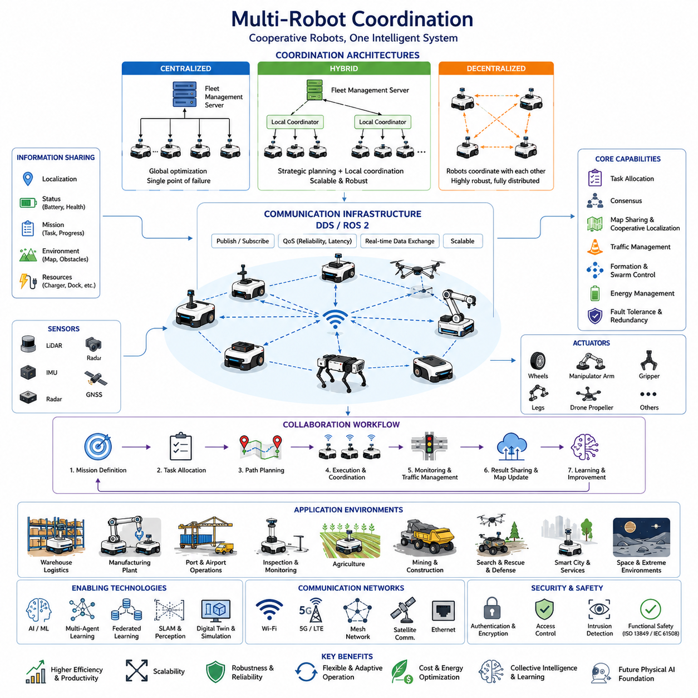
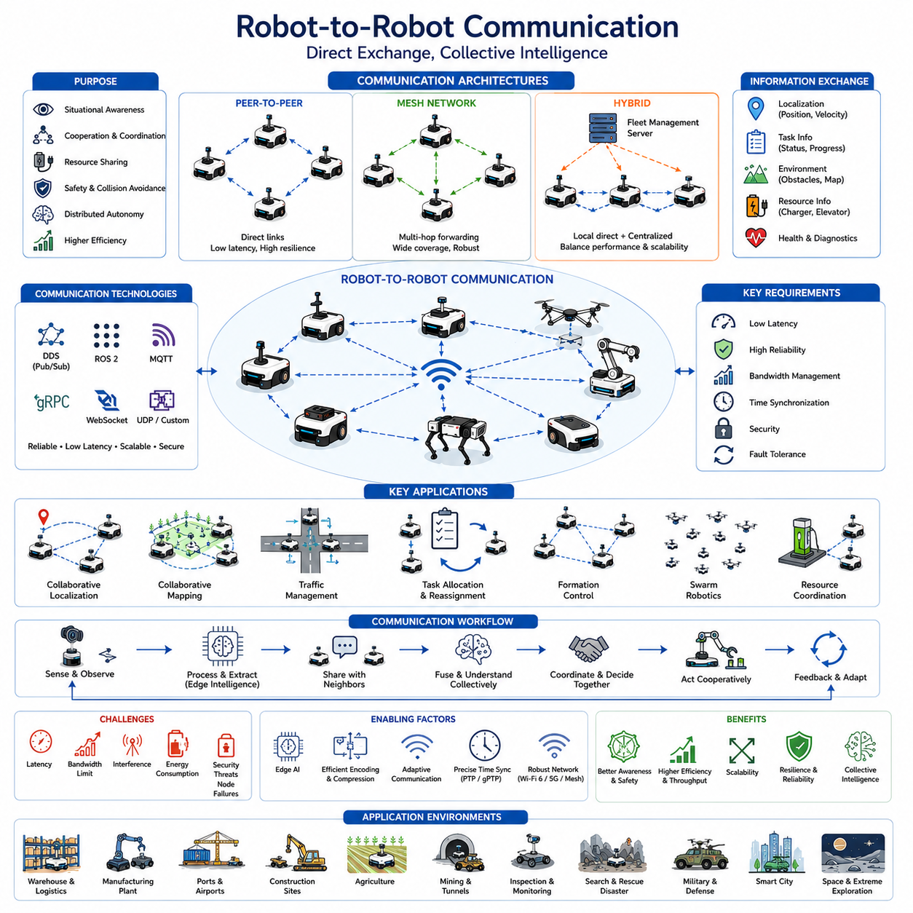
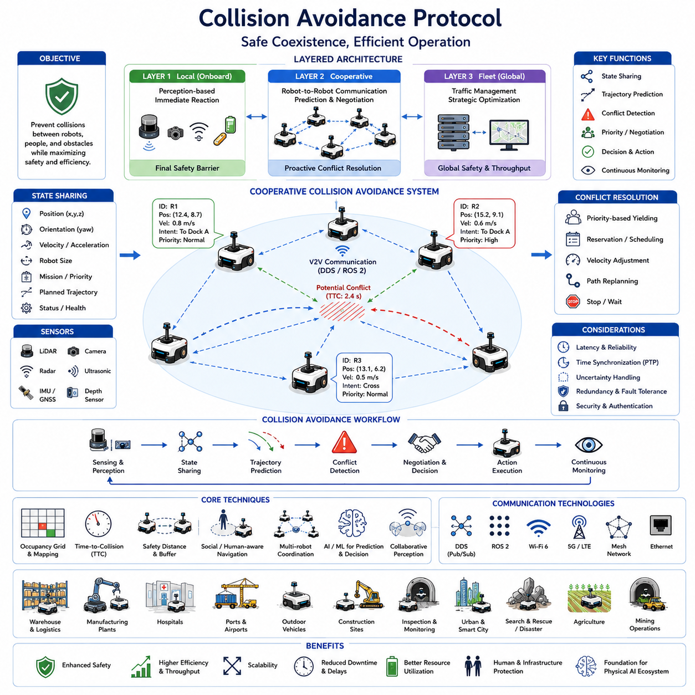
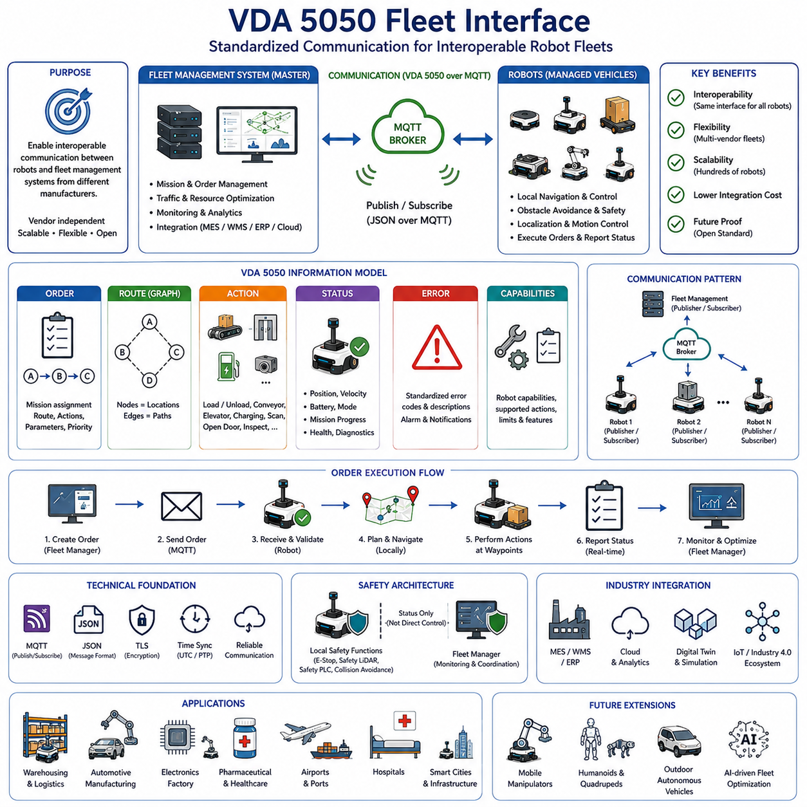
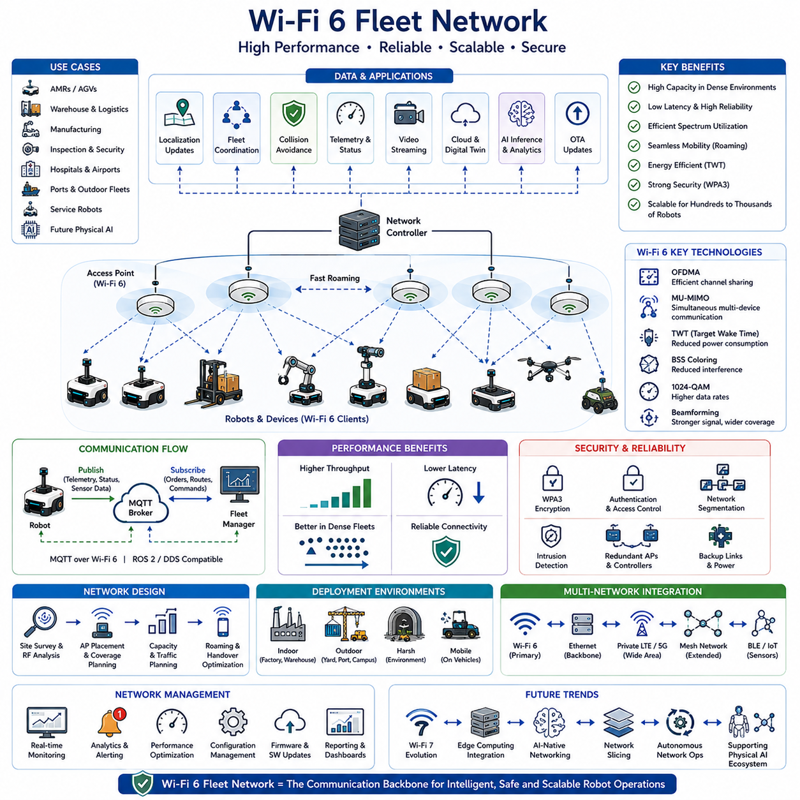

**Volume 09 Robotics Communication**

# Chapter 7. Fleet Communication

## 7.1 Multi Robot Coordination

{width="7.268055555555556in" height="7.268055555555556in"}

다중 로봇 협조(Multi-Robot Coordination)는 현대 로보틱스 통신 시스템의 가장 중요한 기반 기술 중 하나이다. 초기의 로봇 시스템은 일반적으로 독립적으로 동작하는 개별 장비로 설계되었지만, 자율주행 모바일 로봇(AMR), 창고 자동화 시스템, 산업 검사 로봇, 실외 자율주행 차량, 모바일 매니퓰레이터, 사족보행 로봇, 휴머노이드 로봇, 그리고 미래의 Physical AI 시스템이 등장하면서 여러 대의 로봇이 하나의 목표를 위해 협력하는 새로운 패러다임이 형성되었다. 이러한 환경에서는 통신이 단순한 원격 모니터링이나 상태 보고 수준에 머무르지 않는다. 로봇들은 지속적으로 정보를 공유하고, 의사결정을 조율하며, 행동을 동기화하고, 자원을 협상하며, 변화하는 환경에 집단적으로 적응해야 한다. 따라서 다중 로봇 협조는 차세대 로봇 아키텍처의 핵심 요소가 된다.

다중 로봇 협조의 궁극적인 목표는 여러 대의 로봇이 개별적으로 움직이는 것이 아니라 하나의 통합된 지능형 시스템처럼 동작하도록 만드는 것이다. 각각의 로봇은 자체 센서, 컴퓨팅 자원, 위치 추정 기능, 경로 계획 알고리즘, 액추에이터를 보유하고 있지만, 협조 시스템에서는 이러한 자원들이 집단적으로 활용된다. 이를 통해 시스템은 더 높은 효율성, 확장성, 신뢰성 및 작업 범위를 확보할 수 있다. 하나의 로봇이 수행하기 어려운 대규모 작업도 여러 대의 로봇이 역할을 분담함으로써 가능해진다.

이러한 개념은 대형 물류창고, 스마트 공장, 항만 자동화, 공항 물류, 병원 물류 시스템, 광산, 농업 자동화, 스마트 시티, 국방 및 우주 탐사 분야에서 매우 중요한 의미를 가진다. 미래의 Physical AI 환경에서는 수백 대 또는 수천 대의 로봇이 하나의 생태계를 구성하며 협력하게 될 것으로 예상된다.

다중 로봇 협조 아키텍처는 크게 중앙집중형(Centralized), 분산형(Decentralized), 하이브리드(Hybrid) 방식으로 구분할 수 있다.

중앙집중형 구조에서는 Fleet Management Server 또는 Mission Control System이 전체 로봇을 관리한다. 각 로봇은 자신의 위치, 속도, 배터리 상태, 작업 상태, 센서 상태 등의 정보를 중앙 서버에 주기적으로 보고한다. 중앙 서버는 전체 상황을 분석하여 최적의 작업 배정, 경로 계획, 교통 제어 및 자원 배분을 수행한다. 이 방식은 전체 시스템을 최적화하기에 유리하지만, 중앙 서버가 장애를 일으킬 경우 전체 시스템에 영향을 줄 수 있다는 단점이 존재한다.

분산형 구조에서는 중앙 제어기가 존재하지 않는다. 각 로봇이 독립적인 에이전트로 동작하며 서로 직접 통신한다. 로봇들은 지역 정보(Local Information)를 기반으로 의사결정을 수행하고 협상 과정을 통해 공동의 결론을 도출한다. 이러한 방식은 장애에 강하고 확장성이 뛰어나지만, 전체 시스템 차원의 최적화를 달성하기는 상대적으로 어렵다.

하이브리드 구조는 두 가지 방식을 결합한 형태이다. 상위 수준에서는 중앙 서버가 작업 계획과 전략적 의사결정을 수행하고, 하위 수준에서는 개별 로봇들이 직접 통신하며 충돌 회피와 교통 조정을 수행한다. 현재 산업용 AMR 시스템에서 가장 널리 사용되는 방식이 바로 하이브리드 구조이다.

다중 로봇 협조의 핵심은 정보 공유이다. 로봇들은 위치 정보, 상태 정보, 작업 정보, 환경 정보, 자원 정보 등을 지속적으로 교환해야 한다. 위치 정보는 서로의 현재 위치를 파악하는 데 사용되며, 상태 정보는 배터리 잔량이나 장비 상태를 공유한다. 작업 정보는 현재 수행 중인 임무와 진행 상황을 전달하며, 환경 정보는 장애물, 위험 요소, 교통 상황 등을 공유한다. 자원 정보는 충전기, 엘리베이터, 작업 공간, 로딩 스테이션과 같은 공유 자원의 사용 상태를 나타낸다.

현대 로봇 시스템에서는 DDS(Data Distribution Service)가 다중 로봇 협조를 위한 핵심 통신 기술로 활용된다. DDS는 데이터 중심(Data-Centric)의 Publish-Subscribe 구조를 제공하며, 수많은 로봇 간의 확장 가능한 정보 공유를 가능하게 한다. ROS2 역시 DDS를 기반으로 동작하므로 다중 로봇 환경에 매우 적합하다. 로봇들은 Fleet Status, Traffic Information, Global Map, Mission Update 등의 Topic을 공유하면서 실시간으로 협력할 수 있다.

작업 할당(Task Allocation)은 다중 로봇 협조의 가장 중요한 기능 중 하나이다. 여러 작업이 존재할 때 어떤 로봇이 어떤 작업을 수행할지를 결정하는 과정이다. 이 과정에서는 로봇의 위치, 배터리 상태, 작업 능력, 센서 구성, 현재 부하 상태 등이 고려된다. 목표는 전체 시스템의 생산성을 극대화하면서 이동 거리와 에너지 소비를 최소화하는 것이다.

가장 단순한 방식은 가장 가까운 로봇에게 작업을 배정하는 규칙 기반 방식이다. 보다 발전된 방법으로는 경매(Auction) 기반 시스템이 있다. 각 로봇은 자신이 해당 작업을 수행할 경우의 비용이나 효율성을 계산하여 입찰하고, 시스템은 가장 적합한 로봇을 선택한다. 이러한 시장 기반(Market-Based) 협조 방식은 규모가 커져도 효율적으로 동작할 수 있기 때문에 대규모 AMR 시스템에서 널리 사용된다.

합의 알고리즘(Consensus Algorithm) 역시 중요한 요소이다. 여러 로봇이 서로 다른 정보를 가지고 있을 때 동일한 결론에 도달하도록 만드는 기술이다. 이는 집단 탐사, 분산 센싱, 협력 지도 작성, 대형 편대 제어 등에서 필수적이다. 리더 선출(Leader Election), 분산 평균화(Distributed Averaging), Byzantine Fault Tolerance와 같은 기법들이 대표적으로 사용된다.

공유 지도 생성(Map Sharing)과 협력 위치 추정(Cooperative Localization)은 다중 로봇 시스템의 성능을 크게 향상시킨다. 각 로봇이 생성한 로컬 맵을 공유하고 통합함으로써 보다 정확하고 넓은 범위의 글로벌 맵을 생성할 수 있다. 이를 통해 중복 탐사를 줄이고 환경에 대한 이해도를 높일 수 있다. 협력형 SLAM은 이러한 개념을 실현하는 대표적인 기술이다.

교통 관리(Traffic Management)는 대규모 로봇 시스템에서 필수적인 기능이다. 수십 대 또는 수백 대의 로봇이 동시에 움직이면 경로 충돌, 병목 현상, 데드락이 발생할 수 있다. 이를 방지하기 위해 예약 기반 경로 관리, 가상 신호등, 우선순위 협상, 동적 경로 재계획 등의 기술이 사용된다.

대규모 창고 자동화 시스템은 대표적인 사례이다. 수백 대의 AMR이 동일한 공간에서 운영되면서 서로의 위치와 경로를 공유한다. 중앙 Fleet Manager는 전체 물류 효율을 최적화하고, 개별 로봇은 실시간으로 충돌을 회피하면서 작업을 수행한다.

편대 제어(Formation Control)는 특정한 공간적 배열을 유지하며 이동하는 기술이다. 자율주행 차량 군집, 농업용 차량 편대, 드론 군집, 군사 로봇 시스템 등에서 활용된다. 이를 위해서는 정밀한 위치 추정과 저지연 통신이 필수적이다.

스웜 로보틱스(Swarm Robotics)는 수백\~수천 대의 단순 로봇이 집단적으로 행동하는 개념이다. 개미 군집, 벌떼, 물고기 떼와 같은 자연계의 집단 행동에서 영감을 얻었다. 각 로봇은 단순한 규칙만 따르지만, 전체적으로는 매우 복잡하고 지능적인 행동이 나타난다. 이러한 방식은 높은 확장성과 장애 허용성을 제공한다.

에너지 관리 역시 중요한 협조 대상이다. 배터리 기반 로봇들은 충전 스테이션을 공유해야 하므로 충전 스케줄링이 필요하다. Fleet Management System은 전체 배터리 상태를 모니터링하고 충전 시점을 최적화하여 서비스 중단을 최소화한다.

실외 자율주행 로봇의 경우에는 협조가 더욱 복잡해진다. GNSS 신호 불안정, 기상 변화, 장거리 통신, 복잡한 지형 등 다양한 변수가 존재한다. 따라서 Wi-Fi, Private LTE, 5G, 위성 통신, Mesh Network 등을 조합한 통신 구조가 사용된다.

모바일 매니퓰레이터 환경에서는 이동뿐만 아니라 물체 전달, 공동 작업, 협력 조립까지 고려해야 한다. 여러 대의 로봇이 하나의 대형 물체를 함께 운반하거나 조립 작업을 수행하는 경우 정밀한 동기화와 실시간 협조가 요구된다.

미래의 Physical AI 시스템에서는 협조의 범위가 더욱 확대될 것이다. 휴머노이드, 사족보행 로봇, AMR, UAV, 산업용 로봇팔, 스마트 인프라가 하나의 거대한 생태계 안에서 연결될 것이다. 이들은 단순한 데이터가 아니라 지식(Knowledge), 의도(Intent), 계획(Plan), 추론 결과(Reasoning Result)를 공유하게 된다.

대규모 언어 모델(LLM), Vision-Language-Action(VLA) 시스템, AI Native Middleware가 발전하면서 로봇들은 숫자 기반 메시지가 아닌 의미 기반(Semantic-Level) 정보 교환을 수행하게 될 것이다. 또한 Multi-Agent Reinforcement Learning, Federated Learning, Distributed Intelligence 기술을 통해 스스로 협조 전략을 학습하고 개선할 수 있게 된다.

보안(Security)은 다중 로봇 협조에서 매우 중요한 요소이다. 로봇 간 통신이 공격받을 경우 전체 시스템이 위험에 처할 수 있다. 따라서 인증(Authentication), 암호화(Encryption), 접근 제어(Access Control), 침입 탐지(Intrusion Detection) 기술이 반드시 적용되어야 한다.

확장성(Scalability) 역시 핵심 설계 요소이다. 10대 수준의 로봇과 1,000대 수준의 로봇은 전혀 다른 통신 구조를 요구한다. 이를 위해 계층형(Hierarchical) Fleet Architecture가 널리 사용된다. 지역 단위(Local Coordinator)와 상위 Fleet Manager를 구성하여 통신 부하와 계산 복잡도를 분산시키는 방식이다.

결론적으로 다중 로봇 협조는 미래 로보틱스의 핵심 기반 기술이다. 개별 로봇의 성능 향상만으로는 해결할 수 없는 문제들을 집단 지능과 협력 메커니즘을 통해 해결할 수 있다. 물류창고, 스마트 공장, 항만, 공항, 농업, 광산, 건설 현장, 스마트 시티, 우주 탐사에 이르기까지 다중 로봇 협조는 미래 Physical AI 생태계를 구성하는 가장 중요한 기술 중 하나이며, Fleet Management, Swarm Intelligence, Distributed Autonomy, AI 기반 집단 지능의 핵심 토대가 될 것이다.

## 7.2 Robot to Robot Communication

{width="7.268055555555556in" height="7.268055555555556in"}

Robot-to-Robot Communication은 중앙 서버를 반드시 거치지 않고 로봇들끼리 직접 정보를 교환하는 통신 기술을 의미한다. 로봇 기술이 개별 장비 중심에서 대규모 로봇 플릿(Fleet), 협업 로봇 시스템, 그리고 Physical AI 생태계로 발전하면서 로봇 간 직접 통신은 필수적인 기술로 자리 잡고 있다. 현대의 자율주행 모바일 로봇(AMR), 실외 자율주행 차량, 모바일 매니퓰레이터, 사족보행 로봇, 휴머노이드, 산업용 검사 로봇, 드론 등은 서로 정보를 공유하고 행동을 조정하며 자원을 협상하고 집단적으로 의사결정을 수행하기 위해 직접 통신을 활용한다. Fleet Communication 아키텍처에서 Robot-to-Robot Communication은 여러 대의 로봇을 하나의 지능형 시스템으로 통합하는 핵심 계층이라고 할 수 있다.

초기의 로봇 시스템은 주로 Robot-to-Server 구조를 사용하였다. 각 로봇은 자신의 상태와 센서 데이터를 중앙 서버로 전송하고, 서버는 이를 기반으로 명령을 생성하여 다시 로봇에 전달하였다. 이러한 구조는 구현이 단순하고 관리가 용이하지만, 통신 지연, 네트워크 부하, 중앙 서버 의존성, 확장성 한계와 같은 문제를 가진다. 반면 Robot-to-Robot Communication은 로봇들이 직접 정보를 교환함으로써 의사결정 속도를 높이고 중앙 인프라에 대한 의존도를 줄일 수 있다.

로봇 간 통신의 가장 기본적인 목적은 상황 인식(Situational Awareness)의 공유이다. 각 로봇은 카메라, LiDAR, Radar, GNSS, IMU, 초음파 센서, Depth Camera 등을 이용하여 주변 환경을 인식하지만, 개별 로봇이 관측할 수 있는 범위에는 한계가 존재한다. 여러 로봇이 관측한 정보를 공유하면 각 로봇은 자신이 직접 보지 못한 영역까지 이해할 수 있으며, 결과적으로 더 넓고 정확한 환경 인식을 확보할 수 있다.

예를 들어 창고 자동화 환경에서는 여러 대의 AMR이 지속적으로 자신의 위치, 속도, 이동 경로, 작업 상태를 공유한다. 특정 로봇이 예상하지 못한 장애물을 발견하면 그 정보를 주변 로봇에게 즉시 전송할 수 있다. 다른 로봇들은 직접 장애물을 발견하기 전에 경로를 변경하거나 우회할 수 있으며, 이로 인해 물류 흐름의 효율성이 크게 향상된다.

Robot-to-Robot Communication 구조는 여러 형태로 구현될 수 있다. 가장 단순한 형태는 Peer-to-Peer 통신이다. 이 구조에서는 두 대 이상의 로봇이 직접 연결되어 정보를 교환한다. 중앙 서버가 필요하지 않으며 통신 지연이 매우 낮다. 이러한 방식은 군사용 로봇, 재난 대응 로봇, 탐사 로봇 등 중앙 인프라가 부족한 환경에서 매우 유용하다.

또 다른 방식은 Mesh Network 기반 구조이다. 이 구조에서는 각 로봇이 단순한 작업 장비가 아니라 네트워크 중계 노드 역할도 수행한다. 메시지는 여러 로봇을 거쳐 전달될 수 있으며, 이를 통해 통신 범위를 크게 확장할 수 있다. 광산, 터널, 대규모 실외 환경, 재난 현장과 같은 곳에서 Mesh Network는 매우 효과적인 통신 수단이 된다.

산업 현장에서 가장 많이 사용되는 방식은 Hybrid Architecture이다. 이 구조에서는 로봇들이 서로 직접 통신하면서 동시에 Fleet Management Server와도 연결된다. 로컬 수준에서는 로봇 간 통신을 통해 충돌 회피와 협조를 수행하고, 상위 수준에서는 중앙 서버가 전체 작업 계획과 자원 관리를 담당한다. 이러한 구조는 성능, 안정성, 확장성을 동시에 확보할 수 있다.

로봇 간에 교환되는 정보의 종류는 매우 다양하다. 가장 기본적인 정보는 위치 정보(Localisation Data)이다. 각 로봇은 자신의 위치, 자세, 속도, 가속도, 이동 방향을 주기적으로 전송한다. 이를 통해 주변 로봇은 상대 로봇의 미래 이동 경로를 예측하고 충돌을 방지할 수 있다.

작업 정보(Task Information) 역시 중요한 통신 대상이다. 로봇들은 현재 수행 중인 작업, 작업 진행 상태, 예상 완료 시간, 필요 자원 등을 공유한다. 이를 통해 작업 중복을 방지하고 동적으로 업무를 재분배할 수 있다. 만약 특정 로봇이 고장 나거나 배터리가 부족한 경우, 다른 로봇이 해당 작업을 이어받을 수 있다.

환경 정보(Environment Information)의 공유는 집단 지능을 형성하는 핵심 요소이다. 각 로봇이 수집한 장애물 정보, 위험 구역 정보, 교통 상황, 기상 정보, 지형 정보 등을 다른 로봇과 공유함으로써 전체 시스템은 하나의 거대한 분산 센서 네트워크처럼 동작하게 된다.

자원 관리(Resource Coordination) 역시 중요한 응용 분야이다. 충전기, 엘리베이터, 로딩 도크, 작업 공간, 공구와 같은 공유 자원은 여러 로봇이 동시에 필요로 할 수 있다. 로봇들은 통신을 통해 사용 순서를 협의하고 충돌을 최소화하며 자원의 활용 효율을 극대화할 수 있다.

통신 프로토콜은 Robot-to-Robot Communication의 핵심 기반 기술이다. 현대 로봇 시스템에서는 DDS, ROS2 Middleware, MQTT, WebSocket, gRPC, UDP 기반 커스텀 프로토콜 등이 활용된다. 특히 DDS는 Publish-Subscribe 구조를 기반으로 다수의 로봇이 효율적으로 정보를 공유할 수 있도록 설계되어 있으며, Reliability, Latency, Durability와 같은 QoS 설정을 통해 다양한 환경에 대응할 수 있다.

ROS2는 Robot-to-Robot Communication 구현에 매우 적합한 프레임워크이다. Topic은 비동기 데이터 교환을 제공하고, Service는 요청-응답 구조를 지원하며, Action은 장시간 수행되는 작업을 관리할 수 있게 해준다. DDS 기반의 ROS2 환경에서는 서로 다른 로봇에 실행되는 노드들이 마치 동일한 시스템 내부에 있는 것처럼 자연스럽게 통신할 수 있다.

지연시간(Latency)은 매우 중요한 성능 지표이다. 충돌 회피, 협력 주행, 편대 제어, 동기화 작업과 같은 기능은 수 밀리초 수준의 통신 응답 속도를 요구한다. 통신 지연이 증가하면 정보가 오래되어 잘못된 의사결정을 유발할 수 있으며, 시스템 안전성과 효율성이 저하될 수 있다.

대역폭(Bandwidth) 관리 또한 중요하다. 현대 로봇은 카메라와 LiDAR를 통해 막대한 양의 데이터를 생성한다. 이러한 원시 데이터를 그대로 전송하는 것은 현실적으로 어렵다. 따라서 로봇은 객체 정보, 특징 정보, 지도 정보, 의미 기반 정보 등으로 데이터를 압축하고 요약하여 전송한다. Edge AI는 이러한 데이터 요약 과정에서 중요한 역할을 수행한다.

시간 동기화(Time Synchronization)는 다중 로봇 협조의 기반 기술이다. 여러 로봇이 동일한 시간 기준을 사용하지 않으면 데이터 융합과 협조 제어가 어렵다. 이를 위해 NTP, IEEE 1588 PTP, IEEE 802.1AS gPTP, 하드웨어 타임스탬프 기술 등이 활용된다.

협력 위치 추정(Cooperative Localization)은 로봇 간 통신의 대표적인 활용 사례이다. 여러 로봇은 자신의 위치 추정 결과와 관측 정보를 공유하여 위치 정확도를 향상시킨다. GNSS가 불가능한 실내 창고, 터널, 지하 시설 등에서 특히 유용하다.

협력 지도 작성(Collaborative Mapping)도 중요한 응용 분야이다. 여러 로봇이 동시에 환경을 탐색하면서 생성한 지도를 공유하고 통합한다. 이를 통해 더 빠른 탐사와 더 정확한 지도 생성이 가능해진다. Collaborative SLAM은 이러한 개념을 실현하는 대표적인 기술이다.

편대 제어(Formation Control)는 여러 대의 로봇이 일정한 간격과 형상을 유지하면서 이동하는 기술이다. 자율주행 차량 군집, 드론 편대, 농업용 차량 그룹, 군사 로봇 시스템 등에 적용된다. 각 로봇은 자신의 위치와 속도를 지속적으로 공유하며 편대를 유지한다.

스웜 로보틱스(Swarm Robotics)는 수백 또는 수천 대의 로봇이 집단적으로 동작하는 개념이다. 개미 군집이나 새 떼의 행동에서 영감을 얻은 기술로, 중앙 제어 없이도 복잡한 집단 행동을 구현할 수 있다. 각 로봇은 단순한 정보만 교환하지만 전체적으로는 매우 지능적인 행동이 나타난다.

배터리 기반 시스템에서는 에너지 효율적인 통신도 중요하다. 무선 통신은 상당한 전력을 소비하기 때문에 통신 빈도와 데이터 크기를 최적화해야 한다. 로봇은 배터리 상태와 작업 중요도에 따라 통신 전략을 동적으로 조정할 수 있다.

보안(Security)은 필수적인 고려 사항이다. 로봇 간 통신이 공격받을 경우 전체 플릿이 위험에 처할 수 있다. 따라서 인증(Authentication), 암호화(Encryption), 무결성 검증(Integrity Verification), 접근 제어(Access Control) 기술이 반드시 적용되어야 한다.

고장 허용성(Fault Tolerance) 또한 중요하다. 실제 환경에서는 무선 간섭, 하드웨어 장애, 네트워크 혼잡 등이 발생할 수 있다. 따라서 다중 경로 통신, 메시지 재전송, 자동 복구 메커니즘 등을 적용하여 통신 장애 상황에서도 시스템이 지속적으로 동작할 수 있어야 한다.

실외 자율주행 시스템에서는 통신 거리가 수 킬로미터 이상으로 늘어날 수 있다. 또한 통신 인프라가 항상 존재하는 것도 아니다. 따라서 Wi-Fi 6, Private LTE, 5G, Mesh Network, 위성 통신, V2X 기술을 조합한 다계층 통신 구조가 사용된다.

미래의 Physical AI 환경에서는 Robot-to-Robot Communication의 역할이 더욱 확대될 것이다. 휴머노이드, AMR, 자율주행차, 사족보행 로봇, UAV, 산업용 로봇팔이 단순한 센서 데이터뿐 아니라 지식(Knowledge), 계획(Plan), 의도(Intent), 추론 결과(Reasoning Result)를 공유하게 될 것이다.

대규모 언어 모델(LLM), Vision-Language-Action(VLA), AI Native Middleware의 발전은 로봇 간 통신을 데이터 교환 수준에서 의미 기반(Semantic-Level) 협업 수준으로 발전시킬 것이다. 로봇들은 단순히 위치와 속도를 전달하는 것이 아니라 상황에 대한 해석, 문제 해결 전략, 작업 계획까지 공유하게 된다.

또한 Multi-Agent AI, Federated Learning, Distributed Intelligence 기술이 발전하면서 로봇들은 스스로 최적의 통신 전략을 학습하고 개선하게 될 것이다. 통신 자체가 고정된 규칙이 아니라 상황에 따라 진화하는 지능형 기능으로 발전하게 된다.

결론적으로 Robot-to-Robot Communication은 분산 자율 시스템, 협업 로봇, 플릿 관리, 스웜 인텔리전스, 미래 Physical AI 플랫폼의 핵심 기반 기술이다. 이를 통해 로봇들은 단순한 개별 기계가 아니라 집단적으로 인식하고, 학습하고, 의사결정하며, 행동하는 지능형 에이전트 네트워크로 발전하게 된다. 미래의 대규모 로봇 생태계에서 Robot-to-Robot Communication은 집단 지능과 분산 자율성의 핵심 축으로 자리 잡게 될 것이다.

## 7.3 Collision Avoidance Protocol

{width="7.268055555555556in" height="7.268055555555556in"}

충돌 회피 프로토콜(Collision Avoidance Protocol)은 현대 로봇 시스템에서 가장 중요한 통신 및 안전 메커니즘 중 하나이다. 자율주행 모바일 로봇(AMR), 실외 자율주행 차량, 모바일 매니퓰레이터, 사족보행 로봇, 휴머노이드, 산업용 AGV, 검사 로봇, 그리고 미래의 Physical AI 플랫폼이 동일한 공간에서 함께 운영되면서 충돌을 방지하는 능력은 안전하고 효율적인 운영의 필수 조건이 되었다. 충돌 회피는 단순히 개별 로봇 내부의 내비게이션 기능이 아니라, 여러 로봇이 정보를 공유하고 미래의 충돌 가능성을 예측하며 우선순위를 협의하고 실시간으로 움직임을 조정하는 통신 기반 협조 프로토콜로 발전하고 있다. Fleet Communication 아키텍처에서 충돌 회피 프로토콜은 로봇, 설비, 운반 물품, 그리고 작업자를 보호하면서도 생산성을 유지하는 핵심 기술 계층이라 할 수 있다.

초기의 로봇 시스템에서는 충돌 회피가 주로 개별 센서 기반으로 이루어졌다. 로봇은 초음파 센서, 적외선 센서, 범퍼 센서, 레이저 스캐너 등을 이용하여 주변 장애물을 감지하고 즉각적으로 반응하였다. 이러한 방식은 단순한 환경에서는 효과적이었지만 로봇 수가 증가하고 운영 환경이 복잡해지면서 한계를 드러냈다. 현대의 로봇 플릿은 단순히 정적인 장애물을 피하는 수준을 넘어 다른 로봇의 의도와 미래 움직임까지 예측해야 한다. 따라서 충돌 회피는 인지, 예측, 계획, 협상, 제어가 결합된 분산형 통신 프로토콜로 발전하였다.

충돌 회피 프로토콜의 기본 목표는 두 개 이상의 로봇이나 차량, 로봇팔이 동일한 공간을 동시에 점유하지 않도록 보장하는 것이다. 이를 위해서는 로봇 상태를 지속적으로 모니터링하고, 미래 이동 경로를 예측하며, 잠재적 충돌을 조기에 발견하고, 충돌이 발생하기 전에 적절한 대응 조치를 수행해야 한다. 현대의 충돌 회피 시스템은 사고 발생 직전에 반응하는 것이 아니라 수 초 전에 위험을 예측하고 선제적으로 대응하는 구조를 가진다.

충돌 회피 프로토콜은 일반적으로 계층형 구조를 가진다. 가장 하위 계층은 센서 기반의 로컬 충돌 회피 기능이다. LiDAR, 카메라, Radar, Depth Sensor, 초음파 센서와 같은 장비를 통해 주변 물체를 감지하고 즉각적인 긴급 정지나 회피 동작을 수행한다. 이 계층은 통신 네트워크와 무관하게 독립적으로 동작하며 최종 안전 장벽 역할을 수행한다. 통신이 완전히 끊어지더라도 즉각적인 충돌은 방지할 수 있어야 한다.

그 위 계층은 협력형 충돌 회피(Cooperative Collision Avoidance)이다. 여기서는 로봇들이 서로의 위치, 속도, 방향, 가속도, 예정 경로를 통신을 통해 공유한다. 이를 통해 센서가 직접 볼 수 없는 영역의 정보까지 확보할 수 있으며, 미래의 충돌 가능성을 조기에 발견할 수 있다. 협력형 충돌 회피는 안전성을 높이는 동시에 운영 효율을 향상시키는 핵심 기술이다.

최상위 계층은 플릿 수준의 교통 관리(Traffic Management)이다. Fleet Management System은 전체 로봇의 위치, 작업 상태, 경로 계획, 자원 사용 상태를 종합적으로 분석하고 최적의 이동 경로와 우선순위를 결정한다. 이를 통해 충돌 위험을 최소화하면서 전체 생산성을 극대화할 수 있다.

충돌 회피 프로토콜의 핵심 요소 중 하나는 상태 공유(State Sharing)이다. 각 로봇은 자신의 위치, 자세, 속도, 가속도, 크기, 작업 상태, 우선순위, 목적지, 계획 경로 등을 주기적으로 전송한다. 이러한 정보는 충돌 예측의 기초 데이터가 된다.

현대 충돌 회피 시스템에서 가장 중요한 기능 중 하나는 궤적 예측(Trajectory Prediction)이다. 단순히 현재 위치만 보는 것이 아니라 향후 수 초 동안의 예상 이동 경로를 계산한다. 이를 통해 실제 충돌이 발생하기 훨씬 전에 위험을 감지할 수 있다. 예측 모델은 현재 속도, 가속도, 조향 명령, 차량 동역학, 환경 조건 등을 종합적으로 고려한다.

충돌 감지(Conflict Detection) 알고리즘은 예측된 경로를 분석하여 미래 충돌 가능성을 평가한다. 두 로봇이 특정 시간 내에 동일한 공간에 진입할 가능성이 있을 경우 이를 충돌 위험으로 판단한다. 분석 과정에서는 안전 거리, 제동 거리, 시간 오차, 위치 오차 등도 함께 고려된다.

충돌 위험이 발견되면 협상(Negotiation) 과정이 시작된다. 가장 일반적인 방법은 우선순위 기반 방식이다. 긴급 임무를 수행하는 로봇이나 안전 관련 차량은 높은 우선순위를 부여받고, 일반 물류 로봇은 양보하도록 설계된다. 낮은 우선순위 로봇은 속도를 줄이거나 정지하거나 경로를 변경함으로써 충돌을 회피한다.

예약 기반(Reservation-Based) 충돌 회피는 또 다른 효과적인 방법이다. 이 방식에서는 특정 공간을 자원(Resource)으로 간주한다. 교차로, 통로, 엘리베이터, 충전소, 작업 구역 등이 대표적이다. 로봇은 해당 공간에 진입하기 전에 사용 권한을 요청하고 승인받는다. 이러한 방식은 창고, 공장, 병원과 같은 구조화된 환경에서 매우 효과적이다.

교차로 관리(Intersection Management)는 충돌 회피 프로토콜의 대표적인 응용 사례이다. 여러 대의 로봇이 동시에 교차로에 접근하는 경우 전통적인 신호등 방식보다 더 효율적인 동적 협상 방식이 사용된다. 시스템은 각 로봇의 위치, 속도, 우선순위, 목적지를 고려하여 통과 순서를 결정한다.

속도 조정(Velocity Adjustment)은 가장 단순하면서도 자주 사용되는 충돌 회피 방법이다. 경로 자체를 변경하지 않고 도착 시간을 조정하여 동일한 위치에 동시에 도달하지 않도록 한다. 물류 창고나 차량 군집 주행 환경에서 매우 효과적이다.

경로 재계획(Path Replanning)은 보다 적극적인 충돌 해결 방법이다. 속도 조정만으로 충돌을 피할 수 없는 경우 새로운 경로를 계산하여 위험 지역을 우회한다. 현대의 경로 계획기는 교통량, 작업 우선순위, 환경 변화, 안전 조건을 실시간으로 고려하여 경로를 재생성한다.

플릿 규모가 커질수록 충돌 회피는 더욱 복잡해진다. 수십 대 수준에서는 직접 통신으로 충분할 수 있지만, 수백 대 이상의 환경에서는 계층형 교통 관리 구조가 필요하다. 환경을 여러 구역으로 나누고 지역 관리자(Local Coordinator)가 로컬 충돌을 처리하며, 상위 Fleet Manager가 전체 최적화를 수행하는 방식이 일반적이다.

DDS 기반 통신은 충돌 회피 프로토콜 구현에 널리 사용된다. 로봇은 자신의 상태를 지속적으로 Publish하고 다른 로봇의 상태를 Subscribe한다. DDS의 QoS 기능을 활용하면 안전 관련 메시지의 전달 신뢰성과 지연 시간을 효과적으로 관리할 수 있다.

ROS2 역시 충돌 회피 시스템 구현에 매우 적합하다. Navigation Stack, Localization System, Sensor Fusion Module, Trajectory Planner, Traffic Manager 등이 ROS2 Topic과 Service를 통해 정보를 교환한다. DDS 기반 구조 덕분에 대규모 분산 환경에서도 실시간 성능을 유지할 수 있다.

무선 통신 기술은 충돌 회피 성능에 직접적인 영향을 미친다. Wi-Fi 6, Private LTE, 5G, Mesh Network, Industrial Ethernet, 미래의 6G 기술은 서로 다른 지연 시간, 대역폭, 신뢰성을 제공한다. 안전이 중요한 환경에서는 통신 이중화(Redundancy)가 필수적으로 적용된다.

시간 동기화(Time Synchronization)는 정확한 충돌 예측을 위해 매우 중요하다. 서로 다른 시간 기준을 사용하는 로봇은 위치 정보를 정확히 해석할 수 없다. IEEE 1588 PTP, IEEE 802.1AS gPTP, Hardware Timestamp 기술은 마이크로초 수준의 정밀한 시간 동기화를 제공한다.

불확실성 관리(Uncertainty Management)도 중요한 과제이다. 센서 오차, 위치 추정 오차, 통신 지연, 예측 모델의 한계는 모두 불확실성을 유발한다. 따라서 확률 기반 충돌 예측, Bayesian Estimation, Occupancy Grid와 같은 기술이 사용된다.

사람과 함께 작업하는 환경에서는 Human-Aware Collision Avoidance가 필요하다. 사람은 로봇보다 행동 예측이 어렵기 때문에 인간 검출, 인간 경로 예측, 사회적 내비게이션(Social Navigation) 기능이 요구된다. 시스템은 안전뿐만 아니라 사람의 심리적 편안함까지 고려해야 한다.

협력 인지(Collaborative Perception)는 충돌 회피 성능을 크게 향상시킨다. 여러 로봇이 센서 데이터를 공유함으로써 시야가 가려진 영역까지 인식할 수 있다. 예를 들어 코너 뒤쪽을 관측 중인 로봇이 정보를 전달하면 다른 로봇은 보이지 않는 장애물까지 사전에 인지할 수 있다.

실외 자율주행 차량에서는 비, 눈, 안개, 먼지, 강한 햇빛 등으로 인해 센서 성능이 저하될 수 있다. 또한 속도가 높고 통신 품질도 일정하지 않다. 따라서 다중 센서 융합, 통신 이중화, 고급 예측 알고리즘이 필수적으로 적용된다.

모바일 매니퓰레이터와 산업용 로봇팔에서는 이동뿐 아니라 작업 공간 내 충돌 회피도 중요하다. 여러 대의 로봇팔이 동일한 공간에서 작업하는 경우 서로의 움직임을 실시간으로 공유하고 조율해야 한다.

스웜 로보틱스에서는 중앙 제어 없이도 충돌 회피가 가능해야 한다. 각 로봇은 단순한 지역 규칙(Local Rule)만 따르지만 전체적으로는 안정적인 집단 행동이 형성된다. 이는 새 떼, 물고기 떼, 곤충 군집의 행동 원리에서 많은 영감을 얻었다.

인공지능은 충돌 회피 기술을 빠르게 발전시키고 있다. 머신러닝은 장애물 인식과 궤적 예측 정확도를 향상시키며, 강화학습은 로봇이 경험을 통해 더 효율적인 충돌 회피 전략을 학습할 수 있도록 한다. Multi-Agent Learning은 플릿 전체가 집단적으로 더 나은 협조 행동을 습득하게 만든다.

미래의 Physical AI 환경에서는 AMR, 자율주행차, UAV, 휴머노이드, 사족보행 로봇, 산업용 로봇팔이 동일한 공간에서 함께 운영될 것이다. 따라서 충돌 회피 프로토콜은 단순한 교통 제어 기술을 넘어 이기종(Heterogeneous) 에이전트 간의 협조와 집단 지능을 지원하는 통합 프레임워크로 발전하게 될 것이다.

또한 충돌 회피 통신이 악의적으로 조작될 경우 심각한 안전 문제가 발생할 수 있으므로 인증, 암호화, 무결성 검증, 침입 탐지 기술이 반드시 적용되어야 한다. 미래에는 안전(Safety)과 보안(Security)이 하나의 통합 설계 개념으로 다루어질 것이다.

결론적으로 Collision Avoidance Protocol은 단순한 장애물 회피 기술이 아니라 인지, 통신, 예측, 협상, 계획, 동기화, 제어를 통합하는 종합적인 협조 프레임워크이다. 이는 대규모 로봇 플릿, 지능형 물류 시스템, 자율주행 차량, 협업 제조 시스템, 스웜 로보틱스, 그리고 미래의 Physical AI 생태계를 가능하게 하는 핵심 기술이며, 향후 로봇 산업의 안전성과 효율성을 결정하는 가장 중요한 기반 기술 중 하나가 될 것이다.

## 7.4 VDA 5050 Fleet Interface

{width="7.268055555555556in" height="7.268055555555556in"}

VDA 5050은 자율주행 모바일 로봇(AMR), 무인운반차(AGV), 그리고 플릿 관리 시스템(Fleet Management System) 간의 상호운용성(Interoperability)을 보장하기 위해 개발된 표준 통신 인터페이스이다. 현대 산업 환경에서는 다양한 제조사의 로봇이 동일한 공장이나 물류센터에서 함께 운영되는 경우가 점점 늘어나고 있다. 과거에는 각 제조사가 자체적인 플릿 관리 프로토콜과 통신 인터페이스를 사용했기 때문에 서로 다른 제조사의 로봇을 하나의 시스템으로 통합하는 것이 매우 어려웠다. VDA 5050은 이러한 문제를 해결하기 위해 개발된 개방형(Open Standard) 표준으로서, 제조사에 관계없이 모든 로봇과 플릿 관리 시스템이 동일한 언어로 통신할 수 있도록 설계되었다. 로봇 통신 아키텍처 관점에서 VDA 5050은 대규모 플릿 운영, 산업 자동화, 그리고 Industry 4.0 구현을 위한 핵심 표준 중 하나이다.

VDA 5050은 독일 자동차산업협회(VDA)와 독일기계산업협회(VDMA)의 협력을 통해 개발되었다. 이들은 미래의 스마트 공장이 여러 제조사의 로봇을 동시에 운영하는 환경으로 발전할 것이라고 예상하였다. 만약 표준 인터페이스가 존재하지 않는다면 새로운 로봇을 추가할 때마다 별도의 소프트웨어 개발과 통합 작업이 필요하게 된다. 이는 비용 증가와 유지보수 복잡성을 초래한다. 따라서 VDA 5050은 제조사 독립적인(Vendor Independent) 로봇 생태계를 구축하기 위한 공통 표준으로 정의되었다.

VDA 5050의 핵심 목표는 플릿 관리 기능과 로봇 내부 제어 기능을 분리하는 것이다. 플릿 관리 시스템은 작업 할당, 경로 생성, 운영 지시를 담당하고, 개별 로봇은 내비게이션, 모터 제어, 위치 추정, 충돌 회피, 안전 기능과 같은 로컬 기능을 담당한다. 이러한 역할 분리를 통해 서로 다른 제조사의 로봇도 동일한 플릿 환경에서 함께 운영될 수 있다.

VDA 5050은 Master-Controller 구조를 기반으로 한다. Fleet Management System이 마스터 역할을 수행하며, 개별 로봇은 관리 대상 차량(Managed Vehicle) 역할을 수행한다. 양측은 표준화된 메시지를 사용하여 작업 명령, 상태 보고, 오류 알림, 경로 정보, 실행 결과 등을 교환한다. 중요한 점은 Fleet Manager가 모터나 조향 장치를 직접 제어하지 않는다는 것이다. Fleet Manager는 고수준 명령만 전달하고, 실제 제어는 로봇 내부 시스템이 수행한다.

VDA 5050 설계 철학의 중요한 특징은 추상화(Abstraction)이다. 플릿 관리 시스템은 로봇 내부 구조를 알 필요가 없다. 로봇이 어떤 센서를 사용하는지, 어떤 SLAM 기술을 사용하는지, 어떤 주행 알고리즘을 사용하는지와 관계없이 표준 메시지만 이해하면 된다. 이를 통해 제조사별 기술 차이를 숨기고 상호운용성을 확보할 수 있다.

VDA 5050은 기본적으로 MQTT 기반의 통신 구조를 사용한다. MQTT는 Publish-Subscribe 구조를 제공하는 경량 메시지 프로토콜로서 산업 환경에서 매우 널리 사용된다. MQTT Broker가 중앙 허브 역할을 수행하며, Fleet Manager와 로봇은 MQTT Topic을 통해 정보를 교환한다.

Publish-Subscribe 구조는 Point-to-Point 방식보다 훨씬 유연하다. 모든 시스템이 직접 연결될 필요 없이 필요한 정보를 Topic에 게시(Publish)하고 구독(Subscribe)하는 방식으로 운영된다. 이를 통해 시스템 확장성과 유지보수성이 크게 향상된다.

VDA 5050의 핵심 개념 중 하나는 Order이다. Order는 Fleet Manager가 로봇에게 전달하는 작업 명령을 의미한다. Order에는 이동 경로, 목적지, 수행할 작업, 실행 조건 등이 포함된다. 로봇은 Order를 수신한 후 내부적으로 검증하고 실제 작업을 수행한다. 수행 과정에서 상태 정보를 지속적으로 Fleet Manager에 보고한다.

경로(Route)는 Node와 Edge 구조로 표현된다. Node는 교차로, 작업 스테이션, 충전소, 엘리베이터, 적재 지점과 같은 주요 위치를 의미한다. Edge는 Node와 Node를 연결하는 이동 가능한 경로를 의미한다. Fleet Manager는 이러한 그래프 구조를 사용하여 로봇의 이동 계획을 생성한다.

Node-Edge 구조의 가장 큰 장점은 로봇 내부 기술에 독립적이라는 점이다. 어떤 로봇은 LiDAR 기반 내비게이션을 사용하고, 어떤 로봇은 Visual SLAM이나 QR 코드 기반 위치 추정을 사용할 수 있다. 그러나 Fleet Manager는 동일한 Node-Edge 구조만을 사용하여 명령을 전달하면 된다.

Action은 VDA 5050의 또 다른 중요한 개념이다. 단순히 위치를 이동하는 것뿐만 아니라 특정 위치에서 수행해야 하는 작업을 정의한다. 예를 들어 화물 적재, 화물 하역, 컨베이어 작동, 문 열기, 엘리베이터 호출, 충전 시작, 이미지 촬영, 바코드 스캔 등이 Action으로 표현될 수 있다. 이를 통해 VDA 5050은 단순 물류 이동을 넘어 복잡한 산업 프로세스를 지원할 수 있다.

상태 보고(Status Reporting)는 플릿 운영의 핵심 요소이다. 로봇은 자신의 위치, 속도, 배터리 상태, 작업 진행 상황, 운영 모드, 오류 상태, 진단 정보 등을 지속적으로 보고한다. Fleet Manager는 이를 통해 전체 플릿 상태를 실시간으로 모니터링할 수 있다.

오류 처리(Error Handling) 또한 표준화되어 있다. 로봇이 경로 차단, 위치 추정 실패, 통신 오류, 하드웨어 장애, 안전 정지, 작업 실패 등을 경험하면 표준화된 Error Message를 통해 Fleet Manager에 보고한다. 이는 유지보수와 운영 관리의 효율성을 크게 향상시킨다.

배터리 관리(Battery Management) 역시 중요한 기능이다. 로봇은 배터리 잔량, 충전 필요 여부, 에너지 소비 현황 등을 Fleet Manager에 전달한다. Fleet Manager는 이를 바탕으로 충전 스케줄을 최적화하고 가동 중단 시간을 최소화한다.

안전(Safety)은 VDA 5050에서 매우 중요하게 고려되지만, 기능 안전 자체는 개별 로봇이 책임진다. 비상정지(E-Stop), Safety LiDAR, Safety PLC, 보호 구역 감시, 충돌 회피 기능은 로봇 내부에서 구현된다. 이는 네트워크 장애가 발생하더라도 안전 기능이 유지되도록 하기 위함이다.

VDA 5050의 가장 큰 장점 중 하나는 확장성(Scalability)이다. 기존의 제조사 전용 인터페이스는 로봇 수가 증가할수록 통합 복잡성이 급격히 증가하였다. 반면 VDA 5050은 표준 인터페이스를 제공하므로 수백 대 규모의 플릿도 비교적 쉽게 관리할 수 있다.

상호운용성(Interoperability)은 VDA 5050이 제공하는 가장 중요한 가치이다. 예를 들어 동일한 물류센터 내에서 팔레트 운반 로봇, 견인형 로봇, 검사 로봇, 고속 배송 AMR 등이 서로 다른 제조사 제품일 수 있다. VDA 5050 환경에서는 이들이 동일한 Fleet Manager 아래에서 함께 운영될 수 있다.

Industry 4.0과 스마트팩토리 개념 역시 VDA 5050과 밀접하게 연결된다. 현대 공장은 로봇뿐 아니라 MES, ERP, WMS, IoT 플랫폼과 연계되어 운영된다. VDA 5050은 이러한 디지털 제조 생태계를 연결하는 중요한 통신 기반 역할을 수행한다.

최근에는 클라우드 기반 Fleet Management와의 통합도 증가하고 있다. Fleet Manager는 온프레미스(On-Premise), 프라이빗 클라우드, 하이브리드 클라우드 환경에서 운영될 수 있다. 이를 통해 운영 모니터링, 예지보전, OTA 업데이트, 디지털 트윈 연동 등이 가능해진다.

디지털 트윈(Digital Twin)은 VDA 5050 데이터의 대표적인 활용 사례이다. 실제 로봇 운영 데이터를 시뮬레이션 환경과 연결함으로써 성능 분석, 생산성 향상, 병목 구간 분석, 장애 예측 등을 수행할 수 있다.

현재 VDA 5050은 물류센터, 자동차 공장, 전자 제조 공장, 제약 산업, 병원, 공항, 항만 등 다양한 산업 분야에서 빠르게 확산되고 있다. 특히 특정 제조사에 종속되지 않는 Vendor Lock-In 방지 효과 때문에 많은 기업들이 적극적으로 채택하고 있다.

하지만 VDA 5050도 몇 가지 과제를 가지고 있다. 일부 선택 기능(Optional Feature)은 제조사마다 구현 방식이 다를 수 있으며, 지원하는 기능 수준에도 차이가 존재한다. 따라서 실제 프로젝트에서는 상호운용성 테스트와 검증 과정이 매우 중요하다.

미래에는 모바일 매니퓰레이터, 휴머노이드, 실외 자율주행 차량, 검사 드론, 사족보행 로봇 등 더욱 다양한 플랫폼이 VDA 5050 생태계에 참여하게 될 것으로 예상된다. 또한 단순 이동 명령을 넘어 의미 기반 작업 지시, 협업 작업, AI 기반 작업 계획과 같은 고급 기능도 포함될 가능성이 높다.

인공지능 역시 VDA 5050 기반 플릿 운영을 더욱 발전시킬 것이다. 머신러닝은 작업 할당 최적화, 교통 관리, 충전 스케줄링, 예지보전, 자원 활용 최적화를 지원할 수 있다. Multi-Agent AI는 다양한 종류의 로봇들이 더욱 효율적으로 협력하도록 만들 것이다.

보안(Security)의 중요성도 계속 증가하고 있다. 로봇 플릿이 기업 네트워크 및 클라우드와 연결되면서 MQTT 암호화, 인증(Authentication), 접근 제어(Access Control), 인증서 관리(Certificate Management), 침입 탐지(Intrusion Detection) 기술이 필수 요소가 되고 있다.

결론적으로 VDA 5050은 미래 산업 자동화를 위한 가장 중요한 개방형 플릿 통신 표준 중 하나이다. 플릿 관리와 로봇 내부 제어를 명확히 분리함으로써 제조사 독립적인 로봇 생태계를 구축할 수 있으며, 다양한 종류의 로봇이 하나의 시스템 안에서 협력할 수 있도록 지원한다. 앞으로 물류, 제조, 의료, 운송, 스마트 시티, 그리고 Physical AI 분야가 확대될수록 VDA 5050은 상호운용성, 확장성, 유연성을 제공하는 핵심 통신 프레임워크로 더욱 중요한 역할을 수행하게 될 것이다.

## 7.5 Wi Fi 6 Fleet Network

{width="7.268055555555556in" height="7.268055555555556in"}

Wi-Fi 6 Fleet Network는 현대 로봇 플릿 시스템에서 가장 중요한 통신 인프라 중 하나이다. 자율주행 모바일 로봇(AMR), 무인운반차(AGV), 모바일 매니퓰레이터, 검사 로봇, 물류 로봇, 서비스 로봇, 실외 자율주행 차량, 그리고 미래의 Physical AI 플랫폼이 점점 더 연결되면서 통신 네트워크는 단순한 연결 수단을 넘어 핵심 운영 인프라로 발전하고 있다. 현대 로봇 환경에서 통신은 단순히 명령 전달이나 상태 모니터링에 그치지 않는다. 위치 추정 데이터 교환, 플릿 협조, 충돌 회피, 텔레메트리 전송, 영상 스트리밍, 클라우드 연결, OTA 업데이트, 디지털 트윈 동기화, AI 추론 요청, 실시간 제어 등을 모두 지원해야 한다. IEEE 802.11ax로 정의된 Wi-Fi 6는 이러한 요구사항을 만족시키는 가장 강력한 무선 통신 기술 중 하나로 자리 잡았으며, 현대 로봇 플릿 환경에서는 고대역폭, 저지연, 고확장성을 제공하는 핵심 무선 백본 역할을 수행한다.

로봇 플릿의 확산은 네트워크 요구사항 자체를 변화시켰다. 초기 산업용 무선 네트워크는 바코드 스캐너, 노트북, PDA, HMI 장치와 같은 비교적 단순한 장비를 연결하기 위해 설계되었다. 이러한 환경에서는 데이터 양이 적고 접속 장치 수도 제한적이었다. 그러나 현대 로봇 플릿에서는 수십 대에서 수백 대, 나아가 수천 대의 로봇이 동시에 위치 정보, 경로 정보, 센서 데이터, 작업 상태, 안전 정보, 영상 데이터 등을 교환한다. 기존 Wi-Fi 환경에서는 이러한 밀집 환경에서 성능 저하가 발생하기 쉽다. Wi-Fi 6는 바로 이러한 고밀도 환경을 지원하기 위해 설계되었기 때문에 로봇 플릿에 매우 적합하다.

Wi-Fi 6의 가장 큰 특징 중 하나는 스펙트럼 활용 효율의 향상이다. 이전 세대 Wi-Fi는 최대 전송 속도 향상에 집중했지만, Wi-Fi 6는 다수의 장치가 동시에 접속하는 환경에서의 효율성을 크게 개선하였다. 이를 가능하게 하는 핵심 기술이 OFDMA(Orthogonal Frequency Division Multiple Access)이다. OFDMA는 하나의 채널을 여러 개의 작은 자원 단위(Resource Unit)로 나누어 여러 장치가 동시에 사용할 수 있도록 한다. 이를 통해 수많은 로봇이 작은 패킷을 지속적으로 전송하더라도 효율적인 통신이 가능해진다.

로봇 플릿 환경에서는 위치 정보, 배터리 상태, 센서 상태, 안전 이벤트, 텔레메트리와 같은 작은 데이터 패킷이 지속적으로 생성된다. 기존 Wi-Fi에서는 이러한 작은 데이터 전송이 반복될 경우 오버헤드가 커질 수 있었지만, OFDMA는 이를 효율적으로 처리하여 네트워크 혼잡을 줄이고 응답 속도를 향상시킨다.

Wi-Fi 6의 또 다른 핵심 기술은 MU-MIMO(Multi-User Multiple Input Multiple Output)이다. 기존 Wi-Fi는 한 번에 하나의 장치와 통신하는 경우가 많았지만, Wi-Fi 6는 여러 장치와 동시에 통신할 수 있다. 플릿 환경에서는 하나의 액세스 포인트가 여러 대의 로봇과 동시에 데이터를 교환할 수 있으므로 전체 네트워크 처리량이 증가하고 확장성이 향상된다.

지연 시간(Latency)은 로봇 통신에서 가장 중요한 성능 요소 중 하나이다. 플릿 협조, 충돌 회피, 경로 최적화, 분산 센싱, 실시간 모니터링은 모두 빠른 데이터 교환을 요구한다. 지연이 증가하면 정보가 오래되어 의사결정 품질이 떨어지고 안전성도 저하된다. Wi-Fi 6는 향상된 스케줄링 메커니즘을 통해 혼잡 환경에서도 낮은 지연 시간을 유지할 수 있도록 설계되었다.

Target Wake Time(TWT)은 배터리 기반 로봇에 매우 유용한 기능이다. 기존 무선 장치는 주기적으로 깨어나 데이터를 확인해야 했지만, TWT는 액세스 포인트와 장치가 통신 스케줄을 미리 협의할 수 있도록 한다. 따라서 필요하지 않은 시간에는 무선 모듈을 절전 상태로 유지할 수 있으며 에너지 소비를 줄일 수 있다. 대형 배터리를 사용하는 산업용 로봇이라 하더라도 통신 모듈의 전력 절감은 전체 운영 시간 증가에 도움이 된다.

실제 산업 환경은 무선 통신에 매우 까다로운 조건을 제공한다. 물류창고, 제조공장, 병원, 공항, 항만 등은 금속 구조물, 선반, 기계장치, 컨베이어, 차량 등으로 인해 전파 반사와 다중 경로(Multipath) 현상이 빈번하게 발생한다. 따라서 Wi-Fi 6 플릿 네트워크 구축 시에는 정교한 RF 설계가 필요하다.

이를 위해 Site Survey가 필수적으로 수행된다. RF 신호 분포, 간섭 요인, 커버리지 범위, 액세스 포인트 설치 위치를 분석하여 최적의 네트워크 설계를 수행한다. 로봇은 정지 상태가 아니라 이동하기 때문에 단순한 사무실 Wi-Fi 설계와는 다른 접근이 필요하다.

로밍(Roaming) 성능도 매우 중요하다. 로봇은 시설 전체를 이동하면서 여러 액세스 포인트를 거치게 된다. 로밍 과정에서 연결이 끊기면 명령 전달 지연, 텔레메트리 손실, 충돌 회피 실패 등이 발생할 수 있다. 따라서 Wi-Fi 6 플릿 네트워크는 Fast Roaming 기술을 적용하여 이동 중에도 끊김 없는 연결을 유지해야 한다.

QoS(Quality of Service)는 플릿 네트워크의 핵심 기능이다. 모든 데이터가 동일한 중요도를 가지는 것은 아니다. 충돌 회피 메시지, 안전 관련 이벤트, 위치 정보는 매우 높은 우선순위를 가져야 하며, 로그 파일이나 소프트웨어 업데이트는 상대적으로 낮은 우선순위를 가질 수 있다. Wi-Fi 6는 이러한 트래픽 우선순위 관리를 지원하여 중요한 데이터가 항상 우선적으로 전송될 수 있도록 한다.

플릿 네트워크에서 전송되는 데이터는 크게 텔레메트리, 내비게이션, 센서 데이터, 영상 데이터, 관리 데이터로 구분할 수 있다. 텔레메트리는 배터리 상태와 작업 상태를 포함하며, 내비게이션 데이터는 위치와 경로 정보를 포함한다. 센서 데이터는 LiDAR, Radar, 카메라 분석 결과를 의미하며, 영상 데이터는 원격 모니터링이나 검사 작업에 사용된다. 관리 데이터는 OTA 업데이트와 진단 정보를 포함한다. Wi-Fi 6는 이러한 다양한 트래픽을 동시에 처리할 수 있는 충분한 성능을 제공한다.

ROS2와 DDS 기반 로봇 시스템에서는 네트워크 설계가 더욱 중요하다. DDS는 Publish-Subscribe 구조를 사용하며 멀티캐스트와 저지연 통신에 크게 의존한다. 따라서 Wi-Fi 설정은 DDS 트래픽 특성을 고려하여 최적화되어야 한다. 그렇지 않으면 Discovery 과정이나 Topic 전송 성능이 저하될 수 있다.

사이버 보안은 플릿 네트워크에서 점점 더 중요한 요소가 되고 있다. Wi-Fi 네트워크는 외부 공격의 주요 진입점이 될 수 있기 때문이다. Wi-Fi 6는 WPA3를 지원하여 이전 세대보다 훨씬 강력한 인증과 암호화를 제공한다. 또한 인증서 기반 접근 제어, 침입 탐지 시스템, Zero Trust Architecture와 같은 보안 기술이 함께 적용되고 있다.

네트워크 세분화(Network Segmentation)도 중요하다. 로봇, 서버, 엔지니어링 워크스테이션, 카메라, IoT 장비, 외부 방문자 장비를 모두 하나의 네트워크에 연결하는 것은 바람직하지 않다. VLAN과 네트워크 분리를 통해 보안성과 관리성을 향상시킬 수 있다.

이중화(Redundancy)는 미션 크리티컬 환경에서 필수적이다. 네트워크 장애는 곧 물류 중단이나 생산 차질로 이어질 수 있다. 따라서 이중 컨트롤러, 중복 액세스 포인트, UPS 전원, 다중 통신 경로 등을 적용하여 가용성을 확보해야 한다.

현대 플릿 네트워크는 클라우드와의 연동도 중요하다. 로봇은 로컬 Fleet Manager와 통신하는 동시에 클라우드 기반 분석 시스템과도 데이터를 교환한다. 이를 통해 운영 분석, 예지보전, OTA 업데이트, 디지털 트윈 운영이 가능해진다.

AI 기술의 발전은 네트워크 요구사항을 더욱 증가시키고 있다. 미래의 로봇은 인공지능 기반 인식, 계획, 언어 이해, 이상 탐지 기능을 수행하게 된다. 일부 연산은 로봇 내부에서 수행되지만, 대규모 AI 모델은 GPU 서버나 Edge Server를 활용하는 경우가 많다. Wi-Fi 6는 이러한 AI 데이터 흐름을 지원할 수 있는 충분한 대역폭을 제공한다.

영상 스트리밍 역시 점점 중요해지고 있다. 검사 로봇, 보안 순찰 로봇, 원격 조작 로봇은 고해상도 영상을 실시간으로 전송해야 한다. 여러 대의 로봇이 동시에 영상을 전송할 경우 상당한 네트워크 부하가 발생하지만, Wi-Fi 6는 이를 효율적으로 처리할 수 있다.

실제 산업 환경에서는 Wi-Fi 6만 사용하는 것이 아니라 Ethernet, Private LTE, 5G, Mesh Network, Bluetooth LE 등과 결합하여 사용한다. Ethernet은 고정 장비를 연결하고, Private LTE와 5G는 실외 대규모 지역을 커버하며, Mesh Network는 광산이나 터널 같은 특수 환경에서 활용된다.

실외 플릿 네트워크는 별도의 도전 과제를 가진다. 항만, 물류 단지, 농업 지역, 광산 등은 수십만 제곱미터에 달하는 넓은 영역을 커버해야 한다. 이를 위해 산업용 Outdoor Access Point, 지향성 안테나, Sector Antenna, 전용 백홀(Backhaul) 네트워크 등이 사용된다.

네트워크 모니터링은 성공적인 플릿 운영의 필수 요소이다. 운영자는 신호 세기, 패킷 손실률, 지연 시간, 로밍 이벤트, 간섭 수준, 액세스 포인트 상태 등을 지속적으로 분석해야 한다. 이를 통해 문제를 사전에 발견하고 네트워크 성능을 최적화할 수 있다.

디지털 트윈 기술은 네트워크 설계에도 활용된다. 실제 로봇 이동 경로와 네트워크 사용 패턴을 시뮬레이션함으로써 최적의 액세스 포인트 배치와 대역폭 설계를 검증할 수 있다.

향후 Wi-Fi 6는 Wi-Fi 7, Private 5G, Edge Computing, AI Native Networking과 융합될 것으로 예상된다. 미래의 네트워크는 단순한 데이터 전달 수단이 아니라 스스로 트래픽을 분석하고 우선순위를 조정하며 장애를 예측하는 지능형 인프라로 발전할 것이다.

Physical AI 시대에는 AMR, 휴머노이드, 사족보행 로봇, 모바일 매니퓰레이터, 자율주행차, 드론, 스마트 센서가 동시에 운영될 것이다. 이러한 이기종(Heterogeneous) 시스템을 연결하기 위해서는 높은 신뢰성, 확장성, 보안성을 가진 무선 네트워크가 반드시 필요하다.

결론적으로 Wi-Fi 6 Fleet Network는 단순한 무선 LAN이 아니다. 이는 현대 로봇 플릿의 신경망과 같은 역할을 수행하는 핵심 통신 인프라이다. 저지연, 고밀도 연결, 높은 확장성, 강력한 보안, 안정적인 로밍 성능을 제공함으로써 차세대 로봇 플릿 운영을 가능하게 한다. 앞으로 플릿 규모가 확대되고 Physical AI 생태계가 발전할수록 Wi-Fi 6 및 그 후속 기술은 자율 로봇 시스템의 핵심 기반 인프라로서 더욱 중요한 역할을 수행하게 될 것이다.
