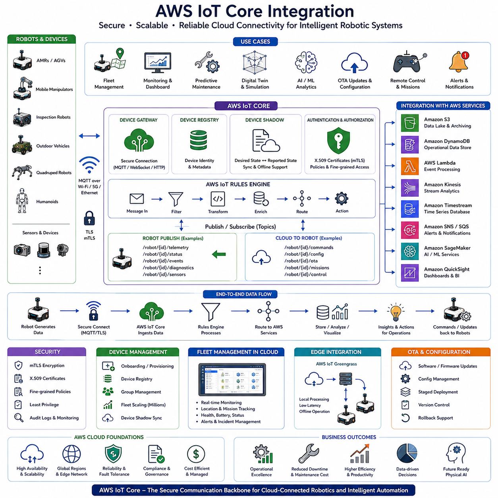
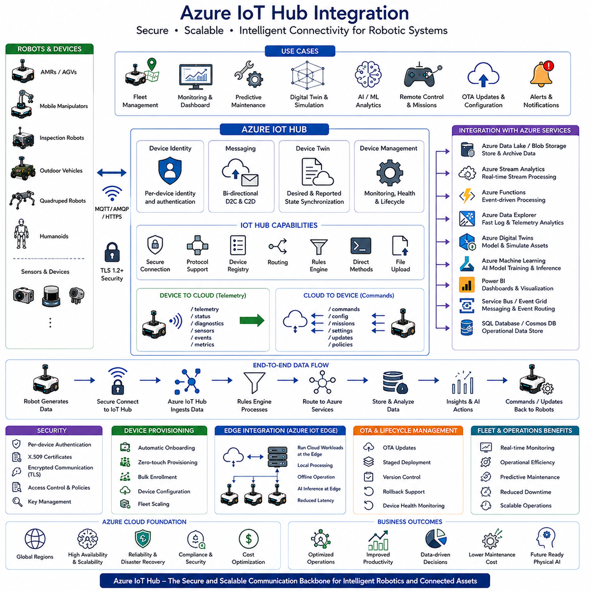
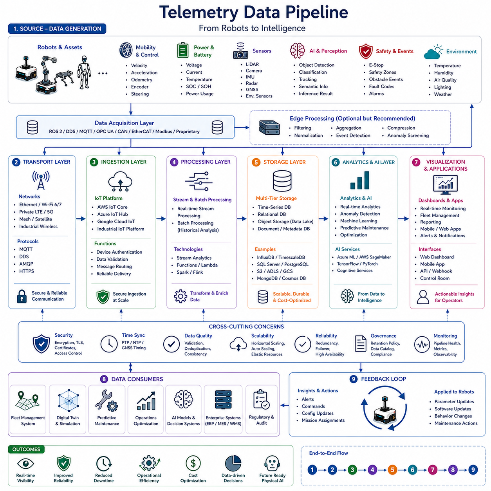
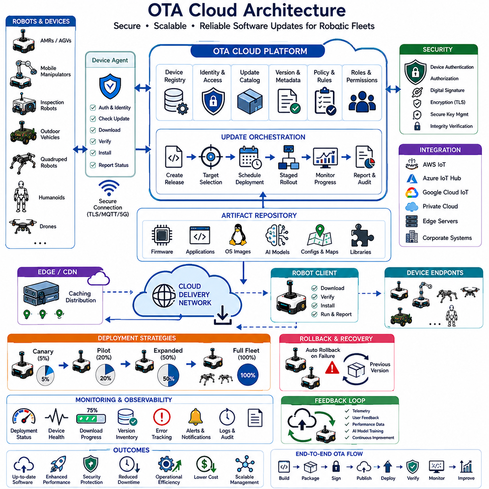
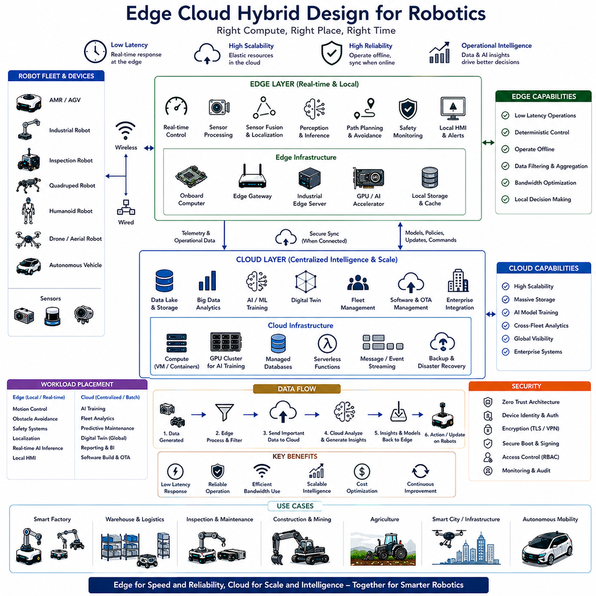

**Volume 09 Robotics Communication**

# Chapter 8. Cloud Communication

## 8.1 AWS IoT Core Integration

{width="7.268055555555556in" height="7.268055555555556in"}

AWS IoT Core Integration은 현대 로보틱스, 산업용 사물인터넷(IIoT), 자율주행 시스템, 스마트팩토리, 그리고 미래의 Physical AI 생태계에서 가장 중요한 클라우드 통신 아키텍처 중 하나이다. 로봇 시스템이 독립적인 장비에서 연결된 지능형 플랫폼으로 발전하면서 클라우드 연결은 선택 사항이 아니라 필수 요소가 되고 있다. 자율주행 모바일 로봇(AMR), 무인운반차(AGV), 모바일 매니퓰레이터, 검사 로봇, 실외 자율주행 차량, 사족보행 로봇, 휴머노이드, 그리고 대규모 플릿 시스템은 운영 과정에서 막대한 양의 데이터를 생성한다. 이러한 데이터는 수집, 저장, 분석, 최적화 과정을 거쳐 운영 효율 향상과 의사결정에 활용되어야 한다. AWS IoT Core는 이러한 로봇과 지능형 장비를 클라우드와 안전하게 연결하는 확장 가능하고 고가용성의 플랫폼을 제공한다. 로봇 클라우드 통신 아키텍처에서 AWS IoT Core는 물리적 로봇, 엣지 컴퓨팅, 클라우드 분석 플랫폼, 디지털 트윈, 인공지능 서비스, 기업 업무 시스템을 연결하는 중심 허브 역할을 수행한다.

전통적인 로봇 시스템은 주로 로컬 제어기와 폐쇄형 네트워크 환경에서 운영되었다. 생성되는 데이터는 현장에서만 사용되거나 저장된 후 활용되지 않는 경우가 많았다. 그러나 현대 로봇은 텔레메트리 데이터, 위치 정보, 센서 데이터, 진단 로그, 영상 데이터, 임무 수행 정보, 플릿 운영 데이터, 환경 데이터, AI 추론 결과 등을 지속적으로 생성한다. 이러한 데이터는 운영 최적화, 예지보전, 성능 분석, 디지털 트윈 구축, 머신러닝 학습 등에 매우 중요한 자산이 된다. AWS IoT Core는 로봇과 클라우드 사이의 안전한 통신 경로를 제공함으로써 이러한 데이터를 실제 가치로 전환할 수 있도록 지원한다.

AWS IoT Core는 수십억 개의 장치와 수조 개의 메시지를 처리할 수 있도록 설계된 관리형(Managed) 클라우드 서비스이다. 로봇과 엣지 장치는 표준 프로토콜을 사용하여 AWS 클라우드에 연결할 수 있으며, AWS IoT Core는 인증, 보안 정책, 메시지 라우팅, 장치 관리, 이벤트 처리와 같은 기능을 기본적으로 제공한다. 따라서 개발자는 복잡한 통신 인프라를 직접 구축하지 않고도 클라우드 연결 로봇 시스템을 구현할 수 있다.

AWS IoT Core의 핵심 설계 철학은 Device-Centric Architecture이다. 각각의 로봇은 고유한 디지털 ID를 가진 IoT Device로 관리된다. AWS는 각 로봇과 개별적으로 보안 연결을 유지하면서도 수천 대 규모의 플릿 운영을 지원한다. 10대의 로봇을 운영하든 10,000대의 로봇을 운영하든 동일한 구조를 사용할 수 있기 때문에 매우 뛰어난 확장성을 제공한다.

AWS IoT Core의 대표적인 통신 프로토콜은 MQTT이다. MQTT는 Publish-Subscribe 구조를 사용하는 경량 메시지 프로토콜로서 로봇 시스템에 매우 적합하다. 로봇은 텔레메트리, 상태 정보, 진단 데이터, 센서 결과, 이벤트 정보를 MQTT Topic에 Publish한다. 클라우드 애플리케이션은 이를 Subscribe하여 실시간으로 데이터를 처리한다. 반대로 클라우드 시스템은 작업 명령, 설정 변경, OTA 업데이트, 미션 정보를 Publish하고 로봇이 이를 Subscribe하여 실행할 수 있다.

Publish-Subscribe 구조의 가장 큰 장점은 동일한 데이터를 여러 시스템이 동시에 사용할 수 있다는 점이다. 예를 들어 로봇의 배터리 정보는 Fleet Management System, Monitoring Dashboard, Digital Twin, Predictive Maintenance System, AI Analytics Engine이 동시에 사용할 수 있다. MQTT는 이러한 One-to-Many 구조를 매우 효율적으로 지원한다.

보안은 AWS IoT Core Integration에서 가장 중요한 요소 중 하나이다. 로봇은 생산설비, 물류 시스템, 공장 자동화, 스마트 시티와 같은 중요한 환경에서 운영되므로 보안 침해가 심각한 결과를 초래할 수 있다. AWS IoT Core는 Mutual TLS 기반 인증을 사용하여 로봇과 클라우드가 서로의 신원을 검증한다. X.509 인증서를 사용하여 허가된 장치만 네트워크에 연결할 수 있도록 보장한다.

세분화된 접근 제어 정책도 제공된다. 각 로봇은 자신이 Publish하거나 Subscribe할 수 있는 Topic에 대해서만 권한을 가진다. 이러한 최소 권한 원칙(Least Privilege Principle)은 보안 위험을 크게 감소시킨다.

AWS IoT Device Registry는 로봇 플릿의 중앙 관리 기능을 제공한다. 각 로봇은 Registry에 등록되며, 로봇 종류, 하드웨어 구성, 소프트웨어 버전, 배치 위치, 운영 상태, 유지보수 이력 등의 정보를 저장할 수 있다. 이를 통해 대규모 플릿을 체계적으로 관리할 수 있다.

AWS IoT Device Shadow는 로봇 분야에서 매우 강력한 기능이다. Device Shadow는 클라우드에 존재하는 로봇의 가상 상태 정보이다. 로봇이 일시적으로 오프라인 상태가 되더라도 클라우드 애플리케이션은 Shadow를 통해 로봇 상태를 확인하거나 변경할 수 있다. 연결이 복구되면 실제 로봇과 Shadow 상태가 자동으로 동기화된다.

예를 들어 Fleet Manager가 로봇의 최대 속도, 작업 우선순위, 안전 설정, 운영 모드를 변경하고자 할 경우 해당 정보를 Device Shadow에 기록할 수 있다. 로봇이 다시 연결되면 자동으로 해당 설정을 수신하여 적용한다. 이는 운영 유연성과 안정성을 크게 향상시킨다.

텔레메트리 수집은 AWS IoT Core의 대표적인 활용 사례이다. 로봇은 배터리 상태, 모터 온도, 위치 정확도, 작업 상태, 통신 품질, 센서 상태 등을 지속적으로 전송한다. AWS IoT Core는 이러한 데이터를 수집하는 중앙 게이트웨이 역할을 수행하며, 이후 다양한 AWS 서비스로 전달된다.

AWS IoT Rules Engine은 수신된 데이터를 자동으로 처리할 수 있도록 지원한다. MQTT 메시지를 필터링하고 변환한 후 Amazon DynamoDB, Amazon S3, AWS Lambda, Amazon Kinesis, Amazon SNS와 같은 서비스로 자동 전달할 수 있다. 예를 들어 배터리 잔량이 특정 수준 이하로 떨어지면 자동으로 알람을 생성하거나 충전 작업을 예약할 수 있다.

예지보전(Predictive Maintenance)은 AWS IoT Core의 가장 큰 가치 중 하나이다. 모터 마모, 배터리 열화, 센서 이상, 통신 문제 등은 대부분 사전에 징후를 나타낸다. AWS IoT Core를 통해 수집된 데이터를 머신러닝으로 분석하면 장애 발생 전에 문제를 발견할 수 있다. 이는 유지보수 비용 감소와 가동률 향상으로 이어진다.

Fleet Management System 역시 AWS IoT Core와 밀접하게 연동된다. 운영자는 클라우드를 통해 로봇의 위치, 작업 상태, 배터리 수준, 교통 상황, 생산성 정보를 실시간으로 확인할 수 있다. 또한 원격에서 임무를 배정하고 우선순위를 변경하며 운영 효율을 최적화할 수 있다.

디지털 트윈(Digital Twin)은 AWS IoT Core 활용의 또 다른 핵심 분야이다. 실제 로봇에서 수집된 데이터를 기반으로 가상 공간에 동일한 로봇 환경을 구축할 수 있다. 이를 통해 성능 분석, 경로 최적화, 병목 구간 분석, 장애 예측 등을 수행할 수 있다.

인공지능과의 통합도 매우 중요하다. AWS는 다양한 AI 및 머신러닝 서비스를 제공하며, AWS IoT Core를 통해 수집된 데이터를 학습 및 추론에 활용할 수 있다. 컴퓨터 비전, 이상 탐지, 예측 분석, 강화학습, 생성형 AI, 대규모 언어 모델(LLM) 기반 서비스가 모두 AWS IoT Core와 연계될 수 있다.

엣지 컴퓨팅(Edge Computing)은 클라우드 아키텍처의 중요한 보완 요소이다. 모든 데이터를 클라우드로 전송하면 지연 시간이 증가할 수 있으므로 일부 기능은 현장에서 실행되어야 한다. AWS IoT Greengrass는 클라우드 기능을 Edge Device로 확장하여 로컬 환경에서도 AWS 서비스를 활용할 수 있게 해준다. 이 구조는 클라우드의 확장성과 엣지의 저지연 특성을 동시에 제공한다.

OTA(Over-The-Air) 업데이트 역시 AWS IoT Core의 중요한 활용 분야이다. 수백 대의 로봇에 새로운 소프트웨어, AI 모델, 운영체제 패치, 설정 변경을 배포하는 작업은 매우 복잡할 수 있다. AWS IoT Core는 이러한 업데이트를 안전하게 관리하고 배포하며, 필요 시 롤백 기능도 제공한다.

데이터 저장 전략도 중요하다. 로봇 데이터는 종류에 따라 저장 방식이 달라진다. 텔레메트리는 시계열 데이터베이스에 저장될 수 있으며, 로그는 객체 스토리지에 보관될 수 있다. AWS IoT Core는 Amazon S3, DynamoDB, Timestream, Aurora, Redshift 등 다양한 저장소와 쉽게 연동된다.

AWS의 글로벌 인프라는 대규모 국제 플릿 운영에 매우 유리하다. 물류센터, 공장, 병원, 공항, 항만이 여러 국가에 분산되어 있더라도 동일한 클라우드 구조를 사용할 수 있다. 이는 글로벌 기업이 표준화된 운영 체계를 구축하는 데 큰 장점을 제공한다.

의료, 제약, 항공우주, 자동차, 물류 산업은 엄격한 규제를 요구한다. AWS는 다양한 국제 인증과 보안 표준을 지원하기 때문에 이러한 산업에서도 안전하게 활용할 수 있다.

미래의 Physical AI 시대에는 AWS IoT Core의 중요성이 더욱 커질 것이다. AMR, 휴머노이드, 사족보행 로봇, 드론, 자율주행차, 산업용 로봇팔, 스마트 인프라가 하나의 클라우드 기반 생태계 안에서 연결될 것이다. 미래에는 단순한 텔레메트리뿐만 아니라 지식(Knowledge), 경험(Experience), 계획(Plan), 추론 결과(Reasoning Result)까지 공유하게 될 것이다.

클라우드 기반 AI 에이전트는 수천 대의 로봇을 동시에 관리하고 협조시킬 수 있게 될 것이다. 디지털 트윈은 미래 운영 시나리오를 지속적으로 시뮬레이션하고, 연합학습(Federated Learning)은 여러 로봇이 데이터를 공유하지 않고도 공동으로 AI 모델을 발전시키는 환경을 제공할 것이다.

결론적으로 AWS IoT Core Integration은 단순한 클라우드 연결 기술이 아니다. 이는 물리적 세계의 로봇과 디지털 세계의 클라우드, AI, 디지털 트윈, 분석 플랫폼, 기업 시스템을 연결하는 통합 통신 아키텍처이다. AWS IoT Core는 안전성, 확장성, 신뢰성을 기반으로 현대 로봇 플릿 운영을 지원하며, Industry 4.0과 미래 Physical AI 생태계를 실현하는 핵심 기반 기술로 자리 잡고 있다.

## 8.2 Azure IoT Hub Integration

{width="7.268055555555556in" height="7.268055555555556in"}

Azure IoT Hub Integration은 현대 로보틱스, 산업 자동화, 자율주행 시스템, 스마트 제조, 그리고 미래의 Physical AI 생태계를 위한 가장 중요한 클라우드 연결 아키텍처 중 하나이다. 로봇 시스템이 점점 더 연결되고 지능화되며 데이터 중심으로 발전함에 따라 클라우드 인프라와의 안전한 통신은 필수 요소가 되고 있다. 자율주행 모바일 로봇(AMR), 무인운반차(AGV), 모바일 매니퓰레이터, 물류 로봇, 검사 로봇, 실외 자율주행 차량, 사족보행 로봇, 휴머노이드, 산업용 로봇은 지속적으로 방대한 운영 데이터를 생성한다. 이러한 데이터에는 텔레메트리, 센서 측정값, 위치 정보, 진단 정보, 유지보수 기록, 영상 데이터, 작업 수행 정보, 인공지능 추론 결과 등이 포함된다. Azure IoT Hub는 이러한 로봇과 클라우드 서비스를 연결하는 안전하고 확장 가능한 통신 플랫폼을 제공하며, 클라우드 기반 분석 시스템, 디지털 트윈, AI 플랫폼, 기업 업무 시스템과 로봇을 연결하는 핵심 게이트웨이 역할을 수행한다.

Industry 4.0과 산업용 IoT 기술의 발전은 클라우드 기반 로봇 아키텍처의 중요성을 크게 증가시켰다. 과거의 로봇은 공장 내부 네트워크와 로컬 제어기 중심으로 운영되었지만, 현대의 로봇은 플릿 관리, 예지보전, 디지털 트윈, 원격 모니터링, AI 모델 배포, 기업 시스템 연계 등을 위해 클라우드와 지속적으로 연결되어야 한다. Azure IoT Hub는 이러한 요구사항을 지원하는 핵심 통신 인프라를 제공하며 높은 보안성과 확장성, 신뢰성을 보장한다.

Azure IoT Hub는 지능형 장치와 클라우드 애플리케이션 간의 양방향 통신을 지원하는 완전 관리형(Managed) 클라우드 서비스이다. 일반적인 메시징 서비스와 달리 Azure IoT Hub는 대규모 산업용 IoT 환경을 위해 설계되었으며 수백만 대의 장치를 관리할 수 있다. 따라서 수십 대에서 수천 대 규모까지 확장 가능한 로봇 플릿 구축에 적합하다.

Azure IoT Hub의 핵심 개념 중 하나는 Device Identity Management이다. 클라우드에 연결되는 모든 로봇은 고유한 디지털 ID를 가진다. 이 ID는 인증(Authentication), 권한 관리(Authorization), 통신 제어, 모니터링, 장치 수명주기 관리의 기반이 된다. 로봇 수가 증가하더라도 동일한 방식으로 장치를 관리할 수 있기 때문에 운영 효율성이 높다.

Azure IoT Hub는 MQTT, AMQP, HTTPS와 같은 다양한 통신 프로토콜을 지원한다. MQTT는 경량 구조와 낮은 대역폭 사용량 덕분에 로봇 시스템에서 가장 널리 사용된다. MQTT를 이용하면 로봇은 텔레메트리를 클라우드로 전송하고, 클라우드는 명령과 설정 정보를 로봇으로 전달할 수 있다. AMQP는 엔터프라이즈 메시징에 적합하며, HTTPS는 웹 기반 서비스와의 연동에 유용하다.

양방향 통신(Bidirectional Communication)은 Azure IoT Hub의 가장 중요한 기능 중 하나이다. 로봇은 상태 정보와 센서 데이터를 클라우드로 전송하고, 동시에 클라우드로부터 작업 지시, 소프트웨어 업데이트, 운영 정책 변경, 설정 정보 등을 수신한다. 이를 통해 클라우드와 물리적 로봇이 실시간으로 상호작용할 수 있다.

텔레메트리 수집은 Azure IoT Hub 활용의 핵심이다. 로봇은 배터리 상태, 모터 온도, 위치 정확도, 센서 상태, 작업 진행 상황, 통신 품질 등 다양한 데이터를 지속적으로 생성한다. Azure IoT Hub는 이러한 데이터를 대규모로 수집하고 클라우드 서비스로 전달한다. 수집된 데이터는 분석, 시각화, 저장, 최적화 과정에 활용된다.

Device-to-Cloud 메시징은 로봇이 자신의 상태를 클라우드에 보고하는 기능이다. 이를 통해 운영자는 로봇의 상태를 실시간으로 파악할 수 있으며, 예지보전과 운영 최적화를 수행할 수 있다. 예를 들어 AMR은 배터리 전압, 모터 온도, 엔코더 데이터, 장애물 감지 이벤트, 위치 정확도, 작업 통계를 주기적으로 전송할 수 있다.

Cloud-to-Device 메시징은 클라우드가 로봇에 명령을 전달하는 기능이다. Fleet Management System은 새로운 작업을 할당하거나 속도 제한을 변경하고, 안전 설정을 조정하거나 진단 요청을 수행할 수 있다. 이를 통해 클라우드는 단순 모니터링을 넘어 로봇 운영에 직접 참여하게 된다.

Azure IoT Hub의 Direct Methods 기능은 로봇 관리에 매우 유용하다. 클라우드 애플리케이션은 특정 로봇에 직접 명령을 실행할 수 있다. 예를 들어 진단 시작, 로그 수집, 소프트웨어 재시작, 센서 보정, 상태 보고 요청과 같은 작업을 원격으로 수행할 수 있다. 이러한 요청은 응답(Response)을 반환하므로 원격 관리가 매우 용이하다.

Device Twin은 Azure IoT Hub의 가장 강력한 기능 중 하나이다. Device Twin은 클라우드 상에 존재하는 로봇의 가상 표현이다. 여기에는 Desired Properties와 Reported Properties가 저장된다. 클라우드는 로봇에 적용해야 할 설정을 Desired Properties에 기록하고, 로봇은 현재 상태를 Reported Properties로 보고한다. 두 상태는 자동으로 동기화된다.

Device Twin을 활용하면 대규모 플릿 관리가 훨씬 쉬워진다. 예를 들어 최대 속도, 안전 거리, 내비게이션 설정, AI 모델 버전 등을 Device Twin에서 변경할 수 있으며, 로봇은 연결되는 즉시 해당 설정을 적용한다. 이는 운영 유연성과 관리 효율성을 크게 향상시킨다.

Azure IoT Hub는 Azure Digital Twins와도 긴밀하게 연동된다. Digital Twin은 실제 로봇이나 공장, 창고, 물류센터를 가상 공간에 그대로 복제한 모델이다. Azure IoT Hub를 통해 수집된 데이터는 실시간으로 디지털 트윈을 업데이트하며, 이를 통해 시뮬레이션, 최적화, 미래 예측, 운영 분석을 수행할 수 있다.

플릿 관리 시스템은 Azure IoT Hub와 결합될 때 더욱 강력해진다. 여러 지역에 분산된 로봇 플릿의 위치, 작업 상태, 배터리 수준, 유지보수 상태, 생산성 정보를 중앙에서 모니터링할 수 있다. 운영자는 하나의 대시보드에서 전체 플릿을 관리하고 최적화할 수 있다.

예지보전(Predictive Maintenance)은 Azure IoT Hub의 대표적인 가치 중 하나이다. 모터 진동, 배터리 열화, 센서 오차, 통신 품질 저하와 같은 문제는 실제 고장이 발생하기 전에 징후를 나타낸다. Azure의 머신러닝 서비스를 활용하면 이러한 데이터를 분석하여 고장을 사전에 예측할 수 있다. 이를 통해 가동 중단 시간을 줄이고 유지보수 비용을 절감할 수 있다.

인공지능과의 통합도 중요한 특징이다. Azure는 Machine Learning, Cognitive Services, Computer Vision, Anomaly Detection, Reinforcement Learning, Generative AI와 같은 다양한 AI 서비스를 제공한다. Azure IoT Hub를 통해 수집된 로봇 데이터는 이러한 AI 서비스의 입력으로 사용될 수 있다. 이를 통해 경로 최적화, 이상 감지, 성능 예측, 자율 의사결정이 가능해진다.

엣지 컴퓨팅은 Azure IoT 아키텍처에서 중요한 역할을 한다. 모든 데이터를 클라우드로 보내면 지연 시간이 발생하기 때문에 일부 기능은 현장에서 실행되어야 한다. Azure IoT Edge는 클라우드 기능을 Edge Device로 확장하여 로컬 환경에서도 AI와 데이터 분석 기능을 수행할 수 있도록 지원한다.

Azure IoT Edge는 컨테이너 기반 애플리케이션을 로봇 또는 Edge Server에 직접 배포할 수 있게 해준다. AI 모델, 센서 처리 파이프라인, 분석 서비스, 통신 모듈 등을 로컬에서 실행하면서도 중앙에서 관리할 수 있다. 이를 통해 클라우드의 확장성과 엣지의 저지연 특성을 동시에 활용할 수 있다.

소프트웨어 수명주기 관리도 Azure IoT Hub의 중요한 기능이다. 로봇 플릿은 지속적인 소프트웨어 업데이트, AI 모델 개선, 보안 패치, 설정 변경이 필요하다. Azure IoT Hub는 안전한 OTA(Over-The-Air) 업데이트를 지원하며, 수백 대 또는 수천 대의 로봇에 동시에 업데이트를 배포할 수 있다. 업데이트 상태를 추적하고 필요 시 롤백도 가능하다.

보안은 클라우드 로보틱스의 핵심 요소이다. Azure IoT Hub는 장치별 인증, 암호화된 통신, 인증서 기반 보안, 접근 제어 정책, 키 관리 시스템을 제공한다. 이를 통해 산업용 로봇 인프라를 사이버 공격으로부터 보호할 수 있다.

Azure Device Provisioning Service는 대규모 로봇 배포를 자동화한다. 새로운 로봇이 추가될 때 수동으로 설정하지 않아도 자동으로 적절한 Azure IoT Hub에 등록되고 필요한 설정이 적용된다. 이를 통해 플릿 구축 시간을 크게 단축할 수 있다.

Azure IoT Hub는 기업 시스템과의 연계에도 강점을 가진다. 로봇은 단독으로 운영되는 것이 아니라 ERP, MES, WMS, CRM, BI 시스템과 연동되어야 한다. Azure는 이러한 엔터프라이즈 서비스와 자연스럽게 통합되므로 로봇 운영과 기업 비즈니스 프로세스를 하나의 생태계로 연결할 수 있다.

데이터 분석 기능 역시 매우 강력하다. Azure Stream Analytics, Azure Data Explorer, Azure Synapse Analytics, Power BI 등을 활용하면 플릿 활용률, 배터리 수명, 생산성 지표, 유지보수 패턴, 교통 병목 현상 등을 분석할 수 있다. 이를 통해 운영 효율성을 지속적으로 향상시킬 수 있다.

Azure IoT Hub는 글로벌 확장성도 제공한다. 여러 국가와 지역에 분산된 공장, 물류센터, 병원, 공항에서도 동일한 아키텍처를 사용할 수 있으며, 지역별 규제와 데이터 주권 요구사항도 지원할 수 있다.

미래의 Physical AI 시대에는 Azure IoT Hub의 역할이 더욱 확대될 것이다. AMR, 휴머노이드, 사족보행 로봇, 드론, 자율주행차, 산업용 로봇팔, 스마트 인프라가 하나의 클라우드-엣지 생태계 안에서 연결될 것이다. 이들은 단순한 텔레메트리를 넘어 지식(Knowledge), 경험(Experience), 계획(Plan), 추론 결과(Reasoning Output)를 공유하게 될 것이다.

클라우드 기반 AI 에이전트는 대규모 로봇 플릿을 조정하고 작업 우선순위를 관리하며 자원 활용을 최적화할 수 있다. 디지털 트윈은 미래 시나리오를 지속적으로 시뮬레이션하며, Federated Learning은 데이터 프라이버시를 유지하면서도 여러 로봇이 공동으로 AI 모델을 개선할 수 있도록 지원할 것이다.

결론적으로 Azure IoT Hub Integration은 단순한 클라우드 연결 기술이 아니라 물리적 로봇과 클라우드 지능을 연결하는 통합 통신 아키텍처이다. 안전한 통신, 대규모 장치 관리, 실시간 텔레메트리 처리, OTA 업데이트, 디지털 트윈 연동, AI 통합 기능을 제공함으로써 차세대 클라우드 기반 로봇 생태계를 가능하게 한다. Industry 4.0, 자율주행 시스템, 그리고 미래의 Physical AI 기술이 발전할수록 Azure IoT Hub는 전 세계 규모의 지능형 로봇 운영을 지원하는 핵심 플랫폼으로 자리매김할 것이다.

## 8.3 Telemetry Data Pipeline

{width="7.268055555555556in" height="7.268055555555556in"}

Telemetry Data Pipeline은 현대 로보틱스, 산업용 사물인터넷(IIoT), 자율주행 차량, 스마트팩토리, 클라우드 로보틱스, 그리고 미래의 Physical AI 생태계에서 가장 핵심적인 아키텍처 구성 요소 중 하나이다. 로봇 시스템이 점점 더 자율화되고 연결되며 지능화됨에 따라 운영 과정에서 방대한 양의 데이터를 지속적으로 생성하게 된다. 이러한 데이터는 수집, 전송, 처리, 저장, 분석, 그리고 의사결정에 활용될 수 있는 형태로 변환되어야 한다. 텔레메트리는 로봇의 디지털 신경망과 같은 역할을 하며, 시스템 상태, 환경 정보, 임무 수행 상황, 장비 건강 상태, 운영 성능에 대한 실시간 가시성을 제공한다. Telemetry Data Pipeline은 이러한 정보가 물리적 로봇에서 시작되어 엣지 시스템, 클라우드 플랫폼, 분석 엔진, 인공지능 시스템, 디지털 트윈, 그리고 기업 애플리케이션으로 전달되는 전체 데이터 흐름 인프라를 의미한다.

초기의 로봇 시스템에서 텔레메트리는 배터리 상태, 모터 온도, 오류 코드, 운영 상태와 같은 단순한 정보에 국한되었다. 또한 대부분의 데이터는 로컬에 저장되었으며 유지보수 시에만 활용되는 경우가 많았다. 그러나 현대의 자율주행 모바일 로봇(AMR), 무인운반차(AGV), 물류 로봇, 검사 로봇, 실외 자율주행 차량, 사족보행 로봇, 휴머노이드, 드론, 산업용 로봇은 수천 개 이상의 텔레메트리 데이터를 지속적으로 생성한다. 여기에는 위치 추정 정보, 내비게이션 상태, 센서 관측 결과, 환경 조건, 통신 품질, 전력 소비, 액추에이터 성능, AI 추론 결과, 안전 이벤트, 작업 수행 정보 등이 포함된다. 따라서 텔레메트리는 단순한 유지보수 데이터가 아니라 운영 지능을 창출하는 핵심 자산으로 발전하였다.

Telemetry Data Pipeline의 주요 목적은 로봇에서 생성된 정보를 필요한 시스템으로 안정적이고 효율적으로 전달하는 것이다. 이를 위해 데이터 수집, 전처리, 전송, 수집(Ingestion), 저장, 변환, 분석, 시각화, 피드백 생성이라는 여러 단계가 존재한다. 각 단계는 데이터 품질과 시스템 확장성, 운영 효율성에 직접적인 영향을 미친다.

파이프라인은 데이터 생성(Source Layer)에서 시작된다. 로봇 내부에는 다양한 서브시스템이 존재하며 각각이 독립적으로 데이터를 생성한다. 주행 제어기는 속도, 가속도, 엔코더 정보, 조향각, 오도메트리 데이터를 생성한다. 배터리 관리 시스템은 전압, 전류, 온도, 충전 상태, 배터리 건강 상태를 제공한다. 센서 시스템은 LiDAR 정보, 카메라 메타데이터, Radar 측정값, IMU 출력, GNSS 정보, 환경 센서 데이터를 생성한다. 인공지능 시스템은 객체 검출 결과, 분류 결과, 의미 기반 인식 정보, 경로 계획 결과를 생성한다. 안전 시스템은 비상정지, 충돌 회피 동작, 안전 구역 침범, 위험 감지 이벤트를 생성한다.

데이터 수집 계층은 이러한 분산된 정보를 통합한다. 현대 로봇 시스템에서는 ROS 2, DDS, MQTT, OPC UA, CAN Bus, EtherCAT, Modbus와 같은 미들웨어를 사용하여 데이터를 수집한다. 이를 통해 하드웨어와 소프트웨어 전반에서 생성되는 텔레메트리를 중앙적으로 관리할 수 있다.

수집된 데이터는 전송 전에 전처리 과정을 거친다. 전처리 단계에서는 필터링, 집계, 정규화, 압축, 타임스탬프 동기화, 이벤트 검출, 이상 데이터 제거 등의 작업이 수행된다. 예를 들어 IMU는 초당 수백 번의 데이터를 생성하고, 모터 제어기는 수천 번 이상의 업데이트를 생성할 수 있다. 이러한 원시 데이터를 그대로 전송하는 것은 비효율적이므로 중요한 정보만 추출하여 전송한다.

시간 동기화(Time Synchronization)는 텔레메트리 파이프라인에서 매우 중요하다. 서로 다른 센서와 제어기가 생성한 데이터는 동일한 시간 기준을 사용해야 정확한 분석이 가능하다. IEEE 1588 PTP, NTP, GNSS 기반 시간 동기화, Hardware Timestamp 기술 등이 활용된다. 정확한 시간 정보는 센서 융합, 이벤트 분석, 원인 추적, 디지털 트윈 동기화의 기반이 된다.

데이터는 이후 전송 계층(Transport Layer)으로 이동한다. 이 계층은 로봇과 엣지 서버, 플릿 관리 시스템, 클라우드 플랫폼을 연결하는 통신 인프라이다. Ethernet, Wi-Fi 6, Wi-Fi 7, Private LTE, 5G, Mesh Network, 위성 통신 등이 사용될 수 있다. 전송 계층은 충분한 대역폭과 낮은 지연 시간, 높은 신뢰성, 강력한 보안을 제공해야 한다.

통신 프로토콜은 텔레메트리 전송의 핵심 요소이다. MQTT는 경량 구조와 Publish-Subscribe 모델 덕분에 가장 널리 사용된다. DDS는 실시간 로봇 시스템에 적합한 결정론적 통신을 제공한다. AMQP는 엔터프라이즈 메시징 환경에 적합하며, HTTPS는 클라우드 서비스와의 연계를 지원한다.

전송된 데이터는 수집(Ingestion) 계층으로 들어간다. AWS IoT Core, Azure IoT Hub, Google Cloud IoT 플랫폼과 같은 서비스는 대규모 장치에서 발생하는 데이터를 수집하고 처리한다. 이 단계에서는 장치 인증, 데이터 검증, 보안 정책 적용, 메시지 전달 보장이 수행된다.

텔레메트리 파이프라인은 실시간 스트리밍 처리와 배치 처리 두 가지 방식을 모두 지원해야 한다. 스트리밍 처리는 실시간 모니터링, 이상 탐지, 안전 분석, 즉각적인 의사결정에 사용된다. 배치 처리는 장기적인 추세 분석, 머신러닝 학습, 운영 보고서 생성에 활용된다.

데이터 저장은 파이프라인의 핵심 요소이다. 서로 다른 데이터 유형은 서로 다른 저장 전략을 필요로 한다. 고주파 시계열 데이터는 Time-Series Database에 저장되고, 이벤트 로그는 관계형 데이터베이스에 저장될 수 있다. 센서 원본 데이터는 Object Storage에 저장되며, 설정 정보와 메타데이터는 문서형 데이터베이스에 저장될 수 있다.

시계열 데이터베이스(Time-Series Database)는 로봇 시스템에서 특히 중요하다. 텔레메트리는 시간 정보를 포함하므로 시간 축 기반 분석이 필요하다. 이를 통해 성능 추세 분석, 이상 현상 조사, 운영 조건 비교, 시스템 거동 분석이 가능하다.

데이터 변환(Data Transformation)은 원시 데이터를 고수준 정보로 변환하는 과정이다. 예를 들어 단순한 배터리 전압 데이터는 충전 상태(State of Charge), 남은 운행 시간, 배터리 건강 상태로 변환될 수 있다. 이러한 변환은 데이터의 활용 가치를 크게 높여준다.

실시간 분석(Real-Time Analytics)은 텔레메트리 파이프라인의 가장 중요한 활용 분야 중 하나이다. 분석 엔진은 지속적으로 들어오는 데이터를 평가하여 이상 상황을 탐지하고 알람을 생성하며 운영 의사결정을 지원한다. 과열, 통신 장애, 위치 오차, 안전 이벤트, 비정상적인 동작은 실시간 분석을 통해 즉시 감지될 수 있다.

인공지능은 텔레메트리를 주요 학습 데이터로 활용한다. 머신러닝 모델은 예지보전, 이상 탐지, 에너지 최적화, 경로 계획, 교통 예측, 자율 의사결정에 텔레메트리 데이터를 사용한다. 데이터 품질이 높을수록 AI 성능도 향상된다.

예지보전(Predictive Maintenance)은 가장 성공적인 활용 사례 중 하나이다. 모터 진동, 온도 상승, 배터리 열화, 센서 드리프트, 액추에이터 마모와 같은 현상은 고장 전에 나타난다. 머신러닝 모델은 이러한 패턴을 학습하여 장애를 사전에 예측할 수 있다. 이를 통해 가동 중단 시간을 줄이고 유지보수 비용을 절감할 수 있다.

플릿 관리 시스템은 텔레메트리에 크게 의존한다. 운영자는 로봇 위치, 작업 진행 상황, 배터리 상태, 통신 품질, 활용률, 교통 상황 등을 실시간으로 파악해야 한다. 텔레메트리는 중앙 집중식 플릿 운영과 최적화를 가능하게 한다.

디지털 트윈 역시 텔레메트리 없이는 존재할 수 없다. 디지털 트윈은 실제 로봇이나 운영 환경의 가상 복제본이며, 지속적인 텔레메트리 업데이트를 통해 현실과 동기화된다. 이를 통해 시뮬레이션, 성능 최적화, 미래 예측, 운영 계획 수립이 가능해진다.

시각화 시스템은 텔레메트리를 사람이 이해할 수 있는 형태로 변환한다. 대시보드, 모니터링 시스템, 모바일 앱, 관제센터 화면은 텔레메트리를 기반으로 운영 상황을 보여준다. 이를 통해 운영자는 문제를 신속하게 발견하고 의사결정을 수행할 수 있다.

텔레메트리는 규제 준수와 감사(Audit)에도 활용된다. 의료, 항공, 자동차, 물류와 같은 산업에서는 운영 기록을 장기간 보관해야 한다. 텔레메트리 데이터는 사고 조사와 규제 대응에 필요한 근거 자료를 제공한다.

보안(Security)은 텔레메트리 전체 수명주기에서 매우 중요하다. 텔레메트리에는 민감한 운영 정보가 포함될 수 있으므로 암호화, 인증, 접근 제어, 인증서 관리, 데이터 거버넌스 체계가 필요하다.

확장성(Scalability) 또한 중요한 설계 요소이다. 단일 로봇만으로도 초당 수천 개의 데이터 포인트가 생성될 수 있으며, 수백 대 규모의 플릿은 하루에 수십억 건의 데이터를 생성할 수 있다. 따라서 클라우드 네이티브 아키텍처, 분산 저장소, 스트리밍 플랫폼이 필수적으로 요구된다.

엣지 컴퓨팅은 현대 텔레메트리 아키텍처에서 점점 더 중요해지고 있다. 모든 데이터를 클라우드로 전송하는 것은 비효율적일 수 있다. 엣지 장치에서 데이터 필터링, 압축, 분석을 수행하면 대역폭을 절약하고 응답 속도를 향상시킬 수 있다.

미래의 Physical AI 환경에서는 텔레메트리 규모가 폭발적으로 증가할 것이다. 휴머노이드, 사족보행 로봇, 자율주행차, 드론, 산업용 로봇팔, 스마트 인프라가 동시에 운영되면서 지금보다 훨씬 더 많은 데이터를 생성하게 된다. 텔레메트리 파이프라인은 단순한 모니터링 시스템이 아니라 집단 지능과 분산 학습을 지원하는 지식 인프라로 발전할 것이다.

대규모 언어 모델(LLM), Vision-Language-Action(VLA), Multi-Agent AI는 텔레메트리를 단순한 센서 데이터가 아니라 상황 이해를 위한 지식 자원으로 활용하게 될 것이다. 미래의 텔레메트리는 측정값뿐만 아니라 의미 정보, 추론 결과, 작업 의도, 환경 이해 정보까지 포함하게 될 것이다.

결론적으로 Telemetry Data Pipeline은 현대 로봇 생태계의 정보 백본(Information Backbone)이다. 이는 물리적 로봇과 클라우드, AI, 디지털 트윈, 분석 시스템, 플릿 관리 플랫폼, 기업 애플리케이션을 연결하는 핵심 인프라이다. 텔레메트리 파이프라인은 단순한 데이터 수집 체계를 넘어 운영 데이터를 지능으로 변환하는 역할을 수행하며, Industry 4.0, Cloud Robotics, Autonomous Fleet, 그리고 미래 Physical AI 시대를 가능하게 하는 가장 중요한 기반 기술 중 하나가 될 것이다.

## 8.4 OTA Cloud Architecture

{width="7.268055555555556in" height="7.268055555555556in"}

OTA Cloud Architecture(Over-The-Air Cloud Architecture)는 현대 로보틱스, 자율주행 차량, 산업용 사물인터넷(IIoT), 스마트 제조 시스템, 커넥티드 디바이스, 그리고 미래의 Physical AI 플랫폼에서 가장 중요한 핵심 기술 중 하나이다. 로봇 플릿의 규모가 커지고 시스템이 복잡해지며 지능화될수록, 소프트웨어를 수동으로 설치하고 유지보수하는 방식은 현실적으로 한계에 도달하게 된다. 자율주행 모바일 로봇(AMR), 무인운반차(AGV), 창고 로봇, 검사 로봇, 사족보행 로봇, 휴머노이드, 실외 자율주행 차량, 드론, 산업용 로봇은 여러 공장, 물류센터, 도시, 국가에 분산되어 운영될 수 있다. 이러한 환경에서 소프트웨어 버전의 일관성을 유지하고 보안 패치를 적용하며 새로운 기능을 배포하기 위해서는 중앙 클라우드에서 원격으로 업데이트를 수행할 수 있는 구조가 필요하다. OTA Cloud Architecture는 이러한 요구를 충족하기 위해 소프트웨어, 펌웨어, 설정 정보, AI 모델, 운영체제 패치를 안전하게 배포하고 관리하는 전체 인프라를 제공한다.

과거의 로봇 시스템은 소프트웨어를 업데이트하기 위해 엔지니어가 직접 현장에 방문해야 했다. 노트북을 연결하고 수동으로 프로그램을 설치한 후 동작을 검증해야 했다. 그러나 수백 대 또는 수천 대의 로봇을 운영하는 환경에서는 이러한 방식이 비용과 시간 측면에서 비효율적이다. 현대의 로봇 시스템은 지속적인 기능 개선, 보안 업데이트, 성능 향상, AI 모델 개선이 필요하며, OTA는 이를 원격으로 수행할 수 있도록 해준다.

OTA Cloud Architecture의 핵심 목적은 개발 환경에서 생성된 소프트웨어 자산을 실제 운영 중인 로봇에 안전하고 안정적으로 전달하는 것이다. 이를 위해 소프트웨어 패키징, 버전 관리, 배포 계획, 대상 장치 선정, 설치, 검증, 롤백, 모니터링, 감사(Audit), 수명주기 관리 등의 기능이 통합적으로 제공된다. OTA는 단순한 파일 전송 기술이 아니라 로봇 소프트웨어 전체 수명주기를 관리하는 플랫폼이라 할 수 있다.

OTA 아키텍처의 시작점은 소프트웨어 개발 환경이다. 로봇 소프트웨어는 Git 기반 소스 관리, CI/CD 파이프라인, 자동 테스트, 시뮬레이션 검증, 릴리즈 관리 과정을 거쳐 생성된다. 개발자가 코드를 수정하면 자동 빌드 시스템이 실행되어 실행 파일, 컨테이너 이미지, 펌웨어 패키지, 운영체제 이미지, AI 모델, 설정 파일, 내비게이션 지도 등의 배포 가능한 아티팩트(Artifact)를 생성한다.

CI/CD(Continuous Integration / Continuous Deployment)는 OTA 환경의 핵심 구성 요소이다. 새로운 코드가 저장소에 등록되면 자동으로 컴파일, 단위 테스트(Unit Test), 통합 테스트(Integration Test), 보안 검사(Security Scan), 정적 코드 분석(Static Analysis), 성능 검증이 수행된다. 검증을 통과한 결과물만 릴리즈 저장소로 이동하여 실제 배포 후보가 된다. 이를 통해 소프트웨어 품질을 향상시키고 배포 위험을 최소화할 수 있다.

아티팩트 저장소(Artifact Repository)는 OTA 시스템의 중요한 구성 요소이다. 모든 소프트웨어 패키지는 중앙 저장소에 저장되며 버전 정보, 의존성 정보, 호환성 정보, 배포 조건, 롤백 정책, 릴리즈 노트 등이 함께 관리된다. 이를 통해 어떤 버전이 어떤 로봇에 배포되었는지 추적할 수 있다.

클라우드 관리 계층(Cloud Management Layer)은 OTA 아키텍처의 중앙 제어 시스템이다. 운영자는 이 계층을 통해 배포 정책을 정의하고, 대상 장치를 선택하며, 배포 일정을 관리하고, 진행 상황을 모니터링한다. 또한 실패 상황에 대응하고 전체 플릿의 업데이트 상태를 실시간으로 확인할 수 있다.

장치 식별(Device Identity Management)은 OTA의 필수 요소이다. 각 로봇은 고유한 디지털 ID를 가지고 있어야 하며, 이를 통해 하드웨어 종류, 소프트웨어 버전, 운영 상태, 위치, 소유자 정보를 식별할 수 있다. 이러한 정보는 적절한 소프트웨어를 적절한 장치에만 배포하기 위해 필요하다.

보안(Security)은 OTA Cloud Architecture의 가장 중요한 요소 중 하나이다. 소프트웨어 업데이트는 로봇의 동작을 직접 변경할 수 있기 때문에 악성 코드가 배포될 경우 매우 심각한 결과를 초래할 수 있다. 따라서 OTA 시스템은 여러 단계의 보안 메커니즘을 적용한다.

디지털 서명(Digital Signature)은 OTA 보안의 핵심 기술이다. 모든 소프트웨어 패키지는 암호학적으로 서명되며, 로봇은 설치 전에 해당 서명을 검증한다. 서명이 유효하지 않거나 변조가 의심될 경우 설치를 거부한다. 이를 통해 공급망 공격(Supply Chain Attack)이나 파일 변조를 방지할 수 있다.

암호화(Encryption) 역시 필수적이다. OTA 패키지는 TLS 기반 암호화 채널을 통해 전송되며, 상호 인증(Mutual Authentication)을 통해 클라우드와 로봇이 서로의 신원을 검증한다. 이를 통해 도청, 위변조, 무단 접근을 방지할 수 있다.

OTA 시스템은 Ethernet, Wi-Fi 6, Wi-Fi 7, Private LTE, 5G, 위성 통신, 산업용 무선 네트워크 등 다양한 통신 환경에서 동작해야 한다. 네트워크 품질이 일정하지 않더라도 안정적으로 업데이트를 수행할 수 있어야 하므로 강력한 통신 관리 기능이 요구된다.

확장성(Scalability)은 OTA 설계의 핵심 요소이다. 10대의 로봇을 업데이트하는 것과 10,000대의 로봇을 업데이트하는 것은 전혀 다른 문제이다. 대규모 OTA 시스템은 네트워크 트래픽 관리, 다운로드 스케줄링, 진행 상황 모니터링, 서버 부하 분산을 지원해야 한다. 이를 위해 클라우드 네이티브 인프라와 CDN(Content Delivery Network)이 활용된다.

로봇은 일반적으로 그룹(Group) 단위로 관리된다. 예를 들어 창고 로봇, 검사 로봇, 실외 순찰 로봇, 특정 고객사 로봇, 특정 국가의 로봇 등으로 분류할 수 있다. 운영자는 특정 그룹에만 업데이트를 적용할 수 있으며 이를 통해 세밀한 배포 전략을 수립할 수 있다.

단계적 배포(Staged Deployment)는 OTA 운영에서 매우 중요하다. 모든 로봇에 동시에 업데이트를 적용하는 대신 일부 로봇에서 먼저 검증한 후 점진적으로 확대 적용하는 방식이다. 이를 통해 문제 발생 시 영향을 최소화할 수 있다.

Canary Deployment는 대표적인 단계적 배포 방식이다. 전체 플릿 중 일부 로봇에만 새로운 버전을 먼저 적용하고 성능, 오류율, 안전성, 사용자 피드백을 모니터링한다. 이상이 없으면 전체 플릿으로 확장한다.

OTA 패키지는 다양한 형태를 가질 수 있다. 펌웨어 업데이트는 임베디드 컨트롤러를 수정하고, 운영체제 업데이트는 플랫폼 안정성과 보안을 개선한다. 애플리케이션 업데이트는 새로운 기능을 추가하며, AI 모델 업데이트는 인식 및 판단 성능을 향상시킨다. 설정 파일 업데이트는 운영 정책을 변경하고, 지도 데이터 업데이트는 환경 변화를 반영한다.

인공지능 시대에는 OTA의 중요성이 더욱 증가한다. 최신 로봇은 머신러닝 모델에 크게 의존한다. 객체 인식 모델, 경로 계획 모델, 이상 탐지 모델, 강화학습 정책, 대규모 언어 모델(LLM) 구성 요소 등이 지속적으로 개선되기 때문에 정기적인 OTA 배포가 필요하다. AI 모델은 일반 소프트웨어보다 용량이 크기 때문에 저장소와 네트워크 설계에 추가적인 고려가 필요하다.

엣지 컴퓨팅은 OTA 효율성을 높이는 중요한 요소이다. Edge Server를 중간 배포 지점으로 활용하면 모든 로봇이 클라우드에서 직접 다운로드할 필요가 없다. 로컬 네트워크 내에서 빠르게 배포할 수 있으며 네트워크 사용량도 줄어든다.

버전 관리(Version Management)는 OTA 운영의 핵심이다. 운영자는 현재 플릿 전체의 버전 상태를 파악할 수 있어야 하며, 이를 통해 문제 분석, 규제 대응, 호환성 검증, 운영 계획 수립이 가능하다.

의존성 관리(Dependency Management)도 중요하다. 로봇 소프트웨어는 특정 운영체제, 라이브러리, 펌웨어, 드라이버 버전에 의존하는 경우가 많다. OTA 시스템은 이러한 의존성을 관리하여 충돌 없이 업데이트가 이루어지도록 해야 한다.

신뢰성(Reliability)은 OTA 성공의 핵심이다. 네트워크 끊김, 전원 장애, 저장 공간 부족, 하드웨어 문제, 예상치 못한 운영 상황이 발생할 수 있다. 따라서 OTA 시스템은 이어받기 다운로드(Resume Download), 무결성 검증, 트랜잭션 기반 설치, 자동 복구 기능을 제공해야 한다.

롤백(Rollback)은 OTA의 가장 중요한 안전 기능 중 하나이다. 새로운 버전에서 문제가 발생하면 이전 버전으로 즉시 복구할 수 있어야 한다. 많은 산업용 시스템은 이를 위해 이중 파티션 구조(A/B Partition)를 사용한다.

모니터링과 관찰성(Observability)은 OTA 운영의 필수 요소이다. 클라우드 대시보드는 다운로드 진행 상황, 설치 성공률, 오류 이벤트, 배포 상태, 네트워크 품질을 실시간으로 표시한다. 운영자는 이를 통해 문제를 조기에 발견하고 대응할 수 있다.

감사(Audit)와 규제 준수(Compliance)는 의료, 항공, 자동차, 물류 산업에서 매우 중요하다. OTA 시스템은 소프트웨어 버전, 설치 이력, 검증 결과, 롤백 기록, 승인 정보 등을 모두 저장하여 규제 기관의 요구사항을 충족할 수 있어야 한다.

디지털 트윈은 OTA와 밀접하게 연계된다. 새로운 소프트웨어는 실제 배포 전에 디지털 트윈 환경에서 시뮬레이션될 수 있다. 이를 통해 성능 영향, 안전성, 호환성 문제를 사전에 검증할 수 있으며 실제 운영 환경의 위험을 크게 줄일 수 있다.

OTA Cloud Architecture의 가장 큰 장점은 하드웨어를 교체하지 않고도 지속적으로 로봇을 개선할 수 있다는 점이다. 내비게이션 알고리즘은 더 효율적으로 발전할 수 있고, AI 모델은 더 높은 정확도를 달성할 수 있으며, 배터리 관리 알고리즘은 운행 시간을 늘릴 수 있다. 이러한 모든 개선이 원격으로 수행될 수 있다.

미래의 Physical AI 시대에는 OTA가 더욱 중요한 역할을 수행하게 된다. 휴머노이드, 자율주행차, 사족보행 로봇, 드론, 산업용 로봇팔, 협업 로봇, 스마트 인프라가 클라우드 기반 생태계 안에서 운영될 것이며, 지속적인 소프트웨어 진화가 경쟁력과 안전성을 결정하게 될 것이다.

대규모 언어 모델(LLM), Vision-Language-Action(VLA), Foundation Model, Multi-Agent AI, Autonomous Reasoning Engine과 같은 기술은 지속적인 업데이트가 필요하다. 미래의 OTA는 단순한 소프트웨어뿐만 아니라 지식 모델(Knowledge Model), 의미 정보(Semantic Representation), 행동 정책(Behavior Policy), 집단 지능(Collective Intelligence)까지 배포하는 플랫폼으로 발전할 것이다.

결론적으로 OTA Cloud Architecture는 현대 연결형 로봇 시스템의 소프트웨어 생명주기를 관리하는 핵심 인프라이다. 클라우드 인프라, 사이버 보안, 배포 자동화, 버전 관리, AI 모델 배포, 모니터링, 운영 거버넌스를 통합하여 로봇 시스템이 항상 최신 상태와 최고 성능을 유지하도록 지원한다. Industry 4.0, Cloud Robotics, Autonomous Fleet, 그리고 미래 Physical AI 생태계가 발전할수록 OTA Cloud Architecture는 지속적인 혁신과 운영 효율성을 보장하는 가장 중요한 기반 기술 중 하나가 될 것이다.

## 8.5 Edge Cloud Hybrid Design

{width="7.268055555555556in" height="7.268055555555556in"}

Edge Cloud Hybrid Design은 현대 로보틱스, 자율주행 시스템, 산업 자동화, 클라우드 로보틱스, 스마트팩토리, 그리고 미래의 Physical AI 생태계를 위한 가장 중요한 아키텍처 패러다임 중 하나이다. 로봇 시스템이 점점 더 지능화되고 데이터 중심으로 발전함에 따라, 순수한 엣지 기반 아키텍처나 순수한 클라우드 기반 아키텍처만으로는 모든 요구사항을 만족시키기 어렵다. 현대 로봇은 실시간 제어, 저지연 의사결정, 고속 센서 처리, 대규모 데이터 분석, 인공지능 학습, 플릿 관리, 디지털 트윈 동기화, 기업 시스템 연동을 동시에 수행해야 한다. Edge Cloud Hybrid Design은 이러한 요구사항을 충족하기 위해 엣지 컴퓨팅과 클라우드 컴퓨팅을 결합하여 각각의 장점을 활용하고 단점을 최소화하는 구조를 제공한다.

과거의 로봇 시스템은 대부분 로컬 컴퓨팅 환경에서 운영되었다. 산업용 로봇, AGV, 자동화 장비는 PLC, 산업용 PC, 임베디드 컨트롤러를 중심으로 동작하였다. 이러한 구조는 낮은 지연 시간과 높은 결정성을 제공했지만, 연산 능력과 저장 공간이 제한적이었다. 이후 클라우드 기술과 AI 기술이 발전하면서 많은 기능이 클라우드로 이동하기 시작하였다. 그러나 모든 기능을 클라우드에 의존하는 경우 네트워크 지연, 연결 장애, 대역폭 부족, 안전성 문제와 같은 새로운 과제가 발생하였다. Edge Cloud Hybrid Design은 이러한 두 가지 접근법의 균형점을 제공하는 현대적인 아키텍처이다.

이 아키텍처의 핵심 원칙은 워크로드 최적 배치(Workload Placement Optimization)이다. 각 작업을 가장 적절한 위치에서 수행하도록 배치함으로써 성능, 비용, 신뢰성, 보안, 확장성을 동시에 확보한다. 즉각적인 응답이 필요한 작업은 엣지에서 처리하고, 대규모 연산이 필요한 작업은 클라우드에서 처리한다.

엣지 계층(Edge Layer)은 로봇과 물리적으로 가까운 위치에 존재하는 컴퓨팅 인프라를 의미한다. 여기에는 로봇 내부 컴퓨터, 산업용 엣지 서버, 엣지 게이트웨이, GPU 기반 엣지 장치, 현장 데이터센터 등이 포함된다. 엣지 계층은 지연 시간이 매우 중요한 작업을 담당한다. 모션 제어, 장애물 회피, 안전 모니터링, 비상 정지, 위치 추정, 센서 융합, 경로 계획, 실시간 인식 기능이 대표적이다.

예를 들어 자율주행 모바일 로봇은 창고 내부를 이동하면서 LiDAR, 카메라, IMU, 엔코더 데이터를 지속적으로 처리해야 한다. 장애물이 갑자기 나타나면 수 밀리초 내에 회피 결정을 내려야 한다. 이러한 작업을 클라우드에 의존할 경우 네트워크 지연 때문에 안전성을 보장할 수 없다. 따라서 실시간 의사결정은 반드시 엣지에서 수행되어야 한다.

클라우드는 사실상 무제한의 연산 자원과 저장 공간을 제공한다. 대규모 데이터 분석, AI 학습, 플릿 최적화, 디지털 트윈 운영, 소프트웨어 관리, 장기 데이터 보관, 기업 시스템 연동과 같은 작업은 클라우드가 훨씬 적합하다. 클라우드는 실시간 제어에는 적합하지 않지만, 대규모 연산과 중앙 집중식 관리에는 매우 강력한 장점을 제공한다.

인공지능은 Edge Cloud Hybrid Design의 대표적인 활용 사례이다. 최신 AI 모델을 학습시키기 위해서는 H100, B100과 같은 대규모 GPU 클러스터가 필요하다. 이러한 학습 작업은 클라우드에서 수행된다. 반면 학습된 모델을 이용한 추론(Inference)은 로봇 내부의 GPU나 Edge Server에서 수행된다. 즉, 학습은 클라우드에서, 추론은 엣지에서 수행하는 것이 일반적인 구조이다.

데이터 흐름 측면에서 보면 로봇은 텔레메트리, 센서 데이터, 진단 정보, 환경 정보, 작업 상태 데이터를 지속적으로 생성한다. 엣지 시스템은 이러한 데이터를 즉시 처리하여 로컬 의사결정을 수행한다. 이후 필요한 정보만 클라우드로 전송하여 저장, 분석, 학습, 최적화를 수행한다. 클라우드에서 생성된 결과는 다시 엣지로 전달되어 운영 정책이나 AI 모델에 반영된다.

데이터 필터링은 하이브리드 구조의 중요한 기능이다. 현대 로봇은 초당 수 GB 수준의 데이터를 생성할 수 있다. 고해상도 카메라, LiDAR, Radar, Depth Camera는 엄청난 양의 원시 데이터를 생성한다. 모든 데이터를 클라우드로 전송하는 것은 비효율적이므로 엣지에서 중요한 정보만 추출하여 전송한다.

대역폭 최적화 역시 매우 중요하다. 수백 대 이상의 로봇이 동시에 운영되는 환경에서는 네트워크 사용량이 급격히 증가한다. 엣지 컴퓨팅은 로컬에서 데이터를 처리함으로써 클라우드 전송량을 크게 줄일 수 있다. 또한 이벤트 기반(Event-Driven) 통신 구조를 사용하여 중요한 정보만 전송하도록 설계할 수 있다.

지연 시간(Latency)은 워크로드 배치 결정의 핵심 요소이다. 안전 시스템, 모터 제어, 충돌 회피, 위치 추정과 같은 기능은 엣지에서 수행되어야 한다. 반면 예지보전, 운영 보고서 생성, 플릿 최적화, AI 모델 재학습은 클라우드에서 수행하는 것이 적절하다.

신뢰성(Reliability)은 Edge Cloud Hybrid Design의 가장 큰 장점 중 하나이다. 순수 클라우드 구조에서는 인터넷 장애나 클라우드 서비스 장애가 발생하면 시스템 전체가 영향을 받을 수 있다. 반면 하이브리드 구조에서는 핵심 기능이 엣지에 존재하므로 클라우드 연결이 끊겨도 로봇은 계속 동작할 수 있다.

오프라인 운영(Offline Operation)은 산업 환경에서 매우 중요하다. 광산, 터널, 항만, 건설 현장, 대형 창고와 같은 환경에서는 네트워크 품질이 항상 일정하지 않다. 엣지 시스템은 연결이 끊긴 상황에서도 로봇이 안전하게 임무를 수행할 수 있도록 지원한다. 연결이 복구되면 데이터는 자동으로 클라우드와 동기화된다.

엣지 서버는 로봇과 클라우드 사이의 중간 계층 역할을 수행한다. 엣지 서버는 텔레메트리 수집, 로컬 데이터 분석, 플릿 관리, 캐싱(Cache), 로컬 디지털 트윈 운영 등을 담당한다. 이를 통해 응답 속도를 향상시키고 클라우드 의존성을 줄일 수 있다.

플릿 관리 시스템은 하이브리드 구조를 가장 잘 활용하는 대표적인 사례이다. 실시간 교통 제어, 작업 할당, 충돌 회피는 엣지에서 수행된다. 반면 장기적인 운영 최적화, 생산성 분석, 다중 사이트 통합 관리는 클라우드에서 수행된다.

디지털 트윈 역시 하이브리드 구조와 매우 잘 결합된다. 엣지 계층은 실시간 운영 데이터를 반영하는 로컬 디지털 트윈을 유지한다. 클라우드는 공장 전체, 물류센터 전체, 공급망 전체를 포함하는 대규모 디지털 트윈을 운영한다. 두 계층은 지속적으로 동기화된다.

사이버 보안은 Edge Cloud Hybrid Design에서 매우 중요하다. 엣지 장치는 물리적으로 접근 가능한 위치에 존재하기 때문에 물리적 공격 위험이 존재한다. 반면 클라우드는 접근 제어와 데이터 보안 문제가 중요하다. 따라서 암호화, 인증, 인증서 관리, Secure Boot, Zero Trust Network, 침입 탐지 시스템 등이 함께 적용된다.

Identity and Access Management는 하이브리드 보안의 기반이다. 모든 로봇, 서버, 사용자, 클라우드 서비스는 고유한 디지털 ID를 가져야 하며, 역할 기반 접근 제어(Role-Based Access Control)를 통해 권한을 관리해야 한다.

AI 워크로드는 앞으로 하이브리드 구조의 중요성을 더욱 높일 것이다. 컴퓨터 비전, LLM(Large Language Model), 강화학습, 이상 탐지, 의미 기반 이해, 자율 의사결정과 같은 기능은 엣지와 클라우드에 분산되어 실행될 것이다.

예를 들어 검사 로봇은 객체 인식과 장애물 회피를 로컬 GPU에서 수행한다. 반면 수개월 동안의 검사 결과를 분석하여 이상 패턴을 찾는 작업은 클라우드에서 수행된다. 이후 개선된 AI 모델이 OTA를 통해 다시 엣지 장치에 배포된다.

데이터 거버넌스(Data Governance)와 규제 준수(Compliance)도 하이브리드 구조에서 중요한 요소이다. 의료, 항공우주, 자동차, 물류, 국방 산업은 데이터 저장 위치와 접근 권한에 대한 엄격한 규정을 가진다. 하이브리드 구조는 민감한 데이터를 로컬에 유지하면서도 클라우드 분석의 장점을 활용할 수 있게 해준다.

운영 분석(Operational Analytics)은 하이브리드 구조의 또 다른 중요한 활용 분야이다. 엣지는 실시간 모니터링을 제공하고, 클라우드는 공장 전체 또는 기업 전체 수준의 분석을 수행한다. 이를 통해 생산성, 에너지 소비, 유지보수 패턴, 플릿 활용률, 안전성 지표를 분석할 수 있다.

소프트웨어 수명주기 관리 역시 하이브리드 구조에 자연스럽게 통합된다. 클라우드는 CI/CD, 버전 관리, OTA 배포를 담당한다. 엣지는 업데이트 수신, 검증, 테스트, 실제 설치를 담당한다. 이를 통해 지속적인 개선과 안정적인 운영을 동시에 달성할 수 있다.

미래의 Physical AI 환경에서는 Edge Cloud Hybrid Design이 필수적인 구조가 될 것이다. 휴머노이드, 사족보행 로봇, 자율주행차, 드론, 산업용 로봇팔, 협동로봇, 스마트 인프라가 하나의 통합된 생태계 안에서 운영될 것이다. 실시간 자율성은 엣지에서 제공되고, 집단 지능과 대규모 학습은 클라우드에서 수행될 것이다.

대규모 언어 모델(LLM), Vision-Language-Action(VLA), Foundation Model, Multi-Agent AI 시스템은 엣지와 클라우드 간의 지식 공유를 더욱 확대할 것이다. 미래의 로봇은 단순히 데이터를 교환하는 것이 아니라 경험, 지식, 의미 정보, 추론 결과를 공유하게 될 것이다.

결론적으로 Edge Cloud Hybrid Design은 현대 로봇 시스템의 계산 인프라를 구성하는 핵심 아키텍처이다. 엣지는 저지연, 고신뢰성, 자율성을 제공하고, 클라우드는 확장성, 집단 지능, 중앙 집중식 관리를 제공한다. 이 둘을 결합함으로써 조직은 높은 성능, 높은 신뢰성, 강력한 보안성, 우수한 확장성을 동시에 확보할 수 있다. Industry 4.0, Cloud Robotics, Autonomous Fleet, 그리고 미래 Physical AI 시대가 발전할수록 Edge Cloud Hybrid Design은 가장 중요한 시스템 아키텍처 중 하나로 자리 잡게 될 것이다.
