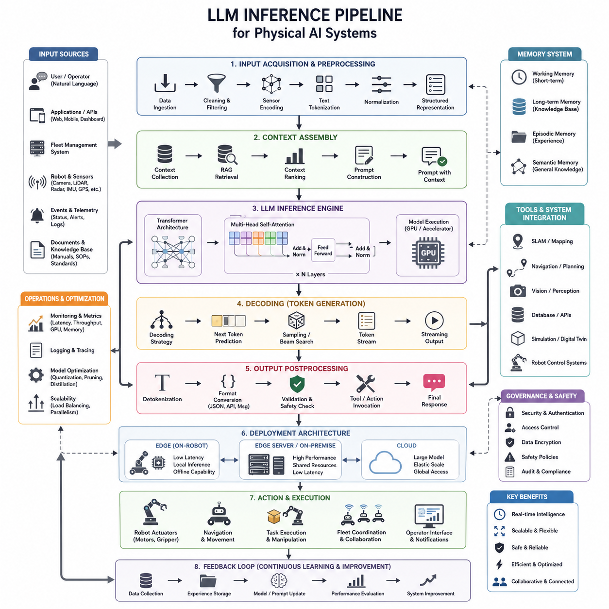
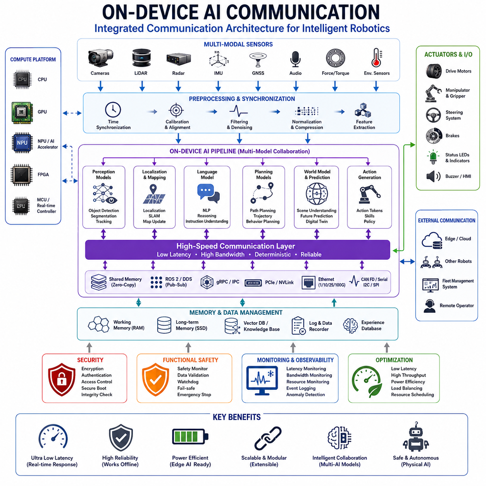
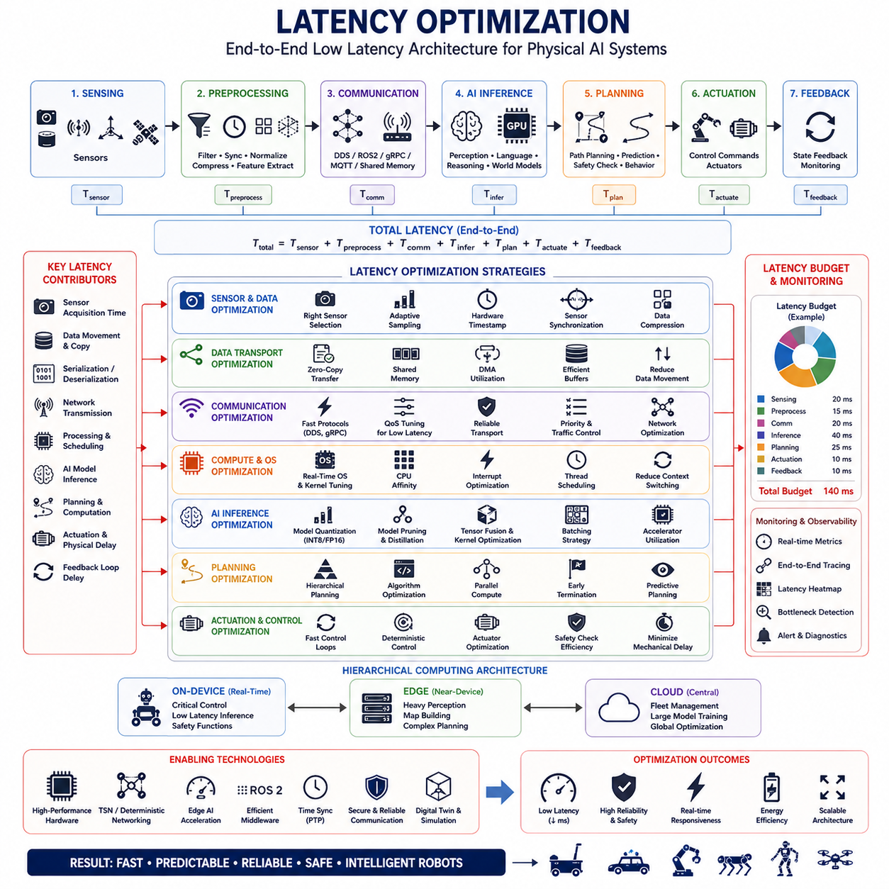
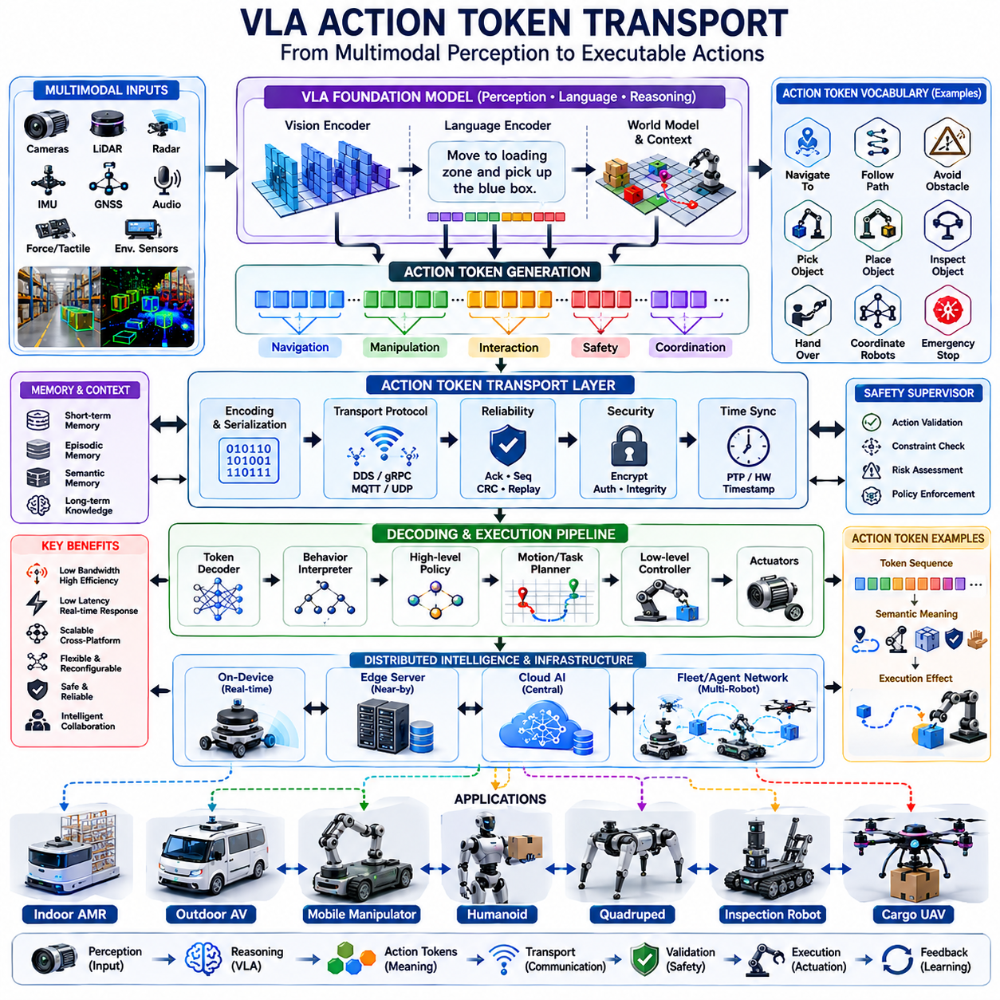
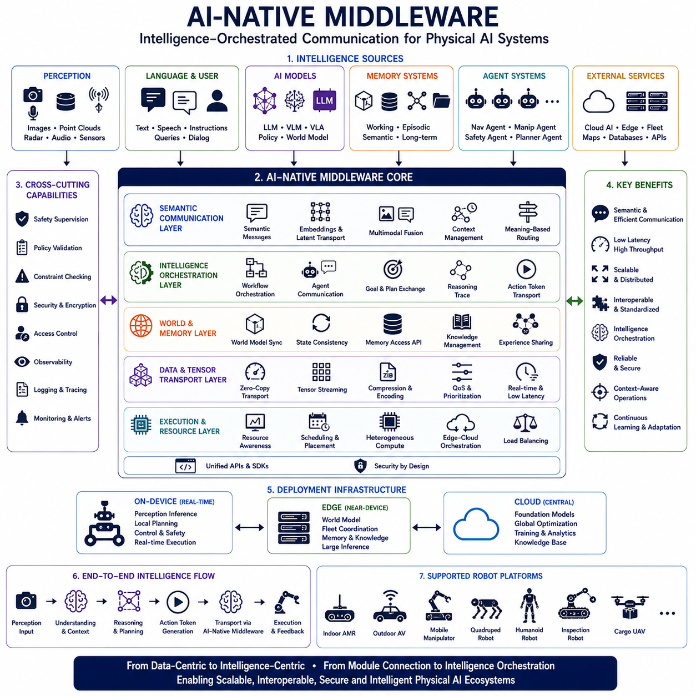

**Volume 09 Robotics Communication**


# Chapter 9. Physical AI Networks

##  

## 9.1 LLM Inference Pipeline

{width="7.268055555555556in" height="7.268055555555556in"}

The LLM Inference Pipeline is the fundamental execution framework that transforms user inputs into meaningful intelligent outputs through a sequence of computational stages. In Physical AI systems, autonomous mobile robots, humanoid robots, quadruped robots, mobile manipulators, industrial inspection systems, and future cargo UAV platforms, the inference pipeline serves as the central nervous system that converts perception, memory, reasoning, planning, and communication into executable actions. Within the Physical AI Networks section of the robotics communication architecture, the LLM inference pipeline is not merely a software component but a distributed communication architecture connecting sensors, edge computers, GPU accelerators, middleware layers, cloud services, fleet management systems, and robot actuators into a unified intelligence framework.

Traditional robotics systems typically rely on deterministic software modules where perception, localization, planning, and control operate as independent subsystems. Modern Physical AI systems increasingly incorporate Large Language Models as cognitive engines capable of understanding natural language, interpreting mission objectives, reasoning about environmental conditions, generating task plans, coordinating multiple robots, and interacting with human operators. The inference pipeline provides the operational pathway through which these cognitive capabilities are executed in real time while maintaining safety, determinism, scalability, and communication efficiency.

The pipeline begins with input acquisition. User instructions may originate from a fleet management platform, industrial control center, web dashboard, mobile application, voice interface, operator terminal, or another autonomous agent. Inputs can include natural language commands, structured API requests, mission plans, telemetry events, safety alerts, maintenance reports, or multimodal sensor observations. In advanced Physical AI systems, the input stage often combines language data with camera images, LiDAR point clouds, radar detections, GNSS measurements, robot status information, environmental maps, and historical operational records.

Once the input is received, preprocessing begins. This stage converts heterogeneous information into formats suitable for model consumption. Text inputs undergo tokenization, where words, symbols, and linguistic structures are transformed into numerical representations. Sensor information may be compressed, summarized, encoded, or transformed into semantic descriptions. Images may be processed by vision encoders, while point clouds may be processed through spatial perception models. The objective is to construct a unified representation that can be interpreted by the reasoning engine.

Tokenization plays a crucial role in the efficiency of the inference pipeline. Modern tokenizers decompose natural language into subword units that can be processed efficiently by transformer architectures. The selection of tokenization strategies directly affects latency, memory utilization, context length, and computational throughput. In industrial deployments where real-time responses are required, optimized tokenization pipelines reduce overhead and improve end-to-end system performance.

Following preprocessing, context assembly occurs. This stage collects all relevant information required to answer a query or execute a mission. Context may include operational procedures, robot manuals, safety regulations, environmental maps, fleet status information, maintenance histories, previous conversations, mission objectives, and sensor observations. Context assembly is particularly important because modern LLMs operate within finite context windows. Efficient context selection determines the quality of reasoning and response generation.

Retrieval-Augmented Generation architectures are commonly integrated into this stage. Rather than storing all knowledge directly within model parameters, external knowledge repositories provide dynamically retrieved information. Vector databases, document stores, mission repositories, engineering standards, and robot operation manuals become accessible through semantic retrieval systems. The retrieval engine identifies relevant information and injects it into the prompt before inference begins.

Prompt construction follows context assembly. The prompt acts as the interface between external information and the language model. Effective prompt design provides clear instructions, operational constraints, safety requirements, environmental context, and expected output formats. In industrial robotics applications, prompts often include mission objectives, robot status information, workspace constraints, operational procedures, and safety policies.

The core inference engine is responsible for executing transformer computations. Modern LLM architectures utilize multi-head self-attention mechanisms, feed-forward neural networks, positional encoding systems, normalization layers, and optimization strategies to process large sequences of tokens. During inference, tokens propagate through multiple transformer layers where contextual relationships are continuously refined.

Attention mechanisms enable the model to determine which pieces of information are most relevant for generating the next token. Unlike traditional sequential processing systems, attention allows the model to analyze relationships across the entire context window simultaneously. This capability is particularly valuable in robotics applications where reasoning may depend on information distributed across sensor observations, mission instructions, operational procedures, and historical data.

Inference computation typically occurs on GPU accelerators due to the enormous computational demands of transformer architectures. Modern robotics systems increasingly deploy NVIDIA GPU platforms, edge AI servers, Jetson-based modules, and dedicated AI accelerators to support real-time inference. Depending on mission requirements, inference may execute locally on the robot, on nearby edge servers, or within cloud infrastructures.

The decoding stage generates output tokens sequentially. Various decoding strategies can be employed depending on system requirements. Greedy decoding prioritizes deterministic outputs. Beam search explores multiple candidate sequences. Sampling-based approaches introduce controlled randomness for creative or exploratory tasks. Temperature settings influence response diversity, while top-k and top-p sampling methods regulate token selection probabilities.

For safety-critical robotic applications, deterministic decoding is generally preferred. Autonomous navigation, industrial inspection, maintenance operations, and safety monitoring systems require predictable behavior. Excessive randomness can introduce operational risks, making constrained decoding strategies essential for reliable deployments.

As tokens are generated, intermediate outputs may be streamed to downstream systems. Streaming inference reduces perceived latency and improves responsiveness. Human operators can observe generated responses in real time, while robotic subsystems can begin processing instructions before complete responses are finalized. Streaming architectures are particularly valuable in conversational interfaces, teleoperation systems, and collaborative robotics environments.

Output postprocessing transforms generated tokens into actionable information. Natural language responses may be presented directly to operators. Structured outputs may be converted into JSON messages, API commands, ROS2 service requests, MQTT messages, gRPC payloads, or actuator instructions. The conversion process ensures compatibility between cognitive reasoning modules and physical execution systems.

Tool invocation represents an increasingly important component of modern inference pipelines. Rather than relying solely on internal model knowledge, LLMs can invoke external tools, databases, APIs, simulation environments, planning systems, perception modules, and robotic control frameworks. Tool usage extends model capabilities beyond language generation and enables interaction with real-world systems.

In robotics deployments, tools may include SLAM systems, navigation planners, digital twins, fleet management platforms, maintenance databases, computer vision services, sensor processing pipelines, and industrial control systems. The LLM acts as an orchestration layer that coordinates specialized computational resources to achieve mission objectives.

Reasoning loops further enhance system intelligence. Rather than generating responses in a single pass, advanced inference pipelines perform iterative reasoning cycles. Intermediate conclusions are evaluated, refined, validated, and expanded before final outputs are produced. This process improves accuracy, consistency, and robustness in complex operational environments.

Memory management is another critical aspect of the inference pipeline. Working memory stores temporary information relevant to current tasks, while long-term memory preserves operational knowledge across missions. Episodic memory records historical experiences, and semantic memory captures generalized knowledge structures. Effective memory architectures enable continuous learning and adaptation without requiring model retraining.

In fleet robotics systems, distributed inference architectures are increasingly common. Multiple robots may share computational resources through edge computing infrastructures. Lightweight models operate locally for low-latency decision making, while larger foundation models execute on centralized GPU clusters. This hierarchical architecture balances performance, scalability, and operational efficiency.

Communication efficiency becomes a major concern in Physical AI networks. Token streams, sensor data, perception outputs, and reasoning results must be transmitted across communication channels with minimal latency. Compression techniques, semantic communication methods, adaptive bandwidth allocation, and intelligent routing mechanisms reduce communication overhead while preserving information quality.

Latency optimization is particularly important for autonomous systems. Total inference latency includes input acquisition time, preprocessing overhead, retrieval operations, transformer computation, decoding delays, network transmission, and output execution. Each component contributes to overall response time. Industrial deployments often establish strict latency budgets to ensure safe and reliable operation.

Model optimization techniques improve inference efficiency. Quantization reduces numerical precision to lower memory consumption and increase throughput. Pruning removes unnecessary parameters. Knowledge distillation transfers capabilities from larger models to smaller models. Tensor parallelism, pipeline parallelism, and model sharding distribute computations across multiple accelerators.

Edge inference architectures are becoming increasingly important for robotics. Running inference directly on robot platforms reduces communication delays, improves privacy, increases reliability, and enables operation in disconnected environments. Edge deployment requires careful balancing of model size, computational requirements, power consumption, thermal constraints, and response time objectives.

Cloud inference architectures offer access to substantially larger models and computational resources. Complex reasoning tasks, large-scale planning operations, fleet-wide optimization, and extensive knowledge retrieval may benefit from cloud-based execution. Hybrid edge-cloud architectures combine local responsiveness with centralized intelligence, creating flexible and scalable deployment models.

Security considerations permeate every stage of the inference pipeline. Input validation prevents malicious prompts and adversarial attacks. Authentication mechanisms protect access to inference services. Encryption safeguards communication channels. Access control systems regulate resource utilization. Audit logging enables operational traceability and regulatory compliance.

Safety architectures must also be integrated into the inference pipeline. Generated outputs should pass through policy validation layers before execution. Safety monitors evaluate commands for operational risks. Rule-based verification systems ensure compliance with functional safety requirements. Human approval mechanisms may be required for critical actions.

Observability and monitoring provide operational visibility into inference performance. Metrics such as token throughput, latency, GPU utilization, memory consumption, retrieval accuracy, communication bandwidth, and response quality are continuously monitored. Telemetry systems enable proactive maintenance and performance optimization.

The emergence of Vision-Language-Action architectures represents the next evolution of inference pipelines. Rather than generating only text, these systems directly produce action representations that can be executed by robots. Perception, reasoning, planning, and control become integrated into a single end-to-end framework capable of transforming multimodal observations into physical actions.

Future Physical AI systems will likely employ hierarchical inference architectures combining foundation models, specialized expert models, edge intelligence, cloud reasoning systems, digital twins, and autonomous planning engines. Communication networks will evolve from data transport mechanisms into intelligence transport infrastructures capable of transmitting semantic knowledge, reasoning traces, action tokens, and collaborative decision-making information across distributed robotic ecosystems.

Within Hills Robotics' future Physical AI architecture, the LLM Inference Pipeline serves as the foundational intelligence pathway connecting autonomous perception, fleet communication, edge computing, cloud intelligence, multimodal reasoning, and robotic actuation. It forms the core computational framework through which indoor AMRs, outdoor autonomous vehicles, mobile manipulators, quadruped robots, humanoid systems, and future cargo UAV platforms transform information into intelligent action. As Physical AI continues to evolve, the inference pipeline will become the primary mechanism through which machines perceive, reason, communicate, collaborate, and operate autonomously within complex real-world environments.

# 09_01 LLM 추론 파이프라인 (LLM Inference Pipeline)

LLM 추론 파이프라인은 사용자 입력을 의미 있는 지능형 출력으로 변환하는 핵심 실행 프레임워크이다. Physical AI 시스템, 자율주행 로봇, 휴머노이드, 사족보행 로봇, 모바일 매니퓰레이터, 산업용 검사 시스템, 미래형 화물 UAV에 이르기까지 추론 파이프라인은 인지, 기억, 추론, 계획, 통신을 실제 행동으로 전환하는 중앙 신경계 역할을 수행한다. Physical AI Networks 관점에서 LLM 추론 파이프라인은 단순한 소프트웨어 모듈이 아니라 센서, 엣지 컴퓨터, GPU 가속기, 미들웨어, 클라우드 서비스, 플릿 관리 시스템, 로봇 액추에이터를 하나의 통합된 지능 체계로 연결하는 분산 통신 아키텍처이다.

기존 로봇 시스템은 인지, 위치추정, 경로계획, 제어가 각각 독립적으로 동작하는 결정론적 구조를 중심으로 설계되었다. 그러나 최신 Physical AI 시스템은 대규모 언어 모델을 인지 엔진으로 활용하여 자연어 이해, 임무 해석, 환경 분석, 작업 계획 생성, 다중 로봇 협업, 인간과의 상호작용을 수행한다. 추론 파이프라인은 이러한 인지 능력을 실제 시스템에서 실행하면서도 안전성, 실시간성, 확장성, 통신 효율성을 보장하는 핵심 구조가 된다.

파이프라인의 시작은 입력 수집 단계이다. 입력은 플릿 관리 시스템, 산업 제어 센터, 웹 대시보드, 모바일 애플리케이션, 음성 인터페이스, 운영자 콘솔 또는 다른 AI 에이전트로부터 전달될 수 있다. 입력 데이터는 자연어 명령, API 요청, 임무 계획, 텔레메트리 이벤트, 안전 경고, 유지보수 보고서, 센서 관측값 등 매우 다양하다. 고도화된 Physical AI 시스템에서는 언어 데이터뿐 아니라 카메라 영상, LiDAR 포인트 클라우드, 레이더 데이터, GNSS 정보, 로봇 상태 데이터, 환경 지도, 과거 운용 이력까지 함께 수집된다.

입력이 수집되면 전처리 단계가 시작된다. 이 과정에서는 서로 다른 형태의 데이터를 모델이 이해할 수 있는 형태로 변환한다. 텍스트는 토큰(Token)으로 분해되며, 센서 데이터는 요약, 압축 또는 의미적 표현으로 변환된다. 영상은 비전 인코더를 통해 특징 벡터로 변환되고, 포인트 클라우드는 공간 정보를 표현하는 임베딩 형태로 변환된다. 최종적으로 모든 정보는 하나의 통합된 표현 공간에서 모델이 처리할 수 있는 형태로 정리된다.

토큰화(Tokenization)는 추론 효율성에 직접적인 영향을 미친다. 최신 토크나이저는 단어를 서브워드 단위로 분해하여 Transformer 모델이 효율적으로 처리할 수 있도록 한다. 토큰화 방식은 지연시간, 메모리 사용량, 컨텍스트 길이, 전체 처리량에 영향을 미친다. 산업용 실시간 시스템에서는 토큰화 성능이 전체 응답 속도를 좌우하는 중요한 요소가 된다.

전처리가 완료되면 컨텍스트 조립(Context Assembly)이 수행된다. 이 단계에서는 질문에 답하거나 임무를 수행하는 데 필요한 정보를 수집한다. 여기에는 운영 매뉴얼, 안전 규정, 환경 지도, 플릿 상태, 정비 이력, 과거 대화 기록, 작업 목표, 센서 데이터 등이 포함된다. LLM은 제한된 컨텍스트 윈도우 내에서 동작하기 때문에 어떤 정보를 선택하여 제공하는지가 전체 성능을 결정한다.

이를 위해 Retrieval-Augmented Generation(RAG) 구조가 자주 사용된다. 모든 지식을 모델 내부 파라미터에 저장하는 대신 벡터 데이터베이스, 문서 저장소, 임무 데이터베이스, 엔지니어링 표준 문서, 로봇 운영 매뉴얼 등 외부 지식 저장소에서 필요한 정보를 검색하여 프롬프트에 삽입한다. 이를 통해 최신 정보와 기업 고유의 지식을 활용할 수 있다.

컨텍스트 수집 이후에는 프롬프트 구성 단계가 진행된다. 프롬프트는 외부 정보와 언어 모델 사이를 연결하는 인터페이스 역할을 한다. 프롬프트에는 작업 목표, 운영 제약 조건, 안전 규정, 환경 정보, 출력 형식 등이 포함된다. 산업용 로봇에서는 임무 설명, 로봇 상태, 작업 공간 제약 조건, 작업 절차, 안전 정책이 프롬프트에 함께 포함되는 경우가 많다.

핵심 추론 엔진은 Transformer 기반 계산을 수행한다. 현대 LLM은 Multi-Head Self-Attention, Feed Forward Network, Positional Encoding, Normalization Layer 등으로 구성된다. 입력된 토큰은 여러 Transformer 계층을 통과하며 문맥 관계가 점진적으로 정교해진다.

Attention 메커니즘은 현재 응답을 생성하기 위해 어떤 정보가 중요한지를 결정한다. 전통적인 순차 처리 방식과 달리 전체 컨텍스트 내의 관계를 동시에 분석할 수 있다. 이는 센서 데이터, 임무 지시, 작업 규정, 과거 기록이 복합적으로 연결되는 로봇 응용 분야에서 매우 중요한 특성이다.

이러한 계산은 일반적으로 GPU에서 수행된다. Transformer 모델은 매우 높은 계산량을 요구하기 때문에 NVIDIA GPU, Jetson 플랫폼, 엣지 AI 서버, 대규모 GPU 클러스터가 활용된다. 시스템 요구사항에 따라 추론은 로봇 내부, 엣지 서버 또는 클라우드 환경에서 실행될 수 있다.

추론 이후에는 디코딩 단계가 진행된다. 모델은 다음 토큰을 하나씩 생성하며 응답을 완성한다. 디코딩 방식에는 Greedy Decoding, Beam Search, Sampling 기반 방법 등이 존재한다. Temperature, Top-k, Top-p와 같은 설정은 응답 다양성과 안정성을 조절한다.

산업용 로봇 시스템에서는 일반적으로 결정론적 디코딩이 선호된다. 자율주행, 검사, 유지보수, 안전 감시와 같은 작업은 예측 가능한 동작이 중요하기 때문이다. 지나친 무작위성은 시스템 위험을 증가시킬 수 있으므로 제한된 생성 전략이 사용된다.

생성된 토큰은 스트리밍 방식으로 즉시 전달될 수 있다. 스트리밍 추론은 사용자가 응답을 기다리는 시간을 줄이고 시스템 반응성을 향상시킨다. 운영자는 생성 과정을 실시간으로 확인할 수 있으며, 로봇 시스템 역시 응답이 완료되기 전에 일부 명령을 선행 처리할 수 있다.

출력 후처리 단계에서는 생성된 결과를 실제 실행 가능한 형태로 변환한다. 자연어 응답은 운영자에게 그대로 표시될 수 있으며, 구조화된 출력은 JSON, REST API 요청, ROS2 서비스 호출, MQTT 메시지, gRPC 패킷 또는 액추에이터 명령으로 변환된다.

최근 추론 파이프라인에서 매우 중요한 기능은 Tool Calling이다. 현대 LLM은 내부 지식만 사용하는 것이 아니라 외부 API, 데이터베이스, 시뮬레이터, 계획 엔진, 비전 시스템, 로봇 제어 모듈을 호출할 수 있다. 이를 통해 언어 모델은 단순한 텍스트 생성기를 넘어 실제 시스템을 제어하는 오케스트레이터 역할을 수행한다.

로봇 분야에서는 SLAM 시스템, 경로 계획기, 디지털 트윈, 플릿 관리 서버, 유지보수 데이터베이스, 비전 인식 서비스, 센서 처리 모듈, 산업 제어 시스템 등이 주요 도구로 활용된다. LLM은 이러한 전문 모듈을 조합하여 복잡한 작업을 수행한다.

고급 추론 파이프라인은 단일 패스 방식이 아니라 반복 추론 구조를 사용한다. 중간 결과를 평가하고 수정하며 검증하는 과정을 여러 차례 반복한 후 최종 결론을 생성한다. 이러한 방식은 복잡한 환경에서 정확도와 신뢰성을 크게 향상시킨다.

메모리 관리 역시 중요한 요소이다. 작업 중 필요한 정보는 Working Memory에 저장되고, 장기적인 경험은 Long-Term Memory에 저장된다. Episodic Memory는 과거 경험을 기록하며, Semantic Memory는 일반화된 지식을 저장한다. 이러한 구조는 모델 재학습 없이도 지속적인 적응을 가능하게 한다.

플릿 로봇 환경에서는 분산 추론 구조가 널리 사용된다. 각 로봇은 경량 모델을 통해 저지연 의사결정을 수행하고, 복잡한 추론은 중앙 GPU 서버가 담당한다. 이러한 계층적 구조는 성능과 비용 사이의 균형을 제공한다.

Physical AI 네트워크에서는 통신 효율성 또한 매우 중요하다. 토큰 스트림, 센서 데이터, 인식 결과, 추론 결과가 최소 지연시간으로 전송되어야 한다. 이를 위해 압축 기술, 의미 기반 통신, 적응형 대역폭 제어, 지능형 라우팅 기술이 활용된다.

지연시간 최적화는 자율 시스템의 핵심 요구사항이다. 전체 지연시간은 입력 수집, 전처리, 검색, Transformer 계산, 디코딩, 네트워크 전송, 실행 시간의 합으로 구성된다. 산업 현장에서는 각 단계별로 엄격한 지연시간 목표가 설정된다.

모델 최적화 기술은 추론 효율성을 향상시킨다. 양자화(Quantization)는 연산 정밀도를 낮춰 메모리 사용량과 연산량을 줄인다. 프루닝(Pruning)은 불필요한 파라미터를 제거한다. 지식 증류(Knowledge Distillation)는 대형 모델의 능력을 소형 모델로 이전한다. Tensor Parallelism과 Pipeline Parallelism은 여러 GPU에 연산을 분산시킨다.

엣지 추론은 미래 로봇 시스템에서 점점 중요해지고 있다. 로봇 내부에서 직접 추론을 수행하면 통신 지연을 줄이고 개인정보를 보호하며 네트워크 연결이 없는 환경에서도 안정적으로 동작할 수 있다. 그러나 모델 크기, 전력 소비, 발열, 계산 성능 사이의 균형이 필요하다.

반면 클라우드 추론은 훨씬 큰 모델과 강력한 계산 자원을 활용할 수 있다. 복잡한 임무 계획, 플릿 최적화, 대규모 지식 검색에는 클라우드 환경이 유리하다. 따라서 실제 산업 환경에서는 엣지와 클라우드를 결합한 하이브리드 구조가 가장 널리 사용된다.

보안은 추론 파이프라인 전반에 걸쳐 적용되어야 한다. 입력 검증은 악성 프롬프트와 공격을 차단하며, 인증 시스템은 서비스 접근을 통제한다. 암호화는 통신 경로를 보호하고, 접근 제어 시스템은 자원 사용을 관리한다. 감사 로그는 운영 이력을 추적하고 규제 준수를 지원한다.

안전성 역시 필수 요소이다. 생성된 명령은 실제 실행 전에 정책 검증 단계를 통과해야 한다. 안전 모니터는 위험 명령을 차단하며, 규칙 기반 검증기는 기능 안전 요구사항 준수를 확인한다. 중요 작업의 경우 인간 승인 절차가 추가될 수 있다.

관측성과 모니터링 기능은 추론 시스템의 상태를 실시간으로 파악할 수 있도록 지원한다. 토큰 처리량, 응답 지연시간, GPU 사용률, 메모리 점유율, 검색 정확도, 네트워크 대역폭, 응답 품질 등이 지속적으로 모니터링된다.

최근 등장한 Vision-Language-Action(VLA) 아키텍처는 추론 파이프라인의 다음 단계로 평가받고 있다. 이러한 시스템은 텍스트뿐만 아니라 직접 행동 명령을 생성할 수 있다. 인식, 추론, 계획, 제어가 하나의 통합 프레임워크로 결합되어 센서 입력에서 바로 행동 출력까지 연결된다.

미래의 Physical AI 시스템은 Foundation Model, Expert Model, Edge AI, Cloud AI, Digital Twin, Autonomous Planner가 결합된 계층형 추론 구조를 사용할 것으로 예상된다. 통신 네트워크 역시 단순 데이터 전송망을 넘어 의미 정보, 추론 결과, 행동 토큰, 협업 의사결정 정보를 교환하는 지능 네트워크로 발전할 것이다.

힐스로보틱스의 미래 Physical AI 아키텍처에서 LLM 추론 파이프라인은 자율 인식, 플릿 통신, 엣지 컴퓨팅, 클라우드 AI, 멀티모달 추론, 로봇 제어를 연결하는 핵심 지능 경로가 된다. 실내 AMR, 실외 자율주행 플랫폼, 모바일 매니퓰레이터, 사족보행 로봇, 휴머노이드, 미래 화물 UAV는 모두 이 추론 파이프라인을 통해 정보를 이해하고, 판단하고, 협업하며, 실제 행동으로 전환하게 될 것이다. 궁극적으로 LLM 추론 파이프라인은 미래 Physical AI 시스템의 두뇌와 신경망을 구성하는 핵심 인프라가 될 것이다.

##  

## 9.2 On Device AI Communication

{width="7.268055555555556in" height="7.268055555555556in"}

On-Device AI Communication refers to the communication architecture, data transport mechanisms, execution frameworks, and coordination methods that enable artificial intelligence models running directly on robotic devices to exchange information with sensors, actuators, middleware, local computing modules, edge processors, and other onboard intelligence systems. In the era of Physical AI, robotics is transitioning from cloud-dependent intelligence toward distributed intelligence architectures in which perception, reasoning, planning, prediction, and control increasingly occur inside the robot itself. As a result, communication between AI components running on the same device becomes a critical engineering discipline that directly influences latency, reliability, safety, power consumption, scalability, and overall autonomous performance.

Traditional robotic systems often separated sensing, control, and decision-making into independent modules connected through deterministic communication buses. Sensors produced raw data, controllers executed predefined algorithms, and actuators followed commands generated by centralized software. Modern AI-native robotic systems are fundamentally different. Multiple AI models may operate simultaneously within a single robot. Vision models process camera streams, language models interpret operator instructions, localization models estimate position, planning models generate trajectories, anomaly detection models monitor system health, and action generation models convert high-level objectives into executable motion commands. Effective communication among these models is essential for coherent autonomous behavior.

The concept of on-device communication becomes especially important in autonomous mobile robots, outdoor autonomous vehicles, mobile manipulators, humanoid robots, quadruped robots, industrial inspection systems, and future cargo UAV platforms. These systems operate in environments where network connectivity may be unreliable, bandwidth may be limited, and real-time response requirements may prevent reliance on remote cloud services. By placing AI capabilities directly on the robot, critical decision-making can occur with minimal communication delay while maintaining operational continuity even when disconnected from external infrastructure.

The communication architecture begins with the perception layer. Sensors continuously generate data streams that must be delivered to AI models. Cameras produce image frames, LiDAR sensors generate point clouds, radar systems provide object detections, IMUs deliver inertial measurements, GNSS receivers provide positioning information, and various environmental sensors report temperature, pressure, vibration, and system status. These sensor streams are typically transported through high-speed communication channels such as PCIe, Ethernet, USB, MIPI CSI, CAN FD, or shared memory interfaces.

Raw sensor information often exceeds the processing capacity of downstream AI models if transmitted without optimization. Consequently, preprocessing modules frequently perform filtering, synchronization, normalization, compression, and feature extraction before data enters inference engines. This stage reduces computational load while preserving relevant information required for perception and reasoning.

Time synchronization plays a central role in on-device AI communication. Multiple sensors must be aligned accurately so that observations correspond to the same physical event. Camera frames, LiDAR scans, radar measurements, and inertial data may arrive at different frequencies and with varying communication delays. Timestamp synchronization mechanisms such as PTP, hardware timestamping, synchronized clocks, and deterministic middleware ensure temporal consistency across the entire system.

Modern robots frequently employ heterogeneous computing architectures consisting of CPUs, GPUs, NPUs, FPGAs, MCUs, and dedicated AI accelerators. Each processor type is optimized for different workloads. CPUs handle orchestration and general-purpose computation. GPUs accelerate deep learning inference. NPUs provide energy-efficient neural network execution. FPGAs support deterministic processing. MCUs manage low-level real-time control. Communication between these processors becomes a fundamental requirement for system integration.

Shared memory architectures provide one of the most efficient communication methods for on-device AI systems. Instead of copying large datasets between processes, memory regions can be shared among multiple modules. Camera images, point clouds, feature maps, embeddings, and inference results become accessible without redundant memory transfers. This approach significantly reduces latency and memory bandwidth consumption.

Zero-copy communication mechanisms further enhance performance. In conventional software architectures, data may be copied multiple times as it moves through processing pipelines. Each copy introduces additional latency and resource utilization. Zero-copy frameworks allow data to remain in a single memory location while multiple consumers access it simultaneously. This design is particularly important for high-bandwidth sensor streams such as multi-camera perception systems.

Middleware frameworks provide abstraction layers that simplify communication between AI modules. ROS2 has emerged as one of the most widely adopted communication infrastructures in robotics. DDS-based transport enables publishers and subscribers to exchange messages while maintaining modularity and scalability. AI models can publish perception outputs, localization estimates, semantic maps, trajectory plans, and control commands without requiring direct awareness of consuming applications.

Within AI-native systems, communication extends beyond traditional message passing. Neural network outputs increasingly serve as communication primitives. Feature embeddings, latent representations, semantic tokens, action tokens, and compressed scene descriptions are exchanged between models instead of raw sensor data. This evolution reflects a shift from data-centric communication toward semantic communication architectures.

Vision-language systems provide a useful example. A vision encoder processes images and generates embeddings representing environmental observations. Rather than transmitting raw image frames to a language model, the system communicates compact semantic representations. The language model interprets these embeddings and produces reasoning outputs. This process dramatically reduces communication requirements while preserving informational content.

On-device communication also supports multimodal fusion architectures. Modern Physical AI systems integrate vision, language, audio, tactile sensing, force measurements, inertial data, and environmental observations. Each modality may be processed by specialized models before fusion occurs within higher-level reasoning engines. Communication mechanisms must therefore support diverse data structures, varying update frequencies, and different quality-of-service requirements.

Real-time requirements significantly influence communication design. Autonomous navigation systems often operate under strict latency constraints. Obstacle detection, collision avoidance, localization updates, and motion control loops may require response times measured in milliseconds. Communication pathways must therefore minimize buffering delays, scheduling overhead, serialization costs, and network contention.

Serialization and deserialization processes are important considerations. Data structures must often be converted into transportable formats before transmission. Excessive serialization overhead can become a major performance bottleneck. Efficient binary formats, shared memory transport, and hardware-accelerated communication frameworks help reduce these costs.

AI model orchestration introduces another communication challenge. Complex robotic systems rarely rely on a single model. Instead, multiple specialized models operate cooperatively. A perception model identifies objects, a localization model estimates position, a mapping model updates environmental representations, a planning model generates trajectories, and a language model interprets mission objectives. Communication frameworks must coordinate information flow between these components while maintaining consistency and synchronization.

Resource-aware communication becomes essential when operating under power constraints. Mobile robots, quadrupeds, humanoids, and UAVs all possess finite energy reserves. Communication overhead consumes processing cycles, memory bandwidth, and electrical power. Efficient communication architectures reduce unnecessary data transfers and optimize resource utilization.

Security considerations are increasingly important as AI capabilities expand. On-device communication channels may carry sensitive operational information, safety-critical commands, proprietary algorithms, and mission-specific data. Secure communication mechanisms include encryption, authentication, access control, integrity verification, and secure execution environments. These protections prevent unauthorized access and reduce vulnerability to cyberattacks.

Functional safety requirements introduce additional constraints. Safety-critical AI outputs should be validated before influencing physical actuators. Independent monitoring systems may verify communication integrity, detect anomalies, and prevent unsafe command execution. Safety supervisors frequently operate alongside AI models to ensure compliance with operational constraints.

Edge AI architectures represent a major application domain for on-device communication. In these systems, robots integrate high-performance AI processors capable of executing foundation models, perception networks, and planning systems locally. Communication pathways connect sensor subsystems, AI accelerators, middleware services, and actuator controllers into a cohesive platform. Efficient information exchange becomes essential for maintaining responsiveness and autonomy.

The emergence of foundation models has further increased communication complexity. Large Vision-Language Models, Vision-Language-Action Models, and multimodal foundation architectures process diverse information sources simultaneously. Internal communication between encoders, memory systems, retrieval modules, reasoning engines, and action generators must occur efficiently to achieve real-time performance.

Model-to-model communication is becoming a defining characteristic of advanced Physical AI systems. Instead of relying on a monolithic architecture, future robots may employ collections of specialized expert models. Navigation experts, manipulation experts, perception experts, language experts, safety experts, and planning experts collaborate dynamically. Communication protocols enable these models to exchange intermediate knowledge and coordinate decision-making processes.

Agent-based architectures extend this concept further. Autonomous agents represent independent reasoning entities capable of pursuing specific objectives. Communication between agents allows collaborative planning, task allocation, environmental understanding, and problem solving. On-device agent communication frameworks are expected to become increasingly important as Physical AI systems grow in complexity.

Memory systems also participate in communication processes. Working memory stores temporary information relevant to current tasks. Long-term memory preserves accumulated knowledge and experience. Episodic memory records historical events. Semantic memory maintains generalized world understanding. AI models continuously communicate with these memory subsystems to retrieve context and store newly acquired information.

Observability is essential for maintaining reliable operation. Communication frameworks must provide visibility into message flow, latency distributions, bandwidth utilization, queue depths, processing bottlenecks, and failure conditions. Telemetry systems collect operational metrics that support debugging, optimization, predictive maintenance, and performance analysis.

Scalability remains an important design objective. As robotic systems evolve, additional sensors, AI models, processors, and software services may be integrated. Communication architectures should accommodate future expansion without requiring fundamental redesign. Modular interfaces, standardized protocols, and middleware abstraction layers support long-term scalability.

Future Physical AI systems are expected to transition toward semantic communication architectures. Rather than exchanging raw sensor measurements, systems will communicate meaning, intent, context, predictions, and actions. Semantic representations reduce bandwidth requirements while improving information efficiency. This shift mirrors the evolution of human communication, where meaning is transmitted rather than raw sensory observations.

Vision-Language-Action architectures represent a particularly important future direction. These systems transform sensor observations directly into action tokens that can be interpreted by robot controllers. Communication pathways carry high-level intentions rather than low-level commands. This approach simplifies system integration and enables more adaptive behavior.

Humanoid robots, quadruped platforms, mobile manipulators, autonomous vehicles, and cargo UAVs will increasingly rely on distributed on-device intelligence networks. Perception systems, language reasoning modules, world models, planning engines, safety monitors, and actuator controllers will communicate continuously through high-speed semantic channels. The robot itself becomes an intelligent network composed of cooperating computational agents.

Within the Hills Robotics Physical AI architecture, On-Device AI Communication forms the backbone of local intelligence execution. It connects sensors, ROS2 middleware, AI accelerators, language models, perception systems, planning modules, safety frameworks, and actuator controllers into a unified autonomous platform. For future indoor AMRs, outdoor autonomous vehicles, inspection robots, mobile manipulators, humanoids, quadrupeds, and cargo UAVs, efficient on-device communication will determine the ability to perceive the environment, reason about complex situations, coordinate multiple AI models, and execute intelligent actions safely and reliably. As Physical AI systems continue to evolve, On-Device AI Communication will become one of the most critical foundations enabling real-time autonomous intelligence at the edge.

# 09_02 온디바이스 AI 통신 (On-Device AI Communication)

온디바이스 AI 통신은 로봇 내부에서 직접 실행되는 인공지능 모델들이 센서, 액추에이터, 미들웨어, 로컬 컴퓨팅 모듈, 엣지 프로세서 및 기타 온보드 지능 시스템과 정보를 교환하기 위한 통신 아키텍처, 데이터 전송 메커니즘, 실행 프레임워크 및 협업 방식을 의미한다. Physical AI 시대가 도래하면서 로봇 시스템은 클라우드 중심의 지능 구조에서 벗어나 로봇 내부에서 직접 인식, 추론, 계획, 예측 및 제어를 수행하는 분산 지능 구조로 빠르게 발전하고 있다. 따라서 하나의 로봇 내부에서 여러 AI 모듈이 효과적으로 정보를 주고받는 능력은 지연시간, 신뢰성, 안전성, 전력 효율성, 확장성, 자율성 수준을 결정하는 핵심 기술이 되었다.

전통적인 로봇 시스템은 센서, 제어기, 액추에이터가 각각 독립적으로 동작하며 정해진 통신 버스를 통해 연결되는 구조였다. 센서는 데이터를 생성하고 제어기는 사전에 정의된 알고리즘을 실행하며 액추에이터는 명령을 수행하는 방식이었다. 반면 최신 AI 기반 로봇은 하나의 로봇 내부에서 여러 AI 모델이 동시에 동작한다. 비전 모델은 카메라 영상을 분석하고, 언어 모델은 작업자의 명령을 이해하며, 위치추정 모델은 로봇의 위치를 계산하고, 계획 모델은 이동 경로를 생성하며, 이상 탐지 모델은 시스템 상태를 감시하고, 행동 생성 모델은 목표를 실제 동작 명령으로 변환한다. 이러한 다양한 AI 모델들이 원활하게 협력하기 위해서는 고성능의 온디바이스 통신 체계가 필수적이다.

온디바이스 AI 통신은 자율주행 AMR, 실외 자율주행 차량, 모바일 매니퓰레이터, 휴머노이드, 사족보행 로봇, 산업용 검사 로봇, 미래 화물 UAV와 같은 플랫폼에서 특히 중요하다. 이러한 시스템은 네트워크 연결이 불안정하거나 제한된 환경에서도 동작해야 하며, 클라우드 왕복 지연시간이 허용되지 않는 실시간 작업을 수행해야 한다. 따라서 핵심 의사결정을 로봇 내부에서 처리할 수 있도록 AI 모델을 탑재하고, 이들 사이의 통신을 최적화하는 것이 중요하다.

온디바이스 AI 통신 구조는 센서 계층에서 시작된다. 카메라는 영상 데이터를 생성하고, LiDAR는 포인트 클라우드를 생성하며, 레이더는 물체 정보를 제공한다. IMU는 관성 데이터를 제공하고 GNSS는 위치 정보를 제공하며 각종 환경 센서는 온도, 압력, 진동, 전력 상태 등의 정보를 전달한다. 이러한 데이터는 PCIe, Ethernet, USB, MIPI CSI, CAN FD, 공유 메모리 인터페이스 등을 통해 AI 처리 모듈로 전달된다.

원시 센서 데이터는 그대로 AI 모델에 전달되기에는 데이터량이 지나치게 크다. 따라서 전처리 모듈에서 필터링, 동기화, 정규화, 압축, 특징 추출 과정을 수행한 후 추론 엔진으로 전달된다. 이를 통해 계산 부하를 줄이면서도 필요한 정보는 유지할 수 있다.

시간 동기화는 온디바이스 AI 통신의 핵심 요소 중 하나이다. 카메라, LiDAR, 레이더, IMU는 서로 다른 주기로 데이터를 생성하며 전송 지연 또한 다르다. 따라서 PTP, 하드웨어 타임스탬프, 동기화 클록, 결정론적 미들웨어 등을 활용하여 모든 데이터가 동일한 시간 기준으로 정렬되도록 해야 한다.

현대 로봇은 CPU, GPU, NPU, FPGA, MCU 등 다양한 프로세서를 동시에 사용하는 이기종 컴퓨팅 구조를 채택하고 있다. CPU는 전체 시스템을 관리하고 GPU는 AI 추론을 수행하며 NPU는 저전력 신경망 연산을 담당한다. FPGA는 결정론적 처리를 수행하고 MCU는 실시간 제어를 담당한다. 이러한 프로세서들 사이의 데이터 교환 역시 온디바이스 AI 통신의 중요한 영역이다.

공유 메모리 구조는 가장 효율적인 통신 방식 중 하나이다. 여러 프로세스가 동일한 메모리 공간을 공유함으로써 데이터 복사 없이 정보를 사용할 수 있다. 카메라 영상, 포인트 클라우드, 특징 벡터, 임베딩, 추론 결과 등을 여러 AI 모듈이 동시에 참조할 수 있어 지연시간과 메모리 사용량을 크게 줄일 수 있다.

제로 카피(Zero-Copy) 통신은 이러한 효율성을 더욱 향상시킨다. 일반적인 구조에서는 데이터가 여러 모듈을 거치면서 반복적으로 복사되지만, 제로 카피 구조에서는 하나의 메모리 공간에 저장된 데이터를 여러 프로세스가 직접 참조한다. 다중 카메라 시스템이나 대규모 센서 네트워크에서는 이러한 구조가 필수적이다.

미들웨어는 AI 모듈 간 통신을 단순화하는 역할을 수행한다. ROS2는 현재 가장 널리 사용되는 로봇 미들웨어 중 하나이며 DDS 기반 통신을 통해 Publisher와 Subscriber 구조를 제공한다. AI 모델은 인식 결과, 위치 정보, 지도 정보, 경로 계획 결과, 제어 명령 등을 토픽 형태로 교환할 수 있다.

최근 AI 중심 시스템에서는 단순 메시지 전달을 넘어 신경망 출력 자체가 통신 수단이 되고 있다. 특징 벡터, 잠재 공간 표현(Latent Representation), 의미 토큰(Semantic Token), 행동 토큰(Action Token) 등이 모델 간에 직접 전달된다. 이는 원시 데이터를 반복 전송하는 대신 의미 정보를 교환하는 방식으로 발전하고 있음을 의미한다.

비전-언어 시스템은 대표적인 사례이다. 비전 인코더는 카메라 영상을 분석하여 임베딩 벡터를 생성한다. 언어 모델은 이 임베딩을 입력으로 받아 환경을 이해하고 추론을 수행한다. 이 과정에서 원본 이미지 전체를 전송할 필요 없이 의미 정보만 전달되므로 통신 효율이 크게 향상된다.

온디바이스 AI 통신은 멀티모달 융합 구조도 지원한다. 현대 Physical AI 시스템은 비전, 언어, 음성, 촉각, 힘 센서, IMU, 환경 센서 등 다양한 데이터를 동시에 활용한다. 각 데이터는 개별 AI 모델에서 처리된 후 상위 추론 엔진에서 통합된다. 따라서 통신 구조는 서로 다른 데이터 형식과 주기를 지원해야 한다.

실시간 요구사항은 통신 설계에 직접적인 영향을 준다. 자율주행 시스템의 장애물 인식, 충돌 회피, 위치 추정, 경로 계획, 모터 제어 루프는 수 밀리초 단위의 응답 시간을 요구한다. 따라서 버퍼링, 스케줄링, 직렬화, 네트워크 경쟁으로 인한 지연을 최소화해야 한다.

직렬화와 역직렬화 역시 중요한 요소이다. 데이터는 전송을 위해 특정 형식으로 변환되어야 하지만, 이 과정이 과도하게 복잡하면 전체 시스템 성능이 저하된다. 따라서 바이너리 기반 데이터 구조, 공유 메모리 전송, 하드웨어 가속 통신 기술이 적극 활용된다.

복잡한 로봇 시스템은 단일 AI 모델에 의존하지 않는다. 객체 인식 모델, 위치 추정 모델, 지도 생성 모델, 경로 계획 모델, 언어 모델 등이 동시에 동작한다. 따라서 AI 모델 간의 정보 흐름을 효율적으로 관리하는 오케스트레이션 구조가 필요하다.

전력 효율성도 중요한 고려 요소이다. 이동형 로봇, 휴머노이드, 사족보행 로봇, UAV는 모두 제한된 배터리 용량을 가진다. 불필요한 데이터 이동은 CPU 사용량, 메모리 대역폭, 전력 소비를 증가시키므로 최소화되어야 한다.

보안 역시 중요성이 커지고 있다. 온디바이스 통신 채널에는 운영 정보, 안전 명령, 기업의 핵심 알고리즘, 임무 데이터가 포함될 수 있다. 따라서 암호화, 인증, 접근 제어, 무결성 검증, 보안 실행 환경이 적용되어야 한다.

기능 안전 요구사항 또한 반드시 고려되어야 한다. AI가 생성한 명령은 액추에이터에 전달되기 전에 검증되어야 한다. 독립적인 안전 모니터가 통신 무결성을 확인하고 이상 동작을 감지하며 위험한 명령 실행을 차단한다.

엣지 AI 아키텍처는 온디바이스 AI 통신의 대표적인 응용 사례이다. 로봇 내부의 고성능 AI 프로세서가 Foundation Model, Perception Model, Planning Model을 직접 실행하며, 센서와 액추에이터를 연결하는 고속 통신 구조를 통해 자율성을 확보한다.

최근 Foundation Model의 등장으로 통신 복잡성은 더욱 증가하고 있다. Vision-Language Model, Vision-Language-Action Model, 멀티모달 Foundation Model은 다양한 정보원을 동시에 처리한다. 비전 인코더, 메모리 시스템, 검색 엔진, 추론 엔진, 행동 생성기가 효율적으로 정보를 교환해야 실시간 성능을 확보할 수 있다.

미래 Physical AI 시스템에서는 모델 간 통신(Model-to-Model Communication)이 핵심 기술이 될 것이다. 내비게이션 전문가 모델, 매니퓰레이션 전문가 모델, 비전 전문가 모델, 언어 전문가 모델, 안전 전문가 모델 등이 서로 협력하여 문제를 해결하게 된다.

에이전트 기반 아키텍처는 이러한 개념을 더욱 확장한다. 각 AI 에이전트는 독립적인 목표를 가지고 동작하며, 에이전트 간 통신을 통해 작업 분배, 환경 이해, 협업 계획 수립이 가능해진다.

메모리 시스템 또한 통신 구조의 일부이다. 작업 메모리는 현재 작업에 필요한 정보를 저장하고, 장기 메모리는 경험과 지식을 저장한다. 에피소드 메모리는 과거 사건을 기록하며, 시맨틱 메모리는 일반화된 지식을 유지한다. AI 모델은 지속적으로 이러한 메모리 시스템과 정보를 주고받는다.

운영 모니터링 기능도 중요하다. 통신 지연시간, 메시지 흐름, 대역폭 사용량, 큐 상태, 병목 구간, 오류 상태 등을 지속적으로 관찰해야 한다. 이러한 정보는 디버깅, 최적화, 예측 유지보수에 활용된다.

확장성은 장기적인 시스템 설계의 핵심 목표이다. 새로운 센서, AI 모델, 프로세서, 소프트웨어 서비스가 추가되더라도 통신 구조가 유지되어야 한다. 이를 위해 표준 인터페이스와 모듈화된 구조가 필요하다.

미래의 Physical AI 시스템은 원시 데이터를 전달하는 대신 의미 자체를 전달하는 시맨틱 통신(Semantic Communication) 구조로 발전할 것으로 예상된다. 센서 데이터가 아니라 의미, 의도, 예측, 행동 계획이 직접 교환되면서 통신 효율이 크게 향상될 것이다.

Vision-Language-Action(VLA) 시스템은 이러한 미래 방향을 대표한다. 센서 입력은 직접 행동 토큰으로 변환되며, 통신 구조는 저수준 명령이 아닌 고수준 의도를 전달하게 된다.

휴머노이드, 사족보행 로봇, 모바일 매니퓰레이터, 자율주행 차량, 화물 UAV는 앞으로 분산형 온디바이스 지능 네트워크를 기반으로 동작하게 될 것이다. 인식 시스템, 언어 추론 모듈, 월드 모델, 계획 엔진, 안전 모니터, 액추에이터 제어기가 초고속 의미 통신 채널을 통해 지속적으로 정보를 교환하게 된다.

힐스로보틱스의 미래 Physical AI 아키텍처에서 온디바이스 AI 통신은 로컬 지능 실행의 핵심 기반 기술이다. 이는 센서, ROS2 미들웨어, AI 가속기, 언어 모델, 인식 시스템, 계획 엔진, 안전 프레임워크, 액추에이터 제어기를 하나의 통합 플랫폼으로 연결한다. 미래의 실내 AMR, 실외 자율주행 플랫폼, 산업 검사 로봇, 모바일 매니퓰레이터, 휴머노이드, 사족보행 로봇, 화물 UAV는 모두 이러한 온디바이스 AI 통신 구조를 기반으로 환경을 인식하고, 상황을 이해하며, 여러 AI 모델을 협력시키고, 안전하고 지능적인 행동을 수행하게 될 것이다. 결국 온디바이스 AI 통신은 엣지에서 실시간 자율 지능을 구현하는 가장 중요한 기반 기술 중 하나로 자리 잡게 될 것이다.

##  

## 9.3 Latency Optimization

{width="7.268055555555556in" height="7.268055555555556in"}

Latency Optimization is the discipline of minimizing the time required for information to travel through an intelligent robotic system, from initial sensing and perception to reasoning, planning, communication, and physical actuation. Within Physical AI Networks, latency is one of the most critical performance metrics because autonomous systems interact with dynamic environments where delays directly affect safety, productivity, accuracy, and operational reliability. In autonomous mobile robots, outdoor autonomous vehicles, humanoid robots, quadruped robots, mobile manipulators, industrial inspection systems, and future cargo UAV platforms, every millisecond of delay contributes to the total reaction time of the machine. As AI systems become increasingly sophisticated and distributed, latency optimization evolves from a simple networking concern into a comprehensive system engineering discipline encompassing hardware architecture, communication protocols, middleware frameworks, AI inference pipelines, operating systems, and physical control systems.

In traditional industrial automation systems, latency was often associated primarily with communication buses and control loops. A sensor generated data, a controller processed the information, and an actuator executed a command. Modern Physical AI systems introduce additional computational layers including perception networks, world models, language models, reasoning engines, retrieval systems, memory frameworks, digital twins, and fleet management infrastructures. Consequently, latency now accumulates across multiple processing stages, creating complex end-to-end timing challenges that must be addressed systematically.

The total latency experienced by an autonomous system can be viewed as the sum of sensing latency, communication latency, processing latency, inference latency, planning latency, scheduling latency, actuation latency, and feedback latency. Optimization efforts must therefore consider the entire information pipeline rather than focusing on a single subsystem. Improvements in one area may provide little benefit if bottlenecks remain elsewhere.

The first source of latency originates at the sensor level. Cameras, LiDAR systems, radar units, IMUs, GNSS receivers, and environmental sensors all generate data at different frequencies and resolutions. Sensor acquisition time introduces unavoidable delays because measurements require finite observation intervals. High-resolution sensors often generate larger data volumes, increasing transfer and processing times. Consequently, latency optimization begins with intelligent sensor selection, balancing information quality against responsiveness requirements.

Sensor synchronization further affects latency performance. Multi-sensor fusion systems depend on accurate temporal alignment. If synchronization mechanisms are inefficient, data buffering delays may accumulate while waiting for slower sensors. High-performance Physical AI systems therefore utilize hardware timestamping, IEEE 1588 Precision Time Protocol, synchronized clocks, and deterministic scheduling frameworks to minimize synchronization overhead while preserving temporal consistency.

Data movement frequently becomes a major contributor to latency. In many systems, raw sensor information is copied repeatedly between processes, memory buffers, operating system layers, middleware frameworks, and AI inference engines. Each transfer consumes memory bandwidth and processing resources. Modern latency optimization strategies emphasize zero-copy architectures, shared memory transport, direct memory access technologies, and efficient buffer management to reduce unnecessary data movement.

Communication latency is particularly important in distributed robotic architectures. Messages may traverse Ethernet networks, wireless infrastructure, fieldbus systems, middleware layers, and application frameworks before reaching their destinations. Protocol selection significantly influences communication performance. DDS, gRPC, MQTT, REST APIs, WebSockets, shared memory transport, and custom binary protocols each offer different latency characteristics. Systems requiring deterministic real-time performance generally favor lightweight binary communication frameworks and deterministic middleware configurations.

Serialization and deserialization processes often introduce hidden latency. Data structures must frequently be converted into transportable formats before transmission. Large messages, complex schemas, and inefficient encoding methods increase processing overhead. High-performance systems therefore employ compact binary serialization methods, protocol optimization techniques, and direct memory sharing whenever possible.

Middleware design plays a crucial role in latency optimization. Modern robotic systems commonly utilize ROS2, DDS, custom message buses, and distributed service architectures. Middleware provides flexibility and modularity but can introduce additional processing layers. Configuration parameters such as Quality of Service policies, reliability settings, history depth, message durability, and transport priorities must be carefully tuned to achieve optimal latency characteristics.

The operating system itself contributes significantly to latency behavior. General-purpose operating systems prioritize fairness and throughput rather than deterministic response time. Real-time operating systems and real-time Linux kernels provide improved scheduling predictability. CPU isolation, interrupt management, thread prioritization, affinity configuration, and scheduler tuning help reduce timing variability and improve responsiveness.

CPU architecture influences latency at multiple levels. Cache hierarchy performance, memory access patterns, instruction pipeline efficiency, context switching behavior, and thread scheduling all affect processing delays. Optimized software architectures minimize cache misses, reduce synchronization overhead, and exploit parallel execution capabilities to improve overall responsiveness.

Graphics Processing Units introduce unique latency considerations. GPUs provide extraordinary computational throughput but require data transfer between host memory and device memory. Kernel launch overhead, memory transfer latency, synchronization delays, and batching strategies must be carefully managed. AI systems frequently balance throughput and latency objectives, recognizing that maximum throughput configurations do not always provide optimal response times.

AI inference latency has become one of the most important optimization targets in Physical AI systems. Modern transformer models, vision-language models, multimodal architectures, and foundation models can require substantial computational resources. Inference latency depends on model size, architecture complexity, sequence length, hardware capabilities, memory bandwidth, and execution frameworks. Optimization techniques such as quantization, pruning, knowledge distillation, tensor fusion, operator optimization, and hardware acceleration significantly reduce execution times.

Quantization represents one of the most widely adopted inference optimization techniques. By reducing numerical precision from FP32 to FP16, INT8, INT4, or lower precision representations, computational efficiency improves substantially. Reduced memory requirements also improve cache utilization and memory bandwidth efficiency, contributing to lower latency.

Model pruning eliminates unnecessary parameters and computational pathways. Many large neural networks contain redundant structures that contribute minimally to output quality. Removing these components reduces computation while preserving acceptable accuracy. Pruned models often achieve substantial latency improvements in edge deployment environments.

Knowledge distillation transfers capabilities from large teacher models into smaller student models. The resulting compact models provide significantly faster inference while maintaining much of the original performance. This approach is particularly valuable for robots operating with limited computational resources.

Memory management is another critical factor. Modern AI models frequently process large tensors, embeddings, attention matrices, and intermediate representations. Inefficient memory allocation patterns introduce fragmentation, cache inefficiencies, and allocation overhead. Advanced memory management frameworks utilize memory pooling, preallocation, tensor reuse, and optimized buffer strategies to reduce latency.

Retrieval-Augmented Generation systems introduce additional timing considerations. External knowledge retrieval operations may require database access, vector similarity searches, document ranking, and context assembly. Poorly optimized retrieval pipelines can dominate overall response time. High-performance vector databases, local caching systems, semantic indexing structures, and efficient retrieval algorithms help minimize these delays.

Planning systems also contribute to total latency. Autonomous robots continuously generate trajectories, evaluate environmental constraints, predict future states, and assess risk factors. Motion planning algorithms, path optimization routines, collision checking systems, and behavioral reasoning frameworks must operate within strict timing constraints. Hierarchical planning architectures often separate high-level reasoning from low-level control to balance computational complexity and responsiveness.

Network infrastructure becomes increasingly important as systems scale. Fleet robotics, distributed AI architectures, cloud-connected platforms, and multi-robot systems rely on communication networks that must deliver information with minimal delay. Network latency depends on physical media, routing infrastructure, protocol overhead, congestion levels, and transmission distances. Wi-Fi 6, 5G, private cellular networks, Time-Sensitive Networking, and deterministic Ethernet technologies help improve performance.

Edge computing architectures have emerged largely as a response to latency requirements. By moving computational workloads closer to data sources, edge systems reduce network transmission delays and improve responsiveness. In Physical AI deployments, edge servers often perform intermediate processing between cloud infrastructure and autonomous devices.

Cloud computing provides access to powerful computational resources but introduces unavoidable network latency. Consequently, modern Physical AI systems frequently employ hierarchical architectures. Time-critical operations remain on the robot, computationally intensive but less urgent tasks execute on nearby edge servers, and large-scale optimization functions operate within cloud infrastructures. This layered approach balances responsiveness and computational capability.

The concept of latency budgets provides a useful engineering framework. Each subsystem receives an allocated timing budget that defines maximum allowable delays. Sensor acquisition, preprocessing, communication, inference, planning, safety validation, and actuation must collectively remain within overall response requirements. Budget allocation helps identify bottlenecks and guides optimization priorities.

Deterministic latency is often more important than minimum latency. Autonomous systems require predictable behavior. Occasional latency spikes can be more harmful than consistently higher average response times. Therefore, latency optimization focuses not only on reducing average delays but also on minimizing jitter and improving timing consistency.

Functional safety requirements further emphasize deterministic performance. Emergency braking systems, collision avoidance functions, safety monitoring frameworks, and autonomous control loops must operate within guaranteed timing bounds. Failure to meet latency constraints may compromise safety and violate certification requirements.

Observability plays an essential role in latency optimization. Engineers cannot improve what they cannot measure. Comprehensive telemetry systems monitor message flow, processing times, inference durations, network delays, memory utilization, scheduling behavior, and actuator response times. Distributed tracing frameworks provide visibility into complex end-to-end execution pathways.

Profiling tools enable detailed performance analysis. CPU profilers, GPU profilers, network analyzers, middleware diagnostics, memory tracing systems, and application-level instrumentation reveal hidden bottlenecks. Optimization efforts should always be guided by measured evidence rather than assumptions.

The emergence of Physical AI introduces new forms of latency optimization. Semantic communication frameworks reduce bandwidth requirements by transmitting meaning rather than raw data. World models enable predictive reasoning that anticipates future events, effectively compensating for unavoidable delays. Action token architectures allow higher-level commands to be communicated efficiently between cognitive systems and control frameworks.

Vision-Language-Action architectures provide another important direction. Rather than sequentially executing perception, reasoning, planning, and control as independent stages, integrated architectures reduce intermediate processing overhead and streamline information flow. End-to-end optimization becomes increasingly important as system complexity grows.

Multi-model collaboration presents additional challenges. Future Physical AI systems may utilize collections of specialized expert models operating simultaneously. Communication latency between these models becomes a significant performance factor. Shared memory architectures, high-speed interconnects, semantic communication methods, and optimized orchestration frameworks help maintain responsiveness.

Humanoid robots represent one of the most demanding latency environments. Dynamic locomotion, manipulation, perception, balance control, language interaction, and environmental reasoning must all operate concurrently. Even small delays can destabilize physical behavior. Consequently, latency optimization becomes a foundational requirement for embodied intelligence.

Quadruped robots, outdoor autonomous vehicles, mobile manipulators, industrial inspection robots, and cargo UAVs face similar challenges. High-speed motion, uncertain environments, dynamic obstacles, and mission-critical operations require rapid and predictable responses. Every subsystem must contribute to minimizing end-to-end latency.

Within the Hills Robotics Physical AI architecture, latency optimization serves as a unifying engineering principle connecting sensors, ROS2 middleware, DDS communication, AI accelerators, language models, perception systems, planning frameworks, fleet communication networks, edge computing resources, and actuator control systems. Future indoor AMRs, outdoor autonomous platforms, industrial inspection robots, mobile manipulators, humanoids, quadrupeds, and cargo UAVs will increasingly depend on ultra-low-latency intelligence pipelines capable of transforming perception into action within milliseconds. As Physical AI continues to evolve, latency optimization will become one of the defining factors that separates merely intelligent machines from truly autonomous systems capable of operating safely, efficiently, and effectively in real-world environments.

# 09_03 지연시간 최적화 (Latency Optimization)

지연시간 최적화는 지능형 로봇 시스템에서 정보가 생성되고 전달되며 처리되는 전체 과정의 시간을 최소화하는 기술 분야이다. 센서가 데이터를 획득하는 순간부터 인식, 추론, 계획, 통신, 제어를 거쳐 실제 액추에이터가 동작하기까지의 모든 시간을 줄이는 것이 목표이다. Physical AI 네트워크 환경에서는 지연시간이 안전성, 생산성, 정확도, 신뢰성을 결정하는 핵심 요소가 된다. 자율주행 AMR, 실외 자율주행 차량, 휴머노이드, 사족보행 로봇, 모바일 매니퓰레이터, 산업용 검사 로봇, 미래 화물 UAV에서는 수 밀리초의 차이도 전체 성능에 큰 영향을 미친다. AI 시스템이 점점 복잡해지고 분산 구조로 발전함에 따라 지연시간 최적화는 단순한 네트워크 문제가 아니라 하드웨어, 운영체제, 미들웨어, AI 모델, 통신 프로토콜, 제어 시스템 전체를 아우르는 종합 엔지니어링 분야가 되었다.

전통적인 산업 자동화 시스템에서는 센서가 데이터를 생성하고 제어기가 이를 처리한 후 액추에이터가 명령을 수행하는 비교적 단순한 구조를 사용하였다. 그러나 현대 Physical AI 시스템은 인식 모델, 월드 모델, 언어 모델, 추론 엔진, 검색 시스템, 메모리 프레임워크, 디지털 트윈, 플릿 관리 시스템 등 다양한 계층을 포함한다. 따라서 지연시간은 여러 처리 단계에서 누적되며, 전체 시스템 차원에서 최적화가 필요하다.

자율 시스템의 총 지연시간은 센서 지연시간, 통신 지연시간, 데이터 처리 지연시간, AI 추론 지연시간, 계획 지연시간, 스케줄링 지연시간, 액추에이터 지연시간, 피드백 지연시간의 합으로 구성된다. 따라서 특정 모듈 하나만 개선하는 것으로는 충분하지 않으며 전체 정보 흐름을 최적화해야 한다.

가장 먼저 발생하는 지연시간은 센서 단계이다. 카메라, LiDAR, 레이더, IMU, GNSS, 환경 센서는 서로 다른 주기와 해상도로 데이터를 생성한다. 센서가 데이터를 수집하는 데 필요한 시간 자체가 기본적인 지연시간이 된다. 해상도가 높은 센서는 많은 정보를 제공하지만 데이터량이 증가하여 전송 및 처리 시간이 길어질 수 있다. 따라서 센서 선택 단계부터 정보 품질과 반응 속도 사이의 균형을 고려해야 한다.

센서 동기화 역시 중요한 요소이다. 멀티센서 융합 시스템에서는 모든 센서 데이터가 동일한 시간 기준으로 정렬되어야 한다. 만약 특정 센서가 늦게 도착하면 다른 센서 데이터가 대기해야 하므로 지연시간이 증가한다. 이를 해결하기 위해 IEEE 1588 PTP, 하드웨어 타임스탬프, 동기화 클록, 결정론적 스케줄링 기술이 사용된다.

데이터 이동은 종종 가장 큰 지연시간 원인 중 하나가 된다. 센서 데이터가 여러 프로세스, 버퍼, 운영체제 계층, 미들웨어, AI 엔진을 거치면서 반복적으로 복사되는 경우가 많다. 이러한 복사는 메모리 대역폭을 소비하고 추가적인 처리 시간을 발생시킨다. 따라서 최신 시스템은 공유 메모리, DMA, Zero-Copy 전송 구조를 적극 활용하여 데이터 이동을 최소화한다.

분산 로봇 시스템에서는 통신 지연시간이 매우 중요하다. 데이터는 Ethernet, Wi-Fi, DDS, ROS2, gRPC, MQTT, REST API, WebSocket 등의 다양한 계층을 거쳐 전달된다. 사용되는 프로토콜에 따라 지연시간 특성이 달라진다. 실시간성이 중요한 시스템은 일반적으로 경량 바이너리 프로토콜과 결정론적 미들웨어 구성을 선호한다.

직렬화와 역직렬화 과정도 중요한 영향을 미친다. 데이터는 전송 전에 특정 형식으로 변환되어야 하며 수신 후 다시 복원되어야 한다. 메시지가 크거나 데이터 구조가 복잡하면 이 과정 자체가 병목이 될 수 있다. 따라서 바이너리 기반 데이터 포맷, 효율적인 직렬화 기법, 공유 메모리 방식이 널리 활용된다.

미들웨어는 지연시간 최적화에서 매우 중요한 역할을 수행한다. ROS2와 DDS는 로봇 산업에서 가장 널리 사용되는 미들웨어 중 하나이다. QoS 설정, Reliability 정책, History Depth, Durability, Transport Priority 등의 파라미터를 적절하게 조정하면 지연시간 특성을 크게 개선할 수 있다.

운영체제 역시 전체 응답성에 직접적인 영향을 미친다. 일반적인 운영체제는 공정성과 처리량을 우선시하지만 실시간 시스템은 응답 시간 보장을 요구한다. 따라서 Real-Time Linux, PREEMPT_RT, CPU Isolation, Thread Affinity, Interrupt Optimization 등의 기술을 사용하여 지연시간을 줄인다.

CPU 구조 또한 성능에 영향을 준다. 캐시 활용률, 메모리 접근 패턴, 컨텍스트 스위칭, 스레드 스케줄링 효율성이 전체 처리 시간을 결정한다. 최적화된 소프트웨어 구조는 캐시 미스를 줄이고 병렬 처리를 최대한 활용하여 응답 속도를 향상시킨다.

GPU는 높은 연산 성능을 제공하지만 별도의 지연시간 문제를 가진다. CPU 메모리와 GPU 메모리 사이의 데이터 전송, 커널 실행 오버헤드, 동기화 비용이 존재한다. 따라서 최대 처리량만을 추구하는 것이 아니라 응답 시간 관점에서 최적의 구조를 설계해야 한다.

AI 추론 지연시간은 Physical AI 시대의 가장 중요한 최적화 대상 중 하나이다. 대규모 언어 모델, 비전-언어 모델, 멀티모달 모델, 파운데이션 모델은 막대한 계산량을 요구한다. 모델 크기, 컨텍스트 길이, 하드웨어 성능, 메모리 대역폭 등이 추론 속도에 영향을 준다. 이를 해결하기 위해 양자화, 프루닝, 지식 증류, Tensor Fusion, 하드웨어 가속 기술이 활용된다.

양자화는 가장 널리 사용되는 최적화 방법 중 하나이다. FP32 연산을 FP16, INT8, INT4 등으로 낮추면 계산량과 메모리 사용량이 크게 감소한다. 결과적으로 캐시 활용률이 증가하고 메모리 대역폭 사용량이 감소하여 지연시간이 줄어든다.

프루닝은 중요하지 않은 파라미터를 제거하여 모델을 경량화하는 기술이다. 많은 신경망은 실제로 필요 이상의 파라미터를 포함하고 있기 때문에 불필요한 부분을 제거하면 정확도를 크게 손상시키지 않으면서도 응답 속도를 개선할 수 있다.

지식 증류는 대형 모델의 지식을 소형 모델로 이전하는 방식이다. 생성된 소형 모델은 훨씬 빠르게 동작하면서도 원본 모델의 성능을 상당 부분 유지할 수 있다. 이는 엣지 디바이스에 매우 유용하다.

메모리 관리 또한 중요하다. AI 모델은 대규모 텐서와 임베딩 데이터를 지속적으로 생성한다. 비효율적인 메모리 사용은 캐시 미스와 메모리 단편화를 발생시켜 지연시간을 증가시킨다. 따라서 메모리 풀링, 사전 할당, 텐서 재사용 기술이 널리 사용된다.

RAG 기반 시스템에서는 검색 과정이 추가적인 지연시간을 유발한다. 벡터 데이터베이스 검색, 문서 랭킹, 컨텍스트 조립 과정이 전체 응답 시간을 늘릴 수 있다. 이를 최소화하기 위해 고성능 벡터 데이터베이스, 캐시 시스템, 효율적인 인덱싱 기술이 활용된다.

계획 시스템 역시 지연시간의 주요 원인이다. 자율 로봇은 지속적으로 경로를 생성하고 환경을 분석하며 미래를 예측해야 한다. 경로 계획, 충돌 검사, 행동 계획 알고리즘은 모두 엄격한 시간 제약 내에서 동작해야 한다.

플릿 시스템과 클라우드 기반 구조에서는 네트워크 인프라가 중요하다. Wi-Fi 6, 5G, TSN(Time-Sensitive Networking), 결정론적 Ethernet 기술은 지연시간을 최소화하고 안정성을 향상시킨다.

엣지 컴퓨팅은 지연시간 문제를 해결하기 위해 등장하였다. 계산 자원을 데이터 발생 지점 가까이에 배치함으로써 네트워크 전송 시간을 줄일 수 있다. Physical AI 환경에서는 로봇 내부와 클라우드 사이에 위치한 엣지 서버가 중간 처리 역할을 수행한다.

클라우드는 강력한 계산 성능을 제공하지만 물리적인 네트워크 지연을 제거할 수는 없다. 따라서 최신 Physical AI 시스템은 계층형 구조를 사용한다. 즉각적인 제어는 로봇 내부에서 수행하고, 중간 수준의 계산은 엣지 서버에서 처리하며, 대규모 최적화는 클라우드에서 수행한다.

지연시간 예산(Latency Budget) 개념은 매우 유용한 설계 방법이다. 각 모듈에 허용 가능한 최대 지연시간을 할당하여 전체 시스템이 목표 응답 시간 내에 동작하도록 설계한다. 이를 통해 병목 지점을 쉽게 식별할 수 있다.

평균 지연시간보다 더 중요한 것은 결정론적 지연시간이다. 자율 시스템은 예측 가능한 응답을 요구한다. 평균적으로 빠르더라도 가끔 매우 큰 지연이 발생하면 안전성을 위협할 수 있다. 따라서 지연시간 최적화는 평균값 감소뿐 아니라 지터(Jitter) 감소에도 초점을 맞춘다.

기능 안전 관점에서도 지연시간은 중요하다. 비상 정지, 충돌 회피, 안전 감시 시스템은 반드시 정해진 시간 내에 동작해야 한다. 지연시간 요구사항을 만족하지 못하면 안전 인증을 획득할 수 없다.

관측성과 모니터링은 최적화의 전제 조건이다. 측정할 수 없는 것은 개선할 수 없다. 따라서 메시지 흐름, 네트워크 지연, 추론 시간, CPU 및 GPU 사용률, 메모리 사용량, 액추에이터 응답 시간 등을 지속적으로 측정해야 한다.

프로파일링 도구는 병목 구간을 찾는 데 활용된다. CPU 프로파일러, GPU 프로파일러, 네트워크 분석기, ROS2 추적 도구, 메모리 분석 도구 등을 사용하여 실제 데이터를 기반으로 최적화를 수행해야 한다.

Physical AI 시대에는 새로운 형태의 지연시간 최적화가 등장하고 있다. 시맨틱 통신은 원시 데이터 대신 의미를 전송하여 대역폭과 지연시간을 줄인다. 월드 모델은 미래 상태를 예측하여 지연의 영향을 상쇄한다. 액션 토큰 기반 구조는 고수준 명령을 효율적으로 전달한다.

Vision-Language-Action(VLA) 구조 역시 중요한 발전 방향이다. 인식, 추론, 계획, 제어를 독립 단계로 처리하지 않고 하나의 통합 모델로 구성하여 중간 처리 비용을 줄인다.

미래 Physical AI 시스템은 다양한 전문가 모델이 협력하는 구조로 발전할 것이다. 내비게이션 전문가, 조작 전문가, 비전 전문가, 언어 전문가, 안전 전문가 등이 동시에 동작하게 된다. 따라서 모델 간 통신 지연시간 역시 중요한 최적화 대상이 된다.

휴머노이드는 가장 까다로운 지연시간 환경 중 하나이다. 보행, 균형 제어, 조작, 언어 상호작용, 환경 인식이 동시에 수행되어야 하며 작은 지연도 시스템 안정성에 영향을 줄 수 있다.

사족보행 로봇, 실외 자율주행 플랫폼, 모바일 매니퓰레이터, 산업용 검사 로봇, 화물 UAV 역시 마찬가지이다. 고속 이동, 동적 환경, 장애물 회피, 복잡한 임무 수행을 위해서는 빠르고 예측 가능한 응답이 필수적이다.

힐스로보틱스의 미래 Physical AI 아키텍처에서 지연시간 최적화는 센서, ROS2 미들웨어, DDS 통신, AI 가속기, 언어 모델, 인식 시스템, 계획 엔진, 플릿 네트워크, 엣지 컴퓨팅, 액추에이터 제어 시스템을 하나로 연결하는 핵심 설계 원칙이다. 미래의 실내 AMR, 실외 자율주행 플랫폼, 산업 검사 로봇, 모바일 매니퓰레이터, 휴머노이드, 사족보행 로봇, 화물 UAV는 모두 초저지연 지능 파이프라인을 기반으로 동작하게 될 것이다. 결국 지연시간 최적화는 단순히 시스템을 빠르게 만드는 기술이 아니라, 실제 환경에서 안전하고 신뢰성 있게 동작하는 진정한 자율 시스템을 구현하는 핵심 기반 기술이 될 것이다.

##  

## 9.4 VLA Action Token Transport

{width="7.268055555555556in" height="7.268055555555556in"}

The emergence of Vision-Language-Action (VLA) architectures represents one of the most significant transformations in the evolution of robotics, Physical AI, and embodied intelligence. Traditional robotic systems typically separate perception, reasoning, planning, and control into independent software modules connected through middleware frameworks, communication protocols, and predefined interfaces. While this modular approach has enabled decades of progress in robotics, it introduces communication overhead, architectural complexity, latency accumulation, and integration challenges. VLA systems introduce a fundamentally different paradigm by directly transforming multimodal observations into executable actions through end-to-end foundation models. Within this new architecture, Action Token Transport becomes a critical communication mechanism responsible for carrying machine-understandable behavioral representations between AI reasoning systems and physical execution systems.

Action tokens can be understood as the robotic equivalent of words in human language. Just as Large Language Models generate text tokens that represent language concepts, Vision-Language-Action models generate action tokens that represent physical behaviors, motion intentions, manipulation commands, navigation objectives, and interaction policies. These action tokens form a new communication language for intelligent machines. Instead of transmitting low-level actuator commands, robots increasingly exchange compact, semantically meaningful action representations that can be interpreted and executed by downstream control systems.

In Physical AI Networks, Action Token Transport refers to the communication architecture, protocols, encoding mechanisms, synchronization strategies, transmission pipelines, reliability frameworks, and execution interfaces responsible for transporting action tokens across distributed robotic intelligence systems. This transport layer connects perception modules, world models, language reasoning engines, planning systems, fleet intelligence platforms, edge computing infrastructures, and physical robot controllers into a unified action-oriented communication framework.

Traditional robotics communication systems primarily transport raw sensor data, state estimates, maps, trajectories, control messages, and telemetry information. Action Token Transport introduces a higher abstraction layer. Instead of transmitting detailed instructions such as wheel velocities, steering angles, motor torques, or individual joint trajectories, the system communicates behavioral intentions. Examples may include semantic commands such as move_to_loading_zone, inspect_pipeline_section, grasp_object_type_A, follow_operator, avoid_dynamic_obstacle, or perform_emergency_stop. These abstract action representations allow intelligent systems to operate more efficiently while reducing communication complexity.

The foundation of Action Token Transport begins within the VLA inference pipeline. Vision encoders process images, LiDAR data, depth maps, radar observations, and environmental information. Language encoders interpret human instructions, operational procedures, mission objectives, and contextual constraints. These multimodal inputs are fused within large foundation models capable of understanding both perception and intent. The output of this reasoning process is not merely text but structured action tokens representing executable behaviors.

Action tokens provide several advantages over traditional command structures. They significantly reduce communication bandwidth requirements because high-level intentions can be represented compactly. They improve scalability because the same action token may be interpreted differently by different robotic platforms while preserving semantic meaning. They enable hierarchical control architectures where high-level intelligence remains independent of low-level hardware implementation details.

The concept of tokenization plays a central role in VLA systems. Just as language models decompose sentences into linguistic tokens, action models decompose complex behaviors into elementary action units. These units may represent navigation primitives, manipulation primitives, inspection tasks, interaction sequences, coordination instructions, or safety-related actions. The token vocabulary forms a standardized behavioral language shared among AI systems and robotic platforms.

An action token vocabulary may contain thousands of unique behavioral symbols. Some tokens represent atomic actions such as move_forward, turn_left, extend_arm, or close_gripper. Others represent complex semantic behaviors such as perform_inspection_protocol, execute_loading_sequence, or coordinate_with_robot_group. The richness of the vocabulary determines the expressive power of the action communication system.

Action token generation occurs within transformer-based architectures. Attention mechanisms analyze environmental context, mission objectives, safety constraints, operational history, and world model predictions. The resulting token sequences encode future actions in a form suitable for transport and execution. Unlike conventional planning systems that explicitly calculate trajectories and control commands, VLA models directly generate action-oriented representations.

Transport efficiency becomes particularly important when action tokens must be communicated across distributed infrastructures. Physical AI systems increasingly operate across multiple computational layers. Some models execute on robot-mounted processors, others on edge servers, and larger foundation models may operate within cloud environments. Action Token Transport provides a unified communication framework connecting these distributed intelligence resources.

Serialization mechanisms are required to convert action tokens into transferable data structures. Binary encoding formats are generally preferred because they minimize communication overhead and improve transmission efficiency. Compact representations reduce bandwidth consumption while enabling high-frequency action updates. Efficient serialization becomes particularly important in mobile robots, UAVs, and resource-constrained embedded systems.

Latency optimization is one of the primary objectives of Action Token Transport. Traditional robotics architectures often require perception outputs to pass through multiple planning layers before reaching control systems. VLA architectures reduce intermediate processing stages by generating executable action representations directly. The transport layer must preserve this advantage by minimizing communication delays, serialization overhead, network congestion, and synchronization bottlenecks.

Deterministic delivery becomes essential for safety-critical applications. Autonomous vehicles, humanoid robots, industrial manipulators, and cargo UAVs frequently operate in environments where delayed or lost commands may create hazardous situations. Consequently, Action Token Transport frameworks incorporate reliability mechanisms such as acknowledgments, sequence tracking, redundancy, error correction, and priority scheduling.

Time synchronization remains fundamental. Action tokens often correspond to future behaviors that must occur within specific temporal windows. Precise timestamping ensures that actions are executed consistently across distributed systems. Technologies such as IEEE 1588 PTP, hardware timestamps, synchronized clocks, and deterministic scheduling frameworks support accurate temporal coordination.

Hierarchical action execution architectures provide flexibility and scalability. High-level action tokens may be interpreted by intermediate policy models, behavior trees, finite state machines, or task planners. These intermediate systems translate abstract intentions into executable commands suitable for specific robotic platforms. This layered approach enables hardware independence while preserving semantic consistency.

The relationship between action tokens and world models is particularly important. World models provide predictive representations of environmental dynamics, robot states, and future outcomes. Action generation systems use these models to evaluate potential behaviors before execution. Action Token Transport therefore frequently includes contextual information that allows downstream systems to validate decisions against current environmental conditions.

Fleet robotics introduces additional complexity. Multiple robots may receive coordinated action tokens from centralized planning systems or collaborative AI agents. Shared action vocabularies enable heterogeneous robots to interpret common mission objectives. An indoor AMR, outdoor autonomous vehicle, quadruped robot, and humanoid robot may all receive semantically equivalent action tokens while executing platform-specific behaviors.

Multi-agent systems extend this concept further. Future Physical AI environments may contain numerous autonomous agents collaborating dynamically. Action Token Transport becomes a communication language not only between AI and robots but also between AI systems themselves. Agents exchange intentions, commitments, coordination strategies, negotiation outcomes, and collaborative task assignments through structured action token sequences.

Safety architectures must be deeply integrated into action transport mechanisms. Generated action tokens should not directly influence physical actuators without validation. Safety supervisors evaluate proposed actions against operational constraints, environmental conditions, mission objectives, and regulatory requirements. Unsafe actions may be modified, delayed, or rejected before execution.

Security considerations are equally important. Action tokens represent operational intentions and control authority. Unauthorized modification of action streams could compromise safety, mission success, or infrastructure security. Therefore, authentication, encryption, integrity verification, access control, secure boot mechanisms, and trusted execution environments are often incorporated into Action Token Transport systems.

Bandwidth efficiency becomes increasingly valuable as robotic deployments scale. Traditional communication architectures frequently transmit large volumes of raw sensor data. Action token communication significantly reduces bandwidth requirements by transmitting meaning rather than measurements. This semantic communication paradigm aligns closely with emerging trends in next-generation AI networks.

Edge computing architectures play a major role in action token ecosystems. Local edge servers may host world models, coordination systems, semantic memory frameworks, and fleet intelligence modules. Action tokens provide an efficient communication interface between centralized intelligence and distributed robotic execution platforms.

Cloud-based foundation models further extend the architecture. Large multimodal models may generate high-level action strategies while edge systems refine and execute them. The transport layer enables seamless communication between cloud intelligence, edge reasoning engines, and onboard robot controllers. This hierarchical approach balances computational capability, latency requirements, and scalability objectives.

Memory systems are also integrated into Action Token Transport frameworks. Historical action sequences provide valuable contextual information for learning, adaptation, and optimization. Episodic memory records executed behaviors. Semantic memory captures generalized knowledge. Long-term memory stores operational experience accumulated across deployments. Action tokens become part of the robot's cognitive history.

Observability and monitoring remain essential. Engineers require visibility into token generation rates, transmission latency, execution success rates, policy decisions, safety interventions, synchronization accuracy, and system utilization. Comprehensive telemetry supports debugging, optimization, predictive maintenance, and operational validation.

Standardization is expected to become increasingly important as VLA systems mature. Shared action vocabularies, common serialization formats, interoperable transport protocols, and platform-independent semantic definitions will facilitate integration across vendors, robot types, and deployment environments. Much as DDS standardized data-centric communication in robotics, future standards may emerge specifically for action-centric communication.

The transition from command-based robotics toward action-based robotics mirrors the evolution of human communication. Humans rarely communicate individual muscle activations when coordinating activities. Instead, they exchange intentions, goals, and semantic instructions. VLA systems adopt a similar philosophy by transporting meaningful behavioral representations rather than low-level control parameters.

Humanoid robots represent one of the most compelling applications of Action Token Transport. Walking, manipulation, language interaction, perception, and social behavior require coordination across numerous subsystems. Action tokens provide a compact and flexible mechanism for orchestrating complex embodied behaviors while maintaining modularity and scalability.

Quadruped robots benefit similarly. Dynamic locomotion, terrain adaptation, obstacle negotiation, inspection activities, and autonomous navigation can all be represented through structured action token sequences. The same principles extend to mobile manipulators, industrial inspection robots, warehouse AMRs, outdoor autonomous vehicles, and future cargo UAV systems.

Within the Hills Robotics Physical AI architecture, VLA Action Token Transport serves as a foundational communication layer connecting multimodal perception systems, Large Language Models, Vision-Language-Action models, world models, planning engines, fleet intelligence systems, edge computing infrastructures, and physical robot controllers. It represents the transition from data-centric communication toward intention-centric communication. Future indoor AMRs, outdoor autonomous platforms, mobile manipulators, quadrupeds, humanoids, and cargo UAVs will increasingly communicate through action tokens that encapsulate meaning, objectives, policies, and executable behaviors. As Physical AI continues its evolution toward embodied intelligence, Action Token Transport will become one of the most important enabling technologies for scalable, interoperable, efficient, and intelligent robotic ecosystems.

# 09_04 VLA 액션 토큰 전송 (VLA Action Token Transport)

Vision-Language-Action(VLA) 아키텍처의 등장은 로봇공학, Physical AI, 임바디드 AI 분야에서 가장 중요한 변화 중 하나로 평가받고 있다. 기존 로봇 시스템은 인식, 추론, 계획, 제어를 각각 독립적인 모듈로 분리하고, 이를 미들웨어와 통신 프로토콜을 통해 연결하는 구조를 사용해 왔다. 이러한 방식은 오랫동안 로봇 기술 발전을 가능하게 했지만, 통신 오버헤드, 시스템 복잡성, 지연시간 누적, 통합 비용 증가라는 한계를 가지고 있었다. VLA 시스템은 이러한 구조를 근본적으로 변화시켜, 멀티모달 입력을 직접 실행 가능한 행동으로 변환하는 종단간(End-to-End) AI 아키텍처를 제공한다. 이 과정에서 액션 토큰 전송(Action Token Transport)은 AI의 의사결정 결과를 실제 물리적 행동으로 연결하는 핵심 통신 계층 역할을 수행한다.

액션 토큰은 인간 언어에서 사용하는 단어(Token)에 대응하는 로봇 행동의 최소 단위라고 볼 수 있다. 대규모 언어 모델이 텍스트 토큰을 생성하여 문장을 구성하듯이, VLA 모델은 행동 토큰(Action Token)을 생성하여 로봇의 행동을 표현한다. 이러한 토큰은 이동, 조작, 검사, 협업, 회피, 정지와 같은 행동 의도를 담고 있으며, 로봇이 이해하고 실행할 수 있는 새로운 형태의 기계 언어가 된다.

Physical AI Networks 관점에서 액션 토큰 전송은 단순한 데이터 전달 기술이 아니다. 이는 AI 추론 시스템, 월드 모델, 플래너, 플릿 관리 시스템, 엣지 서버, 로봇 제어기 사이에서 행동 의미를 전달하기 위한 통신 아키텍처, 프로토콜, 인코딩 방식, 동기화 기법, 신뢰성 메커니즘을 모두 포함하는 개념이다. 즉, 데이터 중심(Data-Centric) 통신에서 행동 중심(Action-Centric) 통신으로의 전환을 의미한다.

전통적인 로봇 시스템은 주로 센서 데이터, 위치 정보, 경로, 모터 명령, 상태 정보 등을 전송한다. 반면 액션 토큰 전송은 더 높은 수준의 의미를 전달한다. 예를 들어 특정 로봇에게 휠 속도나 조향각을 전달하는 대신 "적재 구역으로 이동", "배관 검사 수행", "작업자 추적", "장애물 회피", "비상 정지 수행"과 같은 행동 의도를 전달한다. 이러한 방식은 통신 복잡성을 줄이고 로봇 플랫폼 간의 호환성을 높인다.

액션 토큰 전송의 시작은 VLA 추론 파이프라인에서 이루어진다. 비전 인코더는 카메라 영상, LiDAR 데이터, 깊이 정보, 레이더 데이터를 처리하고, 언어 인코더는 작업자의 명령, 운영 절차, 임무 목표, 환경 제약 조건을 이해한다. 이러한 멀티모달 정보는 대규모 파운데이션 모델 내부에서 통합되며, 최종적으로 행동 토큰 시퀀스로 변환된다. 이 출력은 단순한 텍스트가 아니라 실제 행동을 의미하는 구조화된 표현이다.

액션 토큰은 여러 가지 장점을 제공한다. 우선 통신 대역폭 요구사항을 크게 줄일 수 있다. 복잡한 경로와 세부 명령을 모두 전달하는 대신 하나의 행동 토큰만 전달하면 되기 때문이다. 또한 동일한 행동 토큰을 다양한 로봇 플랫폼이 각자의 방식으로 해석할 수 있어 높은 확장성과 재사용성을 제공한다.

토큰화(Tokenization)는 VLA 시스템의 핵심 개념이다. 언어 모델이 문장을 단어 토큰으로 분해하듯이, 행동 모델은 복잡한 행동을 기본 행동 단위로 분해한다. 이러한 단위는 이동, 회전, 집기, 놓기, 검사, 추적, 회피, 협업과 같은 행동 원소가 될 수 있다. 이러한 행동 토큰 집합은 로봇 시스템 간의 공통 행동 언어 역할을 수행한다.

액션 토큰 사전(Action Vocabulary)은 수천 개 이상의 행동 기호를 포함할 수 있다. 일부 토큰은 move_forward, turn_left, close_gripper와 같은 원자적 행동을 표현한다. 반면 perform_inspection_protocol, execute_loading_sequence, coordinate_with_robot_group와 같은 복합 행동도 하나의 토큰으로 표현될 수 있다. 사전의 규모와 표현력은 시스템의 행동 능력을 결정한다.

액션 토큰 생성은 Transformer 기반 모델 내부에서 수행된다. Attention 메커니즘은 환경 정보, 임무 목표, 안전 조건, 과거 경험, 월드 모델의 예측 결과를 분석하여 가장 적절한 행동 토큰 시퀀스를 생성한다. 이는 기존의 경로 계획 기반 접근 방식과 달리 행동 자체를 직접 생성하는 방식이다.

액션 토큰은 분산 인프라 환경에서 더욱 중요해진다. 현대 Physical AI 시스템은 로봇 내부 컴퓨터, 엣지 서버, 클라우드 AI 시스템에 걸쳐 분산되어 동작한다. 일부 모델은 로봇 내부에서 실행되고, 보다 큰 파운데이션 모델은 엣지 서버나 클라우드에서 실행된다. 액션 토큰 전송은 이러한 분산 지능을 하나의 행동 체계로 연결하는 공통 언어 역할을 수행한다.

토큰을 실제 통신망으로 전송하기 위해서는 직렬화 과정이 필요하다. 일반적으로 바이너리 인코딩 방식이 사용되며, 이를 통해 전송 크기를 최소화하고 대역폭 사용량을 줄일 수 있다. 특히 UAV, AMR, 휴머노이드와 같이 자원이 제한된 시스템에서는 효율적인 직렬화가 매우 중요하다.

지연시간 최적화는 액션 토큰 전송의 핵심 목표 중 하나이다. 기존 로봇 구조는 인식 결과가 여러 계획 계층을 거쳐 제어기로 전달되기 때문에 많은 시간이 소요된다. VLA 시스템은 행동 표현을 직접 생성함으로써 중간 단계를 줄이고 응답 속도를 향상시킨다. 따라서 액션 토큰 전송 계층은 최소한의 통신 지연으로 행동을 전달해야 한다.

신뢰성 또한 매우 중요하다. 자율주행 차량, 휴머노이드, 산업용 로봇, 화물 UAV는 안전이 중요한 환경에서 동작한다. 따라서 액션 토큰이 손실되거나 순서가 바뀌면 심각한 문제가 발생할 수 있다. 이를 방지하기 위해 확인 응답(Acknowledgement), 시퀀스 번호, 오류 정정, 우선순위 스케줄링, 이중화 통신 기법이 사용된다.

시간 동기화 역시 필수적이다. 액션 토큰은 미래의 특정 시점에 수행될 행동을 의미하기 때문에 정확한 시간 기준이 필요하다. IEEE 1588 PTP, 하드웨어 타임스탬프, 결정론적 스케줄링 기술은 액션 실행 시점을 정확하게 맞추는 데 활용된다.

계층형 실행 구조는 높은 유연성을 제공한다. 상위 AI가 생성한 액션 토큰은 중간 계층의 정책 모델, 행동 트리, 상태 머신, 작업 계획기에 의해 해석된다. 이후 각 플랫폼에 맞는 실제 제어 명령으로 변환된다. 이를 통해 동일한 행동 토큰이 다양한 로봇에서 재사용될 수 있다.

액션 토큰과 월드 모델의 관계도 매우 중요하다. 월드 모델은 환경 상태와 미래 결과를 예측한다. 액션 생성 시스템은 월드 모델을 활용하여 행동 결과를 시뮬레이션하고 최적의 행동 토큰을 생성한다. 따라서 액션 토큰 전송에는 현재 환경 정보를 반영하기 위한 컨텍스트 정보도 함께 포함될 수 있다.

플릿 로봇 환경에서는 여러 로봇이 동일한 액션 토큰 언어를 공유할 수 있다. 실내 AMR, 실외 자율주행 차량, 사족보행 로봇, 휴머노이드가 서로 다른 하드웨어를 가지고 있더라도 동일한 행동 토큰을 이해하고 각자의 방식으로 실행할 수 있다.

멀티 에이전트 시스템에서는 액션 토큰이 로봇 간 협업 언어로 발전한다. 미래의 Physical AI 환경에서는 수많은 AI 에이전트가 존재하게 된다. 이들은 행동 의도, 협력 전략, 작업 분배, 협상 결과 등을 액션 토큰을 통해 교환하게 된다.

안전 시스템은 액션 토큰 전송 구조와 긴밀하게 통합되어야 한다. 생성된 행동 토큰은 액추에이터로 직접 전달되기 전에 안전 검증을 거쳐야 한다. 안전 감독 시스템은 환경 조건, 작업 목표, 규정 준수 여부를 확인하고 위험한 행동을 차단하거나 수정할 수 있다.

보안 역시 중요하다. 액션 토큰은 실제 제어 권한을 포함하기 때문에 악의적인 공격자가 이를 변조할 경우 심각한 위험이 발생할 수 있다. 따라서 인증, 암호화, 무결성 검증, 접근 제어, 보안 부트, 신뢰 실행 환경 등이 필수적으로 적용된다.

대역폭 효율성은 대규모 로봇 시스템에서 큰 장점이 된다. 기존 방식이 대량의 센서 데이터를 지속적으로 전송하는 데 반해, 액션 토큰은 의미 자체를 전달하기 때문에 훨씬 적은 데이터로 더 많은 정보를 전달할 수 있다. 이는 차세대 AI 네트워크의 시맨틱 통신(Semantic Communication) 개념과도 일치한다.

엣지 컴퓨팅 환경에서는 액션 토큰이 중앙 지능과 로봇 사이의 핵심 인터페이스 역할을 수행한다. 엣지 서버는 월드 모델, 플릿 최적화, 협업 알고리즘을 실행하고, 생성된 액션 토큰을 각 로봇으로 전송한다.

클라우드 기반 파운데이션 모델 역시 이 구조를 활용할 수 있다. 거대한 멀티모달 모델은 전략 수준의 행동을 생성하고, 엣지 시스템은 이를 구체화하며, 로봇 내부 제어기는 최종 실행을 담당한다. 액션 토큰 전송은 이러한 계층 구조를 자연스럽게 연결한다.

메모리 시스템 또한 액션 토큰과 통합된다. 과거 행동 기록은 에피소드 메모리로 저장되며, 반복적인 행동 패턴은 시맨틱 메모리로 축적된다. 장기적으로 이러한 정보는 지속적인 학습과 최적화에 활용된다.

관측성과 모니터링 기능도 중요하다. 토큰 생성 속도, 전송 지연시간, 실행 성공률, 정책 결정 과정, 안전 개입 횟수, 자원 사용률 등을 지속적으로 분석해야 한다. 이를 통해 시스템 성능을 개선하고 장애를 예방할 수 있다.

향후에는 액션 토큰 표준화가 중요한 과제가 될 것이다. DDS가 데이터 중심 통신을 표준화했듯이, 미래에는 행동 중심 통신을 위한 공통 액션 토큰 표준과 직렬화 형식, 의미 정의 체계가 등장할 가능성이 높다.

인간은 협업할 때 개별 근육 움직임을 전달하지 않고 의도와 목표를 전달한다. VLA 시스템 역시 동일한 철학을 따른다. 액션 토큰은 저수준 제어 명령 대신 의미 있는 행동 의도를 전달한다.

휴머노이드는 액션 토큰 전송의 가장 대표적인 응용 사례가 될 것이다. 보행, 조작, 언어 상호작용, 사회적 행동을 모두 통합적으로 제어해야 하기 때문이다. 사족보행 로봇, 모바일 매니퓰레이터, 산업 검사 로봇, 물류 AMR, 실외 자율주행 차량, 미래 화물 UAV 역시 동일한 개념을 활용하게 될 것이다.

힐스로보틱스의 미래 Physical AI 아키텍처에서 VLA 액션 토큰 전송은 멀티모달 인식 시스템, 대규모 언어 모델, Vision-Language-Action 모델, 월드 모델, 계획 엔진, 플릿 지능 시스템, 엣지 컴퓨팅 플랫폼, 로봇 제어기를 연결하는 핵심 통신 계층이 된다. 이는 데이터 중심 통신에서 의도 중심 통신으로의 전환을 의미한다. 미래의 실내 AMR, 실외 자율주행 플랫폼, 모바일 매니퓰레이터, 사족보행 로봇, 휴머노이드, 화물 UAV는 점점 더 액션 토큰을 통해 의미와 목표, 정책, 행동을 교환하게 될 것이다. 결국 액션 토큰 전송은 확장 가능하고 상호 운용 가능하며 효율적이고 지능적인 차세대 Physical AI 생태계를 가능하게 하는 핵심 기술 중 하나가 될 것이다.

##  

## 9.5 AI Native Middleware

{width="7.268055555555556in" height="7.268055555555556in"}

AI-Native Middleware represents the next evolutionary stage of communication and execution infrastructures for Physical AI systems. Traditional middleware platforms were designed primarily to transport data between software modules, sensors, controllers, and distributed computing resources. They were highly effective for deterministic robotics systems where perception, localization, planning, control, and communication were implemented as separate modules connected through predefined interfaces. However, the emergence of Large Language Models, Vision-Language Models, Vision-Language-Action architectures, World Models, Autonomous Agents, and Physical AI systems is fundamentally changing the nature of information flowing through robotic platforms. Modern intelligent machines no longer exchange only sensor measurements, state variables, trajectories, and control commands. They increasingly exchange semantic knowledge, reasoning outputs, action tokens, intentions, goals, predictions, memories, policies, and contextual understanding. AI-Native Middleware emerges as the communication and execution framework specifically designed for this new paradigm of intelligent interaction.

In traditional robotics, middleware systems such as DDS and ROS2 primarily focus on message transport. Topics, services, actions, and parameters enable software components to communicate while maintaining modularity and scalability. Although these systems remain essential, they were originally optimized for data-centric communication. Physical AI systems require something more advanced. They require middleware capable of understanding meaning, context, uncertainty, reasoning chains, memory states, and behavioral intentions. AI-Native Middleware extends the role of middleware from data transportation to intelligence orchestration.

The fundamental principle of AI-Native Middleware is that intelligence itself becomes a first-class communication object. Instead of treating AI systems as isolated applications connected through conventional APIs, the middleware provides native support for AI-generated representations such as embeddings, latent vectors, semantic graphs, action tokens, world model states, memory structures, agent messages, reasoning traces, and multimodal context objects. These information structures become standardized communication entities within the middleware architecture.

The emergence of Physical AI introduces communication requirements that traditional middleware was never designed to handle. A humanoid robot may need to coordinate perception models, language models, manipulation policies, locomotion controllers, safety supervisors, memory systems, and world models simultaneously. An autonomous outdoor vehicle may continuously exchange information among localization systems, perception networks, fleet intelligence services, cloud-based planners, and onboard decision-making agents. The complexity of these interactions requires middleware that can manage intelligence workflows rather than simply transport messages.

AI-Native Middleware begins with a semantic communication layer. Traditional systems transmit numerical values and structured messages. Semantic communication focuses on transmitting meaning. Rather than forwarding raw sensor measurements, the middleware may transport object relationships, environmental understanding, mission objectives, predicted outcomes, and action intentions. This significantly reduces bandwidth requirements while increasing informational value.

Embeddings become fundamental communication objects within AI-Native Middleware architectures. Modern AI systems often represent knowledge through high-dimensional vector embeddings. Images, text, environments, robot states, user instructions, and operational experiences can all be encoded into shared semantic spaces. Middleware infrastructures capable of transporting embeddings directly eliminate the need for repeated conversion between symbolic and numerical representations.

Context management is another defining characteristic. Conventional middleware typically treats messages as independent events. AI systems require persistent contextual awareness. The meaning of a message often depends on historical interactions, environmental conditions, mission objectives, user preferences, safety constraints, and accumulated knowledge. AI-Native Middleware maintains contextual continuity across communication sessions, allowing distributed intelligence systems to share a common understanding of operational circumstances.

Memory integration further distinguishes AI-Native Middleware from traditional frameworks. Modern Physical AI systems increasingly incorporate working memory, episodic memory, semantic memory, procedural memory, and long-term knowledge repositories. Middleware becomes responsible for coordinating access to these memory resources. AI agents, reasoning systems, planning engines, and execution modules interact with memory structures through standardized middleware interfaces.

World models represent another major architectural component. A world model serves as a predictive representation of the environment, robot state, object relationships, operational context, and future possibilities. In Physical AI systems, multiple subsystems may depend on access to a shared world model. AI-Native Middleware provides synchronization, consistency management, and communication mechanisms that allow distributed modules to maintain coherent environmental understanding.

Agent-based communication plays a central role in next-generation architectures. Future Physical AI systems are expected to consist of multiple autonomous agents collaborating to solve complex problems. Navigation agents, manipulation agents, safety agents, perception agents, language agents, maintenance agents, and planning agents may operate simultaneously. AI-Native Middleware provides communication frameworks enabling these agents to exchange goals, plans, observations, negotiations, commitments, and reasoning outcomes.

Unlike traditional service-oriented architectures, agent communication often requires richer interaction patterns. Messages may contain uncertainty estimates, confidence scores, alternative hypotheses, causal explanations, reasoning chains, or collaborative proposals. The middleware must support these higher-order communication structures efficiently and reliably.

Large Language Models introduce additional requirements. Language models generate outputs that are probabilistic, contextual, and semantically rich. Conventional middleware systems are poorly suited for handling reasoning traces, chain-of-thought representations, prompt contexts, and multimodal interactions. AI-Native Middleware provides specialized communication channels optimized for language-centric intelligence workflows.

Vision-Language-Action systems further expand communication requirements. These systems generate action tokens that represent executable behaviors rather than low-level commands. Middleware infrastructures must support action token transport, validation, scheduling, synchronization, and execution management. Action-centric communication becomes as important as data-centric communication.

Multimodal communication is a core capability of AI-Native Middleware. Future robots process images, point clouds, radar observations, audio signals, tactile information, language instructions, maps, and contextual knowledge simultaneously. Middleware platforms must support efficient transport and synchronization of heterogeneous information sources while preserving semantic relationships across modalities.

Latency optimization becomes increasingly important as intelligence becomes distributed. Traditional communication architectures often introduce multiple layers of serialization, transport, deserialization, and message conversion. AI-Native Middleware minimizes these overheads through shared memory architectures, zero-copy transport, direct tensor communication, semantic compression techniques, and intelligent scheduling mechanisms.

Tensor transport represents a particularly important capability. Modern AI systems frequently exchange large tensors, embeddings, feature maps, attention matrices, and latent representations. Conventional message-passing systems are often inefficient for such workloads. AI-Native Middleware incorporates optimized tensor transport mechanisms capable of handling large-scale AI workloads with minimal latency and memory overhead.

Resource awareness becomes a native feature rather than an external concern. Physical AI systems operate across CPUs, GPUs, NPUs, FPGAs, edge servers, and cloud infrastructures. Middleware must understand computational resource availability, memory utilization, network conditions, power constraints, thermal limitations, and workload priorities. Intelligent scheduling decisions help optimize system performance while maintaining operational efficiency.

Distributed execution management represents another key function. AI models may execute on robot-mounted processors, edge servers, or cloud platforms depending on latency requirements, computational complexity, and resource availability. AI-Native Middleware dynamically orchestrates execution placement, balancing performance, cost, reliability, and responsiveness.

The integration of edge computing becomes particularly significant. Edge infrastructures often host world models, fleet coordination systems, semantic memory repositories, and large inference engines. Middleware provides seamless communication between onboard intelligence and nearby computational resources. This architecture enables robots to benefit from powerful AI capabilities without sacrificing responsiveness.

Cloud integration extends the architecture further. Large foundation models, fleet optimization systems, training pipelines, and global knowledge repositories may reside in cloud environments. AI-Native Middleware manages communication across cloud, edge, and onboard computing layers while maintaining consistency, security, and reliability.

Safety remains a primary requirement throughout the architecture. AI-generated outputs must be validated before influencing physical behavior. Middleware infrastructures incorporate safety supervisors, policy validators, constraint-checking systems, risk assessment modules, and emergency intervention mechanisms. Safety becomes an integrated service available throughout the communication framework.

Security requirements become increasingly sophisticated as intelligence moves into communication pathways. Semantic information, world models, action tokens, memory contents, and reasoning outputs represent valuable and sensitive assets. AI-Native Middleware incorporates authentication, encryption, integrity verification, access control, trusted execution environments, and secure communication protocols to protect these resources.

Observability and explainability are critical design principles. Traditional middleware focuses on message delivery. AI-Native Middleware must additionally provide visibility into reasoning pathways, decision origins, memory utilization, agent interactions, action generation processes, and model execution behaviors. Engineers require comprehensive insight into the operation of distributed intelligence systems.

Knowledge management becomes a native middleware capability. Physical AI systems continuously generate operational knowledge through interaction with the environment. Middleware platforms facilitate knowledge sharing, semantic indexing, retrieval mechanisms, memory updates, and collaborative learning processes. Knowledge itself becomes a managed resource within the communication infrastructure.

Scalability is essential for future robotic ecosystems. A single robot may contain dozens of AI models and hundreds of communicating software components. A fleet may contain thousands of robots operating across multiple facilities. AI-Native Middleware must support this scale without sacrificing performance, reliability, or maintainability.

Interoperability represents another major objective. Future Physical AI ecosystems will include robots from multiple vendors, AI models from different providers, heterogeneous hardware platforms, and diverse software frameworks. Standardized semantic communication interfaces enable cooperation across organizational and technological boundaries.

The concept of AI operating systems is closely related to AI-Native Middleware. Just as operating systems manage hardware resources for conventional applications, AI-Native Middleware manages intelligence resources for Physical AI applications. It coordinates memory, communication, reasoning, perception, planning, execution, and learning processes across distributed infrastructures.

Future developments will likely introduce semantic routing, where messages are routed based on meaning rather than destination addresses. Knowledge-aware communication networks may dynamically prioritize information according to operational relevance. Autonomous agents may negotiate communication priorities based on mission objectives and environmental conditions. World models may become shared intelligence infrastructures accessible through middleware services.

Humanoid robots represent one of the most demanding use cases. Walking, manipulation, perception, language interaction, social behavior, safety monitoring, and environmental reasoning all require continuous coordination among multiple AI systems. AI-Native Middleware provides the intelligence backbone enabling these capabilities to function as a coherent whole.

Quadruped robots, autonomous vehicles, industrial manipulators, inspection robots, warehouse AMRs, service robots, and cargo UAVs face similar challenges. Increasing levels of autonomy require increasingly sophisticated coordination among distributed intelligence modules. Middleware becomes the nervous system connecting perception, cognition, memory, reasoning, and action.

Within the Hills Robotics Physical AI architecture, AI-Native Middleware serves as the foundational intelligence infrastructure connecting ROS2 communication frameworks, DDS transport layers, Large Language Models, Vision-Language-Action systems, world models, memory architectures, fleet intelligence platforms, edge computing resources, cloud AI services, and robotic control systems. It transforms middleware from a data transport mechanism into an intelligence orchestration platform. Future indoor AMRs, outdoor autonomous vehicles, mobile manipulators, quadrupeds, humanoids, industrial inspection robots, and cargo UAVs will increasingly depend on AI-Native Middleware to coordinate distributed cognition, semantic communication, memory sharing, action generation, and autonomous decision-making. As Physical AI systems continue to evolve, AI-Native Middleware will become one of the most important enabling technologies for scalable, interoperable, intelligent, and autonomous robotic ecosystems.

# 09_05 AI-Native 미들웨어 (AI-Native Middleware)

AI-Native 미들웨어는 Physical AI 시스템을 위한 차세대 통신 및 실행 인프라를 의미한다. 기존의 미들웨어는 센서, 제어기, 소프트웨어 모듈, 분산 컴퓨팅 자원 사이에서 데이터를 전달하는 역할을 수행하도록 설계되었다. 이러한 구조는 인식, 위치추정, 계획, 제어가 독립적인 모듈로 구성된 전통적인 로봇 시스템에서는 매우 효과적이었다. 그러나 최근 대규모 언어 모델(LLM), Vision-Language Model(VLM), Vision-Language-Action(VLA), 월드 모델(World Model), 자율 에이전트(Autonomous Agent), Physical AI의 등장으로 로봇 내부를 흐르는 정보의 성격 자체가 변화하고 있다.

현대의 지능형 로봇은 더 이상 센서 데이터, 상태 정보, 경로 정보, 제어 명령만 교환하지 않는다. 대신 의미(Semantics), 추론 결과, 행동 토큰(Action Token), 목표(Objective), 정책(Policy), 기억(Memory), 예측(Prediction), 컨텍스트(Context)와 같은 고차원 지능 정보를 지속적으로 교환한다. AI-Native 미들웨어는 이러한 새로운 지능 중심 환경을 위해 설계된 통신 및 실행 플랫폼이다.

기존 ROS2나 DDS 기반 미들웨어는 데이터 중심(Data-Centric) 통신에 최적화되어 있다. 토픽(Topic), 서비스(Service), 액션(Action)을 통해 데이터를 교환하지만, 데이터 자체의 의미를 이해하지는 않는다. 반면 AI-Native 미들웨어는 단순 데이터 전달을 넘어 지능 자체를 통신 객체로 취급한다. 즉, AI 모델이 생성한 임베딩(Embedding), 잠재 벡터(Latent Vector), 의미 그래프(Semantic Graph), 액션 토큰, 월드 모델 상태, 기억 구조, 추론 과정 등을 네이티브하게 다룰 수 있다.

Physical AI 시대의 로봇은 기존 미들웨어가 예상하지 못했던 수준의 복잡성을 가진다. 예를 들어 휴머노이드는 비전 모델, 언어 모델, 조작 정책, 보행 제어기, 안전 모듈, 메모리 시스템, 월드 모델을 동시에 운용해야 한다. 실외 자율주행 플랫폼은 위치추정, 인식, 플릿 관리, 클라우드 AI, 엣지 서버와 지속적으로 상호작용해야 한다. 이러한 복잡한 상호작용을 단순 메시지 전달만으로 처리하기에는 한계가 존재한다. 따라서 AI-Native 미들웨어는 데이터가 아니라 지능 워크플로우(Intelligence Workflow)를 관리하는 역할을 수행한다.

AI-Native 미들웨어의 가장 중요한 특징 중 하나는 시맨틱 통신(Semantic Communication)이다. 기존 시스템은 숫자와 데이터 패킷을 전달한다. 반면 AI-Native 미들웨어는 의미를 전달한다. 예를 들어 단순히 카메라 이미지나 LiDAR 포인트 클라우드를 전달하는 것이 아니라, "전방 5m에 사람 존재", "우측에 위험 요소 발견", "적재 구역 도착 예정"과 같은 의미 수준의 정보를 전달할 수 있다. 이는 대역폭 사용량을 줄이는 동시에 정보 가치를 크게 향상시킨다.

임베딩은 AI-Native 미들웨어의 핵심 통신 객체가 된다. 현대 AI 모델은 텍스트, 이미지, 지도, 환경 상태, 작업 지시 등을 고차원 벡터 공간으로 변환하여 표현한다. 이러한 임베딩은 의미를 압축한 표현으로 볼 수 있으며, AI-Native 미들웨어는 이를 직접 전송하고 공유할 수 있다. 따라서 불필요한 데이터 변환 과정을 줄이고 추론 효율성을 향상시킬 수 있다.

컨텍스트 관리(Context Management)는 또 다른 중요한 특징이다. 기존 미들웨어에서는 각 메시지가 독립적으로 처리된다. 하지만 AI 시스템은 이전 대화, 작업 이력, 환경 상태, 사용자 선호도, 안전 규칙 등을 기억해야 한다. AI-Native 미들웨어는 이러한 컨텍스트를 지속적으로 유지하고 공유함으로써 여러 AI 시스템이 동일한 상황 인식을 가질 수 있도록 지원한다.

메모리 시스템과의 통합도 중요한 차별점이다. 현대 Physical AI 시스템은 Working Memory, Episodic Memory, Semantic Memory, Procedural Memory, Long-Term Memory를 활용한다. AI-Native 미들웨어는 이러한 메모리 구조와 직접 연결되어 AI 모델, 에이전트, 플래너, 실행 모듈이 필요한 정보를 실시간으로 조회하고 저장할 수 있도록 한다.

월드 모델(World Model)은 AI-Native 미들웨어의 핵심 구성 요소 중 하나이다. 월드 모델은 환경, 객체 관계, 로봇 상태, 미래 예측 정보를 포함하는 디지털 세계 모델이다. 여러 AI 모듈이 동일한 월드 모델을 공유하기 위해서는 상태 동기화와 일관성 유지가 필수적이며, AI-Native 미들웨어는 이를 지원한다.

에이전트 기반 통신은 차세대 Physical AI의 핵심 패러다임이다. 미래의 로봇은 하나의 AI가 아닌 여러 AI 에이전트의 협력으로 동작하게 된다. 내비게이션 에이전트, 조작 에이전트, 안전 에이전트, 인식 에이전트, 언어 에이전트, 유지보수 에이전트 등이 동시에 존재한다. AI-Native 미들웨어는 이러한 에이전트들이 목표, 계획, 관찰 결과, 협상 결과, 작업 분배 정보를 교환할 수 있도록 한다.

기존 서비스 기반 구조와 달리 에이전트 통신은 불확실성 정보, 신뢰도 점수, 대안 가설, 추론 과정, 협업 제안과 같은 복잡한 정보를 포함한다. AI-Native 미들웨어는 이러한 고차원 지능 통신을 효율적으로 처리할 수 있어야 한다.

LLM의 등장 역시 새로운 요구사항을 만들었다. LLM은 확률적이고 맥락 의존적인 추론 결과를 생성한다. 기존 미들웨어는 Chain of Thought, Prompt Context, 추론 경로와 같은 정보를 다루도록 설계되지 않았다. AI-Native 미들웨어는 이러한 언어 중심 지능 워크플로우를 위한 전용 통신 채널을 제공한다.

Vision-Language-Action(VLA) 시스템은 더욱 복잡한 요구사항을 가진다. VLA는 단순 명령이 아니라 실행 가능한 행동 토큰(Action Token)을 생성한다. AI-Native 미들웨어는 이러한 액션 토큰의 생성, 전송, 검증, 스케줄링, 실행 과정을 지원해야 한다. 결과적으로 데이터 중심 통신과 함께 행동 중심 통신(Action-Centric Communication)이 중요한 역할을 하게 된다.

멀티모달 통신 역시 필수 기능이다. 미래의 로봇은 이미지, 포인트 클라우드, 레이더 데이터, 음성 데이터, 촉각 정보, 지도, 자연어 명령을 동시에 처리한다. AI-Native 미들웨어는 서로 다른 데이터 형식을 효율적으로 동기화하고 의미적 관계를 유지해야 한다.

지연시간 최적화는 AI-Native 미들웨어의 핵심 목표 중 하나이다. 기존 시스템은 직렬화, 역직렬화, 메시지 변환, 데이터 복사 과정에서 많은 시간을 소비한다. AI-Native 미들웨어는 공유 메모리, Zero-Copy 전송, 직접 Tensor 전송, 시맨틱 압축 기술을 활용하여 이러한 오버헤드를 최소화한다.

Tensor Transport는 특히 중요한 기능이다. 현대 AI 모델은 대규모 텐서, 임베딩, 특징 맵, Attention Matrix를 지속적으로 교환한다. 기존 메시지 시스템은 이러한 데이터 전송에 비효율적이다. AI-Native 미들웨어는 AI 워크로드에 최적화된 Tensor 전송 메커니즘을 제공한다.

자원 인지(Resource Awareness) 기능도 중요하다. Physical AI 시스템은 CPU, GPU, NPU, FPGA, 엣지 서버, 클라우드 서버 등 다양한 계산 자원을 사용한다. AI-Native 미들웨어는 현재 사용 가능한 연산 자원, 메모리 상태, 네트워크 상태, 전력 상태를 인식하고 최적의 실행 위치를 결정할 수 있어야 한다.

분산 실행 관리(Distributed Execution Management)는 이러한 기능을 확장한다. 어떤 모델은 로봇 내부에서 실행되고, 어떤 모델은 엣지 서버에서 실행되며, 거대한 파운데이션 모델은 클라우드에서 실행될 수 있다. AI-Native 미들웨어는 성능, 비용, 지연시간을 고려하여 적절한 실행 위치를 선택한다.

엣지 컴퓨팅과의 통합은 매우 중요하다. 엣지 서버는 월드 모델, 플릿 최적화, 메모리 저장소, 대형 추론 엔진을 실행할 수 있다. AI-Native 미들웨어는 로봇 내부 AI와 엣지 AI를 하나의 시스템처럼 연결한다.

클라우드 통합은 이 구조를 더욱 확장한다. 대형 파운데이션 모델, 플릿 최적화 시스템, 학습 파이프라인, 글로벌 지식 저장소가 클라우드에 존재할 수 있다. AI-Native 미들웨어는 클라우드, 엣지, 로봇을 하나의 통합 지능 시스템으로 연결한다.

안전성은 모든 계층에서 필수적으로 고려되어야 한다. AI가 생성한 행동은 반드시 검증 과정을 거쳐야 한다. AI-Native 미들웨어는 안전 감독기(Safety Supervisor), 정책 검증기, 제약 조건 검사기, 위험 분석 모듈과 연동하여 위험한 행동을 차단한다.

보안 요구사항 역시 더욱 중요해지고 있다. 의미 정보, 월드 모델, 액션 토큰, 메모리 데이터, 추론 결과는 모두 중요한 자산이다. AI-Native 미들웨어는 인증, 암호화, 무결성 검증, 접근 제어, 보안 실행 환경을 기본 기능으로 제공해야 한다.

관측성과 설명 가능성 또한 핵심 요소이다. 엔지니어는 단순히 메시지가 전달되었는지를 확인하는 것이 아니라, 어떤 이유로 특정 행동이 선택되었는지, 어떤 기억이 참조되었는지, 어떤 추론 과정을 거쳤는지를 이해할 수 있어야 한다.

지식 관리(Knowledge Management)는 AI-Native 미들웨어의 또 다른 특징이다. 로봇은 환경과 상호작용하며 지속적으로 새로운 지식을 생성한다. 미들웨어는 이러한 지식을 저장하고 공유하며 검색할 수 있도록 지원한다.

미래에는 수천 대의 로봇과 수만 개의 AI 모델이 하나의 생태계를 구성하게 될 것이다. AI-Native 미들웨어는 이러한 대규모 확장성을 지원해야 한다. 또한 다양한 제조사의 로봇과 AI 시스템이 상호 운용될 수 있도록 표준화된 시맨틱 인터페이스를 제공해야 한다.

AI 운영체제(AI Operating System) 개념은 AI-Native 미들웨어와 밀접한 관련이 있다. 운영체제가 하드웨어 자원을 관리하듯이, AI-Native 미들웨어는 지능 자원을 관리한다. 즉, 메모리, 추론, 인식, 계획, 실행, 학습을 통합적으로 조정하는 역할을 수행한다.

향후에는 의미 기반 라우팅(Semantic Routing), 지식 기반 네트워크(Knowledge-Aware Networking), 자율 에이전트 간 협상 기반 통신, 공유 월드 모델 서비스 등이 등장할 것으로 예상된다. 통신 네트워크 자체가 지능을 이해하고 최적화하는 방향으로 발전하게 될 것이다.

휴머노이드는 AI-Native 미들웨어가 가장 필요한 플랫폼 중 하나이다. 보행, 조작, 언어, 사회적 상호작용, 환경 인식, 안전 감시를 동시에 수행해야 하기 때문이다. 사족보행 로봇, 자율주행 차량, 산업용 매니퓰레이터, 검사 로봇, 물류 AMR, 서비스 로봇, 화물 UAV 역시 동일한 요구사항을 가진다.

힐스로보틱스의 미래 Physical AI 아키텍처에서 AI-Native 미들웨어는 ROS2, DDS, LLM, VLA, 월드 모델, 메모리 시스템, 플릿 AI, 엣지 컴퓨팅, 클라우드 AI, 로봇 제어기를 연결하는 핵심 지능 인프라가 된다. 이는 단순한 데이터 전달 계층이 아니라 지능을 조율하는 플랫폼으로 발전하게 된다. 미래의 실내 AMR, 실외 자율주행 플랫폼, 모바일 매니퓰레이터, 사족보행 로봇, 휴머노이드, 산업 검사 로봇, 화물 UAV는 모두 AI-Native 미들웨어를 통해 분산 지능, 시맨틱 통신, 메모리 공유, 행동 생성, 자율 의사결정을 수행하게 될 것이다. 결국 AI-Native 미들웨어는 차세대 Physical AI 생태계를 가능하게 하는 가장 중요한 핵심 기술 중 하나가 될 것이다.
