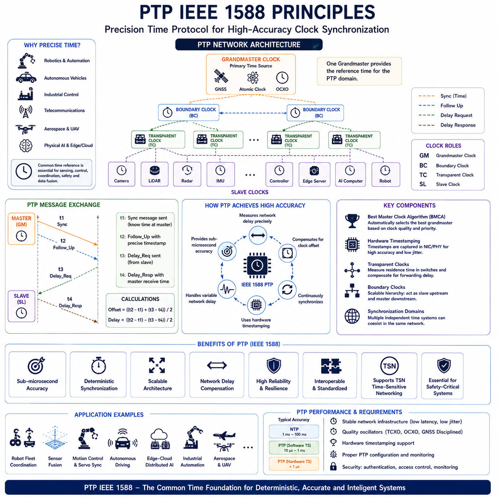
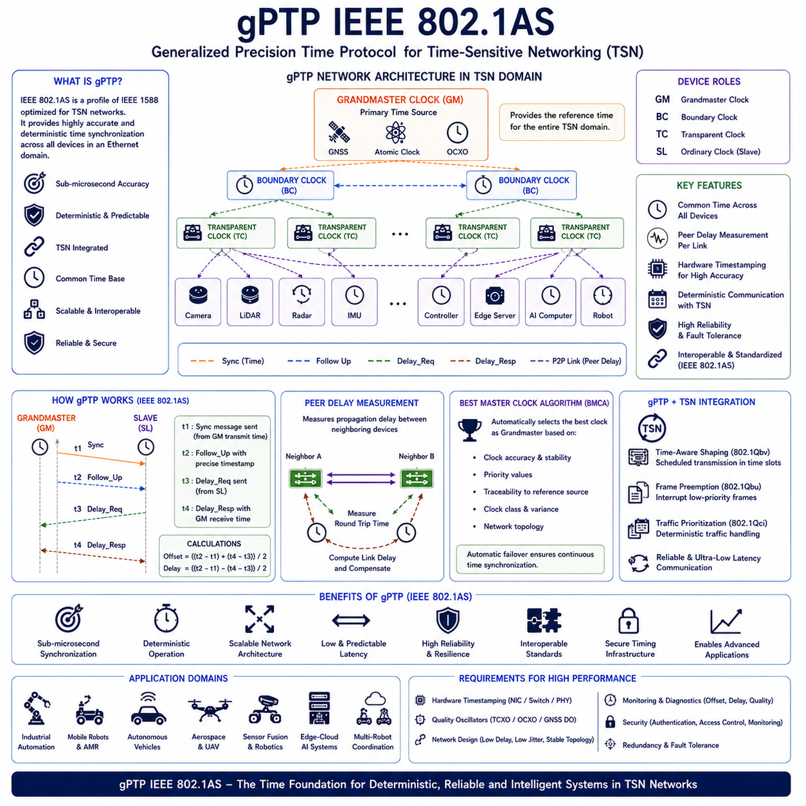
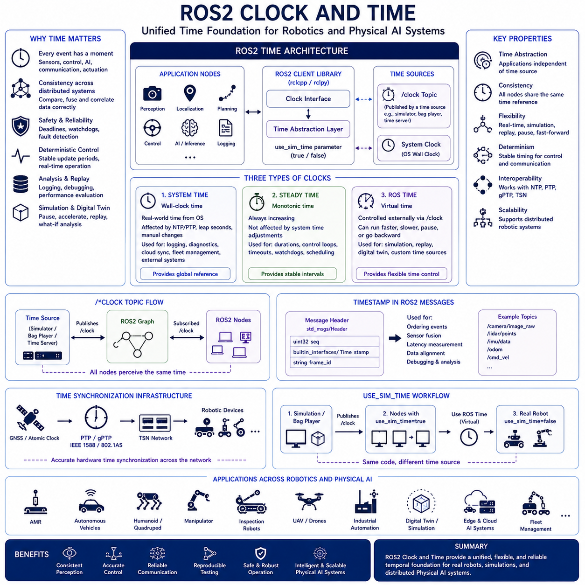
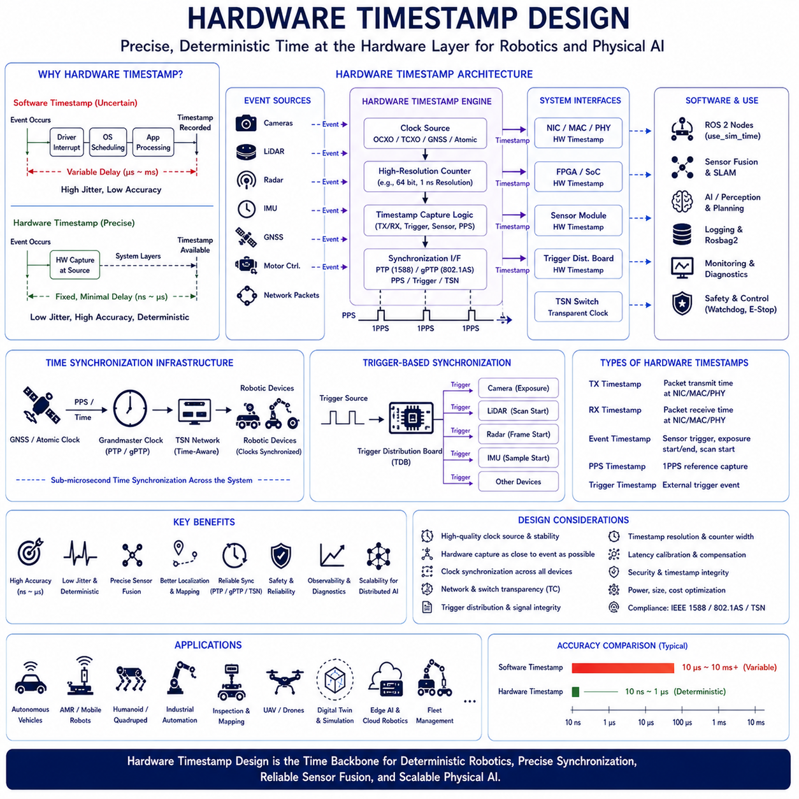
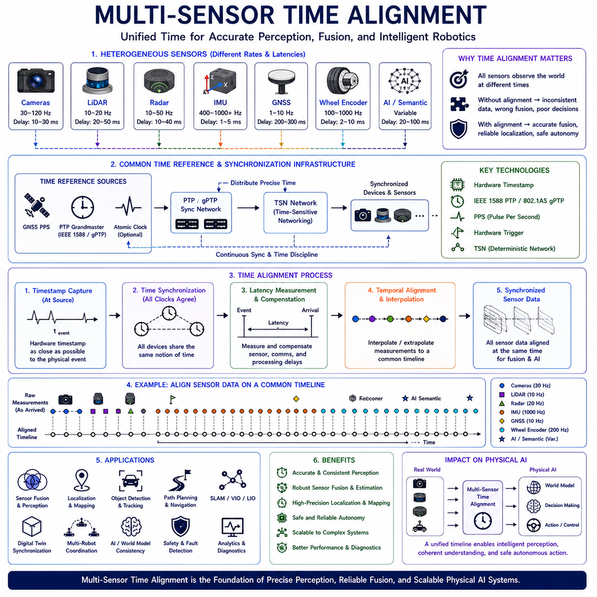

**Volume 09 Robotics Communication**

# Chapter 10. Time Synchronization

## 10.1 PTP IEEE 1588 Principles

{width="7.268055555555556in" height="7.268055555555556in"}

Precision Time Protocol (PTP), standardized as IEEE 1588, is one of the most important technologies for achieving highly accurate clock synchronization across distributed systems. In modern robotics, autonomous vehicles, industrial automation, telecommunications, aerospace systems, Physical AI platforms, and large-scale distributed computing infrastructures, precise time synchronization has become a foundational requirement. As sensors, controllers, AI accelerators, edge servers, cloud platforms, and autonomous agents increasingly operate as interconnected systems, maintaining a common understanding of time becomes essential for accurate perception, coordinated decision-making, deterministic communication, safety-critical control, and reliable data fusion.

Traditional computer networks often rely on Network Time Protocol (NTP) to synchronize clocks. While NTP provides sufficient accuracy for general computing applications, its synchronization precision typically ranges from several milliseconds to tens of milliseconds depending on network conditions. For modern Physical AI systems, this level of accuracy is often inadequate. Autonomous robots may process camera frames at high frequency, LiDAR sensors may generate millions of points per second, radar systems may track rapidly moving objects, and control systems may execute motion commands within microsecond-level timing constraints. In such environments, synchronization errors measured in milliseconds can significantly degrade system performance.

IEEE 1588 was developed to address these limitations by providing sub-microsecond synchronization accuracy across packet-based communication networks. Unlike traditional synchronization methods that assume variable network delays cannot be compensated effectively, PTP actively measures network propagation delays and continuously adjusts local clocks to maintain a common time reference. This capability allows distributed systems to operate as if they share a single highly accurate clock.

The fundamental objective of PTP is to synchronize clocks distributed across multiple devices connected through an Ethernet-based network. Each device contains its own local oscillator and clock source. Without synchronization, these clocks gradually drift apart due to manufacturing tolerances, temperature variations, aging effects, voltage fluctuations, and environmental conditions. Even high-quality oscillators accumulate timing errors over time. PTP continuously corrects these errors and maintains alignment among participating devices.

The architecture of IEEE 1588 revolves around a hierarchical timing model. Within a PTP network, one clock assumes the role of the Grandmaster Clock. This device serves as the primary source of time for all other devices in the synchronization domain. The Grandmaster typically derives its timing reference from highly accurate sources such as GNSS receivers, atomic clocks, disciplined oscillators, or external reference timing systems.

Devices receiving synchronization information from the Grandmaster operate as Slave Clocks. These devices adjust their local clocks based on timing information received from the master. Intermediate devices known as Boundary Clocks and Transparent Clocks may participate in larger network infrastructures to improve synchronization performance and scalability.

A key innovation of IEEE 1588 lies in its ability to measure network delay accurately. Time synchronization requires not only knowledge of the current time but also precise estimation of message transmission delays between devices. Since network traffic, switch processing times, cable lengths, and routing paths introduce variable delays, simply sending timestamps is insufficient. PTP therefore employs a series of timestamp exchange mechanisms to estimate both clock offset and network delay.

The synchronization process begins with the transmission of a Sync message from the Master Clock. This message contains the precise transmission timestamp recorded at the moment the packet leaves the master device. When the slave receives the Sync message, it records the local reception time. The difference between these timestamps contains both the actual clock offset and the network propagation delay.

To separate these two components, PTP performs additional measurements using Delay Request and Delay Response messages. The slave transmits a Delay Request message to the master, recording the transmission time locally. The master records the reception time and returns this information within a Delay Response message. Using these four timestamps, the slave can calculate both the clock offset and the network propagation delay.

Mathematically, the protocol assumes that network delays are approximately symmetric in both directions. Under this assumption, the slave can estimate the one-way propagation delay and adjust its clock accordingly. Continuous repetition of this process enables the system to track changing network conditions and maintain synchronization over time.

Timestamp accuracy is one of the most critical factors influencing synchronization performance. Software-based timestamping records timestamps within operating system software layers. While this approach is relatively simple to implement, software scheduling delays introduce timing uncertainty. Hardware timestamping provides significantly higher accuracy by recording timestamps directly within network interface controllers or Ethernet PHY devices. Most high-performance PTP implementations rely heavily on hardware timestamping to achieve sub-microsecond synchronization.

The Best Master Clock Algorithm (BMCA) is another essential component of IEEE 1588. In complex networks containing multiple potential master clocks, the BMCA automatically determines which device should become the active Grandmaster. Clock selection considers factors such as clock accuracy, clock stability, clock class, priority settings, and traceability to external reference sources. The algorithm ensures automatic failover and network resilience when the current master becomes unavailable.

Boundary Clocks improve scalability in large PTP deployments. Instead of forwarding synchronization messages directly from the Grandmaster to every device, Boundary Clocks act as slaves to upstream clocks while simultaneously serving as masters to downstream devices. This hierarchical architecture reduces synchronization load and improves overall timing stability.

Transparent Clocks address another important challenge. Network switches introduce variable processing delays that can degrade synchronization accuracy. A Transparent Clock measures the residence time of PTP packets inside the switch and updates timing information accordingly. This mechanism compensates for switch-induced delays and improves synchronization precision across large networks.

The concept of synchronization domains allows multiple independent timing systems to coexist within a single network infrastructure. Different applications may require separate timing references, and PTP domains prevent interference between unrelated synchronization systems. Domain separation is particularly useful in large industrial environments and complex robotic ecosystems.

Clock quality plays a crucial role in overall synchronization performance. Oscillator stability directly influences how rapidly clocks drift between synchronization updates. Devices equipped with Temperature Compensated Crystal Oscillators, Oven Controlled Crystal Oscillators, or disciplined oscillators generally achieve superior performance compared to standard crystal oscillators. Higher-quality oscillators reduce correction requirements and improve synchronization stability.

PTP profiles define application-specific parameter sets optimized for particular industries. Different sectors have unique synchronization requirements, and standardized profiles simplify interoperability. Telecommunications, industrial automation, electric power systems, aerospace applications, and automotive systems often utilize specialized profiles tailored to their operational needs.

Industrial automation represents one of the largest application areas for IEEE 1588. Distributed motion control systems frequently require synchronization accuracy measured in microseconds or better. Coordinated servo drives, robotic manipulators, conveyor systems, machine tools, and manufacturing equipment rely on precise timing to maintain coordinated operation. Protocols such as EtherCAT, PROFINET IRT, and TSN frequently incorporate PTP-based synchronization mechanisms.

Robotics systems increasingly depend on IEEE 1588 for sensor fusion and autonomous operation. Modern robots integrate multiple cameras, LiDAR sensors, radar systems, IMUs, GNSS receivers, motor controllers, safety systems, and AI computing platforms. Accurate temporal alignment is essential when combining observations from these diverse sources. Even small synchronization errors can introduce perception inaccuracies and reduce localization performance.

Autonomous vehicles provide an especially compelling example. A camera frame, LiDAR scan, radar detection, and IMU measurement must correspond to the same physical moment to enable accurate environmental understanding. Without precise synchronization, sensor fusion algorithms may combine observations representing different points in time, leading to localization errors and reduced safety margins.

Physical AI systems place even greater demands on synchronization infrastructure. Large Language Models, Vision-Language Models, World Models, and distributed AI agents increasingly operate across multiple computing nodes. Shared temporal understanding becomes essential for maintaining consistency among reasoning systems, memory structures, perception pipelines, and action generation modules.

Edge computing architectures further emphasize the importance of synchronization. Physical AI deployments often distribute computational workloads across onboard processors, nearby edge servers, and cloud infrastructures. Consistent timestamps enable accurate event correlation, data alignment, distributed logging, performance analysis, and system observability across all layers of the architecture.

Time-Sensitive Networking (TSN) has emerged as a natural companion technology to IEEE 1588. TSN provides deterministic communication mechanisms for Ethernet networks, while PTP provides precise time synchronization. Together, these technologies enable highly predictable network behavior suitable for safety-critical and real-time applications.

Security considerations have become increasingly important for synchronization infrastructures. Time synchronization systems influence critical operational decisions and may become targets for malicious attacks. Unauthorized manipulation of timing information could disrupt control systems, sensor fusion algorithms, or distributed coordination mechanisms. Modern deployments therefore incorporate authentication, network segmentation, access control, and monitoring systems to protect synchronization integrity.

Observability and diagnostics are essential for maintaining synchronization performance. Engineers monitor clock offset, propagation delay, synchronization accuracy, oscillator stability, packet loss, timestamp quality, and network asymmetry. Continuous measurement enables early detection of synchronization degradation and facilitates proactive maintenance.

Future developments in Physical AI will likely increase the importance of precise timing even further. Distributed world models, collaborative autonomous agents, multi-robot coordination systems, semantic communication frameworks, and large-scale fleet intelligence architectures all depend on accurate temporal alignment. As intelligence becomes increasingly distributed, synchronization transforms from a supporting technology into a foundational infrastructure layer.

Within the Hills Robotics Physical AI architecture, IEEE 1588 Precision Time Protocol serves as the master synchronization framework connecting cameras, LiDARs, radars, IMUs, GNSS receivers, motor controllers, edge computers, GPU servers, fleet management systems, and cloud intelligence platforms. PTP provides the common temporal reference required for sensor fusion, distributed AI execution, autonomous navigation, multi-robot collaboration, digital twins, and fleet-scale intelligence. Future indoor AMRs, outdoor autonomous vehicles, mobile manipulators, quadruped robots, humanoids, industrial inspection systems, and cargo UAVs will increasingly rely on IEEE 1588 to ensure that every observation, decision, communication event, and physical action occurs within a precisely synchronized temporal framework. As Physical AI systems continue to evolve, PTP will remain one of the most important enabling technologies for deterministic, reliable, scalable, and intelligent autonomous systems.

## 10.2 gPTP IEEE 802.1AS

{width="7.268055555555556in" height="7.268055555555556in"}

Generalized Precision Time Protocol (gPTP), standardized as IEEE 802.1AS, is a specialized time synchronization protocol developed as a core component of Time-Sensitive Networking (TSN). While IEEE 1588 Precision Time Protocol provides a general framework for high-accuracy clock synchronization across packet-switched networks, IEEE 802.1AS adapts and constrains this framework to meet the deterministic communication requirements of real-time Ethernet systems. In modern robotics, autonomous vehicles, industrial automation, aerospace systems, autonomous mobile robots, Physical AI platforms, and distributed edge computing infrastructures, gPTP serves as the foundational timing mechanism that enables synchronized sensing, deterministic communication, coordinated control, and distributed intelligence execution.

The increasing complexity of cyber-physical systems has dramatically elevated the importance of precise time synchronization. Modern autonomous systems are no longer composed of isolated sensors and controllers. Instead, they consist of distributed networks of cameras, LiDARs, radars, inertial measurement units, motor controllers, AI accelerators, edge servers, cloud services, and autonomous software agents. These components continuously exchange information and collaborate to achieve perception, localization, planning, reasoning, and control objectives. Accurate temporal alignment becomes essential because even small timing discrepancies can degrade sensor fusion performance, introduce control instability, reduce localization accuracy, and compromise safety.

IEEE 1588 successfully addressed many synchronization challenges by providing sub-microsecond clock synchronization across Ethernet networks. However, industrial automation systems, automotive networks, avionics platforms, and emerging TSN infrastructures require stronger guarantees regarding timing behavior, network determinism, interoperability, and predictable communication latency. IEEE 802.1AS was developed specifically to address these requirements.

The primary objective of gPTP is to establish a common notion of time across all devices participating in a TSN domain. Unlike general-purpose synchronization systems, gPTP is tightly integrated with Ethernet switching infrastructures and deterministic networking mechanisms. Every device within the network shares a common time reference, allowing synchronized execution of tasks, coordinated communication schedules, and deterministic data delivery.

At its core, gPTP remains based on the fundamental principles of IEEE 1588. Clocks exchange timestamped synchronization messages to estimate clock offsets and network propagation delays. Devices continuously adjust their local clocks to maintain alignment with a selected timing source. However, IEEE 802.1AS introduces significant modifications and restrictions designed specifically for TSN environments.

One of the most important differences is that IEEE 802.1AS assumes operation within a controlled Layer-2 Ethernet network. Traditional IEEE 1588 can operate across complex routed networks involving multiple subnets and heterogeneous communication paths. gPTP, by contrast, focuses on local Ethernet domains where network topology is known and managed. This controlled environment allows more predictable synchronization performance and simplifies timing calculations.

Within a gPTP network, a Grandmaster Clock serves as the primary timing source. All participating devices synchronize to this clock either directly or indirectly through intermediate synchronization devices. The Grandmaster typically derives its timing reference from GNSS receivers, disciplined oscillators, atomic clocks, or other highly accurate external sources.

The process of selecting the Grandmaster is governed by the Best Master Clock Algorithm. Similar to IEEE 1588, gPTP evaluates clock quality, stability, accuracy, priority values, and traceability information when determining which device should become the active timing source. This process is performed automatically and continuously, ensuring resilience in the presence of failures or topology changes.

The concept of time-aware systems forms the foundation of TSN. A time-aware system possesses precise knowledge of the current network time and can schedule communication activities accordingly. gPTP provides this shared temporal foundation, enabling all devices to operate according to synchronized schedules.

Synchronization begins with the transmission of timing messages from the Grandmaster. These messages contain precise timestamps representing the transmission time of synchronization events. Receiving devices compare transmitted timestamps with locally observed reception times to estimate clock offset. Additional message exchanges allow propagation delays to be calculated and compensated.

Hardware timestamping is essential for achieving high synchronization accuracy. Software-based timestamping introduces uncertainties caused by operating system scheduling delays, interrupt handling latency, and software execution variability. gPTP implementations therefore rely heavily on hardware support within network interface controllers, Ethernet PHY devices, switches, and embedded timing hardware. By recording timestamps at the physical layer, synchronization errors are significantly reduced.

Peer delay measurement represents another distinguishing feature of IEEE 802.1AS. Rather than relying solely on end-to-end delay estimation, gPTP directly measures propagation delays between neighboring devices. This peer-to-peer approach improves accuracy and provides better visibility into network timing characteristics. Each link independently measures delay, allowing the synchronization system to compensate more effectively for physical network properties.

The peer delay mechanism utilizes specialized message exchanges between directly connected devices. By measuring round-trip communication times and applying appropriate compensation algorithms, each network link can determine its propagation delay with high precision. These measurements contribute to overall synchronization accuracy throughout the network.

Time synchronization within gPTP extends beyond simple clock alignment. The protocol establishes a shared timescale that serves as the foundation for all TSN functions. Scheduled traffic, frame preemption, traffic shaping, synchronization-aware control systems, and deterministic communication services all depend upon this common time reference.

The relationship between gPTP and Time-Sensitive Networking is particularly important. TSN consists of a collection of IEEE standards designed to provide deterministic communication over Ethernet. These standards include mechanisms for traffic scheduling, bandwidth reservation, frame prioritization, redundancy management, fault tolerance, and low-latency communication. None of these mechanisms can function effectively without precise synchronization. gPTP therefore serves as the timing backbone of the entire TSN ecosystem.

Time-Aware Shaping, defined in IEEE 802.1Qbv, provides an illustrative example. This mechanism schedules network transmissions according to predefined communication windows. Devices must possess highly synchronized clocks to ensure that transmissions occur precisely within assigned time slots. gPTP provides the synchronization necessary for such deterministic behavior.

Similarly, Frame Preemption mechanisms defined in IEEE 802.1Qbu depend upon accurate timing to interrupt lower-priority traffic when high-priority messages require immediate transmission. Consistent timing references ensure predictable operation across the network.

Industrial automation systems benefit substantially from these capabilities. Distributed motion control systems often require synchronized execution of control loops across multiple controllers, drives, sensors, and actuators. gPTP enables coordinated operation with timing precision sufficient for demanding manufacturing applications.

Robotics systems represent another major application domain. Modern robots increasingly incorporate distributed architectures involving multiple sensors, edge computing nodes, AI accelerators, safety controllers, and communication gateways. Accurate synchronization ensures that sensor observations correspond to the same physical events and enables reliable sensor fusion.

Autonomous mobile robots depend on synchronization between cameras, LiDAR sensors, radar systems, inertial measurement units, wheel encoders, motor controllers, and navigation processors. Temporal consistency allows perception algorithms to combine observations accurately and construct coherent environmental representations.

Outdoor autonomous vehicles face even greater synchronization demands. High-speed operation requires precise correlation of sensor measurements and control actions. Localization systems, perception pipelines, motion planners, and safety systems all rely on synchronized timing information to maintain situational awareness and ensure safe operation.

Physical AI systems introduce new synchronization challenges. Large Language Models, Vision-Language Models, Vision-Language-Action architectures, world models, autonomous agents, and distributed reasoning systems increasingly operate across heterogeneous computing platforms. Shared temporal awareness becomes essential for maintaining consistency among perception outputs, memory states, reasoning processes, and action generation mechanisms.

Distributed AI execution environments further emphasize the importance of synchronization. AI workloads may execute across robot-mounted processors, edge servers, and cloud infrastructures simultaneously. Accurate timestamps enable event correlation, distributed logging, performance analysis, debugging, and observability across the entire computational hierarchy.

Automotive systems have become one of the most significant deployment environments for IEEE 802.1AS. Modern vehicles contain dozens of electronic control units, high-resolution cameras, radar systems, LiDAR sensors, infotainment platforms, advanced driver assistance systems, and centralized computing architectures. Ethernet-based vehicle networks increasingly rely on gPTP to establish a common time reference across all subsystems.

The transition toward Software-Defined Vehicles and centralized vehicle computing architectures further increases the importance of synchronization. Future automotive platforms require coordinated operation of perception, planning, control, communication, and infotainment functions. gPTP provides the temporal foundation supporting these integrated systems.

Aerospace applications similarly benefit from precise synchronization. Distributed avionics architectures, autonomous UAVs, mission systems, communication networks, and sensor fusion frameworks all depend on consistent timing information. Deterministic communication enabled by TSN and gPTP enhances reliability and predictability in safety-critical environments.

Network topology plays an important role in synchronization performance. Physical link quality, switch architecture, cable lengths, hardware timestamping capabilities, and network loading conditions all influence timing accuracy. Proper network design is therefore essential for achieving optimal synchronization performance.

Monitoring and diagnostics capabilities are critical components of operational deployments. Engineers continuously observe clock offsets, synchronization quality, propagation delays, frequency stability, timestamp accuracy, and network timing behavior. Early detection of synchronization degradation allows corrective actions before system performance is affected.

Security considerations have become increasingly important. Timing infrastructure influences virtually every aspect of distributed system behavior. Malicious manipulation of synchronization mechanisms could disrupt sensor fusion, control loops, communication schedules, and AI coordination processes. Modern deployments therefore incorporate authentication, access control, network segmentation, anomaly detection, and security monitoring to protect synchronization integrity.

The future evolution of Physical AI will likely increase dependence on synchronized time. Multi-robot coordination systems, collaborative autonomous agents, distributed world models, semantic communication architectures, edge-cloud intelligence platforms, and large-scale fleet management systems all require precise temporal alignment. As intelligence becomes increasingly distributed, synchronization transforms from a supporting technology into a fundamental architectural layer.

Within the Hills Robotics Physical AI architecture, IEEE 802.1AS gPTP serves as the deterministic timing infrastructure connecting cameras, LiDARs, radars, IMUs, GNSS receivers, motor controllers, safety systems, edge computers, GPU servers, TSN switches, fleet management platforms, and cloud intelligence services. gPTP establishes the common time foundation necessary for synchronized sensor fusion, deterministic communication, distributed AI execution, coordinated control, digital twins, and fleet-scale intelligence. Future indoor AMRs, outdoor autonomous vehicles, mobile manipulators, quadruped robots, humanoids, industrial inspection systems, and cargo UAV platforms will increasingly rely on IEEE 802.1AS to ensure that every observation, communication event, reasoning process, and physical action occurs within a precisely synchronized temporal framework. As Time-Sensitive Networking and Physical AI continue to converge, gPTP will remain one of the most critical enabling technologies for deterministic, scalable, reliable, and intelligent autonomous systems.

# 10_02 gPTP IEEE 802.1AS

## 10.3 ROS2 Clock and Time

{width="7.268055555555556in" height="7.268055555555556in"}

Time is one of the most fundamental resources in distributed robotic systems. Every sensor measurement, control command, AI inference result, localization update, navigation decision, safety event, communication packet, and actuator response occurs at a specific moment in time. Modern robots increasingly depend on accurate temporal information to maintain consistency across perception, planning, control, communication, and artificial intelligence subsystems. Within the ROS2 ecosystem, the Clock and Time framework provides the foundation that allows robotic applications to operate reliably across real-world deployments, simulation environments, distributed computing architectures, and synchronized multi-robot systems.

As robotic systems become more complex, the role of time extends far beyond simple timestamp generation. Autonomous Mobile Robots, outdoor autonomous vehicles, humanoids, quadruped robots, industrial manipulators, inspection robots, digital twins, fleet management systems, and Physical AI platforms all require a consistent understanding of time across multiple computing devices. ROS2 Clock and Time mechanisms were designed specifically to address these challenges while supporting both real-time operation and advanced simulation capabilities.

In traditional software systems, applications typically rely on the operating system clock. This clock represents wall-clock time and is often synchronized using Network Time Protocol or Precision Time Protocol. While such clocks are sufficient for many computing applications, robotic systems require greater flexibility. A robot may need to operate in real time during deployment, use accelerated time during simulation, replay historical sensor logs, pause execution for debugging, or synchronize with external timing infrastructures. ROS2 therefore introduces a dedicated abstraction layer that separates application logic from the underlying source of time.

The ROS2 time architecture is based on the principle that applications should not directly depend on the operating system clock whenever possible. Instead, software components obtain time through ROS2 clock interfaces. This abstraction allows the same software to operate consistently regardless of whether time originates from a physical clock, a simulation engine, a recorded dataset, or a synchronized network infrastructure.

The ROS2 time system defines several clock types, each serving a different purpose. These clocks provide flexibility while maintaining compatibility across diverse robotic applications. Understanding the distinctions between these clock types is essential for designing scalable and reliable robotic systems.

The first clock type is System Time. System Time corresponds to the operating system\'s wall-clock time. It represents real-world time as maintained by the host computer. This clock behaves similarly to standard system clocks found in conventional software applications. When a robot is operating in a production environment, System Time often serves as the primary time source.

System Time is particularly useful for logging, diagnostics, communication with external systems, cloud integration, fleet management platforms, database synchronization, and interactions with enterprise software. Since System Time corresponds to globally recognizable timestamps, it provides a natural reference for operational monitoring and historical analysis.

The second clock type is Steady Time. Unlike System Time, Steady Time is monotonic and continuously increasing. It is not affected by adjustments to the system clock, leap seconds, NTP corrections, daylight saving changes, or manual clock modifications. Because of these properties, Steady Time is frequently used for measuring durations, calculating execution times, scheduling periodic operations, monitoring watchdog timers, and implementing deterministic control loops.

Control systems often depend heavily on Steady Time because unexpected changes in wall-clock time could destabilize feedback loops or create erroneous timing calculations. A robot calculating velocity, acceleration, or controller update intervals requires a stable temporal reference that cannot jump backward or forward unexpectedly.

The third and most distinctive clock type is ROS Time. ROS Time introduces a virtualized concept of time that can be controlled externally. Rather than following physical wall-clock progression, ROS Time may advance according to simulation environments, playback systems, digital twins, or custom time publishers. This capability represents one of the most powerful features of the ROS2 time framework.

When simulation environments such as Gazebo, Isaac Sim, Webots, or custom digital twins are used, ROS Time allows simulated systems to operate independently of real-world time. Simulations may execute faster than real time, slower than real time, pause completely, or replay historical scenarios. Because applications obtain timestamps through ROS Time interfaces, they continue functioning correctly regardless of how time progresses.

The mechanism enabling ROS Time virtualization relies on the \`/clock\` topic. When a time source publishes messages to this topic, ROS2 nodes configured to use simulated time automatically subscribe to the published clock information. Applications then perceive the externally supplied time as the current system time.

The parameter \`use_sim_time\` determines whether a node uses ROS Time or System Time. When enabled, the node ignores the operating system clock and instead relies on timestamps received through the \`/clock\` topic. This design allows entire robotic software stacks to transition seamlessly between simulation and real-world deployment without code modifications.

Time synchronization becomes particularly important in distributed robotic systems. Modern robots frequently contain multiple computers connected through Ethernet, CAN networks, DDS middleware, TSN infrastructures, and wireless communication systems. Sensors may be attached to dedicated processing units, AI accelerators may operate independently from control processors, and edge computing resources may participate in perception or planning workloads.

Without synchronized clocks, timestamps generated by different devices cannot be compared reliably. Sensor fusion algorithms depend on temporal consistency. Camera frames, LiDAR scans, radar observations, IMU measurements, GNSS updates, and actuator feedback must all correspond to the same physical timeline. ROS2 Clock and Time mechanisms therefore often operate in conjunction with synchronization technologies such as NTP, IEEE 1588 PTP, IEEE 802.1AS gPTP, and Time-Sensitive Networking infrastructures.

Timestamping is one of the most critical applications of ROS2 time. Every ROS2 message may contain temporal information representing the moment an event occurred. These timestamps allow downstream systems to reconstruct event sequences, correlate observations, align sensor data, estimate system latency, and analyze operational behavior.

Perception systems rely heavily on timestamp accuracy. Cameras may operate at thirty, sixty, or hundreds of frames per second. LiDAR systems generate scans continuously. Radar systems track dynamic objects in real time. Sensor fusion frameworks must align these observations accurately to produce coherent environmental representations. Even small timing discrepancies can introduce localization errors, mapping inconsistencies, and perception inaccuracies.

Localization systems similarly depend on accurate time management. Simultaneous Localization and Mapping algorithms continuously integrate observations from multiple sensors while estimating robot position. Temporal alignment ensures that measurements correspond to the correct vehicle state and environmental conditions.

Navigation systems also require precise temporal awareness. Path planning, obstacle avoidance, trajectory generation, and motion control all operate within dynamic environments where conditions change continuously. Accurate timestamps allow navigation algorithms to predict future states, estimate motion dynamics, and maintain safe operation.

ROS2 recording and playback systems further demonstrate the importance of the time framework. Rosbag2 enables recording of sensor data, control messages, system events, and AI outputs. During playback, ROS Time can reproduce historical execution sequences exactly as they originally occurred. Engineers can replay failures, evaluate algorithms, validate fixes, and conduct repeatable testing under controlled conditions.

Digital twins represent another major application area. Modern Physical AI systems increasingly utilize digital twins for simulation, validation, optimization, predictive maintenance, and operational planning. The ability to synchronize virtual and physical environments depends heavily on consistent time management. ROS Time provides the abstraction layer necessary for integrating these environments effectively.

Artificial Intelligence workloads introduce additional timing considerations. Large Language Models, Vision-Language Models, Vision-Language-Action architectures, world models, reinforcement learning agents, and multimodal perception systems generate outputs that must be correlated with sensor observations and physical actions. Consistent timestamps ensure that AI reasoning processes remain aligned with environmental reality.

Distributed AI architectures amplify these challenges. AI models may execute across onboard computers, edge servers, GPU clusters, and cloud infrastructures simultaneously. Temporal consistency enables event correlation, distributed logging, performance profiling, debugging, and observability across heterogeneous computing environments.

Real-time robotics introduces additional constraints. Control loops often execute at frequencies ranging from tens to thousands of Hertz. Deterministic scheduling requires precise knowledge of update intervals and execution timing. ROS2 Clock mechanisms support these requirements while allowing integration with real-time operating systems and deterministic communication frameworks.

Safety-critical systems depend heavily on reliable timing behavior. Emergency braking systems, collision avoidance functions, fault detection mechanisms, health monitoring services, and watchdog supervisors frequently utilize timing thresholds to identify abnormal behavior. Accurate clocks ensure predictable safety responses and reliable fault detection.

The DDS middleware underlying ROS2 incorporates timestamps into many communication mechanisms. Quality of Service policies such as deadlines, lifespans, latency budgets, and time-based filtering depend on accurate temporal information. Consequently, clock quality directly influences communication reliability and system performance.

Fleet robotics further increases the importance of synchronized time. Large groups of robots may share maps, coordinate tasks, exchange observations, and collaborate on complex missions. Consistent timestamps enable accurate event ordering, distributed decision-making, fleet analytics, and operational coordination.

Cloud robotics environments also rely on accurate temporal information. Data synchronization, distributed logging, AI model training, telemetry analysis, and digital twin integration all require coherent timestamp management across multiple infrastructure layers.

The emergence of Physical AI creates even greater demands on time synchronization. Future systems will integrate world models, memory architectures, autonomous agents, semantic communication frameworks, action token transport systems, and distributed reasoning engines. These capabilities require a shared temporal foundation to maintain consistency among observations, decisions, predictions, and actions.

Within the Hills Robotics Physical AI architecture, ROS2 Clock and Time serve as the temporal abstraction layer connecting cameras, LiDARs, radars, IMUs, GNSS receivers, motor controllers, DDS communication infrastructures, PTP synchronization systems, TSN networks, AI accelerators, edge computing platforms, digital twins, and cloud intelligence services. ROS2 Time enables seamless transitions between simulation and deployment while maintaining temporal consistency across distributed robotic ecosystems. Future indoor AMRs, outdoor autonomous vehicles, mobile manipulators, quadruped robots, humanoids, industrial inspection systems, and cargo UAV platforms will increasingly depend on robust time management frameworks to support synchronized perception, deterministic control, distributed AI execution, fleet coordination, and large-scale Physical AI operations. As robotics evolves toward highly distributed autonomous intelligence, ROS2 Clock and Time will remain one of the most important foundational technologies enabling reliable, scalable, and temporally coherent robotic systems.

# 10_03 ROS2 Clock and Time

## 10.4 Hardware Timestamp Design

{width="7.268055555555556in" height="7.268055555555556in"}

Hardware Timestamp Design is one of the most critical foundations for achieving deterministic communication, precise synchronization, sensor fusion accuracy, and distributed intelligence coordination in modern robotic systems. As autonomous robots evolve from isolated embedded devices into highly connected Physical AI platforms, the precision of temporal information becomes increasingly important. Cameras, LiDARs, radars, IMUs, GNSS receivers, motor controllers, edge computers, AI accelerators, fleet management systems, and cloud infrastructures all generate data that must be aligned within a common timeline. Hardware timestamping provides the mechanism that enables this alignment by capturing the exact moment an event occurs at the physical hardware layer rather than within software processing pipelines.

In traditional computing systems, timestamps are often generated by software. When a packet arrives at a network interface, when a sensor measurement is received by an operating system driver, or when an application processes a message, software may record the current time and associate it with the event. While this approach is sufficient for many general computing applications, it introduces uncertainty due to operating system scheduling delays, interrupt latency, memory access delays, driver execution times, and processor workload variations. These uncertainties can range from microseconds to milliseconds and may vary unpredictably depending on system load.

For modern robotic applications, such timing uncertainty is often unacceptable. Sensor fusion algorithms depend on accurate temporal alignment between observations originating from multiple sensors. A camera image captured at one instant must be synchronized with LiDAR point clouds, radar detections, IMU measurements, and GNSS updates representing the same physical reality. Even small timing errors can result in perception inaccuracies, localization drift, object tracking instability, and degraded decision-making performance.

Hardware timestamping addresses this challenge by recording timestamps as close as possible to the physical event itself. Instead of relying on software execution layers, timestamps are generated directly within network interface controllers, Ethernet PHY devices, FPGA logic, sensor electronics, timing modules, or dedicated hardware synchronization circuits. By eliminating software-induced variability, hardware timestamping dramatically improves timing accuracy and determinism.

The fundamental principle of hardware timestamp design is straightforward. Every significant event within a robotic system should be associated with a precise temporal reference generated at the lowest practical layer of the hardware architecture. The closer the timestamp is generated to the actual physical event, the smaller the uncertainty becomes. This principle guides the design of synchronization infrastructures across robotics, industrial automation, autonomous vehicles, aerospace systems, and Physical AI platforms.

One of the most common applications of hardware timestamping occurs within Ethernet communication systems. Modern network interface controllers often incorporate dedicated timestamp engines capable of recording packet transmission and reception times directly at the Media Access Control layer or Physical Layer interface. These timestamps are used extensively by IEEE 1588 Precision Time Protocol and IEEE 802.1AS generalized Precision Time Protocol implementations.

When a synchronization packet leaves a network interface, the exact transmission time is recorded by dedicated hardware. Similarly, when a packet arrives, the reception time is captured before operating system processing begins. These highly accurate timestamps allow synchronization algorithms to calculate propagation delays and clock offsets with sub-microsecond precision. Without hardware timestamping, software-induced timing variability would significantly reduce synchronization accuracy.

The distinction between software timestamps and hardware timestamps becomes increasingly important in distributed systems. Software timestamps reflect when an operating system becomes aware of an event. Hardware timestamps reflect when the event actually occurred. In high-performance robotic environments, this difference may determine whether sensor fusion succeeds or fails.

Cameras provide another important example. Modern machine vision systems frequently support hardware trigger mechanisms and hardware timestamp generation. Rather than assigning timestamps when image frames reach application software, timestamps are generated when image exposure begins or ends. This approach ensures that the recorded timestamp accurately represents the physical moment when photons were captured by the image sensor.

Global shutter cameras particularly benefit from hardware timestamping because all pixels are exposed simultaneously. The timestamp therefore corresponds to a well-defined physical event. Rolling shutter cameras introduce additional timing complexity because different image rows are exposed at slightly different times. Hardware timestamp systems must account for these characteristics when precise synchronization is required.

LiDAR systems also depend heavily on hardware timestamp design. A LiDAR scan may require tens or hundreds of milliseconds to complete. Individual laser returns are generated continuously throughout the scan process. Accurate timestamping enables software systems to reconstruct the temporal sequence of measurements and compensate for vehicle motion during scan acquisition. This process, commonly known as motion compensation or deskewing, relies directly on precise timing information.

Radar systems similarly require accurate timestamps to correlate detections with vehicle states, track moving objects, and fuse observations with other sensors. High-resolution automotive radar systems increasingly incorporate dedicated synchronization interfaces and hardware timestamp generators to support advanced perception algorithms.

Inertial Measurement Units represent one of the most timing-sensitive sensors in autonomous systems. IMUs often operate at frequencies ranging from hundreds to thousands of hertz. Small timestamp errors can accumulate rapidly and degrade state estimation accuracy. Hardware timestamping ensures that acceleration and angular velocity measurements are aligned precisely with observations from other sensors.

GNSS receivers frequently serve as primary timing references within robotic systems. Many high-performance GNSS modules generate Pulse Per Second signals synchronized to atomic clock standards. These signals provide highly accurate temporal markers that can be distributed throughout robotic platforms. Hardware timestamp systems often use PPS signals as external references for synchronization calibration and validation.

The architecture of a hardware timestamp system typically includes several fundamental components. A high-quality clock source provides the temporal foundation. Timestamp generators capture event times. Synchronization interfaces distribute timing information. Hardware counters maintain precise time representations. Communication interfaces transport timestamp data to software systems. Together, these components form a complete temporal infrastructure.

Clock source quality strongly influences timestamp accuracy. Crystal oscillators, temperature-compensated crystal oscillators, oven-controlled crystal oscillators, disciplined oscillators, and atomic references provide varying levels of stability and precision. Higher-quality clock sources reduce drift and improve long-term synchronization performance.

Hardware counters serve as the internal representation of time. These counters continuously increment according to the frequency of the underlying clock source. Timestamp generators capture counter values when relevant events occur. The resulting timestamps represent precise temporal measurements that can be compared across distributed systems.

Synchronization distribution mechanisms are equally important. Accurate timestamps are meaningful only if multiple devices share a common temporal reference. IEEE 1588 PTP, IEEE 802.1AS gPTP, Pulse Per Second distribution networks, hardware trigger systems, Time-Sensitive Networking infrastructures, and dedicated timing buses are commonly used to achieve this objective.

Trigger-based synchronization represents a particularly important design pattern in robotics. A dedicated hardware trigger signal initiates simultaneous actions across multiple devices. Cameras begin image exposure, LiDAR systems initiate scanning, radar systems start acquisition cycles, and timestamp generators record the trigger event. This approach ensures deterministic synchronization across heterogeneous sensor platforms.

Trigger Distribution Boards often serve as centralized synchronization hubs within complex robotic systems. These devices receive timing references from GNSS receivers or Grandmaster clocks and distribute synchronized trigger signals to connected sensors. Such architectures are common in autonomous vehicles, mobile mapping systems, industrial inspection platforms, and large-scale perception systems.

FPGA-based timestamp architectures provide exceptional flexibility. Field-Programmable Gate Arrays can implement custom timing logic, timestamp generators, synchronization protocols, trigger distribution mechanisms, and hardware processing pipelines. Because timestamp generation occurs entirely within deterministic hardware circuits, timing uncertainty is minimized.

Modern Physical AI systems increasingly rely on FPGA-assisted synchronization infrastructures. High-speed cameras, advanced LiDAR systems, distributed AI accelerators, edge computing platforms, and deterministic communication networks frequently integrate FPGA-based timestamp solutions to achieve the precision required by autonomous operations.

Network switch design also plays a significant role in timestamp accuracy. Standard Ethernet switches introduce variable packet forwarding delays. Time-aware switches incorporating IEEE 1588 Transparent Clock functionality measure residence times and update synchronization information accordingly. These capabilities preserve synchronization accuracy across large network infrastructures.

Time-Sensitive Networking extends these concepts further by combining hardware timestamping with deterministic scheduling mechanisms. TSN switches maintain synchronized clocks and coordinate communication activities according to predefined schedules. Hardware timestamping serves as the foundation upon which these deterministic behaviors are constructed.

Sensor fusion architectures derive enormous benefits from hardware timestamp design. Multi-sensor fusion algorithms assume that observations correspond to a common temporal reference. Accurate timestamps enable interpolation, extrapolation, temporal alignment, motion compensation, state estimation, and uncertainty modeling. Without precise timestamping, fusion quality degrades significantly.

Simultaneous Localization and Mapping systems provide a compelling example. SLAM algorithms continuously integrate observations from cameras, LiDARs, IMUs, wheel encoders, GNSS receivers, and environmental features. Temporal consistency directly influences localization accuracy, map quality, and navigation reliability. Hardware timestamping minimizes timing errors and improves overall system performance.

Artificial Intelligence workloads introduce additional timing considerations. Vision models, world models, multimodal fusion systems, reinforcement learning agents, Large Language Models, and Vision-Language-Action architectures increasingly operate within distributed computing environments. AI outputs must be correlated accurately with sensor observations and physical actions. Hardware timestamping provides the temporal foundation necessary for such correlations.

Distributed AI architectures amplify these requirements. AI inference may occur on onboard processors, edge servers, GPU clusters, and cloud infrastructures simultaneously. Accurate timestamps enable event correlation, distributed debugging, performance profiling, model evaluation, and operational observability across heterogeneous computing environments.

Safety-critical systems place even greater emphasis on timestamp integrity. Emergency braking systems, collision avoidance mechanisms, health monitoring services, watchdog supervisors, and fault detection algorithms often depend on timing thresholds to identify abnormal conditions. Inaccurate timestamps may compromise safety performance and delay critical responses.

Observability and diagnostics constitute another important application domain. Engineers require visibility into communication latency, processing delays, synchronization accuracy, sensor timing behavior, AI execution timelines, and system performance metrics. Hardware timestamps provide objective temporal measurements that support troubleshooting and optimization efforts.

Security considerations are increasingly relevant. Timestamp information influences synchronization systems, communication infrastructures, control loops, and AI coordination mechanisms. Unauthorized manipulation of timestamps could disrupt distributed operations. Secure timestamp architectures therefore incorporate authentication, integrity verification, trusted timing sources, and protected synchronization channels.

Future Physical AI systems will likely demand even greater timing precision. Multi-robot collaboration, distributed world models, autonomous agent networks, semantic communication architectures, digital twins, fleet intelligence platforms, and edge-cloud AI ecosystems all depend upon accurate temporal alignment. As intelligence becomes increasingly distributed, hardware timestamping evolves from a specialized synchronization technique into a foundational infrastructure capability.

Within the Hills Robotics Physical AI architecture, Hardware Timestamp Design serves as the temporal backbone connecting cameras, LiDARs, radars, IMUs, GNSS receivers, motor controllers, FPGA synchronization modules, TSN switches, edge computers, GPU servers, ROS2 middleware, PTP Grandmaster clocks, and distributed AI platforms. Hardware timestamps establish the common temporal reference required for sensor fusion, autonomous navigation, world model construction, AI reasoning, multi-robot coordination, digital twins, and fleet-scale intelligence. Future indoor AMRs, outdoor autonomous vehicles, mobile manipulators, quadruped robots, humanoids, industrial inspection systems, and cargo UAV platforms will increasingly depend on sophisticated hardware timestamp infrastructures to ensure that every observation, communication event, decision, and physical action is aligned within a precise and deterministic timeline. As Physical AI systems continue their evolution toward large-scale autonomous intelligence, Hardware Timestamp Design will remain one of the most important enabling technologies supporting synchronization, determinism, safety, scalability, and operational excellence.

# 10_04 Hardware Timestamp Design

## 10.5 Multi Sensor Time Alignment

{width="7.268055555555556in" height="7.268055555555556in"}

Multi-Sensor Time Alignment is one of the most critical technologies in modern robotics, autonomous vehicles, industrial automation systems, aerospace platforms, and Physical AI architectures. As robotic systems increasingly rely on diverse sensing modalities to perceive and understand the environment, the ability to align observations from multiple sensors within a common temporal framework becomes essential. Cameras, LiDARs, radars, IMUs, GNSS receivers, wheel encoders, ultrasonic sensors, force sensors, tactile sensors, microphones, and AI-generated semantic observations all capture different aspects of reality. However, these observations only become truly useful when they are synchronized accurately in time.

The physical world evolves continuously. Objects move, robots accelerate, humans walk, vehicles change direction, and environmental conditions fluctuate. Every sensor observes only a small portion of this dynamic reality and typically operates at a different sampling frequency, communication latency, and processing speed. Without accurate temporal alignment, observations from different sensors may correspond to different moments in time. As a result, sensor fusion algorithms may combine incompatible data, leading to localization errors, perception failures, navigation instability, and incorrect autonomous decisions.

The fundamental objective of Multi-Sensor Time Alignment is to ensure that all sensor measurements can be mapped onto a common timeline. This allows robotic systems to reconstruct a coherent representation of the environment at any given instant. Rather than treating sensors as independent information sources, time alignment transforms them into a unified perception system capable of observing reality from multiple perspectives simultaneously.

Modern robotic systems often contain sensors operating at dramatically different frequencies. A GNSS receiver may update at 1 Hz or 10 Hz. A camera may operate at 30 Hz, 60 Hz, or 120 Hz. An IMU may generate measurements at 400 Hz, 1000 Hz, or even higher frequencies. A LiDAR may produce scans at 10 Hz or 20 Hz, while radar systems may update at different rates depending on their configuration. Aligning these heterogeneous data streams requires sophisticated synchronization mechanisms capable of handling frequency mismatches, communication delays, and processing latency.

Time alignment begins with the establishment of a common time reference. Every sensor must either share the same clock directly or maintain synchronization with a common timing source. Technologies such as IEEE 1588 Precision Time Protocol, IEEE 802.1AS gPTP, GNSS Pulse Per Second synchronization, hardware trigger systems, and Time-Sensitive Networking infrastructures are frequently used to achieve this objective. These technologies ensure that timestamps generated by different devices refer to the same underlying notion of time.

Hardware timestamping plays a central role in accurate sensor alignment. Software-generated timestamps often contain uncertainties caused by operating system scheduling delays, communication stack latency, interrupt handling variability, and application processing delays. Hardware timestamping eliminates much of this uncertainty by recording event times directly at the sensor interface, network interface controller, FPGA timing module, or communication hardware layer. This significantly improves synchronization accuracy and reduces temporal ambiguity.

Camera synchronization represents one of the most common alignment challenges. In robotic perception systems, images serve as primary sources of environmental information. If multiple cameras are deployed, their exposures must often occur simultaneously or with precisely known temporal offsets. Hardware trigger systems are frequently used to synchronize image acquisition across camera arrays. By distributing a common trigger signal, all cameras begin exposure at precisely coordinated times.

Stereo vision systems depend heavily on such synchronization. Small temporal differences between left and right camera images can introduce depth estimation errors, particularly when observing fast-moving objects. Multi-camera surround-view systems face similar challenges. Accurate temporal alignment ensures that images from different viewpoints correspond to the same environmental state.

LiDAR synchronization introduces additional complexity. Unlike cameras that capture complete frames instantaneously, LiDAR systems acquire measurements sequentially over time. A complete scan may require tens or hundreds of milliseconds to complete. During this period, both the robot and surrounding objects may move. Accurate timestamps allow software systems to reconstruct the temporal structure of the scan and compensate for motion-induced distortions.

This compensation process, often referred to as deskewing or motion correction, depends directly on precise time alignment between LiDAR measurements and motion estimates derived from IMUs, wheel encoders, GNSS receivers, or localization systems. Without accurate temporal information, point clouds may become distorted, reducing mapping quality and localization accuracy.

Radar systems present their own synchronization requirements. Modern automotive radars provide range, velocity, and angular measurements that complement camera and LiDAR observations. Effective sensor fusion requires radar detections to be associated with corresponding observations from other sensors. Accurate timestamps enable this association process and improve object tracking performance.

IMUs serve as the temporal backbone of many sensor fusion architectures. Because inertial measurements are generated at high frequencies, they provide continuous information about robot motion between lower-frequency sensor updates. Time alignment ensures that IMU measurements can be interpolated and integrated correctly relative to camera frames, LiDAR scans, GNSS observations, and control system states.

GNSS synchronization provides another important component of multi-sensor timing infrastructures. Many autonomous systems use GNSS receivers not only for positioning but also for time synchronization. Pulse Per Second signals generated by GNSS modules provide highly accurate temporal references that can be distributed throughout the robotic platform. These references establish a common timing foundation across all sensors and computing devices.

The distinction between synchronization and alignment is important. Synchronization refers to ensuring that clocks agree on the current time. Alignment refers to associating measurements from different sensors with the same physical moment. Synchronization enables alignment, but alignment additionally requires compensation for communication delays, sensor-specific latency, processing delays, and acquisition characteristics.

Latency compensation is therefore a critical component of multi-sensor time alignment. Every sensor introduces some delay between the physical event being observed and the moment the measurement becomes available. Cameras require image exposure and readout. LiDAR systems require scan accumulation. Radar systems perform signal processing. AI models require inference time. Communication networks introduce transport delays. Effective alignment frameworks model and compensate for these latencies.

ROS2 provides several mechanisms that support multi-sensor time alignment. Timestamped messages, synchronized clocks, message filters, approximate synchronization policies, exact synchronization policies, and rosbag playback systems all contribute to temporal consistency within distributed robotic architectures. These tools allow developers to correlate observations from multiple sensors and reconstruct coherent environmental states.

Message synchronization frameworks are particularly important. In practical systems, sensor measurements rarely arrive simultaneously. A synchronization framework buffers incoming observations and matches them according to timestamp criteria. Exact synchronization requires timestamps to match precisely, while approximate synchronization allows configurable timing tolerances. The choice depends on sensor characteristics and application requirements.

Interpolation techniques are commonly used when exact temporal alignment is impossible. High-frequency measurements from IMUs, wheel encoders, and localization systems can be interpolated to estimate states corresponding to camera exposures or LiDAR measurement times. This process improves consistency across heterogeneous sensor streams.

Extrapolation techniques may also be required in low-latency systems. When future measurements are unavailable, prediction algorithms estimate the current state based on historical observations. While useful, extrapolation introduces uncertainty that must be managed carefully.

State estimation algorithms rely heavily on accurate time alignment. Extended Kalman Filters, Unscented Kalman Filters, Factor Graph Optimizers, Particle Filters, Visual-Inertial Odometry systems, LiDAR-Inertial Odometry frameworks, and Simultaneous Localization and Mapping systems all assume temporally consistent measurements. Alignment errors directly degrade estimation quality.

Object tracking systems provide another compelling example. Cameras, LiDARs, and radars may detect the same object at slightly different times. Accurate timestamps enable data association algorithms to determine whether observations correspond to the same physical target. Without alignment, tracking systems may generate duplicate tracks, lose objects, or estimate incorrect trajectories.

Artificial Intelligence systems increasingly participate in sensor fusion pipelines. Vision models generate object detections. Semantic segmentation networks classify environments. Foundation models interpret scenes. Vision-Language Models provide contextual understanding. These outputs must be aligned with raw sensor observations, localization estimates, and planning systems. Consistent timing ensures that AI-generated knowledge corresponds to the correct environmental state.

World models represent a particularly demanding application. A world model integrates information from multiple sensors, AI systems, memory structures, and prediction engines into a unified representation of the environment. Maintaining consistency within such models requires accurate temporal alignment across all contributing information sources.

Digital twins further amplify the importance of synchronization. Virtual representations of physical systems must remain temporally aligned with their real-world counterparts. Sensor observations, robot states, simulation outputs, and AI predictions must all share a common timeline to ensure accurate digital twin behavior.

Multi-robot systems introduce additional challenges. Robots operating collaboratively must exchange observations, maps, intentions, trajectories, and world model updates. Temporal alignment across the fleet ensures that shared information remains consistent despite communication delays and distributed computation.

Time-Sensitive Networking infrastructures increasingly support these requirements. TSN combines precise synchronization, deterministic communication scheduling, and low-latency networking to provide predictable timing behavior across distributed robotic systems. Multi-sensor alignment benefits significantly from these capabilities.

Safety-critical systems depend heavily on temporal consistency. Collision avoidance, emergency braking, obstacle detection, health monitoring, and fault diagnosis mechanisms require accurate knowledge of when events occurred. Misaligned sensor data can compromise safety decisions and reduce system reliability.

Observability and diagnostics also benefit from accurate alignment. Engineers analyzing system behavior must understand the temporal relationships among sensor measurements, AI outputs, control commands, and physical actions. Accurate timestamps enable detailed performance analysis, debugging, and root-cause investigation.

As Physical AI continues to evolve, multi-sensor time alignment will become increasingly important. Future systems will integrate cameras, LiDARs, radars, event cameras, tactile sensors, environmental sensors, wearable devices, edge computing platforms, cloud-based intelligence services, autonomous agents, world models, and multimodal foundation models. The ability to align these diverse information streams within a coherent temporal framework will determine the effectiveness of next-generation autonomous systems.

Within the Hills Robotics Physical AI architecture, Multi-Sensor Time Alignment serves as the perception synchronization layer connecting cameras, LiDARs, radars, IMUs, GNSS receivers, wheel encoders, ROS2 middleware, PTP synchronization infrastructures, TSN networks, AI perception modules, world models, edge computing systems, and fleet intelligence platforms. Accurate time alignment enables reliable sensor fusion, robust localization, high-quality mapping, distributed AI coordination, digital twin synchronization, and fleet-scale autonomy. Future indoor AMRs, outdoor autonomous vehicles, mobile manipulators, quadruped robots, humanoids, industrial inspection systems, and cargo UAV platforms will increasingly rely on sophisticated time alignment architectures to maintain coherent environmental understanding and support safe, intelligent, and scalable autonomous operation.

# 10_05 Multi-Sensor Time Alignment
